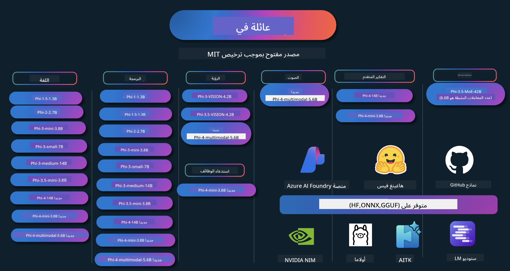

<!--
CO_OP_TRANSLATOR_METADATA:
{
  "original_hash": "1377ae1b0bc9daeaa6a989f750977aeb",
  "translation_date": "2025-03-27T03:06:29+00:00",
  "source_file": "README.md",
  "language_code": "ar"
}
-->
# كتاب طهي Phi: أمثلة عملية باستخدام نماذج Phi من مايكروسوفت

Phi هي سلسلة من نماذج الذكاء الاصطناعي مفتوحة المصدر التي طورتها شركة مايكروسوفت.

حاليًا، يعتبر Phi النموذج اللغوي الصغير (SLM) الأكثر قوة وفعالية من حيث التكلفة، مع أداء ممتاز في معايير متعددة اللغات، التفكير، توليد النصوص/الدردشة، البرمجة، الصور، الصوت، وغيرها من السيناريوهات.

يمكنك نشر Phi على السحابة أو على الأجهزة الطرفية، ويمكنك بسهولة بناء تطبيقات الذكاء الاصطناعي التوليدي باستخدام قدرة حسابية محدودة.

اتبع هذه الخطوات للبدء في استخدام هذه الموارد:
1. **نسخ المستودع**: اضغط 
2. **استنساخ المستودع**:   `git clone https://github.com/microsoft/PhiCookBook.git`
3. [**انضم إلى مجتمع مايكروسوفت AI على Discord وتواصل مع الخبراء والمطورين الآخرين**](https://discord.com/invite/ByRwuEEgH4?WT.mc_id=aiml-137032-kinfeylo)

## 🌐 دعم متعدد اللغات
[الفرنسية](../fr/README.md) | [الإسبانية](../es/README.md) | [الألمانية](../de/README.md) | [الروسية](../ru/README.md) | [العربية](./README.md) | [الفارسية](../fa/README.md) | [الأردية](../ur/README.md) | [الصينية (المبسطة)](../zh/README.md) | [الصينية (التقليدية، ماكاو)](../mo/README.md) | [الصينية (التقليدية، هونغ كونغ)](../hk/README.md) | [الصينية (التقليدية، تايوان)](../tw/README.md) | [اليابانية](../ja/README.md) | [الكورية](../ko/README.md) | [الهندية](../hi/README.md) | [البنغالية](../bn/README.md) | [الماراثية](../mr/README.md) | [النيبالية](../ne/README.md) | [البنجابية (غورمخي)](../pa/README.md) | [البرتغالية (البرتغال)](../pt/README.md) | [البرتغالية (البرازيل)](../br/README.md) | [الإيطالية](../it/README.md) | [البولندية](../pl/README.md) | [التركية](../tr/README.md) | [اليونانية](../el/README.md) | [التايلاندية](../th/README.md) | [السويدية](../sv/README.md) | [الدانماركية](../da/README.md) | [النرويجية](../no/README.md) | [الفنلندية](../fi/README.md) | [الهولندية](../nl/README.md) | [العبرية](../he/README.md) | [الفيتنامية](../vi/README.md) | [الإندونيسية](../id/README.md) | [الماليزية](../ms/README.md) | [التاغالوغية (الفلبينية)](../tl/README.md) | [السواحيلية](../sw/README.md) | [الهنغارية](../hu/README.md) | [التشيكية](../cs/README.md) | [السلوفاكية](../sk/README.md) | [الرومانية](../ro/README.md) | [البلغارية](../bg/README.md) | [الصربية (السيريلية)](../sr/README.md) | [الكرواتية](../hr/README.md) | [السلوفينية](../sl/README.md)
## جدول المحتويات

- المقدمة
  - [مرحباً بكم في عائلة Phi](./md/01.Introduction/01/01.PhiFamily.md)
  - [إعداد بيئتك](./md/01.Introduction/01/01.EnvironmentSetup.md)
  - [فهم التقنيات الرئيسية](./md/01.Introduction/01/01.Understandingtech.md)
  - [سلامة الذكاء الاصطناعي لنماذج Phi](./md/01.Introduction/01/01.AISafety.md)
  - [دعم الأجهزة لـ Phi](./md/01.Introduction/01/01.Hardwaresupport.md)
  - [نماذج Phi وتوفرها عبر المنصات](./md/01.Introduction/01/01.Edgeandcloud.md)
  - [استخدام Guidance-ai وPhi](./md/01.Introduction/01/01.Guidance.md)
  - [نماذج GitHub Marketplace](https://github.com/marketplace/models)
  - [كتالوج نماذج Azure AI](https://ai.azure.com)

- الاستنتاج باستخدام Phi في بيئات مختلفة
    - [Hugging face](./md/01.Introduction/02/01.HF.md)
    - [نماذج GitHub](./md/01.Introduction/02/02.GitHubModel.md)
    - [كتالوج نماذج Azure AI Foundry](./md/01.Introduction/02/03.AzureAIFoundry.md)
    - [Ollama](./md/01.Introduction/02/04.Ollama.md)
    - [AI Toolkit VSCode (AITK)](./md/01.Introduction/02/05.AITK.md)
    - [NVIDIA NIM](./md/01.Introduction/02/06.NVIDIA.md)

- الاستنتاج باستخدام عائلة Phi
    - [الاستنتاج باستخدام Phi في iOS](./md/01.Introduction/03/iOS_Inference.md)
    - [الاستنتاج باستخدام Phi في Android](./md/01.Introduction/03/Android_Inference.md)
    - [الاستنتاج باستخدام Phi في Jetson](./md/01.Introduction/03/Jetson_Inference.md)
    - [الاستنتاج باستخدام Phi في AI PC](./md/01.Introduction/03/AIPC_Inference.md)
    - [الاستنتاج باستخدام Phi مع إطار عمل Apple MLX](./md/01.Introduction/03/MLX_Inference.md)
    - [الاستنتاج باستخدام Phi في الخادم المحلي](./md/01.Introduction/03/Local_Server_Inference.md)
    - [الاستنتاج باستخدام Phi في الخادم البعيد باستخدام AI Toolkit](./md/01.Introduction/03/Remote_Interence.md)
    - [الاستنتاج باستخدام Phi مع Rust](./md/01.Introduction/03/Rust_Inference.md)
    - [الاستنتاج باستخدام Phi--Vision محلياً](./md/01.Introduction/03/Vision_Inference.md)
    - [الاستنتاج باستخدام Phi مع Kaito AKS وحاويات Azure (الدعم الرسمي)](./md/01.Introduction/03/Kaito_Inference.md)

- [كمية عائلة Phi](./md/01.Introduction/04/QuantifyingPhi.md)
    - [كمية Phi-3.5 / 4 باستخدام llama.cpp](./md/01.Introduction/04/UsingLlamacppQuantifyingPhi.md)
    - [كمية Phi-3.5 / 4 باستخدام إضافات الذكاء الاصطناعي التوليدي لـ onnxruntime](./md/01.Introduction/04/UsingORTGenAIQuantifyingPhi.md)
    - [كمية Phi-3.5 / 4 باستخدام Intel OpenVINO](./md/01.Introduction/04/UsingIntelOpenVINOQuantifyingPhi.md)
    - [كمية Phi-3.5 / 4 باستخدام إطار عمل Apple MLX](./md/01.Introduction/04/UsingAppleMLXQuantifyingPhi.md)

- تقييم Phi
- [Response AI](./md/01.Introduction/05/ResponsibleAI.md)
    - [Azure AI Foundry لتقييم النماذج](./md/01.Introduction/05/AIFoundry.md)
    - [استخدام Promptflow لتقييم النماذج](./md/01.Introduction/05/Promptflow.md)
 
- RAG مع Azure AI Search
    - [كيفية استخدام Phi-4-mini و Phi-4-multimodal (RAG) مع Azure AI Search](https://github.com/microsoft/PhiCookBook/blob/main/code/06.E2E/E2E_Phi-4-RAG-Azure-AI-Search.ipynb)

- أمثلة تطوير تطبيقات Phi
  - تطبيقات النصوص والدردشة
    - أمثلة Phi-4 🆕
      - [📓] [الدردشة باستخدام نموذج Phi-4-mini ONNX](./md/02.Application/01.TextAndChat/Phi4/ChatWithPhi4ONNX/README.md)
      - [الدردشة باستخدام نموذج Phi-4 المحلي ONNX في .NET](../../md/04.HOL/dotnet/src/LabsPhi4-Chat-01OnnxRuntime)
      - [تطبيق Console للدردشة في .NET مع Phi-4 ONNX باستخدام Sementic Kernel](../../md/04.HOL/dotnet/src/LabsPhi4-Chat-02SK)
    - أمثلة Phi-3 / 3.5
      - [روبوت دردشة محلي في المتصفح باستخدام Phi-3، ONNX Runtime Web و WebGPU](https://github.com/microsoft/onnxruntime-inference-examples/tree/main/js/chat)
      - [دردشة OpenVino](./md/02.Application/01.TextAndChat/Phi3/E2E_OpenVino_Chat.md)
      - [نموذج متعدد - تفاعل Phi-3-mini و OpenAI Whisper](./md/02.Application/01.TextAndChat/Phi3/E2E_Phi-3-mini_with_whisper.md)
      - [MLFlow - بناء غلاف واستخدام Phi-3 مع MLFlow](./md//02.Application/01.TextAndChat/Phi3/E2E_Phi-3-MLflow.md)
      - [تحسين النماذج - كيفية تحسين نموذج Phi-3-min لـ ONNX Runtime Web باستخدام Olive](https://github.com/microsoft/Olive/tree/main/examples/phi3)
      - [تطبيق WinUI3 مع Phi-3 mini-4k-instruct-onnx](https://github.com/microsoft/Phi3-Chat-WinUI3-Sample/)
      - [تطبيق ملاحظات مدعوم بالذكاء الاصطناعي باستخدام WinUI3](https://github.com/microsoft/ai-powered-notes-winui3-sample)
      - [تخصيص ودمج نماذج Phi-3 مع Prompt flow](./md/02.Application/01.TextAndChat/Phi3/E2E_Phi-3-FineTuning_PromptFlow_Integration.md)
      - [تخصيص ودمج نماذج Phi-3 مع Prompt flow في Azure AI Foundry](./md/02.Application/01.TextAndChat/Phi3/E2E_Phi-3-FineTuning_PromptFlow_Integration_AIFoundry.md)
      - [تقييم نموذج Phi-3 / Phi-3.5 المُحسن في Azure AI Foundry مع التركيز على مبادئ الذكاء الاصطناعي المسؤول من Microsoft](./md/02.Application/01.TextAndChat/Phi3/E2E_Phi-3-Evaluation_AIFoundry.md)
      - [📓] [مثال لتوقع اللغة باستخدام Phi-3.5-mini-instruct (الصينية/الإنجليزية)](../../md/02.Application/01.TextAndChat/Phi3/phi3-instruct-demo.ipynb)
      - [روبوت دردشة RAG باستخدام Phi-3.5-Instruct WebGPU](./md/02.Application/01.TextAndChat/Phi3/WebGPUWithPhi35Readme.md)
      - [استخدام GPU في Windows لإنشاء حل Prompt flow مع Phi-3.5-Instruct ONNX](./md/02.Application/01.TextAndChat/Phi3/UsingPromptFlowWithONNX.md)
      - [استخدام Microsoft Phi-3.5 tflite لإنشاء تطبيق Android](./md/02.Application/01.TextAndChat/Phi3/UsingPhi35TFLiteCreateAndroidApp.md)
      - [مثال Q&A في .NET باستخدام نموذج Phi-3 المحلي ONNX باستخدام Microsoft.ML.OnnxRuntime](../../md/04.HOL/dotnet/src/LabsPhi301)
      - [تطبيق دردشة Console في .NET مع Semantic Kernel و Phi-3](../../md/04.HOL/dotnet/src/LabsPhi302)

  - أمثلة قائمة على SDK الاستدلال في Azure AI
    - أمثلة Phi-4 🆕
      - [📓] [إنشاء كود المشروع باستخدام Phi-4-multimodal](./md/02.Application/02.Code/Phi4/GenProjectCode/README.md)
    - أمثلة Phi-3 / 3.5
      - [بناء روبوت دردشة GitHub Copilot الخاص بك في Visual Studio Code باستخدام عائلة Phi-3](./md/02.Application/02.Code/Phi3/VSCodeExt/README.md)
      - [إنشاء وكيل دردشة Copilot الخاص بك في Visual Studio Code باستخدام Phi-3.5 بواسطة نماذج GitHub](/md/02.Application/02.Code/Phi3/CreateVSCodeChatAgentWithGitHubModels.md)

  - أمثلة التفكير المتقدم
    - أمثلة Phi-4 🆕
      - [📓] [أمثلة التفكير باستخدام Phi-4-mini](./md/02.Application/03.AdvancedReasoning/Phi4/AdvancedResoningPhi4mini/README.md)
  
  - العروض التوضيحية
      - [العروض التوضيحية لـ Phi-4-mini المستضافة على Hugging Face Spaces](https://huggingface.co/spaces/microsoft/phi-4-mini?WT.mc_id=aiml-137032-kinfeylo)
      - [العروض التوضيحية لـ Phi-4-multimodal المستضافة على Hugging Face Spaces](https://huggingface.co/spaces/microsoft/phi-4-multimodal?WT.mc_id=aiml-137032-kinfeylo)
  - أمثلة الرؤية
    - أمثلة Phi-4 🆕
      - [📓] [استخدام Phi-4-multimodal لقراءة الصور وإنشاء الكود](./md/02.Application/04.Vision/Phi4/CreateFrontend/README.md) 
    - أمثلة Phi-3 / 3.5
- [📓][Phi-3-vision-Image text to text](../../md/02.Application/04.Vision/Phi3/E2E_Phi-3-vision-image-text-to-text-online-endpoint.ipynb)  
      - [Phi-3-vision-ONNX](https://onnxruntime.ai/docs/genai/tutorials/phi3-v.html)  
      - [📓][Phi-3-vision CLIP Embedding](../../md/02.Application/04.Vision/Phi3/E2E_Phi-3-vision-image-text-to-text-online-endpoint.ipynb)  
      - [DEMO: Phi-3 Recycling](https://github.com/jennifermarsman/PhiRecycling/)  
      - [Phi-3-vision - مساعد لغة بصري - باستخدام Phi3-Vision و OpenVINO](https://docs.openvino.ai/nightly/notebooks/phi-3-vision-with-output.html)  
      - [Phi-3 Vision Nvidia NIM](./md/02.Application/04.Vision/Phi3/E2E_Nvidia_NIM_Vision.md)  
      - [Phi-3 Vision OpenVino](./md/02.Application/04.Vision/Phi3/E2E_OpenVino_Phi3Vision.md)  
      - [📓][Phi-3.5 Vision مثال متعدد الإطارات أو متعدد الصور](../../md/02.Application/04.Vision/Phi3/phi3-vision-demo.ipynb)  
      - [Phi-3 Vision نموذج ONNX محلي باستخدام Microsoft.ML.OnnxRuntime .NET](../../md/04.HOL/dotnet/src/LabsPhi303)  
      - [نموذج ONNX محلي لـ Phi-3 Vision يعتمد على القائمة باستخدام Microsoft.ML.OnnxRuntime .NET](../../md/04.HOL/dotnet/src/LabsPhi304)  

  - عينات الصوت  
    - عينات Phi-4 🆕  
      - [📓] [استخراج النصوص الصوتية باستخدام Phi-4-multimodal](./md/02.Application/05.Audio/Phi4/Transciption/README.md)  
      - [📓] [عينة صوتية لـ Phi-4-multimodal](../../md/02.Application/05.Audio/Phi4/Siri/demo.ipynb)  
      - [📓] [عينة ترجمة الكلام باستخدام Phi-4-multimodal](../../md/02.Application/05.Audio/Phi4/Translate/demo.ipynb)  
      - [.NET تطبيق كونسول باستخدام Phi-4-multimodal لتحليل ملف صوتي وإنشاء نص](../../md/04.HOL/dotnet/src/LabsPhi4-MultiModal-02Audio)  

  - عينات MOE  
    - عينات Phi-3 / 3.5  
      - [📓] [نماذج Phi-3.5 Mixture of Experts (MoEs) عينة وسائل التواصل الاجتماعي](../../md/02.Application/06.MoE/Phi3/phi3_moe_demo.ipynb)  
      - [📓] [بناء خط أنابيب RAG باستخدام NVIDIA NIM Phi-3 MOE و Azure AI Search و LlamaIndex](../../md/02.Application/06.MoE/Phi3/azure-ai-search-nvidia-rag.ipynb)  

  - عينات استدعاء الوظائف  
    - عينات Phi-4 🆕  
      - [📓] [استخدام استدعاء الوظائف مع Phi-4-mini](./md/02.Application/07.FunctionCalling/Phi4/FunctionCallingBasic/README.md)  
      - [📓] [استخدام استدعاء الوظائف لإنشاء وكلاء متعددين باستخدام Phi-4-mini](../../md/02.Application/07.FunctionCalling/Phi4/Multiagents/Phi_4_mini_multiagent.ipynb)  
      - [📓] [استخدام استدعاء الوظائف مع Ollama](../../md/02.Application/07.FunctionCalling/Phi4/Ollama/ollama_functioncalling.ipynb)  

  - عينات خلط الوسائط المتعددة  
    - عينات Phi-4 🆕  
      - [📓] [استخدام Phi-4-multimodal كصحفي تقني](../../md/02.Application/08.Multimodel/Phi4/TechJournalist/phi_4_mm_audio_text_publish_news.ipynb)  
      - [.NET تطبيق كونسول باستخدام Phi-4-multimodal لتحليل الصور](../../md/04.HOL/dotnet/src/LabsPhi4-MultiModal-01Images)  

- تحسين Phi  
  - [سيناريوهات التحسين](./md/03.FineTuning/FineTuning_Scenarios.md)  
  - [التحسين مقابل RAG](./md/03.FineTuning/FineTuning_vs_RAG.md)  
  - [تحسين Phi-3 ليصبح خبيرًا صناعيًا](./md/03.FineTuning/LetPhi3gotoIndustriy.md)  
  - [تحسين Phi-3 باستخدام أدوات الذكاء الاصطناعي لـ VS Code](./md/03.FineTuning/Finetuning_VSCodeaitoolkit.md)  
  - [تحسين Phi-3 باستخدام خدمة Azure Machine Learning](./md/03.FineTuning/Introduce_AzureML.md)  
  - [تحسين Phi-3 باستخدام Lora](./md/03.FineTuning/FineTuning_Lora.md)  
  - [تحسين Phi-3 باستخدام QLora](./md/03.FineTuning/FineTuning_Qlora.md)  
  - [تحسين Phi-3 باستخدام Azure AI Foundry](./md/03.FineTuning/FineTuning_AIFoundry.md)  
  - [تحسين Phi-3 باستخدام Azure ML CLI/SDK](./md/03.FineTuning/FineTuning_MLSDK.md)  
- [التخصيص باستخدام Microsoft Olive](./md/03.FineTuning/FineTuning_MicrosoftOlive.md)
  - [مختبر عملي للتخصيص باستخدام Microsoft Olive](./md/03.FineTuning/olive-lab/readme.md)
  - [تخصيص Phi-3-vision باستخدام Weights and Bias](./md/03.FineTuning/FineTuning_Phi-3-visionWandB.md)
  - [تخصيص Phi-3 باستخدام إطار عمل Apple MLX](./md/03.FineTuning/FineTuning_MLX.md)
  - [تخصيص Phi-3-vision (الدعم الرسمي)](./md/03.FineTuning/FineTuning_Vision.md)
  - [تخصيص Phi-3 باستخدام Kaito AKS وحاويات Azure (الدعم الرسمي)](./md/03.FineTuning/FineTuning_Kaito.md)
  - [تخصيص Phi-3 و3.5 Vision](https://github.com/2U1/Phi3-Vision-Finetune)

- مختبر عملي
  - [استكشاف النماذج المتطورة: LLMs، SLMs، التطوير المحلي والمزيد](https://github.com/microsoft/aitour-exploring-cutting-edge-models)
  - [تحقيق الإمكانيات في معالجة اللغة الطبيعية: التخصيص باستخدام Microsoft Olive](https://github.com/azure/Ignite_FineTuning_workshop)

- الأوراق البحثية الأكاديمية والمنشورات
  - [Textbooks Are All You Need II: تقرير تقني عن phi-1.5](https://arxiv.org/abs/2309.05463)
  - [تقرير تقني عن Phi-3: نموذج لغة قوي يمكن تشغيله محليًا على هاتفك](https://arxiv.org/abs/2404.14219)
  - [تقرير تقني عن Phi-4](https://arxiv.org/abs/2412.08905)
  - [تقرير تقني عن Phi-4-Mini: نماذج لغة متعددة الوسائط قوية ومضغوطة باستخدام Mixture-of-LoRAs](https://arxiv.org/abs/2503.01743)
  - [تحسين نماذج اللغة الصغيرة للوظائف داخل السيارة](https://arxiv.org/abs/2501.02342)
  - [(WhyPHI) تخصيص PHI-3 للإجابة على أسئلة الاختيار المتعدد: المنهجية، النتائج، والتحديات](https://arxiv.org/abs/2501.01588)

## استخدام نماذج Phi

### Phi على Azure AI Foundry

يمكنك التعرف على كيفية استخدام Microsoft Phi وكيفية بناء حلول شاملة على مختلف الأجهزة. لتجربة Phi بنفسك، ابدأ بتجربة النماذج وتخصيص Phi لسيناريوهاتك باستخدام [كتالوج نماذج Azure AI Foundry](https://aka.ms/phi3-azure-ai). يمكنك معرفة المزيد من خلال البدء مع [Azure AI Foundry](/md/02.QuickStart/AzureAIFoundry_QuickStart.md).

**المنصة التجريبية**
كل نموذج يحتوي على منصة تجريبية مخصصة لاختبار النموذج [Azure AI Playground](https://aka.ms/try-phi3).

### Phi على GitHub Models

يمكنك التعرف على كيفية استخدام Microsoft Phi وكيفية بناء حلول شاملة على مختلف الأجهزة. لتجربة Phi بنفسك، ابدأ بتجربة النموذج وتخصيص Phi لسيناريوهاتك باستخدام [كتالوج نماذج GitHub](https://github.com/marketplace/models?WT.mc_id=aiml-137032-kinfeylo). يمكنك معرفة المزيد من خلال البدء مع [GitHub Model Catalog](/md/02.QuickStart/GitHubModel_QuickStart.md).

**المنصة التجريبية**
كل نموذج يحتوي على [منصة تجريبية لاختبار النموذج](/md/02.QuickStart/GitHubModel_QuickStart.md).

### Phi على Hugging Face

يمكنك أيضًا العثور على النموذج على [Hugging Face](https://huggingface.co/microsoft).

**المنصة التجريبية**
[منصة Hugging Chat التجريبية](https://huggingface.co/chat/models/microsoft/Phi-3-mini-4k-instruct).

## الذكاء الاصطناعي المسؤول

تلتزم Microsoft بمساعدة عملائها في استخدام منتجات الذكاء الاصطناعي بطريقة مسؤولة، ومشاركة الدروس المستفادة، وبناء شراكات قائمة على الثقة من خلال أدوات مثل ملاحظات الشفافية وتقييم الأثر. يمكن العثور على العديد من هذه الموارد في [https://aka.ms/RAI](https://aka.ms/RAI).  
نهج Microsoft في الذكاء الاصطناعي المسؤول يرتكز على مبادئ الذكاء الاصطناعي الخاصة بنا مثل الإنصاف، والموثوقية والسلامة، والخصوصية والأمان، والشمولية، والشفافية، والمساءلة.

النماذج الكبيرة للغة الطبيعية، والصور، والصوت - مثل تلك المستخدمة في هذا المثال - قد تتصرف بطرق غير عادلة أو غير موثوقة أو مهينة، مما قد يسبب أضرارًا. يرجى مراجعة [ملاحظة الشفافية لخدمة Azure OpenAI](https://learn.microsoft.com/legal/cognitive-services/openai/transparency-note?tabs=text) لتكون على اطلاع بالمخاطر والقيود.

النهج الموصى به لتقليل هذه المخاطر هو تضمين نظام أمان في بنية التطبيق يمكنه الكشف عن السلوك الضار ومنعه. [أمان المحتوى في Azure AI](https://learn.microsoft.com/azure/ai-services/content-safety/overview) يوفر طبقة حماية مستقلة، قادرة على اكتشاف المحتوى الضار الناتج عن المستخدم أو الذكاء الاصطناعي في التطبيقات والخدمات. يشمل أمان المحتوى في Azure AI واجهات برمجة تطبيقات للنصوص والصور تتيح لك الكشف عن المواد الضارة. ضمن Azure AI Foundry، تتيح خدمة أمان المحتوى عرض واستكشاف وتجربة أكواد أمثلة للكشف عن المحتوى الضار عبر وسائط مختلفة. الوثائق التالية [البدء السريع](https://learn.microsoft.com/azure/ai-services/content-safety/quickstart-text?tabs=visual-studio%2Clinux&pivots=programming-language-rest) ترشدك خلال تقديم الطلبات إلى الخدمة.

جانب آخر يجب أخذه في الاعتبار هو الأداء العام للتطبيق. مع التطبيقات متعددة الوسائط والنماذج، نعتبر الأداء يعني أن النظام يعمل كما تتوقع أنت ومستخدموك، بما في ذلك عدم توليد مخرجات ضارة. من المهم تقييم أداء التطبيق العام باستخدام [مقيمي الأداء والجودة ومقيمي المخاطر والسلامة](https://learn.microsoft.com/azure/ai-studio/concepts/evaluation-metrics-built-in). لديك أيضًا القدرة على إنشاء وتقييم [مقيمي مخصصين](https://learn.microsoft.com/azure/ai-studio/how-to/develop/evaluate-sdk#custom-evaluators).
يمكنك تقييم تطبيق الذكاء الاصطناعي الخاص بك في بيئة التطوير باستخدام [Azure AI Evaluation SDK](https://microsoft.github.io/promptflow/index.html). يتم قياس نتائج تطبيق الذكاء الاصطناعي التوليدي الخاص بك كميًا باستخدام أدوات التقييم المدمجة أو أدوات التقييم المخصصة التي تختارها، بناءً على مجموعة بيانات اختبار أو هدف معين. للبدء باستخدام Azure AI Evaluation SDK لتقييم نظامك، يمكنك اتباع [دليل البدء السريع](https://learn.microsoft.com/azure/ai-studio/how-to/develop/flow-evaluate-sdk). بمجرد تنفيذ عملية التقييم، يمكنك [تصوير النتائج في Azure AI Foundry](https://learn.microsoft.com/azure/ai-studio/how-to/evaluate-flow-results).

## العلامات التجارية

قد يحتوي هذا المشروع على علامات تجارية أو شعارات لمشاريع أو منتجات أو خدمات. يجب أن يكون الاستخدام المصرح به للعلامات التجارية أو الشعارات الخاصة بشركة Microsoft متوافقًا مع [إرشادات العلامات التجارية لشركة Microsoft](https://www.microsoft.com/legal/intellectualproperty/trademarks/usage/general).  
يجب أن لا يسبب استخدام العلامات التجارية أو الشعارات الخاصة بشركة Microsoft في نسخ معدلة من هذا المشروع أي التباس أو يشير ضمنيًا إلى رعاية Microsoft. أي استخدام للعلامات التجارية أو الشعارات الخاصة بأطراف ثالثة يخضع لسياسات تلك الأطراف.

**إخلاء المسؤولية**:  
تم ترجمة هذا المستند باستخدام خدمة الترجمة بالذكاء الاصطناعي [Co-op Translator](https://github.com/Azure/co-op-translator). بينما نسعى لتحقيق الدقة، يرجى العلم أن الترجمات الآلية قد تحتوي على أخطاء أو معلومات غير دقيقة. يجب اعتبار المستند الأصلي بلغته الأصلية هو المصدر الرسمي. للحصول على معلومات حساسة، يُوصى بالاستعانة بخدمة ترجمة بشرية احترافية. نحن غير مسؤولين عن أي سوء فهم أو تفسير خاطئ ينشأ عن استخدام هذه الترجمة.