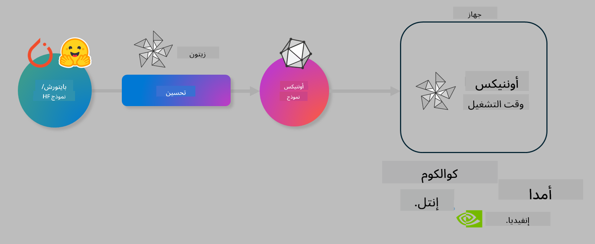

<!--
CO_OP_TRANSLATOR_METADATA:
{
  "original_hash": "6bbe47de3b974df7eea29dfeccf6032b",
  "translation_date": "2025-03-27T03:35:16+00:00",
  "source_file": "code\\03.Finetuning\\olive-lab\\readme.md",
  "language_code": "ar"
}
-->
# مختبر. تحسين نماذج الذكاء الاصطناعي للتنفيذ على الجهاز

## المقدمة

> [!IMPORTANT]
> هذا المختبر يتطلب **وحدة معالجة الرسومات Nvidia A10 أو A100** مع برامج التشغيل المرتبطة وأدوات CUDA (الإصدار 12+).

> [!NOTE]
> هذا مختبر مدته **35 دقيقة** يوفر لك مقدمة عملية للمفاهيم الأساسية لتحسين النماذج للتنفيذ على الجهاز باستخدام OLIVE.

## أهداف التعلم

بنهاية هذا المختبر، ستتمكن من استخدام OLIVE لـ:

- تقليل حجم نموذج الذكاء الاصطناعي باستخدام طريقة AWQ.
- تحسين نموذج الذكاء الاصطناعي لمهمة معينة.
- إنشاء محولات LoRA (النموذج المحسن) للتنفيذ الفعّال على الجهاز باستخدام ONNX Runtime.

### ما هو Olive؟

Olive (*O*NNX *live*) هو مجموعة أدوات لتحسين النماذج مع واجهة CLI مرافقة تمكنك من نشر النماذج لـ ONNX runtime +++https://onnxruntime.ai+++ بجودة وأداء عاليين.



المدخلات لـ Olive عادة ما تكون نموذج PyTorch أو Hugging Face، والمخرجات هي نموذج ONNX محسن يتم تشغيله على جهاز (هدف النشر) يعمل بـ ONNX runtime. يقوم Olive بتحسين النموذج لتناسب مسرّع الذكاء الاصطناعي للجهاز (NPU، GPU، CPU) الذي يوفره بائع الأجهزة مثل Qualcomm، AMD، Nvidia أو Intel.

Olive ينفذ *workflow*، وهو تسلسل من مهام تحسين النماذج الفردية تسمى *passes* - أمثلة على هذه المهام تشمل: ضغط النموذج، التقاط الرسم البياني، تقليل الحجم، تحسين الرسم البياني. كل مهمة لديها مجموعة من المعايير التي يمكن ضبطها لتحقيق أفضل النتائج، مثل الدقة والسرعة، التي يتم تقييمها بواسطة المقيم المناسب. يستخدم Olive استراتيجية بحث تعتمد على خوارزمية بحث لضبط كل مهمة بشكل فردي أو مجموعة من المهام معًا.

#### فوائد Olive

- **تقليل الإحباط والوقت** الناتج عن التجربة والخطأ اليدوية مع تقنيات مختلفة لتحسين الرسم البياني، الضغط، وتقليل الحجم. حدد قيود الجودة والأداء الخاصة بك ودع Olive يجد أفضل نموذج لك تلقائيًا.
- **أكثر من 40 مكونًا مدمجًا لتحسين النماذج** تغطي أحدث التقنيات في تقليل الحجم، الضغط، تحسين الرسم البياني، والتحسين.
- **واجهة CLI سهلة الاستخدام** للمهام الشائعة لتحسين النماذج. على سبيل المثال، olive quantize، olive auto-opt، olive finetune.
- التعبئة والنشر للنماذج مدمجة.
- يدعم إنشاء نماذج لـ **Multi LoRA serving**.
- بناء سير العمل باستخدام YAML/JSON لتنظيم مهام تحسين النماذج والنشر.
- تكامل مع **Hugging Face** و **Azure AI**.
- آلية **التخزين المؤقت** المدمجة لـ **توفير التكاليف**.

## تعليمات المختبر
> [!NOTE]
> تأكد من إعداد Azure AI Hub والمشروع الخاص بك وإعداد وحدة A100 كما هو موضح في مختبر 1.

### الخطوة 0: الاتصال بـ Azure AI Compute

ستتصل بـ Azure AI Compute باستخدام ميزة الاتصال عن بُعد في **VS Code.**

1. افتح تطبيق سطح المكتب **VS Code**:
1. افتح **لوحة الأوامر** باستخدام **Shift+Ctrl+P**
1. في لوحة الأوامر، ابحث عن **AzureML - remote: Connect to compute instance in New Window**.
1. اتبع التعليمات الظاهرة على الشاشة للاتصال بـ Compute. سيتضمن ذلك اختيار اشتراك Azure الخاص بك، مجموعة الموارد، المشروع واسم Compute الذي أعددته في مختبر 1.
1. بمجرد الاتصال بـ Azure ML Compute، سيتم عرضه في **الزاوية السفلية اليسرى من Visual Code** `><Azure ML: Compute Name`

### الخطوة 1: نسخ هذا المستودع

في VS Code، يمكنك فتح نافذة طرفية جديدة باستخدام **Ctrl+J** ونسخ هذا المستودع:

في الطرفية، يجب أن ترى المطالبة

```
azureuser@computername:~/cloudfiles/code$ 
```
نسخ الحل

```bash
cd ~/localfiles
git clone https://github.com/microsoft/phi-3cookbook.git
```

### الخطوة 2: فتح المجلد في VS Code

لفتح VS Code في المجلد المناسب، نفذ الأمر التالي في الطرفية، والذي سيفتح نافذة جديدة:

```bash
code phi-3cookbook/code/04.Finetuning/Olive-lab
```

بدلاً من ذلك، يمكنك فتح المجلد من خلال تحديد **File** > **Open Folder**.

### الخطوة 3: تثبيت التبعيات

افتح نافذة طرفية في VS Code في Azure AI Compute Instance (نصيحة: **Ctrl+J**) ونفذ الأوامر التالية لتثبيت التبعيات:

```bash
conda create -n olive-ai python=3.11 -y
conda activate olive-ai
pip install -r requirements.txt
az extension remove -n azure-cli-ml
az extension add -n ml
```

> [!NOTE]
> سيستغرق ~5 دقائق لتثبيت جميع التبعيات.

في هذا المختبر، ستقوم بتنزيل وتحميل النماذج إلى كتالوج نماذج Azure AI. لكي تتمكن من الوصول إلى كتالوج النماذج، ستحتاج إلى تسجيل الدخول إلى Azure باستخدام:

```bash
az login
```

> [!NOTE]
> عند تسجيل الدخول، سيُطلب منك اختيار الاشتراك. تأكد من اختيار الاشتراك المخصص لهذا المختبر.

### الخطوة 4: تنفيذ أوامر Olive

افتح نافذة طرفية في VS Code في Azure AI Compute Instance (نصيحة: **Ctrl+J**) وتأكد من تنشيط بيئة `olive-ai` conda:

```bash
conda activate olive-ai
```

بعد ذلك، نفذ أوامر Olive التالية في سطر الأوامر.

1. **فحص البيانات:** في هذا المثال، ستقوم بتحسين نموذج Phi-3.5-Mini بحيث يكون متخصصًا في الإجابة على الأسئلة المتعلقة بالسفر. الكود أدناه يعرض السجلات الأولى من مجموعة البيانات، والتي تكون بتنسيق JSON lines:

    ```bash
    head data/data_sample_travel.jsonl
    ```
1. **تقليل حجم النموذج:** قبل تدريب النموذج، قم أولاً بتقليله باستخدام الأمر التالي الذي يستخدم تقنية تسمى Active Aware Quantization (AWQ) +++https://arxiv.org/abs/2306.00978+++. تقوم AWQ بتقليل أوزان النموذج من خلال مراعاة التفاعلات الناتجة أثناء التنفيذ. هذا يعني أن عملية التقليل تأخذ في الاعتبار توزيع البيانات الفعلي في التفاعلات، مما يؤدي إلى الحفاظ بشكل أفضل على دقة النموذج مقارنةً بطرق تقليل الأوزان التقليدية.

    ```bash
    olive quantize \
       --model_name_or_path microsoft/Phi-3.5-mini-instruct \
       --trust_remote_code \
       --algorithm awq \
       --output_path models/phi/awq \
       --log_level 1
    ```
    
    يستغرق **~8 دقائق** لإكمال تقليل الحجم باستخدام AWQ، مما سيؤدي إلى **تقليل حجم النموذج من ~7.5GB إلى ~2.5GB**.
   
   في هذا المختبر، نعرض لك كيفية إدخال نماذج من Hugging Face (على سبيل المثال: `microsoft/Phi-3.5-mini-instruct`). However, Olive also allows you to input models from the Azure AI catalog by updating the `model_name_or_path` argument to an Azure AI asset ID (for example:  `azureml://registries/azureml/models/Phi-3.5-mini-instruct/versions/4`). 

1. **Train the model:** Next, the `olive finetune` الأمر يحسن النموذج المقلل. تقليل حجم النموذج *قبل* التحسين بدلاً من بعده يعطي دقة أفضل حيث تستعيد عملية التحسين بعض الفقد الناتج عن تقليل الحجم.

    ```bash
    olive finetune \
        --method lora \
        --model_name_or_path models/phi/awq \
        --data_files "data/data_sample_travel.jsonl" \
        --data_name "json" \
        --text_template "<|user|>\n{prompt}<|end|>\n<|assistant|>\n{response}<|end|>" \
        --max_steps 100 \
        --output_path ./models/phi/ft \
        --log_level 1
    ```
    
    يستغرق **~6 دقائق** لإكمال التحسين (مع 100 خطوة).

1. **تحسين النموذج:** بعد تدريب النموذج، تقوم الآن بتحسينه باستخدام أمر `auto-opt` command, which will capture the ONNX graph and automatically perform a number of optimizations to improve the model performance for CPU by compressing the model and doing fusions. It should be noted, that you can also optimize for other devices such as NPU or GPU by just updating the `--device` and `--provider` الخاص بـ Olive - ولكن لأغراض هذا المختبر، سنستخدم CPU.

    ```bash
    olive auto-opt \
       --model_name_or_path models/phi/ft/model \
       --adapter_path models/phi/ft/adapter \
       --device cpu \
       --provider CPUExecutionProvider \
       --use_ort_genai \
       --output_path models/phi/onnx-ao \
       --log_level 1
    ```
    
    يستغرق **~5 دقائق** لإكمال التحسين.

### الخطوة 5: اختبار سريع لتنفيذ النموذج

لاختبار تنفيذ النموذج، قم بإنشاء ملف Python في المجلد الخاص بك باسم **app.py** ونسخ ولصق الكود التالي:

```python
import onnxruntime_genai as og
import numpy as np

print("loading model and adapters...", end="", flush=True)
model = og.Model("models/phi/onnx-ao/model")
adapters = og.Adapters(model)
adapters.load("models/phi/onnx-ao/model/adapter_weights.onnx_adapter", "travel")
print("DONE!")

tokenizer = og.Tokenizer(model)
tokenizer_stream = tokenizer.create_stream()

params = og.GeneratorParams(model)
params.set_search_options(max_length=100, past_present_share_buffer=False)
user_input = "what is the best thing to see in chicago"
params.input_ids = tokenizer.encode(f"<|user|>\n{user_input}<|end|>\n<|assistant|>\n")

generator = og.Generator(model, params)

generator.set_active_adapter(adapters, "travel")

print(f"{user_input}")

while not generator.is_done():
    generator.compute_logits()
    generator.generate_next_token()

    new_token = generator.get_next_tokens()[0]
    print(tokenizer_stream.decode(new_token), end='', flush=True)

print("\n")
```

نفذ الكود باستخدام:

```bash
python app.py
```

### الخطوة 6: تحميل النموذج إلى Azure AI

تحميل النموذج إلى مستودع نماذج Azure AI يجعله قابلًا للمشاركة مع أعضاء فريق التطوير الخاص بك ويتعامل أيضًا مع التحكم في إصدارات النموذج. لتحميل النموذج، نفذ الأمر التالي:

> [!NOTE]
> قم بتحديث `{}` ` placeholders with the name of your resource group and Azure AI Project Name. 

To find your resource group ` "resourceGroup" واسم مشروع Azure AI، نفذ الأمر التالي

```
az ml workspace show
```

أو من خلال الذهاب إلى +++ai.azure.com+++ واختيار **management center** **project** **overview**

قم بتحديث `{}` بالاسم الخاص بمجموعة الموارد واسم مشروع Azure AI.

```bash
az ml model create \
    --name ft-for-travel \
    --version 1 \
    --path ./models/phi/onnx-ao \
    --resource-group {RESOURCE_GROUP_NAME} \
    --workspace-name {PROJECT_NAME}
```
يمكنك بعد ذلك رؤية النموذج الذي تم تحميله ونشر النموذج الخاص بك على https://ml.azure.com/model/list

**إخلاء المسؤولية**:  
تم ترجمة هذه الوثيقة باستخدام خدمة الترجمة بالذكاء الاصطناعي [Co-op Translator](https://github.com/Azure/co-op-translator). بينما نسعى لتحقيق الدقة، يُرجى العلم أن الترجمات الآلية قد تحتوي على أخطاء أو معلومات غير دقيقة. يجب اعتبار الوثيقة الأصلية بلغتها الأصلية المصدر الرسمي. للحصول على معلومات حساسة أو هامة، يُوصى بالاستعانة بترجمة بشرية احترافية. نحن غير مسؤولين عن أي سوء فهم أو تفسيرات خاطئة تنشأ نتيجة استخدام هذه الترجمة.