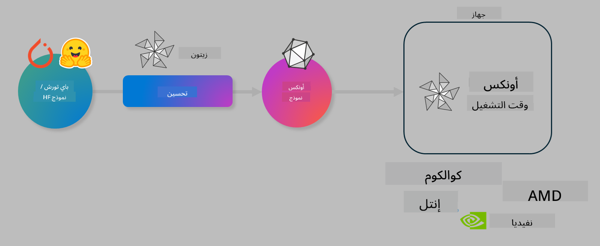

<!--
CO_OP_TRANSLATOR_METADATA:
{
  "original_hash": "6bbe47de3b974df7eea29dfeccf6032b",
  "translation_date": "2025-03-27T03:53:41+00:00",
  "source_file": "code\\04.Finetuning\\olive-lab\\readme.md",
  "language_code": "ar"
}
-->
# مختبر. تحسين نماذج الذكاء الاصطناعي للاستدلال على الجهاز

## المقدمة

> [!IMPORTANT]
> يتطلب هذا المختبر وجود **وحدة معالجة الرسومات Nvidia A10 أو A100** مع تثبيت برامج التشغيل وأدوات CUDA (الإصدار 12+).

> [!NOTE]
> هذا مختبر مدته **35 دقيقة** يمنحك مقدمة عملية للمفاهيم الأساسية لتحسين النماذج للاستدلال على الجهاز باستخدام OLIVE.

## أهداف التعلم

بحلول نهاية هذا المختبر، ستتمكن من استخدام OLIVE لـ:

- تقليل دقة نموذج ذكاء اصطناعي باستخدام طريقة تقليل الدقة AWQ.
- تحسين نموذج ذكاء اصطناعي لمهمة معينة.
- إنشاء مرفقات LoRA (نموذج محسّن) لاستدلال فعال على الجهاز باستخدام ONNX Runtime.

### ما هو Olive

Olive (*O*NNX *live*) هي أداة لتحسين النماذج مزودة بواجهة سطر أوامر (CLI) تمكنك من نشر النماذج لـ ONNX runtime +++https://onnxruntime.ai+++ مع الحفاظ على الجودة والأداء.



يكون الإدخال لـ Olive عادةً نموذج PyTorch أو Hugging Face، ويكون الناتج نموذج ONNX محسن يتم تنفيذه على جهاز (هدف النشر) يعمل بـ ONNX runtime. يقوم Olive بتحسين النموذج وفقًا لمسرّع الذكاء الاصطناعي (NPU، GPU، CPU) الخاص بجهاز النشر الذي توفره شركات الأجهزة مثل Qualcomm، AMD، Nvidia أو Intel.

يقوم Olive بتنفيذ *سير عمل*، وهو تسلسل مرتب من مهام تحسين النموذج الفردية التي تُسمى *passes*. تشمل الأمثلة على ذلك: ضغط النموذج، التقاط الرسم البياني، تقليل الدقة، تحسين الرسم البياني. لكل خطوة مجموعة من المعلمات التي يمكن تعديلها لتحقيق أفضل المقاييس مثل الدقة والكمون، والتي يتم تقييمها بواسطة المُقيّم المناسب. يستخدم Olive استراتيجية بحث تعتمد على خوارزمية بحث لضبط كل خطوة تلقائيًا واحدة تلو الأخرى أو مجموعة من الخطوات معًا.

#### فوائد Olive

- **تقليل الإحباط والوقت** الناتج عن التجربة والخطأ اليدوية مع تقنيات مختلفة لتحسين الرسوم البيانية، الضغط، وتقليل الدقة. حدد قيود الجودة والأداء الخاصة بك ودع Olive يجد النموذج الأفضل لك تلقائيًا.
- **أكثر من 40 مكونًا مدمجًا لتحسين النماذج** تغطي تقنيات متقدمة في تقليل الدقة، الضغط، تحسين الرسوم البيانية، والتحسين.
- **واجهة CLI سهلة الاستخدام** للمهام الشائعة في تحسين النماذج. على سبيل المثال، olive quantize، olive auto-opt، olive finetune.
- تضمين التعبئة والنشر للنماذج.
- دعم إنشاء نماذج لـ **Multi LoRA serving**.
- بناء سير العمل باستخدام YAML/JSON لتنظيم مهام تحسين النماذج والنشر.
- تكامل مع **Hugging Face** و **Azure AI**.
- آلية **التخزين المؤقت المدمجة** لتقليل التكاليف.

## تعليمات المختبر

> [!NOTE]
> يرجى التأكد من توفير Azure AI Hub والمشروع الخاص بك وتكوين A100 كما هو موضح في المختبر 1.

### الخطوة 0: الاتصال بحوسبة Azure AI

ستتصل بحوسبة Azure AI باستخدام ميزة الاتصال عن بُعد في **VS Code.**

1. افتح تطبيق **VS Code** على سطح المكتب:
1. افتح **لوحة الأوامر** باستخدام **Shift+Ctrl+P**.
1. في لوحة الأوامر، ابحث عن **AzureML - remote: Connect to compute instance in New Window**.
1. اتبع التعليمات التي تظهر على الشاشة للاتصال بالحوسبة. سيتضمن ذلك تحديد اشتراك Azure الخاص بك، مجموعة الموارد، المشروع، واسم الحوسبة الذي أعددته في المختبر 1.
1. بمجرد الاتصال بعقدة حوسبة Azure ML، سيتم عرض ذلك في **الجزء السفلي الأيسر من Visual Code** `><Azure ML: Compute Name`

### الخطوة 1: نسخ هذا المستودع

في VS Code، يمكنك فتح نافذة طرفية جديدة باستخدام **Ctrl+J** ونسخ هذا المستودع:

في الطرفية، يجب أن ترى الإشارة

```
azureuser@computername:~/cloudfiles/code$ 
```
نسخ الحل

```bash
cd ~/localfiles
git clone https://github.com/microsoft/phi-3cookbook.git
```

### الخطوة 2: فتح المجلد في VS Code

لفتح VS Code في المجلد المناسب، نفذ الأمر التالي في الطرفية، مما سيفتح نافذة جديدة:

```bash
code phi-3cookbook/code/04.Finetuning/Olive-lab
```

بدلاً من ذلك، يمكنك فتح المجلد عن طريق تحديد **ملف** > **فتح مجلد**.

### الخطوة 3: التبعيات

افتح نافذة طرفية في VS Code على مثيل حوسبة Azure AI (نصيحة: **Ctrl+J**) ونفذ الأوامر التالية لتثبيت التبعيات:

```bash
conda create -n olive-ai python=3.11 -y
conda activate olive-ai
pip install -r requirements.txt
az extension remove -n azure-cli-ml
az extension add -n ml
```

> [!NOTE]
> سيستغرق تثبيت جميع التبعيات حوالي ~5 دقائق.

في هذا المختبر، ستقوم بتنزيل وتحميل النماذج إلى كتالوج نموذج Azure AI. للوصول إلى كتالوج النموذج، ستحتاج إلى تسجيل الدخول إلى Azure باستخدام:

```bash
az login
```

> [!NOTE]
> أثناء تسجيل الدخول، سيُطلب منك تحديد اشتراكك. تأكد من تعيين الاشتراك إلى الاشتراك المقدم لهذا المختبر.

### الخطوة 4: تنفيذ أوامر Olive

افتح نافذة طرفية في VS Code على مثيل حوسبة Azure AI (نصيحة: **Ctrl+J**) وتأكد من تفعيل بيئة `olive-ai` conda:

```bash
conda activate olive-ai
```

بعد ذلك، نفذ أوامر Olive التالية في سطر الأوامر.

1. **فحص البيانات:** في هذا المثال، ستقوم بتحسين نموذج Phi-3.5-Mini بحيث يتخصص في الإجابة على أسئلة السفر. يعرض الكود أدناه السجلات القليلة الأولى من مجموعة البيانات، التي تكون بتنسيق JSON lines:

    ```bash
    head data/data_sample_travel.jsonl
    ```
1. **تقليل دقة النموذج:** قبل تدريب النموذج، قم أولاً بتقليل الدقة باستخدام الأمر التالي الذي يستخدم تقنية تسمى Active Aware Quantization (AWQ) +++https://arxiv.org/abs/2306.00978+++. تقلل AWQ من أوزان النموذج عن طريق مراعاة التفعيلات الناتجة أثناء الاستدلال. يعني ذلك أن عملية تقليل الدقة تأخذ في الاعتبار توزيع البيانات الفعلي في التفعيلات، مما يؤدي إلى الحفاظ بشكل أفضل على دقة النموذج مقارنة بطرق تقليل الدقة التقليدية.

    ```bash
    olive quantize \
       --model_name_or_path microsoft/Phi-3.5-mini-instruct \
       --trust_remote_code \
       --algorithm awq \
       --output_path models/phi/awq \
       --log_level 1
    ```

    يستغرق الأمر حوالي **8 دقائق** لإكمال تقليل الدقة AWQ، مما سيؤدي إلى **تقليل حجم النموذج من ~7.5 جيجابايت إلى ~2.5 جيجابايت**.

   في هذا المختبر، نعرض لك كيفية إدخال نماذج من Hugging Face (على سبيل المثال: `microsoft/Phi-3.5-mini-instruct`). However, Olive also allows you to input models from the Azure AI catalog by updating the `model_name_or_path` argument to an Azure AI asset ID (for example:  `azureml://registries/azureml/models/Phi-3.5-mini-instruct/versions/4`). 

1. **Train the model:** Next, the `olive finetune` حيث يتم تحسين النموذج الذي تم تقليل دقته. تقليل الدقة *قبل* التحسين بدلاً من بعده يعطي دقة أفضل حيث إن عملية التحسين تستعيد بعض الفقد من تقليل الدقة.

    ```bash
    olive finetune \
        --method lora \
        --model_name_or_path models/phi/awq \
        --data_files "data/data_sample_travel.jsonl" \
        --data_name "json" \
        --text_template "<|user|>\n{prompt}<|end|>\n<|assistant|>\n{response}<|end|>" \
        --max_steps 100 \
        --output_path ./models/phi/ft \
        --log_level 1
    ```

    يستغرق التحسين حوالي **6 دقائق** (مع 100 خطوة).

1. **التحسين:** مع تدريب النموذج، تقوم الآن بتحسين النموذج باستخدام أمر `auto-opt` الخاص بـ Olive مع تحديد الخيارات `--device` command, which will capture the ONNX graph and automatically perform a number of optimizations to improve the model performance for CPU by compressing the model and doing fusions. It should be noted, that you can also optimize for other devices such as NPU or GPU by just updating the `--provider` - ولكن لأغراض هذا المختبر، سنستخدم CPU.

    ```bash
    olive auto-opt \
       --model_name_or_path models/phi/ft/model \
       --adapter_path models/phi/ft/adapter \
       --device cpu \
       --provider CPUExecutionProvider \
       --use_ort_genai \
       --output_path models/phi/onnx-ao \
       --log_level 1
    ```

    يستغرق التحسين حوالي **5 دقائق**.

### الخطوة 5: اختبار سريع للاستدلال على النموذج

لاختبار استدلال النموذج، قم بإنشاء ملف Python في المجلد الخاص بك يسمى **app.py** وانسخ وألصق الكود التالي:

```python
import onnxruntime_genai as og
import numpy as np

print("loading model and adapters...", end="", flush=True)
model = og.Model("models/phi/onnx-ao/model")
adapters = og.Adapters(model)
adapters.load("models/phi/onnx-ao/model/adapter_weights.onnx_adapter", "travel")
print("DONE!")

tokenizer = og.Tokenizer(model)
tokenizer_stream = tokenizer.create_stream()

params = og.GeneratorParams(model)
params.set_search_options(max_length=100, past_present_share_buffer=False)
user_input = "what is the best thing to see in chicago"
params.input_ids = tokenizer.encode(f"<|user|>\n{user_input}<|end|>\n<|assistant|>\n")

generator = og.Generator(model, params)

generator.set_active_adapter(adapters, "travel")

print(f"{user_input}")

while not generator.is_done():
    generator.compute_logits()
    generator.generate_next_token()

    new_token = generator.get_next_tokens()[0]
    print(tokenizer_stream.decode(new_token), end='', flush=True)

print("\n")
```

نفذ الكود باستخدام:

```bash
python app.py
```

### الخطوة 6: تحميل النموذج إلى Azure AI

تحميل النموذج إلى مستودع نماذج Azure AI يجعله قابلًا للمشاركة مع أعضاء فريق التطوير الآخرين ويتيح التحكم في إصدارات النموذج. لتحميل النموذج، نفذ الأمر التالي:

> [!NOTE]
> حدّث `{}` ` placeholders with the name of your resource group and Azure AI Project Name. 

To find your resource group `"resourceGroup" واسم مشروع Azure AI، ثم نفذ الأمر التالي:

```
az ml workspace show
```

أو عن طريق الانتقال إلى +++ai.azure.com+++ واختيار **مركز الإدارة** > **المشروع** > **نظرة عامة**.

قم بتحديث العناصر `{}` بأسماء مجموعة الموارد واسم مشروع Azure AI الخاص بك.

```bash
az ml model create \
    --name ft-for-travel \
    --version 1 \
    --path ./models/phi/onnx-ao \
    --resource-group {RESOURCE_GROUP_NAME} \
    --workspace-name {PROJECT_NAME}
```
يمكنك بعد ذلك رؤية النموذج الذي تم تحميله ونشره في https://ml.azure.com/model/list

**إخلاء المسؤولية**:  
تم ترجمة هذا المستند باستخدام خدمة الترجمة بالذكاء الاصطناعي [Co-op Translator](https://github.com/Azure/co-op-translator). بينما نسعى لتحقيق الدقة، يرجى العلم أن الترجمات الآلية قد تحتوي على أخطاء أو معلومات غير دقيقة. يجب اعتبار المستند الأصلي بلغته الأصلية المصدر الموثوق. للحصول على معلومات حساسة، يُوصى بالاستعانة بترجمة بشرية احترافية. نحن غير مسؤولين عن أي سوء فهم أو تفسيرات خاطئة ناتجة عن استخدام هذه الترجمة.