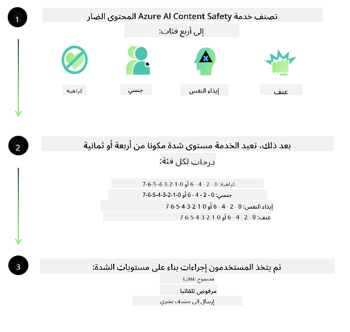
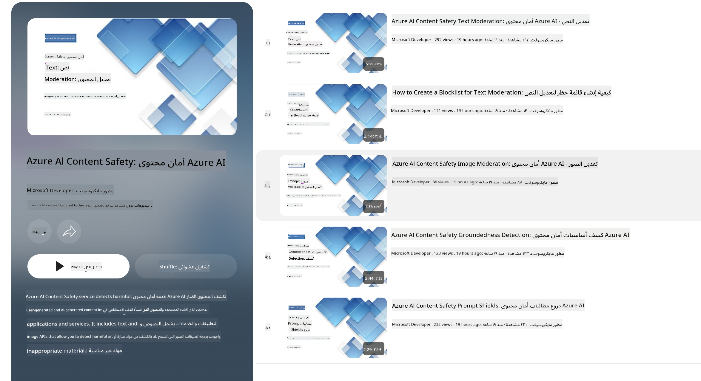

<!--
CO_OP_TRANSLATOR_METADATA:
{
  "original_hash": "c8273672cc57df2be675407a1383aaf0",
  "translation_date": "2025-03-27T05:24:42+00:00",
  "source_file": "md\\01.Introduction\\01\\01.AISafety.md",
  "language_code": "ar"
}
-->
# سلامة الذكاء الاصطناعي لنماذج Phi  
تم تطوير عائلة نماذج Phi وفقًا لـ [معيار الذكاء الاصطناعي المسؤول من Microsoft](https://query.prod.cms.rt.microsoft.com/cms/api/am/binary/RE5cmFl)، وهو مجموعة من المتطلبات على مستوى الشركة تستند إلى المبادئ الستة التالية: المسؤولية، الشفافية، العدالة، الموثوقية والسلامة، الخصوصية والأمان، والشمولية التي تشكل [مبادئ الذكاء الاصطناعي المسؤول من Microsoft](https://www.microsoft.com/ai/responsible-ai).  

مثل نماذج Phi السابقة، تم اعتماد نهج متعدد الأوجه لتقييم السلامة وتدريب ما بعد السلامة، مع اتخاذ تدابير إضافية للتعامل مع قدرات الإصدار متعددة اللغات. يوضح نهجنا في تدريب السلامة والتقييمات، بما في ذلك الاختبار عبر لغات متعددة وفئات المخاطر، في [ورقة تدريب ما بعد السلامة لنماذج Phi](https://arxiv.org/abs/2407.13833). على الرغم من استفادة نماذج Phi من هذا النهج، ينبغي على المطورين تطبيق أفضل ممارسات الذكاء الاصطناعي المسؤول، بما في ذلك تخطيط المخاطر وقياسها وتخفيفها المرتبطة بحالات الاستخدام الخاصة بهم والسياق الثقافي واللغوي.  

## أفضل الممارسات  

مثل النماذج الأخرى، يمكن لعائلة نماذج Phi أن تتصرف بطرق قد تكون غير عادلة أو غير موثوقة أو مسيئة.  

بعض السلوكيات المحدودة لـ SLM و LLM التي يجب أن تكون على دراية بها تشمل:  

- **جودة الخدمة:** تم تدريب نماذج Phi بشكل أساسي على النصوص الإنجليزية. قد تواجه اللغات الأخرى أداءً أسوأ. كما قد تواجه أنواع اللغة الإنجليزية ذات التمثيل الأقل في بيانات التدريب أداءً أسوأ مقارنةً باللغة الإنجليزية الأمريكية القياسية.  
- **تمثيل الأضرار وتعزيز الصور النمطية:** يمكن لهذه النماذج أن تفرط أو تقلل من تمثيل مجموعات معينة من الأشخاص، أو تمحو تمثيل بعض المجموعات، أو تعزز الصور النمطية المهينة أو السلبية. وعلى الرغم من تدريب ما بعد السلامة، قد تظل هذه القيود موجودة بسبب اختلاف مستويات تمثيل المجموعات المختلفة أو انتشار أمثلة الصور النمطية السلبية في بيانات التدريب التي تعكس أنماط العالم الواقعي والتحيزات المجتمعية.  
- **المحتوى غير المناسب أو المسيء:** قد تنتج هذه النماذج أنواعًا أخرى من المحتوى غير المناسب أو المسيء، مما يجعلها غير مناسبة للاستخدام في سياقات حساسة دون اتخاذ تدابير تخفيف إضافية خاصة بحالة الاستخدام.  
- **موثوقية المعلومات:** يمكن للنماذج اللغوية أن تولد محتوى غير منطقي أو تخترع محتوى يبدو معقولاً ولكنه غير دقيق أو قديم.  
- **نطاق محدود للبرمجة:** تعتمد غالبية بيانات تدريب Phi-3 على Python وتستخدم الحزم الشائعة مثل "typing، math، random، collections، datetime، itertools". إذا قام النموذج بإنشاء نصوص Python تستخدم حزمًا أخرى أو نصوصًا بلغة أخرى، فنوصي بشدة بأن يقوم المستخدمون بالتحقق يدويًا من جميع استخدامات API.  

يجب على المطورين تطبيق أفضل ممارسات الذكاء الاصطناعي المسؤول وهم مسؤولون عن ضمان امتثال حالة الاستخدام المحددة للقوانين واللوائح ذات الصلة (مثل الخصوصية، التجارة، إلخ).  

## اعتبارات الذكاء الاصطناعي المسؤول  

مثل النماذج اللغوية الأخرى، يمكن لنماذج سلسلة Phi أن تتصرف بطرق قد تكون غير عادلة أو غير موثوقة أو مسيئة. بعض السلوكيات المحدودة التي يجب أن تكون على دراية بها تشمل:  

**جودة الخدمة:** تم تدريب نماذج Phi بشكل أساسي على النصوص الإنجليزية. قد تواجه اللغات الأخرى أداءً أسوأ. كما قد تواجه أنواع اللغة الإنجليزية ذات التمثيل الأقل في بيانات التدريب أداءً أسوأ مقارنةً باللغة الإنجليزية الأمريكية القياسية.  

**تمثيل الأضرار وتعزيز الصور النمطية:** يمكن لهذه النماذج أن تفرط أو تقلل من تمثيل مجموعات معينة من الأشخاص، أو تمحو تمثيل بعض المجموعات، أو تعزز الصور النمطية المهينة أو السلبية. وعلى الرغم من تدريب ما بعد السلامة، قد تظل هذه القيود موجودة بسبب اختلاف مستويات تمثيل المجموعات المختلفة أو انتشار أمثلة الصور النمطية السلبية في بيانات التدريب التي تعكس أنماط العالم الواقعي والتحيزات المجتمعية.  

**المحتوى غير المناسب أو المسيء:** قد تنتج هذه النماذج أنواعًا أخرى من المحتوى غير المناسب أو المسيء، مما يجعلها غير مناسبة للاستخدام في سياقات حساسة دون اتخاذ تدابير تخفيف إضافية خاصة بحالة الاستخدام.  
**موثوقية المعلومات:** يمكن للنماذج اللغوية أن تولد محتوى غير منطقي أو تخترع محتوى يبدو معقولاً ولكنه غير دقيق أو قديم.  

**نطاق محدود للبرمجة:** تعتمد غالبية بيانات تدريب Phi-3 على Python وتستخدم الحزم الشائعة مثل "typing، math، random، collections، datetime، itertools". إذا قام النموذج بإنشاء نصوص Python تستخدم حزمًا أخرى أو نصوصًا بلغة أخرى، فنوصي بشدة بأن يقوم المستخدمون بالتحقق يدويًا من جميع استخدامات API.  

يجب على المطورين تطبيق أفضل ممارسات الذكاء الاصطناعي المسؤول وهم مسؤولون عن ضمان امتثال حالة الاستخدام المحددة للقوانين واللوائح ذات الصلة (مثل الخصوصية، التجارة، إلخ). المناطق المهمة التي يجب أخذها في الاعتبار تشمل:  

**التخصيص:** قد لا تكون النماذج مناسبة للسيناريوهات التي يمكن أن يكون لها تأثير كبير على الوضع القانوني أو تخصيص الموارد أو فرص الحياة (مثل: الإسكان، التوظيف، الائتمان، إلخ) دون إجراء تقييمات إضافية وتقنيات تقليل التحيز.  

**السيناريوهات عالية المخاطر:** يجب على المطورين تقييم ملاءمة استخدام النماذج في السيناريوهات عالية المخاطر حيث قد تكون المخرجات غير العادلة أو غير الموثوقة أو المسيئة مكلفة للغاية أو تؤدي إلى ضرر. يشمل ذلك تقديم النصائح في المجالات الحساسة أو المتخصصة حيث تكون الدقة والموثوقية أمرًا بالغ الأهمية (مثل: النصائح القانونية أو الصحية). يجب تنفيذ تدابير حماية إضافية على مستوى التطبيق وفقًا لسياق النشر.  

**المعلومات الخاطئة:** قد تنتج النماذج معلومات غير دقيقة. يجب على المطورين اتباع أفضل ممارسات الشفافية وإبلاغ المستخدمين النهائيين بأنهم يتفاعلون مع نظام ذكاء اصطناعي. على مستوى التطبيق، يمكن للمطورين بناء آليات تغذية راجعة وخطوط معالجة لتأسيس الردود على معلومات سياقية محددة لحالة الاستخدام، وهي تقنية تُعرف باسم التوليد المعزز بالاسترجاع (RAG).  

**إنتاج المحتوى الضار:** يجب على المطورين تقييم المخرجات وفقًا لسياقها واستخدام المصنفات الأمنية المتاحة أو الحلول المخصصة المناسبة لحالة الاستخدام.  

**الاستخدام غير المشروع:** قد يكون من الممكن أشكال أخرى من الاستخدام غير المشروع مثل الاحتيال أو الرسائل المزعجة أو إنتاج البرمجيات الخبيثة، ويجب على المطورين ضمان أن تطبيقاتهم لا تنتهك القوانين واللوائح المعمول بها.  

### التخصيص وأمان محتوى الذكاء الاصطناعي  

بعد تخصيص نموذج، نوصي بشدة بالاستفادة من [أمان محتوى Azure AI](https://learn.microsoft.com/azure/ai-services/content-safety/overview) لمراقبة المحتوى الذي يتم إنشاؤه بواسطة النماذج، وتحديد المخاطر المحتملة والتهديدات وقضايا الجودة وحجبها.  

  

[أمان محتوى Azure AI](https://learn.microsoft.com/azure/ai-services/content-safety/overview) يدعم كلًا من المحتوى النصي والصوري. يمكن نشره في السحابة، الحاويات غير المتصلة، وعلى الأجهزة الطرفية/المضمنة.  

## نظرة عامة على أمان محتوى Azure AI  

أمان محتوى Azure AI ليس حلاً موحدًا للجميع؛ يمكن تخصيصه ليتماشى مع سياسات الشركات الخاصة. بالإضافة إلى ذلك، تمكن نماذجه متعددة اللغات من فهم عدة لغات في الوقت نفسه.  

  

- **أمان محتوى Azure AI**  
- **مطور Microsoft**  
- **5 مقاطع فيديو**  

خدمة أمان محتوى Azure AI تكشف المحتوى الضار الذي يتم إنشاؤه من قبل المستخدمين أو الذكاء الاصطناعي في التطبيقات والخدمات. تتضمن الخدمة واجهات برمجية للنصوص والصور تسمح لك بالكشف عن المواد الضارة أو غير المناسبة.  

[قائمة تشغيل أمان محتوى الذكاء الاصطناعي](https://www.youtube.com/playlist?list=PLlrxD0HtieHjaQ9bJjyp1T7FeCbmVcPkQ)  

**إخلاء المسؤولية**:  
تم ترجمة هذه الوثيقة باستخدام خدمة الترجمة بالذكاء الاصطناعي [Co-op Translator](https://github.com/Azure/co-op-translator). بينما نسعى لتحقيق الدقة، يرجى العلم أن الترجمات الآلية قد تحتوي على أخطاء أو عدم دقة. يجب اعتبار الوثيقة الأصلية بلغتها الأصلية المصدر الرسمي. للحصول على معلومات حاسمة، يُوصى بالترجمة البشرية الاحترافية. نحن غير مسؤولين عن أي سوء فهم أو تفسيرات خاطئة ناتجة عن استخدام هذه الترجمة.