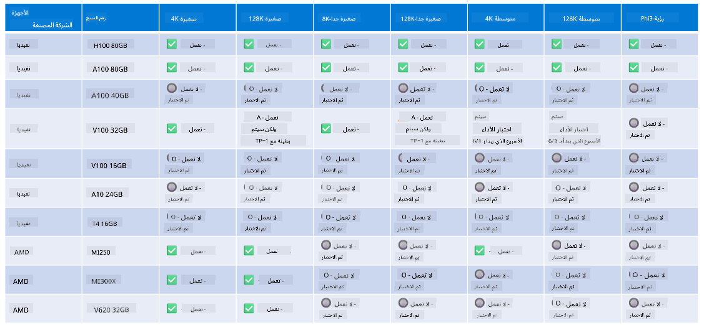

<!--
CO_OP_TRANSLATOR_METADATA:
{
  "original_hash": "8cdc17ce0f10535da30b53d23fe1a795",
  "translation_date": "2025-03-27T05:54:23+00:00",
  "source_file": "md\\01.Introduction\\01\\01.Hardwaresupport.md",
  "language_code": "ar"
}
-->
# دعم أجهزة Phi

تم تحسين Microsoft Phi لـ ONNX Runtime ويدعم Windows DirectML. يعمل بشكل جيد عبر أنواع مختلفة من الأجهزة، بما في ذلك وحدات معالجة الرسومات (GPUs)، ووحدات المعالجة المركزية (CPUs)، وحتى الأجهزة المحمولة.

## الأجهزة المدعومة
على وجه التحديد، تشمل الأجهزة المدعومة:

- وحدة معالجة الرسومات: RTX 4090 (DirectML)
- وحدة معالجة الرسومات: 1 A100 80GB (CUDA)
- وحدة معالجة مركزية: Standard F64s v2 (64 vCPUs، و128 جيجابايت ذاكرة)

## الأجهزة المحمولة

- أندرويد - Samsung Galaxy S21
- آبل iPhone 14 أو أحدث بمعالج A16/A17

## مواصفات أجهزة Phi

- الحد الأدنى من التكوين المطلوب.
- ويندوز: وحدة معالجة رسومات تدعم DirectX 12 و4 جيجابايت على الأقل من ذاكرة الوصول العشوائي (RAM) المجمعة.

CUDA: وحدة معالجة رسومات NVIDIA بقدرة حوسبة >= 7.02



## تشغيل onnxruntime على عدة وحدات معالجة رسومات

حاليًا، نماذج Phi ONNX المتوفرة تدعم وحدة معالجة رسومات واحدة فقط. من الممكن دعم عدة وحدات معالجة رسومات لنماذج Phi، ولكن تشغيل ORT مع وحدتين من وحدات معالجة الرسومات لا يضمن زيادة في الإنتاجية مقارنة بتشغيل حالتين منفصلتين من ORT. يُرجى الاطلاع على [ONNX Runtime](https://onnxruntime.ai/) للحصول على آخر التحديثات.

في [Build 2024 فريق GenAI ONNX](https://youtu.be/WLW4SE8M9i8?si=EtG04UwDvcjunyfC) أعلنوا أنهم قاموا بتمكين التشغيل المتعدد للحالات بدلاً من التشغيل المتعدد لوحدات معالجة الرسومات لنماذج Phi.

حاليًا، يتيح لك ذلك تشغيل حالة واحدة من onnxruntime أو onnxruntime-genai باستخدام متغير البيئة CUDA_VISIBLE_DEVICES مثل هذا.

```Python
CUDA_VISIBLE_DEVICES=0 python infer.py
CUDA_VISIBLE_DEVICES=1 python infer.py
```

لا تتردد في استكشاف المزيد عن Phi في [Azure AI Foundry](https://ai.azure.com)

**إخلاء المسؤولية**:  
تم ترجمة هذا المستند باستخدام خدمة الترجمة بالذكاء الاصطناعي [Co-op Translator](https://github.com/Azure/co-op-translator). بينما نسعى لتحقيق الدقة، يرجى العلم أن الترجمات الآلية قد تحتوي على أخطاء أو عدم دقة. يجب اعتبار المستند الأصلي بلغته الأصلية هو المصدر الرسمي. بالنسبة للمعلومات الحيوية، يُوصى بالاستعانة بترجمة بشرية احترافية. نحن غير مسؤولين عن أي سوء فهم أو تفسيرات خاطئة ناتجة عن استخدام هذه الترجمة.