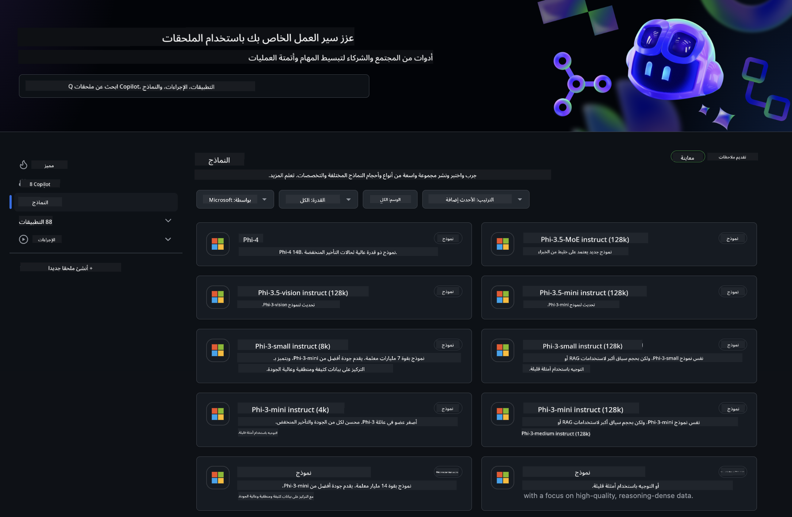
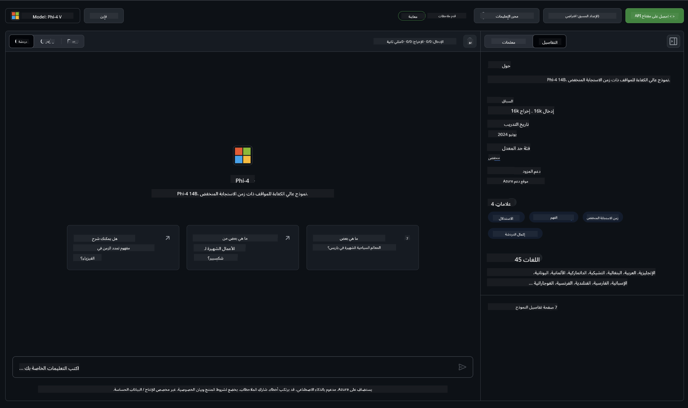
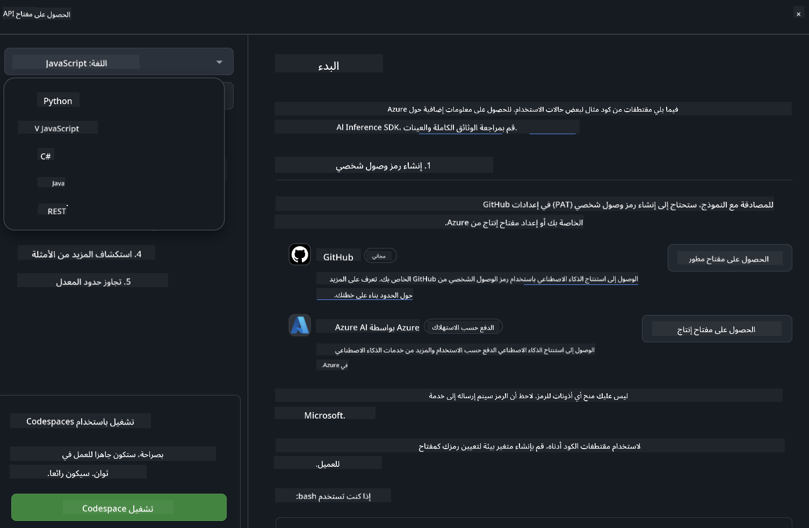
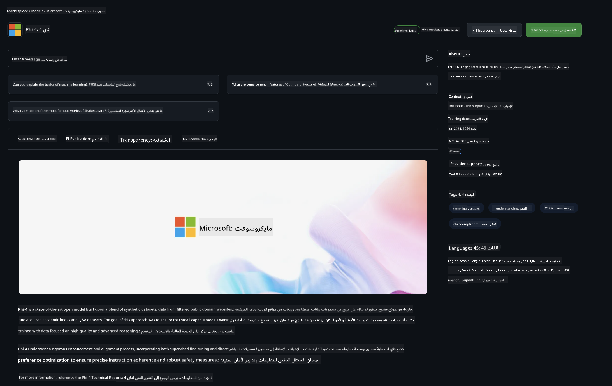

<!--
CO_OP_TRANSLATOR_METADATA:
{
  "original_hash": "fb67a08b9fc911a10ed58081fadef416",
  "translation_date": "2025-03-27T06:19:03+00:00",
  "source_file": "md\\01.Introduction\\02\\02.GitHubModel.md",
  "language_code": "ar"
}
-->
## عائلة Phi في نماذج GitHub

مرحبًا بك في [نماذج GitHub](https://github.com/marketplace/models) ! كل شيء جاهز لاستكشاف نماذج الذكاء الاصطناعي المستضافة على Azure AI.



للحصول على مزيد من المعلومات حول النماذج المتوفرة في GitHub Models، قم بزيارة [GitHub Model Marketplace](https://github.com/marketplace/models).

## النماذج المتوفرة

كل نموذج يحتوي على مساحة لعب مخصصة وكود أمثلة.



### عائلة Phi في كتالوج نماذج GitHub

- [Phi-4](https://github.com/marketplace/models/azureml/Phi-4)

- [Phi-3.5-MoE instruct (128k)](https://github.com/marketplace/models/azureml/Phi-3-5-MoE-instruct)

- [Phi-3.5-vision instruct (128k)](https://github.com/marketplace/models/azureml/Phi-3-5-vision-instruct)

- [Phi-3.5-mini instruct (128k)](https://github.com/marketplace/models/azureml/Phi-3-5-mini-instruct)

- [Phi-3-Medium-128k-Instruct](https://github.com/marketplace/models/azureml/Phi-3-medium-128k-instruct)

- [Phi-3-medium-4k-instruct](https://github.com/marketplace/models/azureml/Phi-3-medium-4k-instruct)

- [Phi-3-mini-128k-instruct](https://github.com/marketplace/models/azureml/Phi-3-mini-128k-instruct)

- [Phi-3-mini-4k-instruct](https://github.com/marketplace/models/azureml/Phi-3-mini-4k-instruct)

- [Phi-3-small-128k-instruct](https://github.com/marketplace/models/azureml/Phi-3-small-128k-instruct)

- [Phi-3-small-8k-instruct](https://github.com/marketplace/models/azureml/Phi-3-small-8k-instruct)

## البدء

هناك بعض الأمثلة الأساسية جاهزة للتشغيل. يمكنك العثور عليها في دليل الأمثلة. إذا كنت ترغب في الانتقال مباشرة إلى لغتك المفضلة، يمكنك العثور على الأمثلة باللغات التالية:

- Python
- JavaScript
- C#
- Java
- cURL

يوجد أيضًا بيئة Codespaces مخصصة لتشغيل الأمثلة والنماذج.



## كود الأمثلة

فيما يلي مقتطفات من الكود لبعض حالات الاستخدام. لمزيد من المعلومات حول Azure AI Inference SDK، راجع الوثائق الكاملة والأمثلة.

## الإعداد

1. إنشاء رمز وصول شخصي  
لا تحتاج إلى إعطاء أي أذونات للرمز. يُرجى ملاحظة أن الرمز سيتم إرساله إلى خدمة Microsoft.

لاستخدام مقتطفات الكود أدناه، قم بإنشاء متغير بيئة لتعيين الرمز كمفتاح لكود العميل.

إذا كنت تستخدم bash:
```
export GITHUB_TOKEN="<your-github-token-goes-here>"
```
إذا كنت تستخدم powershell:

```
$Env:GITHUB_TOKEN="<your-github-token-goes-here>"
```

إذا كنت تستخدم موجه الأوامر في Windows:

```
set GITHUB_TOKEN=<your-github-token-goes-here>
```

## مثال Python

### تثبيت التبعيات  
قم بتثبيت Azure AI Inference SDK باستخدام pip (يتطلب: Python >=3.8):

```
pip install azure-ai-inference
```

### تشغيل مثال بسيط للكود  

يوضح هذا المثال كيفية إجراء استدعاء أساسي لواجهة برمجة تطبيقات إكمال الدردشة. يتم استخدام نقطة النهاية للاستدلال على نموذج GitHub AI ورمز GitHub الخاص بك. الاستدعاء يتم بشكل متزامن.

```python
import os
from azure.ai.inference import ChatCompletionsClient
from azure.ai.inference.models import SystemMessage, UserMessage
from azure.core.credentials import AzureKeyCredential

endpoint = "https://models.inference.ai.azure.com"
model_name = "Phi-4"
token = os.environ["GITHUB_TOKEN"]

client = ChatCompletionsClient(
    endpoint=endpoint,
    credential=AzureKeyCredential(token),
)

response = client.complete(
    messages=[
        UserMessage(content="I have $20,000 in my savings account, where I receive a 4% profit per year and payments twice a year. Can you please tell me how long it will take for me to become a millionaire? Also, can you please explain the math step by step as if you were explaining it to an uneducated person?"),
    ],
    temperature=0.4,
    top_p=1.0,
    max_tokens=2048,
    model=model_name
)

print(response.choices[0].message.content)
```

### تشغيل محادثة متعددة الأدوار  

يوضح هذا المثال كيفية إجراء محادثة متعددة الأدوار باستخدام واجهة برمجة تطبيقات إكمال الدردشة. عند استخدام النموذج لتطبيق دردشة، ستحتاج إلى إدارة تاريخ تلك المحادثة وإرسال أحدث الرسائل إلى النموذج.

```
import os
from azure.ai.inference import ChatCompletionsClient
from azure.ai.inference.models import AssistantMessage, SystemMessage, UserMessage
from azure.core.credentials import AzureKeyCredential

token = os.environ["GITHUB_TOKEN"]
endpoint = "https://models.inference.ai.azure.com"
# Replace Model_Name
model_name = "Phi-4"

client = ChatCompletionsClient(
    endpoint=endpoint,
    credential=AzureKeyCredential(token),
)

messages = [
    SystemMessage(content="You are a helpful assistant."),
    UserMessage(content="What is the capital of France?"),
    AssistantMessage(content="The capital of France is Paris."),
    UserMessage(content="What about Spain?"),
]

response = client.complete(messages=messages, model=model_name)

print(response.choices[0].message.content)
```

### بث الإخراج  

لتحسين تجربة المستخدم، قد ترغب في بث استجابة النموذج بحيث يظهر أول رمز بسرعة وتتجنب الانتظار لفترة طويلة.

```
import os
from azure.ai.inference import ChatCompletionsClient
from azure.ai.inference.models import SystemMessage, UserMessage
from azure.core.credentials import AzureKeyCredential

token = os.environ["GITHUB_TOKEN"]
endpoint = "https://models.inference.ai.azure.com"
# Replace Model_Name
model_name = "Phi-4"

client = ChatCompletionsClient(
    endpoint=endpoint,
    credential=AzureKeyCredential(token),
)

response = client.complete(
    stream=True,
    messages=[
        SystemMessage(content="You are a helpful assistant."),
        UserMessage(content="Give me 5 good reasons why I should exercise every day."),
    ],
    model=model_name,
)

for update in response:
    if update.choices:
        print(update.choices[0].delta.content or "", end="")

client.close()
```

## الاستخدام المجاني وحدود معدل نماذج GitHub



تم تصميم [حدود معدل مساحة اللعب والاستخدام المجاني لواجهة برمجة التطبيقات](https://docs.github.com/en/github-models/prototyping-with-ai-models#rate-limits) لمساعدتك على تجربة النماذج وبناء نموذج أولي لتطبيق الذكاء الاصطناعي الخاص بك. للاستخدام خارج تلك الحدود، ولإطلاق تطبيقك على نطاق واسع، يجب توفير الموارد من حساب Azure، والمصادقة من هناك بدلاً من رمز الوصول الشخصي الخاص بـ GitHub. لا تحتاج إلى تغيير أي شيء آخر في الكود الخاص بك. استخدم هذا الرابط لاكتشاف كيفية تجاوز حدود الطبقة المجانية في Azure AI.

### الإفصاحات

تذكر أنه عند التفاعل مع النموذج، فإنك تقوم بتجربة الذكاء الاصطناعي، لذلك قد تحدث أخطاء في المحتوى.

الميزة تخضع لقيود مختلفة (بما في ذلك الطلبات في الدقيقة، الطلبات في اليوم، الرموز في الطلب، والطلبات المتزامنة) وليست مصممة للاستخدام في حالات الإنتاج.

تستخدم نماذج GitHub أمان محتوى Azure AI. لا يمكن تعطيل هذه الفلاتر كجزء من تجربة نماذج GitHub. إذا قررت استخدام النماذج من خلال خدمة مدفوعة، يُرجى تكوين فلاتر المحتوى لتلبية متطلباتك.

هذه الخدمة تخضع لشروط الإصدار الأولي من GitHub.

**إخلاء المسؤولية**:  
تم ترجمة هذا المستند باستخدام خدمة الترجمة بالذكاء الاصطناعي [Co-op Translator](https://github.com/Azure/co-op-translator). بينما نسعى لتحقيق الدقة، يرجى العلم أن الترجمات الآلية قد تحتوي على أخطاء أو معلومات غير دقيقة. يجب اعتبار المستند الأصلي بلغته الأصلية المصدر الرسمي. للحصول على معلومات حاسمة، يُوصى بالترجمة البشرية الاحترافية. نحن غير مسؤولين عن أي سوء فهم أو تفسيرات خاطئة تنشأ عن استخدام هذه الترجمة.