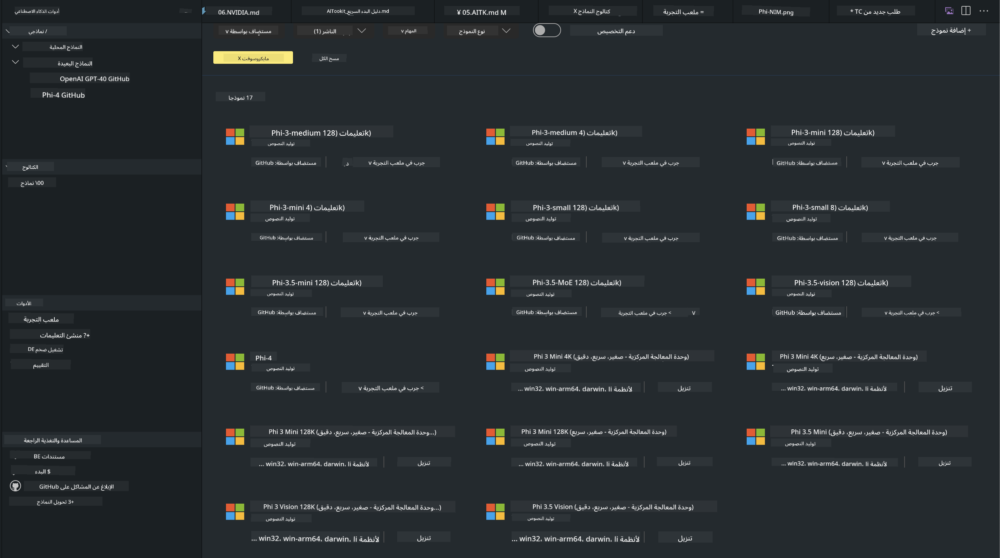
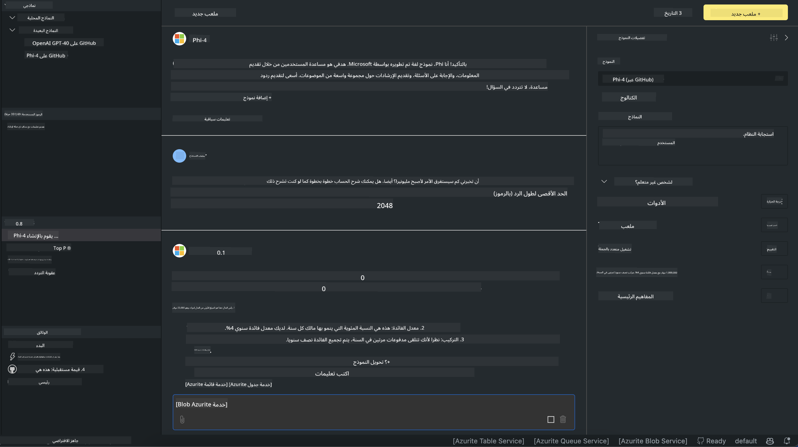

<!--
CO_OP_TRANSLATOR_METADATA:
{
  "original_hash": "4951d458c0b60c02cd1e751b40903877",
  "translation_date": "2025-03-27T06:41:37+00:00",
  "source_file": "md\\01.Introduction\\02\\05.AITK.md",
  "language_code": "ar"
}
-->
# عائلة Phi في AITK

[AI Toolkit لـ VS Code](https://marketplace.visualstudio.com/items?itemName=ms-windows-ai-studio.windows-ai-studio) يُبسط تطوير تطبيقات الذكاء الاصطناعي التوليدي من خلال جمع أدوات تطوير الذكاء الاصطناعي المتقدمة ونماذج من كتالوج Azure AI Foundry وكاتالوجات أخرى مثل Hugging Face. ستتمكن من تصفح كتالوج نماذج الذكاء الاصطناعي المدعوم بواسطة GitHub Models وكتالوجات نماذج Azure AI Foundry، تحميلها محليًا أو عن بُعد، تحسينها، اختبارها واستخدامها في تطبيقك.

يعمل AI Toolkit Preview محليًا. يعتمد التنبؤ المحلي أو تحسين النموذج على النموذج الذي تختاره، وقد تحتاج إلى وحدة معالجة رسومات (GPU) مثل NVIDIA CUDA GPU. يمكنك أيضًا تشغيل نماذج GitHub مباشرة باستخدام AITK.

## البدء

[تعرف على كيفية تثبيت نظام تشغيل Linux الفرعي لنظام Windows](https://learn.microsoft.com/windows/wsl/install?WT.mc_id=aiml-137032-kinfeylo)

و[تغيير التوزيع الافتراضي](https://learn.microsoft.com/windows/wsl/install#change-the-default-linux-distribution-installed).

[مستودع AI Toolkit على GitHub](https://github.com/microsoft/vscode-ai-toolkit/)

- Windows، Linux، macOS
  
- لتحسين النموذج على كل من Windows وLinux، ستحتاج إلى وحدة معالجة رسومات Nvidia. بالإضافة إلى ذلك، يتطلب **Windows** نظام تشغيل Linux الفرعي مع توزيعة Ubuntu 18.4 أو أحدث. [تعرف على كيفية تثبيت نظام تشغيل Linux الفرعي لنظام Windows](https://learn.microsoft.com/windows/wsl/install) و[تغيير التوزيع الافتراضي](https://learn.microsoft.com/windows/wsl/install#change-the-default-linux-distribution-installed).

### تثبيت AI Toolkit

يتم شحن AI Toolkit كـ [إضافة لـ Visual Studio Code](https://code.visualstudio.com/docs/setup/additional-components#_vs-code-extensions)، لذا يجب عليك تثبيت [VS Code](https://code.visualstudio.com/docs/setup/windows?WT.mc_id=aiml-137032-kinfeylo) أولاً، وتحميل AI Toolkit من [VS Marketplace](https://marketplace.visualstudio.com/items?itemName=ms-windows-ai-studio.windows-ai-studio).
يتوفر [AI Toolkit في Visual Studio Marketplace](https://marketplace.visualstudio.com/items?itemName=ms-windows-ai-studio.windows-ai-studio) ويمكن تثبيته مثل أي إضافة أخرى لـ VS Code.

إذا كنت غير معتاد على تثبيت إضافات VS Code، اتبع هذه الخطوات:

### تسجيل الدخول

1. في شريط النشاط في VS Code اختر **الإضافات**.
1. في شريط البحث عن الإضافات، اكتب "AI Toolkit".
1. اختر "AI Toolkit لـ Visual Studio Code".
1. اختر **تثبيت**.

الآن، أنت جاهز لاستخدام الإضافة!

سيُطلب منك تسجيل الدخول إلى GitHub، لذا يرجى النقر على "السماح" للمتابعة. سيتم إعادة توجيهك إلى صفحة تسجيل الدخول لـ GitHub.

يرجى تسجيل الدخول واتباع خطوات العملية. بعد الانتهاء بنجاح، سيتم إعادة توجيهك إلى VS Code.

بمجرد تثبيت الإضافة، ستظهر أيقونة AI Toolkit في شريط النشاط الخاص بك.

لنستكشف الإجراءات المتاحة!

### الإجراءات المتاحة

الشريط الجانبي الأساسي لـ AI Toolkit منظم في  

- **النماذج**
- **الموارد**
- **ساحة اللعب**  
- **تحسين النموذج**
- **التقييم**

متوفرة في قسم الموارد. للبدء، اختر **كتالوج النماذج**.

### تنزيل نموذج من الكتالوج

عند تشغيل AI Toolkit من شريط جانبي VS Code، يمكنك الاختيار من بين الخيارات التالية:



- العثور على نموذج مدعوم من **كتالوج النماذج** وتنزيله محليًا.
- اختبار استنتاج النموذج في **ساحة اللعب للنماذج**.
- تحسين النموذج محليًا أو عن بُعد في **تحسين النموذج**.
- نشر النماذج المحسنة إلى السحابة عبر لوحة الأوامر لـ AI Toolkit.
- تقييم النماذج.

> [!NOTE]
>
> **GPU مقابل CPU**
>
> ستلاحظ أن بطاقات النماذج تعرض حجم النموذج، المنصة ونوع المسرّع (CPU، GPU). لتحقيق أداء محسن على **أجهزة Windows التي تحتوي على وحدة معالجة رسومات واحدة على الأقل**، اختر إصدارات النماذج التي تستهدف Windows فقط.
>
> هذا يضمن أن لديك نموذجًا محسنًا لمسرّع DirectML.
>
> أسماء النماذج تأتي في صيغة
>
> - `{model_name}-{accelerator}-{quantization}-{format}`.
>
> للتحقق مما إذا كان لديك وحدة معالجة رسومات على جهاز Windows الخاص بك، افتح **مدير المهام** ثم اختر علامة التبويب **الأداء**. إذا كانت لديك وحدة معالجة رسومات (GPU)، فستظهر تحت أسماء مثل "GPU 0" أو "GPU 1".

### تشغيل النموذج في ساحة اللعب

بعد إعداد جميع المعلمات، انقر على **إنشاء مشروع**.

بمجرد تنزيل النموذج الخاص بك، اختر **تحميل في ساحة اللعب** على بطاقة النموذج في الكتالوج:

- بدء تنزيل النموذج.
- تثبيت جميع المتطلبات والاعتماديات.
- إنشاء مساحة عمل VS Code.



### استخدام REST API في تطبيقك 

يأتي AI Toolkit مع خادم ويب REST API محلي **على المنفذ 5272** الذي يستخدم [تنسيق إكمال الدردشة لـ OpenAI](https://platform.openai.com/docs/api-reference/chat/create). 

هذا يمكّنك من اختبار تطبيقك محليًا دون الحاجة إلى الاعتماد على خدمة نماذج الذكاء الاصطناعي السحابية. على سبيل المثال، يظهر ملف JSON التالي كيفية تكوين جسم الطلب:

```json
{
    "model": "Phi-4",
    "messages": [
        {
            "role": "user",
            "content": "what is the golden ratio?"
        }
    ],
    "temperature": 0.7,
    "top_p": 1,
    "top_k": 10,
    "max_tokens": 100,
    "stream": true
}
```

يمكنك اختبار REST API باستخدام (على سبيل المثال) [Postman](https://www.postman.com/) أو أداة CURL (Client URL):

```bash
curl -vX POST http://127.0.0.1:5272/v1/chat/completions -H 'Content-Type: application/json' -d @body.json
```

### استخدام مكتبة عميل OpenAI لـ Python

```python
from openai import OpenAI

client = OpenAI(
    base_url="http://127.0.0.1:5272/v1/", 
    api_key="x" # required for the API but not used
)

chat_completion = client.chat.completions.create(
    messages=[
        {
            "role": "user",
            "content": "what is the golden ratio?",
        }
    ],
    model="Phi-4",
)

print(chat_completion.choices[0].message.content)
```

### استخدام مكتبة عميل Azure OpenAI لـ .NET

أضف [مكتبة عميل Azure OpenAI لـ .NET](https://www.nuget.org/packages/Azure.AI.OpenAI/) إلى مشروعك باستخدام NuGet:

```bash
dotnet add {project_name} package Azure.AI.OpenAI --version 1.0.0-beta.17
```

أضف ملف C# يسمى **OverridePolicy.cs** إلى مشروعك والصق الكود التالي:

```csharp
// OverridePolicy.cs
using Azure.Core.Pipeline;
using Azure.Core;

internal partial class OverrideRequestUriPolicy(Uri overrideUri)
    : HttpPipelineSynchronousPolicy
{
    private readonly Uri _overrideUri = overrideUri;

    public override void OnSendingRequest(HttpMessage message)
    {
        message.Request.Uri.Reset(_overrideUri);
    }
}
```

بعد ذلك، الصق الكود التالي في ملف **Program.cs** الخاص بك:

```csharp
// Program.cs
using Azure.AI.OpenAI;

Uri localhostUri = new("http://localhost:5272/v1/chat/completions");

OpenAIClientOptions clientOptions = new();
clientOptions.AddPolicy(
    new OverrideRequestUriPolicy(localhostUri),
    Azure.Core.HttpPipelinePosition.BeforeTransport);
OpenAIClient client = new(openAIApiKey: "unused", clientOptions);

ChatCompletionsOptions options = new()
{
    DeploymentName = "Phi-4",
    Messages =
    {
        new ChatRequestSystemMessage("You are a helpful assistant. Be brief and succinct."),
        new ChatRequestUserMessage("What is the golden ratio?"),
    }
};

StreamingResponse<StreamingChatCompletionsUpdate> streamingChatResponse
    = await client.GetChatCompletionsStreamingAsync(options);

await foreach (StreamingChatCompletionsUpdate chatChunk in streamingChatResponse)
{
    Console.Write(chatChunk.ContentUpdate);
}
```


## تحسين النموذج باستخدام AI Toolkit

- البدء مع اكتشاف النماذج وساحة اللعب.
- تحسين النماذج واستنتاجها باستخدام موارد الحوسبة المحلية.
- تحسين النماذج واستنتاجها عن بُعد باستخدام موارد Azure.

[تحسين النموذج باستخدام AI Toolkit](../../03.FineTuning/Finetuning_VSCodeaitoolkit.md)

## موارد الأسئلة والأجوبة لـ AI Toolkit

يرجى الرجوع إلى [صفحة الأسئلة والأجوبة](https://github.com/microsoft/vscode-ai-toolkit/blob/main/archive/QA.md) للحصول على أكثر المشكلات شيوعًا وحلولها.

**إخلاء المسؤولية**:  
تم ترجمة هذا المستند باستخدام خدمة الترجمة بالذكاء الاصطناعي [Co-op Translator](https://github.com/Azure/co-op-translator). بينما نسعى لتحقيق الدقة، يرجى العلم أن الترجمات الآلية قد تحتوي على أخطاء أو معلومات غير دقيقة. يجب اعتبار المستند الأصلي بلغته الأصلية المصدر الرسمي. بالنسبة للمعلومات الحيوية، يُوصى باللجوء إلى ترجمة بشرية احترافية. نحن غير مسؤولين عن أي سوء فهم أو تفسيرات خاطئة ناتجة عن استخدام هذه الترجمة.