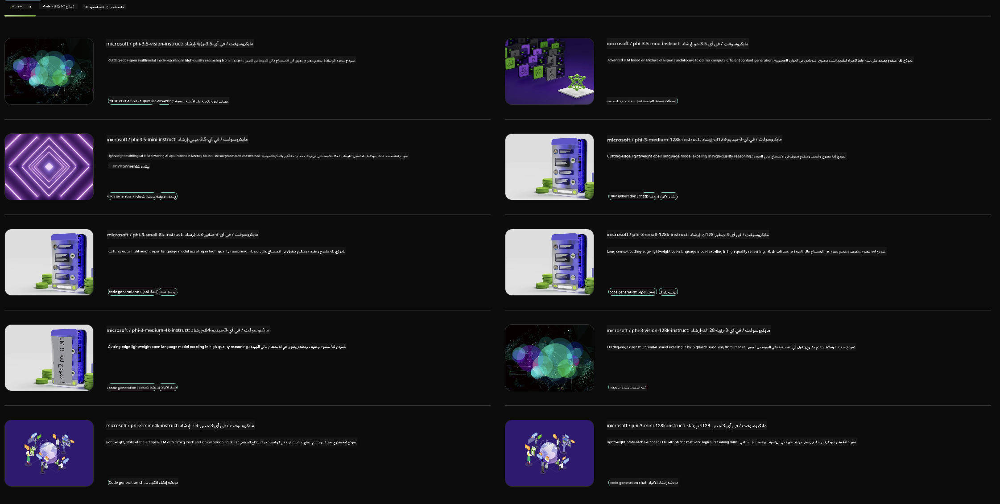

<!--
CO_OP_TRANSLATOR_METADATA:
{
  "original_hash": "7b08e277df2a9307f861ae54bc30c772",
  "translation_date": "2025-03-27T06:49:47+00:00",
  "source_file": "md\\01.Introduction\\02\\06.NVIDIA.md",
  "language_code": "ar"
}
-->
## عائلة Phi في NVIDIA NIM

NVIDIA NIM هو مجموعة من الخدمات المصغرة السهلة الاستخدام المصممة لتسريع نشر نماذج الذكاء الاصطناعي التوليدية عبر السحابة، ومراكز البيانات، ومحطات العمل. يتم تصنيف NIMs حسب عائلة النماذج وعلى أساس كل نموذج على حدة. على سبيل المثال، يوفر NVIDIA NIM للنماذج اللغوية الكبيرة (LLMs) قوة النماذج اللغوية المتقدمة لتطبيقات الشركات، مما يتيح قدرات غير مسبوقة في معالجة وفهم اللغة الطبيعية.

يسهّل NIM على فرق تقنية المعلومات وDevOps استضافة النماذج اللغوية الكبيرة (LLMs) في بيئاتهم المُدارة مع توفير واجهات برمجة تطبيقات قياسية في الصناعة للمطورين، مما يسمح لهم ببناء مساعدين ذكيين، روبوتات محادثة، ومساعدين ذكاء اصطناعي يمكنهم تحويل أعمالهم. باستخدام تسريع GPU المتطور من NVIDIA والنشر القابل للتوسع، يوفر NIM أسرع مسار للاستدلال مع أداء لا مثيل له.

يمكنك استخدام NVIDIA NIM لاستدلال نماذج عائلة Phi.



### **أمثلة - Phi-3-Vision في NVIDIA NIM**

تخيل أن لديك صورة (`demo.png`) وتريد إنشاء كود Python يعالج هذه الصورة ويحفظ نسخة جديدة منها (`phi-3-vision.jpg`).

الكود أعلاه يقوم بأتمتة هذه العملية من خلال:

1. إعداد البيئة والتكوينات اللازمة.
2. إنشاء موجه يوجه النموذج لتوليد كود Python المطلوب.
3. إرسال الموجه إلى النموذج وجمع الكود المُولد.
4. استخراج وتشغيل الكود المُولد.
5. عرض الصور الأصلية والمُعالجة.

هذا النهج يستفيد من قوة الذكاء الاصطناعي لأتمتة مهام معالجة الصور، مما يجعل تحقيق أهدافك أسهل وأسرع.

[حل الكود النموذجي](../../../../../code/06.E2E/E2E_Nvidia_NIM_Phi3_Vision.ipynb)

لنقم بتفصيل ما يقوم به الكود بأكمله خطوة بخطوة:

1. **تثبيت الحزمة المطلوبة**:
    ```python
    !pip install langchain_nvidia_ai_endpoints -U
    ```
    هذا الأمر يثبت حزمة `langchain_nvidia_ai_endpoints`، مع التأكد من أنها أحدث إصدار.

2. **استيراد الوحدات اللازمة**:
    ```python
    from langchain_nvidia_ai_endpoints import ChatNVIDIA
    import getpass
    import os
    import base64
    ```
    هذه الاستيرادات تجلب الوحدات اللازمة للتفاعل مع نقاط نهاية NVIDIA AI، التعامل الآمن مع كلمات المرور، التفاعل مع نظام التشغيل، وترميز/فك ترميز البيانات بتنسيق base64.

3. **إعداد مفتاح API**:
    ```python
    if not os.getenv("NVIDIA_API_KEY"):
        os.environ["NVIDIA_API_KEY"] = getpass.getpass("Enter your NVIDIA API key: ")
    ```
    يتحقق هذا الكود مما إذا كان متغير البيئة `NVIDIA_API_KEY` مضبوطًا. إذا لم يكن كذلك، فإنه يطلب من المستخدم إدخال مفتاح API الخاص به بأمان.

4. **تحديد النموذج ومسار الصورة**:
    ```python
    model = 'microsoft/phi-3-vision-128k-instruct'
    chat = ChatNVIDIA(model=model)
    img_path = './imgs/demo.png'
    ```
    يقوم هذا بتحديد النموذج المراد استخدامه، إنشاء مثيل لـ `ChatNVIDIA` بالنموذج المحدد، وتحديد مسار ملف الصورة.

5. **إنشاء موجه نصي**:
    ```python
    text = "Please create Python code for image, and use plt to save the new picture under imgs/ and name it phi-3-vision.jpg."
    ```
    يقوم هذا بتحديد موجه نصي يوجه النموذج لتوليد كود Python لمعالجة صورة.

6. **ترميز الصورة بتنسيق Base64**:
    ```python
    with open(img_path, "rb") as f:
        image_b64 = base64.b64encode(f.read()).decode()
    image = f''
    ```
    يقرأ هذا الكود ملف الصورة، يرمزها بتنسيق base64، وينشئ علامة HTML للصورة مع البيانات المشفرة.

7. **دمج النص والصورة في موجه واحد**:
    ```python
    prompt = f"{text} {image}"
    ```
    يقوم هذا بدمج الموجه النصي وعلامة HTML للصورة في سلسلة نصية واحدة.

8. **توليد الكود باستخدام ChatNVIDIA**:
    ```python
    code = ""
    for chunk in chat.stream(prompt):
        print(chunk.content, end="")
        code += chunk.content
    ```
    يرسل هذا الكود الموجه إلى `ChatNVIDIA` model and collects the generated code in chunks, printing and appending each chunk to the `code` سلسلة النصوص.

9. **استخراج كود Python من المحتوى المُولد**:
    ```python
    begin = code.index('```python') + 9
    code = code[begin:]
    end = code.index('```')
    code = code[:end]
    ```
    يقوم هذا باستخراج كود Python الفعلي من المحتوى المُولد عن طريق إزالة تنسيق markdown.

10. **تشغيل الكود المُولد**:
    ```python
    import subprocess
    result = subprocess.run(["python", "-c", code], capture_output=True)
    ```
    يقوم هذا بتشغيل كود Python المُستخرج كعملية فرعية ويلتقط مخرجاتها.

11. **عرض الصور**:
    ```python
    from IPython.display import Image, display
    display(Image(filename='./imgs/phi-3-vision.jpg'))
    display(Image(filename='./imgs/demo.png'))
    ```
    تعرض هذه الأسطر الصور باستخدام وحدة `IPython.display`.

**إخلاء المسؤولية**:  
تم ترجمة هذا المستند باستخدام خدمة الترجمة بالذكاء الاصطناعي [Co-op Translator](https://github.com/Azure/co-op-translator). بينما نسعى لتحقيق الدقة، يُرجى العلم أن الترجمات الآلية قد تحتوي على أخطاء أو عدم دقة. يجب اعتبار المستند الأصلي بلغته الأصلية المصدر الرسمي. بالنسبة للمعلومات الحساسة، يُوصى باللجوء إلى ترجمة بشرية احترافية. نحن غير مسؤولين عن أي سوء فهم أو تفسيرات خاطئة تنشأ نتيجة استخدام هذه الترجمة.