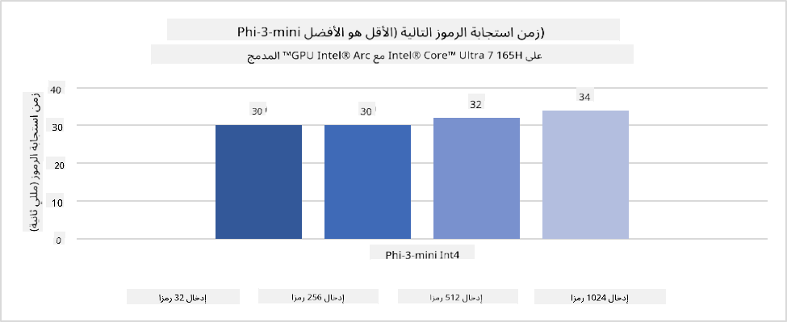
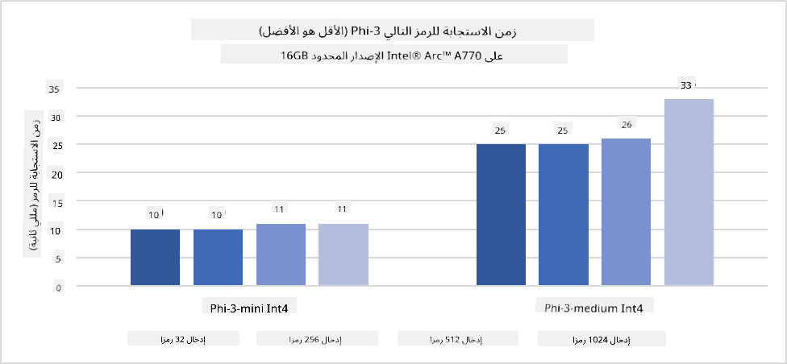
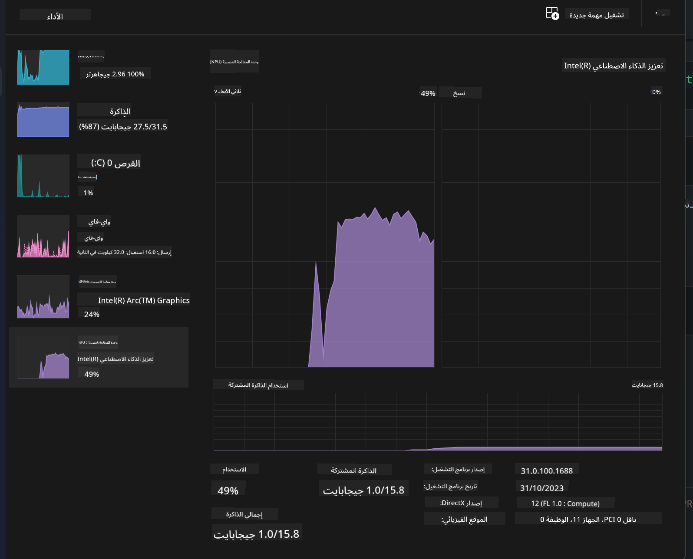
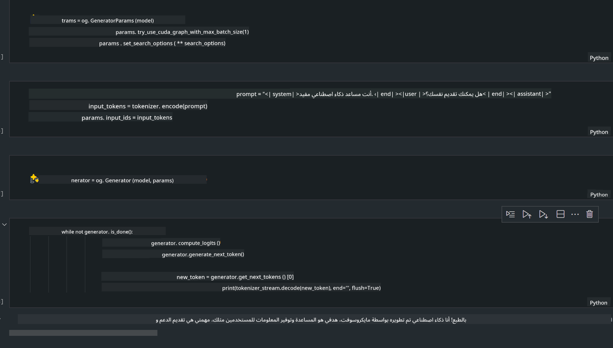
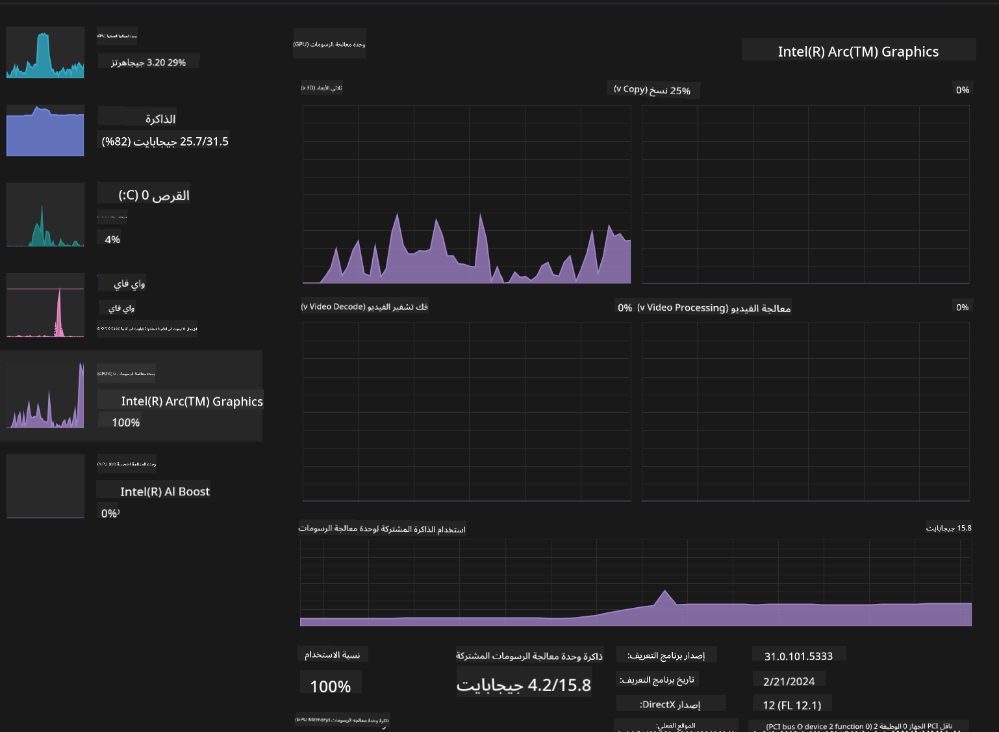

<!--
CO_OP_TRANSLATOR_METADATA:
{
  "original_hash": "e08ce816e23ad813244a09ca34ebb8ac",
  "translation_date": "2025-03-27T07:00:00+00:00",
  "source_file": "md\\01.Introduction\\03\\AIPC_Inference.md",
  "language_code": "ar"
}
-->
# **استنتاج Phi-3 في أجهزة الحاسوب المدعومة بالذكاء الاصطناعي**

مع تقدم الذكاء الاصطناعي التوليدي وتحسن قدرات أجهزة الحافة، أصبح بالإمكان دمج عدد متزايد من نماذج الذكاء الاصطناعي التوليدي في أجهزة المستخدمين الشخصية (BYOD). ومن بين هذه الأجهزة تأتي أجهزة الحاسوب المدعومة بالذكاء الاصطناعي. بدءًا من عام 2024، تعاونت Intel وAMD وQualcomm مع مصنعي الحواسيب لتقديم أجهزة الحاسوب المدعومة بالذكاء الاصطناعي التي تسهل نشر نماذج الذكاء الاصطناعي التوليدي المحلية عبر تعديلات في الأجهزة. في هذه المناقشة، سنركز على أجهزة الحاسوب المدعومة بالذكاء الاصطناعي من Intel ونستكشف كيفية نشر Phi-3 على جهاز Intel AI PC.

### ما هو NPU؟

وحدة المعالجة العصبية (NPU) هي معالج مخصص أو وحدة معالجة في نظام على شريحة (SoC) مصممة خصيصًا لتسريع عمليات الشبكات العصبية ومهام الذكاء الاصطناعي. على عكس وحدات المعالجة المركزية (CPU) ووحدات معالجة الرسومات (GPU) العامة، تتميز الـ NPU بأنها مُحسّنة للحوسبة الموازية المعتمدة على البيانات، مما يجعلها فعالة للغاية في معالجة البيانات الضخمة مثل الفيديوهات والصور ومعالجة البيانات للشبكات العصبية. وهي بارعة بشكل خاص في تنفيذ المهام المتعلقة بالذكاء الاصطناعي، مثل التعرف على الصوت، وتعتيم الخلفية في مكالمات الفيديو، وعمليات تحرير الصور أو الفيديو مثل اكتشاف الكائنات.

## الفرق بين NPU و GPU

بينما تُشغل العديد من مهام الذكاء الاصطناعي والتعلم الآلي على وحدات معالجة الرسومات (GPU)، هناك فرق جوهري بين الـ GPU والـ NPU.
تشتهر وحدات معالجة الرسومات بقدراتها على الحوسبة الموازية، ولكن ليس كل وحدات الـ GPU فعالة بنفس القدر خارج معالجة الرسومات. أما وحدات الـ NPU فهي مصممة خصيصًا للعمليات الحسابية المعقدة التي تتطلبها الشبكات العصبية، مما يجعلها فعالة جدًا في مهام الذكاء الاصطناعي.

باختصار، تُعتبر الـ NPU بمثابة العباقرة في الحسابات الرياضية التي تسرّع عمليات الذكاء الاصطناعي، وهي تلعب دورًا رئيسيًا في عصر أجهزة الحاسوب المدعومة بالذكاء الاصطناعي!

***هذا المثال يعتمد على أحدث معالج Intel Core Ultra***

## **1. استخدام NPU لتشغيل نموذج Phi-3**

جهاز Intel® NPU هو مسرّع استنتاج الذكاء الاصطناعي المدمج مع وحدات المعالجة المركزية من Intel، بدءًا من جيل Intel® Core™ Ultra (المعروف سابقًا بـ Meteor Lake). يتيح تنفيذ مهام الشبكات العصبية الاصطناعية بكفاءة في استهلاك الطاقة.





**مكتبة تسريع Intel NPU**

مكتبة Intel NPU Acceleration Library [https://github.com/intel/intel-npu-acceleration-library](https://github.com/intel/intel-npu-acceleration-library) هي مكتبة Python مصممة لتعزيز كفاءة التطبيقات باستخدام قوة وحدة المعالجة العصبية من Intel (NPU) لتنفيذ الحسابات عالية السرعة على الأجهزة المتوافقة.

مثال على Phi-3-mini على جهاز حاسوب مدعوم بمعالجات Intel® Core™ Ultra.


تثبيت مكتبة Python باستخدام pip

```bash

   pip install intel-npu-acceleration-library

```

***ملاحظة*** المشروع لا يزال قيد التطوير، ولكن النموذج المرجعي مكتمل للغاية بالفعل.

### **تشغيل Phi-3 باستخدام مكتبة تسريع Intel NPU**

باستخدام تسريع Intel NPU، هذه المكتبة لا تؤثر على عملية الترميز التقليدية. تحتاج فقط إلى استخدام هذه المكتبة لتكميم النموذج الأصلي Phi-3، مثل FP16، INT8، INT4، مثل 

```python
from transformers import AutoTokenizer, pipeline,TextStreamer
from intel_npu_acceleration_library import NPUModelForCausalLM, int4
from intel_npu_acceleration_library.compiler import CompilerConfig
import warnings

model_id = "microsoft/Phi-3-mini-4k-instruct"

compiler_conf = CompilerConfig(dtype=int4)
model = NPUModelForCausalLM.from_pretrained(
    model_id, use_cache=True, config=compiler_conf, attn_implementation="sdpa"
).eval()

tokenizer = AutoTokenizer.from_pretrained(model_id)

text_streamer = TextStreamer(tokenizer, skip_prompt=True)
```

بعد نجاح عملية التكميم، استمر في التنفيذ لاستدعاء الـ NPU لتشغيل نموذج Phi-3.

```python
generation_args = {
   "max_new_tokens": 1024,
   "return_full_text": False,
   "temperature": 0.3,
   "do_sample": False,
   "streamer": text_streamer,
}

pipe = pipeline(
   "text-generation",
   model=model,
   tokenizer=tokenizer,
)

query = "<|system|>You are a helpful AI assistant.<|end|><|user|>Can you introduce yourself?<|end|><|assistant|>"

with warnings.catch_warnings():
    warnings.simplefilter("ignore")
    pipe(query, **generation_args)
```

عند تنفيذ الكود، يمكننا عرض حالة تشغيل الـ NPU من خلال مدير المهام.



***عينات*** : [AIPC_NPU_DEMO.ipynb](../../../../../code/03.Inference/AIPC/AIPC_NPU_DEMO.ipynb)

## **2. استخدام DirectML + ONNX Runtime لتشغيل نموذج Phi-3**

### **ما هو DirectML**

[DirectML](https://github.com/microsoft/DirectML) هو مكتبة DirectX 12 عالية الأداء مُسرّعة بالأجهزة مخصصة للتعلم الآلي. يوفر DirectML تسريعًا لوحدات معالجة الرسومات (GPU) لمهام التعلم الآلي الشائعة عبر مجموعة واسعة من الأجهزة وبرامج التشغيل المدعومة، بما في ذلك جميع وحدات معالجة الرسومات المتوافقة مع DirectX 12 من شركات مثل AMD وIntel وNVIDIA وQualcomm.

عند استخدامه بشكل مستقل، يُعتبر DirectML واجهة برمجية منخفضة المستوى لـ DirectX 12 ومناسبًا للتطبيقات عالية الأداء وقليلة التأخير مثل الألعاب وتطبيقات الوقت الحقيقي الأخرى. التوافق السلس لـ DirectML مع Direct3D 12 بالإضافة إلى انخفاض التكاليف العامة والاتساق عبر الأجهزة يجعل DirectML مثاليًا لتسريع التعلم الآلي عندما يكون الأداء العالي مطلوبًا وموثوقية النتائج عبر الأجهزة أمرًا حيويًا.

***ملاحظة*** : يدعم DirectML الآن الـ NPU (https://devblogs.microsoft.com/directx/introducing-neural-processor-unit-npu-support-in-directml-developer-preview/)

### DirectML و CUDA من حيث القدرات والأداء:

**DirectML** هي مكتبة تعلم آلي طورتها Microsoft. وهي مصممة لتسريع مهام التعلم الآلي على أجهزة Windows، بما في ذلك أجهزة الكمبيوتر المكتبية والمحمولة وأجهزة الحافة.
- يعتمد على DX12: تم بناء DirectML على أساس DirectX 12 (DX12)، مما يوفر دعمًا واسعًا للأجهزة عبر وحدات معالجة الرسومات، بما في ذلك كل من NVIDIA وAMD.
- دعم أوسع: نظرًا لاعتماده على DX12، يمكن لـ DirectML العمل مع أي وحدة معالجة رسومات تدعم DX12، حتى الوحدات المتكاملة.
- معالجة الصور: يقوم DirectML بمعالجة الصور والبيانات الأخرى باستخدام الشبكات العصبية، مما يجعله مناسبًا لمهام مثل التعرف على الصور واكتشاف الكائنات وغيرها.
- سهولة الإعداد: إعداد DirectML بسيط، ولا يتطلب مكتبات أو واجهات برمجية محددة من الشركات المصنعة لوحدات معالجة الرسومات.
- الأداء: في بعض الحالات، يقدم DirectML أداءً جيدًا ويمكن أن يكون أسرع من CUDA، خاصة لبعض المهام.
- القيود: ومع ذلك، هناك حالات قد يكون فيها DirectML أبطأ، خاصة بالنسبة لأحجام الدُفعات الكبيرة من float16.

**CUDA** هي منصة الحوسبة الموازية ونموذج البرمجة الخاص بـ NVIDIA. تتيح للمطورين استغلال قوة وحدات معالجة الرسومات من NVIDIA لأغراض الحوسبة العامة، بما في ذلك التعلم الآلي والمحاكاة العلمية.
- خاص بـ NVIDIA: تم تصميم CUDA خصيصًا لوحدات معالجة الرسومات من NVIDIA.
- أداء عالي التحسين: يوفر أداءً ممتازًا للمهام المُسرّعة بواسطة وحدات معالجة الرسومات، خاصة عند استخدام وحدات معالجة الرسومات من NVIDIA.
- استخدام واسع: العديد من أطر العمل والمكتبات الخاصة بالتعلم الآلي (مثل TensorFlow وPyTorch) تدعم CUDA.
- التخصيص: يمكن للمطورين ضبط إعدادات CUDA لمهام محددة، مما يؤدي إلى تحقيق أداء أمثل.
- القيود: ومع ذلك، فإن اعتماد CUDA على أجهزة NVIDIA قد يكون مقيدًا إذا كنت ترغب في التوافق الأوسع عبر وحدات معالجة الرسومات المختلفة.

### اختيار بين DirectML و CUDA

يعتمد الاختيار بين DirectML وCUDA على استخدامك الخاص، وتوفر الأجهزة، وتفضيلاتك.
إذا كنت تبحث عن توافق أوسع وسهولة في الإعداد، فقد يكون DirectML خيارًا جيدًا. ومع ذلك، إذا كنت تمتلك وحدات معالجة رسومات من NVIDIA وتحتاج إلى أداء عالي التحسين، فإن CUDA تظل خيارًا قويًا. باختصار، لكل من DirectML وCUDA نقاط قوة وضعف، لذا اختر بناءً على متطلباتك والأجهزة المتوفرة لديك.

### **الذكاء الاصطناعي التوليدي باستخدام ONNX Runtime**

في عصر الذكاء الاصطناعي، أصبحت قابلية نقل نماذج الذكاء الاصطناعي أمرًا مهمًا للغاية. يمكن لـ ONNX Runtime نشر النماذج المدربة بسهولة على أجهزة مختلفة. لا يحتاج المطورون إلى الاهتمام بإطار الاستنتاج واستخدام واجهة برمجية موحدة لإكمال استنتاج النموذج. في عصر الذكاء الاصطناعي التوليدي، قام ONNX Runtime أيضًا بتحسين الكود (https://onnxruntime.ai/docs/genai/). من خلال ONNX Runtime المُحسن، يمكن استنتاج النموذج التوليدي المُكمم على مختلف الأجهزة. في الذكاء الاصطناعي التوليدي باستخدام ONNX Runtime، يمكن استنتاج واجهة برمجية لنموذج الذكاء الاصطناعي باستخدام Python، C#، C / C++. بالطبع، يمكن نشره على iPhone باستخدام واجهة برمجية Generative AI مع ONNX Runtime الخاصة بـ C++.

[كود العينة](https://github.com/Azure-Samples/Phi-3MiniSamples/tree/main/onnx)

***تجميع الذكاء الاصطناعي التوليدي مع مكتبة ONNX Runtime***

```bash

winget install --id=Kitware.CMake  -e

git clone https://github.com/microsoft/onnxruntime.git

cd .\onnxruntime\

./build.bat --build_shared_lib --skip_tests --parallel --use_dml --config Release

cd ../

git clone https://github.com/microsoft/onnxruntime-genai.git

cd .\onnxruntime-genai\

mkdir ort

cd ort

mkdir include

mkdir lib

copy ..\onnxruntime\include\onnxruntime\core\providers\dml\dml_provider_factory.h ort\include

copy ..\onnxruntime\include\onnxruntime\core\session\onnxruntime_c_api.h ort\include

copy ..\onnxruntime\build\Windows\Release\Release\*.dll ort\lib

copy ..\onnxruntime\build\Windows\Release\Release\onnxruntime.lib ort\lib

python build.py --use_dml


```

**تثبيت المكتبة**

```bash

pip install .\onnxruntime_genai_directml-0.3.0.dev0-cp310-cp310-win_amd64.whl

```

هذه هي نتيجة التشغيل 



***عينات*** : [AIPC_DirectML_DEMO.ipynb](../../../../../code/03.Inference/AIPC/AIPC_DirectML_DEMO.ipynb)

## **3. استخدام Intel OpenVino لتشغيل نموذج Phi-3**

### **ما هو OpenVINO**

[OpenVINO](https://github.com/openvinotoolkit/openvino) هو مجموعة أدوات مفتوحة المصدر لتحسين ونشر نماذج التعلم العميق. يوفر أداءً مُعززًا للتعلم العميق لنماذج الرؤية والصوت واللغة من أطر العمل الشهيرة مثل TensorFlow وPyTorch والمزيد. ابدأ مع OpenVINO. يمكن استخدام OpenVINO أيضًا بالاقتران مع وحدات المعالجة المركزية ووحدات معالجة الرسومات لتشغيل نموذج Phi3.

***ملاحظة***: حاليًا، لا يدعم OpenVINO وحدة الـ NPU.

### **تثبيت مكتبة OpenVINO**

```bash

 pip install git+https://github.com/huggingface/optimum-intel.git

 pip install git+https://github.com/openvinotoolkit/nncf.git

 pip install openvino-nightly

```

### **تشغيل Phi-3 باستخدام OpenVINO**

مثل NPU، يُكمل OpenVINO استدعاء نماذج الذكاء الاصطناعي التوليدي من خلال تشغيل النماذج المُكممة. نحتاج إلى تكميم نموذج Phi-3 أولاً وإكمال تكميم النموذج عبر سطر الأوامر باستخدام optimum-cli.

**INT4**

```bash

optimum-cli export openvino --model "microsoft/Phi-3-mini-4k-instruct" --task text-generation-with-past --weight-format int4 --group-size 128 --ratio 0.6  --sym  --trust-remote-code ./openvinomodel/phi3/int4

```

**FP16**

```bash

optimum-cli export openvino --model "microsoft/Phi-3-mini-4k-instruct" --task text-generation-with-past --weight-format fp16 --trust-remote-code ./openvinomodel/phi3/fp16

```

صيغة التحويل، مثل هذا


قم بتحميل مسارات النموذج (model_dir)، الإعدادات ذات الصلة (ov_config = {"PERFORMANCE_HINT": "LATENCY", "NUM_STREAMS": "1", "CACHE_DIR": ""})، والأجهزة المُسرّعة (GPU.0) من خلال OVModelForCausalLM.

```python

ov_model = OVModelForCausalLM.from_pretrained(
     model_dir,
     device='GPU.0',
     ov_config=ov_config,
     config=AutoConfig.from_pretrained(model_dir, trust_remote_code=True),
     trust_remote_code=True,
)

```

عند تنفيذ الكود، يمكننا عرض حالة تشغيل وحدة معالجة الرسومات عبر مدير المهام.



***عينات*** : [AIPC_OpenVino_Demo.ipynb](../../../../../code/03.Inference/AIPC/AIPC_OpenVino_Demo.ipynb)

### ***ملاحظة*** : الطرق الثلاثة المذكورة أعلاه لكل منها مزاياها، ولكن يُوصى باستخدام تسريع NPU لاستنتاج أجهزة الحاسوب المدعومة بالذكاء الاصطناعي.

**إخلاء المسؤولية**:  
تم ترجمة هذه الوثيقة باستخدام خدمة الترجمة بالذكاء الاصطناعي [Co-op Translator](https://github.com/Azure/co-op-translator). بينما نسعى لتحقيق الدقة، يرجى العلم أن الترجمات الآلية قد تحتوي على أخطاء أو معلومات غير دقيقة. يجب اعتبار الوثيقة الأصلية بلغتها الأصلية المصدر الموثوق. للحصول على معلومات حاسمة، يُوصى بالاستعانة بترجمة بشرية احترافية. نحن غير مسؤولين عن أي سوء فهم أو تفسيرات خاطئة تنشأ نتيجة استخدام هذه الترجمة.