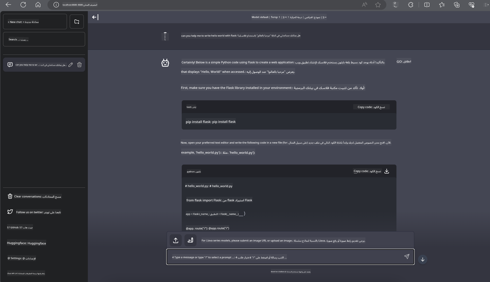

<!--
CO_OP_TRANSLATOR_METADATA:
{
  "original_hash": "be4101a30d98e95a71d42c276e8bcd37",
  "translation_date": "2025-03-27T07:26:37+00:00",
  "source_file": "md\\01.Introduction\\03\\Jetson_Inference.md",
  "language_code": "ar"
}
-->
# **استنتاج Phi-3 على Nvidia Jetson**

Nvidia Jetson هي سلسلة من لوحات الحوسبة المدمجة من شركة Nvidia. تحمل النماذج Jetson TK1 و TX1 و TX2 معالج Tegra (أو SoC) من Nvidia الذي يدمج وحدة معالجة مركزية (CPU) بمعمارية ARM. Jetson هو نظام منخفض الطاقة ومصمم لتسريع تطبيقات التعلم الآلي. يُستخدم Nvidia Jetson من قبل المطورين المحترفين لإنشاء منتجات ذكاء اصطناعي مبتكرة في جميع الصناعات، وأيضًا من قبل الطلاب والهواة للتعلم العملي في مجال الذكاء الاصطناعي وإنجاز مشاريع مذهلة. يتم نشر SLM في الأجهزة الطرفية مثل Jetson، مما يتيح تنفيذًا أفضل لسيناريوهات تطبيقات الذكاء الاصطناعي التوليدي الصناعي.

## النشر على NVIDIA Jetson:
يمكن للمطورين الذين يعملون على الروبوتات المستقلة والأجهزة المدمجة الاستفادة من Phi-3 Mini. حجم Phi-3 الصغير نسبيًا يجعله مثاليًا للنشر على الأجهزة الطرفية. تم ضبط المعلمات بدقة أثناء التدريب، مما يضمن دقة عالية في الاستجابات.

### تحسين TensorRT-LLM:
تعمل مكتبة [TensorRT-LLM من NVIDIA](https://github.com/NVIDIA/TensorRT-LLM?WT.mc_id=aiml-138114-kinfeylo) على تحسين استنتاج نماذج اللغة الكبيرة. تدعم المكتبة نافذة السياق الطويلة لـ Phi-3 Mini، مما يعزز كلًا من الإنتاجية والكمون. تتضمن التحسينات تقنيات مثل LongRoPE، FP8، وinflight batching.

### التوفر والنشر:
يمكن للمطورين استكشاف Phi-3 Mini مع نافذة سياق بحجم 128K عبر [NVIDIA's AI](https://www.nvidia.com/en-us/ai-data-science/generative-ai/). يتم تقديمه كخدمة ميكرو (NIM) من NVIDIA مع واجهة برمجة تطبيقات قياسية يمكن نشرها في أي مكان. بالإضافة إلى ذلك، يمكن الاطلاع على [تنفيذات TensorRT-LLM على GitHub](https://github.com/NVIDIA/TensorRT-LLM).

## **1. التحضير**

a. Jetson Orin NX / Jetson NX

b. JetPack 5.1.2+
   
c. Cuda 11.8
   
d. Python 3.8+

## **2. تشغيل Phi-3 على Jetson**

يمكننا اختيار [Ollama](https://ollama.com) أو [LlamaEdge](https://llamaedge.com).

إذا كنت ترغب في استخدام gguf في السحابة والأجهزة الطرفية في نفس الوقت، يمكن فهم LlamaEdge على أنه WasmEdge (WasmEdge هو بيئة تشغيل WebAssembly خفيفة الوزن، عالية الأداء، وقابلة للتوسع، ومناسبة للتطبيقات السحابية الأصلية، الطرفية، واللامركزية. يدعم التطبيقات بدون خادم، الوظائف المدمجة، الخدمات المصغرة، العقود الذكية، وأجهزة إنترنت الأشياء. يمكنك نشر نموذج gguf الكمي على الأجهزة الطرفية والسحابة عبر LlamaEdge).


إليك الخطوات للاستخدام:

1. تثبيت وتنزيل المكتبات والملفات ذات الصلة

```bash

curl -sSf https://raw.githubusercontent.com/WasmEdge/WasmEdge/master/utils/install.sh | bash -s -- --plugin wasi_nn-ggml

curl -LO https://github.com/LlamaEdge/LlamaEdge/releases/latest/download/llama-api-server.wasm

curl -LO https://github.com/LlamaEdge/chatbot-ui/releases/latest/download/chatbot-ui.tar.gz

tar xzf chatbot-ui.tar.gz

```

**ملاحظة**: يجب أن تكون llama-api-server.wasm و chatbot-ui في نفس الدليل.

2. تشغيل السكربتات في الطرفية

```bash

wasmedge --dir .:. --nn-preload default:GGML:AUTO:{Your gguf path} llama-api-server.wasm -p phi-3-chat

```

هنا نتيجة التشغيل:



***كود نموذجي*** [Phi-3 mini WASM Notebook Sample](https://github.com/Azure-Samples/Phi-3MiniSamples/tree/main/wasm)

باختصار، يمثل Phi-3 Mini تقدمًا كبيرًا في نماذج اللغة، حيث يجمع بين الكفاءة، والوعي بالسياق، وقوة تحسين NVIDIA. سواء كنت تقوم ببناء روبوتات أو تطبيقات طرفية، فإن Phi-3 Mini هو أداة قوية تستحق الانتباه.

**إخلاء المسؤولية**:  
تمت ترجمة هذا المستند باستخدام خدمة الترجمة بالذكاء الاصطناعي [Co-op Translator](https://github.com/Azure/co-op-translator). بينما نسعى لتحقيق الدقة، يرجى العلم أن الترجمات الآلية قد تحتوي على أخطاء أو عدم دقة. يجب اعتبار المستند الأصلي بلغته الأصلية هو المصدر الموثوق. للحصول على معلومات حساسة أو هامة، يُوصى بالاستعانة بترجمة بشرية احترافية. نحن غير مسؤولين عن أي سوء فهم أو تفسيرات خاطئة ناتجة عن استخدام هذه الترجمة.