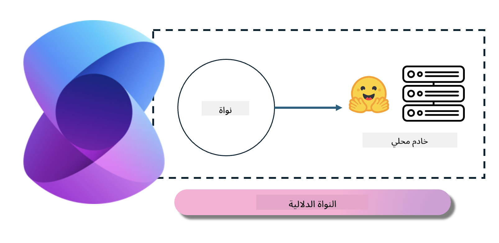
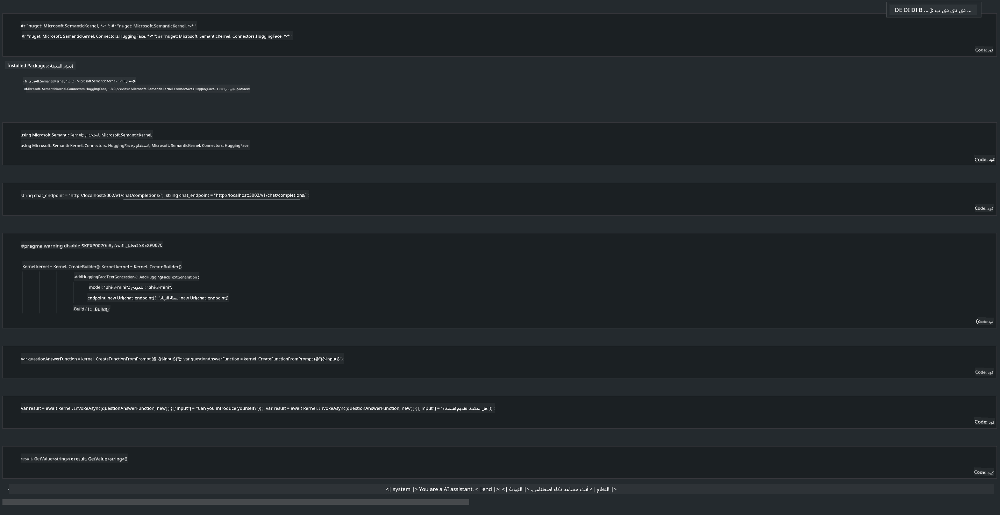

<!--
CO_OP_TRANSLATOR_METADATA:
{
  "original_hash": "bcf5dd7031db0031abdb9dd0c05ba118",
  "translation_date": "2025-03-27T07:43:58+00:00",
  "source_file": "md\\01.Introduction\\03\\Local_Server_Inference.md",
  "language_code": "ar"
}
-->
# **تشغيل Phi-3 على الخادم المحلي**

يمكننا تشغيل Phi-3 على خادم محلي. يمكن للمستخدمين اختيار حلول [Ollama](https://ollama.com) أو [LM Studio](https://llamaedge.com)، أو يمكنهم كتابة الكود الخاص بهم. يمكنكم الاتصال بخدمات Phi-3 المحلية من خلال [Semantic Kernel](https://github.com/microsoft/semantic-kernel?WT.mc_id=aiml-138114-kinfeylo) أو [Langchain](https://www.langchain.com/) لإنشاء تطبيقات Copilot.

## **استخدام Semantic Kernel للوصول إلى Phi-3-mini**

في تطبيق Copilot، نقوم بإنشاء التطبيقات من خلال Semantic Kernel / LangChain. هذا النوع من أطر العمل للتطبيقات يتوافق بشكل عام مع Azure OpenAI Service / نماذج OpenAI، ويمكنه أيضًا دعم النماذج مفتوحة المصدر على Hugging Face والنماذج المحلية. ماذا نفعل إذا أردنا استخدام Semantic Kernel للوصول إلى Phi-3-mini؟ باستخدام .NET كمثال، يمكننا دمجه مع موصل Hugging Face في Semantic Kernel. بشكل افتراضي، يمكنه الإشارة إلى معرف النموذج على Hugging Face (في المرة الأولى التي تستخدمه، سيتم تنزيل النموذج من Hugging Face، مما يستغرق وقتًا طويلاً). كما يمكنكم الاتصال بالخدمة المحلية التي تم إنشاؤها. بالمقارنة بين الطريقتين، نوصي باستخدام الأخيرة لأنها توفر درجة أعلى من التحكم، خاصة في تطبيقات المؤسسات.

كما هو موضح في الصورة، يمكن الوصول إلى الخدمات المحلية بسهولة من خلال Semantic Kernel للاتصال بخادم نموذج Phi-3-mini الذي تم إنشاؤه ذاتيًا. وفيما يلي نتيجة التشغيل:

***عينة الكود*** https://github.com/kinfey/Phi3MiniSamples/tree/main/semantickernel

**إخلاء المسؤولية**:  
تمت ترجمة هذا المستند باستخدام خدمة الترجمة بالذكاء الاصطناعي [Co-op Translator](https://github.com/Azure/co-op-translator). بينما نسعى لتحقيق الدقة، يرجى العلم أن الترجمات الآلية قد تحتوي على أخطاء أو عدم دقة. يجب اعتبار المستند الأصلي بلغته الأصلية هو المصدر الرسمي. للحصول على معلومات حاسمة، يُوصى بالاستعانة بترجمة بشرية احترافية. نحن غير مسؤولين عن أي سوء فهم أو تفسيرات خاطئة ناتجة عن استخدام هذه الترجمة.