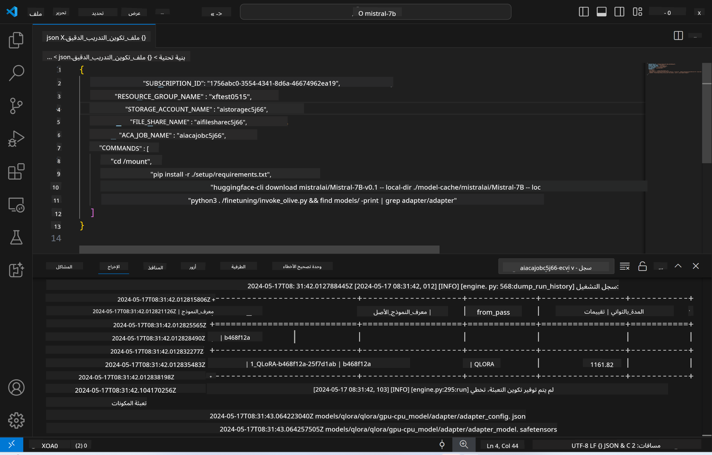
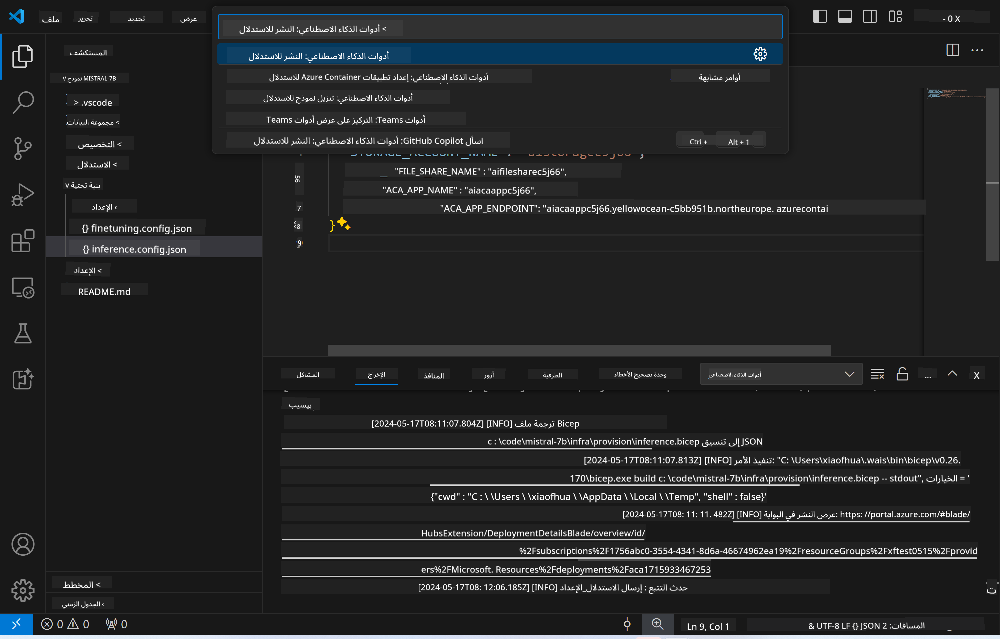
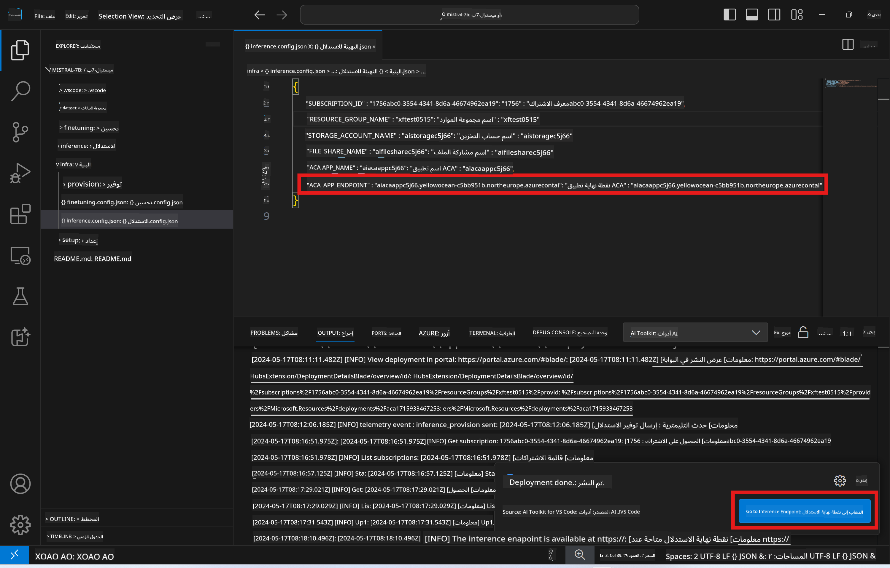

<!--
CO_OP_TRANSLATOR_METADATA:
{
  "original_hash": "a54cd3d65b6963e4e8ce21e143c3ab04",
  "translation_date": "2025-03-27T08:02:24+00:00",
  "source_file": "md\\01.Introduction\\03\\Remote_Interence.md",
  "language_code": "ar"
}
-->
# الاستدلال عن بُعد باستخدام النموذج المُحسن

بعد تدريب المحولات في البيئة البعيدة، يمكنك استخدام تطبيق Gradio بسيط للتفاعل مع النموذج.



### إعداد موارد Azure
تحتاج إلى إعداد موارد Azure للاستدلال عن بُعد عن طريق تنفيذ `AI Toolkit: Provision Azure Container Apps for inference` من لوحة الأوامر. أثناء هذه العملية، سيُطلب منك اختيار اشتراك Azure ومجموعة الموارد الخاصة بك.  


بشكل افتراضي، يجب أن يتطابق الاشتراك ومجموعة الموارد للاستدلال مع تلك المستخدمة في تحسين النموذج. سيستخدم الاستدلال نفس بيئة تطبيقات Azure Container ويصل إلى النموذج ومحول النموذج المخزن في ملفات Azure التي تم إنشاؤها خلال خطوة التحسين.

## استخدام أدوات الذكاء الاصطناعي

### النشر للاستدلال  
إذا كنت ترغب في تعديل كود الاستدلال أو إعادة تحميل النموذج الخاص بالاستدلال، يرجى تنفيذ أمر `AI Toolkit: Deploy for inference`. سيؤدي ذلك إلى مزامنة الكود الأخير الخاص بك مع ACA وإعادة تشغيل النسخة.



بعد اكتمال عملية النشر بنجاح، يصبح النموذج جاهزًا للتقييم باستخدام نقطة النهاية.

### الوصول إلى واجهة برمجة تطبيقات الاستدلال

يمكنك الوصول إلى واجهة برمجة تطبيقات الاستدلال بالنقر على زر "*الانتقال إلى نقطة نهاية الاستدلال*" المعروض في إشعار VSCode. بدلاً من ذلك، يمكن العثور على نقطة نهاية واجهة الويب API تحت `ACA_APP_ENDPOINT` في `./infra/inference.config.json` وفي لوحة الإخراج.



> **ملاحظة:** قد تحتاج نقطة نهاية الاستدلال إلى بضع دقائق لتصبح جاهزة تمامًا للعمل.

## مكونات الاستدلال الموجودة في القالب

| المجلد | المحتويات |
| ------ |--------- |
| `infra` | يحتوي على جميع التكوينات اللازمة للعمليات البعيدة. |
| `infra/provision/inference.parameters.json` | يحتوي على معلمات لقوالب bicep، المستخدمة في إعداد موارد Azure للاستدلال. |
| `infra/provision/inference.bicep` | يحتوي على قوالب لإعداد موارد Azure للاستدلال. |
| `infra/inference.config.json` | ملف التكوين، الذي يتم إنشاؤه بواسطة أمر `AI Toolkit: Provision Azure Container Apps for inference`. يتم استخدامه كمدخل لأوامر أخرى من لوحة الأوامر البعيدة. |

### استخدام أدوات الذكاء الاصطناعي لتكوين إعداد موارد Azure
قم بتكوين [أدوات الذكاء الاصطناعي](https://marketplace.visualstudio.com/items?itemName=ms-windows-ai-studio.windows-ai-studio)

قم بإعداد تطبيقات Azure Container للاستدلال ` command.

You can find configuration parameters in `./infra/provision/inference.parameters.json` file. Here are the details:
| Parameter | Description |
| --------- |------------ |
| `defaultCommands` | This is the commands to initiate a web API. |
| `maximumInstanceCount` | This parameter sets the maximum capacity of GPU instances. |
| `location` | This is the location where Azure resources are provisioned. The default value is the same as the chosen resource group's location. |
| `storageAccountName`, `fileShareName` `acaEnvironmentName`, `acaEnvironmentStorageName`, `acaAppName`,  `acaLogAnalyticsName` | These parameters are used to name the Azure resources for provision. By default, they will be same to the fine-tuning resource name. You can input a new, unused resource name to create your own custom-named resources, or you can input the name of an already existing Azure resource if you'd prefer to use that. For details, refer to the section [Using existing Azure Resources](../../../../../md/01.Introduction/03). |

### Using Existing Azure Resources

By default, the inference provision use the same Azure Container App Environment, Storage Account, Azure File Share, and Azure Log Analytics that were used for fine-tuning. A separate Azure Container App is created solely for the inference API. 

If you have customized the Azure resources during the fine-tuning step or want to use your own existing Azure resources for inference, specify their names in the `./infra/inference.parameters.json` file. ثم قم بتنفيذ أمر `AI Toolkit: Provision Azure Container Apps for inference` من لوحة الأوامر. يقوم هذا بتحديث أي موارد محددة وإنشاء أي موارد مفقودة.

على سبيل المثال، إذا كان لديك بيئة حاويات Azure موجودة بالفعل، يجب أن يبدو ملف `./infra/finetuning.parameters.json` الخاص بك كما يلي:

```json
{
    "$schema": "https://schema.management.azure.com/schemas/2019-04-01/deploymentParameters.json#",
    "contentVersion": "1.0.0.0",
    "parameters": {
      ...
      "acaEnvironmentName": {
        "value": "<your-aca-env-name>"
      },
      "acaEnvironmentStorageName": {
        "value": null
      },
      ...
    }
  }
```

### الإعداد اليدوي  
إذا كنت تفضل إعداد موارد Azure يدويًا، يمكنك استخدام ملفات bicep المقدمة في `./infra/provision` folders. If you have already set up and configured all the Azure resources without using the AI Toolkit command palette, you can simply enter the resource names in the `inference.config.json` file.

على سبيل المثال:

```json
{
  "SUBSCRIPTION_ID": "<your-subscription-id>",
  "RESOURCE_GROUP_NAME": "<your-resource-group-name>",
  "STORAGE_ACCOUNT_NAME": "<your-storage-account-name>",
  "FILE_SHARE_NAME": "<your-file-share-name>",
  "ACA_APP_NAME": "<your-aca-name>",
  "ACA_APP_ENDPOINT": "<your-aca-endpoint>"
}
```

**إخلاء المسؤولية**:  
تم ترجمة هذه الوثيقة باستخدام خدمة الترجمة بالذكاء الاصطناعي [Co-op Translator](https://github.com/Azure/co-op-translator). بينما نسعى لتحقيق الدقة، يُرجى العلم أن الترجمات الآلية قد تحتوي على أخطاء أو معلومات غير دقيقة. يجب اعتبار الوثيقة الأصلية بلغتها الأصلية المصدر الرسمي. للحصول على معلومات حساسة، يُوصى بالاستعانة بترجمة بشرية احترافية. نحن غير مسؤولين عن أي سوء فهم أو تفسير خاطئ ينشأ عن استخدام هذه الترجمة.