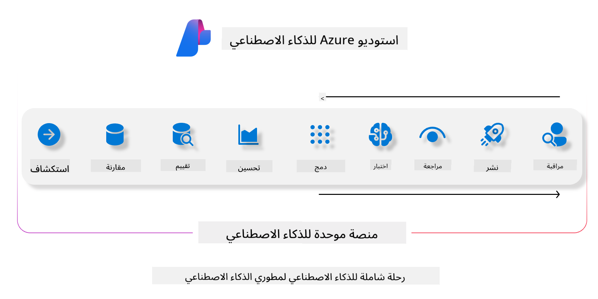
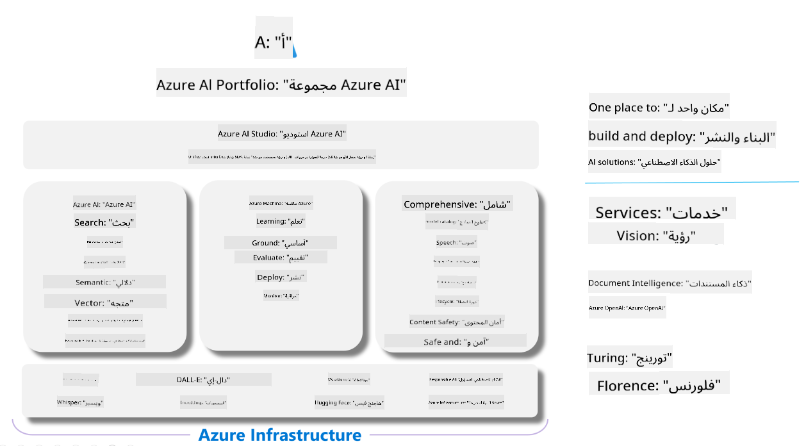

<!--
CO_OP_TRANSLATOR_METADATA:
{
  "original_hash": "7b4235159486df4000e16b7b46ddfec3",
  "translation_date": "2025-03-27T08:52:43+00:00",
  "source_file": "md\\01.Introduction\\05\\AIFoundry.md",
  "language_code": "ar"
}
-->
# **استخدام Azure AI Foundry للتقييم**

كيفية تقييم تطبيق الذكاء الاصطناعي التوليدي الخاص بك باستخدام [Azure AI Foundry](https://ai.azure.com?WT.mc_id=aiml-138114-kinfeylo). سواء كنت تقوم بتقييم محادثات قصيرة أو متعددة الأدوار، يوفر Azure AI Foundry أدوات لتقييم أداء النموذج وسلامته.

## كيفية تقييم تطبيقات الذكاء الاصطناعي التوليدي باستخدام Azure AI Foundry
للحصول على تعليمات أكثر تفصيلًا، راجع [وثائق Azure AI Foundry](https://learn.microsoft.com/azure/ai-studio/how-to/evaluate-generative-ai-app?WT.mc_id=aiml-138114-kinfeylo)

إليك الخطوات للبدء:

## تقييم نماذج الذكاء الاصطناعي التوليدي في Azure AI Foundry

**المتطلبات الأساسية**

- مجموعة بيانات اختبار بصيغة CSV أو JSON.
- نموذج ذكاء اصطناعي توليدي منشور (مثل Phi-3، GPT 3.5، GPT 4، أو نماذج Davinci).
- بيئة تشغيل مع وحدة حوسبة لتشغيل التقييم.

## مقاييس التقييم المدمجة

يسمح Azure AI Foundry بتقييم المحادثات القصيرة والمحادثات المعقدة متعددة الأدوار.  
بالنسبة لسيناريوهات استرجاع البيانات المدعمة (RAG)، حيث يتم تأصيل النموذج في بيانات محددة، يمكنك تقييم الأداء باستخدام مقاييس التقييم المدمجة.  
بالإضافة إلى ذلك، يمكنك تقييم سيناريوهات الإجابة على الأسئلة العامة قصيرة الأمد (غير RAG).

## إنشاء عملية تقييم

من واجهة المستخدم الخاصة بـ Azure AI Foundry، انتقل إلى صفحة التقييم أو صفحة تدفق الأوامر.  
اتبع معالج إنشاء التقييم لإعداد عملية التقييم. قم بتوفير اسم اختياري لتقييمك.  
حدد السيناريو الذي يتماشى مع أهداف تطبيقك.  
اختر واحدًا أو أكثر من مقاييس التقييم لتقييم مخرجات النموذج.

## تدفق تقييم مخصص (اختياري)

للحصول على مرونة أكبر، يمكنك إنشاء تدفق تقييم مخصص. قم بتخصيص عملية التقييم بناءً على احتياجاتك الخاصة.

## عرض النتائج

بعد تشغيل التقييم، قم بتسجيل، عرض، وتحليل مقاييس التقييم التفصيلية في Azure AI Foundry. احصل على رؤى حول قدرات تطبيقك وحدوده.

**ملاحظة**  
Azure AI Foundry حاليًا في مرحلة المعاينة العامة، لذا يُفضل استخدامه لأغراض التجربة والتطوير.  
لأعباء العمل الإنتاجية، فكر في خيارات أخرى. استكشف [وثائق AI Foundry الرسمية](https://learn.microsoft.com/azure/ai-studio/?WT.mc_id=aiml-138114-kinfeylo) للحصول على مزيد من التفاصيل والتعليمات خطوة بخطوة.

**إخلاء المسؤولية**:  
تم ترجمة هذا المستند باستخدام خدمة الترجمة بالذكاء الاصطناعي [Co-op Translator](https://github.com/Azure/co-op-translator). بينما نسعى لتحقيق الدقة، يرجى العلم أن الترجمات الآلية قد تحتوي على أخطاء أو معلومات غير دقيقة. يجب اعتبار المستند الأصلي بلغته الأصلية المصدر الموثوق. للحصول على معلومات حاسمة، يُوصى بالترجمة البشرية الاحترافية. نحن غير مسؤولين عن أي سوء فهم أو تفسيرات خاطئة تنشأ عن استخدام هذه الترجمة.