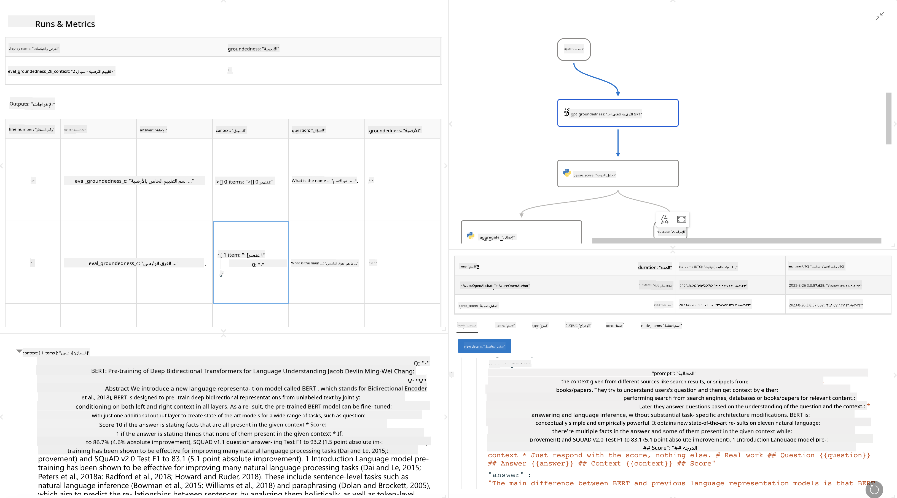

<!--
CO_OP_TRANSLATOR_METADATA:
{
  "original_hash": "3cbe7629d254f1043193b7fe22524d55",
  "translation_date": "2025-03-27T09:02:52+00:00",
  "source_file": "md\\01.Introduction\\05\\Promptflow.md",
  "language_code": "ar"
}
-->
# **تعرف على Promptflow**

[Microsoft Prompt Flow](https://microsoft.github.io/promptflow/index.html?WT.mc_id=aiml-138114-kinfeylo) هو أداة مرئية لأتمتة سير العمل، تتيح للمستخدمين إنشاء سير عمل آلي باستخدام قوالب جاهزة ووصلات مخصصة. تم تصميمه لتمكين المطورين والمحللين التجاريين من بناء عمليات آلية بسرعة لمهام مثل إدارة البيانات، التعاون، وتحسين العمليات. باستخدام Prompt Flow، يمكن للمستخدمين بسهولة ربط خدمات، تطبيقات، وأنظمة مختلفة وأتمتة العمليات التجارية المعقدة.

تم تصميم Microsoft Prompt Flow لتبسيط دورة التطوير الشاملة لتطبيقات الذكاء الاصطناعي المدعومة بنماذج اللغة الكبيرة (LLMs). سواء كنت تعمل على توليد الأفكار، النمذجة الأولية، الاختبار، التقييم، أو نشر التطبيقات المستندة إلى LLM، فإن Prompt Flow يسهل العملية ويمكّنك من بناء تطبيقات LLM بجودة إنتاجية.

## فيما يلي الميزات والفوائد الرئيسية لاستخدام Microsoft Prompt Flow:

**تجربة تأليف تفاعلية**

يوفر Prompt Flow تمثيلًا مرئيًا لهيكل التدفق الخاص بك، مما يجعل من السهل فهم مشاريعك والتنقل فيها.  
يقدم تجربة برمجة شبيهة بالمفكرة لتطوير التدفقات وتصحيحها بكفاءة.

**تنويعات المحفزات وضبطها**

أنشئ وقارن بين تنويعات متعددة للمحفزات لتسهيل عملية التكرار والتنقيح.  
قيّم أداء المحفزات المختلفة واختر الأكثر فعالية.

**تدفقات تقييم مدمجة**

قيّم جودة وفعالية المحفزات والتدفقات باستخدام أدوات التقييم المدمجة.  
افهم مدى أداء تطبيقاتك المستندة إلى LLM.

**موارد شاملة**

يتضمن Prompt Flow مكتبة من الأدوات والعينات والقوالب المدمجة.  
تعمل هذه الموارد كنقطة انطلاق للتطوير، تلهم الإبداع، وتسرّع العملية.

**التعاون والاستعداد المؤسسي**

دعم التعاون بين الفريق من خلال السماح لعدة مستخدمين بالعمل معًا على مشاريع هندسة المحفزات.  
حافظ على التحكم بالإصدارات وشارك المعرفة بفعالية.  
قم بتبسيط عملية هندسة المحفزات بالكامل، بدءًا من التطوير والتقييم إلى النشر والمراقبة.

## التقييم في Prompt Flow

في Microsoft Prompt Flow، يلعب التقييم دورًا حاسمًا في قياس مدى أداء نماذج الذكاء الاصطناعي الخاصة بك. دعونا نستكشف كيفية تخصيص تدفقات التقييم والمقاييس داخل Prompt Flow:

**فهم التقييم في Prompt Flow**

في Prompt Flow، يمثل التدفق سلسلة من العقد التي تعالج المدخلات وتولد المخرجات.  
تدفقات التقييم هي نوع خاص من التدفقات المصممة لتقييم أداء تشغيل معين بناءً على معايير وأهداف محددة.

**الميزات الرئيسية لتدفقات التقييم**

عادةً ما تعمل بعد التدفق الذي يتم اختباره باستخدام مخرجاته.  
تحسب درجات أو مقاييس لقياس أداء التدفق الذي تم اختباره.  
يمكن أن تشمل المقاييس الدقة، درجات الملاءمة، أو أي مقاييس ذات صلة.

### تخصيص تدفقات التقييم

**تعريف المدخلات**

تحتاج تدفقات التقييم إلى استخدام مخرجات التشغيل الذي يتم اختباره.  
قم بتعريف المدخلات بنفس الطريقة التي تُعرف بها التدفقات العادية.  
على سبيل المثال، إذا كنت تقيم تدفق أسئلة وأجوبة (QnA)، قم بتسمية المدخل بـ "الإجابة". إذا كنت تقيم تدفق تصنيف، قم بتسمية المدخل بـ "الفئة". قد تكون هناك حاجة أيضًا إلى مدخلات الحقيقة الأرضية (مثل التصنيفات الفعلية).

**المخرجات والمقاييس**

تنتج تدفقات التقييم نتائج تقيس أداء التدفق الذي تم اختباره.  
يمكن حساب المقاييس باستخدام Python أو نماذج اللغة الكبيرة (LLM).  
استخدم وظيفة log_metric() لتسجيل المقاييس ذات الصلة.

**استخدام تدفقات التقييم المخصصة**

قم بتطوير تدفق تقييم خاص بك مخصص لمهامك وأهدافك المحددة.  
خصص المقاييس بناءً على أهداف التقييم الخاصة بك.  
طبق تدفق التقييم المخصص هذا على عمليات التشغيل الدُفعية للاختبار على نطاق واسع.

## طرق التقييم المدمجة

يوفر Prompt Flow أيضًا طرق تقييم مدمجة.  
يمكنك تقديم عمليات تشغيل دُفعية واستخدام هذه الطرق لتقييم مدى أداء تدفقك مع مجموعات بيانات كبيرة.  
عرض نتائج التقييم، مقارنة المقاييس، وإجراء التعديلات حسب الحاجة.  
تذكر أن التقييم ضروري لضمان أن نماذج الذكاء الاصطناعي الخاصة بك تلبي المعايير والأهداف المطلوبة.  
استكشف الوثائق الرسمية للحصول على تعليمات مفصلة حول تطوير واستخدام تدفقات التقييم في Microsoft Prompt Flow.

باختصار، يمكّن Microsoft Prompt Flow المطورين من إنشاء تطبيقات LLM عالية الجودة من خلال تبسيط هندسة المحفزات وتوفير بيئة تطوير قوية. إذا كنت تعمل مع LLMs، فإن Prompt Flow هو أداة قيمة لاستكشافها. استكشف [وثائق تقييم Prompt Flow](https://learn.microsoft.com/azure/machine-learning/prompt-flow/how-to-develop-an-evaluation-flow?view=azureml-api-2?WT.mc_id=aiml-138114-kinfeylo) للحصول على تعليمات مفصلة حول تطوير واستخدام تدفقات التقييم في Microsoft Prompt Flow.

**إخلاء مسؤولية**:  
تم ترجمة هذا المستند باستخدام خدمة الترجمة بالذكاء الاصطناعي [Co-op Translator](https://github.com/Azure/co-op-translator). بينما نسعى لتحقيق الدقة، يرجى العلم أن الترجمات الآلية قد تحتوي على أخطاء أو معلومات غير دقيقة. يجب اعتبار المستند الأصلي بلغته الأصلية هو المصدر الموثوق. للحصول على معلومات حساسة أو هامة، يُوصى بالاستعانة بترجمة بشرية احترافية. نحن غير مسؤولين عن أي سوء فهم أو تفسيرات خاطئة ناتجة عن استخدام هذه الترجمة.