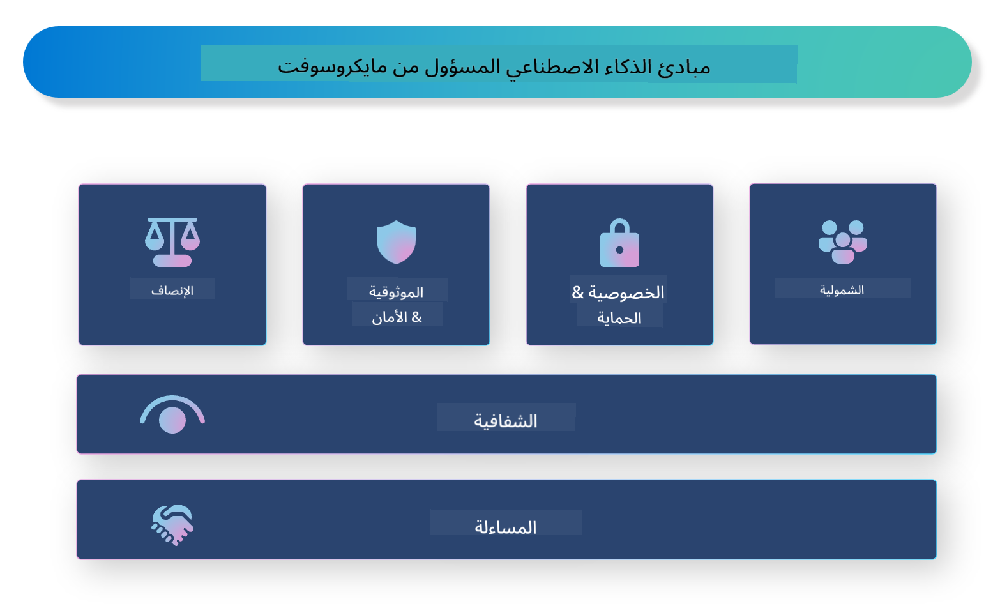

<!--
CO_OP_TRANSLATOR_METADATA:
{
  "original_hash": "805b96b20152936d8f4c587d90d6e06e",
  "translation_date": "2025-03-27T09:13:17+00:00",
  "source_file": "md\\01.Introduction\\05\\ResponsibleAI.md",
  "language_code": "ar"
}
-->
# **مقدمة إلى الذكاء الاصطناعي المسؤول**

[Microsoft Responsible AI](https://www.microsoft.com/ai/responsible-ai?WT.mc_id=aiml-138114-kinfeylo) هي مبادرة تهدف إلى مساعدة المطورين والمنظمات على بناء أنظمة ذكاء اصطناعي تكون شفافة، جديرة بالثقة، وقابلة للمساءلة. تقدم المبادرة إرشادات وموارد لتطوير حلول ذكاء اصطناعي مسؤولة تتماشى مع المبادئ الأخلاقية، مثل الخصوصية، العدالة، والشفافية. سنستكشف أيضًا بعض التحديات وأفضل الممارسات المرتبطة ببناء أنظمة ذكاء اصطناعي مسؤولة.

## نظرة عامة على الذكاء الاصطناعي المسؤول من مايكروسوفت

**المبادئ الأخلاقية**

يقوم الذكاء الاصطناعي المسؤول من مايكروسوفت على مجموعة من المبادئ الأخلاقية، مثل الخصوصية، العدالة، الشفافية، المساءلة، والسلامة. تهدف هذه المبادئ إلى ضمان تطوير أنظمة ذكاء اصطناعي بطريقة أخلاقية ومسؤولة.

**الذكاء الاصطناعي الشفاف**

يؤكد الذكاء الاصطناعي المسؤول من مايكروسوفت على أهمية الشفافية في أنظمة الذكاء الاصطناعي. يتضمن ذلك تقديم تفسيرات واضحة حول كيفية عمل نماذج الذكاء الاصطناعي، بالإضافة إلى ضمان توفر مصادر البيانات والخوارزميات بشكل عام.

**الذكاء الاصطناعي القابل للمساءلة**

[Microsoft Responsible AI](https://www.microsoft.com/ai/responsible-ai?WT.mc_id=aiml-138114-kinfeylo) يشجع تطوير أنظمة ذكاء اصطناعي قابلة للمساءلة، قادرة على تقديم رؤى حول كيفية اتخاذ نماذج الذكاء الاصطناعي للقرارات. يمكن أن يساعد ذلك المستخدمين على فهم مخرجات الأنظمة وكسب ثقتهم.

**الشمولية**

يجب تصميم أنظمة الذكاء الاصطناعي لتفيد الجميع. تسعى مايكروسوفت إلى إنشاء ذكاء اصطناعي شامل يأخذ في الاعتبار وجهات نظر متنوعة ويتجنب التحيز أو التمييز.

**الموثوقية والسلامة**

ضمان موثوقية وسلامة أنظمة الذكاء الاصطناعي أمر بالغ الأهمية. تركز مايكروسوفت على بناء نماذج قوية تعمل بشكل ثابت وتتجنب النتائج الضارة.

**العدالة في الذكاء الاصطناعي**

يدرك الذكاء الاصطناعي المسؤول من مايكروسوفت أن أنظمة الذكاء الاصطناعي قد تعزز التحيز إذا تم تدريبها على بيانات أو خوارزميات متحيزة. توفر المبادرة إرشادات لتطوير أنظمة ذكاء اصطناعي عادلة لا تميز بناءً على عوامل مثل العرق، الجنس، أو العمر.

**الخصوصية والأمان**

يؤكد الذكاء الاصطناعي المسؤول من مايكروسوفت على أهمية حماية خصوصية المستخدم وأمان البيانات في أنظمة الذكاء الاصطناعي. يشمل ذلك تنفيذ تشفير قوي للبيانات وضوابط الوصول، بالإضافة إلى إجراء تدقيق منتظم لأنظمة الذكاء الاصطناعي للكشف عن الثغرات.

**المساءلة والمسؤولية**

يشجع الذكاء الاصطناعي المسؤول من مايكروسوفت على المساءلة والمسؤولية في تطوير ونشر الذكاء الاصطناعي. يتضمن ذلك ضمان أن يكون المطورون والمنظمات على دراية بالمخاطر المحتملة المرتبطة بأنظمة الذكاء الاصطناعي، واتخاذ خطوات للتخفيف من تلك المخاطر.

## أفضل الممارسات لبناء أنظمة ذكاء اصطناعي مسؤولة

**تطوير نماذج ذكاء اصطناعي باستخدام مجموعات بيانات متنوعة**

لتجنب التحيز في أنظمة الذكاء الاصطناعي، من المهم استخدام مجموعات بيانات متنوعة تمثل مجموعة واسعة من وجهات النظر والخبرات.

**استخدام تقنيات الذكاء الاصطناعي القابلة للتفسير**

يمكن أن تساعد تقنيات الذكاء الاصطناعي القابلة للتفسير المستخدمين على فهم كيفية اتخاذ نماذج الذكاء الاصطناعي للقرارات، مما يزيد الثقة بالنظام.

**إجراء تدقيق منتظم لأنظمة الذكاء الاصطناعي للكشف عن الثغرات**

يمكن أن تساعد عمليات التدقيق المنتظمة لأنظمة الذكاء الاصطناعي في تحديد المخاطر والثغرات التي تحتاج إلى معالجة.

**تنفيذ تشفير قوي للبيانات وضوابط الوصول**

يمكن أن يساعد تشفير البيانات وضوابط الوصول في حماية خصوصية المستخدم وأمانه في أنظمة الذكاء الاصطناعي.

**اتباع المبادئ الأخلاقية في تطوير الذكاء الاصطناعي**

يمكن أن يساعد اتباع المبادئ الأخلاقية، مثل العدالة، الشفافية، والمساءلة، في بناء الثقة في أنظمة الذكاء الاصطناعي وضمان تطويرها بطريقة مسؤولة.

## استخدام AI Foundry للذكاء الاصطناعي المسؤول

[Azure AI Foundry](https://ai.azure.com?WT.mc_id=aiml-138114-kinfeylo) هي منصة قوية تسمح للمطورين والمنظمات بإنشاء تطبيقات ذكية ومتطورة وجاهزة للسوق ومسؤولة بسرعة. فيما يلي بعض الميزات والقدرات الرئيسية لـ Azure AI Foundry:

**واجهات برمجية ونماذج جاهزة**

يوفر Azure AI Foundry واجهات برمجية ونماذج مسبقة البناء وقابلة للتخصيص. تغطي هذه مجموعة واسعة من مهام الذكاء الاصطناعي، بما في ذلك الذكاء الاصطناعي التوليدي، معالجة اللغة الطبيعية للمحادثات، البحث، المراقبة، الترجمة، الصوت، الرؤية، واتخاذ القرار.

**Prompt Flow**

يساعد تدفق المحادثات في Azure AI Foundry على إنشاء تجارب ذكاء اصطناعي تفاعلية. يتيح تصميم وإدارة تدفقات المحادثات، مما يسهل بناء روبوتات الدردشة والمساعدين الافتراضيين وتطبيقات تفاعلية أخرى.

**توليد معزز بالاسترجاع (RAG)**

RAG هي تقنية تجمع بين النهج القائم على الاسترجاع والنهج القائم على التوليد. تعزز جودة الردود المولدة من خلال الاستفادة من المعرفة السابقة (الاسترجاع) والتوليد الإبداعي (التوليد).

**مقاييس التقييم والمراقبة للذكاء الاصطناعي التوليدي**

يوفر Azure AI Foundry أدوات لتقييم ومراقبة نماذج الذكاء الاصطناعي التوليدي. يمكنك تقييم أدائها، عدالتها، وغيرها من المقاييس المهمة لضمان النشر المسؤول. بالإضافة إلى ذلك، إذا كنت قد أنشأت لوحة معلومات، يمكنك استخدام واجهة المستخدم بدون أكواد في Azure Machine Learning Studio لتخصيص وإنشاء لوحة معلومات الذكاء الاصطناعي المسؤول والبطاقة المرتبطة بناءً على مكتبات Python لـ [Responsible AI Toolbox](https://responsibleaitoolbox.ai/?WT.mc_id=aiml-138114-kinfeylo). تساعد هذه البطاقة في مشاركة رؤى رئيسية تتعلق بالعدالة، أهمية الميزات، وغيرها من اعتبارات النشر المسؤول مع أصحاب المصلحة الفنيين وغير الفنيين.

للاستخدام المسؤول للذكاء الاصطناعي مع AI Foundry، يمكنك اتباع هذه الممارسات:

**تحديد المشكلة وأهداف النظام الخاص بك**

قبل بدء عملية التطوير، من المهم تحديد المشكلة أو الهدف الذي يهدف نظام الذكاء الاصطناعي إلى حله بوضوح. سيساعدك ذلك في تحديد البيانات والخوارزميات والموارد اللازمة لبناء نموذج فعال.

**جمع ومعالجة البيانات ذات الصلة**

يمكن أن يكون لجودة وكمية البيانات المستخدمة في تدريب نظام الذكاء الاصطناعي تأثير كبير على أدائه. لذلك، من المهم جمع البيانات ذات الصلة، تنظيفها، معالجتها، والتأكد من أنها تمثل السكان أو المشكلة التي تحاول حلها.

**اختيار التقييم المناسب**

هناك العديد من خوارزميات التقييم المتاحة. من المهم اختيار الخوارزمية الأكثر ملاءمة بناءً على بياناتك ومشكلتك.

**تقييم وتفسير النموذج**

بمجرد بناء نموذج الذكاء الاصطناعي، من المهم تقييم أدائه باستخدام المقاييس المناسبة وتفسير النتائج بطريقة شفافة. سيساعدك ذلك في تحديد أي تحيزات أو قيود في النموذج وإجراء تحسينات عند الضرورة.

**ضمان الشفافية وقابلية التفسير**

يجب أن تكون أنظمة الذكاء الاصطناعي شفافة وقابلة للتفسير حتى يتمكن المستخدمون من فهم كيفية عملها وكيفية اتخاذ القرارات. هذا مهم بشكل خاص للتطبيقات التي لها تأثير كبير على حياة البشر، مثل الرعاية الصحية، التمويل، والنظم القانونية.

**مراقبة وتحديث النموذج**

يجب مراقبة أنظمة الذكاء الاصطناعي باستمرار وتحديثها لضمان بقائها دقيقة وفعالة بمرور الوقت. يتطلب ذلك صيانة مستمرة، واختبار، وإعادة تدريب النموذج.

في الختام، الذكاء الاصطناعي المسؤول من مايكروسوفت هو مبادرة تهدف إلى مساعدة المطورين والمنظمات على بناء أنظمة ذكاء اصطناعي تكون شفافة، جديرة بالثقة، وقابلة للمساءلة. تذكر أن تنفيذ الذكاء الاصطناعي المسؤول أمر بالغ الأهمية، ويهدف Azure AI Foundry إلى جعله عمليًا للمنظمات. باتباع المبادئ الأخلاقية وأفضل الممارسات، يمكننا ضمان تطوير ونشر أنظمة ذكاء اصطناعي بطريقة مسؤولة تعود بالنفع على المجتمع ككل.

**إخلاء المسؤولية**:  
تم ترجمة هذه الوثيقة باستخدام خدمة ترجمة الذكاء الاصطناعي [Co-op Translator](https://github.com/Azure/co-op-translator). على الرغم من أننا نسعى لتحقيق الدقة، يرجى العلم أن الترجمات الآلية قد تحتوي على أخطاء أو عدم دقة. يجب اعتبار الوثيقة الأصلية بلغتها الأصلية المصدر الرسمي. للحصول على معلومات حاسمة، يُوصى باللجوء إلى ترجمة بشرية احترافية. نحن غير مسؤولين عن أي سوء فهم أو تفسيرات خاطئة ناتجة عن استخدام هذه الترجمة.