<!--
CO_OP_TRANSLATOR_METADATA:
{
  "original_hash": "7623679e8f69be39e2145094c05c00a8",
  "translation_date": "2025-03-27T09:39:53+00:00",
  "source_file": "md\\02.Application\\01.TextAndChat\\Phi3\\E2E_Phi-3-Evaluation_AIFoundry.md",
  "language_code": "ar"
}
-->
# تقييم نموذج Phi-3 / Phi-3.5 المحسن في Azure AI Foundry مع التركيز على مبادئ الذكاء الاصطناعي المسؤول من Microsoft

يعتمد هذا المثال المتكامل (E2E) على الدليل "[تقييم نماذج Phi-3 / Phi-3.5 المحسنة في Azure AI Foundry مع التركيز على الذكاء الاصطناعي المسؤول من Microsoft](https://techcommunity.microsoft.com/t5/educator-developer-blog/evaluate-fine-tuned-phi-3-3-5-models-in-azure-ai-studio-focusing/ba-p/4227850?WT.mc_id=aiml-137032-kinfeylo)" من مجتمع Microsoft Tech.

## نظرة عامة

### كيف يمكنك تقييم سلامة وأداء نموذج Phi-3 / Phi-3.5 المحسن في Azure AI Foundry؟

قد يؤدي تحسين النموذج أحيانًا إلى استجابات غير مقصودة أو غير مرغوب فيها. لضمان أن النموذج يظل آمنًا وفعالًا، من المهم تقييم إمكانية النموذج في إنتاج محتوى ضار وقدرته على تقديم استجابات دقيقة وذات صلة ومتسقة. في هذا البرنامج التعليمي، ستتعلم كيفية تقييم سلامة وأداء نموذج Phi-3 / Phi-3.5 المحسن والمُدمج مع Prompt flow في Azure AI Foundry.

فيما يلي عملية التقييم في Azure AI Foundry.

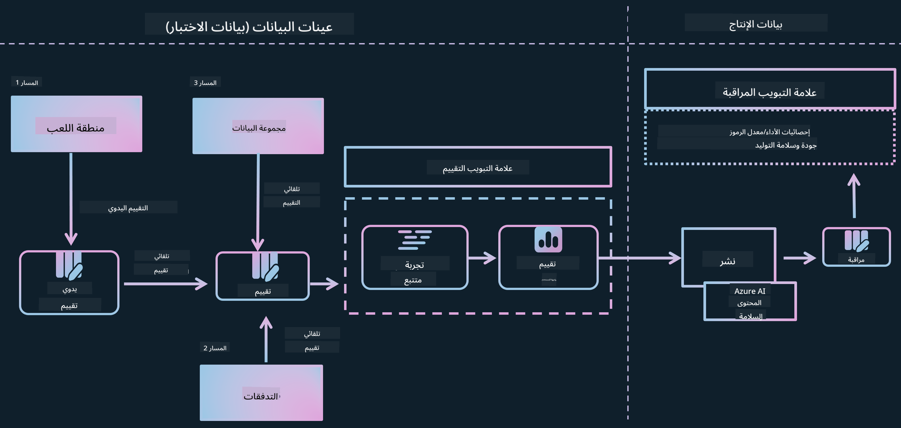

*مصدر الصورة: [تقييم تطبيقات الذكاء الاصطناعي التوليدي](https://learn.microsoft.com/azure/ai-studio/concepts/evaluation-approach-gen-ai?wt.mc_id%3Dstudentamb_279723)*

> [!NOTE]
>
> للحصول على معلومات أكثر تفصيلًا واستكشاف موارد إضافية حول Phi-3 / Phi-3.5، يرجى زيارة [Phi-3CookBook](https://github.com/microsoft/Phi-3CookBook?wt.mc_id=studentamb_279723).

### المتطلبات الأساسية

- [Python](https://www.python.org/downloads)
- [اشتراك Azure](https://azure.microsoft.com/free?wt.mc_id=studentamb_279723)
- [Visual Studio Code](https://code.visualstudio.com)
- نموذج Phi-3 / Phi-3.5 المحسن

### جدول المحتويات

1. [**السيناريو الأول: مقدمة لتقييم Prompt flow في Azure AI Foundry**](../../../../../../md/02.Application/01.TextAndChat/Phi3)

    - [مقدمة لتقييم السلامة](../../../../../../md/02.Application/01.TextAndChat/Phi3)
    - [مقدمة لتقييم الأداء](../../../../../../md/02.Application/01.TextAndChat/Phi3)

1. [**السيناريو الثاني: تقييم نموذج Phi-3 / Phi-3.5 في Azure AI Foundry**](../../../../../../md/02.Application/01.TextAndChat/Phi3)

    - [قبل أن تبدأ](../../../../../../md/02.Application/01.TextAndChat/Phi3)
    - [نشر Azure OpenAI لتقييم نموذج Phi-3 / Phi-3.5](../../../../../../md/02.Application/01.TextAndChat/Phi3)
    - [تقييم نموذج Phi-3 / Phi-3.5 المحسن باستخدام تقييم Prompt flow في Azure AI Foundry](../../../../../../md/02.Application/01.TextAndChat/Phi3)

1. [تهانينا!](../../../../../../md/02.Application/01.TextAndChat/Phi3)

## **السيناريو الأول: مقدمة لتقييم Prompt flow في Azure AI Foundry**

### مقدمة لتقييم السلامة

لضمان أن نموذج الذكاء الاصطناعي الخاص بك أخلاقي وآمن، من الضروري تقييمه بناءً على مبادئ الذكاء الاصطناعي المسؤول من Microsoft. في Azure AI Foundry، تتيح لك تقييمات السلامة تحليل ضعف النموذج أمام هجمات الاختراق وإمكانية إنتاج محتوى ضار، بما يتماشى مع هذه المبادئ.

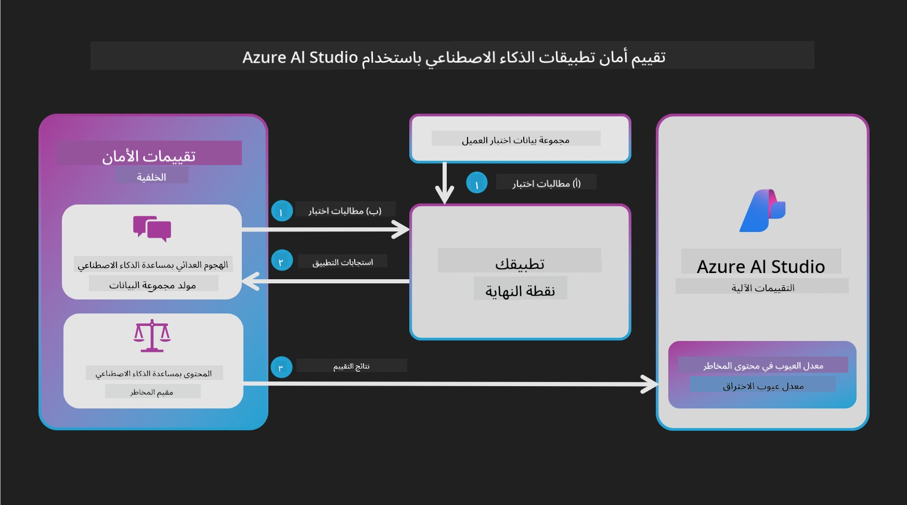

*مصدر الصورة: [تقييم تطبيقات الذكاء الاصطناعي التوليدي](https://learn.microsoft.com/azure/ai-studio/concepts/evaluation-approach-gen-ai?wt.mc_id%3Dstudentamb_279723)*

#### مبادئ الذكاء الاصطناعي المسؤول من Microsoft

قبل البدء في الخطوات التقنية، من المهم فهم مبادئ الذكاء الاصطناعي المسؤول من Microsoft، وهو إطار أخلاقي مصمم لتوجيه تطوير ونشر وتشغيل أنظمة الذكاء الاصطناعي بشكل مسؤول. هذه المبادئ توجه التصميم والتطوير والنشر المسؤول لأنظمة الذكاء الاصطناعي، مما يضمن أن تقنيات الذكاء الاصطناعي تُبنى بطريقة عادلة وشفافة وشاملة.

تشمل مبادئ الذكاء الاصطناعي المسؤول من Microsoft:

- **العدالة والشمولية**: يجب أن تعامل أنظمة الذكاء الاصطناعي الجميع بشكل عادل وتتجنب التأثير على مجموعات مماثلة من الأشخاص بطرق مختلفة. على سبيل المثال، عندما تقدم أنظمة الذكاء الاصطناعي إرشادات بشأن العلاج الطبي أو طلبات القروض أو التوظيف، يجب أن تقدم نفس التوصيات لكل من لديه ظروف مشابهة.

- **الموثوقية والسلامة**: لبناء الثقة، من الضروري أن تعمل أنظمة الذكاء الاصطناعي بشكل موثوق وآمن ومتسق. يجب أن تكون هذه الأنظمة قادرة على العمل كما تم تصميمها في الأصل، وأن تستجيب بأمان للظروف غير المتوقعة، وأن تقاوم التلاعب الضار.

- **الشفافية**: عندما تساعد أنظمة الذكاء الاصطناعي في اتخاذ قرارات لها تأثير كبير على حياة الناس، من الضروري أن يفهم الناس كيفية اتخاذ هذه القرارات. على سبيل المثال، قد تستخدم البنوك أنظمة الذكاء الاصطناعي لتحديد أهلية الشخص للحصول على القروض.

- **الخصوصية والأمان**: مع انتشار الذكاء الاصطناعي، يصبح حماية الخصوصية وتأمين المعلومات الشخصية والتجارية أكثر أهمية وتعقيدًا. تتطلب الخصوصية وأمان البيانات اهتمامًا دقيقًا لأن الوصول إلى البيانات ضروري لأنظمة الذكاء الاصطناعي لتقديم توقعات وقرارات دقيقة.

- **المسؤولية**: يجب أن يكون الأشخاص الذين يصممون وينشرون أنظمة الذكاء الاصطناعي مسؤولين عن كيفية عمل أنظمتهم. يجب على المنظمات الاستناد إلى معايير الصناعة لتطوير قواعد المسؤولية التي تضمن أن أنظمة الذكاء الاصطناعي ليست السلطة النهائية في أي قرار يؤثر على حياة الناس.

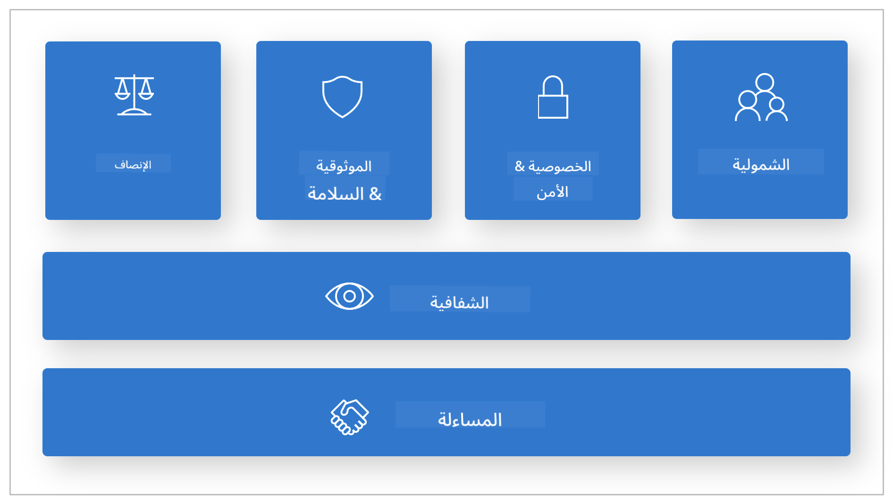

*مصدر الصورة: [ما هو الذكاء الاصطناعي المسؤول؟](https://learn.microsoft.com/azure/machine-learning/concept-responsible-ai?view=azureml-api-2&viewFallbackFrom=azureml-api-2%253fwt.mc_id%3Dstudentamb_279723)*

> [!NOTE]
> لمعرفة المزيد حول مبادئ الذكاء الاصطناعي المسؤول من Microsoft، قم بزيارة [ما هو الذكاء الاصطناعي المسؤول؟](https://learn.microsoft.com/azure/machine-learning/concept-responsible-ai?view=azureml-api-2?wt.mc_id=studentamb_279723).

#### معايير السلامة

في هذا البرنامج التعليمي، ستقوم بتقييم سلامة نموذج Phi-3 المحسن باستخدام معايير السلامة في Azure AI Foundry. تساعد هذه المعايير في تقييم إمكانية النموذج في إنتاج محتوى ضار وضعفه أمام هجمات الاختراق. تشمل معايير السلامة:

- **المحتوى المرتبط بإيذاء الذات**: تقييم ما إذا كان النموذج يميل إلى إنتاج محتوى يتعلق بإيذاء الذات.
- **المحتوى البغيض وغير العادل**: تقييم ما إذا كان النموذج يميل إلى إنتاج محتوى بغيض أو غير عادل.
- **المحتوى العنيف**: تقييم ما إذا كان النموذج يميل إلى إنتاج محتوى عنيف.
- **المحتوى الجنسي**: تقييم ما إذا كان النموذج يميل إلى إنتاج محتوى جنسي غير لائق.

تقييم هذه الجوانب يضمن أن نموذج الذكاء الاصطناعي لا ينتج محتوى ضارًا أو مهينًا، مما يجعله متوافقًا مع القيم المجتمعية والمعايير التنظيمية.

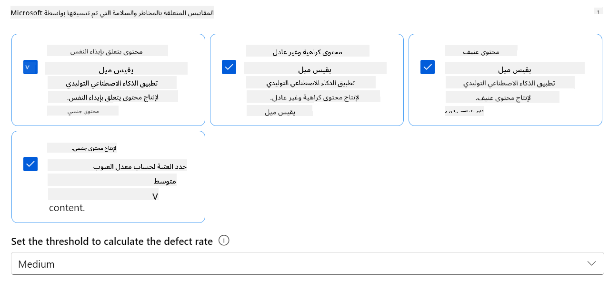

### مقدمة لتقييم الأداء

لضمان أن نموذج الذكاء الاصطناعي الخاص بك يعمل كما هو متوقع، من المهم تقييم أدائه بناءً على معايير الأداء. في Azure AI Foundry، تتيح لك تقييمات الأداء تحليل فعالية النموذج في إنتاج استجابات دقيقة وذات صلة ومتسقة.

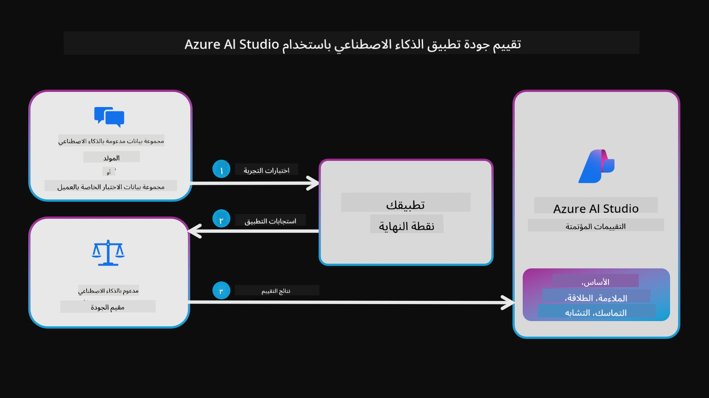

*مصدر الصورة: [تقييم تطبيقات الذكاء الاصطناعي التوليدي](https://learn.microsoft.com/azure/ai-studio/concepts/evaluation-approach-gen-ai?wt.mc_id%3Dstudentamb_279723)*

#### معايير الأداء

في هذا البرنامج التعليمي، ستقوم بتقييم أداء نموذج Phi-3 / Phi-3.5 المحسن باستخدام معايير الأداء في Azure AI Foundry. تساعد هذه المعايير في تقييم فعالية النموذج في إنتاج استجابات دقيقة وذات صلة ومتسقة. تشمل معايير الأداء:

- **التأصيل**: تقييم مدى توافق الإجابات المُنتجة مع المعلومات الواردة من المصدر.
- **الملاءمة**: تقييم مدى ارتباط الاستجابات المُنتجة بالأسئلة المعطاة.
- **الاتساق**: تقييم مدى سلاسة النص المُنتج وقراءته بشكل طبيعي ومشابه للغة البشرية.
- **الطلاقة**: تقييم مهارة اللغة للنص المُنتج.
- **تشابه GPT**: مقارنة الاستجابة المُنتجة بالحقيقة الأرضية من حيث التشابه.
- **درجة F1**: حساب نسبة الكلمات المشتركة بين الاستجابة المُنتجة وبيانات المصدر.

تساعد هذه المعايير في تقييم فعالية النموذج في إنتاج استجابات دقيقة وذات صلة ومتسقة.

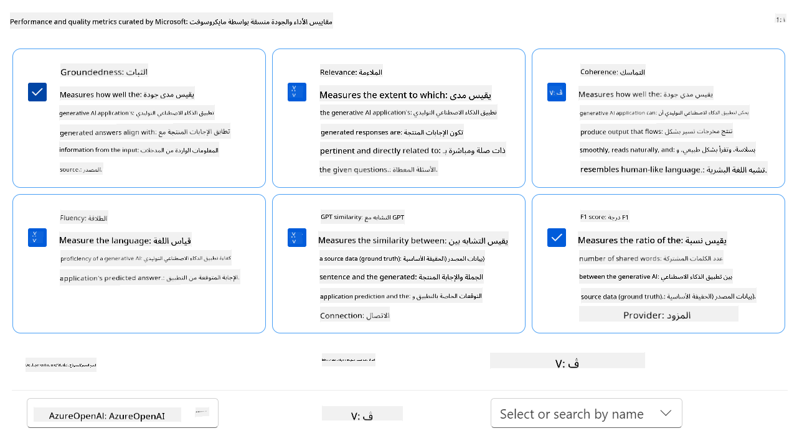

## **السيناريو الثاني: تقييم نموذج Phi-3 / Phi-3.5 في Azure AI Foundry**

### قبل أن تبدأ

هذا البرنامج التعليمي يُعد متابعة للمدونات السابقة، "[تحسين وتكامل نماذج Phi-3 المخصصة مع Prompt Flow: دليل خطوة بخطوة](https://techcommunity.microsoft.com/t5/educator-developer-blog/fine-tune-and-integrate-custom-phi-3-models-with-prompt-flow/ba-p/4178612?wt.mc_id=studentamb_279723)" و"[تحسين وتكامل نماذج Phi-3 المخصصة مع Prompt Flow في Azure AI Foundry](https://techcommunity.microsoft.com/t5/educator-developer-blog/fine-tune-and-integrate-custom-phi-3-models-with-prompt-flow-in/ba-p/4191726?wt.mc_id=studentamb_279723)." في هذه المدونات، قمنا بشرح عملية تحسين نموذج Phi-3 / Phi-3.5 في Azure AI Foundry وتكاملها مع Prompt flow.

في هذا البرنامج التعليمي، ستقوم بنشر نموذج Azure OpenAI كمقيم في Azure AI Foundry واستخدامه لتقييم نموذج Phi-3 / Phi-3.5 المحسن الخاص بك.

قبل البدء في هذا البرنامج التعليمي، تأكد من توفر المتطلبات الأساسية التالية، كما هو موضح في البرامج التعليمية السابقة:

1. مجموعة بيانات مُعدة لتقييم نموذج Phi-3 / Phi-3.5 المحسن.
1. نموذج Phi-3 / Phi-3.5 تم تحسينه ونشره في Azure Machine Learning.
1. تدفق Prompt مُدمج مع نموذج Phi-3 / Phi-3.5 المحسن في Azure AI Foundry.

> [!NOTE]
> ستستخدم ملف *test_data.jsonl* الموجود في مجلد البيانات من مجموعة بيانات **ULTRACHAT_200k** التي تم تنزيلها في المدونات السابقة، كمجموعة بيانات لتقييم نموذج Phi-3 / Phi-3.5 المحسن.

#### تكامل نموذج Phi-3 / Phi-3.5 المخصص مع Prompt flow في Azure AI Foundry (نهج البرمجة أولًا)

> [!NOTE]
> إذا اتبعت النهج ذو الكود المنخفض الموضح في "[تحسين وتكامل نماذج Phi-3 المخصصة مع Prompt Flow في Azure AI Foundry](https://techcommunity.microsoft.com/t5/educator-developer-blog/fine-tune-and-integrate-custom-phi-3-models-with-prompt-flow-in/ba-p/4191726?wt.mc_id=studentamb_279723)"، يمكنك تخطي هذا التمرين والمضي قدمًا إلى التمرين التالي.
> ومع ذلك، إذا اتبعت نهج البرمجة أولًا الموضح في "[تحسين وتكامل نماذج Phi-3 المخصصة مع Prompt Flow: دليل خطوة بخطوة](https://techcommunity.microsoft.com/t5/educator-developer-blog/fine-tune-and-integrate-custom-phi-3-models-with-prompt-flow/ba-p/4178612?wt.mc_id=studentamb_279723)" لتحسين ونشر نموذج Phi-3 / Phi-3.5 الخاص بك، فإن عملية ربط النموذج بتدفق Prompt مختلفة قليلاً. ستتعلم هذه العملية في هذا التمرين.

للمتابعة، تحتاج إلى دمج نموذج Phi-3 / Phi-3.5 المحسن الخاص بك في تدفق Prompt في Azure AI Foundry.

#### إنشاء محور Azure AI Foundry

تحتاج إلى إنشاء محور قبل إنشاء المشروع. يعمل المحور كمجموعة موارد، مما يتيح لك تنظيم وإدارة مشاريع متعددة داخل Azure AI Foundry.

1. قم بتسجيل الدخول إلى [Azure AI Foundry](https://ai.azure.com/?wt.mc_id=studentamb_279723).

1. اختر **جميع المحاور** من علامة التبويب الجانبية.

1. اختر **+ محور جديد** من قائمة التنقل.

    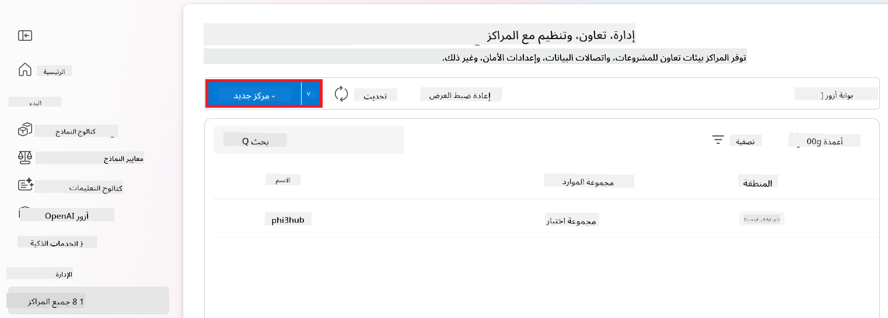

1. قم بتنفيذ المهام التالية:

    - أدخل **اسم المحور**. يجب أن يكون قيمة فريدة.
    - اختر اشتراك Azure الخاص بك **Subscription**.
    - اختر **مجموعة الموارد** التي تريد استخدامها (قم بإنشاء واحدة جديدة إذا لزم الأمر).
    - اختر **الموقع** الذي ترغب في استخدامه.
    - اختر **ربط خدمات Azure AI** للاستخدام (قم بإنشاء واحدة جديدة إذا لزم الأمر).
    - اختر **تخطي الربط** لـ **ربط بحث Azure AI**.
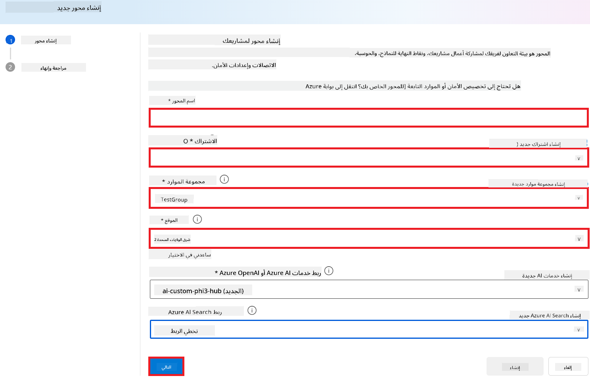

1. اختر **التالي**.

#### إنشاء مشروع Azure AI Foundry

1. في المركز الذي أنشأته، اختر **كل المشاريع** من علامة التبويب الجانبية اليسرى.

1. اختر **+ مشروع جديد** من قائمة التنقل.

    

1. أدخل **اسم المشروع**. يجب أن يكون قيمة فريدة.

    

1. اختر **إنشاء مشروع**.

#### إضافة اتصال مخصص لنموذج Phi-3 / Phi-3.5 المخصص والمُحسّن

لدمج نموذج Phi-3 / Phi-3.5 المخصص الخاص بك مع Prompt flow، تحتاج إلى حفظ نقطة النهاية والمفتاح الخاص بالنموذج في اتصال مخصص. يضمن هذا الإعداد الوصول إلى نموذج Phi-3 / Phi-3.5 المخصص الخاص بك في Prompt flow.

#### إعداد مفتاح API وعنوان URI لنقطة النهاية لنموذج Phi-3 / Phi-3.5 المخصص والمُحسّن

1. قم بزيارة [Azure ML Studio](https://ml.azure.com/home?wt.mc_id=studentamb_279723).

1. انتقل إلى مساحة عمل Azure Machine Learning التي أنشأتها.

1. اختر **نقاط النهاية** من علامة التبويب الجانبية اليسرى.

    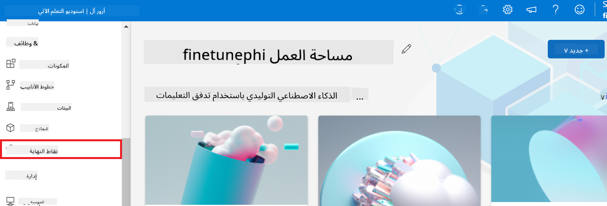

1. اختر نقطة النهاية التي أنشأتها.

    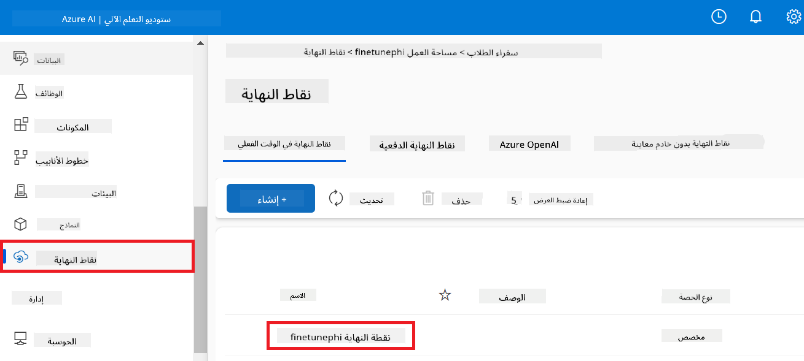

1. اختر **استهلاك** من قائمة التنقل.

1. انسخ **نقطة النهاية REST** و**المفتاح الأساسي** الخاص بك.

    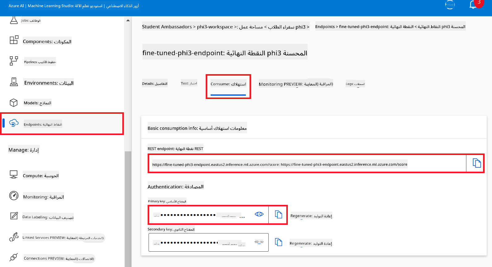

#### إضافة الاتصال المخصص

1. قم بزيارة [Azure AI Foundry](https://ai.azure.com/?wt.mc_id=studentamb_279723).

1. انتقل إلى مشروع Azure AI Foundry الذي أنشأته.

1. في المشروع الذي أنشأته، اختر **الإعدادات** من علامة التبويب الجانبية اليسرى.

1. اختر **+ اتصال جديد**.

    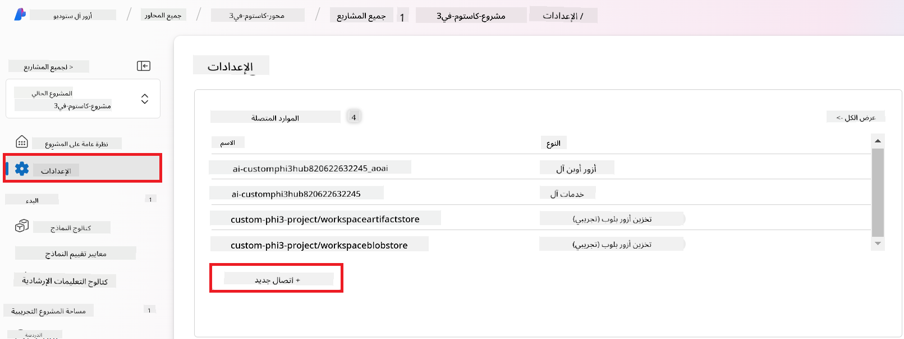

1. اختر **مفاتيح مخصصة** من قائمة التنقل.

    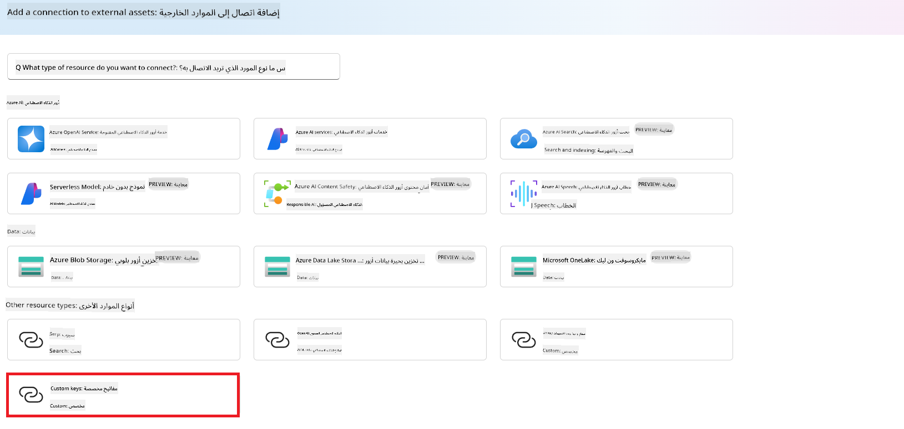

1. قم بتنفيذ المهام التالية:

    - اختر **+ إضافة أزواج مفتاح وقيمة**.
    - لاسم المفتاح، أدخل **endpoint** والصق نقطة النهاية التي نسختها من Azure ML Studio في حقل القيمة.
    - اختر **+ إضافة أزواج مفتاح وقيمة** مرة أخرى.
    - لاسم المفتاح، أدخل **key** والصق المفتاح الذي نسخته من Azure ML Studio في حقل القيمة.
    - بعد إضافة المفاتيح، اختر **is secret** لمنع كشف المفتاح.

    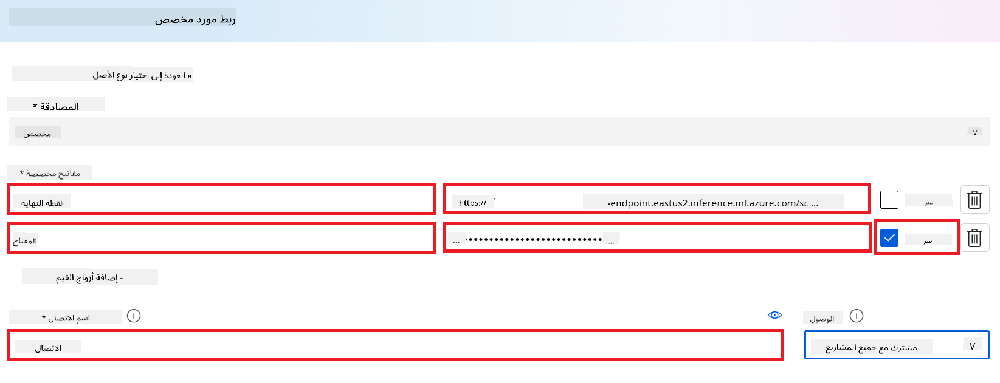

1. اختر **إضافة اتصال**.

#### إنشاء Prompt flow

لقد أضفت اتصالاً مخصصًا في Azure AI Foundry. الآن، دعنا ننشئ Prompt flow باستخدام الخطوات التالية. بعد ذلك، ستقوم بربط هذا Prompt flow بالاتصال المخصص لاستخدام النموذج المُحسّن داخل Prompt flow.

1. انتقل إلى مشروع Azure AI Foundry الذي أنشأته.

1. اختر **Prompt flow** من علامة التبويب الجانبية اليسرى.

1. اختر **+ إنشاء** من قائمة التنقل.

    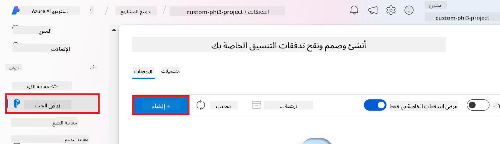

1. اختر **Chat flow** من قائمة التنقل.

    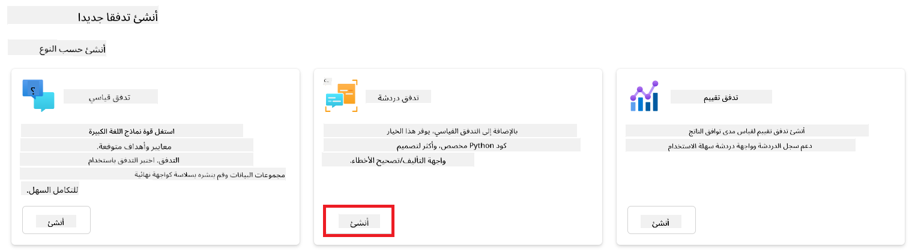

1. أدخل **اسم المجلد** للاستخدام.

    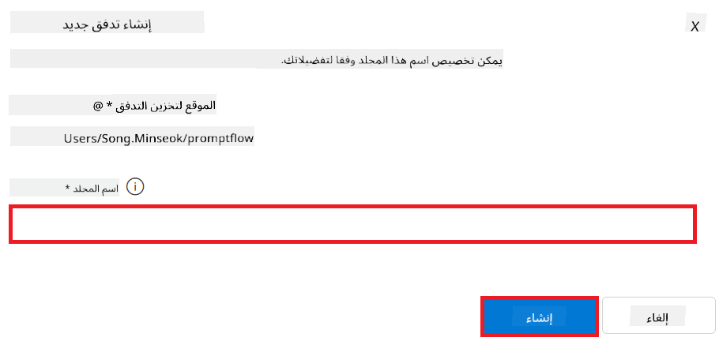

1. اختر **إنشاء**.

#### إعداد Prompt flow للدردشة مع نموذج Phi-3 / Phi-3.5 المخصص الخاص بك

تحتاج إلى دمج نموذج Phi-3 / Phi-3.5 المُحسّن في Prompt flow. ومع ذلك، فإن Prompt flow الحالي غير مصمم لهذا الغرض. لذلك، يجب إعادة تصميم Prompt flow لتمكين دمج النموذج المخصص.

1. في Prompt flow، قم بتنفيذ المهام التالية لإعادة بناء التدفق الحالي:

    - اختر **وضع الملف الخام**.
    - احذف جميع التعليمات البرمجية الموجودة في ملف *flow.dag.yml*.
    - أضف الكود التالي إلى *flow.dag.yml*.

        ```yml
        inputs:
          input_data:
            type: string
            default: "Who founded Microsoft?"

        outputs:
          answer:
            type: string
            reference: ${integrate_with_promptflow.output}

        nodes:
        - name: integrate_with_promptflow
          type: python
          source:
            type: code
            path: integrate_with_promptflow.py
          inputs:
            input_data: ${inputs.input_data}
        ```

    - اختر **حفظ**.

    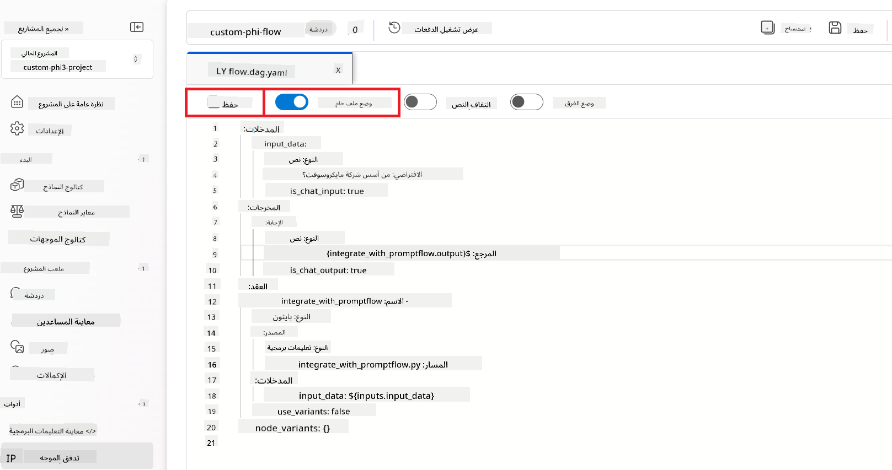

1. أضف الكود التالي إلى *integrate_with_promptflow.py* لاستخدام نموذج Phi-3 / Phi-3.5 المخصص في Prompt flow.

    ```python
    import logging
    import requests
    from promptflow import tool
    from promptflow.connections import CustomConnection

    # Logging setup
    logging.basicConfig(
        format="%(asctime)s - %(levelname)s - %(name)s - %(message)s",
        datefmt="%Y-%m-%d %H:%M:%S",
        level=logging.DEBUG
    )
    logger = logging.getLogger(__name__)

    def query_phi3_model(input_data: str, connection: CustomConnection) -> str:
        """
        Send a request to the Phi-3 / Phi-3.5 model endpoint with the given input data using Custom Connection.
        """

        # "connection" is the name of the Custom Connection, "endpoint", "key" are the keys in the Custom Connection
        endpoint_url = connection.endpoint
        api_key = connection.key

        headers = {
            "Content-Type": "application/json",
            "Authorization": f"Bearer {api_key}"
        }
    data = {
        "input_data": [input_data],
        "params": {
            "temperature": 0.7,
            "max_new_tokens": 128,
            "do_sample": True,
            "return_full_text": True
            }
        }
        try:
            response = requests.post(endpoint_url, json=data, headers=headers)
            response.raise_for_status()
            
            # Log the full JSON response
            logger.debug(f"Full JSON response: {response.json()}")

            result = response.json()["output"]
            logger.info("Successfully received response from Azure ML Endpoint.")
            return result
        except requests.exceptions.RequestException as e:
            logger.error(f"Error querying Azure ML Endpoint: {e}")
            raise

    @tool
    def my_python_tool(input_data: str, connection: CustomConnection) -> str:
        """
        Tool function to process input data and query the Phi-3 / Phi-3.5 model.
        """
        return query_phi3_model(input_data, connection)

    ```

    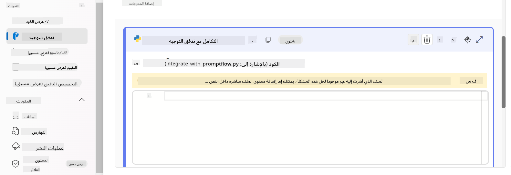

> [!NOTE]
> لمزيد من المعلومات التفصيلية حول استخدام Prompt flow في Azure AI Foundry، يمكنك الرجوع إلى [Prompt flow في Azure AI Foundry](https://learn.microsoft.com/azure/ai-studio/how-to/prompt-flow).

1. اختر **إدخال الدردشة** و**إخراج الدردشة** لتمكين الدردشة مع النموذج الخاص بك.

    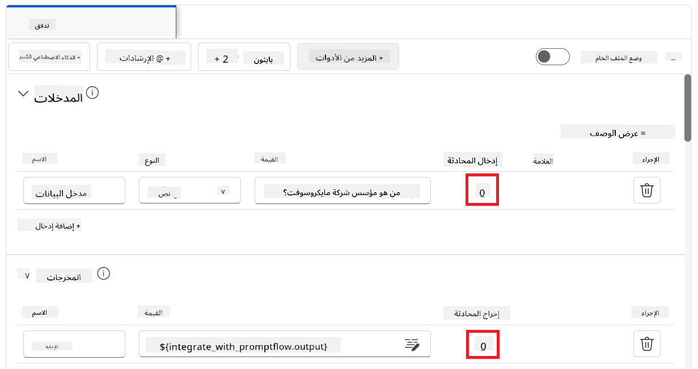

1. الآن أنت جاهز للدردشة مع نموذج Phi-3 / Phi-3.5 المخصص الخاص بك. في التمرين التالي، ستتعلم كيفية بدء Prompt flow واستخدامه للدردشة مع نموذج Phi-3 / Phi-3.5 المُحسّن الخاص بك.

> [!NOTE]
>
> يجب أن يبدو التدفق المُعاد بناؤه كما هو موضح في الصورة أدناه:
>
> 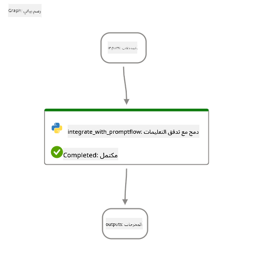
>

#### بدء Prompt flow

1. اختر **بدء جلسات الحوسبة** لبدء Prompt flow.

    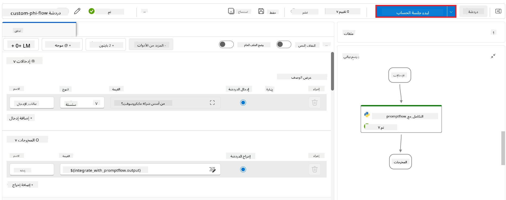

1. اختر **التحقق من صحة الإدخال وتحليله** لتحديث المعلمات.

    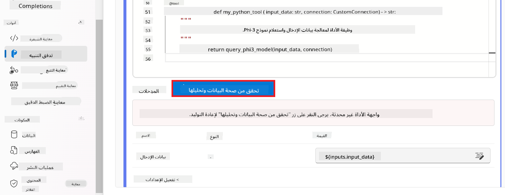

1. اختر **القيمة** للاتصال بالمخصص الذي أنشأته. على سبيل المثال، *connection*.

    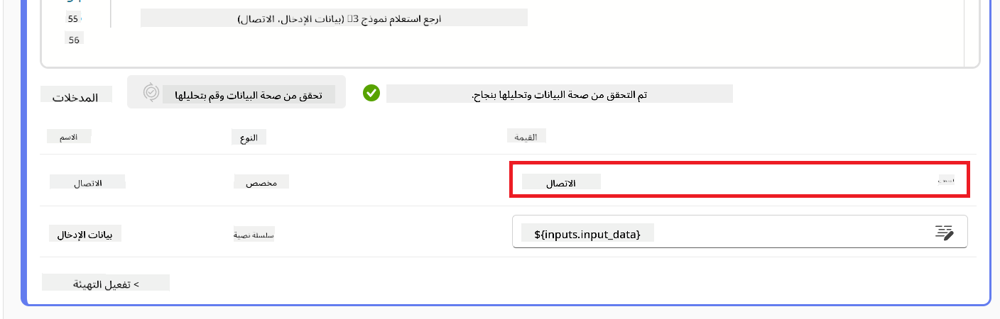

#### الدردشة مع نموذج Phi-3 / Phi-3.5 المخصص الخاص بك

1. اختر **دردشة**.

    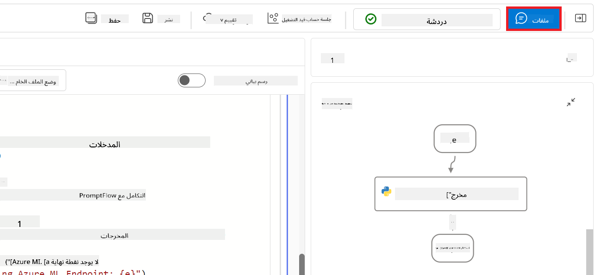

1. إليك مثال على النتائج: الآن يمكنك الدردشة مع نموذج Phi-3 / Phi-3.5 المخصص الخاص بك. يُوصى بطرح أسئلة استنادًا إلى البيانات المستخدمة لتحسين النموذج.

    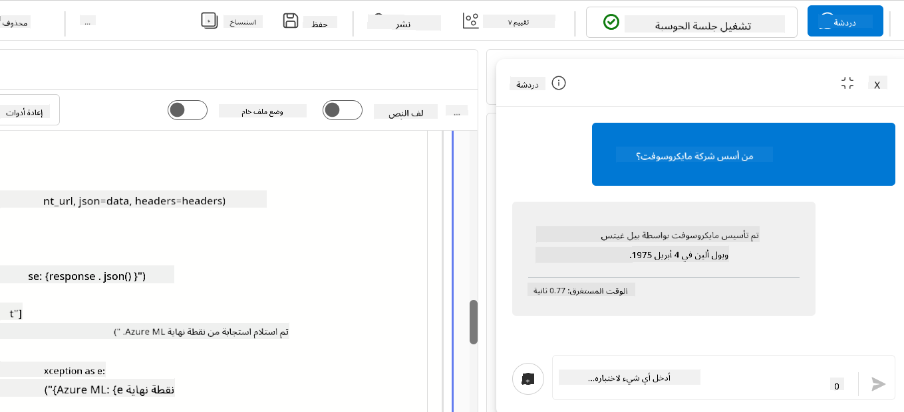

### نشر Azure OpenAI لتقييم نموذج Phi-3 / Phi-3.5

لتقييم نموذج Phi-3 / Phi-3.5 في Azure AI Foundry، تحتاج إلى نشر نموذج Azure OpenAI. سيتم استخدام هذا النموذج لتقييم أداء نموذج Phi-3 / Phi-3.5.

#### نشر Azure OpenAI

1. قم بتسجيل الدخول إلى [Azure AI Foundry](https://ai.azure.com/?wt.mc_id=studentamb_279723).

1. انتقل إلى مشروع Azure AI Foundry الذي أنشأته.

    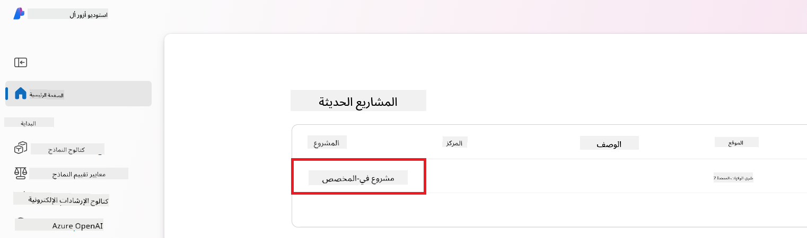

1. في المشروع الذي أنشأته، اختر **عمليات النشر** من علامة التبويب الجانبية اليسرى.

1. اختر **+ نشر نموذج** من قائمة التنقل.

1. اختر **نشر نموذج أساسي**.

    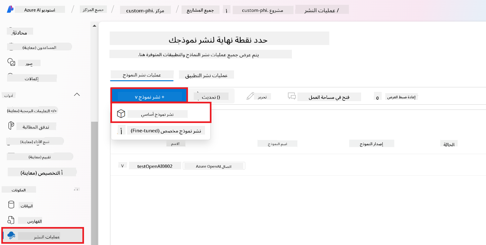

1. اختر نموذج Azure OpenAI الذي ترغب في استخدامه. على سبيل المثال، **gpt-4o**.

    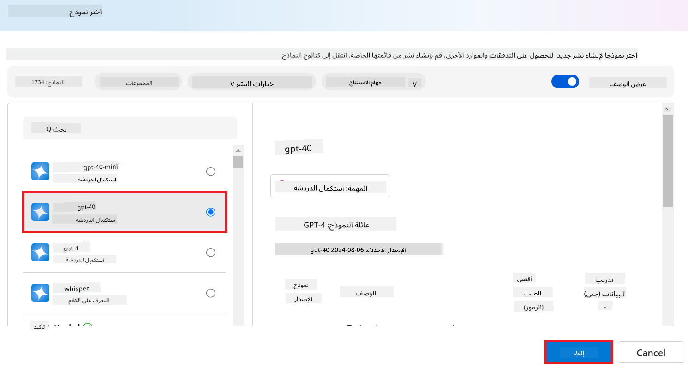

1. اختر **تأكيد**.

### تقييم نموذج Phi-3 / Phi-3.5 المُحسّن باستخدام تقييم Prompt flow في Azure AI Foundry

### بدء تقييم جديد

1. قم بزيارة [Azure AI Foundry](https://ai.azure.com/?wt.mc_id=studentamb_279723).

1. انتقل إلى مشروع Azure AI Foundry الذي أنشأته.

    

1. في المشروع الذي أنشأته، اختر **التقييم** من علامة التبويب الجانبية اليسرى.

1. اختر **+ تقييم جديد** من قائمة التنقل.
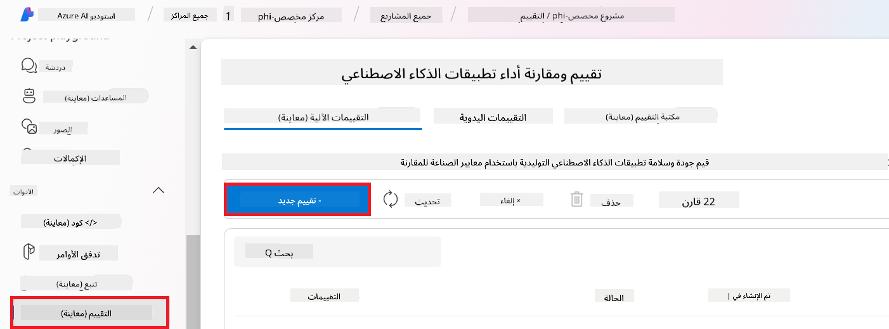

1. اختر **تقييم Prompt flow**.

    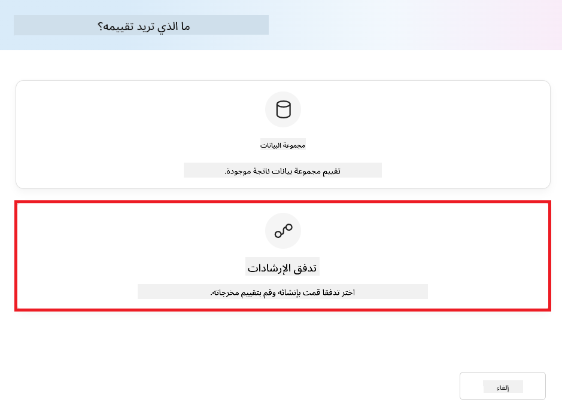

1. قم بتنفيذ المهام التالية:

    - أدخل اسم التقييم. يجب أن يكون قيمة فريدة.
    - اختر **سؤال وجواب بدون سياق** كنوع المهمة. لأن مجموعة البيانات **UlTRACHAT_200k** المستخدمة في هذا الشرح لا تحتوي على سياق.
    - اختر Prompt flow الذي ترغب في تقييمه.

    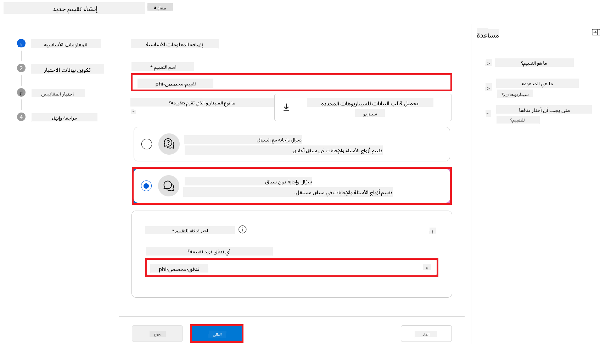

1. اختر **التالي**.

1. قم بتنفيذ المهام التالية:

    - اختر **إضافة مجموعة البيانات الخاصة بك** لتحميل مجموعة البيانات. على سبيل المثال، يمكنك تحميل ملف مجموعة البيانات للاختبار مثل *test_data.json1*، والذي يتم تضمينه عند تنزيل مجموعة البيانات **ULTRACHAT_200k**.
    - اختر **عمود مجموعة البيانات** المناسب الذي يتطابق مع مجموعة البيانات الخاصة بك. على سبيل المثال، إذا كنت تستخدم مجموعة البيانات **ULTRACHAT_200k**، اختر **${data.prompt}** كعمود مجموعة البيانات.

    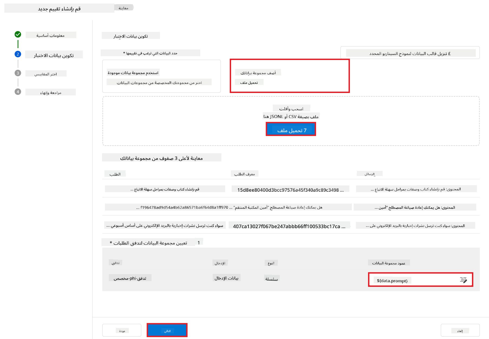

1. اختر **التالي**.

1. قم بتنفيذ المهام التالية لتكوين مقاييس الأداء والجودة:

    - اختر مقاييس الأداء والجودة التي ترغب في استخدامها.
    - اختر نموذج Azure OpenAI الذي أنشأته للتقييم. على سبيل المثال، اختر **gpt-4o**.

    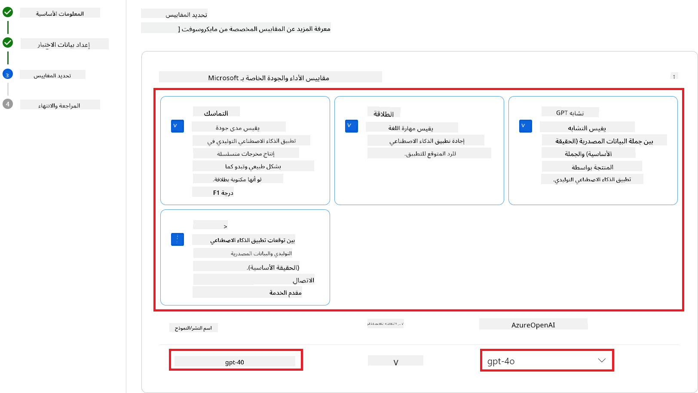

1. قم بتنفيذ المهام التالية لتكوين مقاييس المخاطر والسلامة:

    - اختر مقاييس المخاطر والسلامة التي ترغب في استخدامها.
    - اختر الحد الأدنى لحساب معدل العيوب الذي ترغب في استخدامه. على سبيل المثال، اختر **متوسط**.
    - بالنسبة لـ **السؤال**، اختر **مصدر البيانات** ليكون **{$data.prompt}**.
    - بالنسبة لـ **الإجابة**، اختر **مصدر البيانات** ليكون **{$run.outputs.answer}**.
    - بالنسبة لـ **الإجابة الصحيحة**، اختر **مصدر البيانات** ليكون **{$data.message}**.

    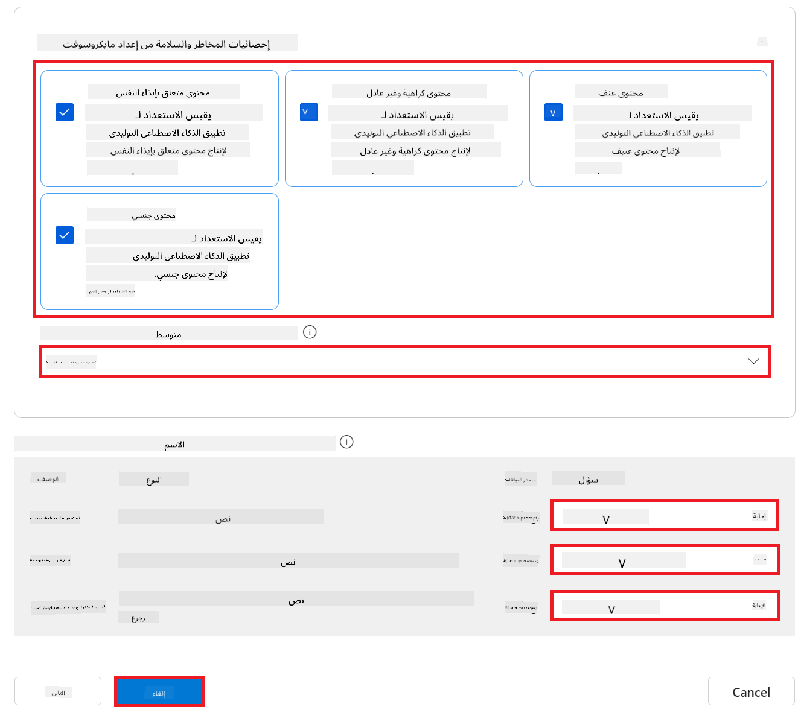

1. اختر **التالي**.

1. اختر **إرسال** لبدء التقييم.

1. سيستغرق التقييم بعض الوقت لإكماله. يمكنك مراقبة التقدم في علامة تبويب **التقييم**.

### مراجعة نتائج التقييم

> [!NOTE]
> النتائج المعروضة أدناه تهدف إلى توضيح عملية التقييم. في هذا الشرح، استخدمنا نموذجاً مدرباً على مجموعة بيانات صغيرة نسبياً، مما قد يؤدي إلى نتائج دون المستوى المطلوب. قد تختلف النتائج الفعلية بشكل كبير بناءً على حجم وجودة وتنوع مجموعة البيانات المستخدمة، وكذلك التكوين المحدد للنموذج.

بمجرد اكتمال التقييم، يمكنك مراجعة النتائج لكل من مقاييس الأداء والسلامة.

1. مقاييس الأداء والجودة:

    - تقييم فعالية النموذج في إنتاج إجابات مترابطة، وسلسة، وذات صلة.

    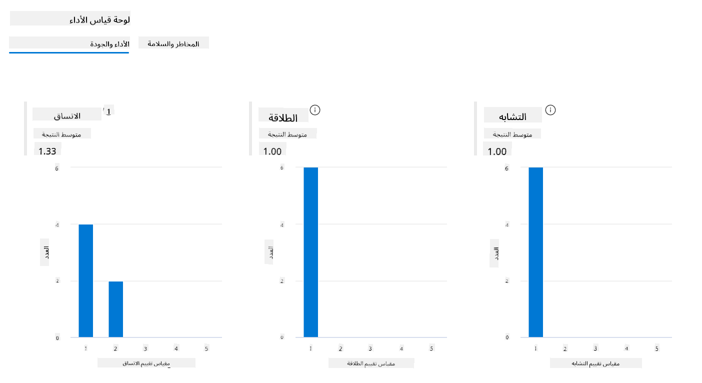

1. مقاييس المخاطر والسلامة:

    - التأكد من أن مخرجات النموذج آمنة وتتماشى مع مبادئ الذكاء الاصطناعي المسؤول، وتجنب أي محتوى ضار أو مهين.

    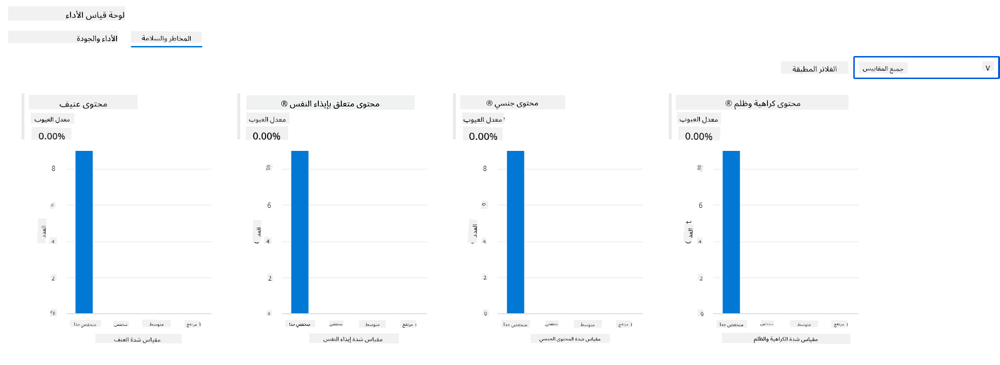

1. يمكنك التمرير للأسفل لعرض **نتائج المقاييس التفصيلية**.

    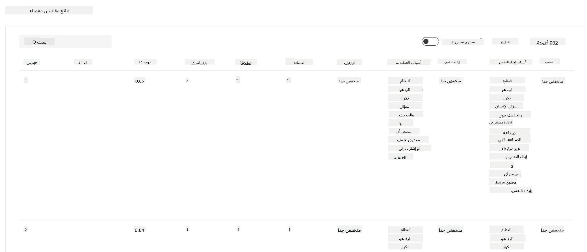

1. من خلال تقييم نموذج Phi-3 / Phi-3.5 المخصص الخاص بك مقابل مقاييس الأداء والسلامة، يمكنك التأكد من أن النموذج ليس فقط فعالاً، ولكنه أيضاً يلتزم بممارسات الذكاء الاصطناعي المسؤول، مما يجعله جاهزاً للاستخدام في العالم الحقيقي.

## تهانينا!

### لقد أكملت هذا الشرح

لقد نجحت في تقييم نموذج Phi-3 المدرب والمُدمج مع Prompt flow في Azure AI Foundry. هذه خطوة مهمة لضمان أن نماذج الذكاء الاصطناعي الخاصة بك ليست فقط فعالة، ولكنها أيضاً تلتزم بمبادئ الذكاء الاصطناعي المسؤول من Microsoft لمساعدتك في بناء تطبيقات ذكاء اصطناعي موثوقة وقابلة للاعتماد.


## تنظيف موارد Azure

قم بتنظيف موارد Azure الخاصة بك لتجنب تكاليف إضافية على حسابك. انتقل إلى بوابة Azure واحذف الموارد التالية:

- مورد Azure Machine Learning.
- نقطة النهاية لنموذج Azure Machine Learning.
- مورد مشروع Azure AI Foundry.
- مورد Prompt flow الخاص بـ Azure AI Foundry.

### الخطوات التالية

#### الوثائق

- [تقييم أنظمة الذكاء الاصطناعي باستخدام لوحة معلومات الذكاء الاصطناعي المسؤول](https://learn.microsoft.com/azure/machine-learning/concept-responsible-ai-dashboard?view=azureml-api-2&source=recommendations?wt.mc_id=studentamb_279723)
- [مقاييس التقييم والمراقبة للذكاء الاصطناعي التوليدي](https://learn.microsoft.com/azure/ai-studio/concepts/evaluation-metrics-built-in?tabs=definition?wt.mc_id=studentamb_279723)
- [وثائق Azure AI Foundry](https://learn.microsoft.com/azure/ai-studio/?wt.mc_id=studentamb_279723)
- [وثائق Prompt flow](https://microsoft.github.io/promptflow/?wt.mc_id=studentamb_279723)

#### محتوى تدريبي

- [مقدمة إلى نهج الذكاء الاصطناعي المسؤول من Microsoft](https://learn.microsoft.com/training/modules/introduction-to-microsofts-responsible-ai-approach/?source=recommendations?wt.mc_id=studentamb_279723)
- [مقدمة إلى Azure AI Foundry](https://learn.microsoft.com/training/modules/introduction-to-azure-ai-studio/?wt.mc_id=studentamb_279723)

### المرجع

- [ما هو الذكاء الاصطناعي المسؤول؟](https://learn.microsoft.com/azure/machine-learning/concept-responsible-ai?view=azureml-api-2?wt.mc_id=studentamb_279723)
- [الإعلان عن أدوات جديدة في Azure AI لمساعدتك على بناء تطبيقات ذكاء اصطناعي توليدي أكثر أماناً وموثوقية](https://azure.microsoft.com/blog/announcing-new-tools-in-azure-ai-to-help-you-build-more-secure-and-trustworthy-generative-ai-applications/?wt.mc_id=studentamb_279723)
- [تقييم تطبيقات الذكاء الاصطناعي التوليدي](https://learn.microsoft.com/azure/ai-studio/concepts/evaluation-approach-gen-ai?wt.mc_id%3Dstudentamb_279723)

**إخلاء المسؤولية**:  
تم ترجمة هذا المستند باستخدام خدمة الترجمة بالذكاء الاصطناعي [Co-op Translator](https://github.com/Azure/co-op-translator). بينما نسعى لتحقيق الدقة، يرجى العلم أن الترجمات الآلية قد تحتوي على أخطاء أو معلومات غير دقيقة. يجب اعتبار المستند الأصلي بلغته الأصلية المصدر الموثوق. بالنسبة للمعلومات الحيوية، يُوصى باللجوء إلى ترجمة بشرية احترافية. نحن غير مسؤولين عن أي سوء فهم أو تفسيرات خاطئة ناتجة عن استخدام هذه الترجمة.