<!--
CO_OP_TRANSLATOR_METADATA:
{
  "original_hash": "455be2b7b9c3390d367d528f8fab2aa0",
  "translation_date": "2025-03-27T10:05:00+00:00",
  "source_file": "md\\02.Application\\01.TextAndChat\\Phi3\\E2E_Phi-3-FineTuning_PromptFlow_Integration.md",
  "language_code": "ar"
}
-->
# تحسين وتكامل نماذج Phi-3 المخصصة باستخدام Prompt flow

يعتمد هذا المثال الشامل على الدليل "[Fine-Tune and Integrate Custom Phi-3 Models with Prompt Flow: Step-by-Step Guide](https://techcommunity.microsoft.com/t5/educator-developer-blog/fine-tune-and-integrate-custom-phi-3-models-with-prompt-flow/ba-p/4178612?WT.mc_id=aiml-137032-kinfeylo)" من مجتمع Microsoft Tech. ويشرح عمليات تحسين الأداء، النشر، وتكامل نماذج Phi-3 المخصصة باستخدام Prompt flow.

## نظرة عامة

في هذا المثال الشامل، ستتعلم كيفية تحسين نموذج Phi-3 وتكاملها مع Prompt flow. باستخدام Azure Machine Learning وPrompt flow، ستنشئ سير عمل لنشر واستخدام النماذج الذكية المخصصة. ينقسم هذا المثال إلى ثلاث سيناريوهات:

**السيناريو 1: إعداد موارد Azure والتحضير لتحسين الأداء**

**السيناريو 2: تحسين نموذج Phi-3 ونشره في Azure Machine Learning Studio**

**السيناريو 3: التكامل مع Prompt flow والتفاعل مع النموذج المخصص**

إليك نظرة عامة على هذا المثال الشامل.


### جدول المحتويات

1. **[السيناريو 1: إعداد موارد Azure والتحضير لتحسين الأداء](../../../../../../md/02.Application/01.TextAndChat/Phi3)**
    - [إنشاء مساحة عمل Azure Machine Learning](../../../../../../md/02.Application/01.TextAndChat/Phi3)
    - [طلب حصص GPU في اشتراك Azure](../../../../../../md/02.Application/01.TextAndChat/Phi3)
    - [إضافة تعيين الأدوار](../../../../../../md/02.Application/01.TextAndChat/Phi3)
    - [إعداد المشروع](../../../../../../md/02.Application/01.TextAndChat/Phi3)
    - [تحضير مجموعة البيانات لتحسين الأداء](../../../../../../md/02.Application/01.TextAndChat/Phi3)

1. **[السيناريو 2: تحسين نموذج Phi-3 ونشره في Azure Machine Learning Studio](../../../../../../md/02.Application/01.TextAndChat/Phi3)**
    - [إعداد Azure CLI](../../../../../../md/02.Application/01.TextAndChat/Phi3)
    - [تحسين نموذج Phi-3](../../../../../../md/02.Application/01.TextAndChat/Phi3)
    - [نشر النموذج المحسن](../../../../../../md/02.Application/01.TextAndChat/Phi3)

1. **[السيناريو 3: التكامل مع Prompt flow والتفاعل مع النموذج المخصص](../../../../../../md/02.Application/01.TextAndChat/Phi3)**
    - [تكامل نموذج Phi-3 المخصص مع Prompt flow](../../../../../../md/02.Application/01.TextAndChat/Phi3)
    - [التفاعل مع النموذج المخصص](../../../../../../md/02.Application/01.TextAndChat/Phi3)

## السيناريو 1: إعداد موارد Azure والتحضير لتحسين الأداء

### إنشاء مساحة عمل Azure Machine Learning

1. اكتب *azure machine learning* في **شريط البحث** أعلى صفحة البوابة وحدد **Azure Machine Learning** من الخيارات التي تظهر.

    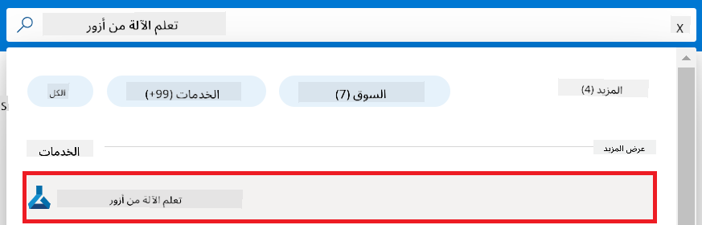

1. حدد **+ إنشاء** من قائمة التنقل.

1. حدد **مساحة عمل جديدة** من قائمة التنقل.

    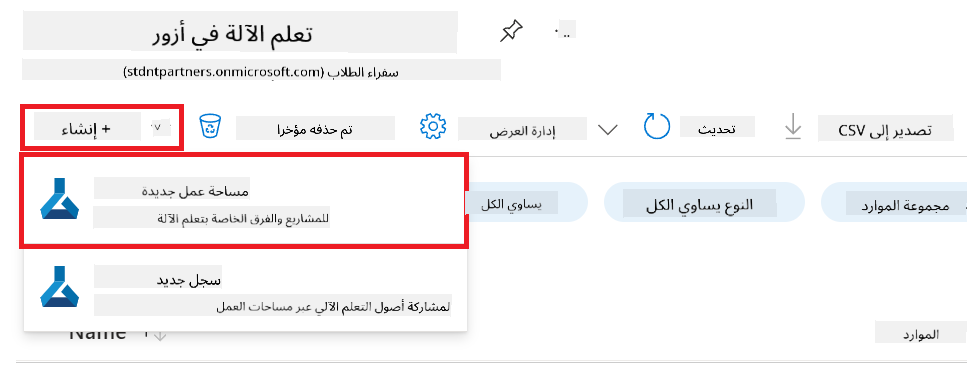

1. قم بتنفيذ المهام التالية:

    - اختر **الاشتراك** الخاص بك في Azure.
    - حدد **مجموعة الموارد** التي ترغب في استخدامها (قم بإنشاء مجموعة جديدة إذا لزم الأمر).
    - أدخل **اسم مساحة العمل**. يجب أن يكون قيمة فريدة.
    - اختر **المنطقة** التي ترغب في استخدامها.
    - حدد **حساب التخزين** الذي ترغب في استخدامه (قم بإنشاء واحد جديد إذا لزم الأمر).
    - حدد **Key vault** الذي ترغب في استخدامه (قم بإنشاء واحد جديد إذا لزم الأمر).
    - حدد **Application insights** الذي ترغب في استخدامه (قم بإنشاء واحد جديد إذا لزم الأمر).
    - حدد **Container registry** الذي ترغب في استخدامه (قم بإنشاء واحد جديد إذا لزم الأمر).

    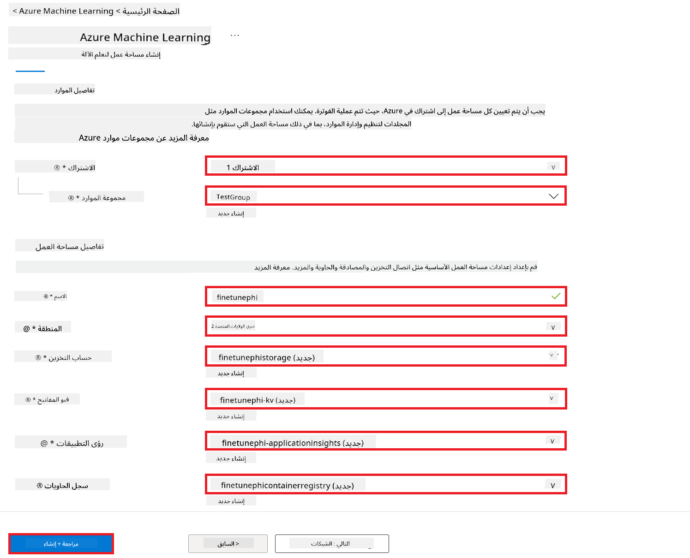

1. حدد **مراجعة + إنشاء**.

1. حدد **إنشاء**.

### طلب حصص GPU في اشتراك Azure

في هذا المثال، ستستخدم *Standard_NC24ads_A100_v4 GPU* لتحسين الأداء، والذي يتطلب طلب حصة، و*Standard_E4s_v3* CPU للنشر، والذي لا يتطلب طلب حصة.

> [!NOTE]
>
> فقط اشتراكات Pay-As-You-Go (نوع الاشتراك القياسي) مؤهلة لتخصيص GPU؛ الاشتراكات ذات الامتيازات غير مدعومة حاليًا.
>
> للمستخدمين الذين يستخدمون اشتراكات ذات الامتيازات (مثل اشتراك Visual Studio Enterprise) أو الذين يرغبون في اختبار عملية التحسين والنشر بسرعة، يوفر هذا الدليل أيضًا إرشادات لتحسين الأداء باستخدام مجموعة بيانات صغيرة باستخدام وحدة المعالجة المركزية (CPU). ومع ذلك، من المهم ملاحظة أن نتائج التحسين تكون أفضل بشكل كبير عند استخدام GPU مع مجموعات بيانات أكبر.

1. قم بزيارة [Azure ML Studio](https://ml.azure.com/home?wt.mc_id=studentamb_279723).

1. قم بتنفيذ المهام التالية لطلب حصة *Standard NCADSA100v4 Family*:

    - حدد **الحصة** من علامة التبويب الجانبية اليسرى.
    - اختر **عائلة الأجهزة الافتراضية** التي ترغب في استخدامها. على سبيل المثال، اختر **Standard NCADSA100v4 Family Cluster Dedicated vCPUs**، والذي يتضمن *Standard_NC24ads_A100_v4* GPU.
    - حدد **طلب الحصة** من قائمة التنقل.

        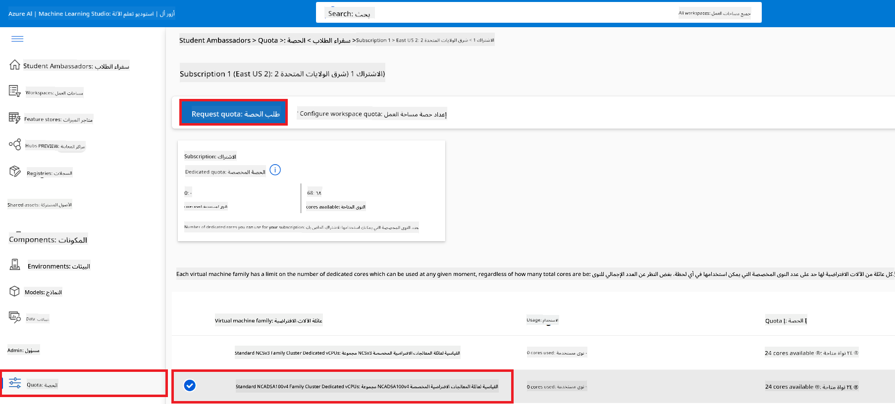

    - داخل صفحة طلب الحصة، أدخل **الحد الجديد للنوى** الذي ترغب في استخدامه. على سبيل المثال، 24.
    - داخل صفحة طلب الحصة، حدد **إرسال** لطلب حصة GPU.

> [!NOTE]
> يمكنك اختيار GPU أو CPU المناسب لاحتياجاتك من خلال الرجوع إلى مستند [أحجام الأجهزة الافتراضية في Azure](https://learn.microsoft.com/azure/virtual-machines/sizes/overview?tabs=breakdownseries%2Cgeneralsizelist%2Ccomputesizelist%2Cmemorysizelist%2Cstoragesizelist%2Cgpusizelist%2Cfpgasizelist%2Chpcsizelist).

### إضافة تعيين الأدوار

لتحسين الأداء ونشر النماذج الخاصة بك، يجب أولاً إنشاء هوية مُدارة معينة من قبل المستخدم (UAI) وتعيين الأذونات المناسبة لها. سيتم استخدام هذه الهوية للمصادقة أثناء النشر.

#### إنشاء هوية مُدارة معينة من قبل المستخدم (UAI)

1. اكتب *managed identities* في **شريط البحث** أعلى صفحة البوابة وحدد **Managed Identities** من الخيارات التي تظهر.

    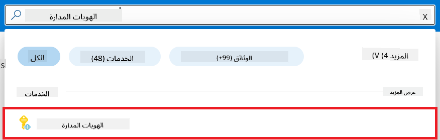

1. حدد **+ إنشاء**.

    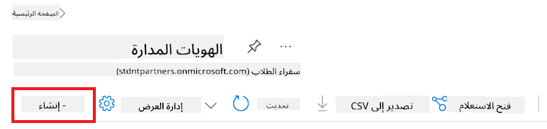

1. قم بتنفيذ المهام التالية:

    - اختر **الاشتراك** الخاص بك في Azure.
    - حدد **مجموعة الموارد** التي ترغب في استخدامها (قم بإنشاء مجموعة جديدة إذا لزم الأمر).
    - اختر **المنطقة** التي ترغب في استخدامها.
    - أدخل **اسم**. يجب أن يكون قيمة فريدة.

1. حدد **مراجعة + إنشاء**.

1. حدد **+ إنشاء**.

#### إضافة تعيين دور المساهم إلى الهوية المُدارة

1. انتقل إلى مورد الهوية المُدارة الذي قمت بإنشائه.

1. حدد **تعيينات الأدوار في Azure** من علامة التبويب الجانبية اليسرى.

1. حدد **+إضافة تعيين دور** من قائمة التنقل.

1. داخل صفحة إضافة تعيين دور، قم بتنفيذ المهام التالية:
    - اختر **النطاق** ليكون **مجموعة الموارد**.
    - اختر **الاشتراك** الخاص بك في Azure.
    - حدد **مجموعة الموارد** التي ترغب في استخدامها.
    - اختر **الدور** ليكون **مساهم**.

    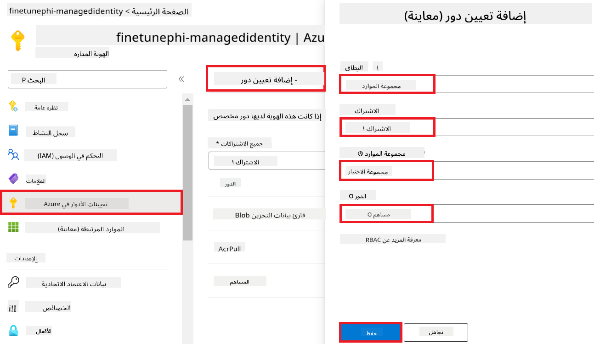

1. حدد **حفظ**.

#### إضافة تعيين دور قارئ بيانات تخزين Blob إلى الهوية المُدارة

1. اكتب *storage accounts* في **شريط البحث** أعلى صفحة البوابة وحدد **Storage accounts** من الخيارات التي تظهر.

    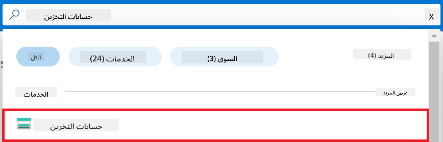

1. اختر حساب التخزين المرتبط بمساحة عمل Azure Machine Learning التي قمت بإنشائها. على سبيل المثال، *finetunephistorage*.

1. قم بتنفيذ المهام التالية للانتقال إلى صفحة إضافة تعيين الدور:

    - انتقل إلى حساب التخزين الذي قمت بإنشائه.
    - حدد **التحكم في الوصول (IAM)** من علامة التبويب الجانبية اليسرى.
    - حدد **+ إضافة** من قائمة التنقل.
    - حدد **إضافة تعيين دور** من قائمة التنقل.

    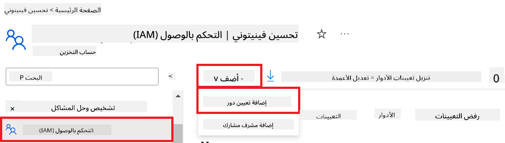

1. داخل صفحة إضافة تعيين الدور، قم بتنفيذ المهام التالية:

    - داخل صفحة الدور، اكتب *Storage Blob Data Reader* في **شريط البحث** وحدد **Storage Blob Data Reader** من الخيارات التي تظهر.
    - داخل صفحة الدور، حدد **التالي**.
    - داخل صفحة الأعضاء، اختر **تعيين الوصول إلى** **Managed identity**.
    - داخل صفحة الأعضاء، حدد **+ اختيار الأعضاء**.
    - داخل صفحة اختيار الهويات المُدارة، اختر **الاشتراك** الخاص بك في Azure.
    - داخل صفحة اختيار الهويات المُدارة، اختر **الهوية المُدارة** ليكون **Managed Identity**.
    - داخل صفحة اختيار الهويات المُدارة، اختر الهوية المُدارة التي قمت بإنشائها. على سبيل المثال، *finetunephi-managedidentity*.
    - داخل صفحة اختيار الهويات المُدارة، حدد **اختيار**.

    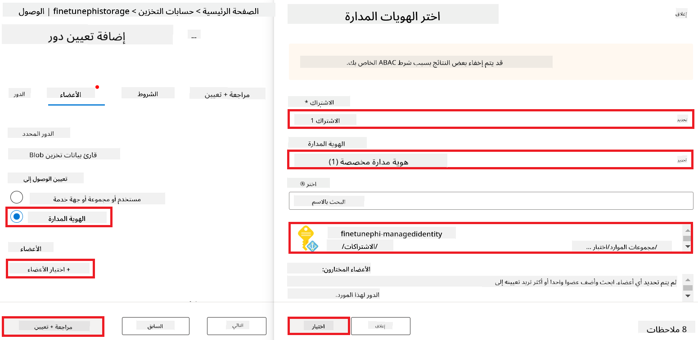

1. حدد **مراجعة + تعيين**.

#### إضافة تعيين دور AcrPull إلى الهوية المُدارة

1. اكتب *container registries* في **شريط البحث** أعلى صفحة البوابة وحدد **Container registries** من الخيارات التي تظهر.

    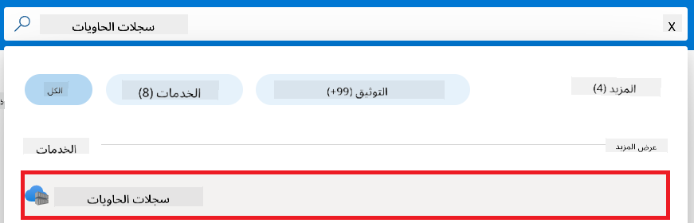

1. اختر سجل الحاويات المرتبط بمساحة عمل Azure Machine Learning. على سبيل المثال، *finetunephicontainerregistries*

1. قم بتنفيذ المهام التالية للانتقال إلى صفحة إضافة تعيين الدور:

    - حدد **التحكم في الوصول (IAM)** من علامة التبويب الجانبية اليسرى.
    - حدد **+ إضافة** من قائمة التنقل.
    - حدد **إضافة تعيين دور** من قائمة التنقل.

1. داخل صفحة إضافة تعيين الدور، قم بتنفيذ المهام التالية:

    - داخل صفحة الدور، اكتب *AcrPull* في **شريط البحث** وحدد **AcrPull** من الخيارات التي تظهر.
    - داخل صفحة الدور، حدد **التالي**.
    - داخل صفحة الأعضاء، اختر **تعيين الوصول إلى** **Managed identity**.
    - داخل صفحة الأعضاء، حدد **+ اختيار الأعضاء**.
    - داخل صفحة اختيار الهويات المُدارة، اختر **الاشتراك** الخاص بك في Azure.
    - داخل صفحة اختيار الهويات المُدارة، اختر **الهوية المُدارة** ليكون **Managed Identity**.
    - داخل صفحة اختيار الهويات المُدارة، اختر الهوية المُدارة التي قمت بإنشائها. على سبيل المثال، *finetunephi-managedidentity*.
    - داخل صفحة اختيار الهويات المُدارة، حدد **اختيار**.
    - حدد **مراجعة + تعيين**.

### إعداد المشروع

الآن، ستقوم بإنشاء مجلد للعمل بداخله وإعداد بيئة افتراضية لتطوير برنامج يتفاعل مع المستخدمين ويستخدم محفوظات الدردشة المخزنة في Azure Cosmos DB لتحسين استجاباته.

#### إنشاء مجلد للعمل بداخله

1. افتح نافذة طرفية واكتب الأمر التالي لإنشاء مجلد باسم *finetune-phi* في المسار الافتراضي.

    ```console
    mkdir finetune-phi
    ```

1. اكتب الأمر التالي داخل الطرفية للتنقل إلى المجلد *finetune-phi* الذي أنشأته.

    ```console
    cd finetune-phi
    ```

#### إنشاء بيئة افتراضية

1. اكتب الأمر التالي داخل الطرفية لإنشاء بيئة افتراضية باسم *.venv*.

    ```console
    python -m venv .venv
    ```

1. اكتب الأمر التالي داخل الطرفية لتفعيل البيئة الافتراضية.

    ```console
    .venv\Scripts\activate.bat
    ```

> [!NOTE]
>
> إذا نجح الأمر، سترى *(.venv)* قبل مؤشر الأوامر.

#### تثبيت الحزم المطلوبة

1. اكتب الأوامر التالية داخل الطرفية لتثبيت الحزم المطلوبة.

    ```console
    pip install datasets==2.19.1
    pip install transformers==4.41.1
    pip install azure-ai-ml==1.16.0
    pip install torch==2.3.1
    pip install trl==0.9.4
    pip install promptflow==1.12.0
    ```

#### إنشاء ملفات المشروع

في هذا التمرين، ستقوم بإنشاء الملفات الأساسية للمشروع. تشمل هذه الملفات سكربتات لتنزيل مجموعة البيانات، إعداد بيئة Azure Machine Learning، تحسين نموذج Phi-3، ونشر النموذج المحسن. ستقوم أيضًا بإنشاء ملف *conda.yml* لإعداد بيئة التحسين.

في هذا التمرين، ستقوم بـ:

- إنشاء ملف *download_dataset.py* لتنزيل مجموعة البيانات.
- إنشاء ملف *setup_ml.py* لإعداد بيئة Azure Machine Learning.
- إنشاء ملف *fine_tune.py* داخل مجلد *finetuning_dir* لتحسين نموذج Phi-3 باستخدام مجموعة البيانات.
- إنشاء ملف *conda.yml* لإعداد بيئة التحسين.
- إنشاء ملف *deploy_model.py* لنشر النموذج المحسن.
- إنشاء ملف *integrate_with_promptflow.py* لتكامل النموذج المحسن وتنفيذه باستخدام Prompt flow.
- إنشاء ملف *flow.dag.yml* لإعداد هيكل سير العمل لـ Prompt flow.
- إنشاء ملف *config.py* لإدخال معلومات Azure.

> [!NOTE]
>
> هيكل المجلد الكامل:
>
> ```text
> └── YourUserName
> .    └── finetune-phi
> .        ├── finetuning_dir
> .        │      └── fine_tune.py
> .        ├── conda.yml
> .        ├── config.py
> .        ├── deploy_model.py
> .        ├── download_dataset.py
> .        ├── flow.dag.yml
> .        ├── integrate_with_promptflow.py
> .        └── setup_ml.py
> ```

1. افتح **Visual Studio Code**.

1. حدد **ملف** من شريط القوائم.

1. حدد **فتح مجلد**.

1. اختر المجلد *finetune-phi* الذي أنشأته، الموجود في *C:\Users\yourUserName\finetune-phi*.

    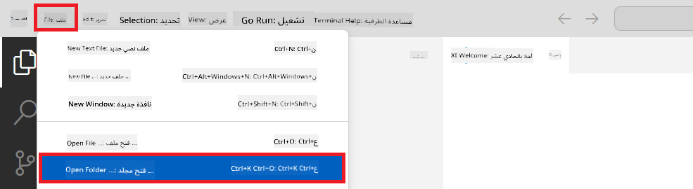

1. في الجزء الأيسر من Visual Studio Code، انقر بزر الماوس الأيمن وحدد **ملف جديد** لإنشاء ملف جديد باسم *download_dataset.py*.

1. في الجزء الأيسر من Visual Studio Code، انقر بزر الماوس الأيمن وحدد **ملف جديد** لإنشاء ملف جديد باسم *setup_ml.py*.

1. في الجزء الأيسر من Visual Studio Code، انقر بزر الماوس الأيمن وحدد **ملف جديد** لإنشاء ملف جديد باسم *deploy_model.py*.

    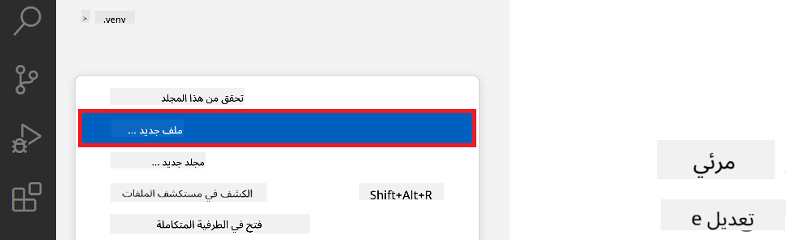

1. في الجزء الأيسر من Visual Studio Code، انقر بزر الماوس الأيمن وحدد **مجلد جديد** لإنشاء مجلد جديد باسم *finetuning_dir*.

1. داخل المجلد *finetuning_dir*، أنشئ ملفًا جديدًا باسم *fine_tune.py*.

#### إنشاء وتكوين ملف *conda.yml*

1. في الجزء الأيسر من Visual Studio Code، انقر بزر الماوس الأيمن وحدد **ملف جديد** لإنشاء ملف جديد باسم *conda.yml*.

1. أضف الكود التالي إلى ملف *conda.yml* لإعداد بيئة التحسين لنموذج Phi-3.

    ```yml
    name: phi-3-training-env
    channels:
      - defaults
      - conda-forge
    dependencies:
      - python=3.10
      - pip
      - numpy<2.0
      - pip:
          - torch==2.4.0
          - torchvision==0.19.0
          - trl==0.8.6
          - transformers==4.41
          - datasets==2.21.0
          - azureml-core==1.57.0
          - azure-storage-blob==12.19.0
          - azure-ai-ml==1.16
          - azure-identity==1.17.1
          - accelerate==0.33.0
          - mlflow==2.15.1
          - azureml-mlflow==1.57.0
    ```

#### إنشاء وتكوين ملف *config.py*

1. في الجزء الأيسر من Visual Studio Code، انقر بزر الماوس الأيمن وحدد **ملف جديد** لإنشاء ملف جديد باسم *config.py*.

1. أضف الكود التالي إلى ملف *config.py* لإدخال معلومات Azure الخاصة بك.

    ```python
    # Azure settings
    AZURE_SUBSCRIPTION_ID = "your_subscription_id"
    AZURE_RESOURCE_GROUP_NAME = "your_resource_group_name" # "TestGroup"

    # Azure Machine Learning settings
    AZURE_ML_WORKSPACE_NAME = "your_workspace_name" # "finetunephi-workspace"

    # Azure Managed Identity settings
    AZURE_MANAGED_IDENTITY_CLIENT_ID = "your_azure_managed_identity_client_id"
    AZURE_MANAGED_IDENTITY_NAME = "your_azure_managed_identity_name" # "finetunephi-mangedidentity"
    AZURE_MANAGED_IDENTITY_RESOURCE_ID = f"/subscriptions/{AZURE_SUBSCRIPTION_ID}/resourceGroups/{AZURE_RESOURCE_GROUP_NAME}/providers/Microsoft.ManagedIdentity/userAssignedIdentities/{AZURE_MANAGED_IDENTITY_NAME}"

    # Dataset file paths
    TRAIN_DATA_PATH = "data/train_data.jsonl"
    TEST_DATA_PATH = "data/test_data.jsonl"

    # Fine-tuned model settings
    AZURE_MODEL_NAME = "your_fine_tuned_model_name" # "finetune-phi-model"
    AZURE_ENDPOINT_NAME = "your_fine_tuned_model_endpoint_name" # "finetune-phi-endpoint"
    AZURE_DEPLOYMENT_NAME = "your_fine_tuned_model_deployment_name" # "finetune-phi-deployment"

    AZURE_ML_API_KEY = "your_fine_tuned_model_api_key"
    AZURE_ML_ENDPOINT = "your_fine_tuned_model_endpoint_uri" # "https://{your-endpoint-name}.{your-region}.inference.ml.azure.com/score"
    ```

#### إضافة متغيرات بيئة Azure

1. قم بتنفيذ المهام التالية لإضافة معرف اشتراك Azure:

    - اكتب *subscriptions* في **شريط البحث** أعلى صفحة البوابة وحدد **Subscriptions** من الخيارات التي تظهر.
    - اختر اشتراك Azure الذي تستخدمه حاليًا.
    - انسخ والصق معرف الاشتراك الخاص بك في ملف *config.py*.
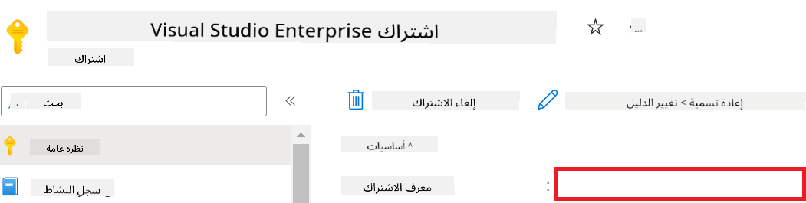

1. قم بتنفيذ الخطوات التالية لإضافة اسم مساحة عمل Azure:

    - انتقل إلى مورد Azure Machine Learning الذي أنشأته.
    - قم بنسخ اسم حسابك ولصقه في ملف *config.py*.

    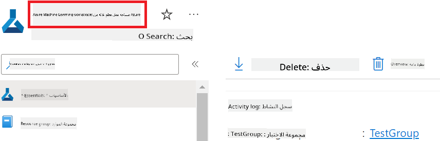

1. قم بتنفيذ الخطوات التالية لإضافة اسم مجموعة موارد Azure:

    - انتقل إلى مورد Azure Machine Learning الذي أنشأته.
    - قم بنسخ اسم مجموعة موارد Azure ولصقه في ملف *config.py*.

    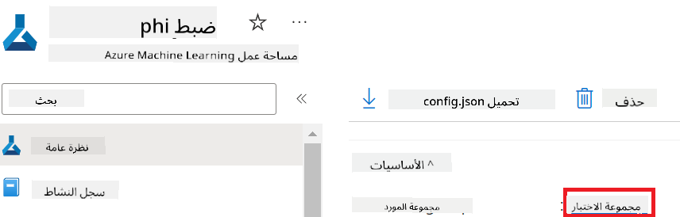

2. قم بتنفيذ الخطوات التالية لإضافة اسم الهوية المُدارة في Azure:

    - انتقل إلى مورد الهوية المُدارة الذي أنشأته.
    - قم بنسخ اسم الهوية المُدارة في Azure ولصقه في ملف *config.py*.

    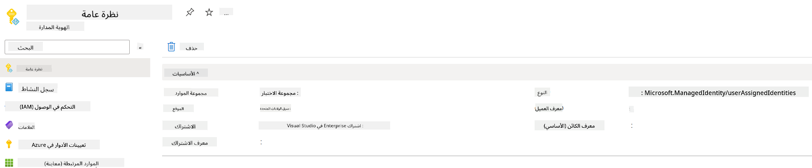

### إعداد مجموعة البيانات لتحسين النموذج

في هذا التمرين، ستقوم بتشغيل ملف *download_dataset.py* لتنزيل مجموعة بيانات *ULTRACHAT_200k* إلى بيئتك المحلية. بعد ذلك، ستستخدم هذه المجموعة لتحسين نموذج Phi-3 في Azure Machine Learning.

#### تنزيل مجموعة البيانات باستخدام *download_dataset.py*

1. افتح ملف *download_dataset.py* في Visual Studio Code.

1. أضف الكود التالي إلى ملف *download_dataset.py*.

    ```python
    import json
    import os
    from datasets import load_dataset
    from config import (
        TRAIN_DATA_PATH,
        TEST_DATA_PATH)

    def load_and_split_dataset(dataset_name, config_name, split_ratio):
        """
        Load and split a dataset.
        """
        # Load the dataset with the specified name, configuration, and split ratio
        dataset = load_dataset(dataset_name, config_name, split=split_ratio)
        print(f"Original dataset size: {len(dataset)}")
        
        # Split the dataset into train and test sets (80% train, 20% test)
        split_dataset = dataset.train_test_split(test_size=0.2)
        print(f"Train dataset size: {len(split_dataset['train'])}")
        print(f"Test dataset size: {len(split_dataset['test'])}")
        
        return split_dataset

    def save_dataset_to_jsonl(dataset, filepath):
        """
        Save a dataset to a JSONL file.
        """
        # Create the directory if it does not exist
        os.makedirs(os.path.dirname(filepath), exist_ok=True)
        
        # Open the file in write mode
        with open(filepath, 'w', encoding='utf-8') as f:
            # Iterate over each record in the dataset
            for record in dataset:
                # Dump the record as a JSON object and write it to the file
                json.dump(record, f)
                # Write a newline character to separate records
                f.write('\n')
        
        print(f"Dataset saved to {filepath}")

    def main():
        """
        Main function to load, split, and save the dataset.
        """
        # Load and split the ULTRACHAT_200k dataset with a specific configuration and split ratio
        dataset = load_and_split_dataset("HuggingFaceH4/ultrachat_200k", 'default', 'train_sft[:1%]')
        
        # Extract the train and test datasets from the split
        train_dataset = dataset['train']
        test_dataset = dataset['test']

        # Save the train dataset to a JSONL file
        save_dataset_to_jsonl(train_dataset, TRAIN_DATA_PATH)
        
        # Save the test dataset to a separate JSONL file
        save_dataset_to_jsonl(test_dataset, TEST_DATA_PATH)

    if __name__ == "__main__":
        main()

    ```

> [!TIP]
>
> **إرشادات لتحسين النموذج باستخدام مجموعة بيانات صغيرة باستخدام وحدة المعالجة المركزية**
>
> إذا كنت ترغب في استخدام وحدة المعالجة المركزية لتحسين النموذج، فإن هذه الطريقة مثالية للمشتركين في الاشتراكات ذات المزايا (مثل اشتراك Visual Studio Enterprise) أو لاختبار عملية تحسين النموذج ونشره بسرعة.
>
> استبدل `dataset = load_and_split_dataset("HuggingFaceH4/ultrachat_200k", 'default', 'train_sft[:1%]')` with `dataset = load_and_split_dataset("HuggingFaceH4/ultrachat_200k", 'default', 'train_sft[:10]')`
>

1. اكتب الأمر التالي داخل نافذة الطرفية لتشغيل البرنامج النصي وتنزيل مجموعة البيانات إلى بيئتك المحلية.

    ```console
    python download_data.py
    ```

1. تحقق من حفظ مجموعة البيانات بنجاح في دليل *finetune-phi/data* المحلي لديك.

> [!NOTE]
>
> **حجم مجموعة البيانات ووقت تحسين النموذج**
>
> في هذا المثال، يتم استخدام 1% فقط من مجموعة البيانات (`train_sft[:1%]`). هذا يقلل بشكل كبير من كمية البيانات، مما يسرع عملية التحميل وتحسين النموذج. يمكنك تعديل النسبة للعثور على التوازن الصحيح بين وقت التدريب وأداء النموذج. استخدام مجموعة بيانات أصغر يقلل الوقت اللازم لتحسين النموذج، مما يجعل العملية أكثر سهولة في هذا المثال.

## السيناريو 2: تحسين نموذج Phi-3 ونشره في Azure Machine Learning Studio

### إعداد Azure CLI

تحتاج إلى إعداد Azure CLI لمصادقة بيئتك. يسمح لك Azure CLI بإدارة موارد Azure مباشرة من سطر الأوامر ويوفر بيانات الاعتماد اللازمة لـ Azure Machine Learning للوصول إلى هذه الموارد. للبدء، قم بتثبيت [Azure CLI](https://learn.microsoft.com/cli/azure/install-azure-cli).

1. افتح نافذة الطرفية واكتب الأمر التالي لتسجيل الدخول إلى حساب Azure الخاص بك.

    ```console
    az login
    ```

1. اختر حساب Azure الذي تريد استخدامه.

1. اختر اشتراك Azure الذي تريد استخدامه.

    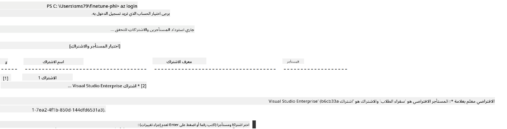

> [!TIP]
>
> إذا كنت تواجه صعوبة في تسجيل الدخول إلى Azure، حاول استخدام رمز الجهاز. افتح نافذة الطرفية واكتب الأمر التالي لتسجيل الدخول إلى حساب Azure الخاص بك:
>
> ```console
> az login --use-device-code
> ```
>

### تحسين نموذج Phi-3

في هذا التمرين، ستقوم بتحسين نموذج Phi-3 باستخدام مجموعة البيانات المقدمة. أولاً، ستحدد عملية تحسين النموذج في ملف *fine_tune.py*. بعد ذلك، ستقوم بتكوين بيئة Azure Machine Learning وتبدأ عملية تحسين النموذج عن طريق تشغيل ملف *setup_ml.py*. يضمن هذا البرنامج النصي أن عملية تحسين النموذج تحدث داخل بيئة Azure Machine Learning.

#### إضافة الكود إلى ملف *fine_tune.py*

1. انتقل إلى مجلد *finetuning_dir* وافتح ملف *fine_tune.py* في Visual Studio Code.

1. أضف الكود التالي إلى ملف *fine_tune.py*.

    ```python
    import argparse
    import sys
    import logging
    import os
    from datasets import load_dataset
    import torch
    import mlflow
    from transformers import AutoModelForCausalLM, AutoTokenizer, TrainingArguments
    from trl import SFTTrainer

    # To avoid the INVALID_PARAMETER_VALUE error in MLflow, disable MLflow integration
    os.environ["DISABLE_MLFLOW_INTEGRATION"] = "True"

    # Logging setup
    logging.basicConfig(
        format="%(asctime)s - %(levelname)s - %(name)s - %(message)s",
        datefmt="%Y-%m-%d %H:%M:%S",
        handlers=[logging.StreamHandler(sys.stdout)],
        level=logging.WARNING
    )
    logger = logging.getLogger(__name__)

    def initialize_model_and_tokenizer(model_name, model_kwargs):
        """
        Initialize the model and tokenizer with the given pretrained model name and arguments.
        """
        model = AutoModelForCausalLM.from_pretrained(model_name, **model_kwargs)
        tokenizer = AutoTokenizer.from_pretrained(model_name)
        tokenizer.model_max_length = 2048
        tokenizer.pad_token = tokenizer.unk_token
        tokenizer.pad_token_id = tokenizer.convert_tokens_to_ids(tokenizer.pad_token)
        tokenizer.padding_side = 'right'
        return model, tokenizer

    def apply_chat_template(example, tokenizer):
        """
        Apply a chat template to tokenize messages in the example.
        """
        messages = example["messages"]
        if messages[0]["role"] != "system":
            messages.insert(0, {"role": "system", "content": ""})
        example["text"] = tokenizer.apply_chat_template(
            messages, tokenize=False, add_generation_prompt=False
        )
        return example

    def load_and_preprocess_data(train_filepath, test_filepath, tokenizer):
        """
        Load and preprocess the dataset.
        """
        train_dataset = load_dataset('json', data_files=train_filepath, split='train')
        test_dataset = load_dataset('json', data_files=test_filepath, split='train')
        column_names = list(train_dataset.features)

        train_dataset = train_dataset.map(
            apply_chat_template,
            fn_kwargs={"tokenizer": tokenizer},
            num_proc=10,
            remove_columns=column_names,
            desc="Applying chat template to train dataset",
        )

        test_dataset = test_dataset.map(
            apply_chat_template,
            fn_kwargs={"tokenizer": tokenizer},
            num_proc=10,
            remove_columns=column_names,
            desc="Applying chat template to test dataset",
        )

        return train_dataset, test_dataset

    def train_and_evaluate_model(train_dataset, test_dataset, model, tokenizer, output_dir):
        """
        Train and evaluate the model.
        """
        training_args = TrainingArguments(
            bf16=True,
            do_eval=True,
            output_dir=output_dir,
            eval_strategy="epoch",
            learning_rate=5.0e-06,
            logging_steps=20,
            lr_scheduler_type="cosine",
            num_train_epochs=3,
            overwrite_output_dir=True,
            per_device_eval_batch_size=4,
            per_device_train_batch_size=4,
            remove_unused_columns=True,
            save_steps=500,
            seed=0,
            gradient_checkpointing=True,
            gradient_accumulation_steps=1,
            warmup_ratio=0.2,
        )

        trainer = SFTTrainer(
            model=model,
            args=training_args,
            train_dataset=train_dataset,
            eval_dataset=test_dataset,
            max_seq_length=2048,
            dataset_text_field="text",
            tokenizer=tokenizer,
            packing=True
        )

        train_result = trainer.train()
        trainer.log_metrics("train", train_result.metrics)

        mlflow.transformers.log_model(
            transformers_model={"model": trainer.model, "tokenizer": tokenizer},
            artifact_path=output_dir,
        )

        tokenizer.padding_side = 'left'
        eval_metrics = trainer.evaluate()
        eval_metrics["eval_samples"] = len(test_dataset)
        trainer.log_metrics("eval", eval_metrics)

    def main(train_file, eval_file, model_output_dir):
        """
        Main function to fine-tune the model.
        """
        model_kwargs = {
            "use_cache": False,
            "trust_remote_code": True,
            "torch_dtype": torch.bfloat16,
            "device_map": None,
            "attn_implementation": "eager"
        }

        # pretrained_model_name = "microsoft/Phi-3-mini-4k-instruct"
        pretrained_model_name = "microsoft/Phi-3.5-mini-instruct"

        with mlflow.start_run():
            model, tokenizer = initialize_model_and_tokenizer(pretrained_model_name, model_kwargs)
            train_dataset, test_dataset = load_and_preprocess_data(train_file, eval_file, tokenizer)
            train_and_evaluate_model(train_dataset, test_dataset, model, tokenizer, model_output_dir)

    if __name__ == "__main__":
        parser = argparse.ArgumentParser()
        parser.add_argument("--train-file", type=str, required=True, help="Path to the training data")
        parser.add_argument("--eval-file", type=str, required=True, help="Path to the evaluation data")
        parser.add_argument("--model_output_dir", type=str, required=True, help="Directory to save the fine-tuned model")
        args = parser.parse_args()
        main(args.train_file, args.eval_file, args.model_output_dir)

    ```

1. احفظ وأغلق ملف *fine_tune.py*.

> [!TIP]
> **يمكنك تحسين نموذج Phi-3.5**
>
> في ملف *fine_tune.py*، يمكنك تغيير الحقل `pretrained_model_name` from `"microsoft/Phi-3-mini-4k-instruct"` to any model you want to fine-tune. For example, if you change it to `"microsoft/Phi-3.5-mini-instruct"`, you'll be using the Phi-3.5-mini-instruct model for fine-tuning. To find and use the model name you prefer, visit [Hugging Face](https://huggingface.co/), search for the model you're interested in, and then copy and paste its name into the `pretrained_model_name` في البرنامج النصي الخاص بك.
>
> :::image type="content" source="../../imgs/03/FineTuning-PromptFlow/finetunephi3.5.png" alt-text="تحسين نموذج Phi-3.5.":::
>

#### إضافة الكود إلى ملف *setup_ml.py*

1. افتح ملف *setup_ml.py* في Visual Studio Code.

1. أضف الكود التالي إلى ملف *setup_ml.py*.

    ```python
    import logging
    from azure.ai.ml import MLClient, command, Input
    from azure.ai.ml.entities import Environment, AmlCompute
    from azure.identity import AzureCliCredential
    from config import (
        AZURE_SUBSCRIPTION_ID,
        AZURE_RESOURCE_GROUP_NAME,
        AZURE_ML_WORKSPACE_NAME,
        TRAIN_DATA_PATH,
        TEST_DATA_PATH
    )

    # Constants

    # Uncomment the following lines to use a CPU instance for training
    # COMPUTE_INSTANCE_TYPE = "Standard_E16s_v3" # cpu
    # COMPUTE_NAME = "cpu-e16s-v3"
    # DOCKER_IMAGE_NAME = "mcr.microsoft.com/azureml/openmpi4.1.0-ubuntu20.04:latest"

    # Uncomment the following lines to use a GPU instance for training
    COMPUTE_INSTANCE_TYPE = "Standard_NC24ads_A100_v4"
    COMPUTE_NAME = "gpu-nc24s-a100-v4"
    DOCKER_IMAGE_NAME = "mcr.microsoft.com/azureml/curated/acft-hf-nlp-gpu:59"

    CONDA_FILE = "conda.yml"
    LOCATION = "eastus2" # Replace with the location of your compute cluster
    FINETUNING_DIR = "./finetuning_dir" # Path to the fine-tuning script
    TRAINING_ENV_NAME = "phi-3-training-environment" # Name of the training environment
    MODEL_OUTPUT_DIR = "./model_output" # Path to the model output directory in azure ml

    # Logging setup to track the process
    logger = logging.getLogger(__name__)
    logging.basicConfig(
        format="%(asctime)s - %(levelname)s - %(name)s - %(message)s",
        datefmt="%Y-%m-%d %H:%M:%S",
        level=logging.WARNING
    )

    def get_ml_client():
        """
        Initialize the ML Client using Azure CLI credentials.
        """
        credential = AzureCliCredential()
        return MLClient(credential, AZURE_SUBSCRIPTION_ID, AZURE_RESOURCE_GROUP_NAME, AZURE_ML_WORKSPACE_NAME)

    def create_or_get_environment(ml_client):
        """
        Create or update the training environment in Azure ML.
        """
        env = Environment(
            image=DOCKER_IMAGE_NAME,  # Docker image for the environment
            conda_file=CONDA_FILE,  # Conda environment file
            name=TRAINING_ENV_NAME,  # Name of the environment
        )
        return ml_client.environments.create_or_update(env)

    def create_or_get_compute_cluster(ml_client, compute_name, COMPUTE_INSTANCE_TYPE, location):
        """
        Create or update the compute cluster in Azure ML.
        """
        try:
            compute_cluster = ml_client.compute.get(compute_name)
            logger.info(f"Compute cluster '{compute_name}' already exists. Reusing it for the current run.")
        except Exception:
            logger.info(f"Compute cluster '{compute_name}' does not exist. Creating a new one with size {COMPUTE_INSTANCE_TYPE}.")
            compute_cluster = AmlCompute(
                name=compute_name,
                size=COMPUTE_INSTANCE_TYPE,
                location=location,
                tier="Dedicated",  # Tier of the compute cluster
                min_instances=0,  # Minimum number of instances
                max_instances=1  # Maximum number of instances
            )
            ml_client.compute.begin_create_or_update(compute_cluster).wait()  # Wait for the cluster to be created
        return compute_cluster

    def create_fine_tuning_job(env, compute_name):
        """
        Set up the fine-tuning job in Azure ML.
        """
        return command(
            code=FINETUNING_DIR,  # Path to fine_tune.py
            command=(
                "python fine_tune.py "
                "--train-file ${{inputs.train_file}} "
                "--eval-file ${{inputs.eval_file}} "
                "--model_output_dir ${{inputs.model_output}}"
            ),
            environment=env,  # Training environment
            compute=compute_name,  # Compute cluster to use
            inputs={
                "train_file": Input(type="uri_file", path=TRAIN_DATA_PATH),  # Path to the training data file
                "eval_file": Input(type="uri_file", path=TEST_DATA_PATH),  # Path to the evaluation data file
                "model_output": MODEL_OUTPUT_DIR
            }
        )

    def main():
        """
        Main function to set up and run the fine-tuning job in Azure ML.
        """
        # Initialize ML Client
        ml_client = get_ml_client()

        # Create Environment
        env = create_or_get_environment(ml_client)
        
        # Create or get existing compute cluster
        create_or_get_compute_cluster(ml_client, COMPUTE_NAME, COMPUTE_INSTANCE_TYPE, LOCATION)

        # Create and Submit Fine-Tuning Job
        job = create_fine_tuning_job(env, COMPUTE_NAME)
        returned_job = ml_client.jobs.create_or_update(job)  # Submit the job
        ml_client.jobs.stream(returned_job.name)  # Stream the job logs
        
        # Capture the job name
        job_name = returned_job.name
        print(f"Job name: {job_name}")

    if __name__ == "__main__":
        main()

    ```

1. استبدل `COMPUTE_INSTANCE_TYPE`, `COMPUTE_NAME`, and `LOCATION` بالتفاصيل الخاصة بك.

    ```python
   # Uncomment the following lines to use a GPU instance for training
    COMPUTE_INSTANCE_TYPE = "Standard_NC24ads_A100_v4"
    COMPUTE_NAME = "gpu-nc24s-a100-v4"
    ...
    LOCATION = "eastus2" # Replace with the location of your compute cluster
    ```

> [!TIP]
>
> **إرشادات لتحسين النموذج باستخدام مجموعة بيانات صغيرة باستخدام وحدة المعالجة المركزية**
>
> إذا كنت ترغب في استخدام وحدة المعالجة المركزية لتحسين النموذج، فإن هذه الطريقة مثالية للمشتركين في الاشتراكات ذات المزايا (مثل اشتراك Visual Studio Enterprise) أو لاختبار عملية تحسين النموذج ونشره بسرعة.
>
> 1. افتح ملف *setup_ml*.
> 1. استبدل `COMPUTE_INSTANCE_TYPE`, `COMPUTE_NAME`, and `DOCKER_IMAGE_NAME` with the following. If you do not have access to *Standard_E16s_v3*, you can use an equivalent CPU instance or request a new quota.
> 1. Replace `LOCATION` بالتفاصيل الخاصة بك.
>
>    ```python
>    # Uncomment the following lines to use a CPU instance for training
>    COMPUTE_INSTANCE_TYPE = "Standard_E16s_v3" # cpu
>    COMPUTE_NAME = "cpu-e16s-v3"
>    DOCKER_IMAGE_NAME = "mcr.microsoft.com/azureml/openmpi4.1.0-ubuntu20.04:latest"
>    LOCATION = "eastus2" # Replace with the location of your compute cluster
>    ```
>

1. اكتب الأمر التالي لتشغيل البرنامج النصي *setup_ml.py* وبدء عملية تحسين النموذج في Azure Machine Learning.

    ```python
    python setup_ml.py
    ```

1. في هذا التمرين، قمت بتحسين نموذج Phi-3 بنجاح باستخدام Azure Machine Learning. من خلال تشغيل البرنامج النصي *setup_ml.py*، قمت بإعداد بيئة Azure Machine Learning وبدأت عملية تحسين النموذج المحددة في ملف *fine_tune.py*. يرجى ملاحظة أن عملية تحسين النموذج قد تستغرق وقتًا طويلاً. بعد تشغيل `python setup_ml.py` command, you need to wait for the process to complete. You can monitor the status of the fine-tuning job by following the link provided in the terminal to the Azure Machine Learning portal.

    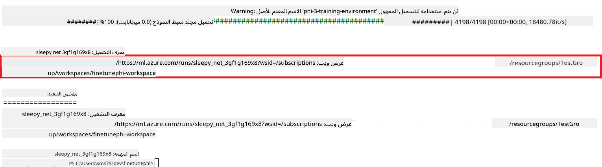

### Deploy the fine-tuned model

To integrate the fine-tuned Phi-3 model with Prompt Flow, you need to deploy the model to make it accessible for real-time inference. This process involves registering the model, creating an online endpoint, and deploying the model.

#### Set the model name, endpoint name, and deployment name for deployment

1. Open *config.py* file.

1. Replace `AZURE_MODEL_NAME = "your_fine_tuned_model_name"` with the desired name for your model.

1. Replace `AZURE_ENDPOINT_NAME = "your_fine_tuned_model_endpoint_name"` with the desired name for your endpoint.

1. Replace `AZURE_DEPLOYMENT_NAME = "your_fine_tuned_model_deployment_name"` باستخدام الاسم المطلوب للنشر.

#### إضافة الكود إلى ملف *deploy_model.py*

تشغيل ملف *deploy_model.py* يقوم بأتمتة عملية النشر بالكامل. يتم تسجيل النموذج، وإنشاء نقطة النهاية، وتنفيذ النشر بناءً على الإعدادات المحددة في ملف config.py، والذي يتضمن اسم النموذج، اسم نقطة النهاية، واسم النشر.

1. افتح ملف *deploy_model.py* في Visual Studio Code.

1. أضف الكود التالي إلى ملف *deploy_model.py*.

    ```python
    import logging
    from azure.identity import AzureCliCredential
    from azure.ai.ml import MLClient
    from azure.ai.ml.entities import Model, ProbeSettings, ManagedOnlineEndpoint, ManagedOnlineDeployment, IdentityConfiguration, ManagedIdentityConfiguration, OnlineRequestSettings
    from azure.ai.ml.constants import AssetTypes

    # Configuration imports
    from config import (
        AZURE_SUBSCRIPTION_ID,
        AZURE_RESOURCE_GROUP_NAME,
        AZURE_ML_WORKSPACE_NAME,
        AZURE_MANAGED_IDENTITY_RESOURCE_ID,
        AZURE_MANAGED_IDENTITY_CLIENT_ID,
        AZURE_MODEL_NAME,
        AZURE_ENDPOINT_NAME,
        AZURE_DEPLOYMENT_NAME
    )

    # Constants
    JOB_NAME = "your-job-name"
    COMPUTE_INSTANCE_TYPE = "Standard_E4s_v3"

    deployment_env_vars = {
        "SUBSCRIPTION_ID": AZURE_SUBSCRIPTION_ID,
        "RESOURCE_GROUP_NAME": AZURE_RESOURCE_GROUP_NAME,
        "UAI_CLIENT_ID": AZURE_MANAGED_IDENTITY_CLIENT_ID,
    }

    # Logging setup
    logging.basicConfig(
        format="%(asctime)s - %(levelname)s - %(name)s - %(message)s",
        datefmt="%Y-%m-%d %H:%M:%S",
        level=logging.DEBUG
    )
    logger = logging.getLogger(__name__)

    def get_ml_client():
        """Initialize and return the ML Client."""
        credential = AzureCliCredential()
        return MLClient(credential, AZURE_SUBSCRIPTION_ID, AZURE_RESOURCE_GROUP_NAME, AZURE_ML_WORKSPACE_NAME)

    def register_model(ml_client, model_name, job_name):
        """Register a new model."""
        model_path = f"azureml://jobs/{job_name}/outputs/artifacts/paths/model_output"
        logger.info(f"Registering model {model_name} from job {job_name} at path {model_path}.")
        run_model = Model(
            path=model_path,
            name=model_name,
            description="Model created from run.",
            type=AssetTypes.MLFLOW_MODEL,
        )
        model = ml_client.models.create_or_update(run_model)
        logger.info(f"Registered model ID: {model.id}")
        return model

    def delete_existing_endpoint(ml_client, endpoint_name):
        """Delete existing endpoint if it exists."""
        try:
            endpoint_result = ml_client.online_endpoints.get(name=endpoint_name)
            logger.info(f"Deleting existing endpoint {endpoint_name}.")
            ml_client.online_endpoints.begin_delete(name=endpoint_name).result()
            logger.info(f"Deleted existing endpoint {endpoint_name}.")
        except Exception as e:
            logger.info(f"No existing endpoint {endpoint_name} found to delete: {e}")

    def create_or_update_endpoint(ml_client, endpoint_name, description=""):
        """Create or update an endpoint."""
        delete_existing_endpoint(ml_client, endpoint_name)
        logger.info(f"Creating new endpoint {endpoint_name}.")
        endpoint = ManagedOnlineEndpoint(
            name=endpoint_name,
            description=description,
            identity=IdentityConfiguration(
                type="user_assigned",
                user_assigned_identities=[ManagedIdentityConfiguration(resource_id=AZURE_MANAGED_IDENTITY_RESOURCE_ID)]
            )
        )
        endpoint_result = ml_client.online_endpoints.begin_create_or_update(endpoint).result()
        logger.info(f"Created new endpoint {endpoint_name}.")
        return endpoint_result

    def create_or_update_deployment(ml_client, endpoint_name, deployment_name, model):
        """Create or update a deployment."""

        logger.info(f"Creating deployment {deployment_name} for endpoint {endpoint_name}.")
        deployment = ManagedOnlineDeployment(
            name=deployment_name,
            endpoint_name=endpoint_name,
            model=model.id,
            instance_type=COMPUTE_INSTANCE_TYPE,
            instance_count=1,
            environment_variables=deployment_env_vars,
            request_settings=OnlineRequestSettings(
                max_concurrent_requests_per_instance=3,
                request_timeout_ms=180000,
                max_queue_wait_ms=120000
            ),
            liveness_probe=ProbeSettings(
                failure_threshold=30,
                success_threshold=1,
                period=100,
                initial_delay=500,
            ),
            readiness_probe=ProbeSettings(
                failure_threshold=30,
                success_threshold=1,
                period=100,
                initial_delay=500,
            ),
        )
        deployment_result = ml_client.online_deployments.begin_create_or_update(deployment).result()
        logger.info(f"Created deployment {deployment.name} for endpoint {endpoint_name}.")
        return deployment_result

    def set_traffic_to_deployment(ml_client, endpoint_name, deployment_name):
        """Set traffic to the specified deployment."""
        try:
            # Fetch the current endpoint details
            endpoint = ml_client.online_endpoints.get(name=endpoint_name)
            
            # Log the current traffic allocation for debugging
            logger.info(f"Current traffic allocation: {endpoint.traffic}")
            
            # Set the traffic allocation for the deployment
            endpoint.traffic = {deployment_name: 100}
            
            # Update the endpoint with the new traffic allocation
            endpoint_poller = ml_client.online_endpoints.begin_create_or_update(endpoint)
            updated_endpoint = endpoint_poller.result()
            
            # Log the updated traffic allocation for debugging
            logger.info(f"Updated traffic allocation: {updated_endpoint.traffic}")
            logger.info(f"Set traffic to deployment {deployment_name} at endpoint {endpoint_name}.")
            return updated_endpoint
        except Exception as e:
            # Log any errors that occur during the process
            logger.error(f"Failed to set traffic to deployment: {e}")
            raise


    def main():
        ml_client = get_ml_client()

        registered_model = register_model(ml_client, AZURE_MODEL_NAME, JOB_NAME)
        logger.info(f"Registered model ID: {registered_model.id}")

        endpoint = create_or_update_endpoint(ml_client, AZURE_ENDPOINT_NAME, "Endpoint for finetuned Phi-3 model")
        logger.info(f"Endpoint {AZURE_ENDPOINT_NAME} is ready.")

        try:
            deployment = create_or_update_deployment(ml_client, AZURE_ENDPOINT_NAME, AZURE_DEPLOYMENT_NAME, registered_model)
            logger.info(f"Deployment {AZURE_DEPLOYMENT_NAME} is created for endpoint {AZURE_ENDPOINT_NAME}.")

            set_traffic_to_deployment(ml_client, AZURE_ENDPOINT_NAME, AZURE_DEPLOYMENT_NAME)
            logger.info(f"Traffic is set to deployment {AZURE_DEPLOYMENT_NAME} at endpoint {AZURE_ENDPOINT_NAME}.")
        except Exception as e:
            logger.error(f"Failed to create or update deployment: {e}")

    if __name__ == "__main__":
        main()

    ```

1. قم بتنفيذ الخطوات التالية للحصول على `JOB_NAME`:

    - Navigate to Azure Machine Learning resource that you created.
    - Select **Studio web URL** to open the Azure Machine Learning workspace.
    - Select **Jobs** from the left side tab.
    - Select the experiment for fine-tuning. For example, *finetunephi*.
    - Select the job that you created.
    - Copy and paste your job Name into the `JOB_NAME = "your-job-name"` in *deploy_model.py* file.

1. Replace `COMPUTE_INSTANCE_TYPE` بالتفاصيل الخاصة بك.

1. اكتب الأمر التالي لتشغيل البرنامج النصي *deploy_model.py* وبدء عملية النشر في Azure Machine Learning.

    ```python
    python deploy_model.py
    ```

> [!WARNING]
> لتجنب تكاليف إضافية على حسابك، تأكد من حذف نقطة النهاية التي تم إنشاؤها في مساحة عمل Azure Machine Learning.
>

#### التحقق من حالة النشر في مساحة عمل Azure Machine Learning

1. قم بزيارة [Azure ML Studio](https://ml.azure.com/home?wt.mc_id=studentamb_279723).

1. انتقل إلى مساحة عمل Azure Machine Learning التي أنشأتها.

1. اختر **Studio web URL** لفتح مساحة عمل Azure Machine Learning.

1. اختر **Endpoints** من علامة التبويب الجانبية.

    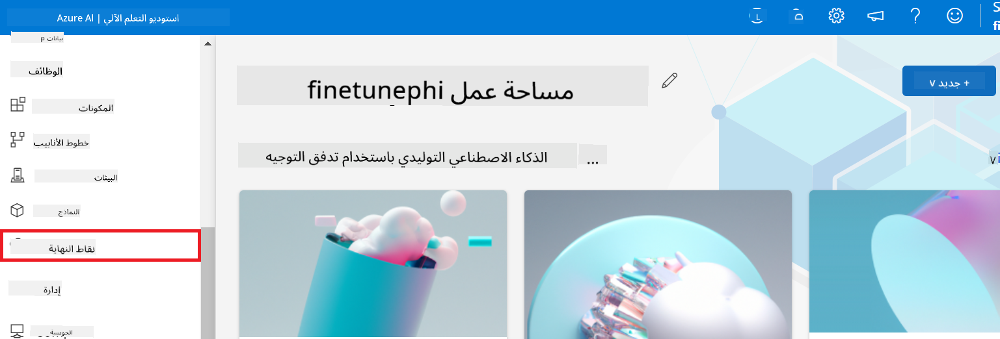

2. اختر نقطة النهاية التي أنشأتها.

    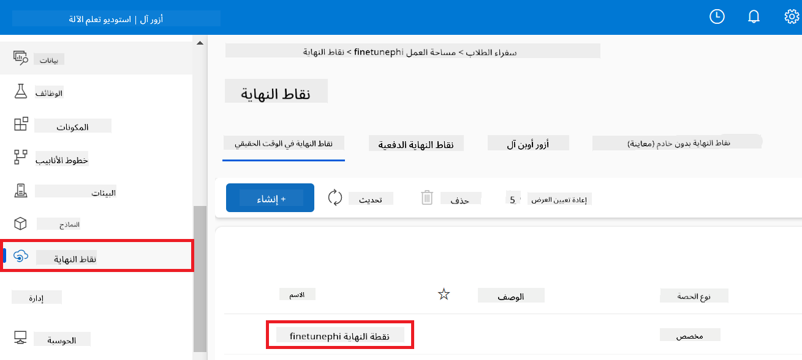

3. في هذه الصفحة، يمكنك إدارة نقاط النهاية التي تم إنشاؤها أثناء عملية النشر.

## السيناريو 3: التكامل مع Prompt flow والدردشة مع النموذج المخصص

### تكامل نموذج Phi-3 المخصص مع Prompt flow

بعد نشر النموذج الذي تم تحسينه بنجاح، يمكنك الآن دمجه مع Prompt flow لاستخدام النموذج الخاص بك في التطبيقات الفورية، مما يتيح مجموعة متنوعة من المهام التفاعلية مع نموذج Phi-3 المخصص الخاص بك.

#### إعداد مفتاح API وURI نقطة النهاية للنموذج المخصص Phi-3

1. انتقل إلى مساحة عمل Azure Machine Learning التي أنشأتها.
1. اختر **Endpoints** من علامة التبويب الجانبية.
1. اختر نقطة النهاية التي أنشأتها.
1. اختر **Consume** من قائمة التنقل.
1. قم بنسخ ولصق **REST endpoint** الخاص بك في ملف *config.py*، واستبدل `AZURE_ML_ENDPOINT = "your_fine_tuned_model_endpoint_uri"` with your **REST endpoint**.
1. Copy and paste your **Primary key** into the *config.py* file, replacing `AZURE_ML_API_KEY = "your_fine_tuned_model_api_key"` بـ **Primary key** الخاص بك.

    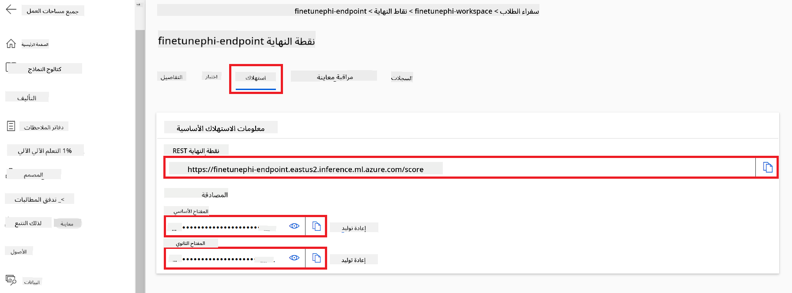

#### إضافة الكود إلى ملف *flow.dag.yml*

1. افتح ملف *flow.dag.yml* في Visual Studio Code.

1. أضف الكود التالي إلى ملف *flow.dag.yml*.

    ```yml
    inputs:
      input_data:
        type: string
        default: "Who founded Microsoft?"

    outputs:
      answer:
        type: string
        reference: ${integrate_with_promptflow.output}

    nodes:
    - name: integrate_with_promptflow
      type: python
      source:
        type: code
        path: integrate_with_promptflow.py
      inputs:
        input_data: ${inputs.input_data}
    ```

#### إضافة الكود إلى ملف *integrate_with_promptflow.py*

1. افتح ملف *integrate_with_promptflow.py* في Visual Studio Code.

1. أضف الكود التالي إلى ملف *integrate_with_promptflow.py*.

    ```python
    import logging
    import requests
    from promptflow.core import tool
    import asyncio
    import platform
    from config import (
        AZURE_ML_ENDPOINT,
        AZURE_ML_API_KEY
    )

    # Logging setup
    logging.basicConfig(
        format="%(asctime)s - %(levelname)s - %(name)s - %(message)s",
        datefmt="%Y-%m-%d %H:%M:%S",
        level=logging.DEBUG
    )
    logger = logging.getLogger(__name__)

    def query_azml_endpoint(input_data: list, endpoint_url: str, api_key: str) -> str:
        """
        Send a request to the Azure ML endpoint with the given input data.
        """
        headers = {
            "Content-Type": "application/json",
            "Authorization": f"Bearer {api_key}"
        }
        data = {
            "input_data": [input_data],
            "params": {
                "temperature": 0.7,
                "max_new_tokens": 128,
                "do_sample": True,
                "return_full_text": True
            }
        }
        try:
            response = requests.post(endpoint_url, json=data, headers=headers)
            response.raise_for_status()
            result = response.json()[0]
            logger.info("Successfully received response from Azure ML Endpoint.")
            return result
        except requests.exceptions.RequestException as e:
            logger.error(f"Error querying Azure ML Endpoint: {e}")
            raise

    def setup_asyncio_policy():
        """
        Setup asyncio event loop policy for Windows.
        """
        if platform.system() == 'Windows':
            asyncio.set_event_loop_policy(asyncio.WindowsSelectorEventLoopPolicy())
            logger.info("Set Windows asyncio event loop policy.")

    @tool
    def my_python_tool(input_data: str) -> str:
        """
        Tool function to process input data and query the Azure ML endpoint.
        """
        setup_asyncio_policy()
        return query_azml_endpoint(input_data, AZURE_ML_ENDPOINT, AZURE_ML_API_KEY)

    ```

### الدردشة مع النموذج المخصص الخاص بك

1. اكتب الأمر التالي لتشغيل البرنامج النصي *deploy_model.py* وبدء عملية النشر في Azure Machine Learning.

    ```python
    pf flow serve --source ./ --port 8080 --host localhost
    ```

1. إليك مثال على النتائج: الآن يمكنك الدردشة مع نموذج Phi-3 المخصص الخاص بك. يُوصى بطرح أسئلة بناءً على البيانات المستخدمة لتحسين النموذج.

    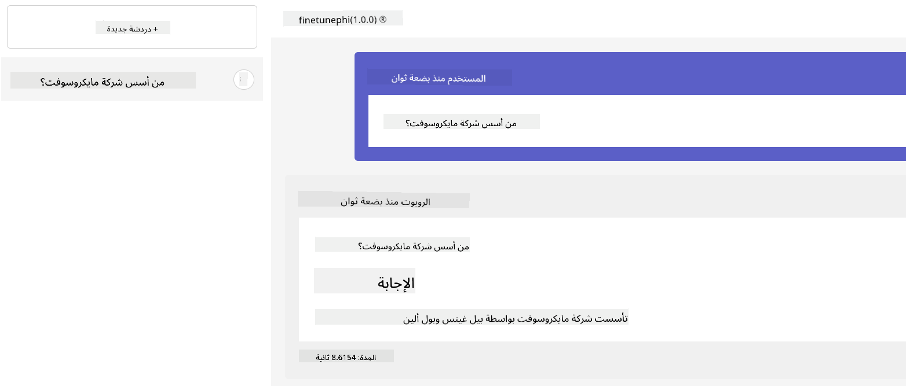

**إخلاء مسؤولية**:  
تم ترجمة هذا المستند باستخدام خدمة الترجمة الآلية [Co-op Translator](https://github.com/Azure/co-op-translator). بينما نسعى لتحقيق الدقة، يرجى العلم أن الترجمات الآلية قد تحتوي على أخطاء أو عدم دقة. يجب اعتبار المستند الأصلي بلغته الأصلية هو المصدر الموثوق. للحصول على معلومات حساسة أو مهمة، يُوصى بالاستعانة بترجمة بشرية احترافية. نحن غير مسؤولين عن أي سوء فهم أو تفسيرات خاطئة ناتجة عن استخدام هذه الترجمة.