<!--
CO_OP_TRANSLATOR_METADATA:
{
  "original_hash": "ecbd9179a21edbaafaf114d47f09f3e3",
  "translation_date": "2025-03-27T10:29:08+00:00",
  "source_file": "md\\02.Application\\01.TextAndChat\\Phi3\\E2E_Phi-3-FineTuning_PromptFlow_Integration_AIFoundry.md",
  "language_code": "ar"
}
-->
# تحسين وضبط نماذج Phi-3 المخصصة مع Prompt Flow في Azure AI Foundry

هذه العينة الشاملة تعتمد على الدليل "[تحسين وضبط نماذج Phi-3 المخصصة مع Prompt Flow في Azure AI Foundry](https://techcommunity.microsoft.com/t5/educator-developer-blog/fine-tune-and-integrate-custom-phi-3-models-with-prompt-flow-in/ba-p/4191726?WT.mc_id=aiml-137032-kinfeylo)" من مجتمع Microsoft Tech. يُقدم هذا الدليل خطوات تحسين وضبط، نشر، ودمج نماذج Phi-3 المخصصة باستخدام Prompt Flow في Azure AI Foundry.  
على عكس العينة الشاملة "[تحسين وضبط نماذج Phi-3 المخصصة مع Prompt Flow](./E2E_Phi-3-FineTuning_PromptFlow_Integration.md)" التي تعتمد على تشغيل الكود محليًا، يركز هذا الدليل على تحسين وضبط ودمج النموذج بالكامل داخل Azure AI / ML Studio.

## نظرة عامة

في هذه العينة الشاملة، ستتعلم كيفية تحسين وضبط نموذج Phi-3 ودمجه مع Prompt Flow في Azure AI Foundry. باستخدام Azure AI / ML Studio، ستنشئ سير عمل لنشر واستخدام نماذج الذكاء الاصطناعي المخصصة. هذه العينة الشاملة مقسمة إلى ثلاثة سيناريوهات:

**السيناريو الأول: إعداد موارد Azure والتحضير لتحسين النموذج**

**السيناريو الثاني: تحسين وضبط نموذج Phi-3 ونشره في Azure Machine Learning Studio**

**السيناريو الثالث: دمج النموذج مع Prompt Flow والتفاعل معه داخل Azure AI Foundry**

إليك نظرة عامة على هذه العينة الشاملة:

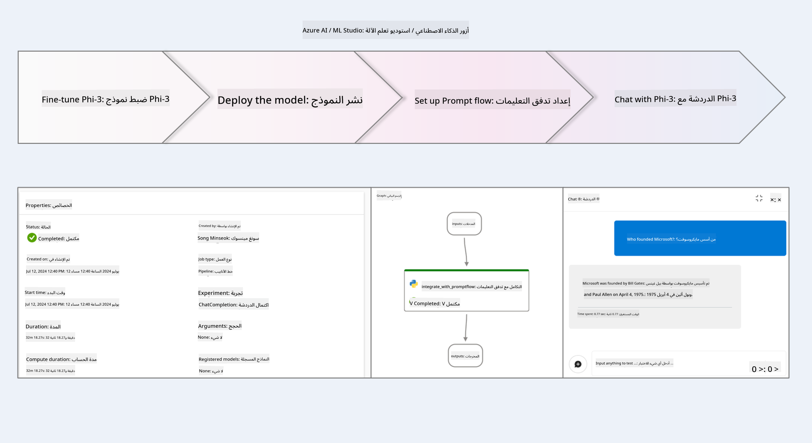

### جدول المحتويات

1. **[السيناريو الأول: إعداد موارد Azure والتحضير لتحسين النموذج](../../../../../../md/02.Application/01.TextAndChat/Phi3)**  
    - [إنشاء Workspace لـ Azure Machine Learning](../../../../../../md/02.Application/01.TextAndChat/Phi3)  
    - [طلب حصص GPU في اشتراك Azure](../../../../../../md/02.Application/01.TextAndChat/Phi3)  
    - [إضافة تعيين الدور](../../../../../../md/02.Application/01.TextAndChat/Phi3)  
    - [إعداد المشروع](../../../../../../md/02.Application/01.TextAndChat/Phi3)  
    - [تحضير مجموعة البيانات لتحسين النموذج](../../../../../../md/02.Application/01.TextAndChat/Phi3)  

1. **[السيناريو الثاني: تحسين وضبط نموذج Phi-3 ونشره في Azure Machine Learning Studio](../../../../../../md/02.Application/01.TextAndChat/Phi3)**  
    - [تحسين وضبط نموذج Phi-3](../../../../../../md/02.Application/01.TextAndChat/Phi3)  
    - [نشر نموذج Phi-3 المحسن](../../../../../../md/02.Application/01.TextAndChat/Phi3)  

1. **[السيناريو الثالث: دمج النموذج مع Prompt Flow والتفاعل معه داخل Azure AI Foundry](../../../../../../md/02.Application/01.TextAndChat/Phi3)**  
    - [دمج نموذج Phi-3 المخصص مع Prompt Flow](../../../../../../md/02.Application/01.TextAndChat/Phi3)  
    - [التفاعل مع نموذج Phi-3 المخصص](../../../../../../md/02.Application/01.TextAndChat/Phi3)  

## السيناريو الأول: إعداد موارد Azure والتحضير لتحسين النموذج

### إنشاء Workspace لـ Azure Machine Learning

1. اكتب *azure machine learning* في **شريط البحث** أعلى صفحة البوابة، ثم اختر **Azure Machine Learning** من الخيارات التي تظهر.

    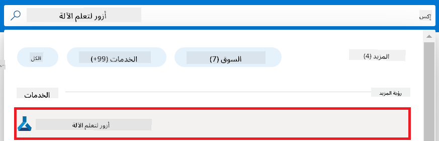

2. اختر **+ Create** من قائمة التنقل.

3. اختر **New workspace** من قائمة التنقل.

    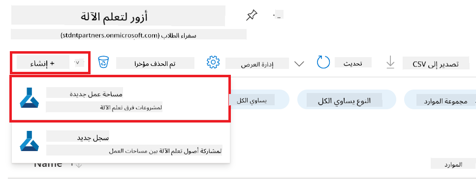

4. قم بالمهام التالية:

    - اختر **Subscription** الخاص بك في Azure.  
    - اختر **Resource group** الذي ترغب باستخدامه (قم بإنشاء جديد إذا لزم الأمر).  
    - أدخل **Workspace Name**. يجب أن يكون اسمًا فريدًا.  
    - اختر **Region** الذي ترغب باستخدامه.  
    - اختر **Storage account** الذي ترغب باستخدامه (قم بإنشاء جديد إذا لزم الأمر).  
    - اختر **Key vault** الذي ترغب باستخدامه (قم بإنشاء جديد إذا لزم الأمر).  
    - اختر **Application insights** الذي ترغب باستخدامه (قم بإنشاء جديد إذا لزم الأمر).  
    - اختر **Container registry** الذي ترغب باستخدامه (قم بإنشاء جديد إذا لزم الأمر).  

    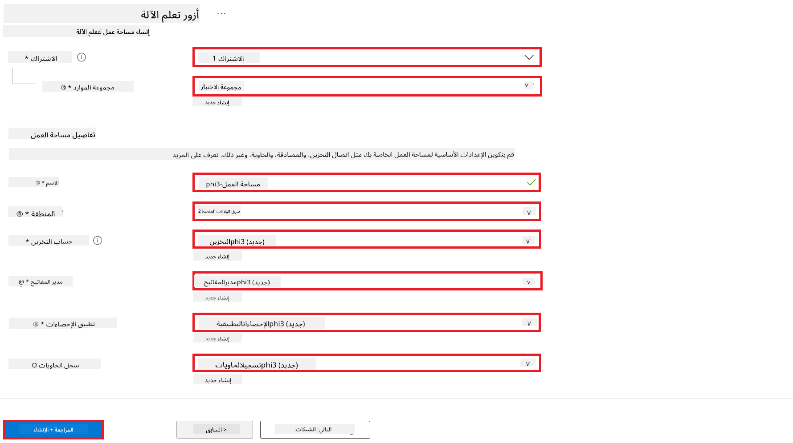

5. اختر **Review + Create**.

6. اختر **Create**.

### طلب حصص GPU في اشتراك Azure

في هذا الدليل، ستتعلم كيفية تحسين وضبط ونشر نموذج Phi-3 باستخدام وحدات GPU. لتحسين النموذج، ستستخدم GPU من نوع *Standard_NC24ads_A100_v4*، الذي يتطلب طلب حصة. وللنشر، ستستخدم GPU من نوع *Standard_NC6s_v3*، الذي يتطلب أيضًا طلب حصة.

> [!NOTE]
>
> فقط الاشتراكات من نوع الدفع حسب الاستخدام (Pay-As-You-Go) مؤهلة للحصول على GPU؛ الاشتراكات ذات الامتيازات غير مدعومة حاليًا.

1. قم بزيارة [Azure ML Studio](https://ml.azure.com/home?wt.mc_id=studentamb_279723).

1. قم بالمهام التالية لطلب حصة *Standard NCADSA100v4 Family*:

    - اختر **Quota** من الشريط الجانبي.  
    - اختر **Virtual machine family** الذي ترغب باستخدامه. على سبيل المثال، اختر **Standard NCADSA100v4 Family Cluster Dedicated vCPUs**، الذي يشمل GPU من نوع *Standard_NC24ads_A100_v4*.  
    - اختر **Request quota** من قائمة التنقل.  

        

    - داخل صفحة طلب الحصة، أدخل **New cores limit** الذي ترغب باستخدامه. على سبيل المثال، 24.  
    - داخل صفحة طلب الحصة، اختر **Submit** لطلب حصة GPU.

1. قم بالمهام التالية لطلب حصة *Standard NCSv3 Family*:

    - اختر **Quota** من الشريط الجانبي.  
    - اختر **Virtual machine family** الذي ترغب باستخدامه. على سبيل المثال، اختر **Standard NCSv3 Family Cluster Dedicated vCPUs**، الذي يشمل GPU من نوع *Standard_NC6s_v3*.  
    - اختر **Request quota** من قائمة التنقل.  
    - داخل صفحة طلب الحصة، أدخل **New cores limit** الذي ترغب باستخدامه. على سبيل المثال، 24.  
    - داخل صفحة طلب الحصة، اختر **Submit** لطلب حصة GPU.

### إضافة تعيين الدور

لتحسين وضبط ونشر نماذجك، يجب أولاً إنشاء هوية مُدارة (UAI) وتعيين الأذونات المناسبة لها. سيتم استخدام هذه الهوية المُدارة للمصادقة أثناء عملية النشر.

#### إنشاء هوية مُدارة (UAI)

1. اكتب *managed identities* في **شريط البحث** أعلى صفحة البوابة، ثم اختر **Managed Identities** من الخيارات التي تظهر.

    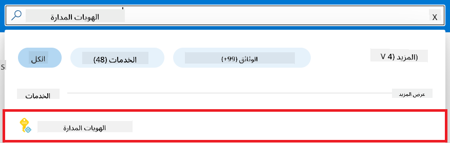

1. اختر **+ Create**.

    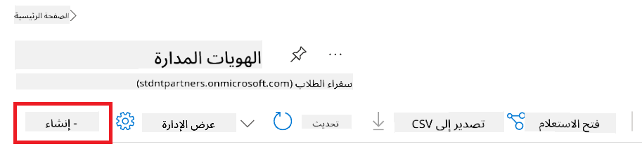

1. قم بالمهام التالية:

    - اختر **Subscription** الخاص بك في Azure.  
    - اختر **Resource group** الذي ترغب باستخدامه (قم بإنشاء جديد إذا لزم الأمر).  
    - اختر **Region** الذي ترغب باستخدامه.  
    - أدخل **Name**. يجب أن يكون اسمًا فريدًا.  

    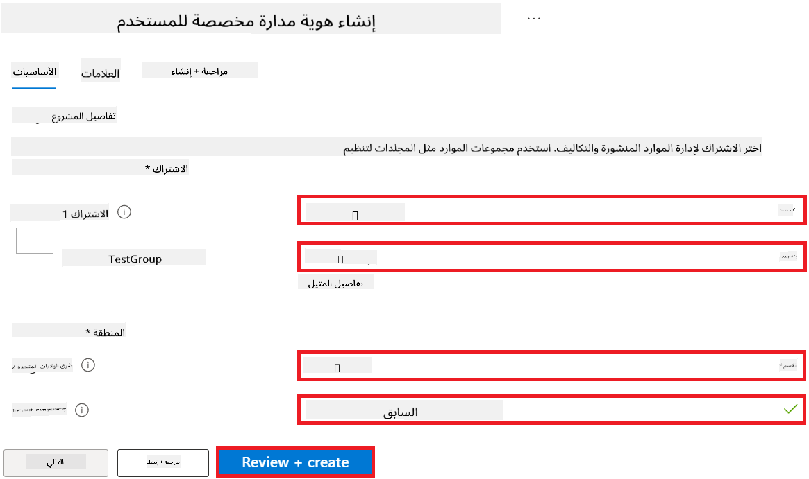

1. اختر **Review + create**.

1. اختر **+ Create**.

#### إضافة تعيين دور Contributor إلى الهوية المُدارة

1. انتقل إلى مورد الهوية المُدارة الذي أنشأته.

1. اختر **Azure role assignments** من الشريط الجانبي.

1. اختر **+Add role assignment** من قائمة التنقل.

1. داخل صفحة إضافة تعيين الدور، قم بالمهام التالية:
    - اختر **Scope** إلى **Resource group**.  
    - اختر **Subscription** الخاص بك في Azure.  
    - اختر **Resource group** الذي ترغب باستخدامه.  
    - اختر **Role** إلى **Contributor**.  

    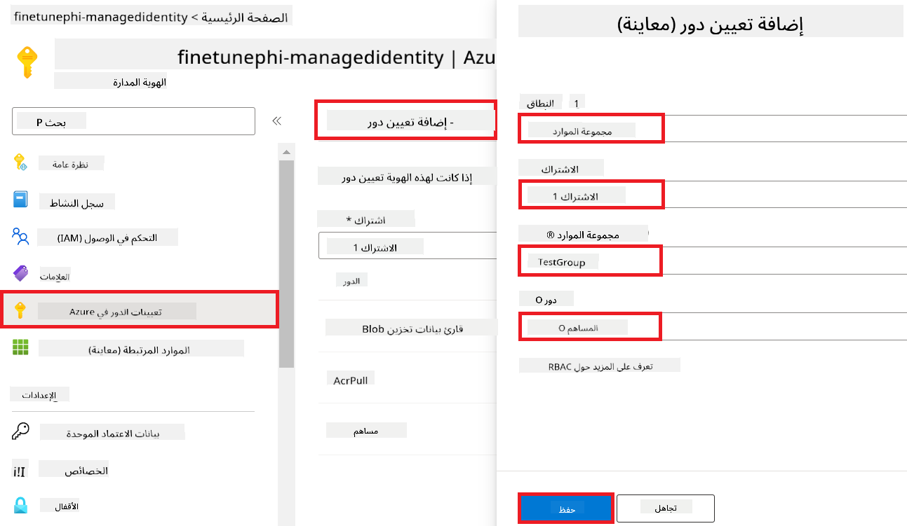

2. اختر **Save**.

#### إضافة تعيين دور Storage Blob Data Reader إلى الهوية المُدارة

1. اكتب *storage accounts* في **شريط البحث** أعلى صفحة البوابة، ثم اختر **Storage accounts** من الخيارات التي تظهر.

    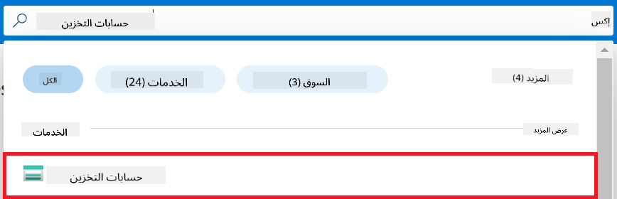

1. اختر حساب التخزين المرتبط بـ Azure Machine Learning workspace الذي أنشأته. على سبيل المثال، *finetunephistorage*.  
...
1. قم بزيارة [Azure ML Studio](https://ml.azure.com/home?wt.mc_id=studentamb_279723).

1. اختر **الحوسبة** من علامة التبويب الجانبية اليسرى.

1. اختر **مجموعات الحوسبة** من قائمة التنقل.

1. اختر **+ جديد**.

    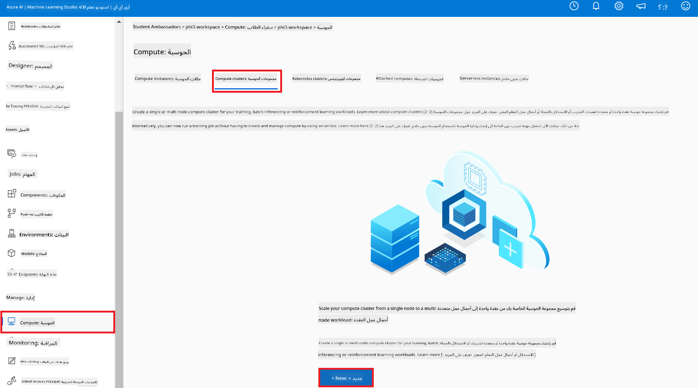

1. قم بتنفيذ المهام التالية:

    - اختر **المنطقة** التي ترغب في استخدامها.
    - اختر **طبقة الجهاز الافتراضي** إلى **مخصص**.
    - اختر **نوع الجهاز الافتراضي** إلى **GPU**.
    - اختر **مرشح حجم الجهاز الافتراضي** إلى **اختر من جميع الخيارات**.
    - اختر **حجم الجهاز الافتراضي** إلى **Standard_NC24ads_A100_v4**.

    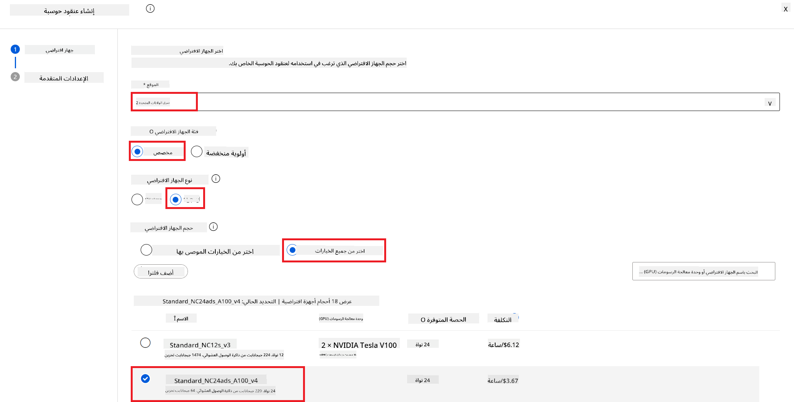

1. اختر **التالي**.

1. قم بتنفيذ المهام التالية:

    - أدخل **اسم الحوسبة**. يجب أن يكون قيمة فريدة.
    - اختر **الحد الأدنى لعدد العقد** إلى **0**.
    - اختر **الحد الأقصى لعدد العقد** إلى **1**.
    - اختر **الثواني الخاملة قبل التوسع للأسفل** إلى **120**.

    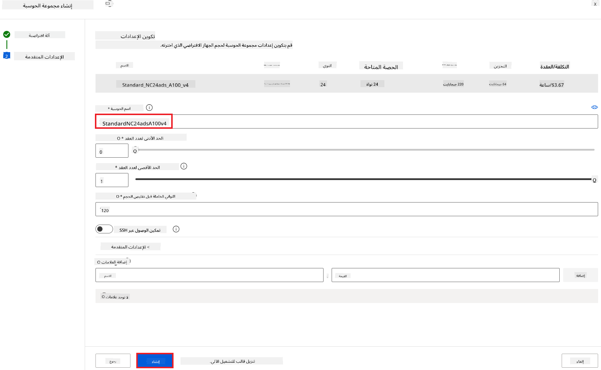

1. اختر **إنشاء**.

#### ضبط نموذج Phi-3

1. قم بزيارة [Azure ML Studio](https://ml.azure.com/home?wt.mc_id=studentamb_279723).

1. اختر مساحة العمل الخاصة بـ Azure Machine Learning التي قمت بإنشائها.

    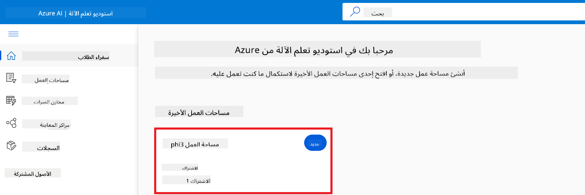

1. قم بتنفيذ المهام التالية:

    - اختر **كتالوج النماذج** من علامة التبويب الجانبية اليسرى.
    - اكتب *phi-3-mini-4k* في **شريط البحث** واختر **Phi-3-mini-4k-instruct** من الخيارات التي تظهر.

    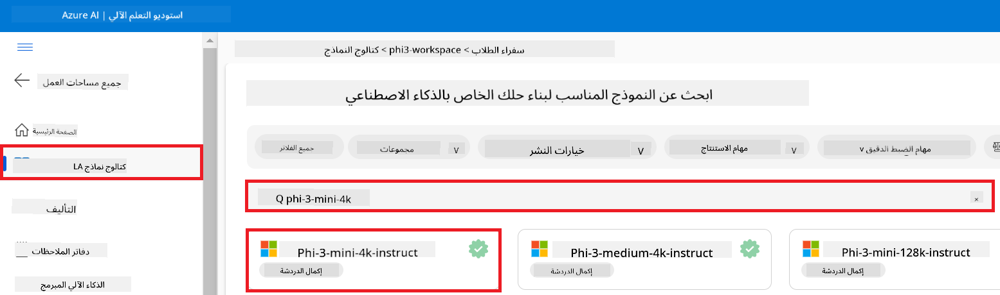

1. اختر **ضبط** من قائمة التنقل.

    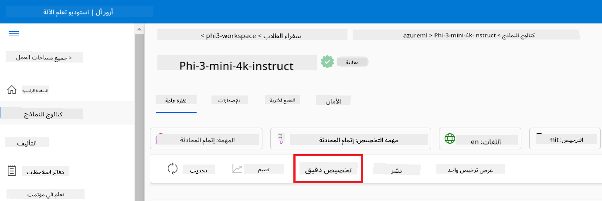

1. قم بتنفيذ المهام التالية:

    - اختر **نوع المهمة** إلى **إكمال المحادثة**.
    - اختر **+ اختيار البيانات** لتحميل **بيانات التدريب**.
    - اختر نوع تحميل بيانات التحقق إلى **توفير بيانات تحقق مختلفة**.
    - اختر **+ اختيار البيانات** لتحميل **بيانات التحقق**.

    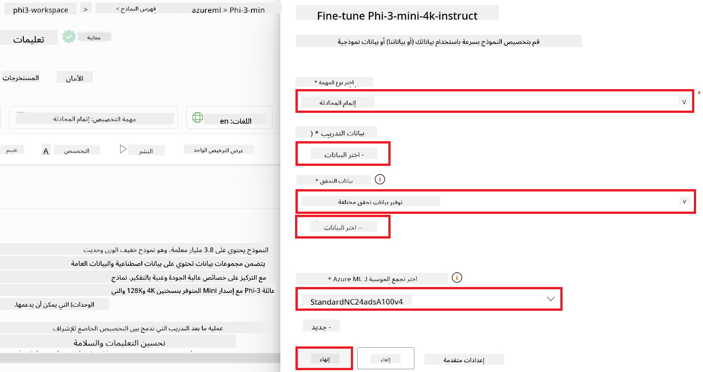

    > [!TIP]
    >
    > يمكنك اختيار **الإعدادات المتقدمة** لتخصيص التكوينات مثل **معدل التعلم** و **نوع جدولة معدل التعلم** لتحسين عملية الضبط وفقًا لاحتياجاتك المحددة.

1. اختر **إنهاء**.

1. في هذا التمرين، قمت بضبط نموذج Phi-3 بنجاح باستخدام Azure Machine Learning. يرجى ملاحظة أن عملية الضبط قد تستغرق وقتًا طويلاً. بعد تشغيل مهمة الضبط، ستحتاج إلى الانتظار حتى تكتمل. يمكنك مراقبة حالة مهمة الضبط من خلال الانتقال إلى علامة تبويب المهام في الجانب الأيسر من مساحة عمل Azure Machine Learning الخاصة بك. في السلسلة التالية، ستقوم بنشر النموذج المضبوط ودمجه مع Prompt Flow.

    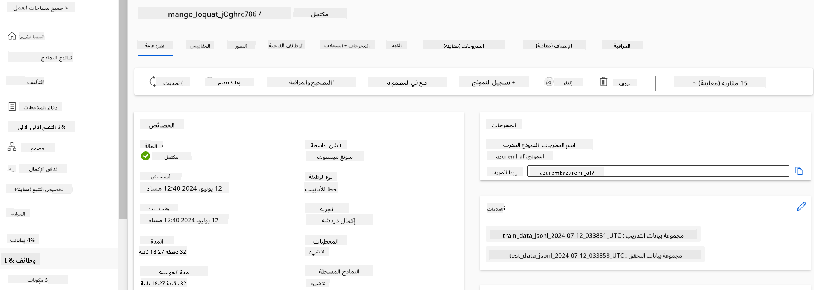

### نشر نموذج Phi-3 المضبوط

لدمج نموذج Phi-3 المضبوط مع Prompt Flow، تحتاج إلى نشر النموذج ليكون متاحًا للتنبؤ في الوقت الفعلي. تتضمن هذه العملية تسجيل النموذج، وإنشاء نقطة نهاية عبر الإنترنت، ونشر النموذج.

في هذا التمرين، ستقوم بـ:

- تسجيل النموذج المضبوط في مساحة عمل Azure Machine Learning.
- إنشاء نقطة نهاية عبر الإنترنت.
- نشر نموذج Phi-3 المضبوط المسجل.

#### تسجيل النموذج المضبوط

1. قم بزيارة [Azure ML Studio](https://ml.azure.com/home?wt.mc_id=studentamb_279723).

1. اختر مساحة العمل الخاصة بـ Azure Machine Learning التي قمت بإنشائها.

    

1. اختر **النماذج** من علامة التبويب الجانبية اليسرى.
1. اختر **+ تسجيل**.
1. اختر **من مخرجات المهمة**.

    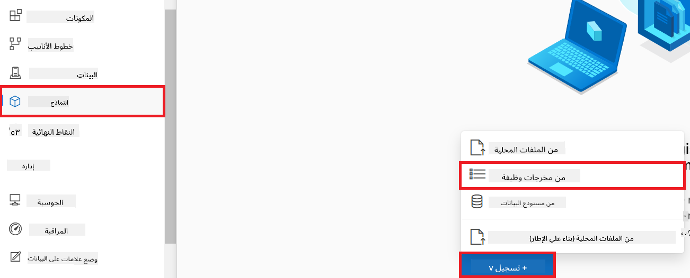

1. اختر المهمة التي قمت بإنشائها.

    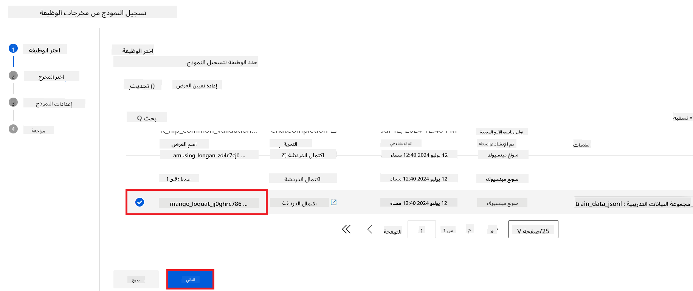

1. اختر **التالي**.

1. اختر **نوع النموذج** إلى **MLflow**.

1. تأكد من أن **مخرجات المهمة** محددة؛ يجب أن تكون محددة تلقائيًا.

    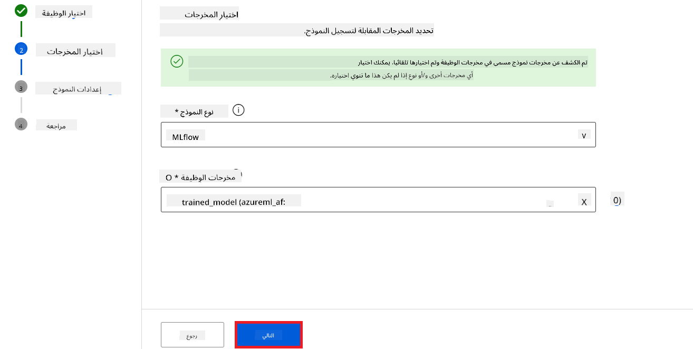

2. اختر **التالي**.

3. اختر **تسجيل**.

    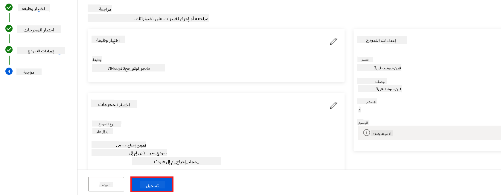

4. يمكنك عرض النموذج المسجل الخاص بك من خلال الانتقال إلى قائمة **النماذج** من علامة التبويب الجانبية اليسرى.

    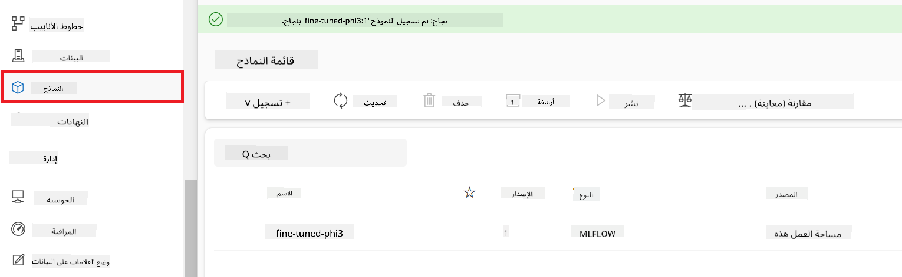

#### نشر النموذج المضبوط

1. انتقل إلى مساحة عمل Azure Machine Learning التي قمت بإنشائها.

1. اختر **النقاط النهائية** من علامة التبويب الجانبية اليسرى.

1. اختر **نقاط النهاية في الوقت الفعلي** من قائمة التنقل.

    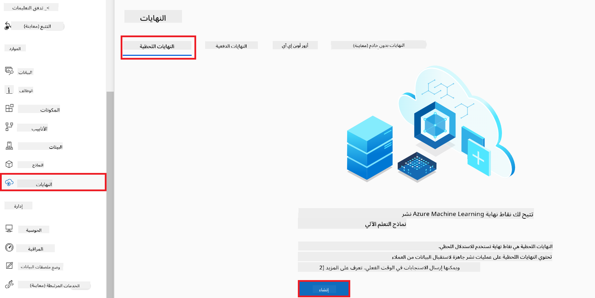

1. اختر **إنشاء**.

1. اختر النموذج المسجل الذي قمت بإنشائه.

    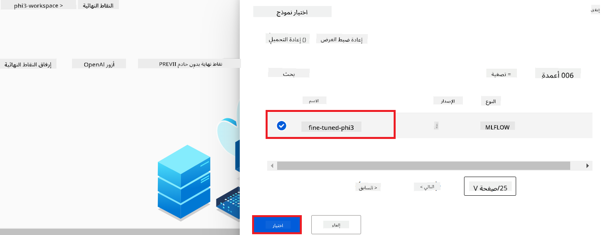

1. اختر **اختيار**.

1. قم بتنفيذ المهام التالية:

    - اختر **الجهاز الافتراضي** إلى *Standard_NC6s_v3*.
    - اختر **عدد النسخ** التي ترغب في استخدامها. على سبيل المثال، *1*.
    - اختر **نقطة النهاية** إلى **جديدة** لإنشاء نقطة نهاية.
    - أدخل **اسم نقطة النهاية**. يجب أن تكون قيمة فريدة.
    - أدخل **اسم النشر**. يجب أن تكون قيمة فريدة.

    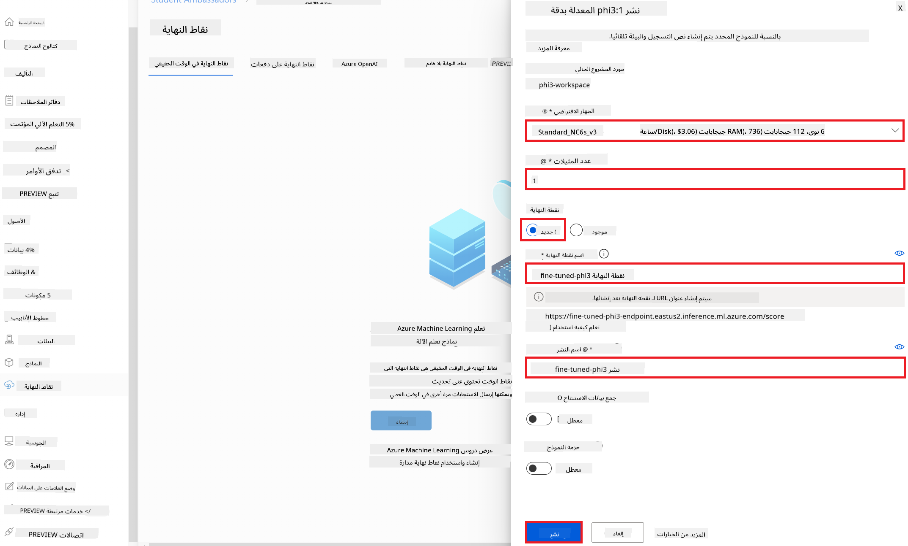

1. اختر **نشر**.

> [!WARNING]
> لتجنب تكاليف إضافية على حسابك، تأكد من حذف نقطة النهاية التي تم إنشاؤها في مساحة عمل Azure Machine Learning.
>

#### التحقق من حالة النشر في مساحة عمل Azure Machine Learning

1. انتقل إلى مساحة عمل Azure Machine Learning التي قمت بإنشائها.

1. اختر **النقاط النهائية** من علامة التبويب الجانبية اليسرى.

1. اختر نقطة النهاية التي قمت بإنشائها.

    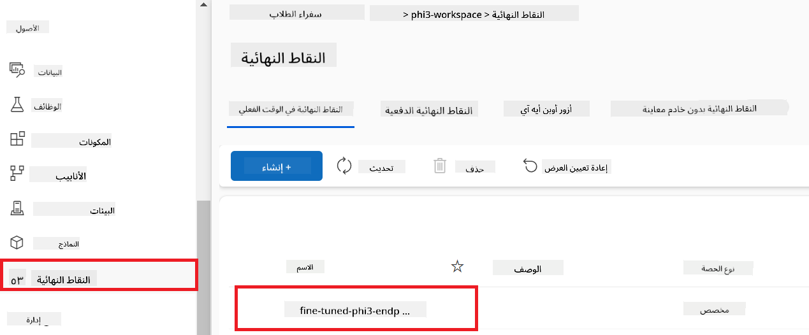

1. في هذه الصفحة، يمكنك إدارة النقاط النهائية أثناء عملية النشر.

> [!NOTE]
> بمجرد اكتمال النشر، تأكد من أن **حركة المرور المباشرة** مضبوطة على **100%**. إذا لم تكن كذلك، اختر **تحديث حركة المرور** لتعديل إعدادات حركة المرور. لاحظ أنه لا يمكنك اختبار النموذج إذا كانت حركة المرور مضبوطة على 0%.
>
> 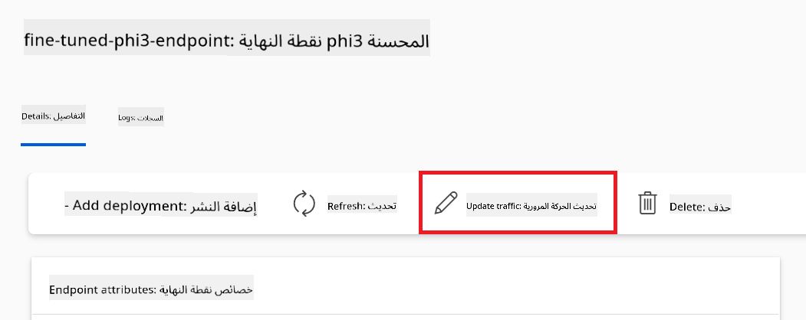
>

## السيناريو 3: التكامل مع Prompt Flow والتفاعل مع النموذج المخصص في Azure AI Foundry

### دمج نموذج Phi-3 المخصص مع Prompt Flow

بعد نشر النموذج المضبوط بنجاح، يمكنك الآن دمجه مع Prompt Flow لاستخدام النموذج الخاص بك في التطبيقات التفاعلية في الوقت الفعلي، مما يتيح مجموعة متنوعة من المهام التفاعلية مع نموذج Phi-3 المخصص الخاص بك.

في هذا التمرين، ستقوم بـ:

- إنشاء مركز Azure AI Foundry.
- إنشاء مشروع Azure AI Foundry.
- إنشاء Prompt Flow.
- إضافة اتصال مخصص للنموذج المضبوط Phi-3.
- إعداد Prompt Flow للتفاعل مع النموذج المخصص Phi-3 الخاص بك.

> [!NOTE]
> يمكنك أيضًا التكامل مع Prompt Flow باستخدام Azure ML Studio. يمكن تطبيق نفس عملية التكامل على Azure ML Studio.

#### إنشاء مركز Azure AI Foundry

ستحتاج إلى إنشاء مركز قبل إنشاء المشروع. يعمل المركز كمجموعة موارد، مما يتيح لك تنظيم وإدارة مشاريع متعددة داخل Azure AI Foundry.

1. قم بزيارة [Azure AI Foundry](https://ai.azure.com/?WT.mc_id=aiml-137032-kinfeylo).

1. اختر **جميع المراكز** من علامة التبويب الجانبية اليسرى.

1. اختر **+ مركز جديد** من قائمة التنقل.

    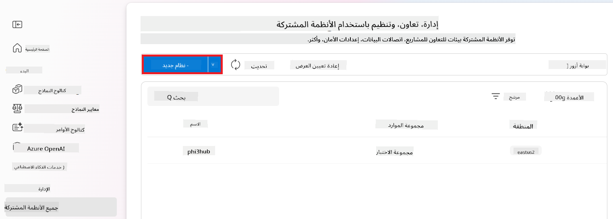

1. قم بتنفيذ المهام التالية:

    - أدخل **اسم المركز**. يجب أن يكون قيمة فريدة.
    - اختر **الاشتراك** الخاص بك في Azure.
    - اختر **مجموعة الموارد** التي تريد استخدامها (قم بإنشاء واحدة جديدة إذا لزم الأمر).
    - اختر **الموقع** الذي ترغب في استخدامه.
    - اختر **اتصال خدمات Azure AI** التي تريد استخدامها (قم بإنشاء واحدة جديدة إذا لزم الأمر).
    - اختر **اتصال Azure AI Search** إلى **تخطي الاتصال**.

    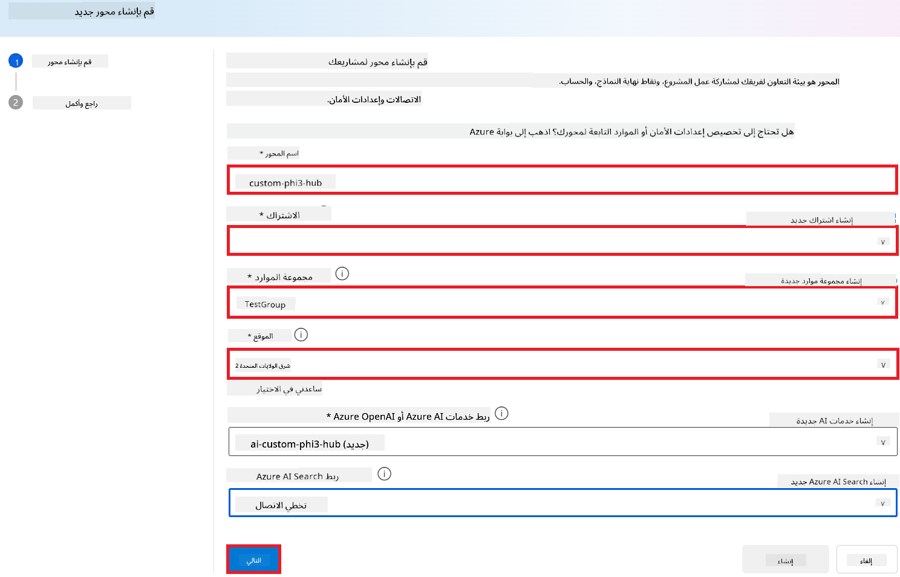

1. اختر **التالي**.

#### إنشاء مشروع Azure AI Foundry

1. في المركز الذي قمت بإنشائه، اختر **جميع المشاريع** من علامة التبويب الجانبية اليسرى.

1. اختر **+ مشروع جديد** من قائمة التنقل.

    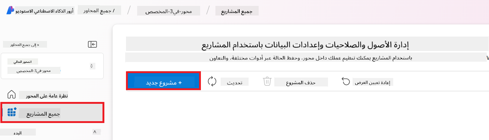

1. أدخل **اسم المشروع**. يجب أن يكون قيمة فريدة.

    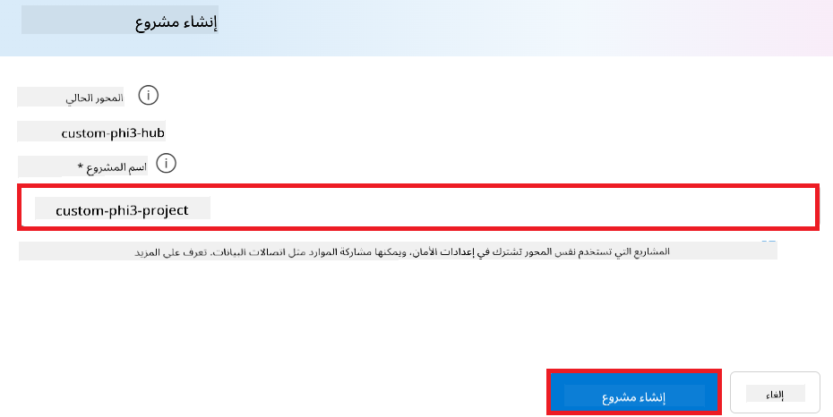

1. اختر **إنشاء مشروع**.

#### إضافة اتصال مخصص للنموذج المضبوط Phi-3

لدمج النموذج المخصص Phi-3 مع Prompt Flow، تحتاج إلى حفظ نقطة النهاية ومفتاح النموذج في اتصال مخصص. يضمن هذا الإعداد الوصول إلى النموذج المخصص Phi-3 في Prompt Flow.

#### إعداد مفتاح API وURI لنقطة النهاية للنموذج المضبوط Phi-3

1. قم بزيارة [Azure ML Studio](https://ml.azure.com/home?WT.mc_id=aiml-137032-kinfeylo).

1. انتقل إلى مساحة العمل الخاصة بـ Azure Machine Learning التي قمت بإنشائها.

1. اختر **النقاط النهائية** من علامة التبويب الجانبية اليسرى.

    

1. اختر نقطة النهاية التي قمت بإنشائها.

    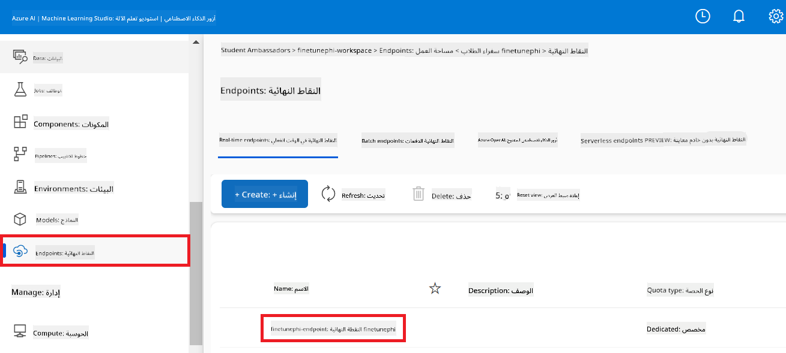

1. اختر **الاستهلاك** من قائمة التنقل.

1. انسخ **نقطة النهاية REST** و **المفتاح الأساسي**.
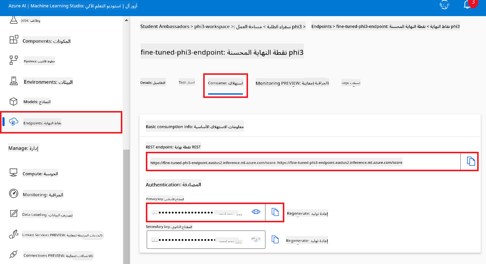

#### إضافة الاتصال المخصص

1. قم بزيارة [Azure AI Foundry](https://ai.azure.com/?WT.mc_id=aiml-137032-kinfeylo).

1. انتقل إلى مشروع Azure AI Foundry الذي أنشأته.

1. في المشروع الذي أنشأته، اختر **الإعدادات** من علامة التبويب الجانبية اليسرى.

1. اختر **+ اتصال جديد**.

    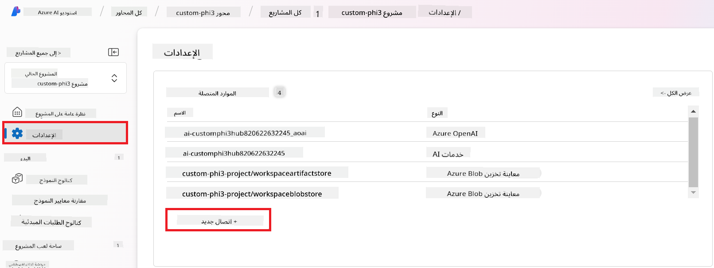

1. اختر **مفاتيح مخصصة** من قائمة التنقل.

    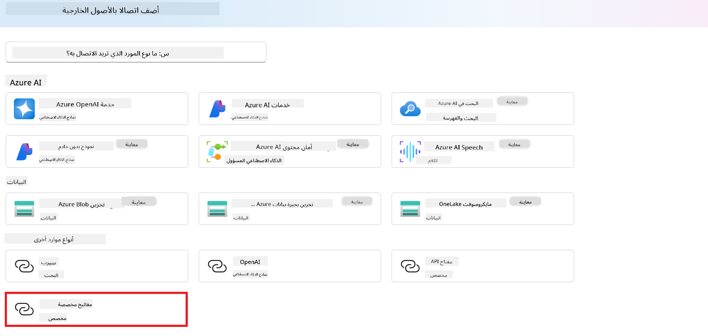

1. قم بتنفيذ المهام التالية:

    - اختر **+ إضافة أزواج مفتاح وقيمة**.
    - بالنسبة لاسم المفتاح، أدخل **endpoint** والصق واجهة النهاية التي نسختها من Azure ML Studio في حقل القيمة.
    - اختر **+ إضافة أزواج مفتاح وقيمة** مرة أخرى.
    - بالنسبة لاسم المفتاح، أدخل **key** والصق المفتاح الذي نسخته من Azure ML Studio في حقل القيمة.
    - بعد إضافة المفاتيح، اختر **is secret** لمنع المفتاح من أن يكون مكشوفًا.

    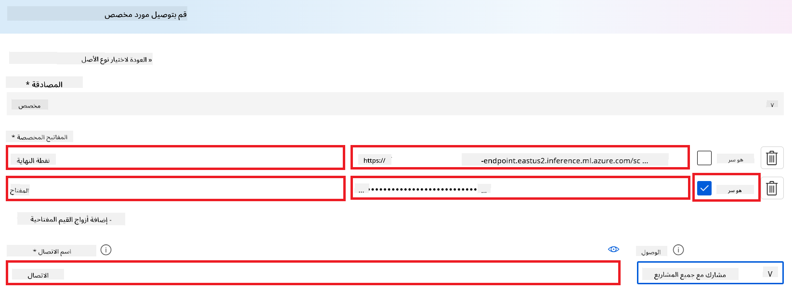

1. اختر **إضافة اتصال**.

#### إنشاء Prompt flow

لقد أضفت اتصالًا مخصصًا في Azure AI Foundry. الآن، لنقم بإنشاء Prompt flow باستخدام الخطوات التالية. بعد ذلك، ستقوم بربط هذا Prompt flow بالاتصال المخصص بحيث يمكنك استخدام النموذج المحسن داخل Prompt flow.

1. انتقل إلى مشروع Azure AI Foundry الذي أنشأته.

1. اختر **Prompt flow** من علامة التبويب الجانبية اليسرى.

1. اختر **+ إنشاء** من قائمة التنقل.

    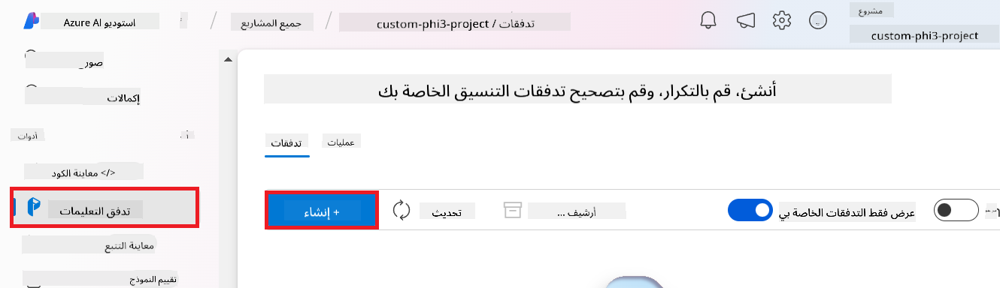

1. اختر **Chat flow** من قائمة التنقل.

    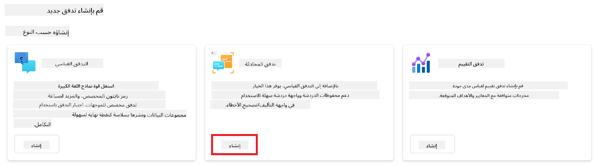

1. أدخل **اسم المجلد** الذي ترغب باستخدامه.

    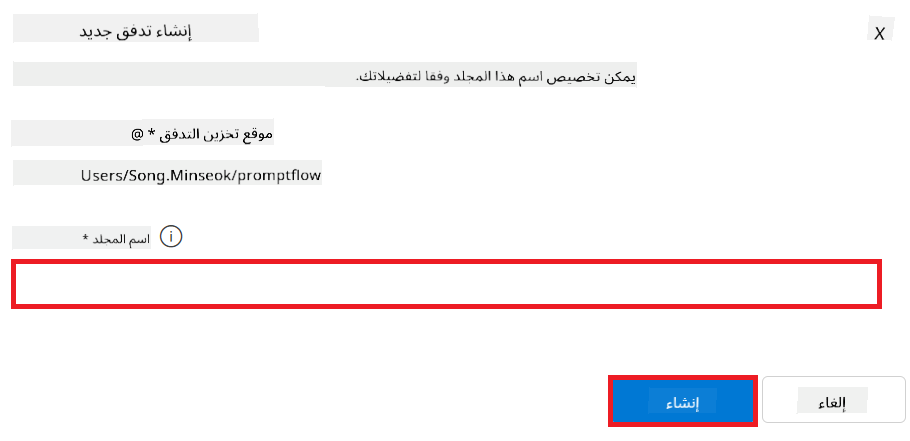

2. اختر **إنشاء**.

#### إعداد Prompt flow للدردشة مع نموذج Phi-3 المخصص

تحتاج إلى دمج نموذج Phi-3 المحسن في Prompt flow. ومع ذلك، فإن Prompt flow الحالي غير مصمم لهذا الغرض. لذلك، يجب إعادة تصميم Prompt flow لتمكين التكامل مع النموذج المخصص.

1. في Prompt flow، قم بتنفيذ المهام التالية لإعادة بناء التدفق الحالي:

    - اختر **وضع الملف الخام**.
    - احذف كل التعليمات البرمجية الموجودة في ملف *flow.dag.yml*.
    - أضف التعليمات البرمجية التالية إلى ملف *flow.dag.yml*.

        ```yml
        inputs:
          input_data:
            type: string
            default: "Who founded Microsoft?"

        outputs:
          answer:
            type: string
            reference: ${integrate_with_promptflow.output}

        nodes:
        - name: integrate_with_promptflow
          type: python
          source:
            type: code
            path: integrate_with_promptflow.py
          inputs:
            input_data: ${inputs.input_data}
        ```

    - اختر **حفظ**.

    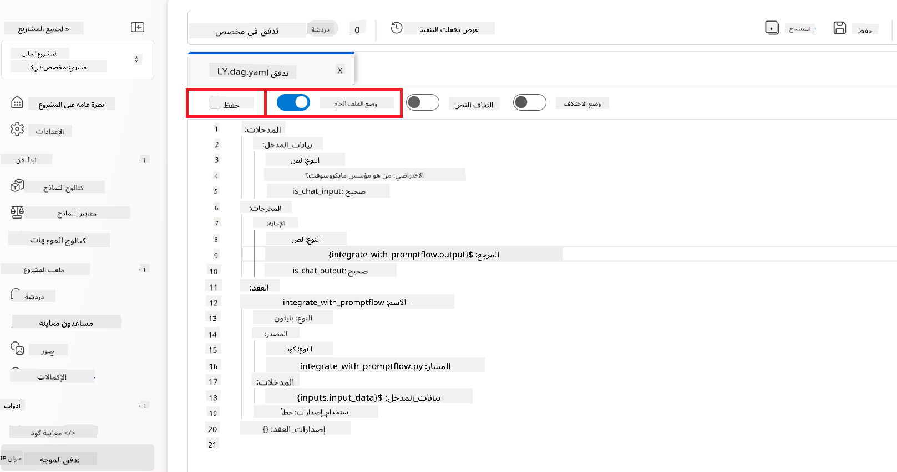

1. أضف التعليمات البرمجية التالية إلى ملف *integrate_with_promptflow.py* لاستخدام نموذج Phi-3 المخصص في Prompt flow.

    ```python
    import logging
    import requests
    from promptflow import tool
    from promptflow.connections import CustomConnection

    # Logging setup
    logging.basicConfig(
        format="%(asctime)s - %(levelname)s - %(name)s - %(message)s",
        datefmt="%Y-%m-%d %H:%M:%S",
        level=logging.DEBUG
    )
    logger = logging.getLogger(__name__)

    def query_phi3_model(input_data: str, connection: CustomConnection) -> str:
        """
        Send a request to the Phi-3 model endpoint with the given input data using Custom Connection.
        """

        # "connection" is the name of the Custom Connection, "endpoint", "key" are the keys in the Custom Connection
        endpoint_url = connection.endpoint
        api_key = connection.key

        headers = {
            "Content-Type": "application/json",
            "Authorization": f"Bearer {api_key}"
        }
        data = {
            "input_data": {
                "input_string": [
                    {"role": "user", "content": input_data}
                ],
                "parameters": {
                    "temperature": 0.7,
                    "max_new_tokens": 128
                }
            }
        }
        try:
            response = requests.post(endpoint_url, json=data, headers=headers)
            response.raise_for_status()
            
            # Log the full JSON response
            logger.debug(f"Full JSON response: {response.json()}")

            result = response.json()["output"]
            logger.info("Successfully received response from Azure ML Endpoint.")
            return result
        except requests.exceptions.RequestException as e:
            logger.error(f"Error querying Azure ML Endpoint: {e}")
            raise

    @tool
    def my_python_tool(input_data: str, connection: CustomConnection) -> str:
        """
        Tool function to process input data and query the Phi-3 model.
        """
        return query_phi3_model(input_data, connection)

    ```

    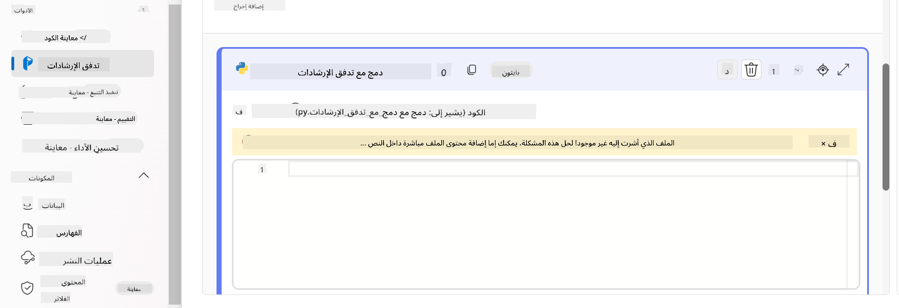

> [!NOTE]
> لمزيد من المعلومات التفصيلية حول استخدام Prompt flow في Azure AI Foundry، يمكنك الرجوع إلى [Prompt flow في Azure AI Foundry](https://learn.microsoft.com/azure/ai-studio/how-to/prompt-flow).

1. اختر **مدخلات الدردشة** و **مخرجات الدردشة** لتمكين الدردشة مع النموذج الخاص بك.

    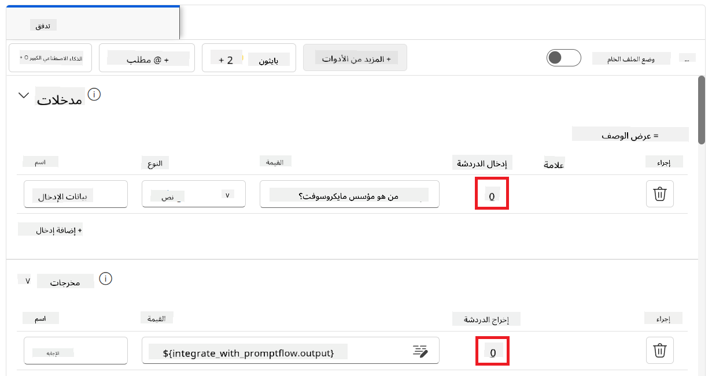

1. الآن أصبحت جاهزًا للدردشة مع نموذج Phi-3 المخصص الخاص بك. في التمرين التالي، ستتعلم كيفية بدء Prompt flow واستخدامه للدردشة مع نموذج Phi-3 المحسن الخاص بك.

> [!NOTE]
>
> يجب أن يبدو التدفق المعاد بناؤه كما في الصورة أدناه:
>
> 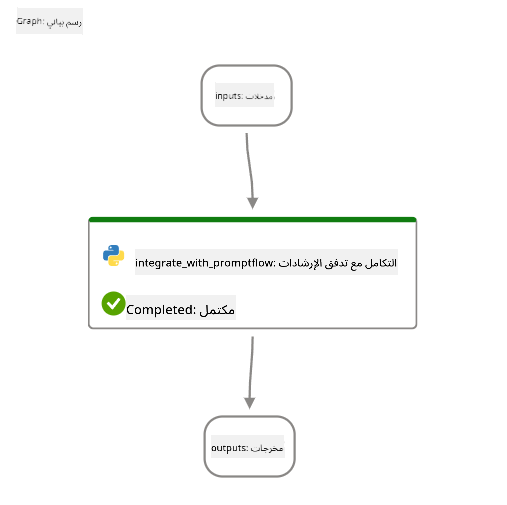
>

### الدردشة مع نموذج Phi-3 المخصص الخاص بك

الآن بعد أن قمت بتحسين ودمج نموذج Phi-3 المخصص الخاص بك مع Prompt flow، أصبحت جاهزًا لبدء التفاعل معه. سيرشدك هذا التمرين خلال عملية إعداد وبدء محادثة مع النموذج الخاص بك باستخدام Prompt flow. باتباع هذه الخطوات، ستتمكن من الاستفادة الكاملة من إمكانيات نموذج Phi-3 المحسن الخاص بك لمهام ومحادثات مختلفة.

- قم بالدردشة مع نموذج Phi-3 المخصص الخاص بك باستخدام Prompt flow.

#### بدء Prompt flow

1. اختر **بدء جلسات الحوسبة** لبدء Prompt flow.

    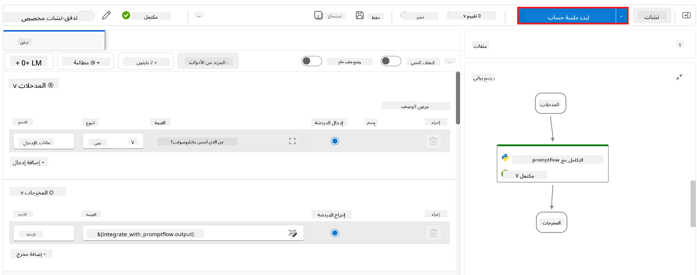

1. اختر **التحقق من صحة المدخلات وتحليلها** لتحديث المعلمات.

    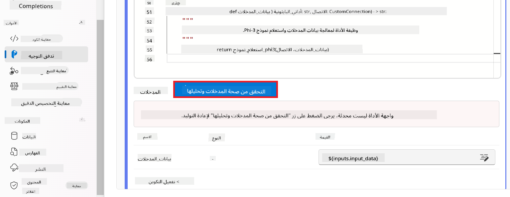

1. اختر **القيمة** الخاصة بـ **الاتصال** للاتصال المخصص الذي أنشأته. على سبيل المثال، *connection*.

    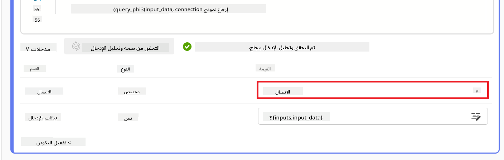

#### الدردشة مع النموذج المخصص الخاص بك

1. اختر **الدردشة**.

    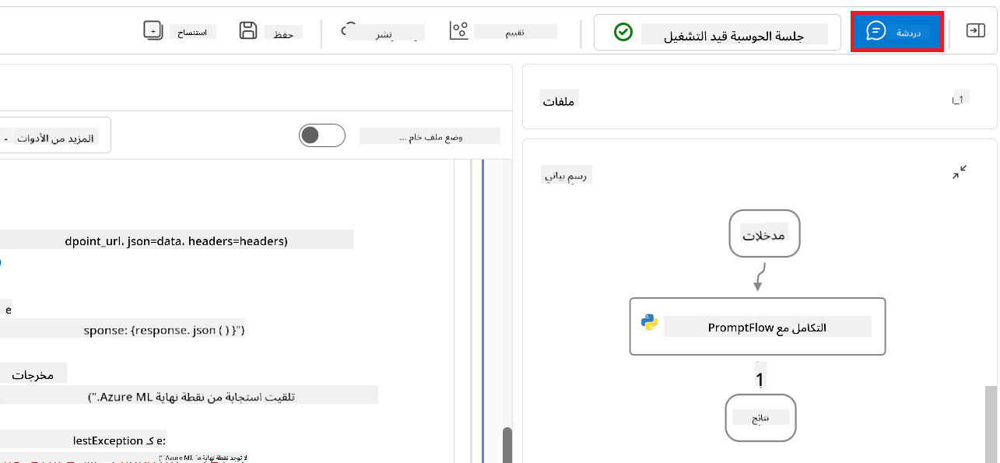

1. إليك مثال على النتائج: الآن يمكنك الدردشة مع نموذج Phi-3 المخصص الخاص بك. يوصى بطرح أسئلة بناءً على البيانات المستخدمة في تحسين النموذج.

    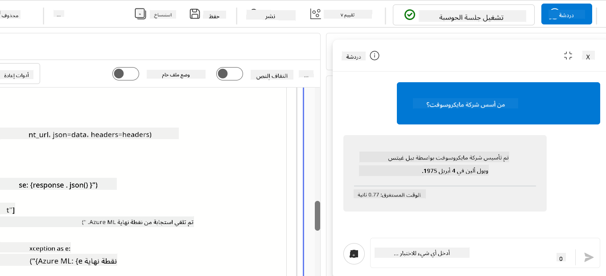

**إخلاء المسؤولية**:  
تم ترجمة هذا المستند باستخدام خدمة الترجمة الآلية [Co-op Translator](https://github.com/Azure/co-op-translator). بينما نسعى لتحقيق الدقة، يرجى العلم أن الترجمات الآلية قد تحتوي على أخطاء أو معلومات غير دقيقة. يجب اعتبار المستند الأصلي بلغته الأصلية المصدر الموثوق. للحصول على معلومات حاسمة، يُوصى بالترجمة البشرية الاحترافية. نحن غير مسؤولين عن أي سوء فهم أو تفسيرات خاطئة ناتجة عن استخدام هذه الترجمة.