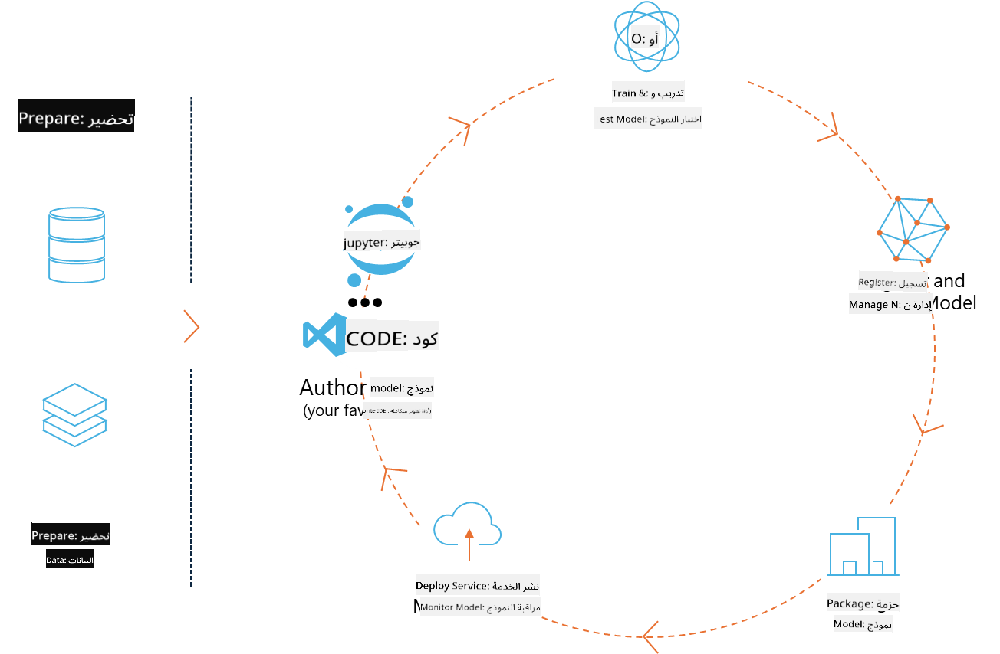
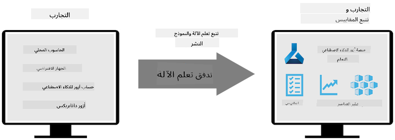
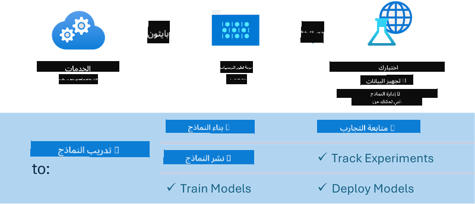

<!--
CO_OP_TRANSLATOR_METADATA:
{
  "original_hash": "f61c383bbf0c3dac97e43f833c258731",
  "translation_date": "2025-03-27T10:54:49+00:00",
  "source_file": "md\\02.Application\\01.TextAndChat\\Phi3\\E2E_Phi-3-MLflow.md",
  "language_code": "ar"
}
-->
# MLflow

[MLflow](https://mlflow.org/) هي منصة مفتوحة المصدر مصممة لإدارة دورة حياة التعلم الآلي من البداية إلى النهاية.



يُستخدم MLFlow لإدارة دورة حياة التعلم الآلي، بما في ذلك التجارب، قابلية التكرار، النشر، وسجل مركزي للنماذج. يوفر MLFlow حاليًا أربعة مكونات:

- **MLflow Tracking:** تسجيل واستعلام عن التجارب، الكود، إعدادات البيانات، والنتائج.
- **MLflow Projects:** تعبئة كود علم البيانات في صيغة تتيح إعادة تشغيله على أي منصة.
- **MLflow Models:** نشر نماذج التعلم الآلي في بيئات تقديم متنوعة.
- **Model Registry:** تخزين، توضيح، وإدارة النماذج في مستودع مركزي.

يتضمن MLFlow ميزات لتتبع التجارب، تعبئة الكود في تشغيلات قابلة للتكرار، ومشاركة ونشر النماذج. تم دمج MLFlow في Databricks ويدعم مجموعة متنوعة من مكتبات التعلم الآلي، مما يجعله مستقلًا عن المكتبة. يمكن استخدامه مع أي مكتبة تعلم آلي وفي أي لغة برمجة، حيث يوفر واجهة REST API وCLI لسهولة الاستخدام.



الميزات الرئيسية لـ MLFlow تشمل:

- **تتبع التجارب:** تسجيل ومقارنة المعلمات والنتائج.
- **إدارة النماذج:** نشر النماذج على منصات تقديم واستدلال متنوعة.
- **سجل النماذج:** إدارة دورة حياة نماذج MLFlow بشكل تعاوني، بما في ذلك الترقيم والتعليقات التوضيحية.
- **المشاريع:** تعبئة كود التعلم الآلي للمشاركة أو الاستخدام الإنتاجي.

يدعم MLFlow أيضًا دورة حياة MLOps، والتي تشمل إعداد البيانات، تسجيل وإدارة النماذج، تعبئة النماذج للتنفيذ، نشر الخدمات، ومراقبة النماذج. يهدف إلى تبسيط عملية الانتقال من النموذج الأولي إلى سير العمل الإنتاجي، خاصة في بيئات السحابة والطرف.

## سيناريو شامل - بناء غلاف واستخدام Phi-3 كنموذج MLFlow

في هذا المثال الشامل، سنوضح طريقتين مختلفتين لبناء غلاف حول نموذج اللغة الصغيرة Phi-3 (SLM) ثم تشغيله كنموذج MLFlow إما محليًا أو في السحابة، مثلًا في مساحة عمل Azure Machine Learning.



| المشروع | الوصف | الموقع |
| ------------ | ----------- | -------- |
| خط أنابيب التحويل | خط أنابيب التحويل هو الخيار الأسهل لبناء غلاف إذا كنت ترغب في استخدام نموذج HuggingFace مع نكهة المحولات التجريبية لـ MLFlow. | [**TransformerPipeline.ipynb**](../../../../../../code/06.E2E/E2E_Phi-3-MLflow_TransformerPipeline.ipynb) |
| غلاف بايثون مخصص | في وقت كتابة هذا النص، لم يكن خط أنابيب التحويل يدعم إنشاء غلاف MLFlow لنماذج HuggingFace بتنسيق ONNX، حتى مع الحزمة التجريبية optimum لـ Python. للحالات مثل هذه، يمكنك بناء غلاف بايثون مخصص لوضع MLFlow | [**CustomPythonWrapper.ipynb**](../../../../../../code/06.E2E/E2E_Phi-3-MLflow_CustomPythonWrapper.ipynb) |

## المشروع: خط أنابيب التحويل

1. ستحتاج إلى حزم Python ذات الصلة من MLFlow وHuggingFace:

    ``` Python
    import mlflow
    import transformers
    ```

2. بعد ذلك، يجب أن تبدأ خط أنابيب التحويل بالإشارة إلى نموذج Phi-3 المستهدف في سجل HuggingFace. كما هو موضح في بطاقة نموذج _Phi-3-mini-4k-instruct_، فإن مهمته من نوع "توليد النص":

    ``` Python
    pipeline = transformers.pipeline(
        task = "text-generation",
        model = "microsoft/Phi-3-mini-4k-instruct"
    )
    ```

3. يمكنك الآن حفظ خط أنابيب التحويل لنموذج Phi-3 في صيغة MLFlow وتوفير تفاصيل إضافية مثل مسار العناصر المستهدفة، إعدادات تكوين النموذج المحددة، ونوع واجهة برمجة التطبيقات للاستدلال:

    ``` Python
    model_info = mlflow.transformers.log_model(
        transformers_model = pipeline,
        artifact_path = "phi3-mlflow-model",
        model_config = model_config,
        task = "llm/v1/chat"
    )
    ```

## المشروع: غلاف بايثون مخصص

1. يمكننا استخدام واجهة [ONNX Runtime generate() API](https://github.com/microsoft/onnxruntime-genai) الخاصة بـ Microsoft لاستدلال النموذج ONNX وترميز/فك ترميز الرموز. عليك اختيار الحزمة _onnxruntime_genai_ للحساب المستهدف، مع المثال أدناه الذي يستهدف وحدة المعالجة المركزية:

    ``` Python
    import mlflow
    from mlflow.models import infer_signature
    import onnxruntime_genai as og
    ```

1. تقوم الفئة المخصصة لدينا بتنفيذ طريقتين: _load_context()_ لتهيئة **نموذج ONNX** لـ Phi-3 Mini 4K Instruct، **معلمات المولد** و**المُرمِّز**؛ و _predict()_ لتوليد رموز الإخراج للموجه المُقدَّم:

    ``` Python
    class Phi3Model(mlflow.pyfunc.PythonModel):
        def load_context(self, context):
            # Retrieving model from the artifacts
            model_path = context.artifacts["phi3-mini-onnx"]
            model_options = {
                 "max_length": 300,
                 "temperature": 0.2,         
            }
        
            # Defining the model
            self.phi3_model = og.Model(model_path)
            self.params = og.GeneratorParams(self.phi3_model)
            self.params.set_search_options(**model_options)
            
            # Defining the tokenizer
            self.tokenizer = og.Tokenizer(self.phi3_model)
    
        def predict(self, context, model_input):
            # Retrieving prompt from the input
            prompt = model_input["prompt"][0]
            self.params.input_ids = self.tokenizer.encode(prompt)
    
            # Generating the model's response
            response = self.phi3_model.generate(self.params)
    
            return self.tokenizer.decode(response[0][len(self.params.input_ids):])
    ```

1. يمكنك الآن استخدام وظيفة _mlflow.pyfunc.log_model()_ لإنشاء غلاف بايثون مخصص (بتنسيق pickle) لنموذج Phi-3، إلى جانب النموذج الأصلي ONNX والاعتماديات المطلوبة:

    ``` Python
    model_info = mlflow.pyfunc.log_model(
        artifact_path = artifact_path,
        python_model = Phi3Model(),
        artifacts = {
            "phi3-mini-onnx": "cpu_and_mobile/cpu-int4-rtn-block-32-acc-level-4",
        },
        input_example = input_example,
        signature = infer_signature(input_example, ["Run"]),
        extra_pip_requirements = ["torch", "onnxruntime_genai", "numpy"],
    )
    ```

## توقيعات نماذج MLFlow المُنشأة

1. في الخطوة 3 من مشروع خط أنابيب التحويل أعلاه، قمنا بتعيين مهمة نموذج MLFlow إلى "_llm/v1/chat_". مثل هذا التوجيه يُنشئ غلاف API للنموذج، متوافق مع واجهة برمجة التطبيقات للدردشة الخاصة بـ OpenAI كما هو موضح أدناه:

    ``` Python
    {inputs: 
      ['messages': Array({content: string (required), name: string (optional), role: string (required)}) (required), 'temperature': double (optional), 'max_tokens': long (optional), 'stop': Array(string) (optional), 'n': long (optional), 'stream': boolean (optional)],
    outputs: 
      ['id': string (required), 'object': string (required), 'created': long (required), 'model': string (required), 'choices': Array({finish_reason: string (required), index: long (required), message: {content: string (required), name: string (optional), role: string (required)} (required)}) (required), 'usage': {completion_tokens: long (required), prompt_tokens: long (required), total_tokens: long (required)} (required)],
    params: 
      None}
    ```

1. كنتيجة لذلك، يمكنك تقديم الموجه الخاص بك بالتنسيق التالي:

    ``` Python
    messages = [{"role": "user", "content": "What is the capital of Spain?"}]
    ```

1. ثم، استخدم معالجة ما بعد متوافقة مع واجهة برمجة التطبيقات لـ OpenAI، مثل _response[0][‘choices’][0][‘message’][‘content’]_، لتحسين الإخراج إلى شيء مثل هذا:

    ``` JSON
    Question: What is the capital of Spain?
    
    Answer: The capital of Spain is Madrid. It is the largest city in Spain and serves as the political, economic, and cultural center of the country. Madrid is located in the center of the Iberian Peninsula and is known for its rich history, art, and architecture, including the Royal Palace, the Prado Museum, and the Plaza Mayor.
    
    Usage: {'prompt_tokens': 11, 'completion_tokens': 73, 'total_tokens': 84}
    ```

1. في الخطوة 3 من مشروع غلاف بايثون المخصص أعلاه، نسمح لحزمة MLFlow بتوليد توقيع النموذج من مثال الإدخال المُقدَّم. توقيع غلاف MLFlow الخاص بنا سيبدو هكذا:

    ``` Python
    {inputs: 
      ['prompt': string (required)],
    outputs: 
      [string (required)],
    params: 
      None}
    ```

1. لذلك، يجب أن يحتوي الموجه الخاص بنا على مفتاح "prompt" في القاموس، مشابه لهذا:

    ``` Python
    {"prompt": "<|system|>You are a stand-up comedian.<|end|><|user|>Tell me a joke about atom<|end|><|assistant|>",}
    ```

1. سيتم توفير إخراج النموذج بعد ذلك بتنسيق نصي:

    ``` JSON
    Alright, here's a little atom-related joke for you!
    
    Why don't electrons ever play hide and seek with protons?
    
    Because good luck finding them when they're always "sharing" their electrons!
    
    Remember, this is all in good fun, and we're just having a little atomic-level humor!
    ```

**إخلاء المسؤولية**:  
تم ترجمة هذا المستند باستخدام خدمة الترجمة بالذكاء الاصطناعي [Co-op Translator](https://github.com/Azure/co-op-translator). بينما نسعى لتحقيق الدقة، يرجى العلم أن الترجمات الآلية قد تحتوي على أخطاء أو عدم دقة. يجب اعتبار المستند الأصلي بلغته الأصلية هو المصدر الموثوق. للحصول على معلومات حاسمة، يُوصى بالاستعانة بترجمة بشرية احترافية. نحن غير مسؤولين عن أي سوء فهم أو تفسيرات خاطئة ناتجة عن استخدام هذه الترجمة.