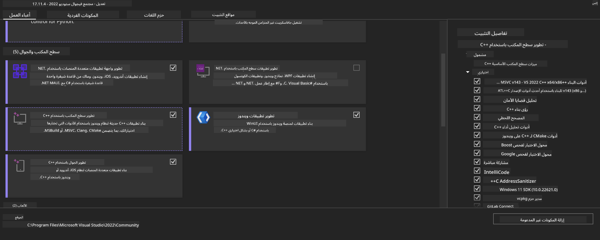
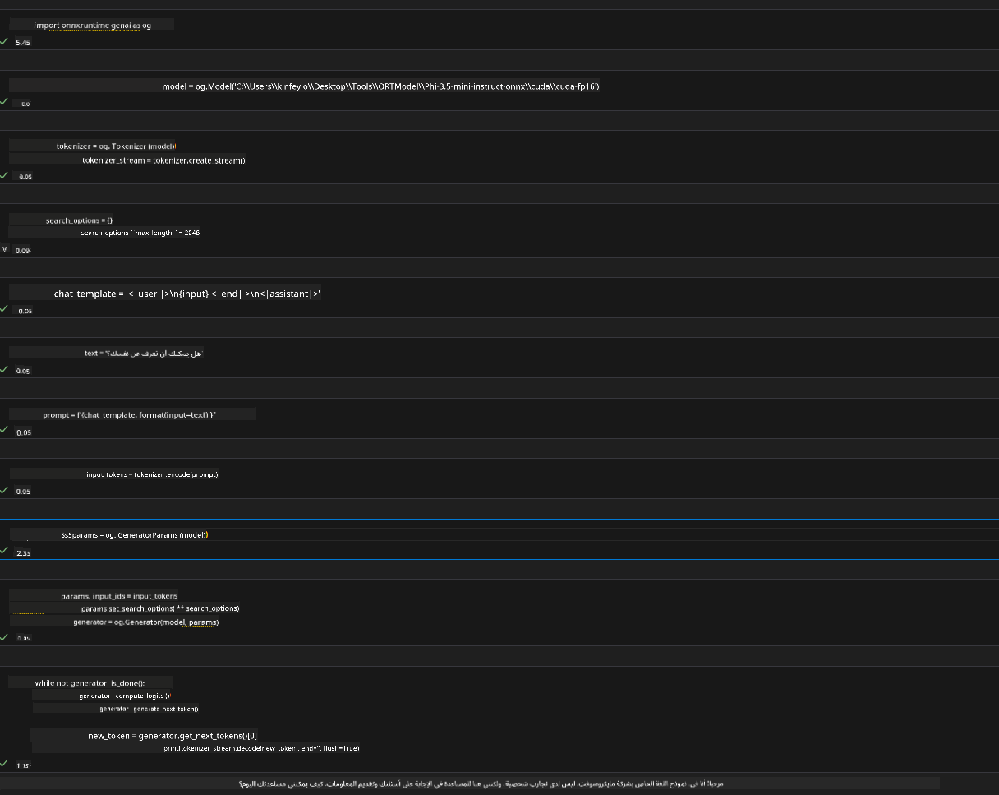
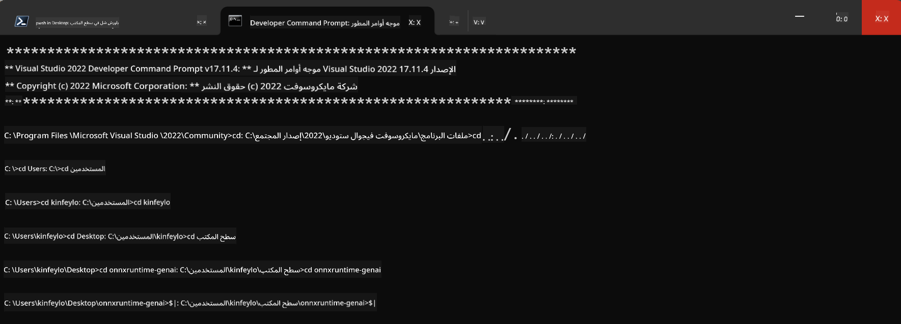

<!--
CO_OP_TRANSLATOR_METADATA:
{
  "original_hash": "b066fc29c1b2129df84e027cb75119ce",
  "translation_date": "2025-03-27T11:00:56+00:00",
  "source_file": "md\\02.Application\\01.TextAndChat\\Phi3\\ORTWindowGPUGuideline.md",
  "language_code": "ar"
}
-->
# **دليل OnnxRuntime GenAI لنظام Windows مع GPU**

يوفر هذا الدليل خطوات إعداد واستخدام ONNX Runtime (ORT) مع وحدات معالجة الرسومات (GPU) على نظام Windows. يهدف إلى مساعدتك في الاستفادة من تسريع GPU لنماذجك، مما يحسن الأداء والكفاءة.

يتناول هذا المستند الإرشادات حول:

- إعداد البيئة: تعليمات لتثبيت التبعيات اللازمة مثل CUDA وcuDNN وONNX Runtime.
- التهيئة: كيفية تهيئة البيئة وONNX Runtime لاستخدام موارد GPU بشكل فعال.
- نصائح تحسين الأداء: نصائح حول كيفية ضبط إعدادات GPU لتحقيق الأداء الأمثل.

### **1. Python 3.10.x /3.11.8**

   ***ملاحظة*** يُنصح باستخدام [miniforge](https://github.com/conda-forge/miniforge/releases/latest/download/Miniforge3-Windows-x86_64.exe) كبيئة Python الخاصة بك.

   ```bash

   conda create -n pydev python==3.11.8

   conda activate pydev

   ```

   ***تذكير*** إذا قمت بتثبيت أي مكتبة ONNX خاصة بـ Python، يُرجى إزالتها.

### **2. تثبيت CMake باستخدام winget**

   ```bash

   winget install -e --id Kitware.CMake

   ```

### **3. تثبيت Visual Studio 2022 - تطوير سطح المكتب باستخدام C++**

   ***ملاحظة*** إذا كنت لا ترغب في التجميع، يمكنك تخطي هذه الخطوة.



### **4. تثبيت برنامج تشغيل NVIDIA**

1. **برنامج تشغيل NVIDIA GPU** [https://www.nvidia.com/en-us/drivers/](https://www.nvidia.com/en-us/drivers/)

2. **NVIDIA CUDA 12.4** [https://developer.nvidia.com/cuda-12-4-0-download-archive](https://developer.nvidia.com/cuda-12-4-0-download-archive)

3. **NVIDIA CUDNN 9.4** [https://developer.nvidia.com/cudnn-downloads](https://developer.nvidia.com/cudnn-downloads)

***تذكير*** يُرجى استخدام الإعدادات الافتراضية أثناء عملية التثبيت.

### **5. إعداد بيئة NVIDIA**

انسخ ملفات lib, bin, include الخاصة بـ NVIDIA CUDNN 9.4 إلى lib, bin, include الخاصة بـ NVIDIA CUDA 12.4.

- انسخ ملفات *'C:\Program Files\NVIDIA\CUDNN\v9.4\bin\12.6'* إلى *'C:\Program Files\NVIDIA GPU Computing Toolkit\CUDA\v12.4\bin'*.

- انسخ ملفات *'C:\Program Files\NVIDIA\CUDNN\v9.4\include\12.6'* إلى *'C:\Program Files\NVIDIA GPU Computing Toolkit\CUDA\v12.4\include'*.

- انسخ ملفات *'C:\Program Files\NVIDIA\CUDNN\v9.4\lib\12.6'* إلى *'C:\Program Files\NVIDIA GPU Computing Toolkit\CUDA\v12.4\lib\x64'*.

### **6. تحميل Phi-3.5-mini-instruct-onnx**

   ```bash

   winget install -e --id Git.Git

   winget install -e --id GitHub.GitLFS

   git lfs install

   git clone https://huggingface.co/microsoft/Phi-3.5-mini-instruct-onnx

   ```

### **7. تشغيل InferencePhi35Instruct.ipynb**

   افتح [Notebook](../../../../../../code/09.UpdateSamples/Aug/ortgpu-phi35-instruct.ipynb) وقم بتنفيذه.



### **8. تجميع ORT GenAI GPU**

   ***ملاحظة***

   1. يُرجى إزالة جميع المكتبات المتعلقة بـ onnx وonnxruntime وonnxruntime-genai أولاً.

   ```bash

   pip list 
   
   ```

   ثم قم بإزالة جميع مكتبات onnxruntime مثل:

   ```bash

   pip uninstall onnxruntime

   pip uninstall onnxruntime-genai

   pip uninstall onnxruntume-genai-cuda
   
   ```

   2. تحقق من دعم ملحقات Visual Studio.

   تحقق من وجود المسار التالي:  
   C:\Program Files\NVIDIA GPU Computing Toolkit\CUDA\v12.4\extras  
   وتأكد من العثور على:  
   C:\Program Files\NVIDIA GPU Computing Toolkit\CUDA\v12.4\extras\visual_studio_integration.  

   إذا لم يتم العثور عليه، تحقق من المجلدات الأخرى الخاصة بـ Cuda toolkit وقم بنسخ مجلد visual_studio_integration ومحتوياته إلى:  
   C:\Program Files\NVIDIA GPU Computing Toolkit\CUDA\v12.4\extras\visual_studio_integration.

   - إذا كنت لا ترغب في التجميع، يمكنك تخطي هذه الخطوة.

   ```bash

   git clone https://github.com/microsoft/onnxruntime-genai

   ```

   - قم بتنزيل [https://github.com/microsoft/onnxruntime/releases/download/v1.19.2/onnxruntime-win-x64-gpu-1.19.2.zip](https://github.com/microsoft/onnxruntime/releases/download/v1.19.2/onnxruntime-win-x64-gpu-1.19.2.zip).

   - فك ضغط الملف onnxruntime-win-x64-gpu-1.19.2.zip، وأعد تسميته إلى **ort**، ثم انسخ مجلد ort إلى onnxruntime-genai.

   - باستخدام Windows Terminal، انتقل إلى Developer Command Prompt for VS 2022 وانتقل إلى onnxruntime-genai.



   - قم بتجميعه باستخدام بيئة Python الخاصة بك.

   ```bash

   cd onnxruntime-genai

   python build.py --use_cuda  --cuda_home "C:\Program Files\NVIDIA GPU Computing Toolkit\CUDA\v12.4" --config Release
 

   cd build/Windows/Release/Wheel

   pip install .whl

   ```

**إخلاء المسؤولية**:  
تمت ترجمة هذا المستند باستخدام خدمة الترجمة بالذكاء الاصطناعي [Co-op Translator](https://github.com/Azure/co-op-translator). بينما نسعى لتحقيق الدقة، يرجى العلم بأن الترجمات الآلية قد تحتوي على أخطاء أو عدم دقة. يجب اعتبار المستند الأصلي بلغته الأصلية هو المصدر الرسمي. للحصول على معلومات حساسة، يُوصى بالترجمة البشرية الاحترافية. نحن غير مسؤولين عن أي سوء فهم أو تفسيرات خاطئة تنشأ عن استخدام هذه الترجمة.