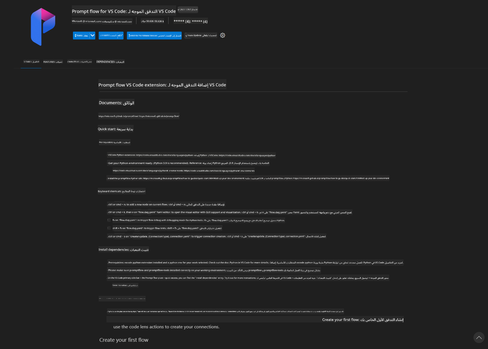
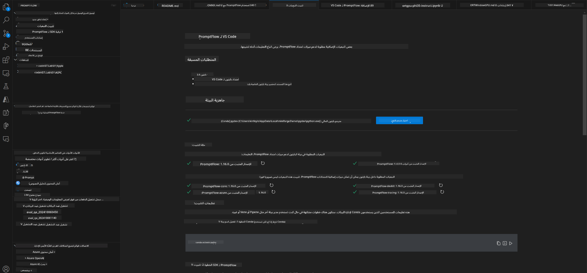
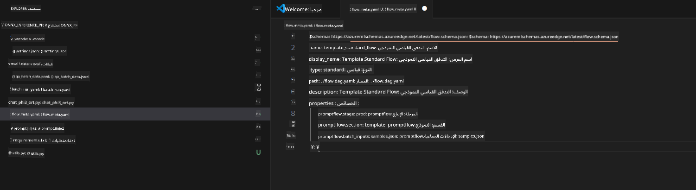
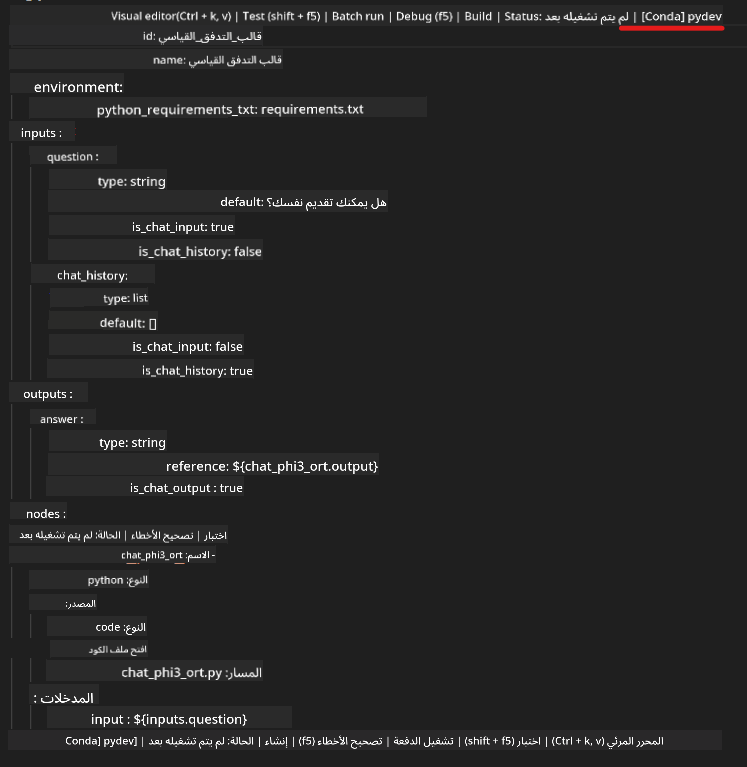
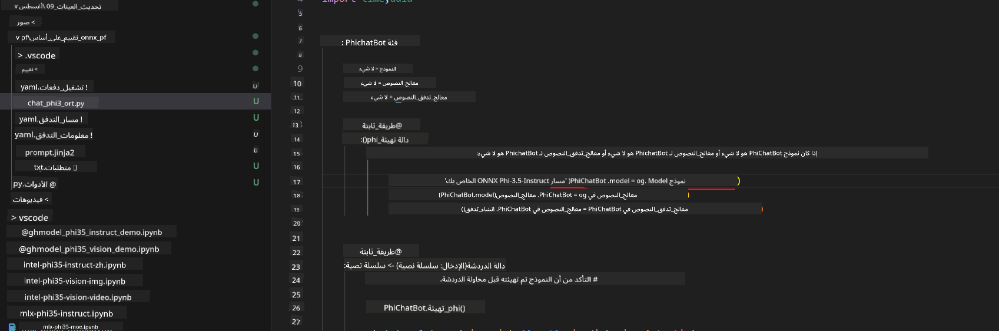
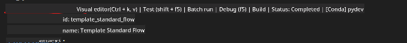
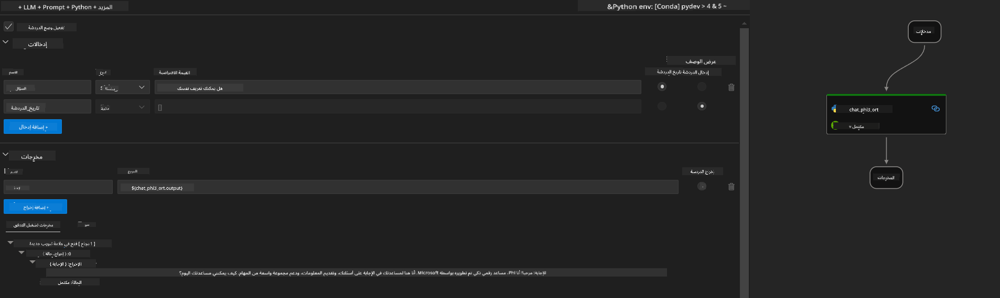
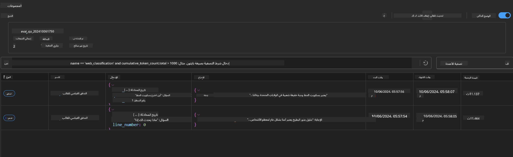

<!--
CO_OP_TRANSLATOR_METADATA:
{
  "original_hash": "92e7dac1e5af0dd7c94170fdaf6860fe",
  "translation_date": "2025-03-27T11:13:18+00:00",
  "source_file": "md\\02.Application\\01.TextAndChat\\Phi3\\UsingPromptFlowWithONNX.md",
  "language_code": "ar"
}
-->
# استخدام وحدة معالجة الرسومات في Windows لإنشاء حل Prompt Flow باستخدام Phi-3.5-Instruct ONNX

الوثيقة التالية هي مثال على كيفية استخدام PromptFlow مع ONNX (Open Neural Network Exchange) لتطوير تطبيقات الذكاء الاصطناعي المعتمدة على نماذج Phi-3.

PromptFlow هو مجموعة من الأدوات المصممة لتبسيط دورة التطوير الشاملة لتطبيقات الذكاء الاصطناعي المعتمدة على النماذج اللغوية الكبيرة (LLM)، بدءًا من توليد الأفكار والنماذج الأولية وصولاً إلى الاختبار والتقييم.

من خلال دمج PromptFlow مع ONNX، يمكن للمطورين:

- تحسين أداء النماذج: الاستفادة من ONNX للحصول على استدلال ونشر فعال للنماذج.
- تبسيط عملية التطوير: استخدام PromptFlow لإدارة سير العمل وأتمتة المهام المتكررة.
- تعزيز التعاون: تسهيل التعاون بين أعضاء الفريق من خلال توفير بيئة تطوير موحدة.

**Prompt Flow** هو مجموعة من الأدوات المصممة لتبسيط دورة التطوير الشاملة لتطبيقات الذكاء الاصطناعي المعتمدة على النماذج اللغوية الكبيرة، بدءًا من توليد الأفكار والنماذج الأولية، إلى الاختبار والتقييم، وصولاً إلى النشر في بيئة الإنتاج والمراقبة. يجعل هندسة المحادثات أسهل بكثير ويتيح لك بناء تطبيقات LLM بجودة الإنتاج.

يمكن لـ Prompt Flow الاتصال بـ OpenAI، وAzure OpenAI Service، والنماذج القابلة للتخصيص (مثل Huggingface، أو LLM/SLM المحلية). نأمل في نشر نموذج Phi-3.5 ONNX المضغوط للتطبيقات المحلية. يمكن لـ Prompt Flow مساعدتنا في التخطيط بشكل أفضل لأعمالنا وإكمال الحلول المحلية المعتمدة على Phi-3.5. في هذا المثال، سنقوم بدمج مكتبة ONNX Runtime GenAI لإكمال حل Prompt Flow المعتمد على وحدة معالجة الرسومات في Windows.

## **التثبيت**

### **ONNX Runtime GenAI لوحدة معالجة الرسومات في Windows**

اقرأ هذا الدليل لإعداد ONNX Runtime GenAI لوحدة معالجة الرسومات في Windows [اضغط هنا](./ORTWindowGPUGuideline.md)

### **إعداد Prompt Flow في VSCode**

1. قم بتثبيت إضافة Prompt Flow لـ VS Code



2. بعد تثبيت إضافة Prompt Flow لـ VS Code، اضغط على الإضافة، واختر **Installation dependencies** واتبع هذا الدليل لتثبيت Prompt Flow SDK في بيئتك



3. قم بتحميل [الشفرة النموذجية](../../../../../../code/09.UpdateSamples/Aug/pf/onnx_inference_pf) واستخدم VS Code لفتح هذا النموذج



4. افتح **flow.dag.yaml** لاختيار بيئة Python الخاصة بك



   افتح **chat_phi3_ort.py** لتغيير موقع نموذج Phi-3.5-instruct ONNX الخاص بك



5. قم بتشغيل Prompt Flow الخاص بك لاختباره

افتح **flow.dag.yaml** واضغط على المحرر المرئي



بعد الضغط عليه، قم بتشغيله للاختبار



1. يمكنك تشغيل دفعات في الطرفية للتحقق من المزيد من النتائج

```bash

pf run create --file batch_run.yaml --stream --name 'Your eval qa name'    

```

يمكنك التحقق من النتائج في متصفحك الافتراضي



**إخلاء المسؤولية**:  
تم ترجمة هذا المستند باستخدام خدمة ترجمة الذكاء الاصطناعي [Co-op Translator](https://github.com/Azure/co-op-translator). بينما نسعى لتحقيق الدقة، يرجى العلم أن الترجمات الآلية قد تحتوي على أخطاء أو معلومات غير دقيقة. يجب اعتبار المستند الأصلي بلغته الأصلية المصدر الرسمي والموثوق. للحصول على معلومات حاسمة، يُوصى بالاستعانة بترجمة بشرية احترافية. نحن غير مسؤولين عن أي سوء فهم أو تفسير خاطئ ينشأ عن استخدام هذه الترجمة.