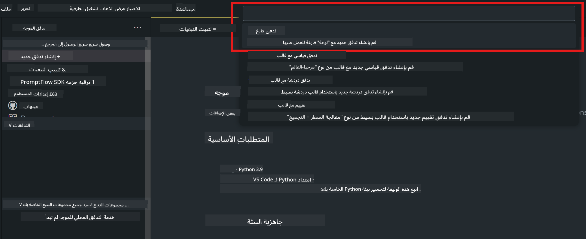
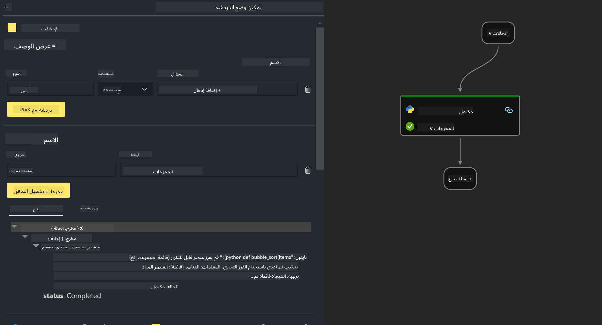

<!--
CO_OP_TRANSLATOR_METADATA:
{
  "original_hash": "bc29f7fe7fc16bed6932733eac8c81b8",
  "translation_date": "2025-03-27T11:56:20+00:00",
  "source_file": "md\\02.Application\\02.Code\\Phi3\\VSCodeExt\\HOL\\AIPC\\02.PromptflowWithNPU.md",
  "language_code": "ar"
}
-->
# **المختبر 2 - تشغيل Prompt flow باستخدام Phi-3-mini في AIPC**

## **ما هو Prompt flow**

Prompt flow هو مجموعة من أدوات التطوير المصممة لتسهيل دورة التطوير الكاملة لتطبيقات الذكاء الاصطناعي المعتمدة على النماذج اللغوية الكبيرة (LLM)، بدءًا من التصور، النمذجة الأولية، الاختبار، التقييم وصولاً إلى النشر الإنتاجي والمراقبة. يجعل هندسة التعليمات أسهل بكثير ويسمح لك ببناء تطبيقات LLM بجودة إنتاجية.

مع Prompt flow، ستكون قادرًا على:

- إنشاء تدفقات تربط بين نماذج LLM، التعليمات، كود Python وأدوات أخرى في سير عمل قابل للتنفيذ.

- تصحيح الأخطاء وتحسين تدفقاتك، خصوصًا التفاعل مع نماذج LLM بسهولة.

- تقييم تدفقاتك، حساب جودة وأداء النماذج باستخدام مجموعات بيانات كبيرة.

- دمج الاختبار والتقييم في نظام CI/CD لضمان جودة التدفق الخاص بك.

- نشر تدفقاتك على منصة الخدمة التي تختارها أو دمجها بسهولة في قاعدة كود التطبيق الخاص بك.

- (اختياري ولكن موصى به بشدة) التعاون مع فريقك باستخدام النسخة السحابية من Prompt flow في Azure AI.

## **ما هو AIPC**

الكمبيوتر المدعوم بالذكاء الاصطناعي يحتوي على وحدة معالجة مركزية (CPU)، وحدة معالجة الرسومات (GPU)، ووحدة معالجة عصبية (NPU)، كل منها يتمتع بقدرات تسريع محددة للذكاء الاصطناعي. وحدة المعالجة العصبية (NPU) هي مسرّع متخصص يتعامل مع مهام الذكاء الاصطناعي (AI) وتعلم الآلة (ML) مباشرة على جهاز الكمبيوتر الخاص بك بدلاً من إرسال البيانات للمعالجة في السحابة. يمكن لوحدة المعالجة المركزية ووحدة معالجة الرسومات أيضًا معالجة هذه الأحمال، لكن وحدة المعالجة العصبية تتميز بالكفاءة في الحسابات منخفضة الطاقة للذكاء الاصطناعي. الكمبيوتر المدعوم بالذكاء الاصطناعي يمثل تحولًا جذريًا في كيفية عمل أجهزة الكمبيوتر لدينا. ليس حلاً لمشكلة لم تكن موجودة من قبل، بل يعد بتحسين كبير للاستخدامات اليومية لأجهزة الكمبيوتر.

كيف يعمل؟ مقارنة بالذكاء الاصطناعي التوليدي والنماذج اللغوية الكبيرة المدربة على كميات ضخمة من البيانات العامة، الذكاء الاصطناعي الذي سيتم تشغيله على جهاز الكمبيوتر الخاص بك أكثر سهولة على كافة المستويات تقريبًا. المفهوم أسهل للفهم، وبما أنه يتم تدريبه على بياناتك دون الحاجة للوصول إلى السحابة، فإن الفوائد تصبح أكثر جاذبية لشريحة أوسع من الناس.

على المدى القريب، عالم الكمبيوتر المدعوم بالذكاء الاصطناعي يتضمن مساعدين شخصيين ونماذج ذكاء اصطناعي صغيرة تعمل مباشرة على جهاز الكمبيوتر الخاص بك، باستخدام بياناتك لتقديم تحسينات ذكاء اصطناعي شخصية، خاصة، وأكثر أمانًا للأشياء التي تقوم بها بالفعل يوميًا – مثل تدوين ملاحظات الاجتماعات، تنظيم دوري كرة القدم الخيالي، أتمتة تحسينات تحرير الصور والفيديو، أو تخطيط برنامج مثالي لاجتماع عائلي بناءً على أوقات وصول ومغادرة الجميع.

## **بناء تدفقات كود الجيل على AIPC**

***ملاحظة***: إذا لم تكمل تثبيت البيئة، يرجى زيارة [المختبر 0 - التثبيتات](./01.Installations.md)

1. افتح ملحق Prompt flow في Visual Studio Code وقم بإنشاء مشروع تدفق فارغ.



2. أضف مدخلات ومخرجات كمعلمات وأضف كود Python كتدفق جديد.



يمكنك الرجوع إلى هذا الهيكل (flow.dag.yaml) لبناء تدفقك.

```yaml

inputs:
  question:
    type: string
    default: how to write Bubble Algorithm
outputs:
  answer:
    type: string
    reference: ${Chat_With_Phi3.output}
nodes:
- name: Chat_With_Phi3
  type: python
  source:
    type: code
    path: Chat_With_Phi3.py
  inputs:
    question: ${inputs.question}


```

3. أضف الكود في ***Chat_With_Phi3.py***

```python


from promptflow.core import tool

# import torch
from transformers import AutoTokenizer, pipeline,TextStreamer
import intel_npu_acceleration_library as npu_lib

import warnings

import asyncio
import platform

class Phi3CodeAgent:
    
    model = None
    tokenizer = None
    text_streamer = None
    
    model_id = "microsoft/Phi-3-mini-4k-instruct"

    @staticmethod
    def init_phi3():
        
        if Phi3CodeAgent.model is None or Phi3CodeAgent.tokenizer is None or Phi3CodeAgent.text_streamer is None:
            Phi3CodeAgent.model = npu_lib.NPUModelForCausalLM.from_pretrained(
                                    Phi3CodeAgent.model_id,
                                    torch_dtype="auto",
                                    dtype=npu_lib.int4,
                                    trust_remote_code=True
                                )
            Phi3CodeAgent.tokenizer = AutoTokenizer.from_pretrained(Phi3CodeAgent.model_id)
            Phi3CodeAgent.text_streamer = TextStreamer(Phi3CodeAgent.tokenizer, skip_prompt=True)

    

    @staticmethod
    def chat_with_phi3(prompt):
        
        Phi3CodeAgent.init_phi3()

        messages = "<|system|>You are a AI Python coding assistant. Please help me to generate code in Python.The answer only genertated Python code, but any comments and instructions do not need to be generated<|end|><|user|>" + prompt +"<|end|><|assistant|>"


        generation_args = {
            "max_new_tokens": 1024,
            "return_full_text": False,
            "temperature": 0.3,
            "do_sample": False,
            "streamer": Phi3CodeAgent.text_streamer,
        }

        pipe = pipeline(
            "text-generation",
            model=Phi3CodeAgent.model,
            tokenizer=Phi3CodeAgent.tokenizer,
            # **generation_args
        )

        result = ''

        with warnings.catch_warnings():
            warnings.simplefilter("ignore")
            response = pipe(messages, **generation_args)
            result =response[0]['generated_text']
            return result


@tool
def my_python_tool(question: str) -> str:
    if platform.system() == 'Windows':
        asyncio.set_event_loop_policy(asyncio.WindowsSelectorEventLoopPolicy())
    return Phi3CodeAgent.chat_with_phi3(question)


```

4. يمكنك اختبار التدفق من خلال Debug أو Run للتحقق مما إذا كان الكود قد تم توليده بشكل صحيح أم لا.


5. قم بتشغيل التدفق كواجهة برمجية للتطوير في الطرفية.

```

pf flow serve --source ./ --port 8080 --host localhost   

```

يمكنك اختباره باستخدام Postman / Thunder Client.

### **ملاحظات**

1. التشغيل الأول يستغرق وقتًا طويلًا. يُوصى بتنزيل نموذج phi-3 من Hugging Face CLI.

2. نظرًا لقدرات الحوسبة المحدودة لوحدة المعالجة العصبية من Intel، يُوصى باستخدام Phi-3-mini-4k-instruct.

3. نحن نستخدم تسريع Intel NPU لتحويل INT4، ولكن إذا قمت بإعادة تشغيل الخدمة، ستحتاج إلى حذف ذاكرة التخزين المؤقت ومجلدات nc_workshop.

## **المصادر**

1. تعلم Promptflow [https://microsoft.github.io/promptflow/](https://microsoft.github.io/promptflow/)

2. تعلم تسريع Intel NPU [https://github.com/intel/intel-npu-acceleration-library](https://github.com/intel/intel-npu-acceleration-library)

3. كود تجريبي، تنزيل [كود وكيل NPU المحلي التجريبي](../../../../../../../../../code/07.Lab/01/AIPC)

**إخلاء المسؤولية**:  
تم ترجمة هذا المستند باستخدام خدمة الترجمة بالذكاء الاصطناعي [Co-op Translator](https://github.com/Azure/co-op-translator). بينما نسعى لتحقيق الدقة، يُرجى العلم أن الترجمات الآلية قد تحتوي على أخطاء أو معلومات غير دقيقة. يجب اعتبار المستند الأصلي بلغته الأصلية المصدر الموثوق. للحصول على معلومات حاسمة، يُوصى باستخدام ترجمة بشرية احترافية. نحن غير مسؤولين عن أي سوء فهم أو تفسيرات خاطئة تنشأ عن استخدام هذه الترجمة.