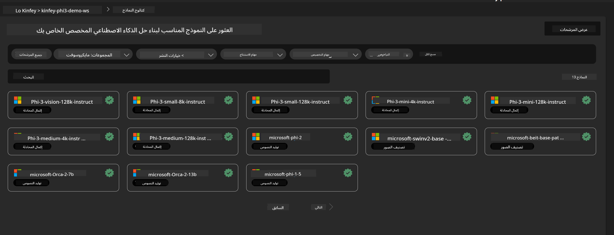
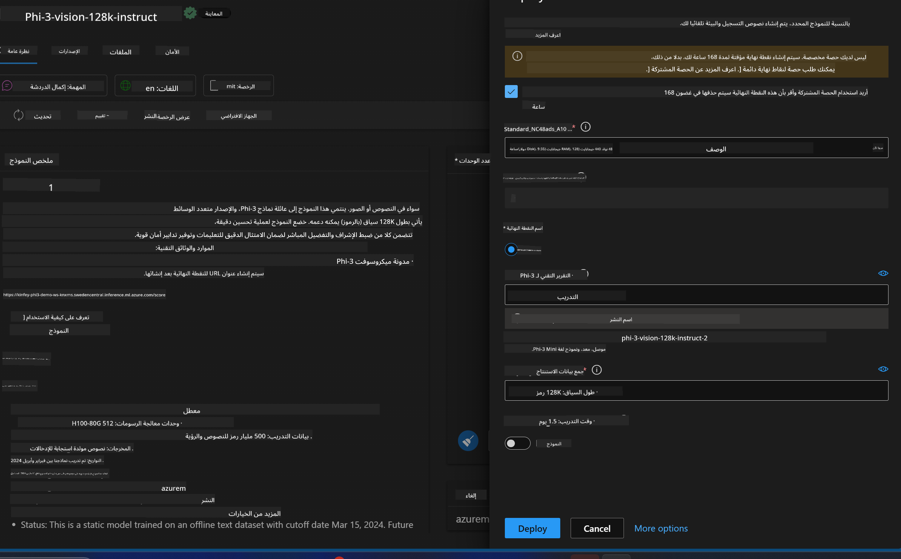
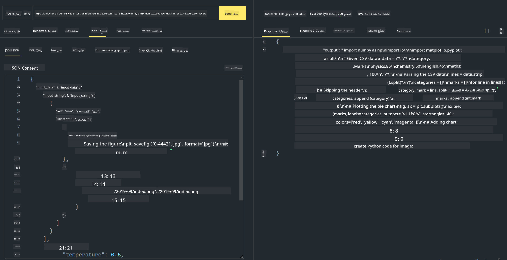

<!--
CO_OP_TRANSLATOR_METADATA:
{
  "original_hash": "20cb4e6ac1686248e8be913ccf6c2bc2",
  "translation_date": "2025-03-27T12:02:29+00:00",
  "source_file": "md\\02.Application\\02.Code\\Phi3\\VSCodeExt\\HOL\\AIPC\\03.DeployPhi3VisionOnAzure.md",
  "language_code": "ar"
}
-->
# **المختبر الثالث - نشر Phi-3-Vision على خدمة Azure Machine Learning**

نستخدم NPU لإكمال نشر الكود المحلي في بيئة الإنتاج، ومن ثم نريد تقديم إمكانية استخدام PHI-3-VISION لتحقيق تحويل الصور إلى كود.

في هذا الشرح، يمكننا بسرعة إنشاء خدمة Phi-3 Vision كنموذج كخدمة (Model As Service) باستخدام خدمة Azure Machine Learning.

***ملاحظة***: يتطلب Phi-3 Vision قدرة حوسبة لتوليد المحتوى بسرعة أكبر. نحتاج إلى قوة الحوسبة السحابية لمساعدتنا في تحقيق ذلك.

### **1. إنشاء خدمة Azure Machine Learning**

نحتاج إلى إنشاء خدمة Azure Machine Learning في بوابة Azure. إذا كنت تريد معرفة الطريقة، يرجى زيارة هذا الرابط [https://learn.microsoft.com/azure/machine-learning/quickstart-create-resources?view=azureml-api-2](https://learn.microsoft.com/azure/machine-learning/quickstart-create-resources?view=azureml-api-2)

### **2. اختيار Phi-3 Vision في خدمة Azure Machine Learning**



### **3. نشر Phi-3-Vision في Azure**



### **4. اختبار نقطة النهاية باستخدام Postman**



***ملاحظة***

1. يجب أن تتضمن المعلمات المُرسلة Authorization و azureml-model-deployment و Content-Type. تحتاج إلى مراجعة معلومات النشر للحصول عليها.

2. لنقل المعلمات، يحتاج Phi-3-Vision إلى إرسال رابط صورة. يرجى الرجوع إلى طريقة GPT-4-Vision لنقل المعلمات، مثل

```json

{
  "input_data":{
    "input_string":[
      {
        "role":"user",
        "content":[ 
          {
            "type": "text",
            "text": "You are a Python coding assistant.Please create Python code for image "
          },
          {
              "type": "image_url",
              "image_url": {
                "url": "https://ajaytech.co/wp-content/uploads/2019/09/index.png"
              }
          }
        ]
      }
    ],
    "parameters":{
          "temperature": 0.6,
          "top_p": 0.9,
          "do_sample": false,
          "max_new_tokens": 2048
    }
  }
}

```

3. استدعاء **/score** باستخدام طريقة Post.

**تهانينا**! لقد أكملت نشر PHI-3-VISION بسرعة وجربت كيفية استخدام الصور لتوليد الكود. الآن يمكننا بناء التطبيقات باستخدام مزيج من NPUs والحوسبة السحابية.

**إخلاء المسؤولية**:  
تم ترجمة هذا المستند باستخدام خدمة الترجمة الآلية [Co-op Translator](https://github.com/Azure/co-op-translator). بينما نسعى لتحقيق الدقة، يُرجى العلم أن الترجمات الآلية قد تحتوي على أخطاء أو معلومات غير دقيقة. يجب اعتبار المستند الأصلي بلغته الأصلية هو المصدر الموثوق. بالنسبة للمعلومات الحرجة، يُوصى بالاستعانة بترجمة بشرية احترافية. نحن غير مسؤولين عن أي سوء فهم أو تفسيرات خاطئة تنشأ عن استخدام هذه الترجمة.