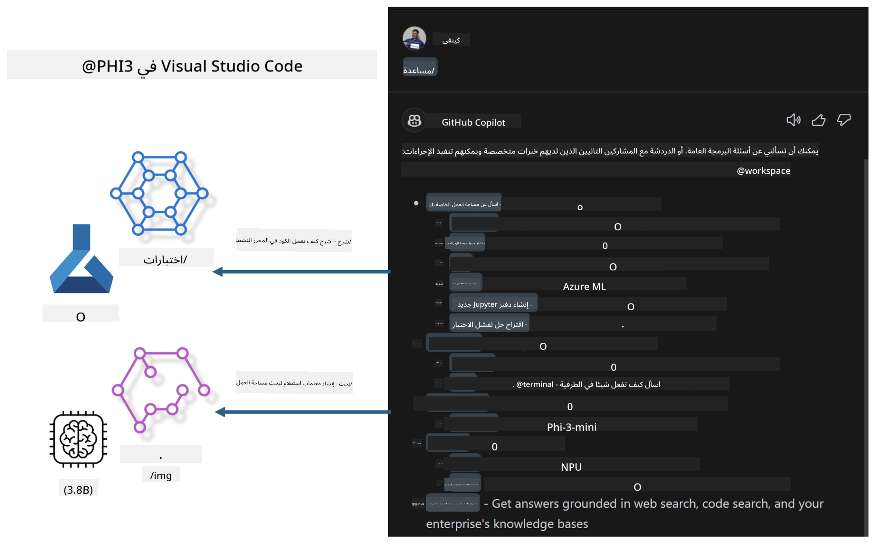

<!--
CO_OP_TRANSLATOR_METADATA:
{
  "original_hash": "00b7a699de8ac405fa821f4c0f7fc0ab",
  "translation_date": "2025-03-27T11:42:01+00:00",
  "source_file": "md\\02.Application\\02.Code\\Phi3\\VSCodeExt\\README.md",
  "language_code": "ar"
}
-->
# **قم ببناء مساعد GitHub Copilot Chat الخاص بك باستخدام عائلة Microsoft Phi-3**

هل استخدمت وكيل مساحة العمل في GitHub Copilot Chat؟ هل ترغب في بناء وكيل كود خاص بفريقك؟ يهدف هذا المختبر العملي إلى دمج النموذج مفتوح المصدر لإنشاء وكيل أعمال برمجي على مستوى المؤسسات.

## **الأساسيات**

### **لماذا تختار Microsoft Phi-3**

Phi-3 هي سلسلة عائلية تتضمن phi-3-mini وphi-3-small وphi-3-medium بناءً على معايير تدريب مختلفة لتوليد النصوص، وإكمال الحوارات، وتوليد الأكواد. كما يوجد phi-3-vision القائم على الرؤية. هذا النموذج مناسب للمؤسسات أو الفرق المختلفة لإنشاء حلول ذكاء اصطناعي توليدي دون اتصال.

ننصح بقراءة هذا الرابط [https://github.com/microsoft/PhiCookBook/blob/main/md/01.Introduction/01/01.PhiFamily.md](https://github.com/microsoft/PhiCookBook/blob/main/md/01.Introduction/01/01.PhiFamily.md)

### **GitHub Copilot Chat من Microsoft**

يمنحك ملحق GitHub Copilot Chat واجهة دردشة تتيح لك التفاعل مع GitHub Copilot وتلقي إجابات على الأسئلة المتعلقة بالبرمجة مباشرة داخل VS Code، دون الحاجة إلى تصفح الوثائق أو البحث في المنتديات عبر الإنترنت.

قد يستخدم Copilot Chat تمييز الصيغة البرمجية، والمحاذاة، وميزات تنسيق أخرى لإضافة وضوح إلى الردود المولدة. اعتمادًا على نوع السؤال من المستخدم، قد تحتوي النتيجة على روابط للسياق الذي استخدمه Copilot لتوليد الرد، مثل ملفات الشيفرة المصدرية أو الوثائق، أو أزرار للوصول إلى وظائف VS Code.

- يندمج Copilot Chat في تدفق عمل المطور ويقدم المساعدة حيثما تحتاجها:

- ابدأ محادثة دردشة مباشرة من المحرر أو الطرفية للحصول على المساعدة أثناء البرمجة

- استخدم عرض الدردشة للحصول على مساعد ذكاء اصطناعي بجانبك في أي وقت

- قم بتشغيل Quick Chat لطرح سؤال سريع والعودة إلى ما كنت تفعله

يمكنك استخدام GitHub Copilot Chat في العديد من السيناريوهات، مثل:

- الإجابة على أسئلة البرمجة حول كيفية حل مشكلة معينة

- شرح كود خاص بشخص آخر واقتراح تحسينات

- اقتراح إصلاحات للكود

- توليد حالات اختبار الوحدة

- إنشاء توثيق الكود

ننصح بقراءة هذا الرابط [https://code.visualstudio.com/docs/copilot/copilot-chat](https://code.visualstudio.com/docs/copilot/copilot-chat?WT.mc_id=aiml-137032-kinfeylo)

### **GitHub Copilot Chat @workspace من Microsoft**

يشير استخدام **@workspace** في Copilot Chat إلى إمكانية طرح أسئلة حول قاعدة الشيفرة بأكملها. بناءً على السؤال، يقوم Copilot باسترجاع الملفات والرموز ذات الصلة بذكاء، ثم يشير إليها في الإجابة كروابط وأمثلة كود.

للإجابة على سؤالك، يقوم **@workspace** بالبحث في نفس المصادر التي يستخدمها المطور عند تصفح قاعدة الشيفرة في VS Code:

- جميع الملفات في مساحة العمل، باستثناء الملفات التي يتم تجاهلها بواسطة ملف .gitignore

- هيكل المجلدات المتداخلة وأسماء الملفات

- فهرس البحث في الشيفرة الخاص بـ GitHub، إذا كانت مساحة العمل مستودعًا على GitHub ومفهرسة بواسطة البحث في الشيفرة

- الرموز والتعريفات في مساحة العمل

- النصوص المحددة حاليًا أو النصوص المرئية في المحرر النشط

ملاحظة: يتم تجاوز .gitignore إذا كان لديك ملف مفتوح أو نص محدد داخل ملف متجاهل.

ننصح بقراءة هذا الرابط [[https://code.visualstudio.com/docs/copilot/copilot-chat](https://code.visualstudio.com/docs/copilot/workspace-context?WT.mc_id=aiml-137032-kinfeylo)]

## **تعرف على المزيد عن هذا المختبر**

لقد حسّن GitHub Copilot بشكل كبير من كفاءة البرمجة في المؤسسات، وكل مؤسسة تأمل في تخصيص الوظائف ذات الصلة بـ GitHub Copilot. العديد من المؤسسات قامت بتخصيص ملحقات مشابهة لـ GitHub Copilot بناءً على سيناريوهات أعمالها والنماذج مفتوحة المصدر. بالنسبة للمؤسسات، فإن الملحقات المخصصة أسهل في التحكم، لكن هذا يؤثر أيضًا على تجربة المستخدم. بعد كل شيء، يتمتع GitHub Copilot بقدرات أقوى في التعامل مع السيناريوهات العامة والمهنية. إذا أمكن الحفاظ على تجربة متسقة، فسيكون من الأفضل تخصيص ملحق خاص بالمؤسسة. يوفر GitHub Copilot Chat واجهات برمجية ذات صلة للمؤسسات للتوسع في تجربة الدردشة. الحفاظ على تجربة متسقة مع إضافة وظائف مخصصة يعزز تجربة المستخدم.

يستخدم هذا المختبر بشكل أساسي نموذج Phi-3 مع الجمع بين NPU المحلي وAzure hybrid لإنشاء وكيل مخصص في GitHub Copilot Chat ***@PHI3*** لمساعدة مطوري المؤسسات على إكمال توليد الأكواد ***(@PHI3 /gen)*** وتوليد الأكواد بناءً على الصور ***(@PHI3 /img)***.

### ***ملاحظة:*** 

تم تنفيذ هذا المختبر حاليًا على AIPC لوحدات المعالجة المركزية Intel وApple Silicon. سنواصل تحديث إصدار Qualcomm من NPU.

## **المختبر**

| الاسم | الوصف | AIPC | Apple |
| ------------ | ----------- | -------- |-------- |
| Lab0 - التثبيتات (✅) | إعداد وتثبيت البيئات والأدوات ذات الصلة | [اذهب](./HOL/AIPC/01.Installations.md) |[اذهب](./HOL/Apple/01.Installations.md) |
| Lab1 - تشغيل Prompt flow مع Phi-3-mini (✅) | باستخدام AIPC / Apple Silicon، وإنشاء توليد الأكواد محليًا عبر Phi-3-mini | [اذهب](./HOL/AIPC/02.PromptflowWithNPU.md) |  [اذهب](./HOL/Apple/02.PromptflowWithMLX.md) |
| Lab2 - نشر Phi-3-vision على خدمة Azure Machine Learning (✅) | توليد الأكواد من خلال نشر نموذج Phi-3-vision على Azure Machine Learning Service | [اذهب](./HOL/AIPC/03.DeployPhi3VisionOnAzure.md) |[اذهب](./HOL/Apple/03.DeployPhi3VisionOnAzure.md) |
| Lab3 - إنشاء وكيل @phi-3 في GitHub Copilot Chat (✅)  | إنشاء وكيل Phi-3 مخصص في GitHub Copilot Chat لإكمال توليد الأكواد، وتوليد الأكواد من الصور، وRAG، وما إلى ذلك | [اذهب](./HOL/AIPC/04.CreatePhi3AgentInVSCode.md) | [اذهب](./HOL/Apple/04.CreatePhi3AgentInVSCode.md) |
| كود عينة (✅)  | تنزيل كود عينة | [اذهب](../../../../../../../code/07.Lab/01/AIPC) | [اذهب](../../../../../../../code/07.Lab/01/Apple) |

## **الموارد**

1. Phi-3 Cookbook [https://github.com/microsoft/Phi-3CookBook](https://github.com/microsoft/Phi-3CookBook)

2. تعرف على المزيد عن GitHub Copilot [https://learn.microsoft.com/training/paths/copilot/](https://learn.microsoft.com/training/paths/copilot/?WT.mc_id=aiml-137032-kinfeylo)

3. تعرف على المزيد عن GitHub Copilot Chat [https://learn.microsoft.com/training/paths/accelerate-app-development-using-github-copilot/](https://learn.microsoft.com/training/paths/accelerate-app-development-using-github-copilot/?WT.mc_id=aiml-137032-kinfeylo)

4. تعرف على المزيد عن واجهة GitHub Copilot Chat API [https://code.visualstudio.com/api/extension-guides/chat](https://code.visualstudio.com/api/extension-guides/chat?WT.mc_id=aiml-137032-kinfeylo)

5. تعرف على المزيد عن Azure AI Foundry [https://learn.microsoft.com/training/paths/create-custom-copilots-ai-studio/](https://learn.microsoft.com/training/paths/create-custom-copilots-ai-studio/?WT.mc_id=aiml-137032-kinfeylo)

6. تعرف على المزيد عن كتالوج النماذج في Azure AI Foundry [https://learn.microsoft.com/azure/ai-studio/how-to/model-catalog-overview](https://learn.microsoft.com/azure/ai-studio/how-to/model-catalog-overview)

**إخلاء المسؤولية**:  
تم ترجمة هذه الوثيقة باستخدام خدمة الترجمة بالذكاء الاصطناعي [Co-op Translator](https://github.com/Azure/co-op-translator). على الرغم من أننا نسعى لتحقيق الدقة، يرجى العلم أن الترجمات الآلية قد تحتوي على أخطاء أو معلومات غير دقيقة. يجب اعتبار الوثيقة الأصلية بلغتها الأصلية المصدر الموثوق. للحصول على معلومات حيوية، يُوصى باستخدام ترجمة بشرية احترافية. نحن غير مسؤولين عن أي سوء فهم أو تفسيرات خاطئة ناتجة عن استخدام هذه الترجمة.