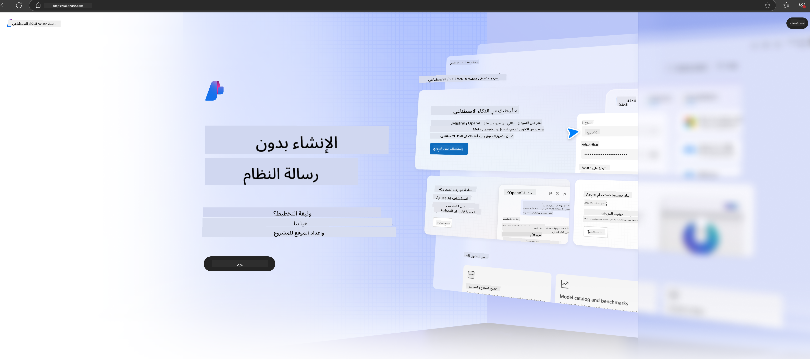

<!--
CO_OP_TRANSLATOR_METADATA:
{
  "original_hash": "3a1e48b628022485aac989c9f733e792",
  "translation_date": "2025-03-27T13:22:21+00:00",
  "source_file": "md\\02.QuickStart\\AzureAIFoundry_QuickStart.md",
  "language_code": "ar"
}
-->
# **استخدام Phi-3 في Azure AI Foundry**

مع تطور الذكاء الاصطناعي التوليدي، نأمل في استخدام منصة موحدة لإدارة النماذج اللغوية الكبيرة (LLM) والنماذج الصغيرة (SLM)، تكامل بيانات المؤسسة، عمليات التخصيص/RAG، وتقييم مختلف الأعمال المؤسسية بعد دمج النماذج اللغوية الكبيرة والصغيرة، وغيرها، بحيث يمكن تنفيذ التطبيقات الذكية للذكاء الاصطناعي التوليدي بشكل أفضل. [Azure AI Foundry](https://ai.azure.com) هي منصة تطبيقات ذكاء اصطناعي توليدي على مستوى المؤسسات.

مع Azure AI Foundry، يمكنك تقييم استجابات النماذج اللغوية الكبيرة (LLM) وتنظيم مكونات التطبيقات باستخدام "تدفق الإرشادات" لتحسين الأداء. تسهّل المنصة التوسع لتحويل إثبات المفاهيم إلى إنتاج كامل بسهولة. يدعم المراقبة المستمرة والتحديث النجاح على المدى الطويل.

يمكننا نشر نموذج Phi-3 بسرعة على Azure AI Foundry من خلال خطوات بسيطة، ثم استخدام Azure AI Foundry لإكمال الأنشطة المتعلقة بـ Phi-3 مثل Playground/Chat، التخصيص، التقييم، وغيرها.

## **1. التحضير**

إذا كان لديك بالفعل [Azure Developer CLI](https://learn.microsoft.com/azure/developer/azure-developer-cli/overview?WT.mc_id=aiml-138114-kinfeylo) مثبتًا على جهازك، فإن استخدام هذا النموذج بسيط بقدر تشغيل هذا الأمر في دليل جديد.

## الإنشاء اليدوي

إن إنشاء مشروع ومحور في Microsoft Azure AI Foundry هو طريقة رائعة لتنظيم وإدارة عملك في مجال الذكاء الاصطناعي. إليك دليل خطوة بخطوة لتبدأ:

### إنشاء مشروع في Azure AI Foundry

1. **اذهب إلى Azure AI Foundry**: قم بتسجيل الدخول إلى بوابة Azure AI Foundry.
2. **إنشاء مشروع**:
   - إذا كنت داخل مشروع، اختر "Azure AI Foundry" في الزاوية العلوية اليسرى من الصفحة للانتقال إلى الصفحة الرئيسية.
   - اختر "+ إنشاء مشروع".
   - أدخل اسمًا للمشروع.
   - إذا كان لديك محور، سيتم اختياره افتراضيًا. إذا كان لديك حق الوصول إلى أكثر من محور، يمكنك اختيار آخر من القائمة المنسدلة. إذا كنت ترغب في إنشاء محور جديد، اختر "إنشاء محور جديد" وقدم اسمًا.
   - اختر "إنشاء".

### إنشاء محور في Azure AI Foundry

1. **اذهب إلى Azure AI Foundry**: قم بتسجيل الدخول باستخدام حساب Azure الخاص بك.
2. **إنشاء محور**:
   - اختر مركز الإدارة من القائمة اليسرى.
   - اختر "كل الموارد"، ثم السهم بجانب "+ مشروع جديد" واختر "+ محور جديد".
   - في نافذة "إنشاء محور جديد"، أدخل اسمًا للمحور (على سبيل المثال، contoso-hub) وقم بتعديل الحقول الأخرى حسب الرغبة.
   - اختر "التالي"، راجع المعلومات، ثم اختر "إنشاء".

لمزيد من التعليمات التفصيلية، يمكنك الرجوع إلى [وثائق Microsoft الرسمية](https://learn.microsoft.com/azure/ai-studio/how-to/create-projects).

بعد الإنشاء الناجح، يمكنك الوصول إلى الاستوديو الذي أنشأته من خلال [ai.azure.com](https://ai.azure.com/)

يمكن أن يكون هناك مشاريع متعددة على AI Foundry واحد. قم بإنشاء مشروع في AI Foundry للتحضير.

إنشاء [QuickStarts](https://learn.microsoft.com/azure/ai-studio/quickstarts/get-started-code) في Azure AI Foundry.

## **2. نشر نموذج Phi في Azure AI Foundry**

انقر على خيار "استكشاف" الخاص بالمشروع للدخول إلى كتالوج النماذج واختر Phi-3.

اختر Phi-3-mini-4k-instruct.

انقر على "نشر" لنشر نموذج Phi-3-mini-4k-instruct.

> [!NOTE]
>
> يمكنك اختيار القدرة الحاسوبية عند النشر.

## **3. Playground Chat Phi في Azure AI Foundry**

انتقل إلى صفحة النشر، اختر Playground، وتحدث مع Phi-3 في Azure AI Foundry.

## **4. نشر النموذج من Azure AI Foundry**

لنشر نموذج من كتالوج النماذج في Azure، يمكنك اتباع هذه الخطوات:

- قم بتسجيل الدخول إلى Azure AI Foundry.
- اختر النموذج الذي تريد نشره من كتالوج نماذج Azure AI Foundry.
- في صفحة تفاصيل النموذج، اختر "نشر" ثم اختر "Serverless API with Azure AI Content Safety".
- اختر المشروع الذي تريد نشر النماذج فيه. لاستخدام خيار Serverless API، يجب أن تكون مساحة العمل في منطقة East US 2 أو Sweden Central. يمكنك تخصيص اسم النشر.
- في معالج النشر، اختر "التسعير والشروط" للتعرف على التسعير وشروط الاستخدام.
- اختر "نشر". انتظر حتى يصبح النشر جاهزًا ويتم توجيهك إلى صفحة النشرات.
- اختر "فتح في Playground" لبدء التفاعل مع النموذج.
- يمكنك العودة إلى صفحة النشرات، اختيار النشر، وتدوين عنوان URL الهدف ومفتاح السر، والذي يمكنك استخدامه لاستدعاء النشر وإنشاء الإكمالات.
- يمكنك دائمًا العثور على تفاصيل عنوان URL ومفاتيح الوصول بالنقر على علامة تبويب "البناء" واختيار "النشرات" من قسم المكونات.

> [!NOTE]
> يرجى ملاحظة أن حسابك يجب أن يكون لديه أذونات دور مطور Azure AI على مجموعة الموارد لتنفيذ هذه الخطوات.

## **5. استخدام Phi API في Azure AI Foundry**

يمكنك الوصول إلى https://{Your project name}.region.inference.ml.azure.com/swagger.json من خلال Postman باستخدام GET ودمجه مع المفتاح للتعرف على الواجهات المتوفرة.

يمكنك الحصول على معلمات الطلب بسهولة كبيرة، وكذلك معلمات الاستجابة.

**إخلاء المسؤولية**:  
تم ترجمة هذه الوثيقة باستخدام خدمة الترجمة بالذكاء الاصطناعي [Co-op Translator](https://github.com/Azure/co-op-translator). بينما نسعى لتحقيق الدقة، يرجى العلم أن الترجمات الآلية قد تحتوي على أخطاء أو معلومات غير دقيقة. يجب اعتبار الوثيقة الأصلية بلغتها الأصلية المصدر الرسمي. للحصول على معلومات حاسمة، يُوصى بالاستعانة بترجمة بشرية احترافية. نحن غير مسؤولين عن أي سوء فهم أو تفسيرات خاطئة تنشأ عن استخدام هذه الترجمة.