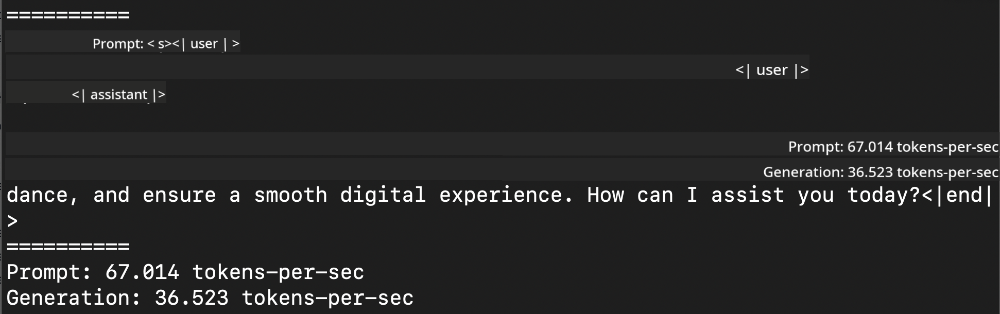
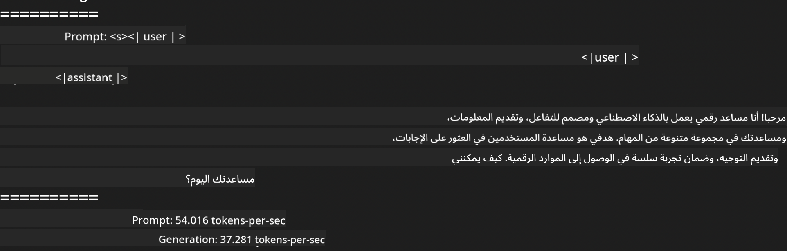
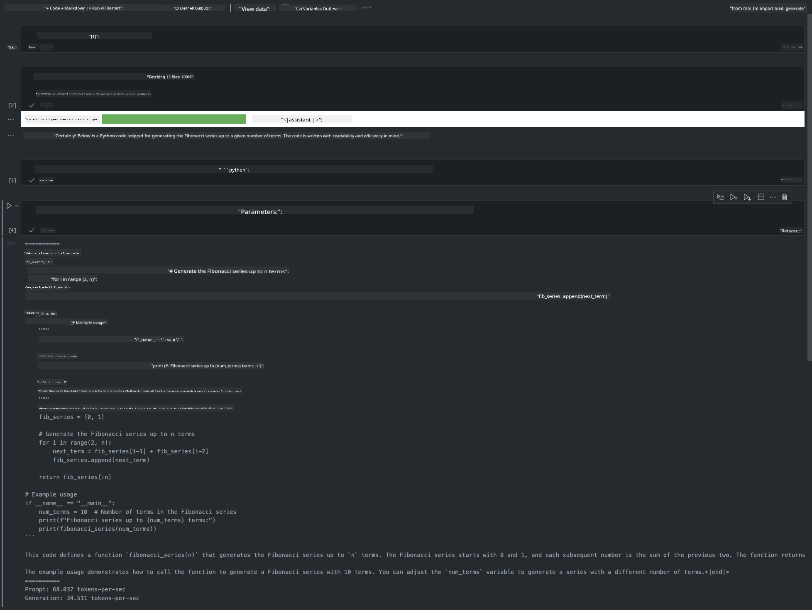

<!--
CO_OP_TRANSLATOR_METADATA:
{
  "original_hash": "dcb656f3d206fc4968e236deec5d4384",
  "translation_date": "2025-03-27T16:08:06+00:00",
  "source_file": "md\\03.FineTuning\\03.Inference\\MLX_Inference.md",
  "language_code": "ar"
}
-->
# **استخدام Phi-3 مع إطار عمل Apple MLX**

## **ما هو إطار عمل MLX**

MLX هو إطار عمل مخصص للبحث في تعلم الآلة على معالجات Apple silicon، تم تطويره بواسطة فريق أبحاث تعلم الآلة في Apple.

تم تصميم MLX من قبل باحثين في تعلم الآلة ليكون أداة موجهة لباحثي تعلم الآلة. الهدف من الإطار هو أن يكون سهل الاستخدام ولكنه فعال في تدريب ونشر النماذج. التصميم نفسه بسيط من الناحية المفاهيمية، مما يجعل من السهل على الباحثين توسيع وتحسين MLX لاستكشاف أفكار جديدة بسرعة.

يمكن تسريع النماذج اللغوية الكبيرة (LLMs) على أجهزة Apple Silicon باستخدام MLX، ويمكن تشغيل النماذج محليًا بسهولة كبيرة.

## **استخدام MLX لتشغيل Phi-3-mini**

### **1. إعداد بيئة MLX الخاصة بك**

1. Python 3.11.x  
2. تثبيت مكتبة MLX  

```bash

pip install mlx-lm

```

### **2. تشغيل Phi-3-mini في الطرفية باستخدام MLX**

```bash

python -m mlx_lm.generate --model microsoft/Phi-3-mini-4k-instruct --max-token 2048 --prompt  "<|user|>\nCan you introduce yourself<|end|>\n<|assistant|>"

```

النتيجة (بيئتي هي Apple M1 Max، بذاكرة 64GB) هي:



### **3. تقليل حجم Phi-3-mini باستخدام MLX في الطرفية**

```bash

python -m mlx_lm.convert --hf-path microsoft/Phi-3-mini-4k-instruct

```

***ملاحظة:*** يمكن تقليل حجم النموذج باستخدام mlx_lm.convert، والتقليل الافتراضي هو INT4. في هذا المثال، يتم تقليل Phi-3-mini إلى INT4.

يتم تقليل حجم النموذج باستخدام mlx_lm.convert، والتقليل الافتراضي هو INT4. هذا المثال يقلل Phi-3-mini إلى INT4. بعد التقليل، سيتم تخزين النموذج في الدليل الافتراضي ./mlx_model.

يمكننا اختبار النموذج المصغر باستخدام MLX من خلال الطرفية:

```bash

python -m mlx_lm.generate --model ./mlx_model/ --max-token 2048 --prompt  "<|user|>\nCan you introduce yourself<|end|>\n<|assistant|>"

```

النتيجة هي:



### **4. تشغيل Phi-3-mini باستخدام MLX في Jupyter Notebook**



***ملاحظة:*** يرجى قراءة هذا المثال [اضغط هنا](../../../../../code/03.Inference/MLX/MLX_DEMO.ipynb)

## **الموارد**

1. تعرف على إطار عمل Apple MLX [https://ml-explore.github.io](https://ml-explore.github.io/mlx/build/html/index.html)

2. مستودع Apple MLX على GitHub [https://github.com/ml-explore](https://github.com/ml-explore)

**إخلاء المسؤولية**:  
تم ترجمة هذا المستند باستخدام خدمة الترجمة الآلية [Co-op Translator](https://github.com/Azure/co-op-translator). بينما نسعى لتحقيق الدقة، يرجى العلم أن الترجمات الآلية قد تحتوي على أخطاء أو معلومات غير دقيقة. يجب اعتبار المستند الأصلي بلغته الأصلية المصدر الموثوق. للحصول على معلومات حاسمة، يُوصى بالاستعانة بترجمة بشرية احترافية. نحن غير مسؤولين عن أي سوء فهم أو تفسيرات خاطئة ناتجة عن استخدام هذه الترجمة.