<!--
CO_OP_TRANSLATOR_METADATA:
{
  "original_hash": "c1559c5af6caccf6f623fd43a6b3a9a3",
  "translation_date": "2025-03-27T13:45:10+00:00",
  "source_file": "md\\03.FineTuning\\FineTuning_AIFoundry.md",
  "language_code": "ar"
}
-->
# تحسين نموذج Phi-3 باستخدام Azure AI Foundry

لنستكشف كيفية تحسين نموذج اللغة Phi-3 Mini الخاص بشركة Microsoft باستخدام Azure AI Foundry. يتيح لك التحسين تخصيص نموذج Phi-3 Mini لمهام معينة، مما يجعله أكثر قوة ووعيًا بالسياق.

## الاعتبارات

- **القدرات:** ما هي النماذج التي يمكن تحسينها؟ وما الذي يمكن للنموذج الأساسي القيام به بعد التحسين؟
- **التكلفة:** ما هو نموذج التسعير الخاص بالتحسين؟
- **قابلية التخصيص:** إلى أي مدى يمكنني تعديل النموذج الأساسي – وبأي طرق؟
- **الراحة:** كيف يتم تنفيذ عملية التحسين – هل أحتاج إلى كتابة كود مخصص؟ هل أحتاج إلى موارد حسابية خاصة؟
- **السلامة:** النماذج المحسنة قد تحمل مخاطر تتعلق بالسلامة – هل توجد أي ضوابط لحمايتها من الأضرار غير المقصودة؟

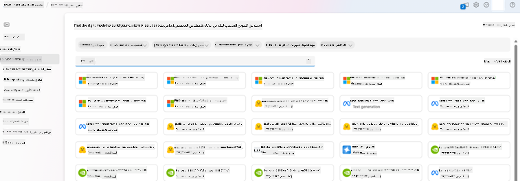

## التحضير لعملية التحسين

### المتطلبات الأساسية

> [!NOTE]
> بالنسبة لنماذج عائلة Phi-3، يتوفر خيار التحسين بنظام الدفع حسب الاستخدام فقط مع المحاور التي تم إنشاؤها في مناطق **East US 2**.

- اشتراك Azure. إذا لم يكن لديك اشتراك Azure، قم بإنشاء [حساب Azure مدفوع](https://azure.microsoft.com/pricing/purchase-options/pay-as-you-go) للبدء.

- [مشروع AI Foundry](https://ai.azure.com?WT.mc_id=aiml-138114-kinfeylo).
- يتم استخدام ضوابط الوصول المستندة إلى الأدوار في Azure (Azure RBAC) لمنح الوصول إلى العمليات في Azure AI Foundry. لتنفيذ الخطوات في هذه المقالة، يجب أن يكون حساب المستخدم الخاص بك معينًا بـ __دور مطور Azure AI__ على مجموعة الموارد.

### تسجيل موفر الاشتراك

تحقق من تسجيل الاشتراك لموفر الموارد `Microsoft.Network`.

1. قم بتسجيل الدخول إلى [مدخل Azure](https://portal.azure.com).
1. اختر **الاشتراكات** من القائمة اليسرى.
1. اختر الاشتراك الذي تريد استخدامه.
1. اختر **إعدادات مشروع الذكاء الاصطناعي** > **موفري الموارد** من القائمة اليسرى.
1. تأكد من أن **Microsoft.Network** مدرج في قائمة موفري الموارد. إذا لم يكن كذلك، أضفه.

### إعداد البيانات

قم بتحضير بيانات التدريب والتحقق لتحسين النموذج. تتكون مجموعات بيانات التدريب والتحقق من أمثلة إدخال وإخراج للطريقة التي تريد أن يعمل بها النموذج.

تأكد من أن جميع أمثلة التدريب تتبع التنسيق المتوقع للاستدلال. لتحسين النماذج بفعالية، تأكد من توازن وتنوع البيانات.

يشمل ذلك الحفاظ على توازن البيانات، وإدراج سيناريوهات متنوعة، وتحسين بيانات التدريب بشكل دوري لتتماشى مع التوقعات الواقعية، مما يؤدي في النهاية إلى استجابات نموذجية أكثر دقة وتوازنًا.

تتطلب أنواع النماذج المختلفة تنسيقات مختلفة لبيانات التدريب.

### إكمال المحادثة

يجب أن تكون بيانات التدريب والتحقق التي تستخدمها **بتنسيق JSON Lines (JSONL)**. بالنسبة لـ `Phi-3-mini-128k-instruct`، يجب أن تكون مجموعة بيانات التحسين بتنسيق المحادثة المستخدم من قبل واجهة برمجة تطبيقات إكمال المحادثة.

### مثال على تنسيق الملف

```json
    {"messages": [{"role": "system", "content": "You are an Xbox customer support agent whose primary goal is to help users with issues they are experiencing with their Xbox devices. You are friendly and concise. You only provide factual answers to queries, and do not provide answers that are not related to Xbox."}, {"role": "user", "content": "Is Xbox better than PlayStation?"}, {"role": "assistant", "content": "I apologize, but I cannot provide personal opinions. My primary job is to assist you with any issues related to your Xbox device. Do you have any Xbox-related issues that need addressing?"}]}
    {"messages": [{"role": "system", "content": "You are an Xbox customer support agent whose primary goal is to help users with issues they are experiencing with their Xbox devices. You are friendly and concise. You only provide factual answers to queries, and do not provide answers that are not related to Xbox."}, {"role": "user", "content": "Can I play PC games on my Xbox?"}, {"role": "assistant", "content": "While Xbox consoles don't natively support PC games, they can play an array of Xbox games, many of which are also available on PC. Can I assist you with finding games compatible with your Xbox device?"}]}
    {"messages": [{"role": "system", "content": "You are an Xbox customer support agent whose primary goal is to help users with issues they are experiencing with their Xbox devices. You are friendly and concise. You only provide factual answers to queries, and do not provide answers that are not related to Xbox."}, {"role": "user", "content": "I'm having trouble connecting my Xbox to the Wi-Fi."}, {"role": "assistant", "content": "No worries, let's go through the network settings on your Xbox. Can you please tell me what happens when you try to connect it to the Wi-Fi?"}]}
```

نوع الملف المدعوم هو JSON Lines. يتم تحميل الملفات إلى مخزن البيانات الافتراضي وتصبح متاحة في مشروعك.

## تحسين نموذج Phi-3 باستخدام Azure AI Foundry

يتيح لك Azure AI Foundry تخصيص النماذج اللغوية الكبيرة لمجموعات البيانات الخاصة بك باستخدام عملية تُعرف باسم التحسين. يوفر التحسين قيمة كبيرة من خلال التخصيص والتحسين لمهام وتطبيقات محددة. يؤدي ذلك إلى تحسين الأداء، وزيادة الكفاءة من حيث التكلفة، وتقليل زمن الاستجابة، وتخصيص النتائج.

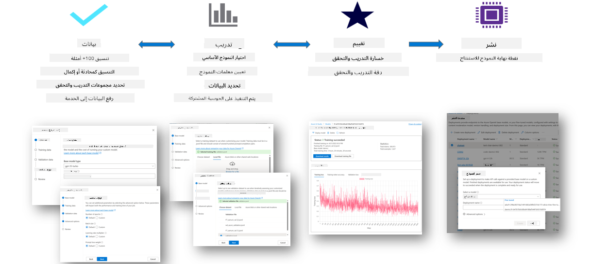

### إنشاء مشروع جديد

1. قم بتسجيل الدخول إلى [Azure AI Foundry](https://ai.azure.com).

1. اختر **+مشروع جديد** لإنشاء مشروع جديد في Azure AI Foundry.

    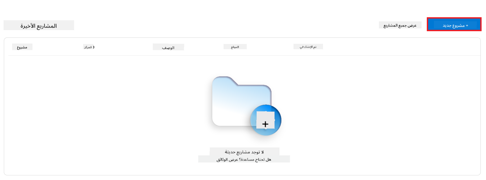

1. قم بتنفيذ المهام التالية:

    - **اسم المحور الخاص بالمشروع.** يجب أن يكون قيمة فريدة.
    - اختر **المحور** الذي تريد استخدامه (قم بإنشاء واحد جديد إذا لزم الأمر).

    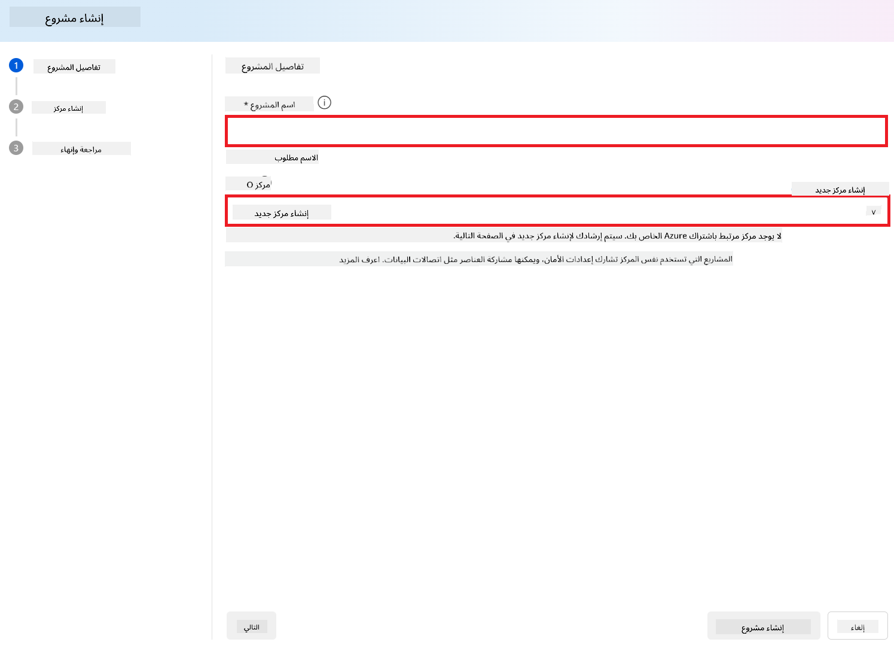

1. قم بتنفيذ المهام التالية لإنشاء محور جديد:

    - أدخل **اسم المحور.** يجب أن يكون قيمة فريدة.
    - اختر **اشتراك Azure** الخاص بك.
    - اختر **مجموعة الموارد** التي تريد استخدامها (قم بإنشاء واحدة جديدة إذا لزم الأمر).
    - اختر **الموقع** الذي ترغب في استخدامه.
    - اختر **اتصال بخدمات Azure AI** التي تريد استخدامها (قم بإنشاء واحدة جديدة إذا لزم الأمر).
    - اختر **اتصال بخدمة Azure AI Search** أو **تخطي الاتصال**.

    

1. اختر **التالي**.
1. اختر **إنشاء مشروع**.

### إعداد البيانات

قبل التحسين، قم بجمع أو إنشاء مجموعة بيانات ذات صلة بمهمتك، مثل تعليمات المحادثة، أزواج السؤال والإجابة، أو أي بيانات نصية أخرى ذات صلة. قم بتنظيف هذه البيانات ومعالجتها عن طريق إزالة الضوضاء، والتعامل مع القيم المفقودة، وتقسيم النص إلى رموز.

### تحسين نماذج Phi-3 في Azure AI Foundry

> [!NOTE]
> يدعم تحسين نماذج Phi-3 حاليًا المشاريع الموجودة في منطقة East US 2.

1. اختر **كتالوج النماذج** من علامة التبويب الجانبية اليسرى.

1. اكتب *phi-3* في **شريط البحث** واختر نموذج phi-3 الذي ترغب في استخدامه.

    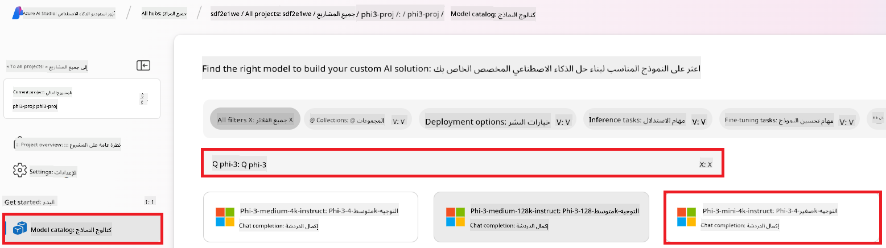

1. اختر **تحسين**.

    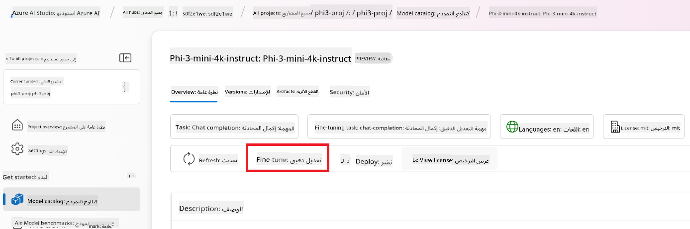

1. أدخل **اسم النموذج المحسن**.

    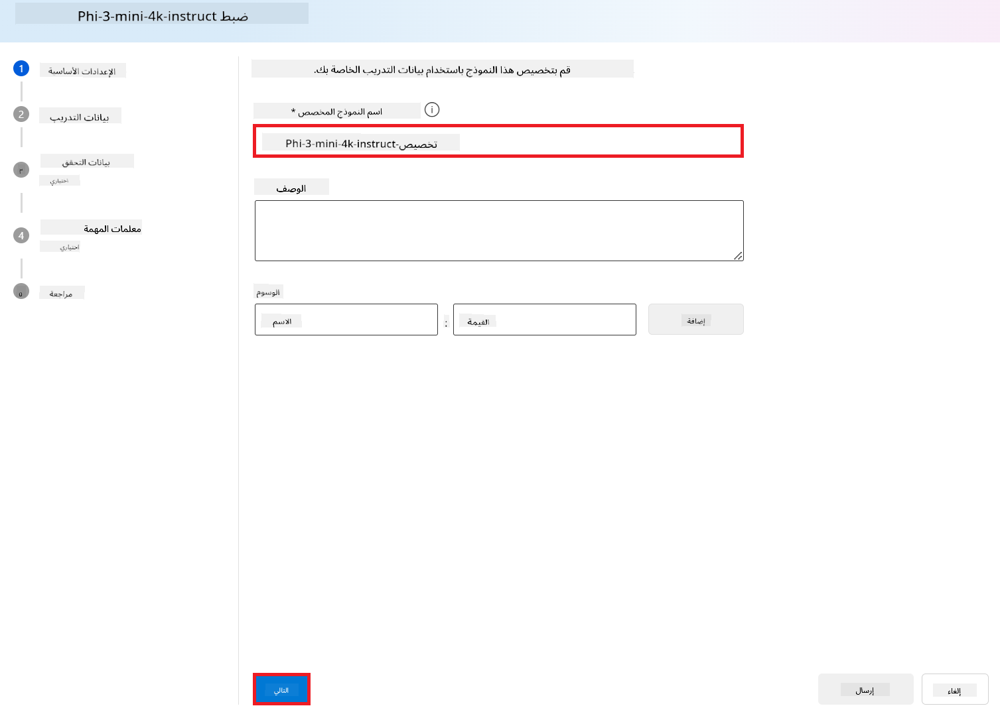

1. اختر **التالي**.

1. قم بتنفيذ المهام التالية:

    - اختر **نوع المهمة** ليكون **إكمال المحادثة**.
    - اختر **بيانات التدريب** التي ترغب في استخدامها. يمكنك تحميلها من بيانات Azure AI Foundry أو من بيئتك المحلية.

    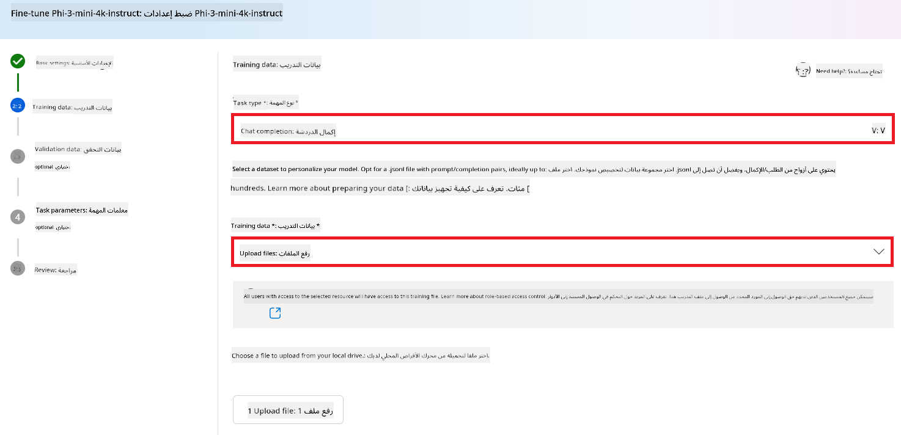

1. اختر **التالي**.

1. قم بتحميل **بيانات التحقق** التي ترغب في استخدامها، أو يمكنك اختيار **تقسيم البيانات تلقائيًا**.

    

1. اختر **التالي**.

1. قم بتنفيذ المهام التالية:

    - اختر **مضاعف حجم الدفعة** الذي ترغب في استخدامه.
    - اختر **معدل التعلم** الذي ترغب في استخدامه.
    - اختر **عدد الحلقات التدريبية** الذي ترغب في استخدامه.

    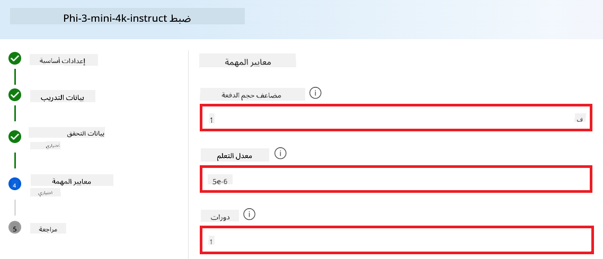

1. اختر **إرسال** لبدء عملية التحسين.

    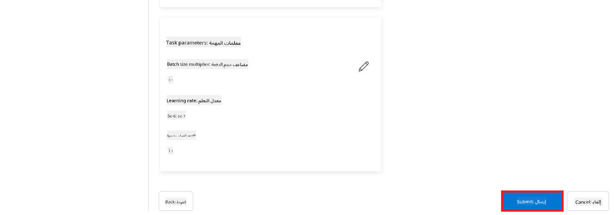

1. بمجرد تحسين النموذج الخاص بك، سيتم عرض الحالة كـ **مكتمل**، كما هو موضح في الصورة أدناه. يمكنك الآن نشر النموذج واستخدامه في تطبيقك الخاص، أو في مساحة اللعب، أو في تدفق التعليمات. لمزيد من المعلومات، راجع [كيفية نشر نماذج Phi-3 الصغيرة باستخدام Azure AI Foundry](https://learn.microsoft.com/azure/ai-studio/how-to/deploy-models-phi-3?tabs=phi-3-5&pivots=programming-language-python).

    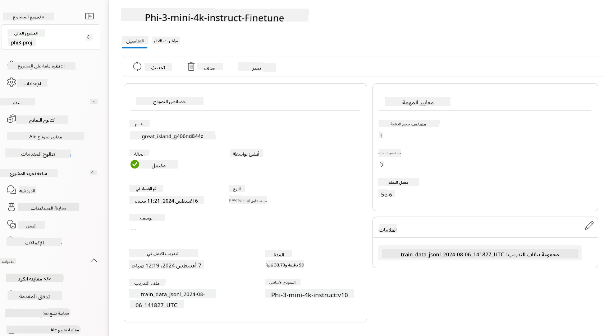

> [!NOTE]
> لمزيد من المعلومات التفصيلية حول تحسين Phi-3، يرجى زيارة [تحسين نماذج Phi-3 في Azure AI Foundry](https://learn.microsoft.com/azure/ai-studio/how-to/fine-tune-phi-3?tabs=phi-3-mini).

## تنظيف النماذج المحسنة

يمكنك حذف نموذج محسّن من قائمة نماذج التحسين في [Azure AI Foundry](https://ai.azure.com) أو من صفحة تفاصيل النموذج. اختر النموذج المحسن الذي تريد حذفه من صفحة التحسين، ثم اختر زر الحذف لحذف النموذج المحسن.

> [!NOTE]
> لا يمكنك حذف نموذج مخصص إذا كان لديه نشر موجود. يجب أولاً حذف نشر النموذج الخاص بك قبل أن تتمكن من حذف النموذج المخصص.

## التكلفة والحصص

### الاعتبارات المتعلقة بالتكلفة والحصص لنماذج Phi-3 المحسنة كخدمة

يتم تقديم نماذج Phi المحسنة كخدمة من قبل Microsoft ومتكاملة مع Azure AI Foundry للاستخدام. يمكنك العثور على الأسعار عند [النشر](https://learn.microsoft.com/azure/ai-studio/how-to/deploy-models-phi-3?tabs=phi-3-5&pivots=programming-language-python) أو تحسين النماذج ضمن علامة التبويب "التسعير والشروط" في معالج النشر.

## تصفية المحتوى

النماذج المنشورة كخدمة بنظام الدفع حسب الاستخدام محمية بواسطة Azure AI Content Safety. عند نشرها إلى نقاط نهاية في الوقت الفعلي، يمكنك اختيار تعطيل هذه الإمكانية. مع تمكين أمان محتوى Azure AI، يتم تمرير كل من الطلب والإكمال عبر مجموعة من نماذج التصنيف المصممة لاكتشاف ومنع إنتاج محتوى ضار. يقوم نظام تصفية المحتوى باكتشاف واتخاذ إجراءات بشأن فئات محددة من المحتوى الضار المحتمل في كل من الطلبات والإكمالات. تعرف على المزيد حول [أمان محتوى Azure AI](https://learn.microsoft.com/azure/ai-studio/concepts/content-filtering).

**إعدادات التحسين**

معلمات التعلم: حدد معلمات مثل معدل التعلم، حجم الدفعة، وعدد الحلقات التدريبية.

**دالة الخسارة**

اختر دالة خسارة مناسبة لمهمتك (مثل cross-entropy).

**المحسن**

حدد محسنًا (مثل Adam) لتحديثات التدرج أثناء التدريب.

**عملية التحسين**

- تحميل النموذج المدرب مسبقًا: قم بتحميل نقطة التحقق لـ Phi-3 Mini.
- إضافة طبقات مخصصة: أضف طبقات خاصة بالمهمة (مثل رأس التصنيف لتعليمات المحادثة).

**تدريب النموذج**
قم بتحسين النموذج باستخدام مجموعة البيانات التي أعددتها. راقب تقدم التدريب وقم بضبط المعلمات حسب الحاجة.

**التقييم والتحقق**

مجموعة التحقق: قم بتقسيم بياناتك إلى مجموعات تدريبية ومجموعات تحقق.

**تقييم الأداء**

استخدم مقاييس مثل الدقة، F1-score، أو perplexity لتقييم أداء النموذج.

## حفظ النموذج المحسن

**نقطة التحقق**
احفظ نقطة التحقق للنموذج المحسن لاستخدامها مستقبلاً.

## النشر

- النشر كخدمة ويب: انشر النموذج المحسن الخاص بك كخدمة ويب في Azure AI Foundry.
- اختبار نقطة النهاية: أرسل استفسارات اختبار إلى نقطة النهاية المنشورة للتحقق من وظيفتها.

## التكرار والتحسين

كرر: إذا لم يكن الأداء مرضيًا، قم بالتكرار من خلال ضبط المعلمات، إضافة المزيد من البيانات، أو تحسين النموذج لعدد أكبر من الحلقات.

## المراقبة والتحسين

راقب سلوك النموذج باستمرار وقم بتحسينه حسب الحاجة.

## التخصيص والتوسيع

مهام مخصصة: يمكن تحسين Phi-3 Mini لمهام متنوعة تتجاوز تعليمات المحادثة. استكشف حالات استخدام أخرى!
التجريب: جرّب هياكل مختلفة، تركيبات الطبقات، وتقنيات لتحسين الأداء.

> [!NOTE]
> التحسين عملية تكرارية. جرّب، تعلم، وكيّف نموذجك لتحقيق أفضل النتائج لمهمتك المحددة!

**إخلاء المسؤولية**:  
تمت ترجمة هذا المستند باستخدام خدمة الترجمة الآلية [Co-op Translator](https://github.com/Azure/co-op-translator). بينما نسعى لتحقيق الدقة، يرجى العلم أن الترجمات الآلية قد تحتوي على أخطاء أو معلومات غير دقيقة. يجب اعتبار المستند الأصلي بلغته الأصلية هو المصدر الموثوق. بالنسبة للمعلومات الحساسة، يُوصى بالترجمة البشرية الاحترافية. نحن غير مسؤولين عن أي سوء فهم أو تفسيرات خاطئة ناتجة عن استخدام هذه الترجمة.