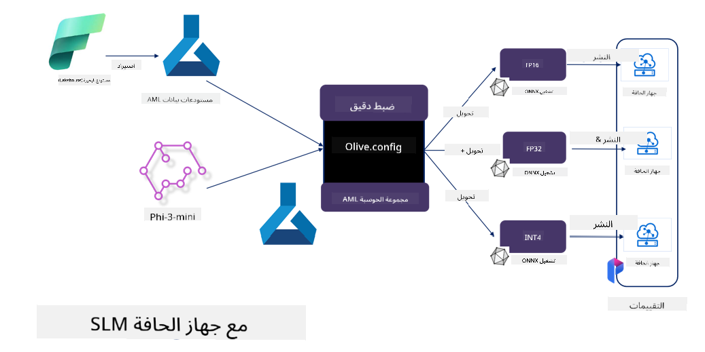

<!--
CO_OP_TRANSLATOR_METADATA:
{
  "original_hash": "5764be88ad2eb4f341e742eb8f14fab1",
  "translation_date": "2025-03-27T14:11:04+00:00",
  "source_file": "md\\03.FineTuning\\FineTuning_MicrosoftOlive.md",
  "language_code": "ar"
}
-->
# **تخصيص Phi-3 باستخدام Microsoft Olive**

[Olive](https://github.com/microsoft/OLive?WT.mc_id=aiml-138114-kinfeylo) هي أداة سهلة الاستخدام لتحسين النماذج مع مراعاة العتاد، تجمع بين تقنيات رائدة في مجال ضغط النماذج، تحسينها، وتجميعها.

تم تصميمها لتبسيط عملية تحسين نماذج التعلم الآلي، لضمان الاستفادة القصوى من بنى العتاد المحددة.

سواء كنت تعمل على تطبيقات سحابية أو أجهزة طرفية، فإن Olive تمكنك من تحسين نماذجك بسهولة وفعالية.

## الميزات الرئيسية:
- تجمع Olive وتُشغِّل تقنيات تحسين تستهدف العتاد المطلوب.
- لا توجد تقنية تحسين واحدة تناسب جميع السيناريوهات، لذا توفر Olive قابلية التوسع عبر تمكين الخبراء من إدخال ابتكاراتهم في تحسين النماذج.

## تقليل الجهد الهندسي:
- غالبًا ما يحتاج المطورون إلى تعلم واستخدام أدوات مخصصة لموردي العتاد لتحضير وتحسين النماذج المدربة للنشر.
- تبسط Olive هذه العملية من خلال أتمتة تقنيات التحسين للعتاد المطلوب.

## حل جاهز لتحسين شامل من البداية إلى النهاية:

من خلال تكوين وضبط تقنيات مدمجة، تقدم Olive حلاً موحدًا للتحسين الشامل. تأخذ بعين الاعتبار قيود مثل الدقة والكمون أثناء تحسين النماذج.

## استخدام Microsoft Olive للتخصيص

Microsoft Olive هي أداة مفتوحة المصدر سهلة الاستخدام لتحسين النماذج، تغطي كلاً من التخصيص والمرجعية في مجال الذكاء الاصطناعي التوليدي. مع إعداد بسيط واستخدام نماذج لغوية صغيرة مفتوحة المصدر وبيئات تشغيل ذات صلة (AzureML / GPU محلي، CPU، DirectML)، يمكنك إكمال التخصيص أو المرجعية للنموذج من خلال تحسين تلقائي، والعثور على أفضل نموذج لنشره في السحابة أو على الأجهزة الطرفية. تتيح للمؤسسات بناء نماذج عمودية خاصة بها على الصعيد المحلي وفي السحابة.


## تخصيص Phi-3 باستخدام Microsoft Olive 



## مثال على كود تخصيص Phi-3 باستخدام Olive
في هذا المثال ستستخدم Olive لـ:

- تخصيص محول LoRA لتصنيف العبارات إلى: حزن، فرح، خوف، دهشة.
- دمج أوزان المحول مع النموذج الأساسي.
- تحسين النموذج وتحويله إلى INT4.

[Sample Code](../../code/03.Finetuning/olive-ort-example/README.md)

### إعداد Microsoft Olive

تثبيت Microsoft Olive بسيط للغاية، ويمكن تثبيته لاستخدامه مع CPU، GPU، DirectML، وAzure ML

```bash
pip install olive-ai
```

إذا كنت ترغب في تشغيل نموذج ONNX باستخدام CPU، يمكنك استخدام

```bash
pip install olive-ai[cpu]
```

إذا كنت ترغب في تشغيل نموذج ONNX باستخدام GPU، يمكنك استخدام

```python
pip install olive-ai[gpu]
```

إذا كنت ترغب في استخدام Azure ML، استخدم

```python
pip install git+https://github.com/microsoft/Olive#egg=olive-ai[azureml]
```

**ملاحظة**
متطلبات نظام التشغيل: Ubuntu 20.04 / 22.04 

### **ملف Config.json الخاص بـ Microsoft Olive**

بعد التثبيت، يمكنك تكوين إعدادات مختلفة خاصة بالنماذج عبر ملف الإعدادات Config، بما في ذلك البيانات، الحوسبة، التدريب، النشر، وتوليد النماذج.

**1. البيانات**

يدعم Microsoft Olive التدريب على البيانات المحلية وبيانات السحابة، ويمكن تكوين ذلك في الإعدادات.

*إعدادات البيانات المحلية*

يمكنك إعداد مجموعة البيانات المراد تدريبها للتخصيص بسهولة، عادةً بتنسيق json، وتكييفها مع قالب البيانات. هذا يحتاج إلى تعديل بناءً على متطلبات النموذج (على سبيل المثال، تكييفه مع التنسيق المطلوب من Microsoft Phi-3-mini. إذا كان لديك نماذج أخرى، يرجى الرجوع إلى تنسيقات التخصيص المطلوبة للنماذج الأخرى لمعالجتها)

```json

    "data_configs": [
        {
            "name": "dataset_default_train",
            "type": "HuggingfaceContainer",
            "load_dataset_config": {
                "params": {
                    "data_name": "json", 
                    "data_files":"dataset/dataset-classification.json",
                    "split": "train"
                }
            },
            "pre_process_data_config": {
                "params": {
                    "dataset_type": "corpus",
                    "text_cols": [
                            "phrase",
                            "tone"
                    ],
                    "text_template": "### Text: {phrase}\n### The tone is:\n{tone}",
                    "corpus_strategy": "join",
                    "source_max_len": 2048,
                    "pad_to_max_len": false,
                    "use_attention_mask": false
                }
            }
        }
    ],
```

**إعدادات مصدر بيانات السحابة**

من خلال ربط مستودع البيانات الخاص بـ Azure AI Studio/Azure Machine Learning Service لربط البيانات في السحابة، يمكنك اختيار إدخال مصادر بيانات مختلفة إلى Azure AI Studio/Azure Machine Learning Service عبر Microsoft Fabric وAzure Data لدعم تخصيص البيانات.

```json

    "data_configs": [
        {
            "name": "dataset_default_train",
            "type": "HuggingfaceContainer",
            "load_dataset_config": {
                "params": {
                    "data_name": "json", 
                    "data_files": {
                        "type": "azureml_datastore",
                        "config": {
                            "azureml_client": {
                                "subscription_id": "Your Azure Subscrition ID",
                                "resource_group": "Your Azure Resource Group",
                                "workspace_name": "Your Azure ML Workspaces name"
                            },
                            "datastore_name": "workspaceblobstore",
                            "relative_path": "Your train_data.json Azure ML Location"
                        }
                    },
                    "split": "train"
                }
            },
            "pre_process_data_config": {
                "params": {
                    "dataset_type": "corpus",
                    "text_cols": [
                            "Question",
                            "Best Answer"
                    ],
                    "text_template": "<|user|>\n{Question}<|end|>\n<|assistant|>\n{Best Answer}\n<|end|>",
                    "corpus_strategy": "join",
                    "source_max_len": 2048,
                    "pad_to_max_len": false,
                    "use_attention_mask": false
                }
            }
        }
    ],
    
```

**2. إعدادات الحوسبة**

إذا كنت بحاجة إلى العمل محليًا، يمكنك استخدام الموارد المحلية مباشرة. إذا كنت بحاجة إلى استخدام موارد Azure AI Studio / Azure Machine Learning Service، تحتاج إلى تكوين معايير Azure ذات الصلة، مثل اسم القدرة الحاسوبية.

```json

    "systems": {
        "aml": {
            "type": "AzureML",
            "config": {
                "accelerators": ["gpu"],
                "hf_token": true,
                "aml_compute": "Your Azure AI Studio / Azure Machine Learning Service Compute Name",
                "aml_docker_config": {
                    "base_image": "Your Azure AI Studio / Azure Machine Learning Service docker",
                    "conda_file_path": "conda.yaml"
                }
            }
        },
        "azure_arc": {
            "type": "AzureML",
            "config": {
                "accelerators": ["gpu"],
                "aml_compute": "Your Azure AI Studio / Azure Machine Learning Service Compute Name",
                "aml_docker_config": {
                    "base_image": "Your Azure AI Studio / Azure Machine Learning Service docker",
                    "conda_file_path": "conda.yaml"
                }
            }
        }
    },
```

***ملاحظة***

نظرًا لأن التشغيل يتم عبر حاوية على Azure AI Studio/Azure Machine Learning Service، يجب تكوين البيئة المطلوبة. يتم تكوين ذلك في بيئة conda.yaml.

```yaml

name: project_environment
channels:
  - defaults
dependencies:
  - python=3.8.13
  - pip=22.3.1
  - pip:
      - einops
      - accelerate
      - azure-keyvault-secrets
      - azure-identity
      - bitsandbytes
      - datasets
      - huggingface_hub
      - peft
      - scipy
      - sentencepiece
      - torch>=2.2.0
      - transformers
      - git+https://github.com/microsoft/Olive@jiapli/mlflow_loading_fix#egg=olive-ai[gpu]
      - --extra-index-url https://aiinfra.pkgs.visualstudio.com/PublicPackages/_packaging/ORT-Nightly/pypi/simple/ 
      - ort-nightly-gpu==1.18.0.dev20240307004
      - --extra-index-url https://aiinfra.pkgs.visualstudio.com/PublicPackages/_packaging/onnxruntime-genai/pypi/simple/
      - onnxruntime-genai-cuda

    

```

**3. اختيار نموذج SLM**

يمكنك استخدام النموذج مباشرةً من Hugging face، أو يمكنك دمجه مباشرةً مع Model Catalog الخاص بـ Azure AI Studio / Azure Machine Learning لاختيار النموذج المراد استخدامه. في المثال أدناه سنستخدم Microsoft Phi-3-mini كمثال.

إذا كان لديك النموذج محليًا، يمكنك استخدام هذه الطريقة

```json

    "input_model":{
        "type": "PyTorchModel",
        "config": {
            "hf_config": {
                "model_name": "model-cache/microsoft/phi-3-mini",
                "task": "text-generation",
                "model_loading_args": {
                    "trust_remote_code": true
                }
            }
        }
    },
```

إذا كنت ترغب في استخدام نموذج من Azure AI Studio / Azure Machine Learning Service، يمكنك استخدام هذه الطريقة

```json

    "input_model":{
        "type": "PyTorchModel",
        "config": {
            "model_path": {
                "type": "azureml_registry_model",
                "config": {
                    "name": "microsoft/Phi-3-mini-4k-instruct",
                    "registry_name": "azureml-msr",
                    "version": "11"
                }
            },
             "model_file_format": "PyTorch.MLflow",
             "hf_config": {
                "model_name": "microsoft/Phi-3-mini-4k-instruct",
                "task": "text-generation",
                "from_pretrained_args": {
                    "trust_remote_code": true
                }
            }
        }
    },
```

**ملاحظة:**
نحتاج إلى التكامل مع Azure AI Studio / Azure Machine Learning Service، لذا عند إعداد النموذج، يرجى الرجوع إلى رقم الإصدار والتسمية ذات الصلة.

يجب إعداد جميع النماذج على Azure لتكون PyTorch.MLflow.

يجب أن يكون لديك حساب على Hugging face وربط المفتاح بقيمة Key الخاصة بـ Azure AI Studio / Azure Machine Learning.

**4. الخوارزمية**

تغلف Microsoft Olive خوارزميات تخصيص Lora وQLora بشكل جيد للغاية. كل ما عليك هو تكوين بعض المعايير ذات الصلة. هنا سأخذ QLora كمثال.

```json
        "lora": {
            "type": "LoRA",
            "config": {
                "target_modules": [
                    "o_proj",
                    "qkv_proj"
                ],
                "double_quant": true,
                "lora_r": 64,
                "lora_alpha": 64,
                "lora_dropout": 0.1,
                "train_data_config": "dataset_default_train",
                "eval_dataset_size": 0.3,
                "training_args": {
                    "seed": 0,
                    "data_seed": 42,
                    "per_device_train_batch_size": 1,
                    "per_device_eval_batch_size": 1,
                    "gradient_accumulation_steps": 4,
                    "gradient_checkpointing": false,
                    "learning_rate": 0.0001,
                    "num_train_epochs": 3,
                    "max_steps": 10,
                    "logging_steps": 10,
                    "evaluation_strategy": "steps",
                    "eval_steps": 187,
                    "group_by_length": true,
                    "adam_beta2": 0.999,
                    "max_grad_norm": 0.3
                }
            }
        },
```

إذا كنت ترغب في تحويل التكميم، فإن الفرع الرئيسي لـ Microsoft Olive يدعم بالفعل طريقة onnxruntime-genai. يمكنك ضبطه حسب احتياجاتك:

1. دمج أوزان المحول مع النموذج الأساسي.
2. تحويل النموذج إلى نموذج ONNX بالدقة المطلوبة باستخدام ModelBuilder.

مثل التحويل إلى INT4 المكّمم.

```json

        "merge_adapter_weights": {
            "type": "MergeAdapterWeights"
        },
        "builder": {
            "type": "ModelBuilder",
            "config": {
                "precision": "int4"
            }
        }
```

**ملاحظة** 
- إذا كنت تستخدم QLoRA، فإن تحويل التكميم باستخدام ONNXRuntime-genai غير مدعوم حاليًا.

- يجب الإشارة هنا إلى أنه يمكنك ضبط الخطوات المذكورة أعلاه بناءً على احتياجاتك. ليس من الضروري تكوين كل هذه الخطوات بالكامل. اعتمادًا على احتياجاتك، يمكنك استخدام خطوات الخوارزمية مباشرةً دون تخصيص. في النهاية تحتاج إلى تكوين المحركات ذات الصلة.

```json

    "engine": {
        "log_severity_level": 0,
        "host": "aml",
        "target": "aml",
        "search_strategy": false,
        "execution_providers": ["CUDAExecutionProvider"],
        "cache_dir": "../model-cache/models/phi3-finetuned/cache",
        "output_dir" : "../model-cache/models/phi3-finetuned"
    }
```

**5. إنهاء التخصيص**

على سطر الأوامر، نفذ في دليل olive-config.json

```bash
olive run --config olive-config.json  
```

**إخلاء المسؤولية**:  
تم ترجمة هذه الوثيقة باستخدام خدمة الترجمة بالذكاء الاصطناعي [Co-op Translator](https://github.com/Azure/co-op-translator). بينما نسعى لتحقيق الدقة، يرجى العلم أن الترجمات الآلية قد تحتوي على أخطاء أو معلومات غير دقيقة. يجب اعتبار الوثيقة الأصلية بلغتها الأصلية المصدر الموثوق. للحصول على معلومات حساسة، يُوصى بالترجمة البشرية الاحترافية. نحن غير مسؤولين عن أي سوء فهم أو تفسيرات خاطئة تنشأ عن استخدام هذه الترجمة.