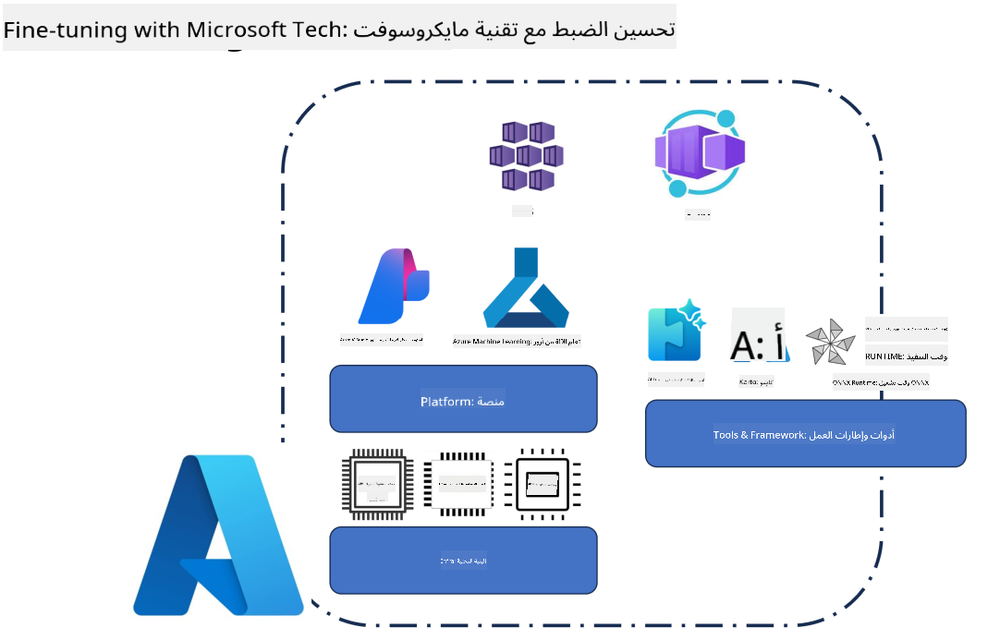
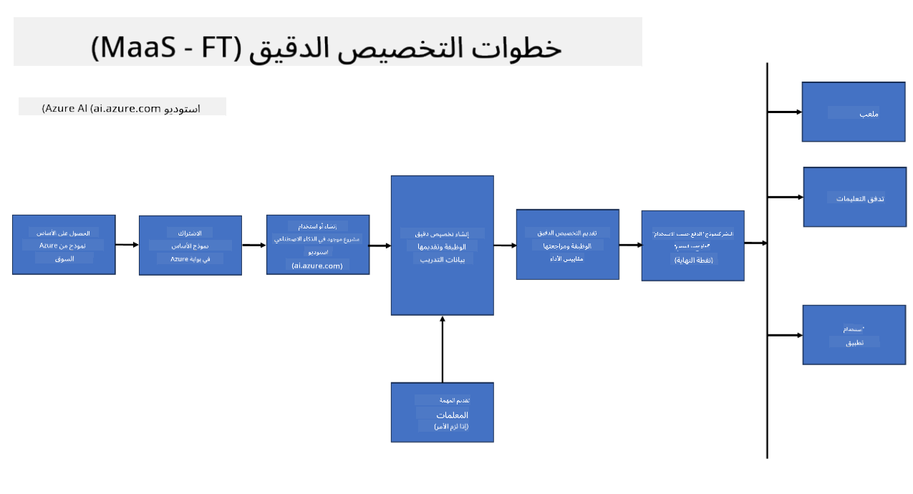
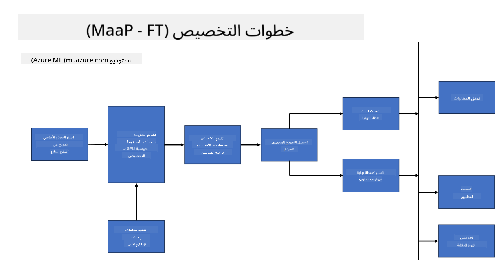
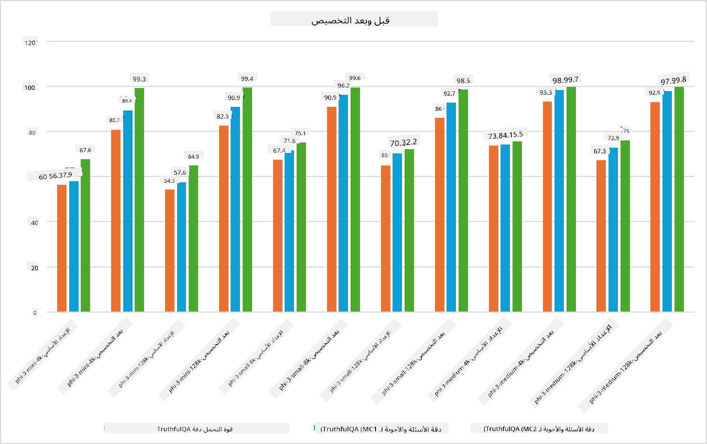

<!--
CO_OP_TRANSLATOR_METADATA:
{
  "original_hash": "cb5648935f63edc17e95ce38f23adc32",
  "translation_date": "2025-03-27T15:16:05+00:00",
  "source_file": "md\\03.FineTuning\\FineTuning_Scenarios.md",
  "language_code": "ar"
}
-->
## سيناريوهات التخصيص الدقيق

**المنصة** تشمل هذه المنصة تقنيات متعددة مثل Azure AI Foundry وAzure Machine Learning وAI Tools وKaito وONNX Runtime.

**البنية التحتية** تتضمن هذه البنية المعالجات المركزية (CPU) ووحدات FPGA، وهي أساسية لعملية التخصيص الدقيق. سأعرض لكم الرموز لكل من هذه التقنيات.

**الأدوات والإطارات** تتضمن ONNX Runtime وONNX Runtime. سأعرض لكم الرموز لكل من هذه التقنيات.
[إدراج الرموز لـ ONNX Runtime وONNX Runtime]

عملية التخصيص الدقيق باستخدام تقنيات مايكروسوفت تشمل مكونات وأدوات متنوعة. من خلال فهم هذه التقنيات واستخدامها، يمكننا تخصيص تطبيقاتنا بشكل فعال وابتكار حلول أفضل.

## النموذج كخدمة

قم بتخصيص النموذج باستخدام التخصيص المستضاف، دون الحاجة إلى إنشاء وإدارة الحوسبة.

التخصيص الدقيق بدون خوادم متاح لنماذج Phi-3-mini وPhi-3-medium، مما يتيح للمطورين تخصيص النماذج بسرعة وسهولة لسيناريوهات السحابة والحافة دون الحاجة إلى ترتيب الحوسبة. كما أعلنا أن نموذج Phi-3-small أصبح الآن متاحًا من خلال خدمة النموذج كخدمة، بحيث يمكن للمطورين البدء بسهولة وسرعة في تطوير الذكاء الاصطناعي دون الحاجة إلى إدارة البنية التحتية الأساسية.

## النموذج كمنصة 

يتولى المستخدمون إدارة الحوسبة الخاصة بهم لتخصيص نماذجهم.

[عينة التخصيص الدقيق](https://github.com/Azure/azureml-examples/blob/main/sdk/python/foundation-models/system/finetune/chat-completion/chat-completion.ipynb)

## سيناريوهات التخصيص الدقيق 

| | | | | | | |
|-|-|-|-|-|-|-|
|السيناريو|LoRA|QLoRA|PEFT|DeepSpeed|ZeRO|DORA|
|تكييف النماذج المدربة مسبقًا لمهام أو مجالات محددة|نعم|نعم|نعم|نعم|نعم|نعم|
|التخصيص الدقيق لمهام معالجة اللغة الطبيعية مثل تصنيف النصوص، واستخراج الكيانات المسماة، والترجمة الآلية|نعم|نعم|نعم|نعم|نعم|نعم|
|التخصيص الدقيق لمهام الإجابة على الأسئلة|نعم|نعم|نعم|نعم|نعم|نعم|
|التخصيص الدقيق لإنشاء ردود شبيهة بالبشر في روبوتات الدردشة|نعم|نعم|نعم|نعم|نعم|نعم|
|التخصيص الدقيق لإنشاء الموسيقى أو الفن أو أشكال أخرى من الإبداع|نعم|نعم|نعم|نعم|نعم|نعم|
|تقليل التكاليف الحاسوبية والمالية|نعم|نعم|لا|نعم|نعم|لا|
|تقليل استخدام الذاكرة|لا|نعم|لا|نعم|نعم|نعم|
|استخدام عدد أقل من المعلمات للتخصيص الفعال|لا|نعم|نعم|لا|لا|نعم|
|شكل فعال من التوازي في البيانات يتيح الوصول إلى إجمالي ذاكرة GPU لجميع أجهزة GPU المتاحة|لا|لا|لا|نعم|نعم|نعم|

## أمثلة على أداء التخصيص الدقيق

**إخلاء المسؤولية**:  
تمت ترجمة هذا المستند باستخدام خدمة الترجمة بالذكاء الاصطناعي [Co-op Translator](https://github.com/Azure/co-op-translator). بينما نسعى لتحقيق الدقة، يرجى العلم أن الترجمات الآلية قد تحتوي على أخطاء أو عدم دقة. يجب اعتبار المستند الأصلي بلغته الأصلية هو المصدر الرسمي. للحصول على معلومات حاسمة، يُوصى بالاستعانة بترجمة بشرية احترافية. نحن غير مسؤولين عن أي سوء فهم أو تفسيرات خاطئة تنشأ عن استخدام هذه الترجمة.