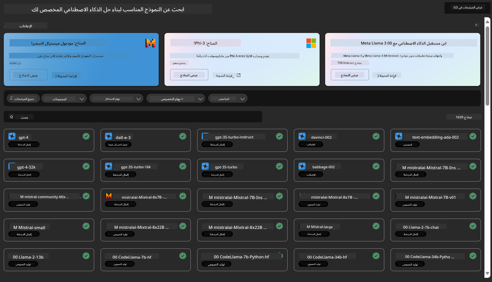
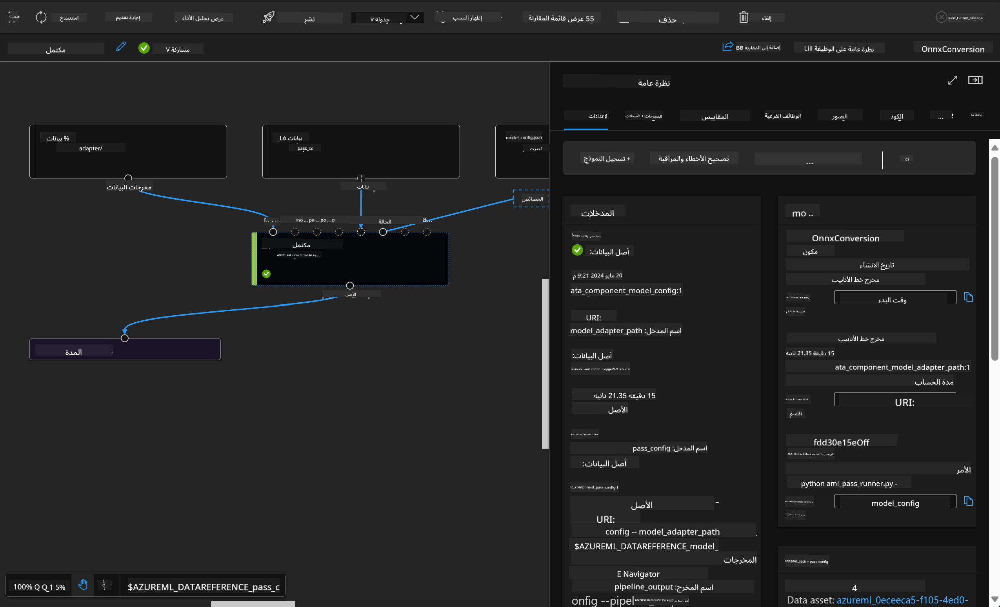

<!--
CO_OP_TRANSLATOR_METADATA:
{
  "original_hash": "7fe541373802e33568e94e13226d463c",
  "translation_date": "2025-03-27T15:53:38+00:00",
  "source_file": "md\\03.FineTuning\\Introduce_AzureML.md",
  "language_code": "ar"
}
-->
# **تعريف خدمة Azure Machine Learning**

[Azure Machine Learning](https://ml.azure.com?WT.mc_id=aiml-138114-kinfeylo) هي خدمة سحابية تهدف إلى تسريع وإدارة دورة حياة مشاريع تعلم الآلة (ML).

يمكن للمتخصصين في تعلم الآلة، وعلماء البيانات، والمهندسين استخدامها في مهامهم اليومية من أجل:

- تدريب ونشر النماذج.
- إدارة عمليات تعلم الآلة (MLOps).
- يمكنك إنشاء نموذج باستخدام Azure Machine Learning أو استخدام نموذج تم بناؤه من منصة مفتوحة المصدر مثل PyTorch، أو TensorFlow، أو scikit-learn.
- تساعد أدوات MLOps في مراقبة النماذج، وإعادة تدريبها، وإعادة نشرها.

## لمن تم تصميم Azure Machine Learning؟

**علماء البيانات ومهندسو تعلم الآلة**

يمكنهم استخدام الأدوات لتسريع وأتمتة مهامهم اليومية.
يوفر Azure ML ميزات للعدالة، والتفسير، والتتبع، والتدقيق.

**مطوروا التطبيقات**

يمكنهم دمج النماذج في التطبيقات أو الخدمات بسلاسة.

**مطوروا المنصات**

لديهم وصول إلى مجموعة قوية من الأدوات المدعومة بواجهات برمجة التطبيقات (APIs) الخاصة بـ Azure Resource Manager.
تتيح هذه الأدوات بناء أدوات تعلم آلي متقدمة.

**المؤسسات**

بالعمل ضمن السحابة الخاصة بـ Microsoft Azure، تستفيد المؤسسات من الأمان المألوف والتحكم في الوصول القائم على الأدوار.
يمكن إعداد المشاريع للتحكم في الوصول إلى البيانات المحمية والعمليات المحددة.

## الإنتاجية للجميع في الفريق

تتطلب مشاريع تعلم الآلة غالبًا فريقًا يتمتع بمجموعة متنوعة من المهارات للبناء والصيانة.

يوفر Azure ML أدوات تمكنك من:
- التعاون مع فريقك من خلال دفاتر ملاحظات مشتركة، وموارد الحوسبة، والحوسبة بدون خادم، والبيانات، والبيئات.
- تطوير نماذج مع التركيز على العدالة، والتفسير، والتتبع، والتدقيق لتلبية متطلبات الامتثال.
- نشر نماذج تعلم الآلة بسرعة وسهولة على نطاق واسع، وإدارتها وحوكمتها بكفاءة باستخدام MLOps.
- تشغيل أحمال عمل تعلم الآلة في أي مكان مع الحوكمة والأمان والامتثال المدمجين.

## أدوات منصة متوافقة مع الجميع

يمكن لأي شخص في فريق تعلم الآلة استخدام الأدوات التي يفضلها لإنجاز المهام.
سواء كنت تقوم بتجارب سريعة، أو ضبط المعاملات الفائقة، أو بناء خطوط أنابيب، أو إدارة الاستنتاجات، يمكنك استخدام واجهات مألوفة تشمل:
- Azure Machine Learning Studio
- Python SDK (v2)
- Azure CLI (v2)
- Azure Resource Manager REST APIs

أثناء تحسين النماذج والتعاون خلال دورة التطوير، يمكنك مشاركة الأصول والموارد والمقاييس والعثور عليها ضمن واجهة Azure Machine Learning Studio.

## **LLM/SLM في Azure ML**

أضاف Azure ML العديد من الوظائف المتعلقة بـ LLM/SLM، حيث يجمع بين LLMOps وSLMOps لإنشاء منصة ذكاء اصطناعي توليدي على مستوى المؤسسة.

### **كتالوج النماذج**

يمكن للمستخدمين في المؤسسات نشر نماذج مختلفة وفقًا لسيناريوهات الأعمال المختلفة عبر كتالوج النماذج، وتقديم الخدمات كنموذج كخدمة (Model as a Service) للمطورين أو المستخدمين في المؤسسات.

يعد كتالوج النماذج في Azure Machine Learning Studio المحور لاكتشاف واستخدام مجموعة واسعة من النماذج التي تمكنك من بناء تطبيقات ذكاء اصطناعي توليدية. يضم كتالوج النماذج مئات النماذج من مقدمي النماذج مثل خدمة Azure OpenAI، Mistral، Meta، Cohere، Nvidia، Hugging Face، بما في ذلك النماذج التي تدربت عليها Microsoft. النماذج من مقدمي الخدمة غير Microsoft تعتبر منتجات غير تابعة لـ Microsoft كما هو محدد في شروط منتجات Microsoft، وتخضع للشروط المقدمة مع النموذج.

### **خط أنابيب المهام**

جوهر خط أنابيب تعلم الآلة هو تقسيم مهمة تعلم الآلة الكاملة إلى سير عمل متعدد الخطوات. كل خطوة هي مكون يمكن تطويره وتحسينه وتكوينه وأتمتته بشكل فردي. يتم توصيل الخطوات عبر واجهات محددة بوضوح. يقوم Azure Machine Learning Pipeline بخدمة تنظيم جميع التبعيات بين خطوات الخطوط تلقائيًا.

في ضبط SLM / LLM، يمكننا إدارة بياناتنا وعمليات التدريب والتوليد عبر Pipeline.

### **تدفق التعليمات**

**فوائد استخدام تدفق التعليمات في Azure Machine Learning**

يوفر تدفق التعليمات في Azure Machine Learning مجموعة من الفوائد التي تساعد المستخدمين على الانتقال من مرحلة الفكرة إلى التجريب وأخيرًا إلى التطبيقات الجاهزة للإنتاج المعتمدة على LLM:

**مرونة هندسة التعليمات**

- تجربة كتابة تفاعلية: يوفر تدفق التعليمات في Azure Machine Learning تمثيلًا بصريًا لهيكل التدفق، مما يسمح للمستخدمين بفهم مشاريعهم والتنقل فيها بسهولة. كما يقدم تجربة كتابة شبيهة بالدفاتر لتطوير التدفق وتصحيح الأخطاء بكفاءة.
- متغيرات لضبط التعليمات: يمكن للمستخدمين إنشاء ومقارنة متغيرات متعددة للتعليمات، مما يسهل عملية تحسين تكرارية.
- التقييم: توفر التدفقات المدمجة للتقييم القدرة على تقييم جودة وفعالية التعليمات والتدفقات.

**جاهزية المؤسسات للتطبيقات المعتمدة على LLM**

- التعاون: يدعم تدفق التعليمات في Azure Machine Learning التعاون بين الفريق، مما يسمح لعدة مستخدمين بالعمل معًا على مشاريع هندسة التعليمات، ومشاركة المعرفة، والحفاظ على التحكم في الإصدارات.
- منصة شاملة: يبسط تدفق التعليمات في Azure Machine Learning العملية الكاملة لهندسة التعليمات، من التطوير والتقييم إلى النشر والمراقبة. يمكن للمستخدمين نشر تدفقاتهم بسهولة كنقاط نهاية لـ Azure Machine Learning ومراقبة أدائها في الوقت الفعلي لضمان التشغيل الأمثل والتحسين المستمر.
- حلول جاهزية المؤسسات من Azure Machine Learning: يستفيد تدفق التعليمات من حلول Azure Machine Learning القوية لجهوزية المؤسسات، مما يوفر أساسًا آمنًا وقابلًا للتوسع وموثوقًا لتطوير التدفقات والتجريب والنشر.

مع تدفق التعليمات في Azure Machine Learning، يمكن للمستخدمين إطلاق العنان لمرونة هندسة التعليمات، والتعاون بفعالية، والاستفادة من حلول جاهزة للمؤسسات لتحقيق نجاح في تطوير التطبيقات المعتمدة على LLM ونشرها.

من خلال الجمع بين قوة الحوسبة، والبيانات، والمكونات المختلفة لـ Azure ML، يمكن لمطوري المؤسسات بناء تطبيقات الذكاء الاصطناعي الخاصة بهم بسهولة.

**إخلاء المسؤولية**:  
تم ترجمة هذا المستند باستخدام خدمة الترجمة بالذكاء الاصطناعي [Co-op Translator](https://github.com/Azure/co-op-translator). بينما نسعى لتحقيق الدقة، يرجى العلم أن الترجمات الآلية قد تحتوي على أخطاء أو معلومات غير دقيقة. يجب اعتبار المستند الأصلي بلغته الأصلية المصدر الرسمي. للحصول على معلومات حاسمة، يُوصى بالاستعانة بترجمة بشرية احترافية. نحن غير مسؤولين عن أي سوء فهم أو تفسير خاطئ ينشأ عن استخدام هذه الترجمة.