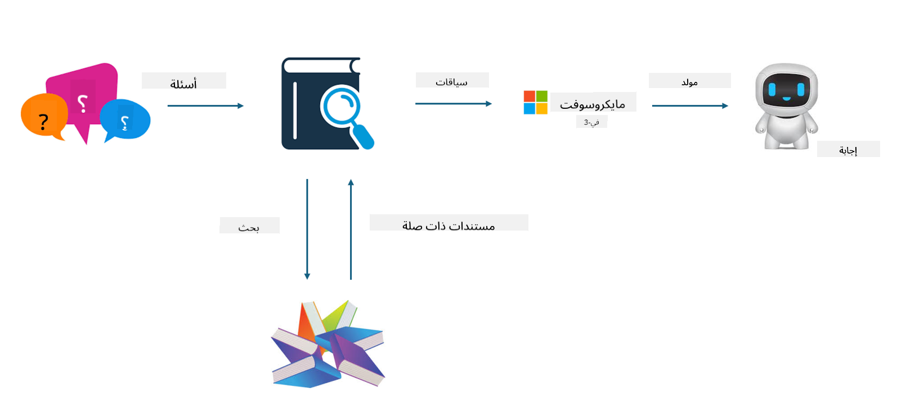
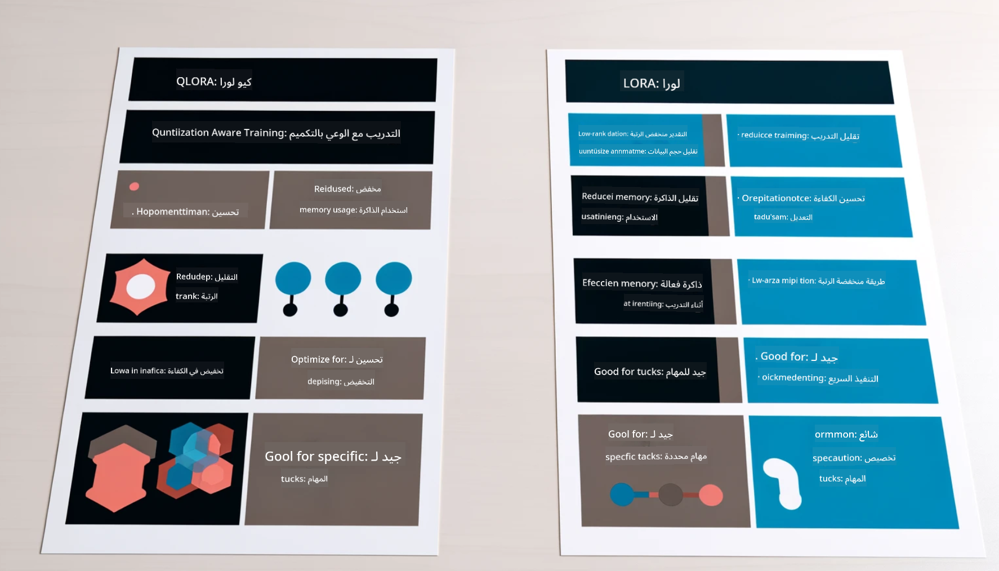

<!--
CO_OP_TRANSLATOR_METADATA:
{
  "original_hash": "743d7e9cb9c4e8ea642d77bee657a7fa",
  "translation_date": "2025-03-27T16:01:55+00:00",
  "source_file": "md\\03.FineTuning\\LetPhi3gotoIndustriy.md",
  "language_code": "ar"
}
-->
# **اجعل Phi-3 خبيراً في الصناعة**

لإدخال نموذج Phi-3 في مجال الصناعة، تحتاج إلى إضافة بيانات العمل الخاصة بالصناعة إلى نموذج Phi-3. لدينا خياران مختلفان، الأول هو RAG (توليد معزز بالاسترجاع) والثاني هو التخصيص الدقيق (Fine Tuning).

## **RAG مقابل التخصيص الدقيق**

### **توليد معزز بالاسترجاع**

RAG هو استرجاع البيانات + توليد النصوص. يتم تخزين البيانات المنظمة وغير المنظمة للمؤسسة في قاعدة بيانات متجهية. عند البحث عن محتوى ذي صلة، يتم العثور على الملخص والمحتوى ذي الصلة لتشكيل سياق، ويتم دمج قدرة إكمال النص لـ LLM/SLM لتوليد المحتوى.

### **التخصيص الدقيق**

التخصيص الدقيق يعتمد على تحسين نموذج معين. لا يحتاج إلى البدء بخوارزمية النموذج، ولكن يجب الاستمرار في تجميع البيانات. إذا كنت تريد مصطلحات وتعبيرات لغوية دقيقة أكثر في تطبيقات الصناعة، فإن التخصيص الدقيق هو الخيار الأفضل. ولكن إذا كانت بياناتك تتغير بشكل متكرر، فقد يصبح التخصيص الدقيق معقداً.

### **كيفية الاختيار**

1. إذا كان الجواب يتطلب إدخال بيانات خارجية، فإن RAG هو الخيار الأفضل.

2. إذا كنت تحتاج إلى إنتاج معرفة صناعية ثابتة ودقيقة، فإن التخصيص الدقيق سيكون خياراً جيداً. يركز RAG على جلب المحتوى ذي الصلة ولكنه قد لا يتمكن دائماً من التعمق في التفاصيل المتخصصة.

3. التخصيص الدقيق يتطلب مجموعة بيانات عالية الجودة، وإذا كانت البيانات صغيرة النطاق، فلن يكون هناك فرق كبير. RAG أكثر مرونة.

4. التخصيص الدقيق يعتبر صندوقاً أسوداً، ومبهماً، ومن الصعب فهم آليته الداخلية. لكن RAG يمكن أن يجعل من السهل العثور على مصدر البيانات، مما يساعد في تعديل الأخطاء أو الهلوسات بشكل فعال وتقديم شفافية أفضل.

### **السيناريوهات**

1. الصناعات الرأسية التي تتطلب مصطلحات وتعبيرات مهنية محددة، ***التخصيص الدقيق*** سيكون الخيار الأفضل.

2. أنظمة الأسئلة والأجوبة التي تتضمن تجميع نقاط معرفية مختلفة، ***RAG*** سيكون الخيار الأفضل.

3. الجمع بين تدفق العمل الآلي ***RAG + التخصيص الدقيق*** هو الخيار الأفضل.

## **كيفية استخدام RAG**

قاعدة البيانات المتجهية هي مجموعة من البيانات المخزنة في شكل رياضي. تسهل قواعد البيانات المتجهية على نماذج التعلم الآلي تذكر المدخلات السابقة، مما يتيح استخدام التعلم الآلي لدعم حالات الاستخدام مثل البحث، التوصيات، وتوليد النصوص. يمكن تحديد البيانات بناءً على مقاييس التشابه بدلاً من المطابقات الدقيقة، مما يسمح للنماذج الحاسوبية بفهم سياق البيانات.

قاعدة البيانات المتجهية هي المفتاح لتحقيق RAG. يمكننا تحويل البيانات إلى تخزين متجه من خلال نماذج متجهية مثل text-embedding-3، jina-ai-embedding، وغيرها.

تعرف على المزيد حول إنشاء تطبيق RAG [https://github.com/microsoft/Phi-3CookBook](https://github.com/microsoft/Phi-3CookBook?WT.mc_id=aiml-138114-kinfeylo)

## **كيفية استخدام التخصيص الدقيق**

الخوارزميات الشائعة الاستخدام في التخصيص الدقيق هي Lora وQLora. كيف تختار؟
- [تعرف أكثر من خلال هذا الدفتر التوضيحي](../../../../code/04.Finetuning/Phi_3_Inference_Finetuning.ipynb)
- [مثال على تخصيص دقيق باستخدام بايثون](../../../../code/04.Finetuning/FineTrainingScript.py)

### **Lora وQLora**

LoRA (التكيف منخفض الرتبة) وQLoRA (التكيف منخفض الرتبة مع التكميم) هما تقنيتان تُستخدمان لتخصيص النماذج اللغوية الكبيرة (LLMs) باستخدام تقنيات التخصيص الفعالة للمعاملات (PEFT). تم تصميم تقنيات PEFT لتدريب النماذج بكفاءة أعلى من الطرق التقليدية.  
LoRA هي تقنية تخصيص مستقلة تقلل من استخدام الذاكرة من خلال تطبيق تقريب منخفض الرتبة على مصفوفة تحديث الأوزان. توفر أوقات تدريب سريعة وتحافظ على الأداء قريباً من أساليب التخصيص التقليدية.  

QLoRA هي نسخة موسعة من LoRA تدمج تقنيات التكميم لتقليل استخدام الذاكرة بشكل أكبر. تقوم QLoRA بتكميم دقة معلمات الأوزان في النموذج المدرب مسبقاً إلى دقة 4-بت، مما يجعلها أكثر كفاءة في استخدام الذاكرة مقارنة بـ LoRA. ومع ذلك، فإن تدريب QLoRA أبطأ بنسبة حوالي 30% مقارنة بتدريب LoRA بسبب خطوات التكميم وإزالة التكميم الإضافية.  

تستخدم QLoRA تقنية LoRA كأداة لإصلاح الأخطاء الناتجة عن التكميم. تمكن QLoRA من تخصيص النماذج الضخمة ذات المليارات من المعاملات باستخدام وحدات معالجة رسومات (GPUs) صغيرة ومتوفرة. على سبيل المثال، يمكن لـ QLoRA تخصيص نموذج بحجم 70 مليار معلمة يتطلب 36 وحدة GPU باستخدام فقط 2.

**إخلاء المسؤولية**:  
تم ترجمة هذا المستند باستخدام خدمة ترجمة الذكاء الاصطناعي [Co-op Translator](https://github.com/Azure/co-op-translator). بينما نسعى لتحقيق الدقة، يرجى العلم أن الترجمات الآلية قد تحتوي على أخطاء أو معلومات غير دقيقة. يجب اعتبار المستند الأصلي بلغته الأصلية المصدر الرسمي. للحصول على معلومات حاسمة، يُوصى بالاستعانة بترجمة بشرية احترافية. نحن غير مسؤولين عن أي سوء فهم أو تفسيرات خاطئة ناتجة عن استخدام هذه الترجمة.