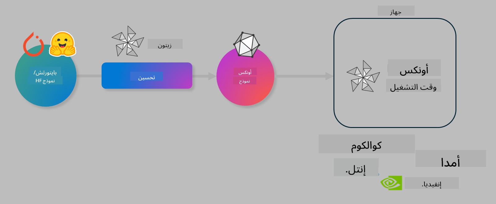

<!--
CO_OP_TRANSLATOR_METADATA:
{
  "original_hash": "6bbe47de3b974df7eea29dfeccf6032b",
  "translation_date": "2025-03-27T16:18:19+00:00",
  "source_file": "md\\03.FineTuning\\olive-lab\\readme.md",
  "language_code": "ar"
}
-->
# معمل. تحسين نماذج الذكاء الاصطناعي للتنفيذ على الأجهزة

## المقدمة

> [!IMPORTANT]
> يتطلب هذا المعمل وجود **GPU من نوع Nvidia A10 أو A100** مع تثبيت التعريفات ذات الصلة وأداة CUDA toolkit (الإصدار 12+).

> [!NOTE]
> هذا معمل مدته **35 دقيقة** يتيح لك التعرف عمليًا على المفاهيم الأساسية لتحسين النماذج للتنفيذ على الأجهزة باستخدام OLIVE.

## الأهداف التعليمية

بنهاية هذا المعمل، ستتمكن من استخدام OLIVE لـ:

- تقليل دقة نموذج ذكاء اصطناعي باستخدام طريقة AWQ للتقليل.
- تحسين نموذج ذكاء اصطناعي لمهمة محددة.
- إنشاء مرفقات LoRA (النموذج المحسن) للتنفيذ الفعال على الأجهزة باستخدام ONNX Runtime.

### ما هو Olive

Olive (*O*NNX *live*) هو أداة لتحسين النماذج مع واجهة CLI مرافقة تمكنك من تشغيل النماذج على ONNX runtime +++https://onnxruntime.ai+++ بجودة وأداء عاليين.



عادةً ما يكون الإدخال إلى Olive نموذج PyTorch أو Hugging Face، ويكون الإخراج نموذج ONNX محسن يتم تنفيذه على جهاز (هدف النشر) يعمل بـ ONNX runtime. يقوم Olive بتحسين النموذج ليعمل على مسرع الذكاء الاصطناعي (NPU، GPU، CPU) الخاص بجهاز النشر والمقدم من بائع أجهزة مثل Qualcomm أو AMD أو Nvidia أو Intel.

يقوم Olive بتنفيذ *عملية عمل*، وهي تسلسل من المهام الفردية لتحسين النماذج تسمى *تمريرات* - تتضمن أمثلة التمريرات: ضغط النماذج، التقاط الرسم البياني، تقليل الدقة، تحسين الرسم البياني. يحتوي كل تمرير على مجموعة من المعايير التي يمكن تعديلها لتحقيق أفضل النتائج، مثل الدقة وزمن التأخير، والتي يتم تقييمها بواسطة المُقيِّم المناسب. يستخدم Olive استراتيجية بحث تعتمد على خوارزمية بحث لضبط كل تمرير تلقائيًا بشكل فردي أو مجموعة من التمريرات معًا.

#### فوائد Olive

- **تقليل الإحباط والوقت** الناتج عن التجارب اليدوية التي تعتمد على المحاولة والخطأ مع تقنيات تحسين الرسم البياني، الضغط، وتقليل الدقة. حدد قيود الجودة والأداء الخاصة بك ودع Olive يعثر على أفضل نموذج لك تلقائيًا.
- **أكثر من 40 مكونًا مدمجًا لتحسين النماذج** تغطي تقنيات حديثة في تقليل الدقة، الضغط، تحسين الرسم البياني، والتحسين.
- **واجهة CLI سهلة الاستخدام** للمهام الشائعة لتحسين النماذج. على سبيل المثال، olive quantize، olive auto-opt، olive finetune.
- تضمين آلية لتعبئة النماذج ونشرها.
- يدعم إنشاء نماذج لخدمة **Multi LoRA**.
- إنشاء عمليات العمل باستخدام YAML/JSON لتنظيم مهام تحسين النماذج والنشر.
- تكامل مع **Hugging Face** و **Azure AI**.
- آلية **تخزين مؤقت مدمجة** لتوفير **التكاليف**.

## تعليمات المعمل
> [!NOTE]
> تأكد من إعداد مركز Azure AI الخاص بك والمشروع وإعداد الحوسبة A100 وفقًا للمعمل 1.

### الخطوة 0: الاتصال بحوسبة Azure AI

ستتصل بحوسبة Azure AI باستخدام ميزة الاتصال عن بُعد في **VS Code**.

1. افتح تطبيق سطح المكتب **VS Code**:
1. افتح **شريط الأوامر** باستخدام **Shift+Ctrl+P**.
1. في شريط الأوامر، ابحث عن **AzureML - remote: Connect to compute instance in New Window**.
1. اتبع التعليمات الظاهرة على الشاشة للاتصال بالحوسبة. سيتضمن ذلك اختيار اشتراك Azure الخاص بك، مجموعة الموارد، المشروع، واسم الحوسبة التي قمت بإعدادها في المعمل 1.
1. بمجرد الاتصال بعقدة Azure ML Compute، سيتم عرض ذلك في **الزاوية السفلية اليسرى من Visual Code** `><Azure ML: Compute Name`

### الخطوة 1: استنساخ هذا المستودع

في VS Code، يمكنك فتح نافذة طرفية جديدة باستخدام **Ctrl+J** واستنساخ هذا المستودع:

في الطرفية، يجب أن ترى المطالبة

```
azureuser@computername:~/cloudfiles/code$ 
```
استنساخ الحل

```bash
cd ~/localfiles
git clone https://github.com/microsoft/phi-3cookbook.git
```

### الخطوة 2: فتح المجلد في VS Code

لفتح VS Code في المجلد ذي الصلة، قم بتنفيذ الأمر التالي في الطرفية، والذي سيفتح نافذة جديدة:

```bash
code phi-3cookbook/code/04.Finetuning/Olive-lab
```

بدلاً من ذلك، يمكنك فتح المجلد عن طريق اختيار **File** > **Open Folder**.

### الخطوة 3: التبعيات

افتح نافذة طرفية في VS Code في مثيل حوسبة Azure AI الخاص بك (تلميح: **Ctrl+J**) ونفذ الأوامر التالية لتثبيت التبعيات:

```bash
conda create -n olive-ai python=3.11 -y
conda activate olive-ai
pip install -r requirements.txt
az extension remove -n azure-cli-ml
az extension add -n ml
```

> [!NOTE]
> سيستغرق تثبيت جميع التبعيات حوالي ~5 دقائق.

في هذا المعمل، ستقوم بتنزيل وتحميل النماذج إلى كتالوج نماذج Azure AI. لكي تتمكن من الوصول إلى كتالوج النماذج، ستحتاج إلى تسجيل الدخول إلى Azure باستخدام:

```bash
az login
```

> [!NOTE]
> أثناء تسجيل الدخول، سيُطلب منك تحديد اشتراكك. تأكد من تعيين الاشتراك إلى الاشتراك المقدم لهذا المعمل.

### الخطوة 4: تنفيذ أوامر Olive

افتح نافذة طرفية في VS Code في مثيل حوسبة Azure AI الخاص بك (تلميح: **Ctrl+J**) وتأكد من تنشيط بيئة `olive-ai` الخاصة بـ conda:

```bash
conda activate olive-ai
```

بعد ذلك، قم بتنفيذ أوامر Olive التالية في سطر الأوامر.

1. **فحص البيانات:** في هذا المثال، ستقوم بتحسين نموذج Phi-3.5-Mini ليكون متخصصًا في الإجابة على الأسئلة المتعلقة بالسفر. يعرض الكود أدناه السجلات القليلة الأولى من مجموعة البيانات، والتي تكون بتنسيق JSON lines:

    ```bash
    head data/data_sample_travel.jsonl
    ```
1. **تقليل دقة النموذج:** قبل تدريب النموذج، قم أولاً بتقليل الدقة باستخدام الأمر التالي الذي يستخدم تقنية تسمى Active Aware Quantization (AWQ) +++https://arxiv.org/abs/2306.00978+++. تقلل AWQ أوزان النموذج من خلال مراعاة التنشيطات الناتجة أثناء التنفيذ. يعني هذا أن عملية تقليل الدقة تأخذ في الاعتبار توزيع البيانات الفعلي في التنشيطات، مما يؤدي إلى الحفاظ بشكل أفضل على دقة النموذج مقارنةً بطرق تقليل الأوزان التقليدية.

    ```bash
    olive quantize \
       --model_name_or_path microsoft/Phi-3.5-mini-instruct \
       --trust_remote_code \
       --algorithm awq \
       --output_path models/phi/awq \
       --log_level 1
    ```

    تستغرق عملية تقليل الدقة حوالي **~8 دقائق**، مما سيؤدي إلى **تقليل حجم النموذج من ~7.5 جيجابايت إلى ~2.5 جيجابايت**.

    في هذا المعمل، نعرض لك كيفية إدخال النماذج من Hugging Face (على سبيل المثال: `microsoft/Phi-3.5-mini-instruct`). However, Olive also allows you to input models from the Azure AI catalog by updating the `model_name_or_path` argument to an Azure AI asset ID (for example:  `azureml://registries/azureml/models/Phi-3.5-mini-instruct/versions/4`). 

1. **Train the model:** Next, the `olive finetune` الأمر يقوم بتحسين النموذج الذي تم تقليل دقته. تقليل دقة النموذج *قبل* التحسين بدلاً من بعده يعطي دقة أفضل لأن عملية التحسين تعوض بعض الخسارة الناتجة عن تقليل الدقة.

    ```bash
    olive finetune \
        --method lora \
        --model_name_or_path models/phi/awq \
        --data_files "data/data_sample_travel.jsonl" \
        --data_name "json" \
        --text_template "<|user|>\n{prompt}<|end|>\n<|assistant|>\n{response}<|end|>" \
        --max_steps 100 \
        --output_path ./models/phi/ft \
        --log_level 1
    ```

    تستغرق عملية التحسين حوالي **~6 دقائق** (مع 100 خطوة).

1. **التحسين:** بعد تدريب النموذج، قم بتحسينه باستخدام أمر `auto-opt` command, which will capture the ONNX graph and automatically perform a number of optimizations to improve the model performance for CPU by compressing the model and doing fusions. It should be noted, that you can also optimize for other devices such as NPU or GPU by just updating the `--device` and `--provider` الخاص بـ Olive - ولكن لأغراض هذا المعمل سنستخدم وحدة المعالجة المركزية (CPU).

    ```bash
    olive auto-opt \
       --model_name_or_path models/phi/ft/model \
       --adapter_path models/phi/ft/adapter \
       --device cpu \
       --provider CPUExecutionProvider \
       --use_ort_genai \
       --output_path models/phi/onnx-ao \
       --log_level 1
    ```

    تستغرق عملية التحسين حوالي **~5 دقائق**.

### الخطوة 5: اختبار سريع للنموذج

لاختبار استنتاج النموذج، قم بإنشاء ملف Python في مجلدك باسم **app.py** ونسخ ولصق الكود التالي:

```python
import onnxruntime_genai as og
import numpy as np

print("loading model and adapters...", end="", flush=True)
model = og.Model("models/phi/onnx-ao/model")
adapters = og.Adapters(model)
adapters.load("models/phi/onnx-ao/model/adapter_weights.onnx_adapter", "travel")
print("DONE!")

tokenizer = og.Tokenizer(model)
tokenizer_stream = tokenizer.create_stream()

params = og.GeneratorParams(model)
params.set_search_options(max_length=100, past_present_share_buffer=False)
user_input = "what is the best thing to see in chicago"
params.input_ids = tokenizer.encode(f"<|user|>\n{user_input}<|end|>\n<|assistant|>\n")

generator = og.Generator(model, params)

generator.set_active_adapter(adapters, "travel")

print(f"{user_input}")

while not generator.is_done():
    generator.compute_logits()
    generator.generate_next_token()

    new_token = generator.get_next_tokens()[0]
    print(tokenizer_stream.decode(new_token), end='', flush=True)

print("\n")
```

قم بتنفيذ الكود باستخدام:

```bash
python app.py
```

### الخطوة 6: تحميل النموذج إلى Azure AI

يتيح تحميل النموذج إلى مستودع نماذج Azure AI مشاركة النموذج مع أعضاء آخرين في فريق التطوير الخاص بك بالإضافة إلى التعامل مع التحكم في إصدارات النموذج. لتحميل النموذج، قم بتشغيل الأمر التالي:

> [!NOTE]
> قم بتحديث `{}` placeholders with the name of your resource group and Azure AI Project Name. 

To find your resource group `"resourceGroup" واسم مشروع Azure AI، ثم قم بتشغيل الأمر التالي 

```
az ml workspace show
```

أو بالانتقال إلى +++ai.azure.com+++ واختيار **management center** **project** **overview**

قم بتحديث القيم `{}` بأسماء مجموعة الموارد واسم مشروع Azure AI الخاص بك.

```bash
az ml model create \
    --name ft-for-travel \
    --version 1 \
    --path ./models/phi/onnx-ao \
    --resource-group {RESOURCE_GROUP_NAME} \
    --workspace-name {PROJECT_NAME}
```
يمكنك بعد ذلك رؤية النموذج الذي قمت بتحميله ونشره على https://ml.azure.com/model/list

**إخلاء المسؤولية**:  
تم ترجمة هذا المستند باستخدام خدمة الترجمة بالذكاء الاصطناعي [Co-op Translator](https://github.com/Azure/co-op-translator). بينما نسعى لتحقيق الدقة، يرجى العلم أن الترجمات الآلية قد تحتوي على أخطاء أو معلومات غير دقيقة. يجب اعتبار المستند الأصلي بلغته الأصلية هو المصدر الموثوق. للحصول على معلومات حاسمة، يُوصى باستخدام ترجمة بشرية احترافية. نحن غير مسؤولين عن أي سوء فهم أو تفسير خاطئ ناتج عن استخدام هذه الترجمة.