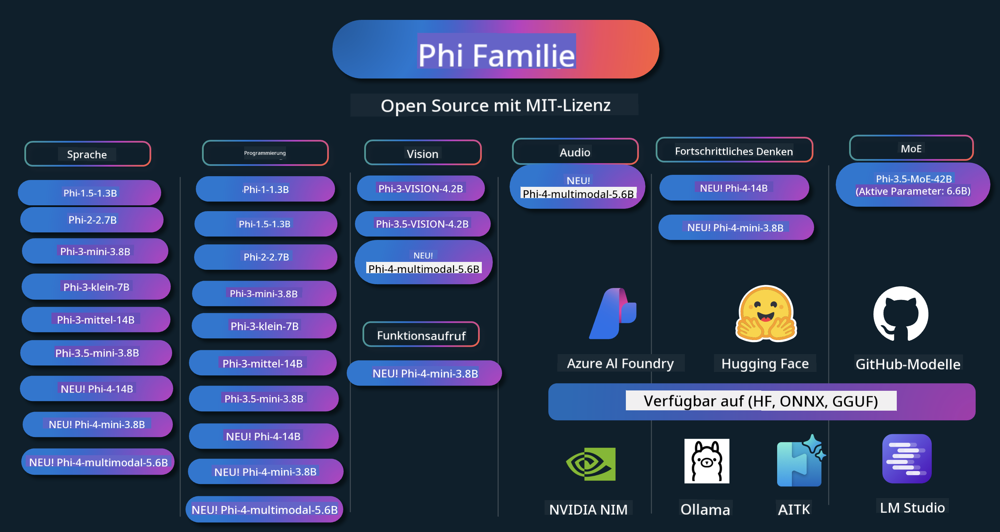

<!--
CO_OP_TRANSLATOR_METADATA:
{
  "original_hash": "1377ae1b0bc9daeaa6a989f750977aeb",
  "translation_date": "2025-03-27T02:52:07+00:00",
  "source_file": "README.md",
  "language_code": "de"
}
-->
# Phi Cookbook: Praktische Beispiele mit Microsofts Phi-Modellen

Phi ist eine Serie von Open-Source-AI-Modellen, die von Microsoft entwickelt wurden.

Phi ist derzeit das leistungsstärkste und kosteneffektivste kleine Sprachmodell (SLM) mit ausgezeichneten Benchmarks in Mehrsprachigkeit, logischem Denken, Text-/Chatgenerierung, Programmierung, Bildern, Audio und anderen Szenarien.

Sie können Phi in der Cloud oder auf Edge-Geräten bereitstellen und mit begrenzter Rechenleistung problemlos generative KI-Anwendungen erstellen.

Folgen Sie diesen Schritten, um diese Ressourcen zu nutzen:
1. **Repository forken**: Klicken Sie 
2. **Repository klonen**:   `git clone https://github.com/microsoft/PhiCookBook.git`
3. [**Treten Sie der Microsoft AI Discord Community bei und tauschen Sie sich mit Experten und anderen Entwicklern aus**](https://discord.com/invite/ByRwuEEgH4?WT.mc_id=aiml-137032-kinfeylo)

## 🌐 Mehrsprachige Unterstützung
[Französisch](../fr/README.md) | [Spanisch](../es/README.md) | [Deutsch](./README.md) | [Russisch](../ru/README.md) | [Arabisch](../ar/README.md) | [Persisch (Farsi)](../fa/README.md) | [Urdu](../ur/README.md) | [Chinesisch (Vereinfacht)](../zh/README.md) | [Chinesisch (Traditionell, Macau)](../mo/README.md) | [Chinesisch (Traditionell, Hongkong)](../hk/README.md) | [Chinesisch (Traditionell, Taiwan)](../tw/README.md) | [Japanisch](../ja/README.md) | [Koreanisch](../ko/README.md) | [Hindi](../hi/README.md) | [Bengalisch](../bn/README.md) | [Marathi](../mr/README.md) | [Nepalesisch](../ne/README.md) | [Punjabi (Gurmukhi)](../pa/README.md) | [Portugiesisch (Portugal)](../pt/README.md) | [Portugiesisch (Brasilien)](../br/README.md) | [Italienisch](../it/README.md) | [Polnisch](../pl/README.md) | [Türkisch](../tr/README.md) | [Griechisch](../el/README.md) | [Thailändisch](../th/README.md) | [Schwedisch](../sv/README.md) | [Dänisch](../da/README.md) | [Norwegisch](../no/README.md) | [Finnisch](../fi/README.md) | [Niederländisch](../nl/README.md) | [Hebräisch](../he/README.md) | [Vietnamesisch](../vi/README.md) | [Indonesisch](../id/README.md) | [Malaiisch](../ms/README.md) | [Tagalog (Filipino)](../tl/README.md) | [Swahili](../sw/README.md) | [Ungarisch](../hu/README.md) | [Tschechisch](../cs/README.md) | [Slowakisch](../sk/README.md) | [Rumänisch](../ro/README.md) | [Bulgarisch](../bg/README.md) | [Serbisch (Kyrillisch)](../sr/README.md) | [Kroatisch](../hr/README.md) | [Slowenisch](../sl/README.md)
## Inhaltsverzeichnis

- Einführung
  - [Willkommen in der Phi-Familie](./md/01.Introduction/01/01.PhiFamily.md)
  - [Einrichtung Ihrer Umgebung](./md/01.Introduction/01/01.EnvironmentSetup.md)
  - [Verständnis der Schlüsseltechnologien](./md/01.Introduction/01/01.Understandingtech.md)
  - [KI-Sicherheit für Phi-Modelle](./md/01.Introduction/01/01.AISafety.md)
  - [Unterstützung durch Phi-Hardware](./md/01.Introduction/01/01.Hardwaresupport.md)
  - [Phi-Modelle & Verfügbarkeit auf verschiedenen Plattformen](./md/01.Introduction/01/01.Edgeandcloud.md)
  - [Verwendung von Guidance-ai und Phi](./md/01.Introduction/01/01.Guidance.md)
  - [GitHub Marketplace Modelle](https://github.com/marketplace/models)
  - [Azure AI Modellkatalog](https://ai.azure.com)

- Phi-Inferenz in verschiedenen Umgebungen
    - [Hugging Face](./md/01.Introduction/02/01.HF.md)
    - [GitHub Modelle](./md/01.Introduction/02/02.GitHubModel.md)
    - [Azure AI Foundry Modellkatalog](./md/01.Introduction/02/03.AzureAIFoundry.md)
    - [Ollama](./md/01.Introduction/02/04.Ollama.md)
    - [AI Toolkit VSCode (AITK)](./md/01.Introduction/02/05.AITK.md)
    - [NVIDIA NIM](./md/01.Introduction/02/06.NVIDIA.md)

- Phi-Familie Inferenz
    - [Phi-Inferenz auf iOS](./md/01.Introduction/03/iOS_Inference.md)
    - [Phi-Inferenz auf Android](./md/01.Introduction/03/Android_Inference.md)
    - [Phi-Inferenz auf Jetson](./md/01.Introduction/03/Jetson_Inference.md)
    - [Phi-Inferenz auf AI-PC](./md/01.Introduction/03/AIPC_Inference.md)
    - [Phi-Inferenz mit Apple MLX Framework](./md/01.Introduction/03/MLX_Inference.md)
    - [Phi-Inferenz auf lokalem Server](./md/01.Introduction/03/Local_Server_Inference.md)
    - [Phi-Inferenz auf Remote-Server mit AI Toolkit](./md/01.Introduction/03/Remote_Interence.md)
    - [Phi-Inferenz mit Rust](./md/01.Introduction/03/Rust_Inference.md)
    - [Phi--Vision-Inferenz lokal](./md/01.Introduction/03/Vision_Inference.md)
    - [Phi-Inferenz mit Kaito AKS, Azure Containers (offizielle Unterstützung)](./md/01.Introduction/03/Kaito_Inference.md)

- [Quantifizierung der Phi-Familie](./md/01.Introduction/04/QuantifyingPhi.md)
    - [Quantisierung von Phi-3.5 / 4 mit llama.cpp](./md/01.Introduction/04/UsingLlamacppQuantifyingPhi.md)
    - [Quantisierung von Phi-3.5 / 4 mit generativen KI-Erweiterungen für onnxruntime](./md/01.Introduction/04/UsingORTGenAIQuantifyingPhi.md)
    - [Quantisierung von Phi-3.5 / 4 mit Intel OpenVINO](./md/01.Introduction/04/UsingIntelOpenVINOQuantifyingPhi.md)
    - [Quantisierung von Phi-3.5 / 4 mit Apple MLX Framework](./md/01.Introduction/04/UsingAppleMLXQuantifyingPhi.md)

- Bewertung Phi
- [Response AI](./md/01.Introduction/05/ResponsibleAI.md)
    - [Azure AI Foundry für Evaluation](./md/01.Introduction/05/AIFoundry.md)
    - [Verwendung von Promptflow für Evaluation](./md/01.Introduction/05/Promptflow.md)
 
- RAG mit Azure AI Search
    - [Wie man Phi-4-mini und Phi-4-multimodal (RAG) mit Azure AI Search verwendet](https://github.com/microsoft/PhiCookBook/blob/main/code/06.E2E/E2E_Phi-4-RAG-Azure-AI-Search.ipynb)

- Phi-Anwendungsentwicklung Beispiele
  - Text- & Chat-Anwendungen
    - Phi-4 Beispiele 🆕
      - [📓] [Chat mit Phi-4-mini ONNX-Modell](./md/02.Application/01.TextAndChat/Phi4/ChatWithPhi4ONNX/README.md)
      - [Chat mit Phi-4 lokalem ONNX-Modell .NET](../../md/04.HOL/dotnet/src/LabsPhi4-Chat-01OnnxRuntime)
      - [Chat .NET Konsolen-App mit Phi-4 ONNX unter Verwendung von Semantic Kernel](../../md/04.HOL/dotnet/src/LabsPhi4-Chat-02SK)
    - Phi-3 / 3.5 Beispiele
      - [Lokaler Chatbot im Browser mit Phi3, ONNX Runtime Web und WebGPU](https://github.com/microsoft/onnxruntime-inference-examples/tree/main/js/chat)
      - [OpenVino Chat](./md/02.Application/01.TextAndChat/Phi3/E2E_OpenVino_Chat.md)
      - [Multi-Modell - Interaktives Phi-3-mini und OpenAI Whisper](./md/02.Application/01.TextAndChat/Phi3/E2E_Phi-3-mini_with_whisper.md)
      - [MLFlow - Erstellung eines Wrappers und Verwendung von Phi-3 mit MLFlow](./md//02.Application/01.TextAndChat/Phi3/E2E_Phi-3-MLflow.md)
      - [Modelloptimierung - Wie man das Phi-3-min-Modell für ONNX Runtime Web mit Olive optimiert](https://github.com/microsoft/Olive/tree/main/examples/phi3)
      - [WinUI3 App mit Phi-3 mini-4k-instruct-onnx](https://github.com/microsoft/Phi3-Chat-WinUI3-Sample/)
      - [WinUI3 Multi-Modell KI-gestützte Notizen-App Beispiel](https://github.com/microsoft/ai-powered-notes-winui3-sample)
      - [Feinabstimmung und Integration benutzerdefinierter Phi-3-Modelle mit Promptflow](./md/02.Application/01.TextAndChat/Phi3/E2E_Phi-3-FineTuning_PromptFlow_Integration.md)
      - [Feinabstimmung und Integration benutzerdefinierter Phi-3-Modelle mit Promptflow in Azure AI Foundry](./md/02.Application/01.TextAndChat/Phi3/E2E_Phi-3-FineTuning_PromptFlow_Integration_AIFoundry.md)
      - [Evaluation des Feinabgestimmten Phi-3 / Phi-3.5-Modells in Azure AI Foundry mit Fokus auf Microsofts Prinzipien für verantwortungsvolle KI](./md/02.Application/01.TextAndChat/Phi3/E2E_Phi-3-Evaluation_AIFoundry.md)
      - [📓] [Phi-3.5-mini-instruct Sprachvorhersage-Beispiel (Chinesisch/Englisch)](../../md/02.Application/01.TextAndChat/Phi3/phi3-instruct-demo.ipynb)
      - [Phi-3.5-Instruct WebGPU RAG Chatbot](./md/02.Application/01.TextAndChat/Phi3/WebGPUWithPhi35Readme.md)
      - [Verwendung von Windows GPU zur Erstellung einer Promptflow-Lösung mit Phi-3.5-Instruct ONNX](./md/02.Application/01.TextAndChat/Phi3/UsingPromptFlowWithONNX.md)
      - [Verwendung von Microsoft Phi-3.5 tflite zur Erstellung einer Android-App](./md/02.Application/01.TextAndChat/Phi3/UsingPhi35TFLiteCreateAndroidApp.md)
      - [Q&A .NET Beispiel mit lokalem ONNX Phi-3-Modell unter Verwendung von Microsoft.ML.OnnxRuntime](../../md/04.HOL/dotnet/src/LabsPhi301)
      - [Konsolen-Chat .NET App mit Semantic Kernel und Phi-3](../../md/04.HOL/dotnet/src/LabsPhi302)

  - Azure AI Inference SDK Code-basierte Beispiele 
    - Phi-4 Beispiele 🆕
      - [📓] [Projektcode generieren mit Phi-4-multimodal](./md/02.Application/02.Code/Phi4/GenProjectCode/README.md)
    - Phi-3 / 3.5 Beispiele
      - [Erstellen Sie Ihren eigenen Visual Studio Code GitHub Copilot Chat mit der Microsoft Phi-3-Familie](./md/02.Application/02.Code/Phi3/VSCodeExt/README.md)
      - [Erstellen Sie Ihren eigenen Visual Studio Code Chat Copilot-Agenten mit Phi-3.5 durch GitHub-Modelle](/md/02.Application/02.Code/Phi3/CreateVSCodeChatAgentWithGitHubModels.md)

  - Fortgeschrittene Argumentationsbeispiele
    - Phi-4 Beispiele 🆕
      - [📓] [Phi-4-mini Argumentationsbeispiele](./md/02.Application/03.AdvancedReasoning/Phi4/AdvancedResoningPhi4mini/README.md)
  
  - Demos
      - [Phi-4-mini Demos gehostet auf Hugging Face Spaces](https://huggingface.co/spaces/microsoft/phi-4-mini?WT.mc_id=aiml-137032-kinfeylo)
      - [Phi-4-multimodal Demos gehostet auf Hugging Face Spaces](https://huggingface.co/spaces/microsoft/phi-4-multimodal?WT.mc_id=aiml-137032-kinfeylo)
  - Vision Beispiele
    - Phi-4 Beispiele 🆕
      - [📓] [Verwenden von Phi-4-multimodal zum Lesen von Bildern und Generieren von Code](./md/02.Application/04.Vision/Phi4/CreateFrontend/README.md) 
    - Phi-3 / 3.5 Beispiele
-  [📓][Phi-3-vision-Image text to text](../../md/02.Application/04.Vision/Phi3/E2E_Phi-3-vision-image-text-to-text-online-endpoint.ipynb)
      - [Phi-3-vision-ONNX](https://onnxruntime.ai/docs/genai/tutorials/phi3-v.html)
      - [📓][Phi-3-vision CLIP Embedding](../../md/02.Application/04.Vision/Phi3/E2E_Phi-3-vision-image-text-to-text-online-endpoint.ipynb)
      - [DEMO: Phi-3 Recycling](https://github.com/jennifermarsman/PhiRecycling/)
      - [Phi-3-vision - Visueller Sprachassistent - mit Phi3-Vision und OpenVINO](https://docs.openvino.ai/nightly/notebooks/phi-3-vision-with-output.html)
      - [Phi-3 Vision Nvidia NIM](./md/02.Application/04.Vision/Phi3/E2E_Nvidia_NIM_Vision.md)
      - [Phi-3 Vision OpenVino](./md/02.Application/04.Vision/Phi3/E2E_OpenVino_Phi3Vision.md)
      - [📓][Phi-3.5 Vision Multi-Frame- oder Multi-Image-Beispiel](../../md/02.Application/04.Vision/Phi3/phi3-vision-demo.ipynb)
      - [Phi-3 Vision Lokales ONNX-Modell mit Microsoft.ML.OnnxRuntime .NET](../../md/04.HOL/dotnet/src/LabsPhi303)
      - [Menü-basiertes Phi-3 Vision Lokales ONNX-Modell mit Microsoft.ML.OnnxRuntime .NET](../../md/04.HOL/dotnet/src/LabsPhi304)

  - Audio-Beispiele
    - Phi-4 Beispiele 🆕
      - [📓] [Audio-Transkripte mit Phi-4-multimodal extrahieren](./md/02.Application/05.Audio/Phi4/Transciption/README.md)
      - [📓] [Phi-4-multimodal Audio-Beispiel](../../md/02.Application/05.Audio/Phi4/Siri/demo.ipynb)
      - [📓] [Phi-4-multimodal Sprachübersetzungs-Beispiel](../../md/02.Application/05.Audio/Phi4/Translate/demo.ipynb)
      - [.NET-Konsolenanwendung mit Phi-4-multimodal zur Analyse einer Audiodatei und Erstellung eines Transkripts](../../md/04.HOL/dotnet/src/LabsPhi4-MultiModal-02Audio)

  - MOE-Beispiele
    - Phi-3 / 3.5 Beispiele
      - [📓] [Phi-3.5 Mixture of Experts Modelle (MoEs) Social Media Beispiel](../../md/02.Application/06.MoE/Phi3/phi3_moe_demo.ipynb)
      - [📓] [Erstellen einer Retrieval-Augmented Generation (RAG)-Pipeline mit NVIDIA NIM Phi-3 MOE, Azure AI Search und LlamaIndex](../../md/02.Application/06.MoE/Phi3/azure-ai-search-nvidia-rag.ipynb)
  - Beispiele für Funktionsaufrufe
    - Phi-4 Beispiele 🆕
      -  [📓] [Funktionsaufrufe mit Phi-4-mini verwenden](./md/02.Application/07.FunctionCalling/Phi4/FunctionCallingBasic/README.md)
      -  [📓] [Funktionsaufrufe zur Erstellung von Multi-Agents mit Phi-4-mini verwenden](../../md/02.Application/07.FunctionCalling/Phi4/Multiagents/Phi_4_mini_multiagent.ipynb)
      -  [📓] [Funktionsaufrufe mit Ollama verwenden](../../md/02.Application/07.FunctionCalling/Phi4/Ollama/ollama_functioncalling.ipynb)
  - Multimodale Mischbeispiele
    - Phi-4 Beispiele 🆕
      -  [📓] [Phi-4-multimodal als Technologiejournalist verwenden](../../md/02.Application/08.Multimodel/Phi4/TechJournalist/phi_4_mm_audio_text_publish_news.ipynb)
      - [.NET-Konsolenanwendung mit Phi-4-multimodal zur Analyse von Bildern](../../md/04.HOL/dotnet/src/LabsPhi4-MultiModal-01Images)

- Fine-Tuning Phi-Beispiele
  - [Fine-Tuning-Szenarien](./md/03.FineTuning/FineTuning_Scenarios.md)
  - [Fine-Tuning vs RAG](./md/03.FineTuning/FineTuning_vs_RAG.md)
  - [Fine-Tuning: Phi-3 wird zum Branchenexperten](./md/03.FineTuning/LetPhi3gotoIndustriy.md)
  - [Fine-Tuning Phi-3 mit AI Toolkit für VS Code](./md/03.FineTuning/Finetuning_VSCodeaitoolkit.md)
  - [Fine-Tuning Phi-3 mit Azure Machine Learning Service](./md/03.FineTuning/Introduce_AzureML.md)
  - [Fine-Tuning Phi-3 mit Lora](./md/03.FineTuning/FineTuning_Lora.md)
  - [Fine-Tuning Phi-3 mit QLora](./md/03.FineTuning/FineTuning_Qlora.md)
  - [Fine-Tuning Phi-3 mit Azure AI Foundry](./md/03.FineTuning/FineTuning_AIFoundry.md)
  - [Fine-Tuning Phi-3 mit Azure ML CLI/SDK](./md/03.FineTuning/FineTuning_MLSDK.md)
- [Feinabstimmung mit Microsoft Olive](./md/03.FineTuning/FineTuning_MicrosoftOlive.md)  
  - [Praktische Übung: Feinabstimmung mit Microsoft Olive](./md/03.FineTuning/olive-lab/readme.md)  
  - [Feinabstimmung von Phi-3-vision mit Weights and Bias](./md/03.FineTuning/FineTuning_Phi-3-visionWandB.md)  
  - [Feinabstimmung von Phi-3 mit Apple MLX Framework](./md/03.FineTuning/FineTuning_MLX.md)  
  - [Feinabstimmung von Phi-3-vision (offizielle Unterstützung)](./md/03.FineTuning/FineTuning_Vision.md)  
  - [Feinabstimmung von Phi-3 mit Kaito AKS, Azure Containers (offizielle Unterstützung)](./md/03.FineTuning/FineTuning_Kaito.md)  
  - [Feinabstimmung von Phi-3 und 3.5 Vision](https://github.com/2U1/Phi3-Vision-Finetune)  

- Praktische Übung  
  - [Erkundung von Spitzentechnologien: LLMs, SLMs, lokale Entwicklung und mehr](https://github.com/microsoft/aitour-exploring-cutting-edge-models)  
  - [NLP-Potenzial entfesseln: Feinabstimmung mit Microsoft Olive](https://github.com/azure/Ignite_FineTuning_workshop)  

- Akademische Forschungsarbeiten und Veröffentlichungen  
  - [Textbooks Are All You Need II: phi-1.5 technischer Bericht](https://arxiv.org/abs/2309.05463)  
  - [Phi-3 technischer Bericht: Ein leistungsstarkes Sprachmodell direkt auf Ihrem Telefon](https://arxiv.org/abs/2404.14219)  
  - [Phi-4 technischer Bericht](https://arxiv.org/abs/2412.08905)  
  - [Phi-4-Mini technischer Bericht: Kompakte und dennoch leistungsstarke multimodale Sprachmodelle durch Mixture-of-LoRAs](https://arxiv.org/abs/2503.01743)  
  - [Optimierung kleiner Sprachmodelle für Funktionen im Fahrzeug](https://arxiv.org/abs/2501.02342)  
  - [(WhyPHI) Feinabstimmung von PHI-3 für Multiple-Choice-Fragen: Methodik, Ergebnisse und Herausforderungen](https://arxiv.org/abs/2501.01588)  

## Verwendung von Phi-Modellen  

### Phi auf Azure AI Foundry  

Erfahren Sie, wie Sie Microsoft Phi nutzen und End-to-End-Lösungen auf verschiedenen Hardwaregeräten erstellen können. Um Phi selbst auszuprobieren, starten Sie mit den Modellen und passen Sie Phi an Ihre Szenarien an, indem Sie den [Azure AI Foundry Azure AI Model Catalog](https://aka.ms/phi3-azure-ai) verwenden. Weitere Informationen finden Sie unter [Erste Schritte mit Azure AI Foundry](/md/02.QuickStart/AzureAIFoundry_QuickStart.md).  

**Playground**  
Jedes Modell verfügt über einen eigenen Playground, um das Modell zu testen: [Azure AI Playground](https://aka.ms/try-phi3).  

### Phi auf GitHub Models  

Erfahren Sie, wie Sie Microsoft Phi nutzen und End-to-End-Lösungen auf verschiedenen Hardwaregeräten erstellen können. Um Phi selbst auszuprobieren, starten Sie mit dem Modell und passen Sie Phi an Ihre Szenarien an, indem Sie den [GitHub Model Catalog](https://github.com/marketplace/models?WT.mc_id=aiml-137032-kinfeylo) verwenden. Weitere Informationen finden Sie unter [Erste Schritte mit GitHub Model Catalog](/md/02.QuickStart/GitHubModel_QuickStart.md).  

**Playground**  
Jedes Modell verfügt über einen eigenen [Playground, um das Modell zu testen](/md/02.QuickStart/GitHubModel_QuickStart.md).  

### Phi auf Hugging Face  

Das Modell ist auch auf [Hugging Face](https://huggingface.co/microsoft) verfügbar.  

**Playground**  
[Hugging Chat Playground](https://huggingface.co/chat/models/microsoft/Phi-3-mini-4k-instruct)  

## Verantwortungsbewusste KI  

Microsoft engagiert sich dafür, unseren Kunden zu helfen, unsere KI-Produkte verantwortungsvoll zu nutzen, unsere Erkenntnisse zu teilen und vertrauensbasierte Partnerschaften durch Tools wie Transparenznotizen und Folgenabschätzungen aufzubauen. Viele dieser Ressourcen finden Sie unter [https://aka.ms/RAI](https://aka.ms/RAI).  
Der Ansatz von Microsoft zu verantwortungsvoller KI basiert auf unseren KI-Prinzipien: Fairness, Zuverlässigkeit und Sicherheit, Datenschutz und Sicherheit, Inklusivität, Transparenz und Verantwortlichkeit.  

Groß angelegte Modelle für natürliche Sprache, Bilder und Sprache - wie die in diesem Beispiel verwendeten - können potenziell unfair, unzuverlässig oder beleidigend agieren und dadurch Schaden verursachen. Bitte konsultieren Sie die [Transparenznotiz des Azure OpenAI-Dienstes](https://learn.microsoft.com/legal/cognitive-services/openai/transparency-note?tabs=text), um sich über Risiken und Einschränkungen zu informieren.  

Der empfohlene Ansatz zur Risikominderung besteht darin, ein Sicherheitssystem in Ihre Architektur einzubauen, das schädliches Verhalten erkennen und verhindern kann. [Azure AI Content Safety](https://learn.microsoft.com/azure/ai-services/content-safety/overview) bietet eine unabhängige Schutzebene, die in der Lage ist, schädliche nutzer- und KI-generierte Inhalte in Anwendungen und Diensten zu erkennen. Azure AI Content Safety umfasst Text- und Bild-APIs, mit denen Sie schädliches Material erkennen können. Innerhalb von Azure AI Foundry ermöglicht der Content Safety-Dienst die Ansicht, Erkundung und das Ausprobieren von Beispielcode zur Erkennung schädlicher Inhalte in verschiedenen Modalitäten. Die folgende [Schnellstart-Dokumentation](https://learn.microsoft.com/azure/ai-services/content-safety/quickstart-text?tabs=visual-studio%2Clinux&pivots=programming-language-rest) führt Sie durch die Anfragen an den Dienst.  

Ein weiterer zu berücksichtigender Aspekt ist die Gesamtleistung der Anwendung. Bei multimodalen und multi-modellen Anwendungen bedeutet Leistung, dass das System wie von Ihnen und Ihren Nutzern erwartet funktioniert, einschließlich der Vermeidung schädlicher Ausgaben. Es ist wichtig, die Leistung Ihrer gesamten Anwendung mit [Performance- und Qualitäts- sowie Risiko- und Sicherheitsbewertungen](https://learn.microsoft.com/azure/ai-studio/concepts/evaluation-metrics-built-in) zu bewerten. Sie haben auch die Möglichkeit, [benutzerdefinierte Evaluatoren](https://learn.microsoft.com/azure/ai-studio/how-to/develop/evaluate-sdk#custom-evaluators) zu erstellen und zu bewerten.  
Sie können Ihre KI-Anwendung in Ihrer Entwicklungsumgebung mit dem [Azure AI Evaluation SDK](https://microsoft.github.io/promptflow/index.html) evaluieren. Mit einem Testdatensatz oder einem Ziel werden die Generierungen Ihrer generativen KI-Anwendung quantitativ mit integrierten oder benutzerdefinierten Evaluatoren Ihrer Wahl gemessen. Um mit dem Azure AI Evaluation SDK zu beginnen und Ihr System zu evaluieren, können Sie der [Schnellstartanleitung](https://learn.microsoft.com/azure/ai-studio/how-to/develop/flow-evaluate-sdk) folgen. Nachdem Sie eine Evaluierung ausgeführt haben, können Sie [die Ergebnisse in Azure AI Foundry visualisieren](https://learn.microsoft.com/azure/ai-studio/how-to/evaluate-flow-results).

## Marken

Dieses Projekt kann Marken oder Logos für Projekte, Produkte oder Dienstleistungen enthalten. Die autorisierte Nutzung von Microsoft-Marken oder -Logos unterliegt den [Microsoft Trademark & Brand Guidelines](https://www.microsoft.com/legal/intellectualproperty/trademarks/usage/general) und muss diesen folgen. Die Verwendung von Microsoft-Marken oder -Logos in modifizierten Versionen dieses Projekts darf keine Verwirrung stiften oder eine Unterstützung durch Microsoft implizieren. Jegliche Nutzung von Marken oder Logos Dritter unterliegt den Richtlinien der jeweiligen Drittanbieter.

**Haftungsausschluss**:  
Dieses Dokument wurde mit dem KI-Übersetzungsdienst [Co-op Translator](https://github.com/Azure/co-op-translator) übersetzt. Obwohl wir uns um Genauigkeit bemühen, weisen wir darauf hin, dass automatisierte Übersetzungen Fehler oder Ungenauigkeiten enthalten können. Das Originaldokument in seiner ursprünglichen Sprache sollte als maßgebliche Quelle betrachtet werden. Für kritische Informationen wird eine professionelle menschliche Übersetzung empfohlen. Wir übernehmen keine Haftung für Missverständnisse oder Fehlinterpretationen, die sich aus der Nutzung dieser Übersetzung ergeben.