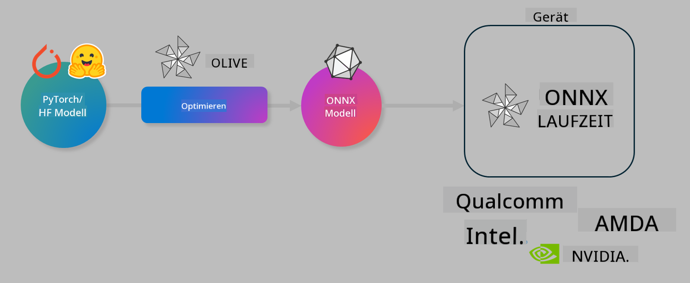

<!--
CO_OP_TRANSLATOR_METADATA:
{
  "original_hash": "6bbe47de3b974df7eea29dfeccf6032b",
  "translation_date": "2025-03-27T03:31:12+00:00",
  "source_file": "code\\03.Finetuning\\olive-lab\\readme.md",
  "language_code": "de"
}
-->
# Lab. Optimieren von KI-Modellen für die lokale Inferenz

## Einführung

> [!IMPORTANT]
> Dieses Lab erfordert eine **Nvidia A10 oder A100 GPU** mit den zugehörigen Treibern und installiertem CUDA Toolkit (Version 12+).

> [!NOTE]
> Dieses Lab dauert **35 Minuten** und bietet eine praktische Einführung in die Kernkonzepte der Optimierung von Modellen für die lokale Inferenz mit OLIVE.

## Lernziele

Am Ende dieses Labs können Sie OLIVE nutzen, um:

- Ein KI-Modell mit der AWQ-Quantisierungsmethode zu quantisieren.
- Ein KI-Modell für eine spezifische Aufgabe zu optimieren.
- LoRA-Adapter (feinabgestimmtes Modell) für effiziente lokale Inferenz mit ONNX Runtime zu generieren.

### Was ist Olive?

Olive (*O*NNX *live*) ist ein Toolkit zur Modelloptimierung mit einer zugehörigen CLI, das Ihnen ermöglicht, Modelle für die ONNX Runtime +++https://onnxruntime.ai+++ mit hoher Qualität und Leistung bereitzustellen.



Der Input für Olive ist typischerweise ein PyTorch- oder Hugging Face-Modell, und der Output ist ein optimiertes ONNX-Modell, das auf einem Gerät (Bereitstellungsziel) mit der ONNX Runtime ausgeführt wird. Olive optimiert das Modell für den KI-Beschleuniger des Bereitstellungsziels (NPU, GPU, CPU), der von einem Hardwareanbieter wie Qualcomm, AMD, Nvidia oder Intel bereitgestellt wird.

Olive führt einen *Workflow* aus, der eine geordnete Sequenz einzelner Modelloptimierungsaufgaben namens *Pässe* darstellt – Beispiele für Pässe sind: Modellkompression, Graph-Capture, Quantisierung, Graph-Optimierung. Jeder Pass hat eine Reihe von Parametern, die abgestimmt werden können, um die besten Metriken, wie Genauigkeit und Latenz, zu erreichen, die von den jeweiligen Evaluatoren bewertet werden. Olive verwendet eine Suchstrategie mit einem Suchalgorithmus, um jeden Pass einzeln oder mehrere Pässe zusammen automatisch zu optimieren.

#### Vorteile von Olive

- **Weniger Frustration und Zeitaufwand** durch manuelle Experimente mit verschiedenen Techniken für Graph-Optimierung, Kompression und Quantisierung. Definieren Sie Ihre Qualitäts- und Leistungsanforderungen und lassen Sie Olive automatisch das beste Modell für Sie finden.
- **Über 40 eingebaute Modelloptimierungskomponenten**, die moderne Techniken wie Quantisierung, Kompression, Graph-Optimierung und Feinabstimmung abdecken.
- **Einfach zu bedienende CLI** für gängige Modelloptimierungsaufgaben, z. B. olive quantize, olive auto-opt, olive finetune.
- Integrierte Modellverpackung und Bereitstellung.
- Unterstützung für die Generierung von Modellen für **Multi-LoRA-Serving**.
- Workflows mit YAML/JSON erstellen, um Modelloptimierungs- und Bereitstellungsaufgaben zu orchestrieren.
- **Hugging Face**- und **Azure AI**-Integration.
- Eingebaute **Caching**-Mechanismen zur **Kostenersparnis**.

## Lab-Anweisungen
> [!NOTE]
> Stellen Sie sicher, dass Sie Ihren Azure AI Hub und Ihr Projekt bereitgestellt und Ihre A100-Compute-Instanz wie in Lab 1 eingerichtet haben.

### Schritt 0: Verbindung zu Ihrer Azure AI Compute herstellen

Stellen Sie eine Verbindung zur Azure AI Compute-Instanz her, indem Sie die Remote-Funktion in **VS Code** verwenden.

1. Öffnen Sie Ihre **VS Code** Desktop-Anwendung:
1. Öffnen Sie die **Befehlspalette** mit **Shift+Ctrl+P**.
1. Suchen Sie in der Befehlspalette nach **AzureML - remote: Connect to compute instance in New Window**.
1. Folgen Sie den Anweisungen auf dem Bildschirm, um die Verbindung zur Compute-Instanz herzustellen. Dies beinhaltet die Auswahl Ihres Azure-Abonnements, der Ressourcengruppe, des Projekts und des Compute-Namens, den Sie in Lab 1 eingerichtet haben.
1. Sobald Sie mit Ihrem Azure ML Compute-Knoten verbunden sind, wird dies **unten links in Visual Code** angezeigt `><Azure ML: Compute Name`.

### Schritt 1: Dieses Repository klonen

In VS Code können Sie ein neues Terminal mit **Ctrl+J** öffnen und dieses Repository klonen:

Im Terminal sollten Sie die Eingabeaufforderung sehen:

```
azureuser@computername:~/cloudfiles/code$ 
```
Lösen Sie das Repository:

```bash
cd ~/localfiles
git clone https://github.com/microsoft/phi-3cookbook.git
```

### Schritt 2: Ordner in VS Code öffnen

Um VS Code im entsprechenden Ordner zu öffnen, führen Sie den folgenden Befehl im Terminal aus, der ein neues Fenster öffnet:

```bash
code phi-3cookbook/code/04.Finetuning/Olive-lab
```

Alternativ können Sie den Ordner öffnen, indem Sie **Datei** > **Ordner öffnen** auswählen.

### Schritt 3: Abhängigkeiten installieren

Öffnen Sie ein Terminalfenster in VS Code in Ihrer Azure AI Compute-Instanz (Tipp: **Ctrl+J**) und führen Sie die folgenden Befehle aus, um die Abhängigkeiten zu installieren:

```bash
conda create -n olive-ai python=3.11 -y
conda activate olive-ai
pip install -r requirements.txt
az extension remove -n azure-cli-ml
az extension add -n ml
```

> [!NOTE]
> Die Installation aller Abhängigkeiten dauert etwa **5 Minuten**.

In diesem Lab laden Sie Modelle herunter und hoch, um sie in den Azure AI Model-Katalog aufzunehmen. Damit Sie auf den Modellkatalog zugreifen können, müssen Sie sich bei Azure anmelden:

```bash
az login
```

> [!NOTE]
> Während der Anmeldung werden Sie aufgefordert, Ihr Abonnement auszuwählen. Stellen Sie sicher, dass Sie das für dieses Lab bereitgestellte Abonnement auswählen.

### Schritt 4: Olive-Befehle ausführen

Öffnen Sie ein Terminalfenster in VS Code in Ihrer Azure AI Compute-Instanz (Tipp: **Ctrl+J**) und stellen Sie sicher, dass die `olive-ai` Conda-Umgebung aktiviert ist:

```bash
conda activate olive-ai
```

Führen Sie anschließend die folgenden Olive-Befehle in der Befehlszeile aus.

1. **Daten inspizieren:** In diesem Beispiel werden Sie das Phi-3.5-Mini-Modell feinabstimmen, sodass es auf die Beantwortung von reisebezogenen Fragen spezialisiert ist. Der folgende Code zeigt die ersten Datensätze des Datasets, das im JSON-Lines-Format vorliegt:

    ```bash
    head data/data_sample_travel.jsonl
    ```
1. **Modell quantisieren:** Bevor das Modell trainiert wird, wird es zunächst mit dem folgenden Befehl quantisiert, der eine Technik namens Active Aware Quantization (AWQ) +++https://arxiv.org/abs/2306.00978+++ verwendet. AWQ quantisiert die Gewichte eines Modells, indem die Aktivierungen berücksichtigt werden, die während der Inferenz erzeugt werden. Dies bedeutet, dass der Quantisierungsprozess die tatsächliche Datenverteilung in den Aktivierungen berücksichtigt, was zu einer besseren Erhaltung der Modellgenauigkeit im Vergleich zu herkömmlichen Gewicht-Quantisierungsmethoden führt.

    ```bash
    olive quantize \
       --model_name_or_path microsoft/Phi-3.5-mini-instruct \
       --trust_remote_code \
       --algorithm awq \
       --output_path models/phi/awq \
       --log_level 1
    ```

    Es dauert **~8 Minuten**, um die AWQ-Quantisierung abzuschließen, wodurch die Modellgröße von **~7,5 GB auf ~2,5 GB** reduziert wird.

    In diesem Lab zeigen wir Ihnen, wie Sie Modelle von Hugging Face eingeben können (z. B. `microsoft/Phi-3.5-mini-instruct`). However, Olive also allows you to input models from the Azure AI catalog by updating the `model_name_or_path` argument to an Azure AI asset ID (for example:  `azureml://registries/azureml/models/Phi-3.5-mini-instruct/versions/4`). 

1. **Train the model:** Next, the `olive finetune`-Befehl optimiert das quantisierte Modell. Die Quantisierung des Modells *vor* der Feinabstimmung statt danach führt zu besserer Genauigkeit, da der Feinabstimmungsprozess einige der Verluste aus der Quantisierung wiederherstellt.

    ```bash
    olive finetune \
        --method lora \
        --model_name_or_path models/phi/awq \
        --data_files "data/data_sample_travel.jsonl" \
        --data_name "json" \
        --text_template "<|user|>\n{prompt}<|end|>\n<|assistant|>\n{response}<|end|>" \
        --max_steps 100 \
        --output_path ./models/phi/ft \
        --log_level 1
    ```

    Es dauert **~6 Minuten**, um die Feinabstimmung (mit 100 Schritten) abzuschließen.

1. **Optimieren:** Nachdem das Modell trainiert wurde, optimieren Sie das Modell nun mit Olives `auto-opt` command, which will capture the ONNX graph and automatically perform a number of optimizations to improve the model performance for CPU by compressing the model and doing fusions. It should be noted, that you can also optimize for other devices such as NPU or GPU by just updating the `--device` and `--provider`-Argumenten - für die Zwecke dieses Labs verwenden wir jedoch die CPU.

    ```bash
    olive auto-opt \
       --model_name_or_path models/phi/ft/model \
       --adapter_path models/phi/ft/adapter \
       --device cpu \
       --provider CPUExecutionProvider \
       --use_ort_genai \
       --output_path models/phi/onnx-ao \
       --log_level 1
    ```

    Es dauert **~5 Minuten**, um die Optimierung abzuschließen.

### Schritt 5: Schneller Test der Modellinferenz

Um die Inferenz des Modells zu testen, erstellen Sie eine Python-Datei in Ihrem Ordner namens **app.py** und kopieren Sie den folgenden Code hinein:

```python
import onnxruntime_genai as og
import numpy as np

print("loading model and adapters...", end="", flush=True)
model = og.Model("models/phi/onnx-ao/model")
adapters = og.Adapters(model)
adapters.load("models/phi/onnx-ao/model/adapter_weights.onnx_adapter", "travel")
print("DONE!")

tokenizer = og.Tokenizer(model)
tokenizer_stream = tokenizer.create_stream()

params = og.GeneratorParams(model)
params.set_search_options(max_length=100, past_present_share_buffer=False)
user_input = "what is the best thing to see in chicago"
params.input_ids = tokenizer.encode(f"<|user|>\n{user_input}<|end|>\n<|assistant|>\n")

generator = og.Generator(model, params)

generator.set_active_adapter(adapters, "travel")

print(f"{user_input}")

while not generator.is_done():
    generator.compute_logits()
    generator.generate_next_token()

    new_token = generator.get_next_tokens()[0]
    print(tokenizer_stream.decode(new_token), end='', flush=True)

print("\n")
```

Führen Sie den Code aus mit:

```bash
python app.py
```

### Schritt 6: Modell in Azure AI hochladen

Das Hochladen des Modells in ein Azure AI-Modellrepository macht das Modell für andere Mitglieder Ihres Entwicklungsteams zugänglich und ermöglicht auch die Versionskontrolle des Modells. Um das Modell hochzuladen, führen Sie den folgenden Befehl aus:

> [!NOTE]
> Aktualisieren Sie die `{}`-Platzhalter für Ressourcengruppe und Azure AI-Projektname und führen Sie den folgenden Befehl aus:

```
az ml workspace show
```

Oder gehen Sie zu +++ai.azure.com+++ und wählen **Management Center** > **Projekt** > **Übersicht**.

Aktualisieren Sie die `{}`-Platzhalter mit dem Namen Ihrer Ressourcengruppe und Ihres Azure AI-Projektnamens.

```bash
az ml model create \
    --name ft-for-travel \
    --version 1 \
    --path ./models/phi/onnx-ao \
    --resource-group {RESOURCE_GROUP_NAME} \
    --workspace-name {PROJECT_NAME}
```
Sie können dann Ihr hochgeladenes Modell sehen und es unter https://ml.azure.com/model/list bereitstellen.

**Haftungsausschluss**:  
Dieses Dokument wurde mithilfe des KI-Übersetzungsdienstes [Co-op Translator](https://github.com/Azure/co-op-translator) übersetzt. Obwohl wir uns um Genauigkeit bemühen, weisen wir darauf hin, dass automatisierte Übersetzungen Fehler oder Ungenauigkeiten enthalten können. Das Originaldokument in seiner ursprünglichen Sprache sollte als maßgebliche Quelle betrachtet werden. Für kritische Informationen wird eine professionelle menschliche Übersetzung empfohlen. Wir übernehmen keine Haftung für Missverständnisse oder Fehlinterpretationen, die sich aus der Nutzung dieser Übersetzung ergeben.