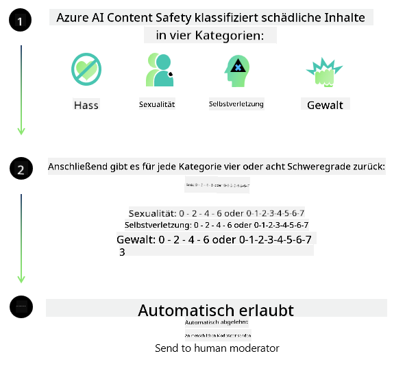
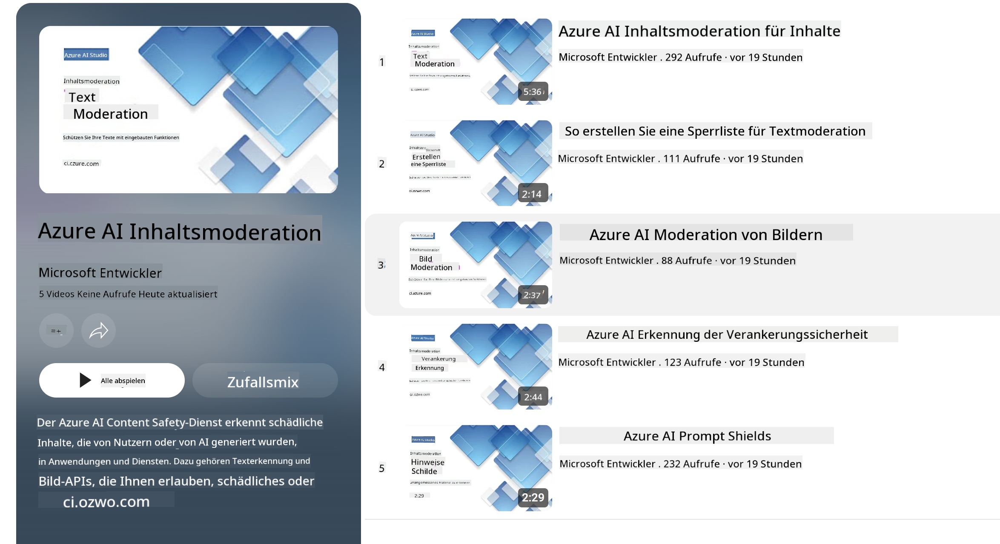

<!--
CO_OP_TRANSLATOR_METADATA:
{
  "original_hash": "c8273672cc57df2be675407a1383aaf0",
  "translation_date": "2025-03-27T05:20:37+00:00",
  "source_file": "md\\01.Introduction\\01\\01.AISafety.md",
  "language_code": "de"
}
-->
# KI-Sicherheit für Phi-Modelle

Die Phi-Modellreihe wurde gemäß dem [Microsoft Responsible AI Standard](https://query.prod.cms.rt.microsoft.com/cms/api/am/binary/RE5cmFl) entwickelt, einem unternehmensweiten Satz von Anforderungen, der auf den folgenden sechs Prinzipien basiert: Verantwortlichkeit, Transparenz, Fairness, Zuverlässigkeit und Sicherheit, Datenschutz und Sicherheit sowie Inklusivität, die die [Prinzipien für verantwortungsvolle KI von Microsoft](https://www.microsoft.com/ai/responsible-ai) bilden.

Wie bei den vorherigen Phi-Modellen wurde ein mehrschichtiger Sicherheitsbewertungs- und Sicherheitsnachschulungsansatz verfolgt, wobei zusätzliche Maßnahmen ergriffen wurden, um die mehrsprachigen Fähigkeiten dieser Veröffentlichung zu berücksichtigen. Unser Ansatz für Sicherheitstraining und Bewertungen, einschließlich Tests in mehreren Sprachen und Risikokategorien, ist im [Phi Safety Post-Training Paper](https://arxiv.org/abs/2407.13833) beschrieben. Obwohl die Phi-Modelle von diesem Ansatz profitieren, sollten Entwickler bewährte Praktiken für verantwortungsvolle KI anwenden, einschließlich der Kartierung, Messung und Minderung von Risiken, die mit ihrem spezifischen Anwendungsfall sowie dem kulturellen und sprachlichen Kontext verbunden sind.

## Bewährte Praktiken

Wie andere Modelle können auch die Phi-Modelle potenziell auf eine Weise agieren, die unfair, unzuverlässig oder beleidigend ist.

Einige der einschränkenden Verhaltensweisen von SLMs und LLMs, die Sie beachten sollten, umfassen:

- **Dienstqualität:** Die Phi-Modelle wurden hauptsächlich mit englischen Texten trainiert. Für Sprachen, die nicht Englisch sind, wird die Leistung schlechter sein. Englische Sprachvarianten, die in den Trainingsdaten weniger vertreten sind, könnten schlechter abschneiden als Standardamerikanisches Englisch.
- **Darstellung von Schäden & Verstärkung von Stereotypen:** Diese Modelle können Gruppen von Menschen über- oder unterrepräsentieren, die Darstellung bestimmter Gruppen auslöschen oder herabwürdigende oder negative Stereotypen verstärken. Trotz Sicherheitsnachschulung können diese Einschränkungen weiterhin bestehen, da unterschiedliche Gruppen unterschiedlich stark repräsentiert sind oder Beispiele für negative Stereotypen in den Trainingsdaten realen Mustern und gesellschaftlichen Vorurteilen entsprechen.
- **Unangemessener oder beleidigender Inhalt:** Diese Modelle können andere Arten von unangemessenem oder beleidigendem Inhalt erzeugen, was sie für sensible Kontexte ohne zusätzliche, anwendungsfallspezifische Maßnahmen ungeeignet machen könnte.
- **Informationszuverlässigkeit:** Sprachmodelle können unsinnige Inhalte erzeugen oder Inhalte erfinden, die vernünftig klingen, aber ungenau oder veraltet sind.
- **Eingeschränkter Umfang für Code:** Der Großteil der Trainingsdaten von Phi-3 basiert auf Python und verwendet gängige Pakete wie "typing, math, random, collections, datetime, itertools". Wenn das Modell Python-Skripte generiert, die andere Pakete oder Skripte in anderen Sprachen verwenden, empfehlen wir dringend, dass Nutzer alle API-Verwendungen manuell überprüfen.

Entwickler sollten bewährte Praktiken für verantwortungsvolle KI anwenden und sicherstellen, dass ein spezifischer Anwendungsfall den relevanten Gesetzen und Vorschriften (z. B. Datenschutz, Handel usw.) entspricht.

## Überlegungen zur verantwortungsvollen KI

Wie andere Sprachmodelle können auch die Phi-Modelle potenziell auf eine Weise agieren, die unfair, unzuverlässig oder beleidigend ist. Einige der einschränkenden Verhaltensweisen, die Sie beachten sollten, umfassen:

**Dienstqualität:** Die Phi-Modelle wurden hauptsächlich mit englischen Texten trainiert. Für Sprachen, die nicht Englisch sind, wird die Leistung schlechter sein. Englische Sprachvarianten, die in den Trainingsdaten weniger vertreten sind, könnten schlechter abschneiden als Standardamerikanisches Englisch.

**Darstellung von Schäden & Verstärkung von Stereotypen:** Diese Modelle können Gruppen von Menschen über- oder unterrepräsentieren, die Darstellung bestimmter Gruppen auslöschen oder herabwürdigende oder negative Stereotypen verstärken. Trotz Sicherheitsnachschulung können diese Einschränkungen weiterhin bestehen, da unterschiedliche Gruppen unterschiedlich stark repräsentiert sind oder Beispiele für negative Stereotypen in den Trainingsdaten realen Mustern und gesellschaftlichen Vorurteilen entsprechen.

**Unangemessener oder beleidigender Inhalt:** Diese Modelle können andere Arten von unangemessenem oder beleidigendem Inhalt erzeugen, was sie für sensible Kontexte ohne zusätzliche, anwendungsfallspezifische Maßnahmen ungeeignet machen könnte.

**Informationszuverlässigkeit:** Sprachmodelle können unsinnige Inhalte erzeugen oder Inhalte erfinden, die vernünftig klingen, aber ungenau oder veraltet sind.

**Eingeschränkter Umfang für Code:** Der Großteil der Trainingsdaten von Phi-3 basiert auf Python und verwendet gängige Pakete wie "typing, math, random, collections, datetime, itertools". Wenn das Modell Python-Skripte generiert, die andere Pakete oder Skripte in anderen Sprachen verwenden, empfehlen wir dringend, dass Nutzer alle API-Verwendungen manuell überprüfen.

Entwickler sollten bewährte Praktiken für verantwortungsvolle KI anwenden und sicherstellen, dass ein spezifischer Anwendungsfall den relevanten Gesetzen und Vorschriften (z. B. Datenschutz, Handel usw.) entspricht. Wichtige Überlegungen umfassen:

**Zuweisung:** Modelle sind möglicherweise nicht geeignet für Szenarien, die einen wesentlichen Einfluss auf den rechtlichen Status oder die Zuweisung von Ressourcen oder Lebenschancen haben könnten (z. B. Wohnraum, Beschäftigung, Kredit usw.), ohne weitere Bewertungen und zusätzliche Techniken zur Vorurteilsreduzierung.

**Hochrisiko-Szenarien:** Entwickler sollten die Eignung der Modelle für Hochrisiko-Szenarien bewerten, bei denen unfaire, unzuverlässige oder beleidigende Ausgaben extrem kostspielig sein oder Schaden verursachen könnten. Dazu gehört das Geben von Ratschlägen in sensiblen oder fachlichen Bereichen, in denen Genauigkeit und Zuverlässigkeit entscheidend sind (z. B. Rechts- oder Gesundheitsberatung). Zusätzliche Schutzmaßnahmen sollten auf Anwendungsebene entsprechend dem Bereitstellungskontext implementiert werden.

**Fehlinformationen:** Modelle können ungenaue Informationen erzeugen. Entwickler sollten bewährte Transparenzpraktiken anwenden und Endnutzern mitteilen, dass sie mit einem KI-System interagieren. Auf Anwendungsebene können Entwickler Feedback-Mechanismen und Pipelines implementieren, um Antworten in anwendungsspezifischen, kontextuellen Informationen zu verankern, eine Technik, die als Retrieval Augmented Generation (RAG) bekannt ist.

**Erzeugung von schädlichen Inhalten:** Entwickler sollten die Ausgaben im Kontext bewerten und verfügbare Sicherheitsklassifizierer oder benutzerdefinierte Lösungen verwenden, die für ihren Anwendungsfall geeignet sind.

**Missbrauch:** Andere Formen von Missbrauch wie Betrug, Spam oder Malware-Produktion könnten möglich sein, und Entwickler sollten sicherstellen, dass ihre Anwendungen keine geltenden Gesetze und Vorschriften verletzen.

### Feinabstimmung und KI-Inhaltssicherheit

Nach der Feinabstimmung eines Modells empfehlen wir dringend, die Maßnahmen von [Azure AI Content Safety](https://learn.microsoft.com/azure/ai-services/content-safety/overview) zu nutzen, um die von den Modellen generierten Inhalte zu überwachen und potenzielle Risiken, Bedrohungen und Qualitätsprobleme zu identifizieren und zu blockieren.

[Azure AI Content Safety](https://learn.microsoft.com/azure/ai-services/content-safety/overview) unterstützt sowohl Text- als auch Bildinhalte. Es kann in der Cloud, in getrennten Containern und auf Edge-/Embedded-Geräten bereitgestellt werden.

## Übersicht über Azure AI Content Safety

Azure AI Content Safety ist keine Einheitslösung für alle; es kann an die spezifischen Richtlinien eines Unternehmens angepasst werden. Darüber hinaus ermöglichen seine mehrsprachigen Modelle, mehrere Sprachen gleichzeitig zu verstehen.

- **Azure AI Content Safety**
- **Microsoft Developer**
- **5 Videos**

Der Azure AI Content Safety-Dienst erkennt schädliche von Nutzern und KI generierte Inhalte in Anwendungen und Diensten. Er umfasst Text- und Bild-APIs, die es ermöglichen, schädliches oder unangemessenes Material zu erkennen.

[AI Content Safety Playlist](https://www.youtube.com/playlist?list=PLlrxD0HtieHjaQ9bJjyp1T7FeCbmVcPkQ)

**Haftungsausschluss**:  
Dieses Dokument wurde mithilfe des KI-Übersetzungsdienstes [Co-op Translator](https://github.com/Azure/co-op-translator) übersetzt. Obwohl wir uns um Genauigkeit bemühen, beachten Sie bitte, dass automatisierte Übersetzungen Fehler oder Ungenauigkeiten enthalten können. Das Originaldokument in seiner ursprünglichen Sprache sollte als maßgebliche Quelle betrachtet werden. Für kritische Informationen wird eine professionelle menschliche Übersetzung empfohlen. Wir übernehmen keine Haftung für Missverständnisse oder Fehlinterpretationen, die durch die Nutzung dieser Übersetzung entstehen.