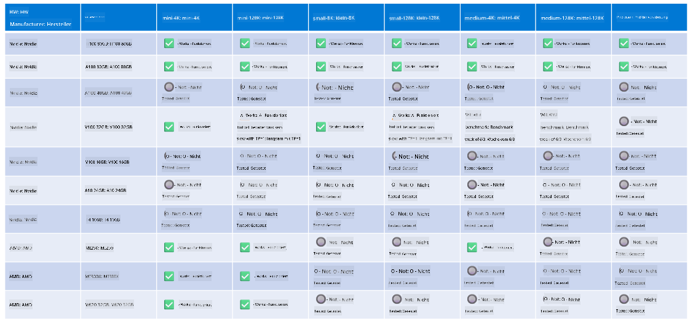

<!--
CO_OP_TRANSLATOR_METADATA:
{
  "original_hash": "8cdc17ce0f10535da30b53d23fe1a795",
  "translation_date": "2025-03-27T05:52:20+00:00",
  "source_file": "md\\01.Introduction\\01\\01.Hardwaresupport.md",
  "language_code": "de"
}
-->
# Phi-Hardware-Unterstützung

Microsoft Phi wurde für ONNX Runtime optimiert und unterstützt Windows DirectML. Es funktioniert gut auf verschiedenen Hardwaretypen, einschließlich GPUs, CPUs und sogar mobilen Geräten.

## Gerätehardware
Die unterstützte Hardware umfasst speziell:

- GPU SKU: RTX 4090 (DirectML)
- GPU SKU: 1 A100 80GB (CUDA)
- CPU SKU: Standard F64s v2 (64 vCPUs, 128 GiB Speicher)

## Mobile SKU

- Android - Samsung Galaxy S21
- Apple iPhone 14 oder höher mit A16/A17 Prozessor

## Phi-Hardwarespezifikationen

- Minimale erforderliche Konfiguration.
- Windows: DirectX 12-fähige GPU und mindestens 4 GB kombinierter RAM

CUDA: NVIDIA GPU mit Compute Capability >= 7.02



## Ausführung von onnxruntime auf mehreren GPUs

Die derzeit verfügbaren Phi ONNX-Modelle sind nur für eine GPU ausgelegt. Es ist möglich, Multi-GPU-Unterstützung für Phi-Modelle zu implementieren, jedoch garantiert ORT mit 2 GPUs nicht, dass es eine höhere Durchsatzrate liefert als 2 separate ORT-Instanzen. Bitte besuchen Sie [ONNX Runtime](https://onnxruntime.ai/) für die neuesten Updates.

Auf der [Build 2024-Konferenz des GenAI ONNX-Teams](https://youtu.be/WLW4SE8M9i8?si=EtG04UwDvcjunyfC) wurde angekündigt, dass Multi-Instanz-Unterstützung anstelle von Multi-GPU-Unterstützung für Phi-Modelle aktiviert wurde.

Derzeit ermöglicht dies, eine onnxruntime- oder onnxruntime-genai-Instanz mit der CUDA_VISIBLE_DEVICES-Umgebungsvariable wie folgt auszuführen:

```Python
CUDA_VISIBLE_DEVICES=0 python infer.py
CUDA_VISIBLE_DEVICES=1 python infer.py
```

Erkunden Sie Phi gerne weiter in [Azure AI Foundry](https://ai.azure.com).

**Haftungsausschluss**:  
Dieses Dokument wurde mithilfe des KI-Übersetzungsdienstes [Co-op Translator](https://github.com/Azure/co-op-translator) übersetzt. Obwohl wir uns um Genauigkeit bemühen, beachten Sie bitte, dass automatisierte Übersetzungen Fehler oder Ungenauigkeiten enthalten können. Das Originaldokument in seiner Ausgangssprache sollte als maßgebliche Quelle betrachtet werden. Für kritische Informationen wird eine professionelle menschliche Übersetzung empfohlen. Wir übernehmen keine Haftung für Missverständnisse oder Fehlinterpretationen, die sich aus der Nutzung dieser Übersetzung ergeben.