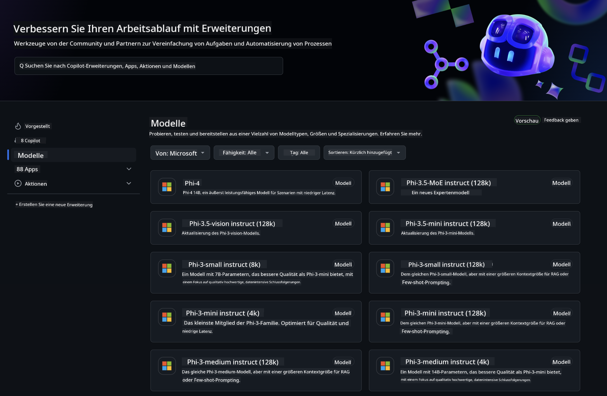
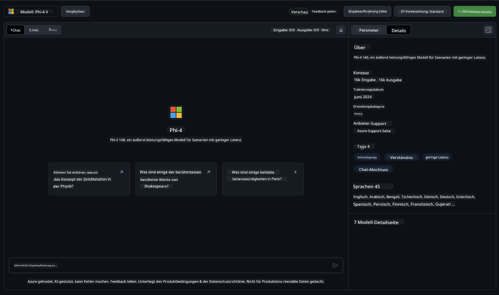
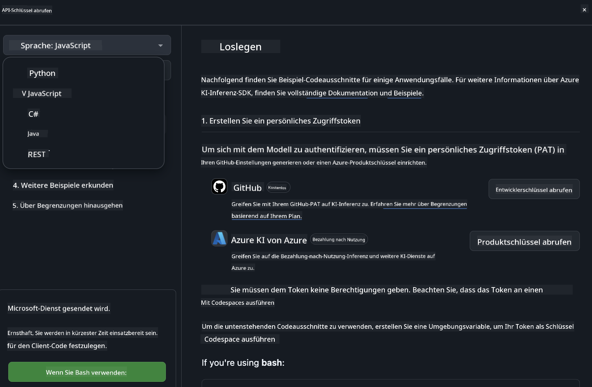
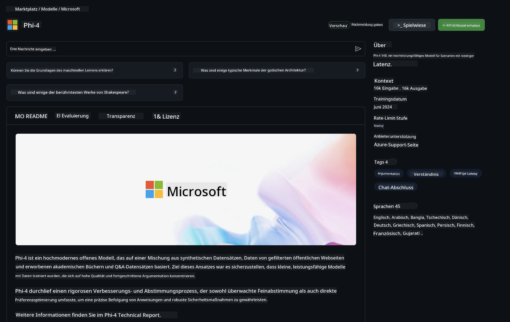

<!--
CO_OP_TRANSLATOR_METADATA:
{
  "original_hash": "fb67a08b9fc911a10ed58081fadef416",
  "translation_date": "2025-03-27T06:17:00+00:00",
  "source_file": "md\\01.Introduction\\02\\02.GitHubModel.md",
  "language_code": "de"
}
-->
## Phi-Familie in GitHub-Modellen

Willkommen bei [GitHub Models](https://github.com/marketplace/models)! Alles ist bereit, damit Sie die KI-Modelle erkunden können, die auf Azure AI gehostet werden.



Weitere Informationen zu den auf GitHub Models verfügbaren Modellen finden Sie im [GitHub Model Marketplace](https://github.com/marketplace/models).

## Verfügbare Modelle

Jedes Modell hat einen eigenen Playground und Beispielcode.



### Phi-Familie im GitHub Model Catalog

- [Phi-4](https://github.com/marketplace/models/azureml/Phi-4)

- [Phi-3.5-MoE instruct (128k)](https://github.com/marketplace/models/azureml/Phi-3-5-MoE-instruct)

- [Phi-3.5-vision instruct (128k)](https://github.com/marketplace/models/azureml/Phi-3-5-vision-instruct)

- [Phi-3.5-mini instruct (128k)](https://github.com/marketplace/models/azureml/Phi-3-5-mini-instruct)

- [Phi-3-Medium-128k-Instruct](https://github.com/marketplace/models/azureml/Phi-3-medium-128k-instruct)

- [Phi-3-medium-4k-instruct](https://github.com/marketplace/models/azureml/Phi-3-medium-4k-instruct)

- [Phi-3-mini-128k-instruct](https://github.com/marketplace/models/azureml/Phi-3-mini-128k-instruct)

- [Phi-3-mini-4k-instruct](https://github.com/marketplace/models/azureml/Phi-3-mini-4k-instruct)

- [Phi-3-small-128k-instruct](https://github.com/marketplace/models/azureml/Phi-3-small-128k-instruct)

- [Phi-3-small-8k-instruct](https://github.com/marketplace/models/azureml/Phi-3-small-8k-instruct)

## Erste Schritte

Es gibt einige grundlegende Beispiele, die sofort ausgeführt werden können. Sie finden diese im Verzeichnis "samples". Wenn Sie direkt zu Ihrer bevorzugten Programmiersprache wechseln möchten, finden Sie die Beispiele in den folgenden Sprachen:

- Python
- JavaScript
- C#
- Java
- cURL

Es gibt auch eine dedizierte Codespaces-Umgebung, um die Beispiele und Modelle auszuführen.



## Beispielcode

Nachfolgend finden Sie Codebeispiele für einige Anwendungsfälle. Weitere Informationen zur Azure AI Inference SDK finden Sie in der vollständigen Dokumentation und den Beispielen.

## Einrichtung

1. Erstellen Sie ein persönliches Zugriffstoken  
Sie müssen dem Token keine Berechtigungen zuweisen. Beachten Sie, dass das Token an einen Microsoft-Dienst gesendet wird.

Um die folgenden Codebeispiele zu verwenden, erstellen Sie eine Umgebungsvariable, um Ihr Token als Schlüssel für den Clientcode festzulegen.

Wenn Sie bash verwenden:
```
export GITHUB_TOKEN="<your-github-token-goes-here>"
```  
Wenn Sie PowerShell verwenden:  
```
$Env:GITHUB_TOKEN="<your-github-token-goes-here>"
```  

Wenn Sie die Windows-Eingabeaufforderung verwenden:  
```
set GITHUB_TOKEN=<your-github-token-goes-here>
```  

## Python-Beispiel

### Abhängigkeiten installieren  
Installieren Sie das Azure AI Inference SDK mit pip (Voraussetzung: Python >=3.8):

```
pip install azure-ai-inference
```  

### Einfaches Codebeispiel ausführen  

Dieses Beispiel zeigt einen grundlegenden Aufruf der Chat-Completion-API. Es verwendet den GitHub AI-Modell-Inferenz-Endpunkt und Ihr GitHub-Token. Der Aufruf ist synchron.

```python
import os
from azure.ai.inference import ChatCompletionsClient
from azure.ai.inference.models import SystemMessage, UserMessage
from azure.core.credentials import AzureKeyCredential

endpoint = "https://models.inference.ai.azure.com"
model_name = "Phi-4"
token = os.environ["GITHUB_TOKEN"]

client = ChatCompletionsClient(
    endpoint=endpoint,
    credential=AzureKeyCredential(token),
)

response = client.complete(
    messages=[
        UserMessage(content="I have $20,000 in my savings account, where I receive a 4% profit per year and payments twice a year. Can you please tell me how long it will take for me to become a millionaire? Also, can you please explain the math step by step as if you were explaining it to an uneducated person?"),
    ],
    temperature=0.4,
    top_p=1.0,
    max_tokens=2048,
    model=model_name
)

print(response.choices[0].message.content)
```  

### Mehrere Gesprächsrunden durchführen  

Dieses Beispiel zeigt eine mehrstufige Konversation mit der Chat-Completion-API. Wenn Sie das Modell für eine Chat-Anwendung verwenden, müssen Sie den Verlauf der Konversation verwalten und die neuesten Nachrichten an das Modell senden.

```
import os
from azure.ai.inference import ChatCompletionsClient
from azure.ai.inference.models import AssistantMessage, SystemMessage, UserMessage
from azure.core.credentials import AzureKeyCredential

token = os.environ["GITHUB_TOKEN"]
endpoint = "https://models.inference.ai.azure.com"
# Replace Model_Name
model_name = "Phi-4"

client = ChatCompletionsClient(
    endpoint=endpoint,
    credential=AzureKeyCredential(token),
)

messages = [
    SystemMessage(content="You are a helpful assistant."),
    UserMessage(content="What is the capital of France?"),
    AssistantMessage(content="The capital of France is Paris."),
    UserMessage(content="What about Spain?"),
]

response = client.complete(messages=messages, model=model_name)

print(response.choices[0].message.content)
```  

### Ausgabe streamen  

Für eine bessere Benutzererfahrung möchten Sie die Antwort des Modells streamen, sodass das erste Token früh angezeigt wird und Sie nicht auf lange Antworten warten müssen.

```
import os
from azure.ai.inference import ChatCompletionsClient
from azure.ai.inference.models import SystemMessage, UserMessage
from azure.core.credentials import AzureKeyCredential

token = os.environ["GITHUB_TOKEN"]
endpoint = "https://models.inference.ai.azure.com"
# Replace Model_Name
model_name = "Phi-4"

client = ChatCompletionsClient(
    endpoint=endpoint,
    credential=AzureKeyCredential(token),
)

response = client.complete(
    stream=True,
    messages=[
        SystemMessage(content="You are a helpful assistant."),
        UserMessage(content="Give me 5 good reasons why I should exercise every day."),
    ],
    model=model_name,
)

for update in response:
    if update.choices:
        print(update.choices[0].delta.content or "", end="")

client.close()
```  

## Kostenlose Nutzung und Ratenbegrenzungen für GitHub-Modelle



Die [Ratenbegrenzungen für den Playground und die kostenlose API-Nutzung](https://docs.github.com/en/github-models/prototyping-with-ai-models#rate-limits) sollen Ihnen helfen, Modelle zu testen und Ihre KI-Anwendung zu prototypisieren. Für eine Nutzung über diese Grenzen hinaus und um Ihre Anwendung zu skalieren, müssen Sie Ressourcen aus einem Azure-Konto bereitstellen und sich von dort aus authentifizieren, anstatt Ihr GitHub-Personal-Access-Token zu verwenden. Sie müssen sonst nichts an Ihrem Code ändern. Verwenden Sie diesen Link, um herauszufinden, wie Sie über die kostenlosen Limits hinaus in Azure AI gehen können.

### Hinweise  

Denken Sie daran, dass Sie beim Interagieren mit einem Modell KI experimentieren, sodass Fehler im Inhalt möglich sind.

Die Funktion unterliegt verschiedenen Einschränkungen (einschließlich Anfragen pro Minute, Anfragen pro Tag, Tokens pro Anfrage und gleichzeitigen Anfragen) und ist nicht für Produktionsanwendungsfälle ausgelegt.

GitHub Models verwendet Azure AI Content Safety. Diese Filter können im Rahmen der GitHub Models-Erfahrung nicht deaktiviert werden. Wenn Sie sich entscheiden, Modelle über einen kostenpflichtigen Dienst einzusetzen, konfigurieren Sie bitte Ihre Inhaltsfilter entsprechend Ihren Anforderungen.

Dieser Dienst unterliegt den Vorabveröffentlichungsbedingungen von GitHub.

**Haftungsausschluss**:  
Dieses Dokument wurde mit dem KI-Übersetzungsdienst [Co-op Translator](https://github.com/Azure/co-op-translator) übersetzt. Obwohl wir uns um Genauigkeit bemühen, beachten Sie bitte, dass automatisierte Übersetzungen Fehler oder Ungenauigkeiten enthalten können. Das Originaldokument in seiner ursprünglichen Sprache sollte als maßgebliche Quelle betrachtet werden. Für kritische Informationen wird eine professionelle menschliche Übersetzung empfohlen. Wir haften nicht für Missverständnisse oder Fehlinterpretationen, die aus der Nutzung dieser Übersetzung entstehen.