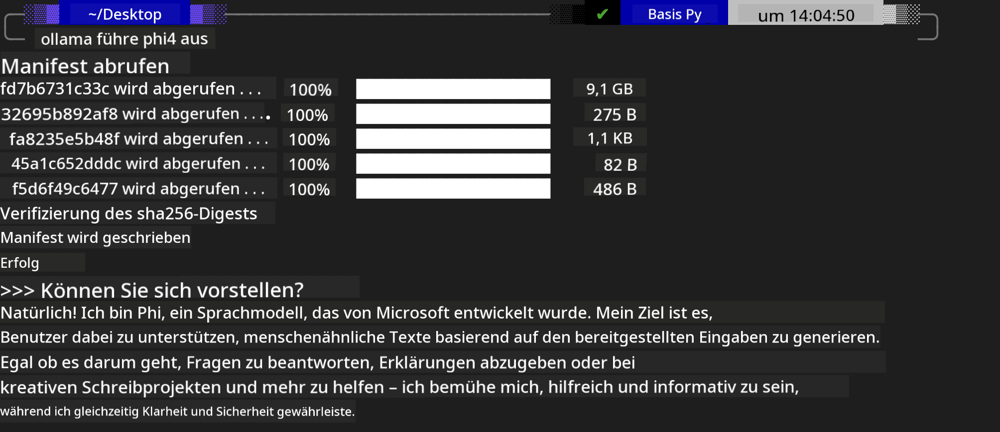
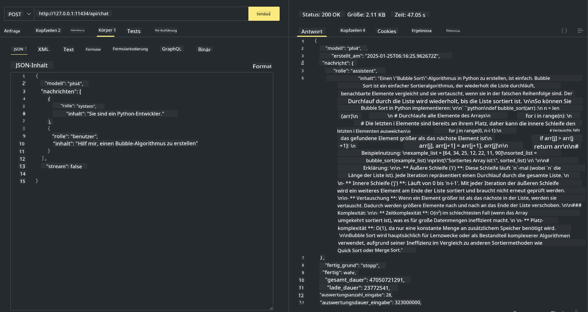

<!--
CO_OP_TRANSLATOR_METADATA:
{
  "original_hash": "0b38834693bb497f96bf53f0d941f9a1",
  "translation_date": "2025-03-27T06:29:18+00:00",
  "source_file": "md\\01.Introduction\\02\\04.Ollama.md",
  "language_code": "de"
}
-->
## Phi-Familie in Ollama

[Ollama](https://ollama.com) ermöglicht es mehr Menschen, Open-Source-LLM oder SLM direkt über einfache Skripte einzusetzen und APIs zu erstellen, um lokale Copilot-Anwendungsszenarien zu unterstützen.

## **1. Installation**

Ollama unterstützt die Ausführung unter Windows, macOS und Linux. Du kannst Ollama über diesen Link installieren ([https://ollama.com/download](https://ollama.com/download)). Nach erfolgreicher Installation kannst du direkt das Ollama-Skript verwenden, um Phi-3 über ein Terminalfenster aufzurufen. Eine Übersicht aller [verfügbaren Bibliotheken in Ollama](https://ollama.com/library) findest du hier. Wenn du dieses Repository in einem Codespace öffnest, ist Ollama bereits installiert.

```bash

ollama run phi4

```

> [!NOTE]
> Das Modell wird beim ersten Ausführen zunächst heruntergeladen. Natürlich kannst du auch direkt das heruntergeladene Phi-4-Modell angeben. Wir verwenden WSL als Beispiel, um den Befehl auszuführen. Nach dem erfolgreichen Download des Modells kannst du direkt im Terminal interagieren.



## **2. Die Phi-4-API von Ollama aufrufen**

Wenn du die von Ollama generierte Phi-4-API aufrufen möchtest, kannst du diesen Befehl im Terminal verwenden, um den Ollama-Server zu starten.

```bash

ollama serve

```

> [!NOTE]
> Wenn du macOS oder Linux nutzt, beachte, dass du auf folgenden Fehler stoßen könntest: **"Error: listen tcp 127.0.0.1:11434: bind: address already in use"**. Dieser Fehler kann auftreten, wenn du den Befehl ausführst. Du kannst diesen Fehler ignorieren, da er normalerweise darauf hinweist, dass der Server bereits läuft. Alternativ kannst du Ollama stoppen und neu starten:

**macOS**

```bash

brew services restart ollama

```

**Linux**

```bash

sudo systemctl stop ollama

```

Ollama unterstützt zwei APIs: generate und chat. Du kannst die Modell-API von Ollama je nach Bedarf aufrufen, indem du Anfragen an den lokalen Dienst sendest, der auf Port 11434 läuft.

**Chat**

```bash

curl http://127.0.0.1:11434/api/chat -d '{
  "model": "phi3",
  "messages": [
    {
      "role": "system",
      "content": "Your are a python developer."
    },
    {
      "role": "user",
      "content": "Help me generate a bubble algorithm"
    }
  ],
  "stream": false
  
}'

This is the result in Postman



## Additional Resources

Check the list of available models in Ollama in [their library](https://ollama.com/library).

Pull your model from the Ollama server using this command

```bash
ollama pull phi4
```

Run the model using this command

```bash
ollama run phi4
```

***Note:*** Visit this link [https://github.com/ollama/ollama/blob/main/docs/api.md](https://github.com/ollama/ollama/blob/main/docs/api.md) to learn more

## Calling Ollama from Python

You can use `requests` or `urllib3` to make requests to the local server endpoints used above. However, a popular way to use Ollama in Python is via the [openai](https://pypi.org/project/openai/) SDK, since Ollama provides OpenAI-compatible server endpoints as well.

Here is an example for phi3-mini:

```python
import openai

client = openai.OpenAI(
    base_url="http://localhost:11434/v1",
    api_key="nokeyneeded",
)

response = client.chat.completions.create(
    model="phi4",
    temperature=0.7,
    n=1,
    messages=[
        {"role": "system", "content": "You are a helpful assistant."},
        {"role": "user", "content": "Write a haiku about a hungry cat"},
    ],
)

print("Response:")
print(response.choices[0].message.content)
```

## Calling Ollama from JavaScript 

```javascript
// Beispiel: Zusammenfassung einer Datei mit Phi-4
script({
    model: "ollama:phi4",
    title: "Zusammenfassung mit Phi-4",
    system: ["system"],
})

// Beispiel für eine Zusammenfassung
const file = def("FILE", env.files)
$`Fasse ${file} in einem einzigen Absatz zusammen.`
```

## Calling Ollama from C#

Create a new C# Console application and add the following NuGet package:

```bash
dotnet add package Microsoft.SemanticKernel --version 1.34.0
```

Then replace this code in the `Program.cs` file

```csharp
using Microsoft.SemanticKernel;
using Microsoft.SemanticKernel.ChatCompletion;

// Chat-Dienst mit lokalem Ollama-Server-Endpunkt hinzufügen
#pragma warning disable SKEXP0001, SKEXP0003, SKEXP0010, SKEXP0011, SKEXP0050, SKEXP0052
builder.AddOpenAIChatCompletion(
    modelId: "phi4",
    endpoint: new Uri("http://localhost:11434/"),
    apiKey: "non required");

// Einfaches Prompt an den Chat-Dienst senden
string prompt = "Erzähl einen Witz über Kätzchen";
var response = await kernel.InvokePromptAsync(prompt);
Console.WriteLine(response.GetValue<string>());
```

Run the app with the command:

```bash
dotnet run
```

**Haftungsausschluss**:  
Dieses Dokument wurde mit dem KI-Übersetzungsdienst [Co-op Translator](https://github.com/Azure/co-op-translator) übersetzt. Obwohl wir uns um Genauigkeit bemühen, beachten Sie bitte, dass automatisierte Übersetzungen Fehler oder Ungenauigkeiten enthalten können. Das Originaldokument in seiner ursprünglichen Sprache sollte als maßgebliche Quelle betrachtet werden. Für kritische Informationen wird eine professionelle menschliche Übersetzung empfohlen. Wir übernehmen keine Haftung für Missverständnisse oder Fehlinterpretationen, die sich aus der Nutzung dieser Übersetzung ergeben.