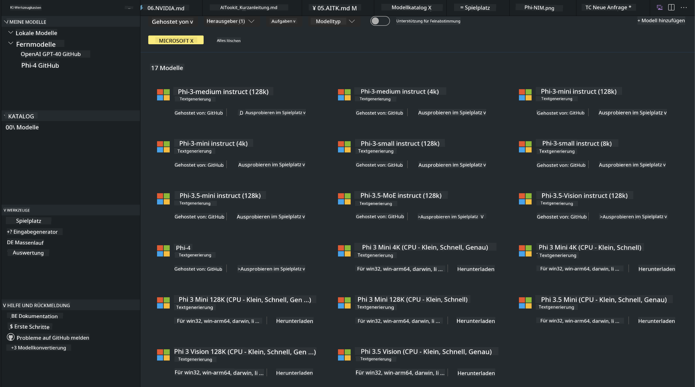
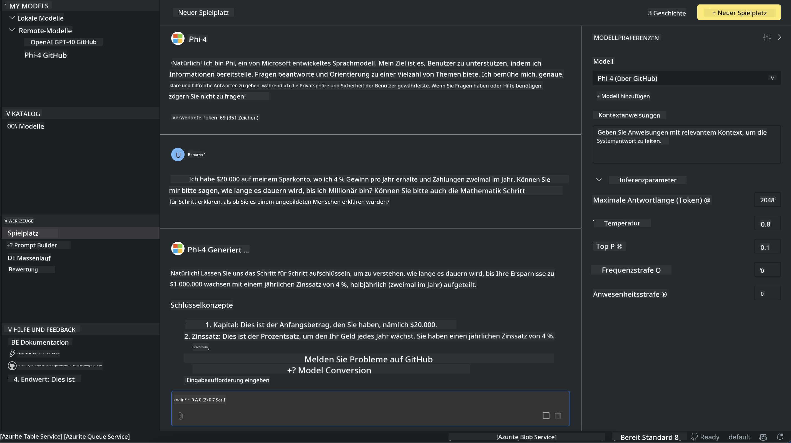

<!--
CO_OP_TRANSLATOR_METADATA:
{
  "original_hash": "4951d458c0b60c02cd1e751b40903877",
  "translation_date": "2025-03-27T06:37:30+00:00",
  "source_file": "md\\01.Introduction\\02\\05.AITK.md",
  "language_code": "de"
}
-->
# Phi-Familie in AITK

[AI Toolkit für VS Code](https://marketplace.visualstudio.com/items?itemName=ms-windows-ai-studio.windows-ai-studio) vereinfacht die Entwicklung von generativen KI-Anwendungen, indem es modernste KI-Entwicklungstools und Modelle aus dem Azure AI Foundry-Katalog sowie anderen Katalogen wie Hugging Face zusammenführt. Sie können den KI-Modellkatalog durchsuchen, der von GitHub Models und Azure AI Foundry Model Catalogs unterstützt wird, Modelle lokal oder remote herunterladen, feinabstimmen, testen und in Ihrer Anwendung nutzen.

Die Vorschau des AI Toolkits läuft lokal. Lokale Inferenz oder Feinabstimmung hängt vom ausgewählten Modell ab; möglicherweise benötigen Sie eine GPU wie eine NVIDIA CUDA GPU. Sie können GitHub-Modelle auch direkt mit AITK ausführen.

## Erste Schritte

[Erfahren Sie mehr darüber, wie Sie das Windows-Subsystem für Linux installieren](https://learn.microsoft.com/windows/wsl/install?WT.mc_id=aiml-137032-kinfeylo)

und [wie Sie die Standard-Distribution ändern](https://learn.microsoft.com/windows/wsl/install#change-the-default-linux-distribution-installed).

[AI Toolkit GitHub Repo](https://github.com/microsoft/vscode-ai-toolkit/)

- Windows, Linux, macOS
  
- Für die Feinabstimmung auf Windows und Linux benötigen Sie eine Nvidia GPU. Zusätzlich erfordert **Windows** das Subsystem für Linux mit einer Ubuntu-Distribution ab Version 18.4. [Erfahren Sie mehr darüber, wie Sie das Windows-Subsystem für Linux installieren](https://learn.microsoft.com/windows/wsl/install) und [wie Sie die Standard-Distribution ändern](https://learn.microsoft.com/windows/wsl/install#change-the-default-linux-distribution-installed).

### Installation des AI Toolkits

Das AI Toolkit wird als [Visual Studio Code Extension](https://code.visualstudio.com/docs/setup/additional-components#_vs-code-extensions) bereitgestellt. Daher müssen Sie zunächst [VS Code](https://code.visualstudio.com/docs/setup/windows?WT.mc_id=aiml-137032-kinfeylo) installieren und das AI Toolkit aus dem [VS Marketplace](https://marketplace.visualstudio.com/items?itemName=ms-windows-ai-studio.windows-ai-studio) herunterladen.  
Das [AI Toolkit ist im Visual Studio Marketplace verfügbar](https://marketplace.visualstudio.com/items?itemName=ms-windows-ai-studio.windows-ai-studio) und kann wie jede andere VS Code-Erweiterung installiert werden.  

Wenn Sie mit der Installation von VS Code-Erweiterungen nicht vertraut sind, befolgen Sie diese Schritte:

### Anmeldung

1. Wählen Sie in der Aktivitätsleiste in VS Code **Erweiterungen** aus.  
1. Geben Sie in der Suchleiste für Erweiterungen "AI Toolkit" ein.  
1. Wählen Sie das "AI Toolkit for Visual Studio Code" aus.  
1. Wählen Sie **Installieren** aus.  

Jetzt sind Sie bereit, die Erweiterung zu verwenden!

Sie werden aufgefordert, sich bei GitHub anzumelden. Klicken Sie bitte auf "Zulassen", um fortzufahren. Sie werden zur GitHub-Anmeldeseite weitergeleitet.

Bitte melden Sie sich an und folgen Sie den Schritten. Nach erfolgreichem Abschluss werden Sie zu VS Code zurückgeleitet.

Sobald die Erweiterung installiert ist, erscheint das AI Toolkit-Symbol in Ihrer Aktivitätsleiste.

Lassen Sie uns die verfügbaren Aktionen erkunden!

### Verfügbare Aktionen

Die Hauptseitenleiste des AI Toolkits ist in folgende Abschnitte unterteilt:  

- **Modelle**
- **Ressourcen**
- **Spielwiese**  
- **Feinabstimmung**
- **Bewertung**

Diese sind im Abschnitt Ressourcen verfügbar. Um zu beginnen, wählen Sie **Modellkatalog** aus.

### Ein Modell aus dem Katalog herunterladen

Nach dem Start des AI Toolkits aus der VS Code-Seitenleiste können Sie aus den folgenden Optionen wählen:



- Finden Sie ein unterstütztes Modell im **Modellkatalog** und laden Sie es lokal herunter.  
- Testen Sie die Modellinferenz in der **Modell-Spielwiese**.  
- Feinabstimmung des Modells lokal oder remote in **Modell-Feinabstimmung**.  
- Bereitstellung feinabgestimmter Modelle in der Cloud über die Befehlsleiste des AI Toolkits.  
- Bewertung von Modellen.  

> [!NOTE]
>
> **GPU vs. CPU**
>
> Sie werden feststellen, dass die Modellkarten die Modellgröße, die Plattform und den Beschleunigertyp (CPU, GPU) anzeigen. Für eine optimierte Leistung auf **Windows-Geräten mit mindestens einer GPU** wählen Sie Modellversionen, die ausschließlich Windows unterstützen.
>
> Dies stellt sicher, dass Sie ein Modell haben, das für den DirectML-Beschleuniger optimiert ist.
>
> Die Modellnamen haben das Format
>
> - `{model_name}-{accelerator}-{quantization}-{format}`.
>
>Um zu überprüfen, ob Ihr Windows-Gerät über eine GPU verfügt, öffnen Sie den **Task-Manager** und wählen Sie dann die Registerkarte **Leistung**. Wenn Sie über GPU(s) verfügen, werden diese unter Namen wie "GPU 0" oder "GPU 1" aufgelistet.

### Das Modell in der Spielwiese ausführen

Nachdem alle Parameter festgelegt sind, klicken Sie auf **Projekt generieren**.

Sobald Ihr Modell heruntergeladen wurde, wählen Sie **In Spielwiese laden** auf der Modellkarte im Katalog:

- Starten Sie den Modell-Download.  
- Installieren Sie alle erforderlichen Voraussetzungen und Abhängigkeiten.  
- Erstellen Sie ein VS Code-Arbeitsbereich.  



### Die REST-API in Ihrer Anwendung verwenden 

Das AI Toolkit enthält einen lokalen REST-API-Webserver **auf Port 5272**, der das [OpenAI-Chat-Komplettierungsformat](https://platform.openai.com/docs/api-reference/chat/create) verwendet.  

Dies ermöglicht es Ihnen, Ihre Anwendung lokal zu testen, ohne auf einen Cloud-KI-Modellservice angewiesen zu sein. Das folgende JSON-Beispiel zeigt, wie der Anforderungskörper konfiguriert werden kann:

```json
{
    "model": "Phi-4",
    "messages": [
        {
            "role": "user",
            "content": "what is the golden ratio?"
        }
    ],
    "temperature": 0.7,
    "top_p": 1,
    "top_k": 10,
    "max_tokens": 100,
    "stream": true
}
```

Sie können die REST-API mit (z. B.) [Postman](https://www.postman.com/) oder dem CURL-Dienstprogramm testen:

```bash
curl -vX POST http://127.0.0.1:5272/v1/chat/completions -H 'Content-Type: application/json' -d @body.json
```

### Die OpenAI-Clientbibliothek für Python verwenden

```python
from openai import OpenAI

client = OpenAI(
    base_url="http://127.0.0.1:5272/v1/", 
    api_key="x" # required for the API but not used
)

chat_completion = client.chat.completions.create(
    messages=[
        {
            "role": "user",
            "content": "what is the golden ratio?",
        }
    ],
    model="Phi-4",
)

print(chat_completion.choices[0].message.content)
```

### Die Azure OpenAI-Clientbibliothek für .NET verwenden

Fügen Sie die [Azure OpenAI-Clientbibliothek für .NET](https://www.nuget.org/packages/Azure.AI.OpenAI/) mithilfe von NuGet zu Ihrem Projekt hinzu:

```bash
dotnet add {project_name} package Azure.AI.OpenAI --version 1.0.0-beta.17
```

Fügen Sie Ihrem Projekt eine C#-Datei namens **OverridePolicy.cs** hinzu und fügen Sie den folgenden Code ein:

```csharp
// OverridePolicy.cs
using Azure.Core.Pipeline;
using Azure.Core;

internal partial class OverrideRequestUriPolicy(Uri overrideUri)
    : HttpPipelineSynchronousPolicy
{
    private readonly Uri _overrideUri = overrideUri;

    public override void OnSendingRequest(HttpMessage message)
    {
        message.Request.Uri.Reset(_overrideUri);
    }
}
```

Fügen Sie anschließend den folgenden Code in Ihre **Program.cs**-Datei ein:

```csharp
// Program.cs
using Azure.AI.OpenAI;

Uri localhostUri = new("http://localhost:5272/v1/chat/completions");

OpenAIClientOptions clientOptions = new();
clientOptions.AddPolicy(
    new OverrideRequestUriPolicy(localhostUri),
    Azure.Core.HttpPipelinePosition.BeforeTransport);
OpenAIClient client = new(openAIApiKey: "unused", clientOptions);

ChatCompletionsOptions options = new()
{
    DeploymentName = "Phi-4",
    Messages =
    {
        new ChatRequestSystemMessage("You are a helpful assistant. Be brief and succinct."),
        new ChatRequestUserMessage("What is the golden ratio?"),
    }
};

StreamingResponse<StreamingChatCompletionsUpdate> streamingChatResponse
    = await client.GetChatCompletionsStreamingAsync(options);

await foreach (StreamingChatCompletionsUpdate chatChunk in streamingChatResponse)
{
    Console.Write(chatChunk.ContentUpdate);
}
```


## Feinabstimmung mit AI Toolkit

- Beginnen Sie mit der Modellentdeckung und der Spielwiese.  
- Feinabstimmung und Inferenz von Modellen mit lokalen Rechenressourcen.  
- Remote-Feinabstimmung und Inferenz mit Azure-Ressourcen.  

[Feinabstimmung mit AI Toolkit](../../03.FineTuning/Finetuning_VSCodeaitoolkit.md)

## AI Toolkit Q&A Ressourcen

Bitte konsultieren Sie unsere [Q&A-Seite](https://github.com/microsoft/vscode-ai-toolkit/blob/main/archive/QA.md) für die häufigsten Probleme und Lösungen.  

**Haftungsausschluss**:  
Dieses Dokument wurde mit dem KI-Übersetzungsdienst [Co-op Translator](https://github.com/Azure/co-op-translator) übersetzt. Obwohl wir uns um Genauigkeit bemühen, beachten Sie bitte, dass automatisierte Übersetzungen Fehler oder Ungenauigkeiten enthalten können. Das Originaldokument in seiner ursprünglichen Sprache sollte als maßgebliche Quelle betrachtet werden. Für kritische Informationen wird eine professionelle menschliche Übersetzung empfohlen. Wir übernehmen keine Haftung für Missverständnisse oder Fehlinterpretationen, die aus der Nutzung dieser Übersetzung resultieren.