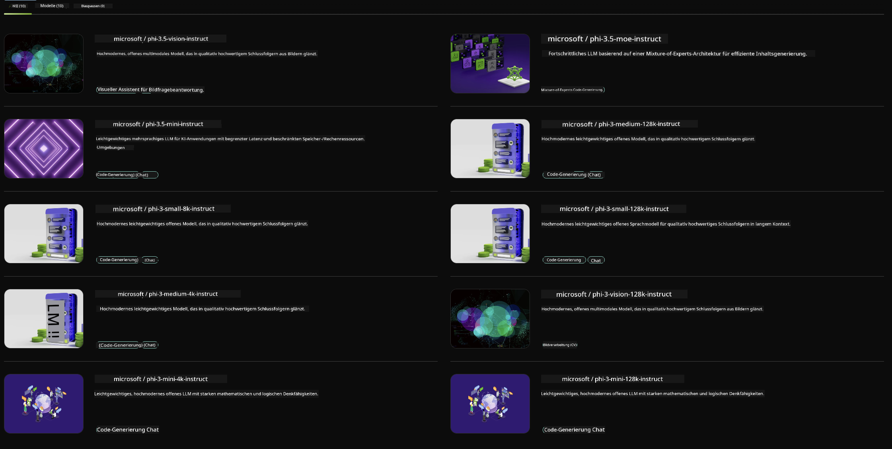

<!--
CO_OP_TRANSLATOR_METADATA:
{
  "original_hash": "7b08e277df2a9307f861ae54bc30c772",
  "translation_date": "2025-03-27T06:47:45+00:00",
  "source_file": "md\\01.Introduction\\02\\06.NVIDIA.md",
  "language_code": "de"
}
-->
## Phi-Familie in NVIDIA NIM

NVIDIA NIM ist eine Sammlung einfach zu nutzender Microservices, die entwickelt wurden, um die Bereitstellung generativer KI-Modelle in der Cloud, im Rechenzentrum und auf Workstations zu beschleunigen. NIMs werden nach Modellfamilie und pro Modell kategorisiert. Zum Beispiel bringt NVIDIA NIM für große Sprachmodelle (LLMs) die Leistungsfähigkeit modernster LLMs in Unternehmensanwendungen und bietet unvergleichliche Fähigkeiten in der Verarbeitung und im Verständnis natürlicher Sprache.

NIM ermöglicht es IT- und DevOps-Teams, große Sprachmodelle (LLMs) in ihren eigenen verwalteten Umgebungen selbst zu hosten, während Entwicklern weiterhin standardisierte APIs zur Verfügung stehen, mit denen sie leistungsstarke Copiloten, Chatbots und KI-Assistenten erstellen können, die ihr Geschäft transformieren können. Durch den Einsatz von NVIDIAs modernster GPU-Beschleunigung und skalierbarer Bereitstellung bietet NIM den schnellsten Weg zur Inferenz mit unübertroffener Leistung.

Sie können NVIDIA NIM verwenden, um Phi-Familien-Modelle zu inferieren.



### **Beispiele - Phi-3-Vision in NVIDIA NIM**

Stellen Sie sich vor, Sie haben ein Bild (`demo.png`) und möchten Python-Code generieren, der dieses Bild verarbeitet und eine neue Version davon speichert (`phi-3-vision.jpg`).

Der obenstehende Code automatisiert diesen Prozess, indem er:

1. Die Umgebung und die notwendigen Konfigurationen einrichtet.
2. Eine Eingabeaufforderung erstellt, die das Modell anweist, den erforderlichen Python-Code zu generieren.
3. Die Eingabeaufforderung an das Modell sendet und den generierten Code sammelt.
4. Den generierten Code extrahiert und ausführt.
5. Die Original- und die verarbeiteten Bilder anzeigt.

Dieser Ansatz nutzt die Leistungsfähigkeit von KI, um Aufgaben der Bildverarbeitung zu automatisieren und sie einfacher und schneller zu machen.

[Beispielcode-Lösung](../../../../../code/06.E2E/E2E_Nvidia_NIM_Phi3_Vision.ipynb)

Lassen Sie uns den gesamten Code Schritt für Schritt durchgehen:

1. **Erforderliches Paket installieren**:
    ```python
    !pip install langchain_nvidia_ai_endpoints -U
    ```
    Dieser Befehl installiert das Paket `langchain_nvidia_ai_endpoints` und stellt sicher, dass es sich um die neueste Version handelt.

2. **Notwendige Module importieren**:
    ```python
    from langchain_nvidia_ai_endpoints import ChatNVIDIA
    import getpass
    import os
    import base64
    ```
    Diese Importe bringen die notwendigen Module für die Interaktion mit den NVIDIA AI-Endpunkten, die sichere Handhabung von Passwörtern, die Interaktion mit dem Betriebssystem und die Codierung/Decodierung von Daten im Base64-Format ein.

3. **API-Schlüssel einrichten**:
    ```python
    if not os.getenv("NVIDIA_API_KEY"):
        os.environ["NVIDIA_API_KEY"] = getpass.getpass("Enter your NVIDIA API key: ")
    ```
    Dieser Code überprüft, ob die Umgebungsvariable `NVIDIA_API_KEY` gesetzt ist. Falls nicht, fordert er den Benutzer auf, den API-Schlüssel sicher einzugeben.

4. **Modell und Bildpfad definieren**:
    ```python
    model = 'microsoft/phi-3-vision-128k-instruct'
    chat = ChatNVIDIA(model=model)
    img_path = './imgs/demo.png'
    ```
    Hier wird das zu verwendende Modell festgelegt, eine Instanz von `ChatNVIDIA` mit dem angegebenen Modell erstellt und der Pfad zur Bilddatei definiert.

5. **Textaufforderung erstellen**:
    ```python
    text = "Please create Python code for image, and use plt to save the new picture under imgs/ and name it phi-3-vision.jpg."
    ```
    Diese Zeile definiert eine Textaufforderung, die das Modell anweist, Python-Code zur Verarbeitung eines Bildes zu generieren.

6. **Bild in Base64 codieren**:
    ```python
    with open(img_path, "rb") as f:
        image_b64 = base64.b64encode(f.read()).decode()
    image = f''
    ```
    Dieser Code liest die Bilddatei, codiert sie in Base64 und erstellt ein HTML-Bild-Tag mit den codierten Daten.

7. **Text und Bild zur Eingabeaufforderung kombinieren**:
    ```python
    prompt = f"{text} {image}"
    ```
    Hier werden die Textaufforderung und das HTML-Bild-Tag zu einem einzigen String kombiniert.

8. **Code mit ChatNVIDIA generieren**:
    ```python
    code = ""
    for chunk in chat.stream(prompt):
        print(chunk.content, end="")
        code += chunk.content
    ```
    Dieser Code sendet die Eingabeaufforderung an `ChatNVIDIA` und speichert den generierten Code in der `` model and collects the generated code in chunks, printing and appending each chunk to the `code`-Zeichenkette.

9. **Python-Code aus generiertem Inhalt extrahieren**:
    ```python
    begin = code.index('```python') + 9
    code = code[begin:]
    end = code.index('```')
    code = code[:end]
    ```
    Dieser Abschnitt extrahiert den eigentlichen Python-Code aus dem generierten Inhalt, indem die Markdown-Formatierung entfernt wird.

10. **Generierten Code ausführen**:
    ```python
    import subprocess
    result = subprocess.run(["python", "-c", code], capture_output=True)
    ```
    Dieser Code führt den extrahierten Python-Code als Subprozess aus und erfasst dessen Ausgabe.

11. **Bilder anzeigen**:
    ```python
    from IPython.display import Image, display
    display(Image(filename='./imgs/phi-3-vision.jpg'))
    display(Image(filename='./imgs/demo.png'))
    ```
    Diese Zeilen zeigen die Bilder mithilfe des Moduls `IPython.display` an.

**Haftungsausschluss**:  
Dieses Dokument wurde mithilfe des KI-Übersetzungsdienstes [Co-op Translator](https://github.com/Azure/co-op-translator) übersetzt. Obwohl wir uns um Genauigkeit bemühen, weisen wir darauf hin, dass automatisierte Übersetzungen Fehler oder Ungenauigkeiten enthalten können. Das Originaldokument in seiner ursprünglichen Sprache sollte als maßgebliche Quelle betrachtet werden. Für kritische Informationen wird eine professionelle menschliche Übersetzung empfohlen. Wir haften nicht für Missverständnisse oder Fehlinterpretationen, die aus der Nutzung dieser Übersetzung entstehen.