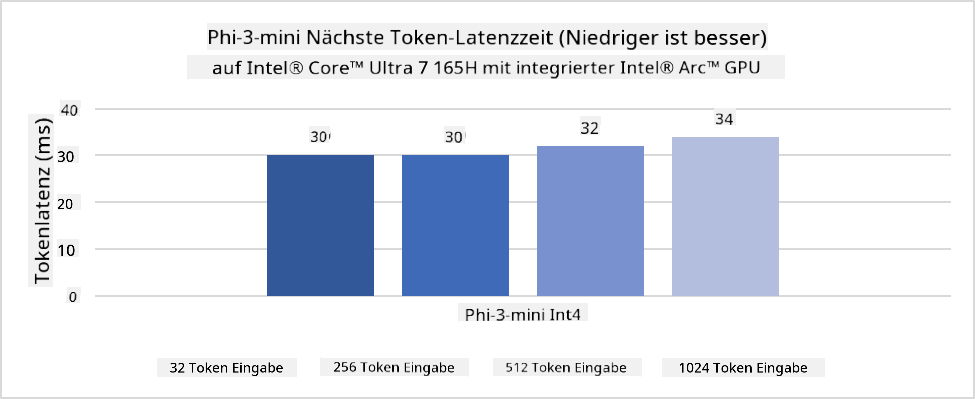
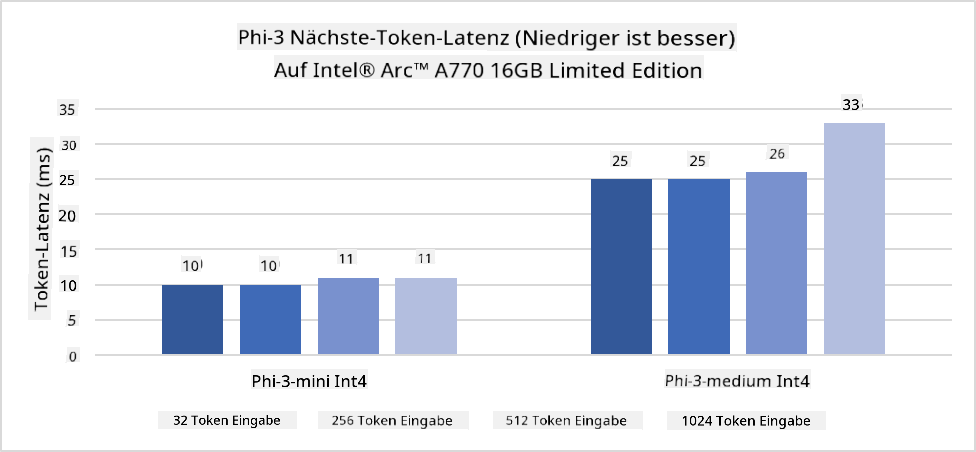
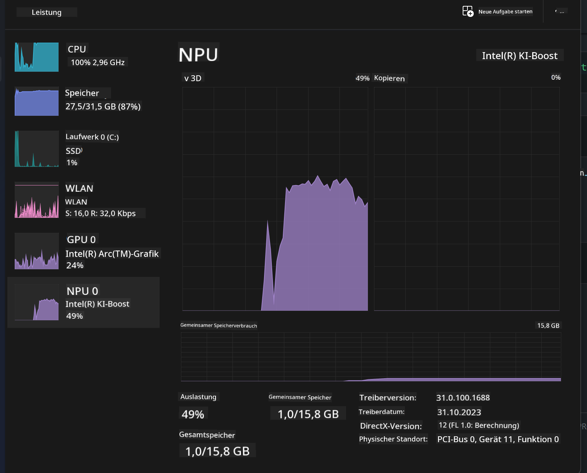
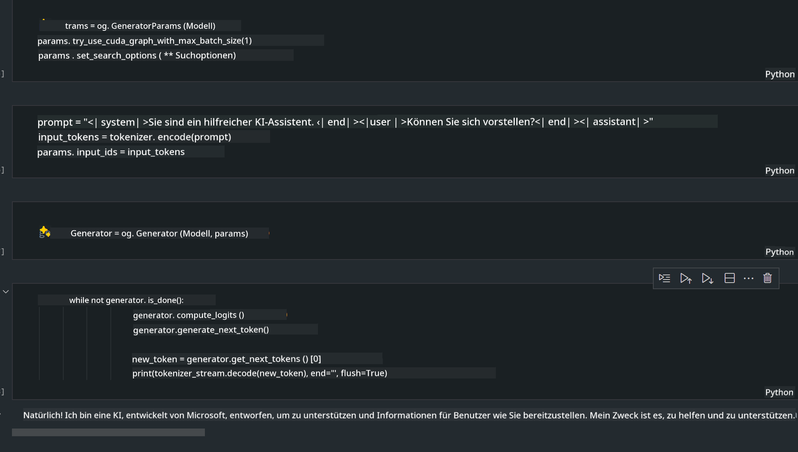
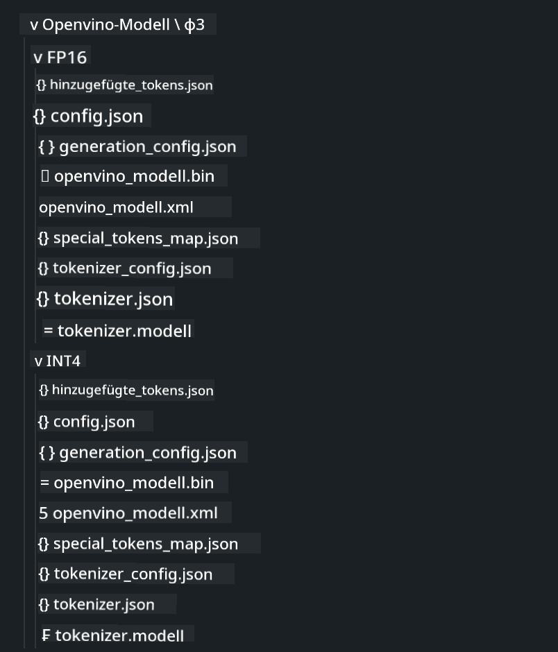
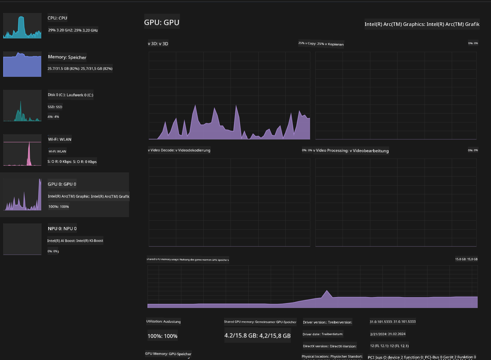

<!--
CO_OP_TRANSLATOR_METADATA:
{
  "original_hash": "e08ce816e23ad813244a09ca34ebb8ac",
  "translation_date": "2025-03-27T06:55:56+00:00",
  "source_file": "md\\01.Introduction\\03\\AIPC_Inference.md",
  "language_code": "de"
}
-->
# **Inference Phi-3 auf einem AI-PC**

Mit den Fortschritten in der generativen KI und der Verbesserung der Hardwarefähigkeiten von Edge-Geräten können immer mehr generative KI-Modelle in die BYOD-Geräte (Bring Your Own Device) der Nutzer integriert werden. AI-PCs gehören zu diesen Modellen. Ab 2024 haben Intel, AMD und Qualcomm mit PC-Herstellern zusammengearbeitet, um AI-PCs einzuführen, die durch Hardwareanpassungen die Bereitstellung lokalisierter generativer KI-Modelle ermöglichen. In dieser Diskussion konzentrieren wir uns auf Intel AI-PCs und untersuchen, wie Phi-3 auf einem Intel AI-PC bereitgestellt werden kann.

### Was ist ein NPU?

Ein NPU (Neural Processing Unit) ist ein spezieller Prozessor oder eine Verarbeitungseinheit auf einem größeren SoC, der speziell für die Beschleunigung von neuronalen Netzwerkoperationen und KI-Aufgaben entwickelt wurde. Im Gegensatz zu allgemeinen CPUs und GPUs sind NPUs für datengetriebenes paralleles Computing optimiert, was sie besonders effizient bei der Verarbeitung großer Multimedia-Daten wie Videos und Bilder sowie bei der Verarbeitung von Daten für neuronale Netzwerke macht. Sie sind besonders geeignet für KI-bezogene Aufgaben wie Spracherkennung, Hintergrundunschärfe bei Videoanrufen und Foto- oder Videobearbeitungsprozesse wie Objekterkennung.

## NPU vs GPU

Obwohl viele KI- und maschinelle Lernaufgaben auf GPUs ausgeführt werden, gibt es einen entscheidenden Unterschied zwischen GPUs und NPUs.  
GPUs sind bekannt für ihre Fähigkeiten im parallelen Rechnen, aber nicht alle GPUs sind gleichermaßen effizient über die Grafikverarbeitung hinaus. NPUs hingegen sind speziell für komplexe Berechnungen entwickelt, die bei neuronalen Netzwerkoperationen erforderlich sind, und somit besonders effektiv für KI-Aufgaben.

Zusammengefasst sind NPUs die Mathe-Genies, die KI-Berechnungen beschleunigen, und sie spielen eine Schlüsselrolle in der aufkommenden Ära der AI-PCs!

***Dieses Beispiel basiert auf Intels neuestem Intel Core Ultra Prozessor.***

## **1. Phi-3-Modell mit NPU ausführen**

Das Intel® NPU-Gerät ist ein KI-Inferenzbeschleuniger, der in Intel-Client-CPUs integriert ist, beginnend mit der Intel® Core™ Ultra Generation von CPUs (früher bekannt als Meteor Lake). Es ermöglicht eine energieeffiziente Ausführung von Aufgaben künstlicher neuronaler Netzwerke.





**Intel NPU Acceleration Library**

Die Intel NPU Acceleration Library [https://github.com/intel/intel-npu-acceleration-library](https://github.com/intel/intel-npu-acceleration-library) ist eine Python-Bibliothek, die entwickelt wurde, um die Effizienz Ihrer Anwendungen zu steigern, indem die Leistung der Intel Neural Processing Unit (NPU) genutzt wird, um Hochgeschwindigkeitsberechnungen auf kompatibler Hardware durchzuführen.

Beispiel für Phi-3-mini auf einem AI-PC mit Intel® Core™ Ultra Prozessoren.


Installieren Sie die Python-Bibliothek mit pip:

```bash

   pip install intel-npu-acceleration-library

```

***Hinweis*** Das Projekt befindet sich noch in der Entwicklung, aber das Referenzmodell ist bereits sehr vollständig.

### **Phi-3 mit der Intel NPU Acceleration Library ausführen**

Die Nutzung der Intel NPU-Beschleunigung beeinträchtigt nicht den traditionellen Kodierungsprozess. Sie müssen lediglich diese Bibliothek verwenden, um das ursprüngliche Phi-3-Modell zu quantisieren, wie z. B. FP16, INT8, INT4, wie:

```python
from transformers import AutoTokenizer, pipeline,TextStreamer
from intel_npu_acceleration_library import NPUModelForCausalLM, int4
from intel_npu_acceleration_library.compiler import CompilerConfig
import warnings

model_id = "microsoft/Phi-3-mini-4k-instruct"

compiler_conf = CompilerConfig(dtype=int4)
model = NPUModelForCausalLM.from_pretrained(
    model_id, use_cache=True, config=compiler_conf, attn_implementation="sdpa"
).eval()

tokenizer = AutoTokenizer.from_pretrained(model_id)

text_streamer = TextStreamer(tokenizer, skip_prompt=True)
```

Nach erfolgreicher Quantisierung können Sie mit der Ausführung fortfahren, um die NPU aufzurufen und das Phi-3-Modell auszuführen.

```python
generation_args = {
   "max_new_tokens": 1024,
   "return_full_text": False,
   "temperature": 0.3,
   "do_sample": False,
   "streamer": text_streamer,
}

pipe = pipeline(
   "text-generation",
   model=model,
   tokenizer=tokenizer,
)

query = "<|system|>You are a helpful AI assistant.<|end|><|user|>Can you introduce yourself?<|end|><|assistant|>"

with warnings.catch_warnings():
    warnings.simplefilter("ignore")
    pipe(query, **generation_args)
```

Beim Ausführen des Codes können wir den Status der NPU über den Task-Manager anzeigen.



***Beispiele*** : [AIPC_NPU_DEMO.ipynb](../../../../../code/03.Inference/AIPC/AIPC_NPU_DEMO.ipynb)

## **2. Phi-3-Modell mit DirectML + ONNX Runtime ausführen**

### **Was ist DirectML?**

[DirectML](https://github.com/microsoft/DirectML) ist eine leistungsstarke, hardwarebeschleunigte DirectX 12-Bibliothek für maschinelles Lernen. DirectML bietet GPU-Beschleunigung für gängige maschinelle Lernaufgaben auf einer breiten Palette unterstützter Hardware und Treiber, einschließlich aller DirectX 12-fähigen GPUs von Anbietern wie AMD, Intel, NVIDIA und Qualcomm.

Wenn es eigenständig verwendet wird, ist die DirectML-API eine Low-Level-DirectX-12-Bibliothek und eignet sich für leistungsstarke, latenzarme Anwendungen wie Frameworks, Spiele und andere Echtzeitanwendungen. Die nahtlose Interoperabilität von DirectML mit Direct3D 12 sowie der geringe Overhead und die Konformität über Hardware hinweg machen DirectML ideal für die Beschleunigung des maschinellen Lernens, wenn sowohl hohe Leistung als auch Zuverlässigkeit und Vorhersagbarkeit der Ergebnisse über Hardware hinweg entscheidend sind.

***Hinweis***: Die neueste Version von DirectML unterstützt bereits NPU (https://devblogs.microsoft.com/directx/introducing-neural-processor-unit-npu-support-in-directml-developer-preview/).

### DirectML und CUDA in Bezug auf Fähigkeiten und Leistung:

**DirectML** ist eine von Microsoft entwickelte Bibliothek für maschinelles Lernen. Sie wurde entwickelt, um Arbeitslasten des maschinellen Lernens auf Windows-Geräten, einschließlich Desktops, Laptops und Edge-Geräten, zu beschleunigen.
- DX12-Basiert: DirectML basiert auf DirectX 12 (DX12) und bietet eine breite Hardwareunterstützung über GPUs hinweg, einschließlich NVIDIA und AMD.
- Breitere Unterstützung: Da es DX12 nutzt, kann DirectML mit jeder GPU arbeiten, die DX12 unterstützt, sogar integrierten GPUs.
- Bildverarbeitung: DirectML verarbeitet Bilder und andere Daten mit neuronalen Netzwerken und eignet sich somit für Aufgaben wie Bilderkennung, Objekterkennung und mehr.
- Einfache Einrichtung: Die Einrichtung von DirectML ist unkompliziert und erfordert keine spezifischen SDKs oder Bibliotheken von GPU-Herstellern.
- Leistung: In einigen Fällen ist DirectML leistungsstark und kann für bestimmte Arbeitslasten schneller als CUDA sein.
- Einschränkungen: Es gibt jedoch Fälle, in denen DirectML langsamer sein kann, insbesondere bei float16 großen Batchgrößen.

**CUDA** ist NVIDIAs Plattform und Programmiermodell für paralleles Rechnen. Es ermöglicht Entwicklern, die Leistung von NVIDIA-GPUs für allgemeine Berechnungen zu nutzen, einschließlich maschinellen Lernens und wissenschaftlicher Simulationen.
- NVIDIA-Spezifisch: CUDA ist eng mit NVIDIA-GPUs integriert und speziell für diese konzipiert.
- Hochoptimiert: Es bietet eine hervorragende Leistung für GPU-beschleunigte Aufgaben, insbesondere bei der Nutzung von NVIDIA-GPUs.
- Weit verbreitet: Viele maschinelle Lernframeworks und Bibliotheken (wie TensorFlow und PyTorch) unterstützen CUDA.
- Anpassung: Entwickler können CUDA-Einstellungen für spezifische Aufgaben feinabstimmen, was zu optimaler Leistung führen kann.
- Einschränkungen: Die Abhängigkeit von NVIDIA-Hardware kann jedoch einschränkend sein, wenn eine breitere Kompatibilität über verschiedene GPUs hinweg gewünscht wird.

### Entscheidung zwischen DirectML und CUDA

Die Wahl zwischen DirectML und CUDA hängt von Ihrem spezifischen Anwendungsfall, der verfügbaren Hardware und Ihren Vorlieben ab.  
Wenn Sie breitere Kompatibilität und einfache Einrichtung suchen, könnte DirectML eine gute Wahl sein. Wenn Sie jedoch NVIDIA-GPUs besitzen und hochoptimierte Leistung benötigen, bleibt CUDA eine starke Option. Zusammenfassend haben sowohl DirectML als auch CUDA ihre Stärken und Schwächen. Überlegen Sie sich Ihre Anforderungen und die verfügbare Hardware, bevor Sie eine Entscheidung treffen.

### **Generative KI mit ONNX Runtime**

In der Ära der KI ist die Portabilität von KI-Modellen von großer Bedeutung. Mit ONNX Runtime können trainierte Modelle problemlos auf verschiedene Geräte bereitgestellt werden. Entwickler müssen sich nicht mit dem Inferenz-Framework beschäftigen und können über eine einheitliche API die Modellausführung abschließen. In der Ära der generativen KI hat ONNX Runtime auch Codeoptimierungen durchgeführt (https://onnxruntime.ai/docs/genai/). Durch die optimierte ONNX Runtime kann das quantisierte generative KI-Modell auf verschiedenen Endgeräten ausgeführt werden. In Generative KI mit ONNX Runtime können Sie die KI-Modell-API über Python, C#, C / C++ ausführen. Natürlich kann die Bereitstellung auf einem iPhone die Generative KI-API von ONNX Runtime in C++ nutzen.

[Beispielcode](https://github.com/Azure-Samples/Phi-3MiniSamples/tree/main/onnx)

***Generative KI mit ONNX Runtime-Bibliothek kompilieren***

```bash

winget install --id=Kitware.CMake  -e

git clone https://github.com/microsoft/onnxruntime.git

cd .\onnxruntime\

./build.bat --build_shared_lib --skip_tests --parallel --use_dml --config Release

cd ../

git clone https://github.com/microsoft/onnxruntime-genai.git

cd .\onnxruntime-genai\

mkdir ort

cd ort

mkdir include

mkdir lib

copy ..\onnxruntime\include\onnxruntime\core\providers\dml\dml_provider_factory.h ort\include

copy ..\onnxruntime\include\onnxruntime\core\session\onnxruntime_c_api.h ort\include

copy ..\onnxruntime\build\Windows\Release\Release\*.dll ort\lib

copy ..\onnxruntime\build\Windows\Release\Release\onnxruntime.lib ort\lib

python build.py --use_dml


```

**Bibliothek installieren**

```bash

pip install .\onnxruntime_genai_directml-0.3.0.dev0-cp310-cp310-win_amd64.whl

```

Das ist das Ausführungsergebnis:



***Beispiele*** : [AIPC_DirectML_DEMO.ipynb](../../../../../code/03.Inference/AIPC/AIPC_DirectML_DEMO.ipynb)

## **3. Phi-3-Modell mit Intel OpenVINO ausführen**

### **Was ist OpenVINO?**

[OpenVINO](https://github.com/openvinotoolkit/openvino) ist ein Open-Source-Toolkit zur Optimierung und Bereitstellung von Deep-Learning-Modellen. Es bietet verbesserte Deep-Learning-Leistung für Modelle aus beliebten Frameworks wie TensorFlow, PyTorch und mehr. OpenVINO kann auch in Kombination mit CPU und GPU verwendet werden, um das Phi-3-Modell auszuführen.

***Hinweis***: Derzeit unterstützt OpenVINO keine NPU.

### **OpenVINO-Bibliothek installieren**

```bash

 pip install git+https://github.com/huggingface/optimum-intel.git

 pip install git+https://github.com/openvinotoolkit/nncf.git

 pip install openvino-nightly

```

### **Phi-3 mit OpenVINO ausführen**

Wie bei der NPU führt OpenVINO die Ausführung generativer KI-Modelle durch die Nutzung quantitativer Modelle durch. Zunächst müssen wir das Phi-3-Modell quantisieren und die Modellquantisierung über die Befehlszeile mit optimum-cli abschließen.

**INT4**

```bash

optimum-cli export openvino --model "microsoft/Phi-3-mini-4k-instruct" --task text-generation-with-past --weight-format int4 --group-size 128 --ratio 0.6  --sym  --trust-remote-code ./openvinomodel/phi3/int4

```

**FP16**

```bash

optimum-cli export openvino --model "microsoft/Phi-3-mini-4k-instruct" --task text-generation-with-past --weight-format fp16 --trust-remote-code ./openvinomodel/phi3/fp16

```

Das konvertierte Format sieht so aus:



Laden Sie die Modellpfade (model_dir), die zugehörigen Konfigurationen (ov_config = {"PERFORMANCE_HINT": "LATENCY", "NUM_STREAMS": "1", "CACHE_DIR": ""}) und die hardwarebeschleunigten Geräte (GPU.0) über OVModelForCausalLM.

```python

ov_model = OVModelForCausalLM.from_pretrained(
     model_dir,
     device='GPU.0',
     ov_config=ov_config,
     config=AutoConfig.from_pretrained(model_dir, trust_remote_code=True),
     trust_remote_code=True,
)

```

Beim Ausführen des Codes können wir den Status der GPU über den Task-Manager anzeigen.



***Beispiele*** : [AIPC_OpenVino_Demo.ipynb](../../../../../code/03.Inference/AIPC/AIPC_OpenVino_Demo.ipynb)

### ***Hinweis***: Die oben genannten drei Methoden haben jeweils ihre eigenen Vorteile, aber es wird empfohlen, NPU-Beschleunigung für die Inferenz auf AI-PCs zu verwenden.

**Haftungsausschluss**:  
Dieses Dokument wurde mit dem KI-Übersetzungsdienst [Co-op Translator](https://github.com/Azure/co-op-translator) übersetzt. Obwohl wir uns um Genauigkeit bemühen, beachten Sie bitte, dass automatisierte Übersetzungen Fehler oder Ungenauigkeiten enthalten können. Das Originaldokument in seiner ursprünglichen Sprache sollte als maßgebliche Quelle betrachtet werden. Für kritische Informationen wird eine professionelle menschliche Übersetzung empfohlen. Wir übernehmen keine Haftung für Missverständnisse oder Fehlinterpretationen, die aus der Nutzung dieser Übersetzung entstehen.