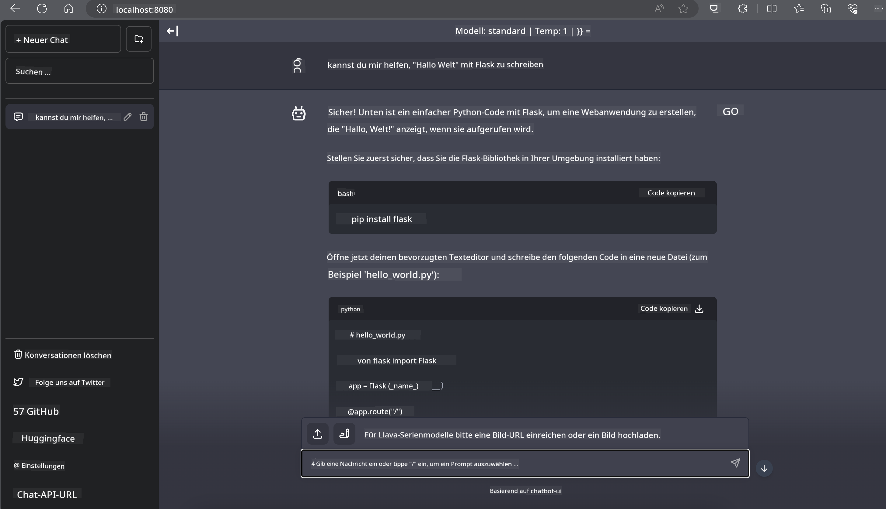

<!--
CO_OP_TRANSLATOR_METADATA:
{
  "original_hash": "be4101a30d98e95a71d42c276e8bcd37",
  "translation_date": "2025-03-27T07:24:35+00:00",
  "source_file": "md\\01.Introduction\\03\\Jetson_Inference.md",
  "language_code": "de"
}
-->
# **Inference Phi-3 in Nvidia Jetson**

Nvidia Jetson ist eine Serie von eingebetteten Computerboards von Nvidia. Die Modelle Jetson TK1, TX1 und TX2 enthalten alle einen Tegra-Prozessor (oder SoC) von Nvidia, der eine zentrale Verarbeitungseinheit (CPU) mit ARM-Architektur integriert. Jetson ist ein energieeffizientes System und wurde entwickelt, um maschinelles Lernen zu beschleunigen. Nvidia Jetson wird von professionellen Entwicklern genutzt, um bahnbrechende KI-Produkte in allen Branchen zu entwickeln, sowie von Studenten und Enthusiasten für praxisnahes KI-Lernen und die Erstellung beeindruckender Projekte. SLM wird auf Edge-Geräten wie Jetson eingesetzt, was eine bessere Umsetzung industrieller generativer KI-Anwendungsszenarien ermöglicht.

## Deployment auf NVIDIA Jetson:
Entwickler, die an autonomen Robotern und eingebetteten Geräten arbeiten, können Phi-3 Mini nutzen. Die relativ kleine Größe von Phi-3 macht es ideal für den Einsatz an der Edge. Die Parameter wurden während des Trainings sorgfältig abgestimmt, um eine hohe Genauigkeit der Antworten sicherzustellen.

### TensorRT-LLM-Optimierung:
Die [TensorRT-LLM-Bibliothek](https://github.com/NVIDIA/TensorRT-LLM?WT.mc_id=aiml-138114-kinfeylo) von NVIDIA optimiert die Inferenz großer Sprachmodelle. Sie unterstützt das lange Kontextfenster von Phi-3 Mini und verbessert sowohl den Durchsatz als auch die Latenz. Zu den Optimierungen gehören Techniken wie LongRoPE, FP8 und inflight batching.

### Verfügbarkeit und Deployment:
Entwickler können Phi-3 Mini mit dem 128K-Kontextfenster bei [NVIDIA's AI](https://www.nvidia.com/en-us/ai-data-science/generative-ai/) erkunden. Es wird als NVIDIA NIM geliefert, ein Microservice mit einer standardisierten API, der überall eingesetzt werden kann. Zusätzlich gibt es die [TensorRT-LLM-Implementierungen auf GitHub](https://github.com/NVIDIA/TensorRT-LLM).

## **1. Vorbereitung**

a. Jetson Orin NX / Jetson NX

b. JetPack 5.1.2+
   
c. Cuda 11.8
   
d. Python 3.8+

## **2. Ausführung von Phi-3 auf Jetson**

Wir können [Ollama](https://ollama.com) oder [LlamaEdge](https://llamaedge.com) wählen.

Wenn Sie gguf gleichzeitig in der Cloud und auf Edge-Geräten verwenden möchten, kann LlamaEdge als WasmEdge verstanden werden (WasmEdge ist eine leichtgewichtige, leistungsstarke, skalierbare WebAssembly-Laufzeit, die für cloud-native, Edge- und dezentrale Anwendungen geeignet ist. Es unterstützt serverlose Anwendungen, eingebettete Funktionen, Microservices, Smart Contracts und IoT-Geräte. Mit LlamaEdge können Sie das quantitative Modell von gguf auf Edge-Geräten und in der Cloud bereitstellen.


Hier sind die Schritte zur Verwendung:

1. Installieren und Herunterladen der entsprechenden Bibliotheken und Dateien

```bash

curl -sSf https://raw.githubusercontent.com/WasmEdge/WasmEdge/master/utils/install.sh | bash -s -- --plugin wasi_nn-ggml

curl -LO https://github.com/LlamaEdge/LlamaEdge/releases/latest/download/llama-api-server.wasm

curl -LO https://github.com/LlamaEdge/chatbot-ui/releases/latest/download/chatbot-ui.tar.gz

tar xzf chatbot-ui.tar.gz

```

**Hinweis**: llama-api-server.wasm und chatbot-ui müssen sich im selben Verzeichnis befinden.

2. Skripte im Terminal ausführen

```bash

wasmedge --dir .:. --nn-preload default:GGML:AUTO:{Your gguf path} llama-api-server.wasm -p phi-3-chat

```

Hier ist das Ergebnis der Ausführung:



***Beispielcode*** [Phi-3 mini WASM Notebook Sample](https://github.com/Azure-Samples/Phi-3MiniSamples/tree/main/wasm)

Zusammenfassend stellt Phi-3 Mini einen großen Fortschritt im Bereich der Sprachmodellierung dar. Es kombiniert Effizienz, Kontextbewusstsein und die Optimierungskompetenz von NVIDIA. Egal, ob Sie Roboter oder Edge-Anwendungen entwickeln, Phi-3 Mini ist ein leistungsstarkes Werkzeug, das Sie kennen sollten.

**Haftungsausschluss**:  
Dieses Dokument wurde mit dem KI-Übersetzungsdienst [Co-op Translator](https://github.com/Azure/co-op-translator) übersetzt. Obwohl wir uns um Genauigkeit bemühen, beachten Sie bitte, dass automatisierte Übersetzungen Fehler oder Ungenauigkeiten enthalten können. Das Originaldokument in seiner ursprünglichen Sprache sollte als maßgebliche Quelle betrachtet werden. Für kritische Informationen wird eine professionelle menschliche Übersetzung empfohlen. Wir übernehmen keine Haftung für Missverständnisse oder Fehlinterpretationen, die durch die Nutzung dieser Übersetzung entstehen.