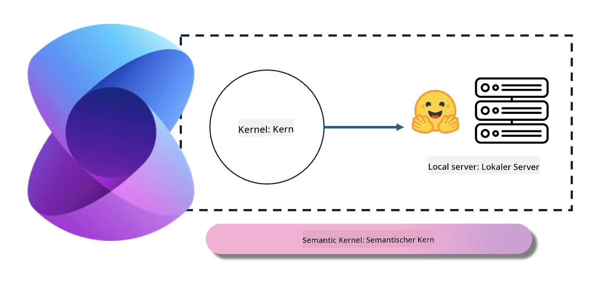
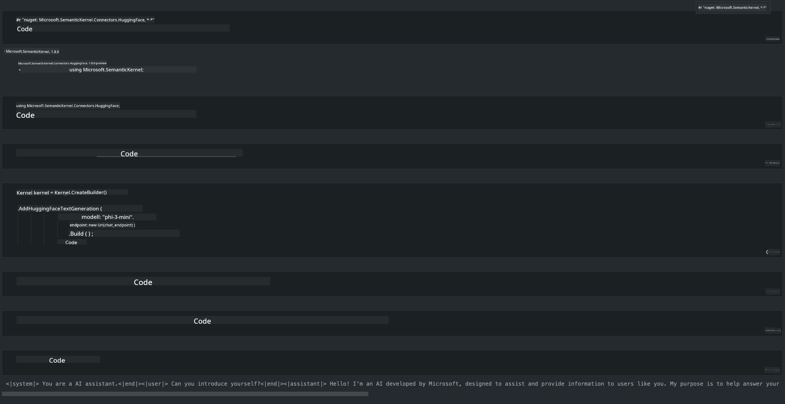

<!--
CO_OP_TRANSLATOR_METADATA:
{
  "original_hash": "bcf5dd7031db0031abdb9dd0c05ba118",
  "translation_date": "2025-03-27T07:41:56+00:00",
  "source_file": "md\\01.Introduction\\03\\Local_Server_Inference.md",
  "language_code": "de"
}
-->
# **Inference Phi-3 auf einem lokalen Server**

Wir können Phi-3 auf einem lokalen Server bereitstellen. Benutzer können [Ollama](https://ollama.com) oder [LM Studio](https://llamaedge.com) Lösungen wählen oder ihren eigenen Code schreiben. Sie können die lokalen Dienste von Phi-3 über [Semantic Kernel](https://github.com/microsoft/semantic-kernel?WT.mc_id=aiml-138114-kinfeylo) oder [Langchain](https://www.langchain.com/) verbinden, um Copilot-Anwendungen zu erstellen.

## **Verwendung von Semantic Kernel für den Zugriff auf Phi-3-mini**

In der Copilot-Anwendung erstellen wir Anwendungen mithilfe von Semantic Kernel / LangChain. Diese Art von Anwendungsframework ist im Allgemeinen kompatibel mit Azure OpenAI Service / OpenAI-Modellen und unterstützt auch Open-Source-Modelle auf Hugging Face sowie lokale Modelle. Was müssen wir tun, wenn wir Semantic Kernel verwenden möchten, um auf Phi-3-mini zuzugreifen? Am Beispiel von .NET können wir es mit dem Hugging Face Connector in Semantic Kernel kombinieren. Standardmäßig kann es mit der Modell-ID auf Hugging Face korrespondieren (beim ersten Gebrauch wird das Modell von Hugging Face heruntergeladen, was lange dauert). Alternativ kann man auch eine Verbindung zu einem selbstgebauten lokalen Dienst herstellen. Im Vergleich der beiden empfehlen wir die zweite Option, da sie eine höhere Autonomie bietet, insbesondere in Unternehmensanwendungen.

Wie in der Abbildung gezeigt, kann der Zugriff auf lokale Dienste über Semantic Kernel einfach mit dem selbstgebauten Phi-3-mini Modellserver verbunden werden. Hier ist das Ergebnis der Ausführung:

***Beispielcode*** https://github.com/kinfey/Phi3MiniSamples/tree/main/semantickernel

**Haftungsausschluss**:  
Dieses Dokument wurde mithilfe des KI-Übersetzungsdienstes [Co-op Translator](https://github.com/Azure/co-op-translator) übersetzt. Obwohl wir uns um Genauigkeit bemühen, beachten Sie bitte, dass automatisierte Übersetzungen Fehler oder Ungenauigkeiten enthalten können. Das Originaldokument in seiner ursprünglichen Sprache sollte als maßgebliche Quelle betrachtet werden. Für kritische Informationen wird eine professionelle menschliche Übersetzung empfohlen. Wir haften nicht für Missverständnisse oder Fehlinterpretationen, die sich aus der Nutzung dieser Übersetzung ergeben.