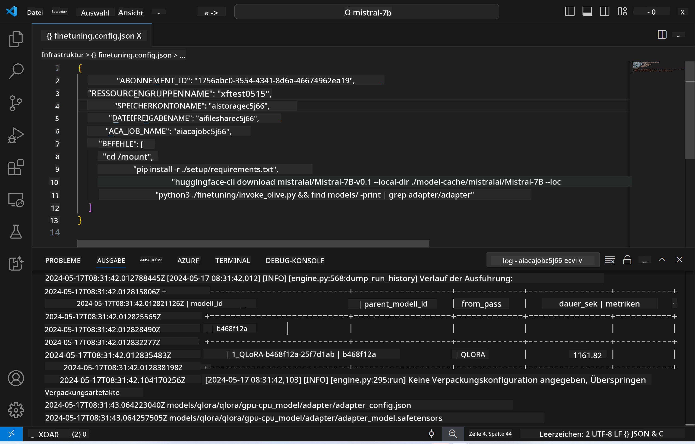
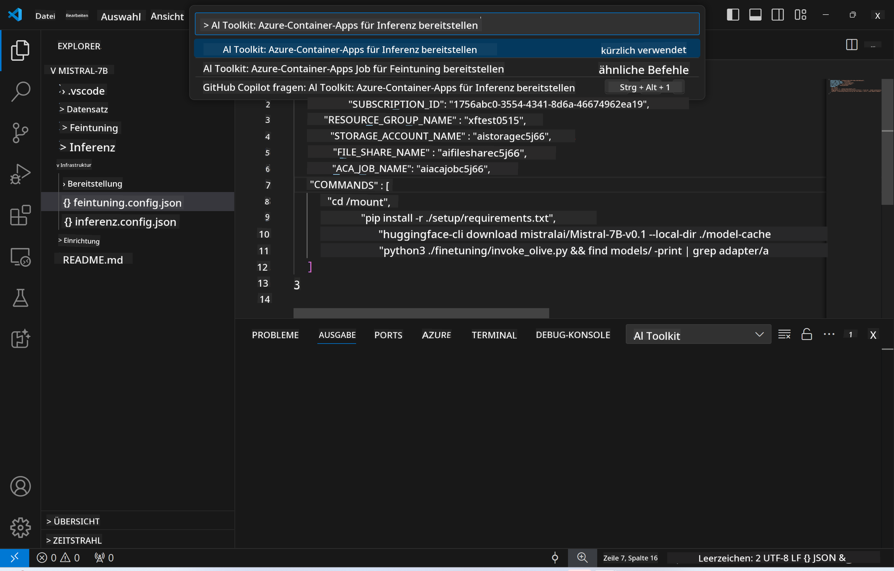
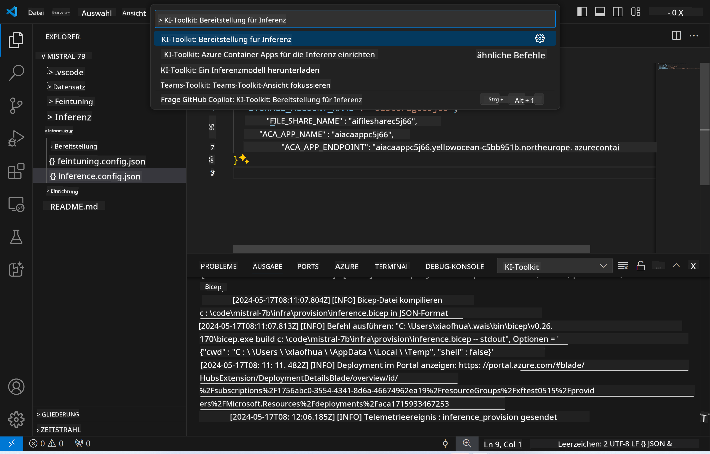
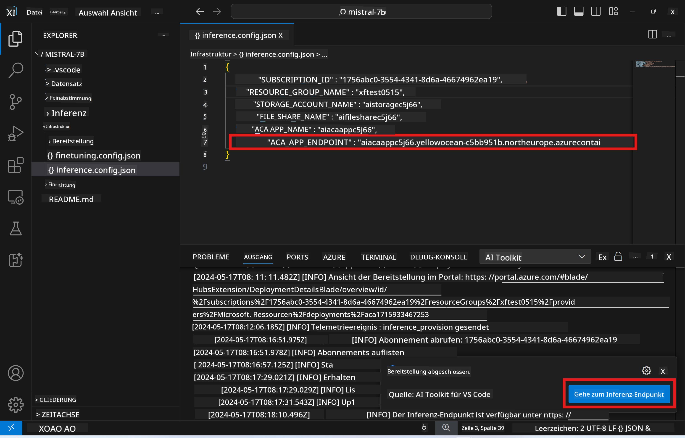

<!--
CO_OP_TRANSLATOR_METADATA:
{
  "original_hash": "a54cd3d65b6963e4e8ce21e143c3ab04",
  "translation_date": "2025-03-27T08:00:22+00:00",
  "source_file": "md\\01.Introduction\\03\\Remote_Interence.md",
  "language_code": "de"
}
-->
# Remote-Inferenz mit dem feinabgestimmten Modell

Nachdem die Adapter in der Remote-Umgebung trainiert wurden, können Sie mit einer einfachen Gradio-Anwendung mit dem Modell interagieren.



### Azure-Ressourcen bereitstellen
Sie müssen die Azure-Ressourcen für die Remote-Inferenz einrichten, indem Sie `AI Toolkit: Provision Azure Container Apps for inference` aus der Befehlsleiste ausführen. Während dieses Setups werden Sie aufgefordert, Ihr Azure-Abonnement und Ihre Ressourcengruppe auszuwählen.  


Standardmäßig sollten das Abonnement und die Ressourcengruppe für die Inferenz mit denen übereinstimmen, die für die Feinabstimmung verwendet wurden. Die Inferenz nutzt dieselbe Azure Container App-Umgebung und greift auf das Modell und den Modell-Adapter zu, die während des Feinabstimmungsprozesses in Azure Files gespeichert wurden.

## Verwendung des AI Toolkits 

### Bereitstellung für Inferenz  
Wenn Sie den Inferenzcode überarbeiten oder das Inferenzmodell neu laden möchten, führen Sie den Befehl `AI Toolkit: Deploy for inference` aus. Dadurch wird Ihr neuester Code mit ACA synchronisiert und die Replik neu gestartet.  



Nach erfolgreichem Abschluss der Bereitstellung ist das Modell nun bereit, über diesen Endpunkt evaluiert zu werden.

### Zugriff auf die Inferenz-API

Sie können auf die Inferenz-API zugreifen, indem Sie auf die Schaltfläche "*Go to Inference Endpoint*" klicken, die in der VSCode-Benachrichtigung angezeigt wird. Alternativ finden Sie den Web-API-Endpunkt unter `ACA_APP_ENDPOINT` in `./infra/inference.config.json` sowie im Ausgabefenster.



> **Hinweis:** Der Inferenz-Endpunkt benötigt möglicherweise einige Minuten, um vollständig einsatzbereit zu sein.

## In der Vorlage enthaltene Inferenzkomponenten
 
| Ordner | Inhalte |
| ------ |--------- |
| `infra` | Enthält alle notwendigen Konfigurationen für Remote-Operationen. |
| `infra/provision/inference.parameters.json` | Enthält Parameter für die Bicep-Vorlagen, die für die Bereitstellung der Azure-Ressourcen für die Inferenz verwendet werden. |
| `infra/provision/inference.bicep` | Beinhaltet Vorlagen zur Bereitstellung von Azure-Ressourcen für die Inferenz. |
| `infra/inference.config.json` | Die Konfigurationsdatei, die durch den Befehl `AI Toolkit: Provision Azure Container Apps for inference` generiert wurde. Sie dient als Eingabe für andere Remote-Befehlsleisten. |

### Verwendung des AI Toolkits zur Konfiguration der Azure-Ressourcenbereitstellung
Konfigurieren Sie das [AI Toolkit](https://marketplace.visualstudio.com/items?itemName=ms-windows-ai-studio.windows-ai-studio).

Provisionieren Sie Azure Container Apps für die Inferenz` command.

You can find configuration parameters in `./infra/provision/inference.parameters.json` file. Here are the details:
| Parameter | Description |
| --------- |------------ |
| `defaultCommands` | This is the commands to initiate a web API. |
| `maximumInstanceCount` | This parameter sets the maximum capacity of GPU instances. |
| `location` | This is the location where Azure resources are provisioned. The default value is the same as the chosen resource group's location. |
| `storageAccountName`, `fileShareName` `acaEnvironmentName`, `acaEnvironmentStorageName`, `acaAppName`,  `acaLogAnalyticsName` | These parameters are used to name the Azure resources for provision. By default, they will be same to the fine-tuning resource name. You can input a new, unused resource name to create your own custom-named resources, or you can input the name of an already existing Azure resource if you'd prefer to use that. For details, refer to the section [Using existing Azure Resources](../../../../../md/01.Introduction/03). |

### Using Existing Azure Resources

By default, the inference provision use the same Azure Container App Environment, Storage Account, Azure File Share, and Azure Log Analytics that were used for fine-tuning. A separate Azure Container App is created solely for the inference API. 

If you have customized the Azure resources during the fine-tuning step or want to use your own existing Azure resources for inference, specify their names in the `./infra/inference.parameters.json`-Datei. Führen Sie dann den Befehl `AI Toolkit: Provision Azure Container Apps for inference` aus der Befehlsleiste aus. Dadurch werden alle angegebenen Ressourcen aktualisiert und fehlende Ressourcen erstellt.

Zum Beispiel, wenn Sie bereits eine vorhandene Azure-Container-Umgebung haben, sollte Ihre `./infra/finetuning.parameters.json` so aussehen:

```json
{
    "$schema": "https://schema.management.azure.com/schemas/2019-04-01/deploymentParameters.json#",
    "contentVersion": "1.0.0.0",
    "parameters": {
      ...
      "acaEnvironmentName": {
        "value": "<your-aca-env-name>"
      },
      "acaEnvironmentStorageName": {
        "value": null
      },
      ...
    }
  }
```

### Manuelle Bereitstellung  
Wenn Sie die Azure-Ressourcen lieber manuell konfigurieren möchten, können Sie die bereitgestellten Bicep-Dateien im Ordner `./infra/provision` folders. If you have already set up and configured all the Azure resources without using the AI Toolkit command palette, you can simply enter the resource names in the `inference.config.json` verwenden.

Zum Beispiel:

```json
{
  "SUBSCRIPTION_ID": "<your-subscription-id>",
  "RESOURCE_GROUP_NAME": "<your-resource-group-name>",
  "STORAGE_ACCOUNT_NAME": "<your-storage-account-name>",
  "FILE_SHARE_NAME": "<your-file-share-name>",
  "ACA_APP_NAME": "<your-aca-name>",
  "ACA_APP_ENDPOINT": "<your-aca-endpoint>"
}
```

**Haftungsausschluss**:  
Dieses Dokument wurde mit dem KI-Übersetzungsdienst [Co-op Translator](https://github.com/Azure/co-op-translator) übersetzt. Obwohl wir uns um Genauigkeit bemühen, beachten Sie bitte, dass automatisierte Übersetzungen Fehler oder Ungenauigkeiten enthalten können. Das Originaldokument in seiner ursprünglichen Sprache sollte als maßgebliche Quelle betrachtet werden. Für wichtige Informationen wird eine professionelle menschliche Übersetzung empfohlen. Wir haften nicht für Missverständnisse oder Fehlinterpretationen, die sich aus der Nutzung dieser Übersetzung ergeben.