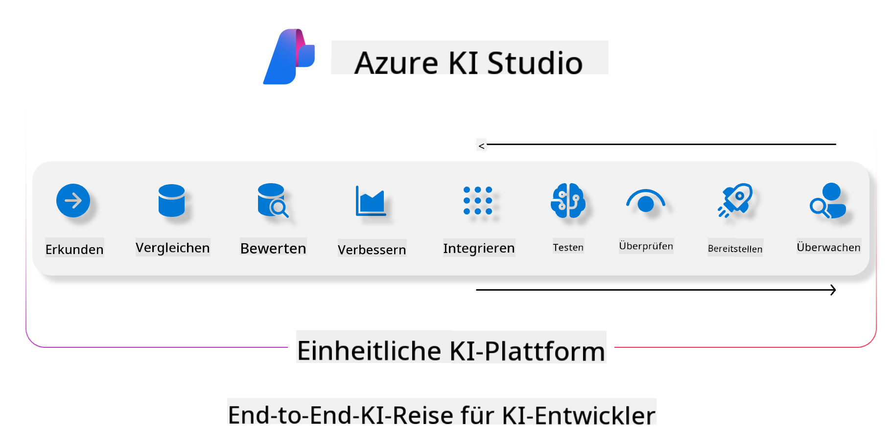
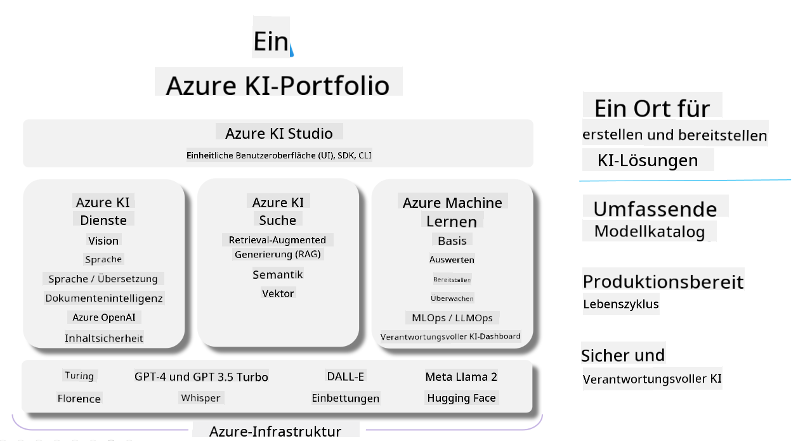

<!--
CO_OP_TRANSLATOR_METADATA:
{
  "original_hash": "7b4235159486df4000e16b7b46ddfec3",
  "translation_date": "2025-03-27T08:50:40+00:00",
  "source_file": "md\\01.Introduction\\05\\AIFoundry.md",
  "language_code": "de"
}
-->
# **Verwendung von Azure AI Foundry zur Bewertung**

Wie Sie Ihre generative KI-Anwendung mit [Azure AI Foundry](https://ai.azure.com?WT.mc_id=aiml-138114-kinfeylo) bewerten können. Egal, ob Sie Einzel- oder Mehrfachdialoge analysieren, Azure AI Foundry bietet Tools zur Bewertung der Modellleistung und -sicherheit.

## So bewerten Sie generative KI-Anwendungen mit Azure AI Foundry
Für detaillierte Anweisungen siehe die [Azure AI Foundry Dokumentation](https://learn.microsoft.com/azure/ai-studio/how-to/evaluate-generative-ai-app?WT.mc_id=aiml-138114-kinfeylo).

Hier sind die Schritte, um zu beginnen:

## Bewertung von generativen KI-Modellen in Azure AI Foundry

**Voraussetzungen**

- Ein Testdatensatz im CSV- oder JSON-Format.
- Ein bereitgestelltes generatives KI-Modell (wie Phi-3, GPT 3.5, GPT 4 oder Davinci-Modelle).
- Eine Laufzeit mit einer Compute-Instanz zur Durchführung der Bewertung.

## Eingebaute Bewertungsmetriken

Azure AI Foundry ermöglicht die Bewertung sowohl von Einzel- als auch von komplexen Mehrfachdialogen.
Für Retrieval Augmented Generation (RAG)-Szenarien, bei denen das Modell auf spezifischen Daten basiert, können Sie die Leistung anhand eingebauter Bewertungsmetriken beurteilen.
Darüber hinaus können Sie allgemeine Einzelturn-Frage-Antwort-Szenarien (nicht-RAG) bewerten.

## Erstellung eines Bewertungsdurchlaufs

Navigieren Sie in der Benutzeroberfläche von Azure AI Foundry zur Seite „Evaluate“ oder „Prompt Flow“.
Folgen Sie dem Assistenten zur Erstellung eines Bewertungsdurchlaufs, um die Bewertung einzurichten. Geben Sie einen optionalen Namen für Ihre Bewertung an.
Wählen Sie das Szenario aus, das mit den Zielen Ihrer Anwendung übereinstimmt.
Wählen Sie eine oder mehrere Bewertungsmetriken aus, um die Ausgabe des Modells zu bewerten.

## Benutzerdefinierter Bewertungsprozess (Optional)

Für mehr Flexibilität können Sie einen benutzerdefinierten Bewertungsprozess einrichten. Passen Sie den Bewertungsprozess basierend auf Ihren spezifischen Anforderungen an.

## Ergebnisse anzeigen

Nach der Durchführung der Bewertung können Sie detaillierte Bewertungsmetriken in Azure AI Foundry protokollieren, anzeigen und analysieren. Gewinnen Sie Einblicke in die Fähigkeiten und Einschränkungen Ihrer Anwendung.

**Hinweis** Azure AI Foundry befindet sich derzeit in der öffentlichen Vorschau, daher sollte es für Experimentier- und Entwicklungszwecke genutzt werden. Für produktive Workloads sollten andere Optionen in Betracht gezogen werden. Weitere Details und Schritt-für-Schritt-Anleitungen finden Sie in der offiziellen [AI Foundry Dokumentation](https://learn.microsoft.com/azure/ai-studio/?WT.mc_id=aiml-138114-kinfeylo).

**Haftungsausschluss**:  
Dieses Dokument wurde mithilfe des KI-Übersetzungsdienstes [Co-op Translator](https://github.com/Azure/co-op-translator) übersetzt. Obwohl wir uns um Genauigkeit bemühen, beachten Sie bitte, dass automatisierte Übersetzungen Fehler oder Ungenauigkeiten enthalten können. Das Originaldokument in seiner ursprünglichen Sprache sollte als maßgebliche Quelle betrachtet werden. Für kritische Informationen wird eine professionelle menschliche Übersetzung empfohlen. Wir übernehmen keine Haftung für Missverständnisse oder Fehlinterpretationen, die durch die Nutzung dieser Übersetzung entstehen.