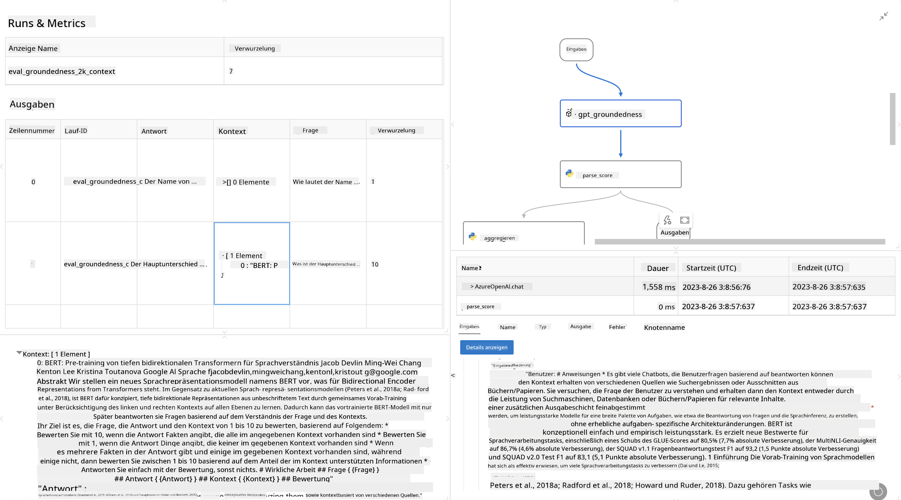

<!--
CO_OP_TRANSLATOR_METADATA:
{
  "original_hash": "3cbe7629d254f1043193b7fe22524d55",
  "translation_date": "2025-03-27T08:58:46+00:00",
  "source_file": "md\\01.Introduction\\05\\Promptflow.md",
  "language_code": "de"
}
-->
# **Einführung in Promptflow**

[Microsoft Prompt Flow](https://microsoft.github.io/promptflow/index.html?WT.mc_id=aiml-138114-kinfeylo) ist ein visuelles Tool zur Workflow-Automatisierung, das es Nutzern ermöglicht, automatisierte Workflows mit vorgefertigten Vorlagen und benutzerdefinierten Konnektoren zu erstellen. Es wurde entwickelt, um Entwicklern und Business-Analysten zu helfen, schnell automatisierte Prozesse für Aufgaben wie Datenmanagement, Zusammenarbeit und Prozessoptimierung zu erstellen. Mit Prompt Flow können Nutzer problemlos verschiedene Dienste, Anwendungen und Systeme verbinden und komplexe Geschäftsprozesse automatisieren.

Microsoft Prompt Flow wurde entwickelt, um den gesamten Entwicklungszyklus von KI-Anwendungen, die auf großen Sprachmodellen (LLMs) basieren, zu vereinfachen. Egal, ob Sie Ideen entwickeln, Prototypen erstellen, testen, bewerten oder LLM-basierte Anwendungen bereitstellen – Prompt Flow macht den Prozess einfacher und ermöglicht die Erstellung von LLM-Anwendungen in Produktionsqualität.

## Hier sind die wichtigsten Funktionen und Vorteile von Microsoft Prompt Flow:

**Interaktive Entwicklungsumgebung**

Prompt Flow bietet eine visuelle Darstellung der Struktur Ihres Workflows, was das Verständnis und die Navigation Ihrer Projekte erleichtert.
Es bietet eine notebook-ähnliche Programmiererfahrung für effiziente Workflow-Entwicklung und Debugging.

**Prompt-Varianten und Feinabstimmung**

Erstellen und vergleichen Sie mehrere Prompt-Varianten, um einen iterativen Verfeinerungsprozess zu unterstützen. Bewerten Sie die Leistung verschiedener Prompts und wählen Sie die effektivsten aus.

**Integrierte Bewertungs-Workflows**

Bewerten Sie die Qualität und Effektivität Ihrer Prompts und Workflows mit integrierten Bewertungswerkzeugen.
Verstehen Sie, wie gut Ihre LLM-basierten Anwendungen funktionieren.

**Umfassende Ressourcen**

Prompt Flow enthält eine Bibliothek mit integrierten Tools, Beispielen und Vorlagen. Diese Ressourcen dienen als Ausgangspunkt für die Entwicklung, fördern Kreativität und beschleunigen den Prozess.

**Zusammenarbeit und Unternehmensbereitschaft**

Unterstützen Sie die Teamarbeit, indem Sie mehreren Nutzern erlauben, gemeinsam an Prompt-Engineering-Projekten zu arbeiten.
Verwalten Sie Versionskontrolle und teilen Sie Wissen effektiv. Optimieren Sie den gesamten Prompt-Engineering-Prozess, von der Entwicklung und Bewertung bis hin zur Bereitstellung und Überwachung.

## Bewertung in Prompt Flow 

In Microsoft Prompt Flow spielt die Bewertung eine entscheidende Rolle bei der Analyse der Leistung Ihrer KI-Modelle. Lassen Sie uns erkunden, wie Sie Bewertungs-Workflows und Metriken innerhalb von Prompt Flow anpassen können:

**Verständnis der Bewertung in Prompt Flow**

In Prompt Flow stellt ein Workflow eine Abfolge von Knoten dar, die Eingaben verarbeiten und Ausgaben erzeugen. Bewertungs-Workflows sind spezielle Arten von Workflows, die dazu dienen, die Leistung eines Durchlaufs basierend auf spezifischen Kriterien und Zielen zu bewerten.

**Wichtige Merkmale von Bewertungs-Workflows**

Sie laufen typischerweise nach dem getesteten Workflow und verwenden dessen Ausgaben. Sie berechnen Scores oder Metriken, um die Leistung des getesteten Workflows zu messen. Metriken können Genauigkeit, Relevanz-Scores oder andere relevante Maße umfassen.

### Anpassung von Bewertungs-Workflows

**Definition von Eingaben**

Bewertungs-Workflows müssen die Ausgaben des getesteten Workflows aufnehmen. Definieren Sie Eingaben ähnlich wie bei Standard-Workflows.
Beispielsweise, wenn Sie einen QnA-Workflow bewerten, benennen Sie eine Eingabe als "Antwort". Wenn Sie einen Klassifikations-Workflow bewerten, benennen Sie eine Eingabe als "Kategorie". Auch Eingaben mit den tatsächlichen Werten (z. B. tatsächliche Labels) können erforderlich sein.

**Ausgaben und Metriken**

Bewertungs-Workflows erzeugen Ergebnisse, die die Leistung des getesteten Workflows messen. Metriken können mithilfe von Python oder LLM (Large Language Models) berechnet werden. Verwenden Sie die Funktion log_metric(), um relevante Metriken zu protokollieren.

**Verwendung angepasster Bewertungs-Workflows**

Entwickeln Sie Ihren eigenen Bewertungs-Workflow, der speziell auf Ihre Aufgaben und Ziele zugeschnitten ist. Passen Sie Metriken basierend auf Ihren Bewertungszielen an.
Wenden Sie diesen angepassten Bewertungs-Workflow auf Batch-Durchläufe für groß angelegte Tests an.

## Eingebaute Bewertungsmethoden

Prompt Flow bietet auch eingebaute Bewertungsmethoden.
Sie können Batch-Durchläufe einreichen und diese Methoden nutzen, um zu bewerten, wie gut Ihr Workflow mit großen Datensätzen funktioniert.
Betrachten Sie die Bewertungsergebnisse, vergleichen Sie Metriken und iterieren Sie nach Bedarf.
Denken Sie daran, dass die Bewertung entscheidend ist, um sicherzustellen, dass Ihre KI-Modelle die gewünschten Kriterien und Ziele erfüllen. Erkunden Sie die offizielle Dokumentation für detaillierte Anleitungen zur Entwicklung und Nutzung von Bewertungs-Workflows in Microsoft Prompt Flow.

Zusammenfassend ermöglicht Microsoft Prompt Flow Entwicklern die Erstellung hochwertiger LLM-Anwendungen, indem es Prompt-Engineering vereinfacht und eine robuste Entwicklungsumgebung bereitstellt. Wenn Sie mit LLMs arbeiten, ist Prompt Flow ein wertvolles Tool, das Sie erkunden sollten. Erkunden Sie die [Prompt Flow Evaluation Documents](https://learn.microsoft.com/azure/machine-learning/prompt-flow/how-to-develop-an-evaluation-flow?view=azureml-api-2?WT.mc_id=aiml-138114-kinfeylo) für detaillierte Anleitungen zur Entwicklung und Nutzung von Bewertungs-Workflows in Microsoft Prompt Flow.

**Haftungsausschluss**:  
Dieses Dokument wurde mithilfe des KI-Übersetzungsdienstes [Co-op Translator](https://github.com/Azure/co-op-translator) übersetzt. Obwohl wir uns um Genauigkeit bemühen, weisen wir darauf hin, dass automatisierte Übersetzungen Fehler oder Ungenauigkeiten enthalten können. Das Originaldokument in seiner ursprünglichen Sprache sollte als maßgebliche Quelle betrachtet werden. Für kritische Informationen wird eine professionelle menschliche Übersetzung empfohlen. Wir übernehmen keine Haftung für Missverständnisse oder Fehlinterpretationen, die sich aus der Nutzung dieser Übersetzung ergeben.