<!--
CO_OP_TRANSLATOR_METADATA:
{
  "original_hash": "455be2b7b9c3390d367d528f8fab2aa0",
  "translation_date": "2025-03-27T09:57:23+00:00",
  "source_file": "md\\02.Application\\01.TextAndChat\\Phi3\\E2E_Phi-3-FineTuning_PromptFlow_Integration.md",
  "language_code": "de"
}
-->
# Feinabstimmung und Integration von benutzerdefinierten Phi-3-Modellen mit Prompt Flow

Dieses End-to-End (E2E)-Beispiel basiert auf der Anleitung "[Feinabstimmung und Integration benutzerdefinierter Phi-3-Modelle mit Prompt Flow: Schritt-für-Schritt-Anleitung](https://techcommunity.microsoft.com/t5/educator-developer-blog/fine-tune-and-integrate-custom-phi-3-models-with-prompt-flow/ba-p/4178612?WT.mc_id=aiml-137032-kinfeylo)" aus der Microsoft Tech Community. Es führt durch die Prozesse der Feinabstimmung, Bereitstellung und Integration benutzerdefinierter Phi-3-Modelle mit Prompt Flow.

## Übersicht

In diesem E2E-Beispiel lernen Sie, wie Sie das Phi-3-Modell feinabstimmen und mit Prompt Flow integrieren. Durch die Nutzung von Azure Machine Learning und Prompt Flow erstellen Sie einen Workflow zur Bereitstellung und Nutzung benutzerdefinierter KI-Modelle. Dieses E2E-Beispiel ist in drei Szenarien unterteilt:

**Szenario 1: Azure-Ressourcen einrichten und Vorbereitung zur Feinabstimmung**

**Szenario 2: Feinabstimmung des Phi-3-Modells und Bereitstellung im Azure Machine Learning Studio**

**Szenario 3: Integration mit Prompt Flow und Interaktion mit Ihrem benutzerdefinierten Modell**

Hier ist eine Übersicht über dieses E2E-Beispiel.

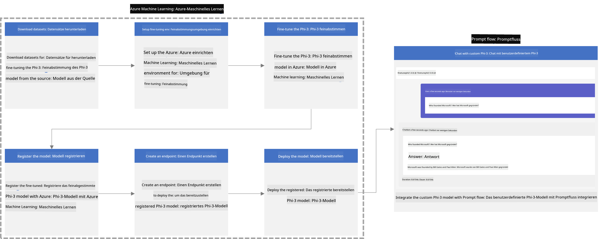

### Inhaltsverzeichnis

1. **[Szenario 1: Azure-Ressourcen einrichten und Vorbereitung zur Feinabstimmung](../../../../../../md/02.Application/01.TextAndChat/Phi3)**
    - [Erstellen eines Azure Machine Learning Workspaces](../../../../../../md/02.Application/01.TextAndChat/Phi3)
    - [GPU-Kontingente im Azure-Abonnement anfordern](../../../../../../md/02.Application/01.TextAndChat/Phi3)
    - [Rollenberechtigungen hinzufügen](../../../../../../md/02.Application/01.TextAndChat/Phi3)
    - [Projekt einrichten](../../../../../../md/02.Application/01.TextAndChat/Phi3)
    - [Datensatz für die Feinabstimmung vorbereiten](../../../../../../md/02.Application/01.TextAndChat/Phi3)

1. **[Szenario 2: Feinabstimmung des Phi-3-Modells und Bereitstellung im Azure Machine Learning Studio](../../../../../../md/02.Application/01.TextAndChat/Phi3)**
    - [Azure CLI einrichten](../../../../../../md/02.Application/01.TextAndChat/Phi3)
    - [Phi-3-Modell feinabstimmen](../../../../../../md/02.Application/01.TextAndChat/Phi3)
    - [Feinabgestimmtes Modell bereitstellen](../../../../../../md/02.Application/01.TextAndChat/Phi3)

1. **[Szenario 3: Integration mit Prompt Flow und Interaktion mit Ihrem benutzerdefinierten Modell](../../../../../../md/02.Application/01.TextAndChat/Phi3)**
    - [Integration des benutzerdefinierten Phi-3-Modells mit Prompt Flow](../../../../../../md/02.Application/01.TextAndChat/Phi3)
    - [Interaktion mit Ihrem benutzerdefinierten Modell](../../../../../../md/02.Application/01.TextAndChat/Phi3)

## Szenario 1: Azure-Ressourcen einrichten und Vorbereitung zur Feinabstimmung

### Erstellen eines Azure Machine Learning Workspaces

1. Geben Sie *azure machine learning* in die **Suchleiste** oben auf der Portalseite ein und wählen Sie **Azure Machine Learning** aus den angezeigten Optionen.

    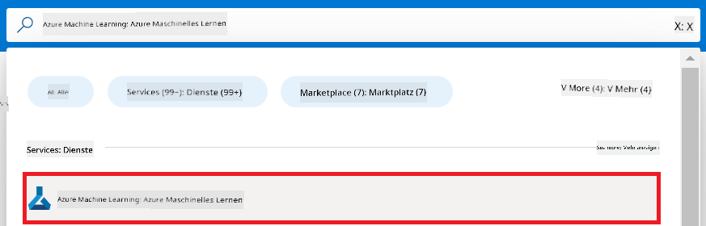

1. Wählen Sie **+ Erstellen** aus dem Navigationsmenü.

1. Wählen Sie **Neuer Workspace** aus dem Navigationsmenü.

    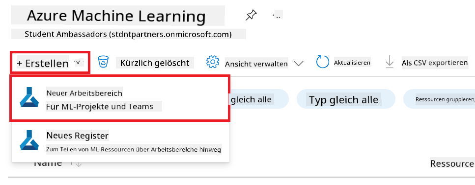

1. Führen Sie folgende Schritte aus:

    - Wählen Sie Ihr Azure-**Abonnement** aus.
    - Wählen Sie die zu verwendende **Ressourcengruppe** aus (erstellen Sie bei Bedarf eine neue).
    - Geben Sie einen **Workspacename** ein. Dieser muss eindeutig sein.
    - Wählen Sie die gewünschte **Region** aus.
    - Wählen Sie das zu verwendende **Speicherkonto** aus (erstellen Sie bei Bedarf ein neues).
    - Wählen Sie den zu verwendenden **Key Vault** aus (erstellen Sie bei Bedarf einen neuen).
    - Wählen Sie die zu verwendenden **Application Insights** aus (erstellen Sie bei Bedarf neue).
    - Wählen Sie das zu verwendende **Container-Register** aus (erstellen Sie bei Bedarf ein neues).

    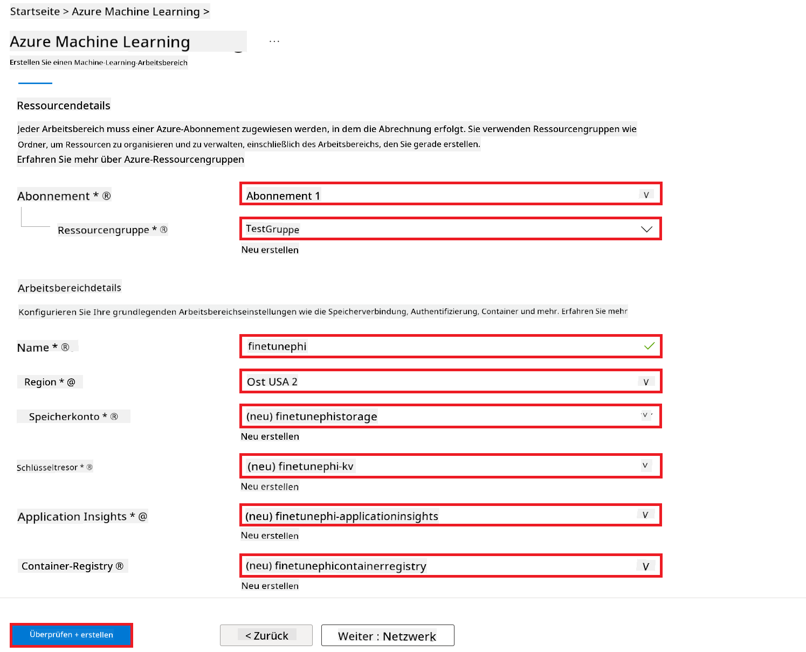

1. Wählen Sie **Überprüfen + Erstellen**.

1. Wählen Sie **Erstellen**.

### GPU-Kontingente im Azure-Abonnement anfordern

In diesem E2E-Beispiel verwenden Sie die *Standard_NC24ads_A100_v4 GPU* für die Feinabstimmung, die eine Kontingentanfrage erfordert, und die *Standard_E4s_v3* CPU für die Bereitstellung, die keine Kontingentanfrage benötigt.

> [!NOTE]
>
> Nur Pay-As-You-Go-Abonnements (der Standardabonnementtyp) sind für die GPU-Zuweisung berechtigt; Vorteil-Abonnements werden derzeit nicht unterstützt.
>
> Für diejenigen, die Vorteil-Abonnements (wie Visual Studio Enterprise Subscription) verwenden oder die Feinabstimmung und Bereitstellung schnell testen möchten, bietet dieses Tutorial auch Anleitungen zur Feinabstimmung mit einem minimalen Datensatz unter Verwendung einer CPU. Es ist jedoch wichtig zu beachten, dass die Ergebnisse der Feinabstimmung mit einer GPU und größeren Datensätzen erheblich besser sind.

1. Besuchen Sie [Azure ML Studio](https://ml.azure.com/home?wt.mc_id=studentamb_279723).

1. Führen Sie folgende Schritte aus, um ein *Standard NCADSA100v4 Family*-Kontingent anzufordern:

    - Wählen Sie **Kontingent** aus dem linken Tab.
    - Wählen Sie die zu verwendende **Virtual Machine-Familie** aus. Zum Beispiel **Standard NCADSA100v4 Family Cluster Dedicated vCPUs**, die die *Standard_NC24ads_A100_v4* GPU enthält.
    - Wählen Sie **Kontingent anfordern** aus dem Navigationsmenü.

        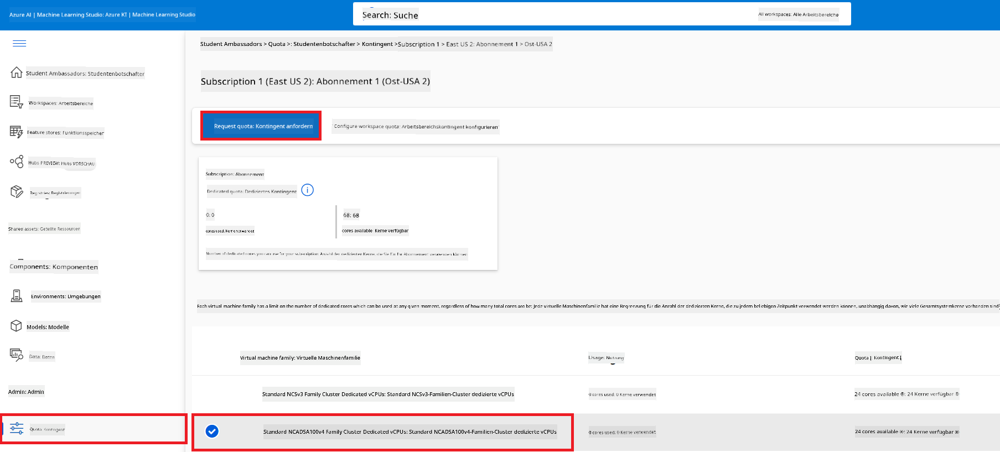

    - Geben Sie auf der Seite Kontingent anfordern das gewünschte **Neue Kerne-Limit** ein. Zum Beispiel 24.
    - Wählen Sie **Einreichen**, um das GPU-Kontingent anzufordern.

> [!NOTE]
> Sie können die für Ihre Anforderungen geeignete GPU oder CPU auswählen, indem Sie die Dokumentation [Größen für virtuelle Maschinen in Azure](https://learn.microsoft.com/azure/virtual-machines/sizes/overview?tabs=breakdownseries%2Cgeneralsizelist%2Ccomputesizelist%2Cmemorysizelist%2Cstoragesizelist%2Cgpusizelist%2Cfpgasizelist%2Chpcsizelist) konsultieren.

### Rollenberechtigungen hinzufügen

Um Ihre Modelle feinabzustimmen und bereitzustellen, müssen Sie zunächst eine Benutzerzugewiesene Verwaltete Identität (UAI) erstellen und ihr die entsprechenden Berechtigungen zuweisen. Diese UAI wird während der Bereitstellung für die Authentifizierung verwendet.

#### Benutzerzugewiesene Verwaltete Identität (UAI) erstellen

1. Geben Sie *verwaltete Identitäten* in die **Suchleiste** oben auf der Portalseite ein und wählen Sie **Verwaltete Identitäten** aus den angezeigten Optionen.

    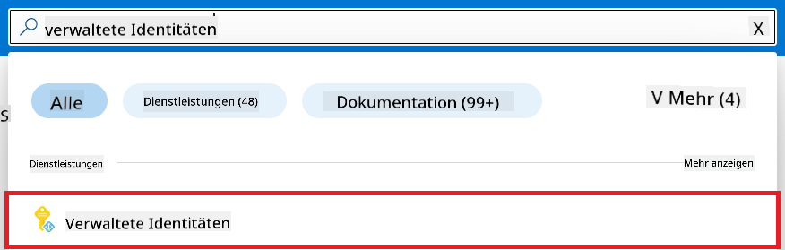

1. Wählen Sie **+ Erstellen**.

    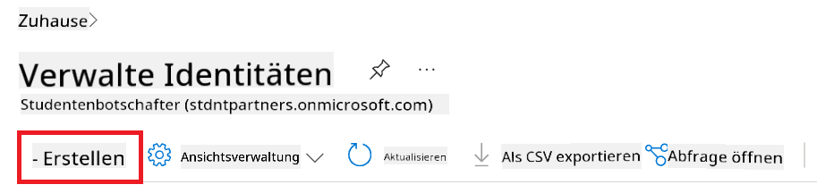

1. Führen Sie folgende Schritte aus:

    - Wählen Sie Ihr Azure-**Abonnement** aus.
    - Wählen Sie die zu verwendende **Ressourcengruppe** aus (erstellen Sie bei Bedarf eine neue).
    - Wählen Sie die gewünschte **Region** aus.
    - Geben Sie einen **Namen** ein. Dieser muss eindeutig sein.

1. Wählen Sie **Überprüfen + Erstellen**.

1. Wählen Sie **+ Erstellen**.

#### Contributor-Rollenberechtigung zur verwalteten Identität hinzufügen

1. Navigieren Sie zur verwalteten Identität, die Sie erstellt haben.

1. Wählen Sie **Azure-Rollenberechtigungen** aus dem linken Tab.

1. Wählen Sie **+Rollenberechtigung hinzufügen** aus dem Navigationsmenü.

1. Führen Sie auf der Seite Rollenberechtigung hinzufügen folgende Schritte aus:
    - Wählen Sie den **Bereich** **Ressourcengruppe**.
    - Wählen Sie Ihr Azure-**Abonnement** aus.
    - Wählen Sie die zu verwendende **Ressourcengruppe**.
    - Wählen Sie die **Rolle** **Contributor**.

    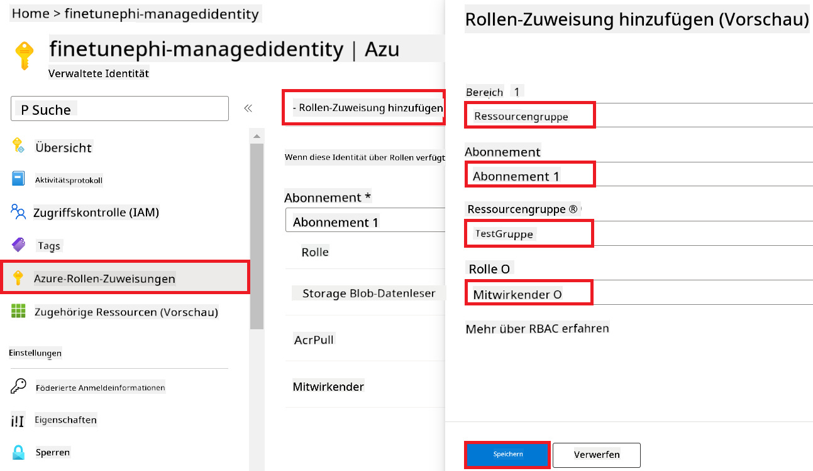

1. Wählen Sie **Speichern**.

#### Rolle "Storage Blob Data Reader" zur verwalteten Identität hinzufügen

1. Geben Sie *Speicherkonten* in die **Suchleiste** oben auf der Portalseite ein und wählen Sie **Speicherkonten** aus den angezeigten Optionen.

    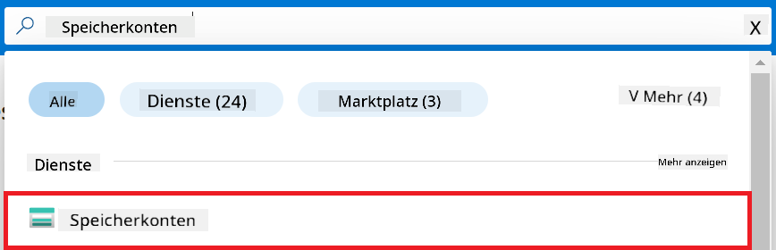

1. Wählen Sie das Speicherkonto aus, das mit dem Azure Machine Learning Workspace verknüpft ist, den Sie erstellt haben. Zum Beispiel *finetunephistorage*.

1. Führen Sie folgende Schritte aus, um zur Seite Rollenberechtigung hinzufügen zu navigieren:

    - Navigieren Sie zum Azure-Speicherkonto, das Sie erstellt haben.
    - Wählen Sie **Zugriffssteuerung (IAM)** aus dem linken Tab.
    - Wählen Sie **+ Hinzufügen** aus dem Navigationsmenü.
    - Wählen Sie **Rollenberechtigung hinzufügen** aus dem Navigationsmenü.

    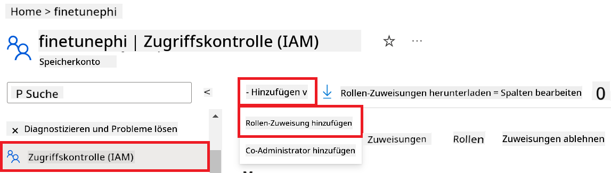

1. Führen Sie auf der Seite Rollenberechtigung hinzufügen folgende Schritte aus:

    - Geben Sie auf der Seite Rolle *Storage Blob Data Reader* in die **Suchleiste** ein und wählen Sie **Storage Blob Data Reader** aus den angezeigten Optionen.
    - Wählen Sie auf der Seite Rolle **Weiter**.
    - Wählen Sie auf der Seite Mitglieder **Zugriff zuweisen an** **Verwaltete Identität**.
    - Wählen Sie auf der Seite Mitglieder **+ Mitglieder auswählen**.
    - Wählen Sie auf der Seite Verwaltete Identitäten auswählen Ihr Azure-**Abonnement** aus.
    - Wählen Sie auf der Seite Verwaltete Identitäten auswählen die **Verwaltete Identität** aus.
    - Wählen Sie auf der Seite Verwaltete Identitäten auswählen die verwaltete Identität, die Sie erstellt haben. Zum Beispiel *finetunephi-managedidentity*.
    - Wählen Sie auf der Seite Verwaltete Identitäten auswählen **Auswählen**.

    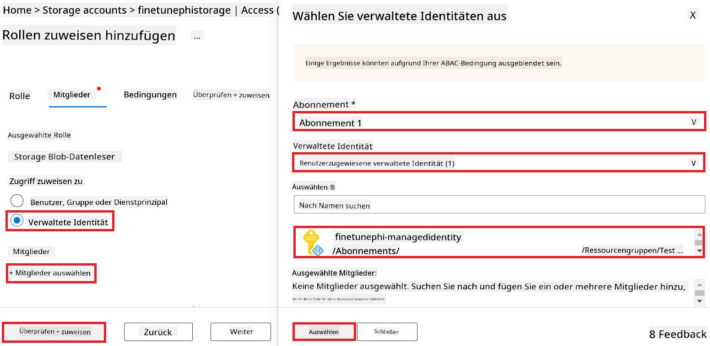

1. Wählen Sie **Überprüfen + Zuweisen**.

#### Rolle "AcrPull" zur verwalteten Identität hinzufügen

1. Geben Sie *Container-Register* in die **Suchleiste** oben auf der Portalseite ein und wählen Sie **Container-Register** aus den angezeigten Optionen.

    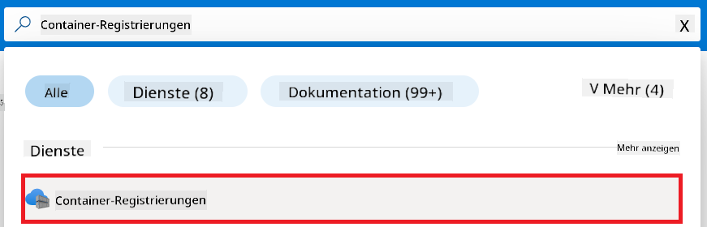

1. Wählen Sie das Container-Register aus, das mit dem Azure Machine Learning Workspace verknüpft ist. Zum Beispiel *finetunephicontainerregistries*.

1. Führen Sie folgende Schritte aus, um zur Seite Rollenberechtigung hinzufügen zu navigieren:

    - Wählen Sie **Zugriffssteuerung (IAM)** aus dem linken Tab.
    - Wählen Sie **+ Hinzufügen** aus dem Navigationsmenü.
    - Wählen Sie **Rollenberechtigung hinzufügen** aus dem Navigationsmenü.

1. Führen Sie auf der Seite Rollenberechtigung hinzufügen folgende Schritte aus:

    - Geben Sie auf der Seite Rolle *AcrPull* in die **Suchleiste** ein und wählen Sie **AcrPull** aus den angezeigten Optionen.
    - Wählen Sie auf der Seite Rolle **Weiter**.
    - Wählen Sie auf der Seite Mitglieder **Zugriff zuweisen an** **Verwaltete Identität**.
    - Wählen Sie auf der Seite Mitglieder **+ Mitglieder auswählen**.
    - Wählen Sie auf der Seite Verwaltete Identitäten auswählen Ihr Azure-**Abonnement** aus.
    - Wählen Sie auf der Seite Verwaltete Identitäten auswählen die **Verwaltete Identität** aus.
    - Wählen Sie auf der Seite Verwaltete Identitäten auswählen die verwaltete Identität, die Sie erstellt haben. Zum Beispiel *finetunephi-managedidentity*.
    - Wählen Sie auf der Seite Verwaltete Identitäten auswählen **Auswählen**.
    - Wählen Sie **Überprüfen + Zuweisen**.

### Projekt einrichten

Nun erstellen Sie einen Ordner, in dem Sie arbeiten, und richten eine virtuelle Umgebung ein, um ein Programm zu entwickeln, das mit Benutzern interagiert und gespeicherte Chatverläufe aus Azure Cosmos DB verwendet, um seine Antworten zu verbessern.

#### Ordner erstellen, in dem gearbeitet wird

1. Öffnen Sie ein Terminalfenster und geben Sie den folgenden Befehl ein, um einen Ordner namens *finetune-phi* im Standardpfad zu erstellen.

    ```console
    mkdir finetune-phi
    ```

1. Geben Sie den folgenden Befehl in Ihr Terminal ein, um zum Ordner *finetune-phi* zu navigieren, den Sie erstellt haben.

    ```console
    cd finetune-phi
    ```

#### Virtuelle Umgebung erstellen

1. Geben Sie den folgenden Befehl in Ihr Terminal ein, um eine virtuelle Umgebung namens *.venv* zu erstellen.

    ```console
    python -m venv .venv
    ```

1. Geben Sie den folgenden Befehl in Ihr Terminal ein, um die virtuelle Umgebung zu aktivieren.

    ```console
    .venv\Scripts\activate.bat
    ```

> [!NOTE]
>
> Wenn es funktioniert hat, sollte *(.venv)* vor der Eingabeaufforderung erscheinen.

#### Erforderliche Pakete installieren

1. Geben Sie die folgenden Befehle in Ihr Terminal ein, um die erforderlichen Pakete zu installieren.

    ```console
    pip install datasets==2.19.1
    pip install transformers==4.41.1
    pip install azure-ai-ml==1.16.0
    pip install torch==2.3.1
    pip install trl==0.9.4
    pip install promptflow==1.12.0
    ```

#### Projektdateien erstellen

In dieser Übung erstellen Sie die wesentlichen Dateien für Ihr Projekt. Dazu gehören Skripte zum Herunterladen des Datensatzes, Einrichten der Azure Machine Learning-Umgebung, Feinabstimmung des Phi-3-Modells und Bereitstellung des feinabgestimmten Modells. Außerdem erstellen Sie eine *conda.yml*-Datei, um die Feinabstimmungsumgebung einzurichten.

In dieser Übung erstellen Sie:

- Eine Datei *download_dataset.py*, um den Datensatz herunterzuladen.
- Eine Datei *setup_ml.py*, um die Azure Machine Learning-Umgebung einzurichten.
- Eine Datei *fine_tune.py* im Ordner *finetuning_dir*, um das Phi-3-Modell mit dem Datensatz feinabzustimmen.
- Eine *conda.yml*-Datei, um die Feinabstimmungsumgebung einzurichten.
- Eine Datei *deploy_model.py*, um das feinabgestimmte Modell bereitzustellen.
- Eine Datei *integrate_with_promptflow.py*, um das feinabgestimmte Modell zu integrieren und mit Prompt Flow auszuführen.
- Eine Datei *flow.dag.yml*, um die Workflow-Struktur für Prompt Flow einzurichten.
- Eine Datei *config.py*, um Azure-Informationen einzugeben.

> [!NOTE]
>
> Vollständige Ordnerstruktur:
>
> ```text
> └── YourUserName
> .    └── finetune-phi
> .        ├── finetuning_dir
> .        │      └── fine_tune.py
> .        ├── conda.yml
> .        ├── config.py
> .        ├── deploy_model.py
> .        ├── download_dataset.py
> .        ├── flow.dag.yml
> .        ├── integrate_with_promptflow.py
> .        └── setup_ml.py
> ```

1. Öffnen Sie **Visual Studio Code**.

1. Wählen Sie **Datei** aus der Menüleiste.

1. Wählen Sie **Ordner öffnen**.

1. Wählen Sie den von Ihnen erstellten Ordner *finetune-phi* aus, der sich unter *C:\Users\IhrBenutzername\finetune-phi* befindet.

    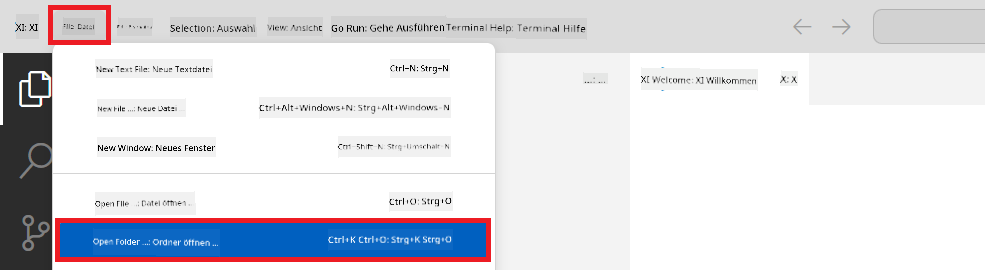

1. Klicken Sie im linken Bereich von Visual Studio Code mit der rechten Maustaste und wählen Sie **Neue Datei**, um eine neue Datei namens *download_dataset.py* zu erstellen.

1. Klicken Sie im linken Bereich von Visual Studio Code mit der rechten Maustaste und wählen Sie **Neue Datei**, um eine neue Datei namens *setup_ml.py* zu erstellen.

1. Klicken Sie im linken Bereich von Visual Studio Code mit der rechten Maustaste und wählen Sie **Neue Datei**, um eine neue Datei namens *deploy_model.py* zu erstellen.

    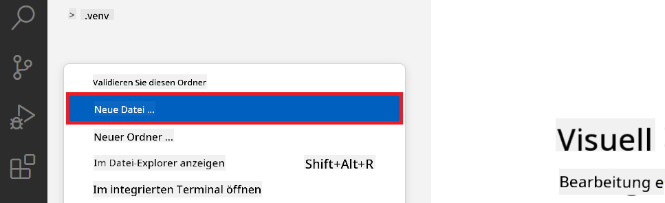

1. Klicken Sie im linken Bereich von Visual Studio Code mit der rechten Maustaste und wählen Sie **Neuer Ordner**, um einen neuen Ordner namens *finetuning_dir* zu erstellen.

1. Erstellen Sie im Ordner *finetuning_dir* eine neue Datei namens *fine_tune.py*.

#### *conda.yml*-Datei erstellen und konfigurieren

1. Klicken Sie im linken Bereich von Visual Studio Code mit der rechten Maustaste und wählen Sie **Neue Datei**, um eine neue Datei namens *conda.yml* zu erstellen.

1. Fügen Sie den folgenden Code in die Datei *conda.yml* ein, um die Feinabstimmungsum


1. Führen Sie die folgenden Schritte aus, um den Azure Workspace-Namen hinzuzufügen:

    - Navigieren Sie zu der von Ihnen erstellten Azure Machine Learning-Ressource.
    - Kopieren und fügen Sie Ihren Kontonamen in die Datei *config.py* ein.

    

1. Führen Sie die folgenden Schritte aus, um den Namen der Azure Resource Group hinzuzufügen:

    - Navigieren Sie zu der von Ihnen erstellten Azure Machine Learning-Ressource.
    - Kopieren und fügen Sie den Namen Ihrer Azure Resource Group in die Datei *config.py* ein.

    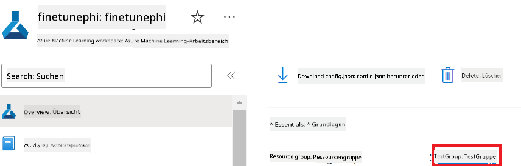

2. Führen Sie die folgenden Schritte aus, um den Namen der Azure Managed Identity hinzuzufügen:

    - Navigieren Sie zu der von Ihnen erstellten Managed Identities-Ressource.
    - Kopieren und fügen Sie den Namen Ihrer Azure Managed Identity in die Datei *config.py* ein.

    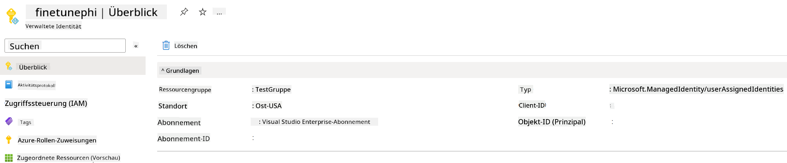

### Dataset für das Fine-Tuning vorbereiten

In dieser Übung führen Sie die Datei *download_dataset.py* aus, um die *ULTRACHAT_200k*-Datasets in Ihre lokale Umgebung herunterzuladen. Anschließend verwenden Sie diese Datasets, um das Phi-3-Modell in Azure Machine Learning zu optimieren.

#### Dataset mit *download_dataset.py* herunterladen

1. Öffnen Sie die Datei *download_dataset.py* in Visual Studio Code.

1. Fügen Sie den folgenden Code in *download_dataset.py* ein.

    ```python
    import json
    import os
    from datasets import load_dataset
    from config import (
        TRAIN_DATA_PATH,
        TEST_DATA_PATH)

    def load_and_split_dataset(dataset_name, config_name, split_ratio):
        """
        Load and split a dataset.
        """
        # Load the dataset with the specified name, configuration, and split ratio
        dataset = load_dataset(dataset_name, config_name, split=split_ratio)
        print(f"Original dataset size: {len(dataset)}")
        
        # Split the dataset into train and test sets (80% train, 20% test)
        split_dataset = dataset.train_test_split(test_size=0.2)
        print(f"Train dataset size: {len(split_dataset['train'])}")
        print(f"Test dataset size: {len(split_dataset['test'])}")
        
        return split_dataset

    def save_dataset_to_jsonl(dataset, filepath):
        """
        Save a dataset to a JSONL file.
        """
        # Create the directory if it does not exist
        os.makedirs(os.path.dirname(filepath), exist_ok=True)
        
        # Open the file in write mode
        with open(filepath, 'w', encoding='utf-8') as f:
            # Iterate over each record in the dataset
            for record in dataset:
                # Dump the record as a JSON object and write it to the file
                json.dump(record, f)
                # Write a newline character to separate records
                f.write('\n')
        
        print(f"Dataset saved to {filepath}")

    def main():
        """
        Main function to load, split, and save the dataset.
        """
        # Load and split the ULTRACHAT_200k dataset with a specific configuration and split ratio
        dataset = load_and_split_dataset("HuggingFaceH4/ultrachat_200k", 'default', 'train_sft[:1%]')
        
        # Extract the train and test datasets from the split
        train_dataset = dataset['train']
        test_dataset = dataset['test']

        # Save the train dataset to a JSONL file
        save_dataset_to_jsonl(train_dataset, TRAIN_DATA_PATH)
        
        # Save the test dataset to a separate JSONL file
        save_dataset_to_jsonl(test_dataset, TEST_DATA_PATH)

    if __name__ == "__main__":
        main()

    ```

> [!TIP]
>
> **Hinweise für das Fine-Tuning mit einem minimalen Dataset unter Verwendung einer CPU**
>
> Wenn Sie eine CPU für das Fine-Tuning verwenden möchten, ist dieser Ansatz ideal für Abonnementvorteile (wie Visual Studio Enterprise Subscription) oder um den Fine-Tuning- und Bereitstellungsprozess schnell zu testen.
>
> Ersetzen Sie `dataset = load_and_split_dataset("HuggingFaceH4/ultrachat_200k", 'default', 'train_sft[:1%]')` with `dataset = load_and_split_dataset("HuggingFaceH4/ultrachat_200k", 'default', 'train_sft[:10]')`
>

1. Geben Sie den folgenden Befehl in Ihr Terminal ein, um das Skript auszuführen und das Dataset in Ihre lokale Umgebung herunterzuladen.

    ```console
    python download_data.py
    ```

1. Überprüfen Sie, ob die Datasets erfolgreich in Ihrem lokalen Verzeichnis *finetune-phi/data* gespeichert wurden.

> [!NOTE]
>
> **Dataset-Größe und Fine-Tuning-Zeit**
>
> In diesem E2E-Beispiel verwenden Sie nur 1% des Datasets (`train_sft[:1%]`). Dies reduziert die Datenmenge erheblich und beschleunigt sowohl den Upload- als auch den Fine-Tuning-Prozess. Sie können den Prozentsatz anpassen, um das richtige Gleichgewicht zwischen Trainingszeit und Modellleistung zu finden. Die Verwendung eines kleineren Teils des Datasets verringert die für das Fine-Tuning erforderliche Zeit und macht den Prozess für ein E2E-Beispiel überschaubarer.

## Szenario 2: Phi-3-Modell optimieren und in Azure Machine Learning Studio bereitstellen

### Azure CLI einrichten

Sie müssen Azure CLI einrichten, um Ihre Umgebung zu authentifizieren. Azure CLI ermöglicht es Ihnen, Azure-Ressourcen direkt über die Befehlszeile zu verwalten und stellt die notwendigen Anmeldedaten bereit, damit Azure Machine Learning auf diese Ressourcen zugreifen kann. Installieren Sie [Azure CLI](https://learn.microsoft.com/cli/azure/install-azure-cli), um loszulegen.

1. Öffnen Sie ein Terminalfenster und geben Sie den folgenden Befehl ein, um sich bei Ihrem Azure-Konto anzumelden.

    ```console
    az login
    ```

1. Wählen Sie Ihr Azure-Konto aus.

1. Wählen Sie Ihr Azure-Abonnement aus.

    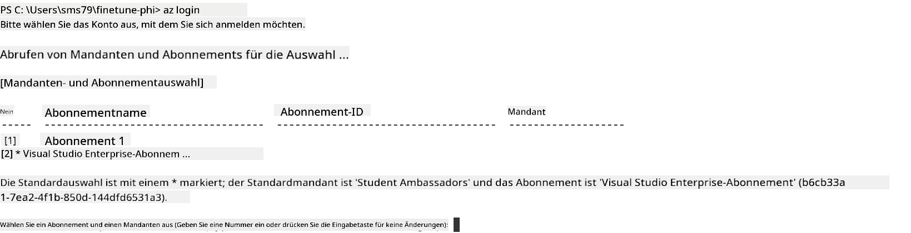

> [!TIP]
>
> Wenn Sie Probleme haben, sich bei Azure anzumelden, versuchen Sie, einen Gerätecode zu verwenden. Öffnen Sie ein Terminalfenster und geben Sie den folgenden Befehl ein, um sich bei Ihrem Azure-Konto anzumelden:
>
> ```console
> az login --use-device-code
> ```
>

### Phi-3-Modell optimieren

In dieser Übung optimieren Sie das Phi-3-Modell mit dem bereitgestellten Dataset. Zuerst definieren Sie den Fine-Tuning-Prozess in der Datei *fine_tune.py*. Anschließend konfigurieren Sie die Azure Machine Learning-Umgebung und starten den Fine-Tuning-Prozess, indem Sie die Datei *setup_ml.py* ausführen. Dieses Skript stellt sicher, dass das Fine-Tuning in der Azure Machine Learning-Umgebung erfolgt.

Durch das Ausführen von *setup_ml.py* führen Sie den Fine-Tuning-Prozess in der Azure Machine Learning-Umgebung aus.

#### Code zur Datei *fine_tune.py* hinzufügen

1. Navigieren Sie zum Ordner *finetuning_dir* und öffnen Sie die Datei *fine_tune.py* in Visual Studio Code.

1. Fügen Sie den folgenden Code in *fine_tune.py* ein.

    ```python
    import argparse
    import sys
    import logging
    import os
    from datasets import load_dataset
    import torch
    import mlflow
    from transformers import AutoModelForCausalLM, AutoTokenizer, TrainingArguments
    from trl import SFTTrainer

    # To avoid the INVALID_PARAMETER_VALUE error in MLflow, disable MLflow integration
    os.environ["DISABLE_MLFLOW_INTEGRATION"] = "True"

    # Logging setup
    logging.basicConfig(
        format="%(asctime)s - %(levelname)s - %(name)s - %(message)s",
        datefmt="%Y-%m-%d %H:%M:%S",
        handlers=[logging.StreamHandler(sys.stdout)],
        level=logging.WARNING
    )
    logger = logging.getLogger(__name__)

    def initialize_model_and_tokenizer(model_name, model_kwargs):
        """
        Initialize the model and tokenizer with the given pretrained model name and arguments.
        """
        model = AutoModelForCausalLM.from_pretrained(model_name, **model_kwargs)
        tokenizer = AutoTokenizer.from_pretrained(model_name)
        tokenizer.model_max_length = 2048
        tokenizer.pad_token = tokenizer.unk_token
        tokenizer.pad_token_id = tokenizer.convert_tokens_to_ids(tokenizer.pad_token)
        tokenizer.padding_side = 'right'
        return model, tokenizer

    def apply_chat_template(example, tokenizer):
        """
        Apply a chat template to tokenize messages in the example.
        """
        messages = example["messages"]
        if messages[0]["role"] != "system":
            messages.insert(0, {"role": "system", "content": ""})
        example["text"] = tokenizer.apply_chat_template(
            messages, tokenize=False, add_generation_prompt=False
        )
        return example

    def load_and_preprocess_data(train_filepath, test_filepath, tokenizer):
        """
        Load and preprocess the dataset.
        """
        train_dataset = load_dataset('json', data_files=train_filepath, split='train')
        test_dataset = load_dataset('json', data_files=test_filepath, split='train')
        column_names = list(train_dataset.features)

        train_dataset = train_dataset.map(
            apply_chat_template,
            fn_kwargs={"tokenizer": tokenizer},
            num_proc=10,
            remove_columns=column_names,
            desc="Applying chat template to train dataset",
        )

        test_dataset = test_dataset.map(
            apply_chat_template,
            fn_kwargs={"tokenizer": tokenizer},
            num_proc=10,
            remove_columns=column_names,
            desc="Applying chat template to test dataset",
        )

        return train_dataset, test_dataset

    def train_and_evaluate_model(train_dataset, test_dataset, model, tokenizer, output_dir):
        """
        Train and evaluate the model.
        """
        training_args = TrainingArguments(
            bf16=True,
            do_eval=True,
            output_dir=output_dir,
            eval_strategy="epoch",
            learning_rate=5.0e-06,
            logging_steps=20,
            lr_scheduler_type="cosine",
            num_train_epochs=3,
            overwrite_output_dir=True,
            per_device_eval_batch_size=4,
            per_device_train_batch_size=4,
            remove_unused_columns=True,
            save_steps=500,
            seed=0,
            gradient_checkpointing=True,
            gradient_accumulation_steps=1,
            warmup_ratio=0.2,
        )

        trainer = SFTTrainer(
            model=model,
            args=training_args,
            train_dataset=train_dataset,
            eval_dataset=test_dataset,
            max_seq_length=2048,
            dataset_text_field="text",
            tokenizer=tokenizer,
            packing=True
        )

        train_result = trainer.train()
        trainer.log_metrics("train", train_result.metrics)

        mlflow.transformers.log_model(
            transformers_model={"model": trainer.model, "tokenizer": tokenizer},
            artifact_path=output_dir,
        )

        tokenizer.padding_side = 'left'
        eval_metrics = trainer.evaluate()
        eval_metrics["eval_samples"] = len(test_dataset)
        trainer.log_metrics("eval", eval_metrics)

    def main(train_file, eval_file, model_output_dir):
        """
        Main function to fine-tune the model.
        """
        model_kwargs = {
            "use_cache": False,
            "trust_remote_code": True,
            "torch_dtype": torch.bfloat16,
            "device_map": None,
            "attn_implementation": "eager"
        }

        # pretrained_model_name = "microsoft/Phi-3-mini-4k-instruct"
        pretrained_model_name = "microsoft/Phi-3.5-mini-instruct"

        with mlflow.start_run():
            model, tokenizer = initialize_model_and_tokenizer(pretrained_model_name, model_kwargs)
            train_dataset, test_dataset = load_and_preprocess_data(train_file, eval_file, tokenizer)
            train_and_evaluate_model(train_dataset, test_dataset, model, tokenizer, model_output_dir)

    if __name__ == "__main__":
        parser = argparse.ArgumentParser()
        parser.add_argument("--train-file", type=str, required=True, help="Path to the training data")
        parser.add_argument("--eval-file", type=str, required=True, help="Path to the evaluation data")
        parser.add_argument("--model_output_dir", type=str, required=True, help="Directory to save the fine-tuned model")
        args = parser.parse_args()
        main(args.train_file, args.eval_file, args.model_output_dir)

    ```

1. Speichern und schließen Sie die Datei *fine_tune.py*.

> [!TIP]
> **Sie können das Phi-3.5-Modell optimieren**
>
> In der Datei *fine_tune.py* können Sie das Feld `pretrained_model_name` from `"microsoft/Phi-3-mini-4k-instruct"` to any model you want to fine-tune. For example, if you change it to `"microsoft/Phi-3.5-mini-instruct"`, you'll be using the Phi-3.5-mini-instruct model for fine-tuning. To find and use the model name you prefer, visit [Hugging Face](https://huggingface.co/), search for the model you're interested in, and then copy and paste its name into the `pretrained_model_name` in Ihrem Skript ändern.
>
> :::image type="content" source="../../imgs/03/FineTuning-PromptFlow/finetunephi3.5.png" alt-text="Phi-3.5 optimieren.":::
>

#### Code zur Datei *setup_ml.py* hinzufügen

1. Öffnen Sie die Datei *setup_ml.py* in Visual Studio Code.

1. Fügen Sie den folgenden Code in *setup_ml.py* ein.

    ```python
    import logging
    from azure.ai.ml import MLClient, command, Input
    from azure.ai.ml.entities import Environment, AmlCompute
    from azure.identity import AzureCliCredential
    from config import (
        AZURE_SUBSCRIPTION_ID,
        AZURE_RESOURCE_GROUP_NAME,
        AZURE_ML_WORKSPACE_NAME,
        TRAIN_DATA_PATH,
        TEST_DATA_PATH
    )

    # Constants

    # Uncomment the following lines to use a CPU instance for training
    # COMPUTE_INSTANCE_TYPE = "Standard_E16s_v3" # cpu
    # COMPUTE_NAME = "cpu-e16s-v3"
    # DOCKER_IMAGE_NAME = "mcr.microsoft.com/azureml/openmpi4.1.0-ubuntu20.04:latest"

    # Uncomment the following lines to use a GPU instance for training
    COMPUTE_INSTANCE_TYPE = "Standard_NC24ads_A100_v4"
    COMPUTE_NAME = "gpu-nc24s-a100-v4"
    DOCKER_IMAGE_NAME = "mcr.microsoft.com/azureml/curated/acft-hf-nlp-gpu:59"

    CONDA_FILE = "conda.yml"
    LOCATION = "eastus2" # Replace with the location of your compute cluster
    FINETUNING_DIR = "./finetuning_dir" # Path to the fine-tuning script
    TRAINING_ENV_NAME = "phi-3-training-environment" # Name of the training environment
    MODEL_OUTPUT_DIR = "./model_output" # Path to the model output directory in azure ml

    # Logging setup to track the process
    logger = logging.getLogger(__name__)
    logging.basicConfig(
        format="%(asctime)s - %(levelname)s - %(name)s - %(message)s",
        datefmt="%Y-%m-%d %H:%M:%S",
        level=logging.WARNING
    )

    def get_ml_client():
        """
        Initialize the ML Client using Azure CLI credentials.
        """
        credential = AzureCliCredential()
        return MLClient(credential, AZURE_SUBSCRIPTION_ID, AZURE_RESOURCE_GROUP_NAME, AZURE_ML_WORKSPACE_NAME)

    def create_or_get_environment(ml_client):
        """
        Create or update the training environment in Azure ML.
        """
        env = Environment(
            image=DOCKER_IMAGE_NAME,  # Docker image for the environment
            conda_file=CONDA_FILE,  # Conda environment file
            name=TRAINING_ENV_NAME,  # Name of the environment
        )
        return ml_client.environments.create_or_update(env)

    def create_or_get_compute_cluster(ml_client, compute_name, COMPUTE_INSTANCE_TYPE, location):
        """
        Create or update the compute cluster in Azure ML.
        """
        try:
            compute_cluster = ml_client.compute.get(compute_name)
            logger.info(f"Compute cluster '{compute_name}' already exists. Reusing it for the current run.")
        except Exception:
            logger.info(f"Compute cluster '{compute_name}' does not exist. Creating a new one with size {COMPUTE_INSTANCE_TYPE}.")
            compute_cluster = AmlCompute(
                name=compute_name,
                size=COMPUTE_INSTANCE_TYPE,
                location=location,
                tier="Dedicated",  # Tier of the compute cluster
                min_instances=0,  # Minimum number of instances
                max_instances=1  # Maximum number of instances
            )
            ml_client.compute.begin_create_or_update(compute_cluster).wait()  # Wait for the cluster to be created
        return compute_cluster

    def create_fine_tuning_job(env, compute_name):
        """
        Set up the fine-tuning job in Azure ML.
        """
        return command(
            code=FINETUNING_DIR,  # Path to fine_tune.py
            command=(
                "python fine_tune.py "
                "--train-file ${{inputs.train_file}} "
                "--eval-file ${{inputs.eval_file}} "
                "--model_output_dir ${{inputs.model_output}}"
            ),
            environment=env,  # Training environment
            compute=compute_name,  # Compute cluster to use
            inputs={
                "train_file": Input(type="uri_file", path=TRAIN_DATA_PATH),  # Path to the training data file
                "eval_file": Input(type="uri_file", path=TEST_DATA_PATH),  # Path to the evaluation data file
                "model_output": MODEL_OUTPUT_DIR
            }
        )

    def main():
        """
        Main function to set up and run the fine-tuning job in Azure ML.
        """
        # Initialize ML Client
        ml_client = get_ml_client()

        # Create Environment
        env = create_or_get_environment(ml_client)
        
        # Create or get existing compute cluster
        create_or_get_compute_cluster(ml_client, COMPUTE_NAME, COMPUTE_INSTANCE_TYPE, LOCATION)

        # Create and Submit Fine-Tuning Job
        job = create_fine_tuning_job(env, COMPUTE_NAME)
        returned_job = ml_client.jobs.create_or_update(job)  # Submit the job
        ml_client.jobs.stream(returned_job.name)  # Stream the job logs
        
        # Capture the job name
        job_name = returned_job.name
        print(f"Job name: {job_name}")

    if __name__ == "__main__":
        main()

    ```

1. Ersetzen Sie `COMPUTE_INSTANCE_TYPE`, `COMPUTE_NAME`, and `LOCATION` durch Ihre spezifischen Details.

    ```python
   # Uncomment the following lines to use a GPU instance for training
    COMPUTE_INSTANCE_TYPE = "Standard_NC24ads_A100_v4"
    COMPUTE_NAME = "gpu-nc24s-a100-v4"
    ...
    LOCATION = "eastus2" # Replace with the location of your compute cluster
    ```

> [!TIP]
>
> **Hinweise für das Fine-Tuning mit einem minimalen Dataset unter Verwendung einer CPU**
>
> Wenn Sie eine CPU für das Fine-Tuning verwenden möchten, ist dieser Ansatz ideal für Abonnementvorteile (wie Visual Studio Enterprise Subscription) oder um den Fine-Tuning- und Bereitstellungsprozess schnell zu testen.
>
> 1. Öffnen Sie die Datei *setup_ml*.
> 1. Ersetzen Sie `COMPUTE_INSTANCE_TYPE`, `COMPUTE_NAME`, and `DOCKER_IMAGE_NAME` with the following. If you do not have access to *Standard_E16s_v3*, you can use an equivalent CPU instance or request a new quota.
> 1. Replace `LOCATION` durch Ihre spezifischen Details.
>
>    ```python
>    # Uncomment the following lines to use a CPU instance for training
>    COMPUTE_INSTANCE_TYPE = "Standard_E16s_v3" # cpu
>    COMPUTE_NAME = "cpu-e16s-v3"
>    DOCKER_IMAGE_NAME = "mcr.microsoft.com/azureml/openmpi4.1.0-ubuntu20.04:latest"
>    LOCATION = "eastus2" # Replace with the location of your compute cluster
>    ```
>

1. Geben Sie den folgenden Befehl ein, um das Skript *setup_ml.py* auszuführen und den Fine-Tuning-Prozess in Azure Machine Learning zu starten.

    ```python
    python setup_ml.py
    ```

1. In dieser Übung haben Sie das Phi-3-Modell erfolgreich mit Azure Machine Learning optimiert. Durch das Ausführen des Skripts *setup_ml.py* haben Sie die Azure Machine Learning-Umgebung eingerichtet und den Fine-Tuning-Prozess definiert, der in der Datei *fine_tune.py* festgelegt ist. Beachten Sie, dass der Fine-Tuning-Prozess beträchtliche Zeit in Anspruch nehmen kann. Nach dem Ausführen von `python setup_ml.py` command, you need to wait for the process to complete. You can monitor the status of the fine-tuning job by following the link provided in the terminal to the Azure Machine Learning portal.

    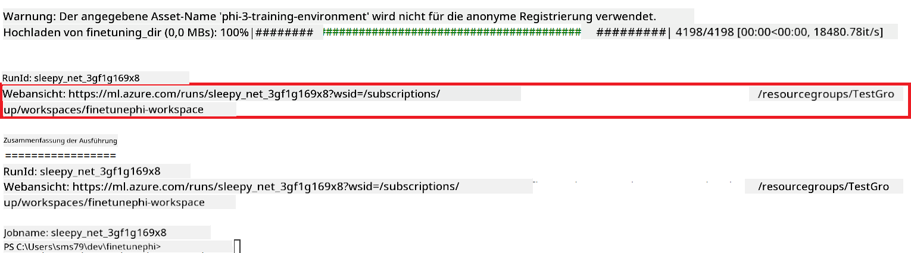

### Deploy the fine-tuned model

To integrate the fine-tuned Phi-3 model with Prompt Flow, you need to deploy the model to make it accessible for real-time inference. This process involves registering the model, creating an online endpoint, and deploying the model.

#### Set the model name, endpoint name, and deployment name for deployment

1. Open *config.py* file.

1. Replace `AZURE_MODEL_NAME = "your_fine_tuned_model_name"` with the desired name for your model.

1. Replace `AZURE_ENDPOINT_NAME = "your_fine_tuned_model_endpoint_name"` with the desired name for your endpoint.

1. Replace `AZURE_DEPLOYMENT_NAME = "your_fine_tuned_model_deployment_name"` mit dem gewünschten Namen für Ihre Bereitstellung.

#### Code zur Datei *deploy_model.py* hinzufügen

Durch das Ausführen der Datei *deploy_model.py* wird der gesamte Bereitstellungsprozess automatisiert. Das Modell wird registriert, ein Endpoint wird erstellt und die Bereitstellung basierend auf den in der Datei config.py angegebenen Einstellungen durchgeführt, einschließlich des Modellnamens, des Endpoint-Namens und des Bereitstellungsnamens.

1. Öffnen Sie die Datei *deploy_model.py* in Visual Studio Code.

1. Fügen Sie den folgenden Code in *deploy_model.py* ein.

    ```python
    import logging
    from azure.identity import AzureCliCredential
    from azure.ai.ml import MLClient
    from azure.ai.ml.entities import Model, ProbeSettings, ManagedOnlineEndpoint, ManagedOnlineDeployment, IdentityConfiguration, ManagedIdentityConfiguration, OnlineRequestSettings
    from azure.ai.ml.constants import AssetTypes

    # Configuration imports
    from config import (
        AZURE_SUBSCRIPTION_ID,
        AZURE_RESOURCE_GROUP_NAME,
        AZURE_ML_WORKSPACE_NAME,
        AZURE_MANAGED_IDENTITY_RESOURCE_ID,
        AZURE_MANAGED_IDENTITY_CLIENT_ID,
        AZURE_MODEL_NAME,
        AZURE_ENDPOINT_NAME,
        AZURE_DEPLOYMENT_NAME
    )

    # Constants
    JOB_NAME = "your-job-name"
    COMPUTE_INSTANCE_TYPE = "Standard_E4s_v3"

    deployment_env_vars = {
        "SUBSCRIPTION_ID": AZURE_SUBSCRIPTION_ID,
        "RESOURCE_GROUP_NAME": AZURE_RESOURCE_GROUP_NAME,
        "UAI_CLIENT_ID": AZURE_MANAGED_IDENTITY_CLIENT_ID,
    }

    # Logging setup
    logging.basicConfig(
        format="%(asctime)s - %(levelname)s - %(name)s - %(message)s",
        datefmt="%Y-%m-%d %H:%M:%S",
        level=logging.DEBUG
    )
    logger = logging.getLogger(__name__)

    def get_ml_client():
        """Initialize and return the ML Client."""
        credential = AzureCliCredential()
        return MLClient(credential, AZURE_SUBSCRIPTION_ID, AZURE_RESOURCE_GROUP_NAME, AZURE_ML_WORKSPACE_NAME)

    def register_model(ml_client, model_name, job_name):
        """Register a new model."""
        model_path = f"azureml://jobs/{job_name}/outputs/artifacts/paths/model_output"
        logger.info(f"Registering model {model_name} from job {job_name} at path {model_path}.")
        run_model = Model(
            path=model_path,
            name=model_name,
            description="Model created from run.",
            type=AssetTypes.MLFLOW_MODEL,
        )
        model = ml_client.models.create_or_update(run_model)
        logger.info(f"Registered model ID: {model.id}")
        return model

    def delete_existing_endpoint(ml_client, endpoint_name):
        """Delete existing endpoint if it exists."""
        try:
            endpoint_result = ml_client.online_endpoints.get(name=endpoint_name)
            logger.info(f"Deleting existing endpoint {endpoint_name}.")
            ml_client.online_endpoints.begin_delete(name=endpoint_name).result()
            logger.info(f"Deleted existing endpoint {endpoint_name}.")
        except Exception as e:
            logger.info(f"No existing endpoint {endpoint_name} found to delete: {e}")

    def create_or_update_endpoint(ml_client, endpoint_name, description=""):
        """Create or update an endpoint."""
        delete_existing_endpoint(ml_client, endpoint_name)
        logger.info(f"Creating new endpoint {endpoint_name}.")
        endpoint = ManagedOnlineEndpoint(
            name=endpoint_name,
            description=description,
            identity=IdentityConfiguration(
                type="user_assigned",
                user_assigned_identities=[ManagedIdentityConfiguration(resource_id=AZURE_MANAGED_IDENTITY_RESOURCE_ID)]
            )
        )
        endpoint_result = ml_client.online_endpoints.begin_create_or_update(endpoint).result()
        logger.info(f"Created new endpoint {endpoint_name}.")
        return endpoint_result

    def create_or_update_deployment(ml_client, endpoint_name, deployment_name, model):
        """Create or update a deployment."""

        logger.info(f"Creating deployment {deployment_name} for endpoint {endpoint_name}.")
        deployment = ManagedOnlineDeployment(
            name=deployment_name,
            endpoint_name=endpoint_name,
            model=model.id,
            instance_type=COMPUTE_INSTANCE_TYPE,
            instance_count=1,
            environment_variables=deployment_env_vars,
            request_settings=OnlineRequestSettings(
                max_concurrent_requests_per_instance=3,
                request_timeout_ms=180000,
                max_queue_wait_ms=120000
            ),
            liveness_probe=ProbeSettings(
                failure_threshold=30,
                success_threshold=1,
                period=100,
                initial_delay=500,
            ),
            readiness_probe=ProbeSettings(
                failure_threshold=30,
                success_threshold=1,
                period=100,
                initial_delay=500,
            ),
        )
        deployment_result = ml_client.online_deployments.begin_create_or_update(deployment).result()
        logger.info(f"Created deployment {deployment.name} for endpoint {endpoint_name}.")
        return deployment_result

    def set_traffic_to_deployment(ml_client, endpoint_name, deployment_name):
        """Set traffic to the specified deployment."""
        try:
            # Fetch the current endpoint details
            endpoint = ml_client.online_endpoints.get(name=endpoint_name)
            
            # Log the current traffic allocation for debugging
            logger.info(f"Current traffic allocation: {endpoint.traffic}")
            
            # Set the traffic allocation for the deployment
            endpoint.traffic = {deployment_name: 100}
            
            # Update the endpoint with the new traffic allocation
            endpoint_poller = ml_client.online_endpoints.begin_create_or_update(endpoint)
            updated_endpoint = endpoint_poller.result()
            
            # Log the updated traffic allocation for debugging
            logger.info(f"Updated traffic allocation: {updated_endpoint.traffic}")
            logger.info(f"Set traffic to deployment {deployment_name} at endpoint {endpoint_name}.")
            return updated_endpoint
        except Exception as e:
            # Log any errors that occur during the process
            logger.error(f"Failed to set traffic to deployment: {e}")
            raise


    def main():
        ml_client = get_ml_client()

        registered_model = register_model(ml_client, AZURE_MODEL_NAME, JOB_NAME)
        logger.info(f"Registered model ID: {registered_model.id}")

        endpoint = create_or_update_endpoint(ml_client, AZURE_ENDPOINT_NAME, "Endpoint for finetuned Phi-3 model")
        logger.info(f"Endpoint {AZURE_ENDPOINT_NAME} is ready.")

        try:
            deployment = create_or_update_deployment(ml_client, AZURE_ENDPOINT_NAME, AZURE_DEPLOYMENT_NAME, registered_model)
            logger.info(f"Deployment {AZURE_DEPLOYMENT_NAME} is created for endpoint {AZURE_ENDPOINT_NAME}.")

            set_traffic_to_deployment(ml_client, AZURE_ENDPOINT_NAME, AZURE_DEPLOYMENT_NAME)
            logger.info(f"Traffic is set to deployment {AZURE_DEPLOYMENT_NAME} at endpoint {AZURE_ENDPOINT_NAME}.")
        except Exception as e:
            logger.error(f"Failed to create or update deployment: {e}")

    if __name__ == "__main__":
        main()

    ```

1. Führen Sie die folgenden Schritte aus, um `JOB_NAME`:

    - Navigate to Azure Machine Learning resource that you created.
    - Select **Studio web URL** to open the Azure Machine Learning workspace.
    - Select **Jobs** from the left side tab.
    - Select the experiment for fine-tuning. For example, *finetunephi*.
    - Select the job that you created.
    - Copy and paste your job Name into the `JOB_NAME = "your-job-name"` in *deploy_model.py* file.

1. Replace `COMPUTE_INSTANCE_TYPE` mit Ihren spezifischen Details zu erhalten.

1. Geben Sie den folgenden Befehl ein, um das Skript *deploy_model.py* auszuführen und den Bereitstellungsprozess in Azure Machine Learning zu starten.

    ```python
    python deploy_model.py
    ```

> [!WARNING]
> Um zusätzliche Kosten für Ihr Konto zu vermeiden, stellen Sie sicher, dass Sie den erstellten Endpoint im Azure Machine Learning-Arbeitsbereich löschen.
>

#### Bereitstellungsstatus im Azure Machine Learning-Arbeitsbereich überprüfen

1. Besuchen Sie [Azure ML Studio](https://ml.azure.com/home?wt.mc_id=studentamb_279723).

1. Navigieren Sie zu dem von Ihnen erstellten Azure Machine Learning-Arbeitsbereich.

1. Wählen Sie **Studio-Web-URL**, um den Azure Machine Learning-Arbeitsbereich zu öffnen.

1. Wählen Sie **Endpoints** aus der linken Seitenleiste.

    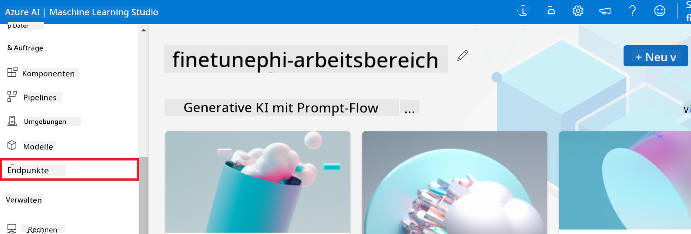

2. Wählen Sie den Endpoint aus, den Sie erstellt haben.

    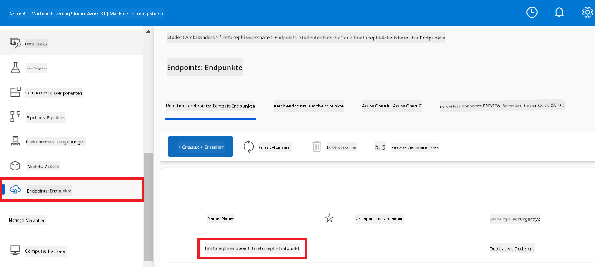

3. Auf dieser Seite können Sie die während des Bereitstellungsprozesses erstellten Endpoints verwalten.

## Szenario 3: Integration mit Prompt Flow und Chat mit Ihrem benutzerdefinierten Modell

### Benutzerdefiniertes Phi-3-Modell mit Prompt Flow integrieren

Nachdem Sie Ihr optimiertes Modell erfolgreich bereitgestellt haben, können Sie es jetzt mit Prompt Flow integrieren, um Ihr Modell in Echtzeitanwendungen zu verwenden und eine Vielzahl interaktiver Aufgaben mit Ihrem benutzerdefinierten Phi-3-Modell zu ermöglichen.

#### API-Schlüssel und Endpoint-URI des optimierten Phi-3-Modells festlegen

1. Navigieren Sie zu dem von Ihnen erstellten Azure Machine Learning-Arbeitsbereich.
1. Wählen Sie **Endpoints** aus der linken Seitenleiste.
1. Wählen Sie den Endpoint aus, den Sie erstellt haben.
1. Wählen Sie **Verbrauch** aus dem Navigationsmenü.
1. Kopieren und fügen Sie Ihren **REST-Endpoint** in die Datei *config.py* ein, indem Sie `AZURE_ML_ENDPOINT = "your_fine_tuned_model_endpoint_uri"` with your **REST endpoint**.
1. Copy and paste your **Primary key** into the *config.py* file, replacing `AZURE_ML_API_KEY = "your_fine_tuned_model_api_key"` durch Ihren **Primärschlüssel** ersetzen.

    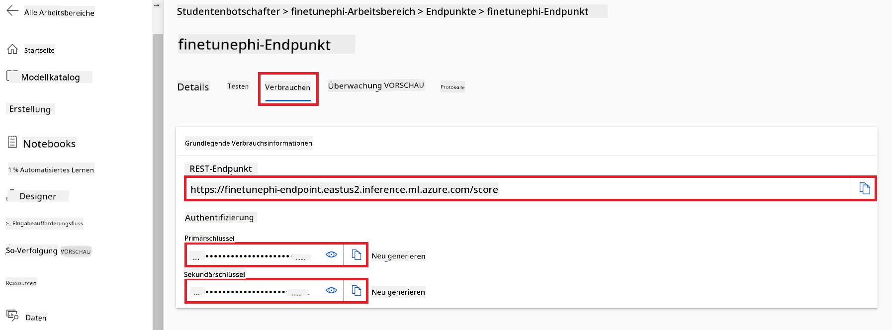

#### Code zur Datei *flow.dag.yml* hinzufügen

1. Öffnen Sie die Datei *flow.dag.yml* in Visual Studio Code.

1. Fügen Sie den folgenden Code in *flow.dag.yml* ein.

    ```yml
    inputs:
      input_data:
        type: string
        default: "Who founded Microsoft?"

    outputs:
      answer:
        type: string
        reference: ${integrate_with_promptflow.output}

    nodes:
    - name: integrate_with_promptflow
      type: python
      source:
        type: code
        path: integrate_with_promptflow.py
      inputs:
        input_data: ${inputs.input_data}
    ```

#### Code zur Datei *integrate_with_promptflow.py* hinzufügen

1. Öffnen Sie die Datei *integrate_with_promptflow.py* in Visual Studio Code.

1. Fügen Sie den folgenden Code in *integrate_with_promptflow.py* ein.

    ```python
    import logging
    import requests
    from promptflow.core import tool
    import asyncio
    import platform
    from config import (
        AZURE_ML_ENDPOINT,
        AZURE_ML_API_KEY
    )

    # Logging setup
    logging.basicConfig(
        format="%(asctime)s - %(levelname)s - %(name)s - %(message)s",
        datefmt="%Y-%m-%d %H:%M:%S",
        level=logging.DEBUG
    )
    logger = logging.getLogger(__name__)

    def query_azml_endpoint(input_data: list, endpoint_url: str, api_key: str) -> str:
        """
        Send a request to the Azure ML endpoint with the given input data.
        """
        headers = {
            "Content-Type": "application/json",
            "Authorization": f"Bearer {api_key}"
        }
        data = {
            "input_data": [input_data],
            "params": {
                "temperature": 0.7,
                "max_new_tokens": 128,
                "do_sample": True,
                "return_full_text": True
            }
        }
        try:
            response = requests.post(endpoint_url, json=data, headers=headers)
            response.raise_for_status()
            result = response.json()[0]
            logger.info("Successfully received response from Azure ML Endpoint.")
            return result
        except requests.exceptions.RequestException as e:
            logger.error(f"Error querying Azure ML Endpoint: {e}")
            raise

    def setup_asyncio_policy():
        """
        Setup asyncio event loop policy for Windows.
        """
        if platform.system() == 'Windows':
            asyncio.set_event_loop_policy(asyncio.WindowsSelectorEventLoopPolicy())
            logger.info("Set Windows asyncio event loop policy.")

    @tool
    def my_python_tool(input_data: str) -> str:
        """
        Tool function to process input data and query the Azure ML endpoint.
        """
        setup_asyncio_policy()
        return query_azml_endpoint(input_data, AZURE_ML_ENDPOINT, AZURE_ML_API_KEY)

    ```

### Chat mit Ihrem benutzerdefinierten Modell

1. Geben Sie den folgenden Befehl ein, um das Skript *deploy_model.py* auszuführen und den Bereitstellungsprozess in Azure Machine Learning zu starten.

    ```python
    pf flow serve --source ./ --port 8080 --host localhost
    ```

1. Hier ist ein Beispiel für die Ergebnisse: Jetzt können Sie mit Ihrem benutzerdefinierten Phi-3-Modell chatten. Es wird empfohlen, Fragen basierend auf den für das Fine-Tuning verwendeten Daten zu stellen.

    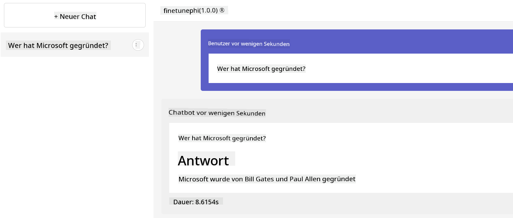

**Haftungsausschluss**:  
Dieses Dokument wurde mit dem KI-Übersetzungsdienst [Co-op Translator](https://github.com/Azure/co-op-translator) übersetzt. Obwohl wir uns um Genauigkeit bemühen, beachten Sie bitte, dass automatisierte Übersetzungen Fehler oder Ungenauigkeiten enthalten können. Das Originaldokument in seiner ursprünglichen Sprache sollte als maßgebliche Quelle betrachtet werden. Für kritische Informationen wird eine professionelle menschliche Übersetzung empfohlen. Wir haften nicht für Missverständnisse oder Fehlinterpretationen, die aus der Nutzung dieser Übersetzung entstehen.