<!--
CO_OP_TRANSLATOR_METADATA:
{
  "original_hash": "ecbd9179a21edbaafaf114d47f09f3e3",
  "translation_date": "2025-03-27T10:18:09+00:00",
  "source_file": "md\\02.Application\\01.TextAndChat\\Phi3\\E2E_Phi-3-FineTuning_PromptFlow_Integration_AIFoundry.md",
  "language_code": "de"
}
-->
# Feinabstimmung und Integration benutzerdefinierter Phi-3-Modelle mit Prompt Flow in Azure AI Foundry

Dieses End-to-End (E2E) Beispiel basiert auf der Anleitung "[Feinabstimmung und Integration benutzerdefinierter Phi-3-Modelle mit Prompt Flow in Azure AI Foundry](https://techcommunity.microsoft.com/t5/educator-developer-blog/fine-tune-and-integrate-custom-phi-3-models-with-prompt-flow-in/ba-p/4191726?WT.mc_id=aiml-137032-kinfeylo)" von der Microsoft Tech Community. Es führt durch die Prozesse der Feinabstimmung, Bereitstellung und Integration benutzerdefinierter Phi-3-Modelle mit Prompt Flow in Azure AI Foundry.  
Im Gegensatz zu dem E2E-Beispiel "[Feinabstimmung und Integration benutzerdefinierter Phi-3-Modelle mit Prompt Flow](./E2E_Phi-3-FineTuning_PromptFlow_Integration.md)", das das lokale Ausführen von Code beinhaltete, konzentriert sich dieses Tutorial vollständig auf die Feinabstimmung und Integration Ihres Modells innerhalb des Azure AI / ML Studios.

## Überblick

In diesem E2E-Beispiel lernen Sie, wie Sie das Phi-3-Modell feinabstimmen und es mit Prompt Flow in Azure AI Foundry integrieren. Durch die Nutzung des Azure AI / ML Studios etablieren Sie einen Workflow zur Bereitstellung und Nutzung benutzerdefinierter KI-Modelle. Dieses E2E-Beispiel ist in drei Szenarien unterteilt:

**Szenario 1: Azure-Ressourcen einrichten und Vorbereitung zur Feinabstimmung**

**Szenario 2: Feinabstimmung des Phi-3-Modells und Bereitstellung im Azure Machine Learning Studio**

**Szenario 3: Integration mit Prompt Flow und Interaktion mit Ihrem benutzerdefinierten Modell in Azure AI Foundry**

Hier ist eine Übersicht über dieses E2E-Beispiel.

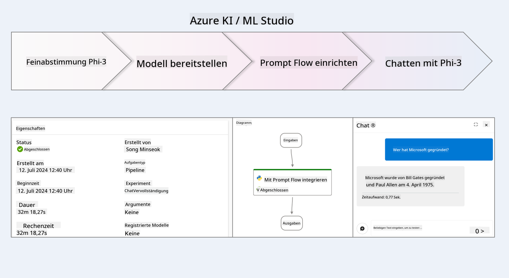

### Inhaltsverzeichnis

1. **[Szenario 1: Azure-Ressourcen einrichten und Vorbereitung zur Feinabstimmung](../../../../../../md/02.Application/01.TextAndChat/Phi3)**  
    - [Erstellen eines Azure Machine Learning Workspaces](../../../../../../md/02.Application/01.TextAndChat/Phi3)  
    - [Anfordern von GPU-Quoten im Azure-Abonnement](../../../../../../md/02.Application/01.TextAndChat/Phi3)  
    - [Rollenvergabe hinzufügen](../../../../../../md/02.Application/01.TextAndChat/Phi3)  
    - [Projekt einrichten](../../../../../../md/02.Application/01.TextAndChat/Phi3)  
    - [Datensatz für Feinabstimmung vorbereiten](../../../../../../md/02.Application/01.TextAndChat/Phi3)  

1. **[Szenario 2: Feinabstimmung des Phi-3-Modells und Bereitstellung im Azure Machine Learning Studio](../../../../../../md/02.Application/01.TextAndChat/Phi3)**  
    - [Phi-3-Modell feinabstimmen](../../../../../../md/02.Application/01.TextAndChat/Phi3)  
    - [Bereitstellung des feinabgestimmten Phi-3-Modells](../../../../../../md/02.Application/01.TextAndChat/Phi3)  

1. **[Szenario 3: Integration mit Prompt Flow und Interaktion mit Ihrem benutzerdefinierten Modell in Azure AI Foundry](../../../../../../md/02.Application/01.TextAndChat/Phi3)**  
    - [Integration des benutzerdefinierten Phi-3-Modells mit Prompt Flow](../../../../../../md/02.Application/01.TextAndChat/Phi3)  
    - [Interaktion mit Ihrem benutzerdefinierten Phi-3-Modell](../../../../../../md/02.Application/01.TextAndChat/Phi3)  

## Szenario 1: Azure-Ressourcen einrichten und Vorbereitung zur Feinabstimmung

### Erstellen eines Azure Machine Learning Workspaces

1. Geben Sie *azure machine learning* in die **Suchleiste** oben auf der Portalseite ein und wählen Sie **Azure Machine Learning** aus den angezeigten Optionen aus.

    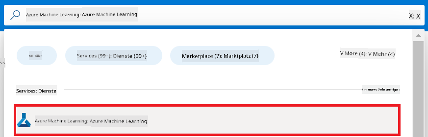

2. Wählen Sie **+ Erstellen** aus dem Navigationsmenü.

3. Wählen Sie **Neuen Workspace** aus dem Navigationsmenü.

    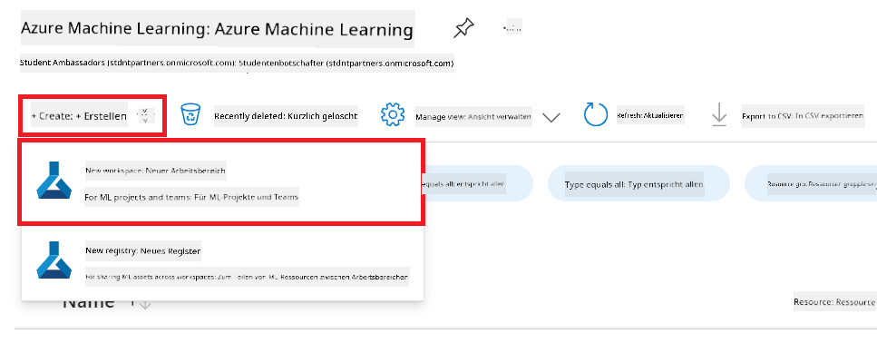

4. Führen Sie die folgenden Aufgaben aus:

    - Wählen Sie Ihr Azure **Abonnement**.  
    - Wählen Sie die **Ressourcengruppe**, die verwendet werden soll (erstellen Sie bei Bedarf eine neue).  
    - Geben Sie einen **Workspacename** ein. Dieser muss einzigartig sein.  
    - Wählen Sie die **Region**, die Sie verwenden möchten.  
    - Wählen Sie das **Speicherkonto**, das verwendet werden soll (erstellen Sie bei Bedarf ein neues).  
    - Wählen Sie den **Schlüsseltresor**, der verwendet werden soll (erstellen Sie bei Bedarf einen neuen).  
    - Wählen Sie die **Application Insights**, die verwendet werden sollen (erstellen Sie bei Bedarf neue).  
    - Wählen Sie das **Container-Registry**, das verwendet werden soll (erstellen Sie bei Bedarf eine neue).  

    

5. Wählen Sie **Überprüfen + Erstellen**.

6. Wählen Sie **Erstellen**.

### Anfordern von GPU-Quoten im Azure-Abonnement

In diesem Tutorial lernen Sie, wie Sie ein Phi-3-Modell mit GPUs feinabstimmen und bereitstellen. Für die Feinabstimmung verwenden Sie die GPU *Standard_NC24ads_A100_v4*, die eine Quotenanfrage erfordert. Für die Bereitstellung verwenden Sie die GPU *Standard_NC6s_v3*, die ebenfalls eine Quotenanfrage erfordert.

> [!NOTE]  
> Nur Pay-As-You-Go-Abonnements (der Standard-Abonnementtyp) sind für die GPU-Zuweisung berechtigt; Benefit-Abonnements werden derzeit nicht unterstützt.

1. Besuchen Sie [Azure ML Studio](https://ml.azure.com/home?wt.mc_id=studentamb_279723).

1. Führen Sie die folgenden Aufgaben aus, um eine *Standard NCADSA100v4 Family*-Quote anzufordern:

    - Wählen Sie **Quote** aus dem linken Tab.  
    - Wählen Sie die **Virtuelle Maschinenfamilie**, die verwendet werden soll. Zum Beispiel **Standard NCADSA100v4 Family Cluster Dedicated vCPUs**, das die GPU *Standard_NC24ads_A100_v4* enthält.  
    - Wählen Sie **Quote anfordern** aus dem Navigationsmenü.  

        

    - Geben Sie auf der Seite "Quote anfordern" das **Neue Kernlimit** ein, das Sie verwenden möchten. Zum Beispiel 24.  
    - Wählen Sie **Senden**, um die GPU-Quote anzufordern.

1. Führen Sie die folgenden Aufgaben aus, um eine *Standard NCSv3 Family*-Quote anzufordern:

    - Wählen Sie **Quote** aus dem linken Tab.  
    - Wählen Sie die **Virtuelle Maschinenfamilie**, die verwendet werden soll. Zum Beispiel **Standard NCSv3 Family Cluster Dedicated vCPUs**, das die GPU *Standard_NC6s_v3* enthält.  
    - Wählen Sie **Quote anfordern** aus dem Navigationsmenü.  
    - Geben Sie auf der Seite "Quote anfordern" das **Neue Kernlimit** ein, das Sie verwenden möchten. Zum Beispiel 24.  
    - Wählen Sie **Senden**, um die GPU-Quote anzufordern.

### Rollenvergabe hinzufügen

Um Ihre Modelle feinabzustimmen und bereitzustellen, müssen Sie zunächst eine Benutzerzugewiesene Verwaltete Identität (User Assigned Managed Identity, UAI) erstellen und ihr die entsprechenden Berechtigungen zuweisen. Diese UAI wird für die Authentifizierung während der Bereitstellung verwendet.

#### Benutzerzugewiesene Verwaltete Identität (UAI) erstellen

1. Geben Sie *verwaltete Identitäten* in die **Suchleiste** oben auf der Portalseite ein und wählen Sie **Verwaltete Identitäten** aus den angezeigten Optionen aus.

    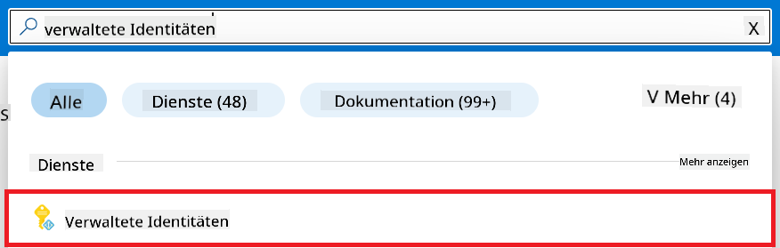

1. Wählen Sie **+ Erstellen**.

    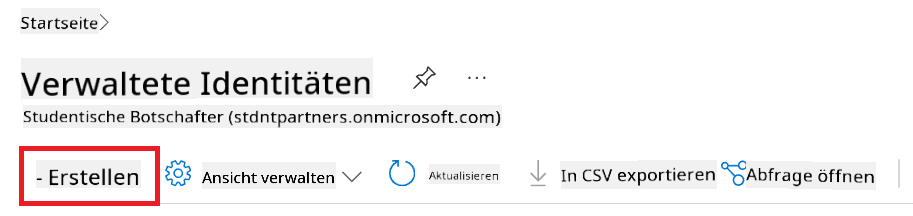

1. Führen Sie die folgenden Aufgaben aus:

    - Wählen Sie Ihr Azure **Abonnement**.  
    - Wählen Sie die **Ressourcengruppe**, die verwendet werden soll (erstellen Sie bei Bedarf eine neue).  
    - Wählen Sie die **Region**, die Sie verwenden möchten.  
    - Geben Sie den **Namen** ein. Dieser muss einzigartig sein.  

    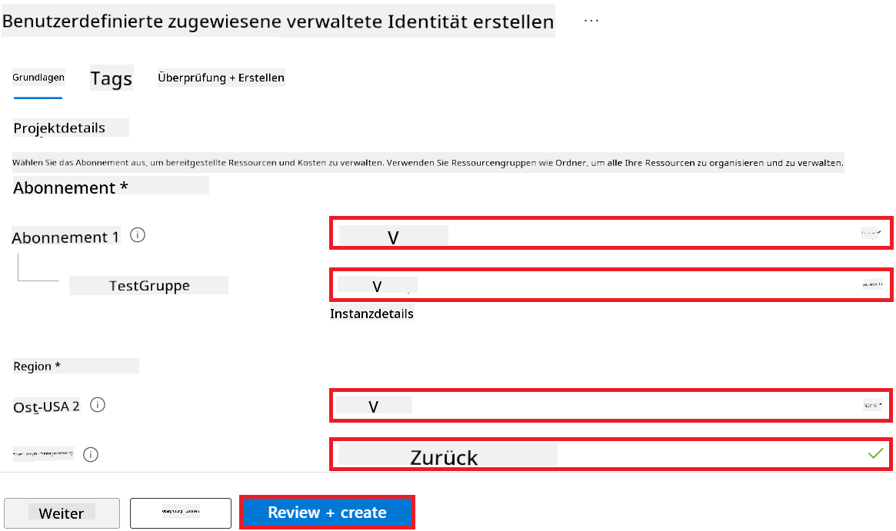

1. Wählen Sie **Überprüfen + Erstellen**.

1. Wählen Sie **+ Erstellen**.  

#### Rolle „Mitwirkender“ zur Verwalteten Identität hinzufügen

1. Navigieren Sie zur Ressource der Verwalteten Identität, die Sie erstellt haben.  

1. Wählen Sie **Azure-Rollenvergabe** aus dem linken Tab.  

1. Wählen Sie **+Rollenvergabe hinzufügen** aus dem Navigationsmenü.  

1. Führen Sie auf der Seite "Rollenvergabe hinzufügen" folgende Aufgaben aus:  
    - Wählen Sie den **Bereich** auf **Ressourcengruppe**.  
    - Wählen Sie Ihr Azure **Abonnement**.  
    - Wählen Sie die **Ressourcengruppe**, die verwendet werden soll.  
    - Wählen Sie die **Rolle** auf **Mitwirkender**.  

    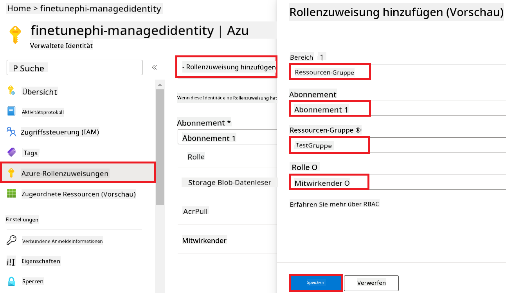

2. Wählen Sie **Speichern**.

#### Rolle „Storage Blob Data Reader“ zur Verwalteten Identität hinzufügen

1. Geben Sie *Speicherkonten* in die **Suchleiste** oben auf der Portalseite ein und wählen Sie **Speicherkonten** aus den angezeigten Optionen aus.

    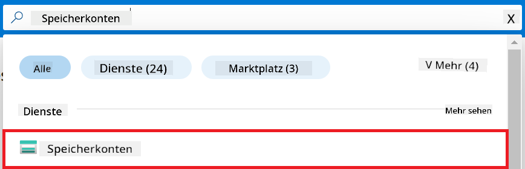

1. Wählen Sie das Speicherkonto aus, das mit dem Azure Machine Learning Workspace verknüpft ist, den Sie erstellt haben. Zum Beispiel *finetunephistorage*.  

1. Führen Sie die folgenden Aufgaben aus, um zur Seite "Rollenvergabe hinzufügen" zu navigieren:

    - Navigieren Sie zum Azure-Speicherkonto, das Sie erstellt haben.  
    - Wählen Sie **Zugriffskontrolle (IAM)** aus dem linken Tab.  
    - Wählen Sie **+ Hinzufügen** aus dem Navigationsmenü.  
    - Wählen Sie **Rollenvergabe hinzufügen** aus dem Navigationsmenü.  

    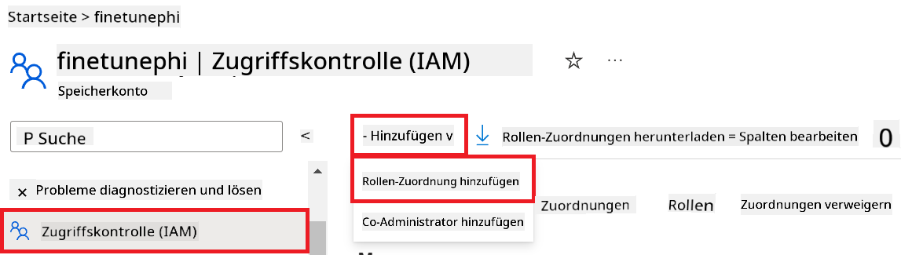

1. Führen Sie auf der Seite "Rollenvergabe hinzufügen" folgende Aufgaben aus:  

    - Geben Sie auf der Seite "Rolle" *Storage Blob Data Reader* in die **Suchleiste** ein und wählen Sie **Storage Blob Data Reader** aus den angezeigten Optionen aus.  
    - Wählen Sie **Weiter**.  
    - Wählen Sie auf der Seite "Mitglieder" **Zugriff zuweisen an** **Verwaltete Identität**.  
    - Wählen Sie **+ Mitglieder auswählen**.  
    - Wählen Sie auf der Seite "Verwaltete Identitäten auswählen" Ihr Azure **Abonnement**.  
    - Wählen Sie die **Verwaltete Identität**, die Sie erstellt haben. Zum Beispiel *finetunephi-managedidentity*.  
    - Wählen Sie **Auswählen**.  

    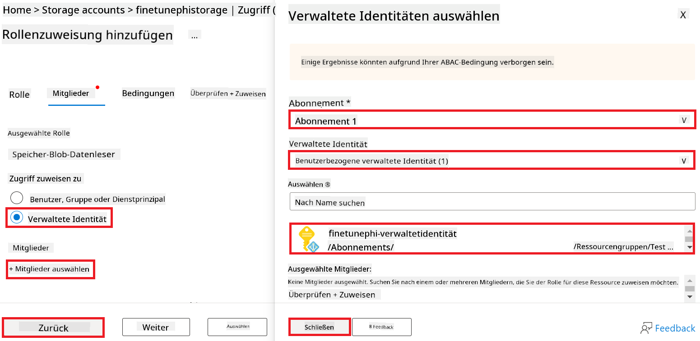

1. Wählen Sie **Überprüfen + Zuweisen**.

#### Rolle „AcrPull“ zur Verwalteten Identität hinzufügen

1. Geben Sie *Container-Registrierungen* in die **Suchleiste** oben auf der Portalseite ein und wählen Sie **Container-Registrierungen** aus den angezeigten Optionen aus.

    

1. Wählen Sie die Container-Registrierung aus, die mit dem Azure Machine Learning Workspace verknüpft ist. Zum Beispiel *finetunephicontainerregistry*.  

1. Führen Sie die folgenden Aufgaben aus, um zur Seite "Rollenvergabe hinzufügen" zu navigieren:

    - Wählen Sie **Zugriffskontrolle (IAM)** aus dem linken Tab.  
    - Wählen Sie **+ Hinzufügen** aus dem Navigationsmenü.  
    - Wählen Sie **Rollenvergabe hinzufügen** aus dem Navigationsmenü.  

1. Führen Sie auf der Seite "Rollenvergabe hinzufügen" folgende Aufgaben aus:  

    - Geben Sie auf der Seite "Rolle" *AcrPull* in die **Suchleiste** ein und wählen Sie **AcrPull** aus den angezeigten Optionen aus.  
    - Wählen Sie **Weiter**.  
    - Wählen Sie auf der Seite "Mitglieder" **Zugriff zuweisen an** **Verwaltete Identität**.  
    - Wählen Sie **+ Mitglieder auswählen**.  
    - Wählen Sie auf der Seite "Verwaltete Identitäten auswählen" Ihr Azure **Abonnement**.  
    - Wählen Sie die **Verwaltete Identität**, die Sie erstellt haben. Zum Beispiel *finetunephi-managedidentity*.  
    - Wählen Sie **Auswählen**.  
    - Wählen Sie **Überprüfen + Zuweisen**.  

### Projekt einrichten

Um die für die Feinabstimmung benötigten Datensätze herunterzuladen, richten Sie eine lokale Umgebung ein.

In dieser Übung werden Sie:

- Einen Ordner erstellen, um darin zu arbeiten.  
- Eine virtuelle Umgebung erstellen.  
- Die benötigten Pakete installieren.  
- Eine Datei *download_dataset.py* erstellen, um den Datensatz herunterzuladen.  

#### Einen Ordner erstellen, um darin zu arbeiten

1. Öffnen Sie ein Terminalfenster und geben Sie den folgenden Befehl ein, um einen Ordner namens *finetune-phi* im Standardpfad zu erstellen.

    ```console
    mkdir finetune-phi
    ```

2. Geben Sie den folgenden Befehl in Ihr Terminal ein, um zum erstellten Ordner *finetune-phi* zu navigieren.

    ```console
    cd finetune-phi
    ```

#### Eine virtuelle Umgebung erstellen

1. Geben Sie den folgenden Befehl in Ihr Terminal ein, um eine virtuelle Umgebung namens *.venv* zu erstellen.

    ```console
    python -m venv .venv
    ```

2. Geben Sie den folgenden Befehl in Ihr Terminal ein, um die virtuelle Umgebung zu aktivieren.

    ```console
    .venv\Scripts\activate.bat
    ```

> [!NOTE]  
> Wenn es funktioniert hat, sollten Sie *(.venv)* vor der Eingabeaufforderung sehen.

#### Die benötigten Pakete installieren

1. Geben Sie die folgenden Befehle in Ihr Terminal ein, um die benötigten Pakete zu installieren.

    ```console
    pip install datasets==2.19.1
    ```

#### *download_dataset.py* erstellen

> [!NOTE]  
> Vollständige Ordnerstruktur:  
> 
> ```text
> └── YourUserName
> .    └── finetune-phi
> .        └── download_dataset.py
> ```

1. Öffnen Sie **Visual Studio Code**.

1. Wählen Sie **Datei** aus der Menüleiste.

1. Wählen Sie **Ordner öffnen**.

1. Wählen Sie den Ordner *finetune-phi*, den Sie erstellt haben, der sich unter *C:\Users\IhrBenutzername\finetune-phi* befindet.

    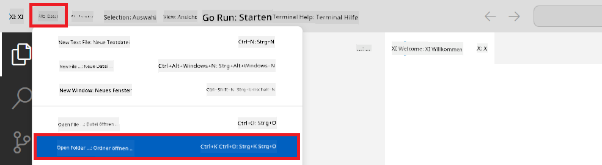

1. Klicken Sie im linken Bereich von Visual Studio Code mit der rechten Maustaste und wählen Sie **Neue Datei**, um eine neue Datei namens *download_dataset.py* zu erstellen.

    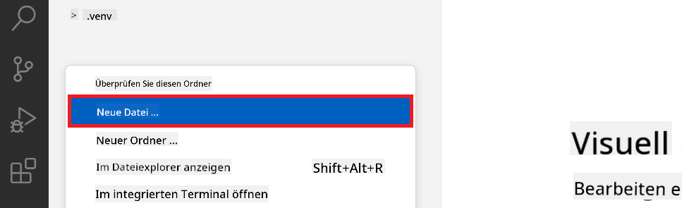

### Datensatz für Feinabstimmung vorbereiten

In dieser Übung führen Sie die Datei *download_dataset.py* aus, um die *ultrachat_200k*-Datensätze in Ihre lokale Umgebung herunterzuladen. Sie verwenden diese Datensätze anschließend, um das Phi-3-Modell im Azure Machine Learning Studio feinabzustimmen.

In dieser Übung werden Sie:

- Code zur Datei *download_dataset.py* hinzufügen, um die Datensätze herunterzuladen.  
- Die Datei *download_dataset.py* ausführen, um die Datensätze in Ihre lokale Umgebung herunterzuladen.

#### Ihren Datensatz mit *download_dataset.py* herunterladen

1. Öffnen Sie die Datei *download_dataset.py* in Visual Studio Code.

1. Fügen Sie den folgenden Code in die Datei *download_dataset.py* ein.

    ```python
    import json
    import os
    from datasets import load_dataset

    def load_and_split_dataset(dataset_name, config_name, split_ratio):
        """
        Load and split a dataset.
        """
        # Load the dataset with the specified name, configuration, and split ratio
        dataset = load_dataset(dataset_name, config_name, split=split_ratio)
        print(f"Original dataset size: {len(dataset)}")
        
        # Split the dataset into train and test sets (80% train, 20% test)
        split_dataset = dataset.train_test_split(test_size=0.2)
        print(f"Train dataset size: {len(split_dataset['train'])}")
        print(f"Test dataset size: {len(split_dataset['test'])}")
        
        return split_dataset

    def save_dataset_to_jsonl(dataset, filepath):
        """
        Save a dataset to a JSONL file.
        """
        # Create the directory if it does not exist
        os.makedirs(os.path.dirname(filepath), exist_ok=True)
        
        # Open the file in write mode
        with open(filepath, 'w', encoding='utf-8') as f:
            # Iterate over each record in the dataset
            for record in dataset:
                # Dump the record as a JSON object and write it to the file
                json.dump(record, f)
                # Write a newline character to separate records
                f.write('\n')
        
        print(f"Dataset saved to {filepath}")

    def main():
        """
        Main function to load, split, and save the dataset.
        """
        # Load and split the ULTRACHAT_200k dataset with a specific configuration and split ratio
        dataset = load_and_split_dataset("HuggingFaceH4/ultrachat_200k", 'default', 'train_sft[:1%]')
        
        # Extract the train and test datasets from the split
        train_dataset = dataset['train']
        test_dataset = dataset['test']

        # Save the train dataset to a JSONL file
        save_dataset_to_jsonl(train_dataset, "data/train_data.jsonl")
        
        # Save the test dataset to a separate JSONL file
        save_dataset_to_jsonl(test_dataset, "data/test_data.jsonl")

    if __name__ == "__main__":
        main()

    ```

1. Geben Sie den folgenden Befehl in Ihr Terminal ein, um das Skript auszuführen und den Datensatz in Ihre lokale Umgebung herunterzuladen.

    ```console
    python download_dataset.py
    ```

1. Überprüfen Sie, ob die Datensätze erfolgreich in Ihrem lokalen Verzeichnis *finetune-phi/data* gespeichert wurden.


1. Besuchen Sie [Azure ML Studio](https://ml.azure.com/home?wt.mc_id=studentamb_279723).

1. Wählen Sie **Compute** aus der linken Seitenleiste.

1. Wählen Sie **Compute clusters** aus dem Navigationsmenü.

1. Wählen Sie **+ Neu**.

    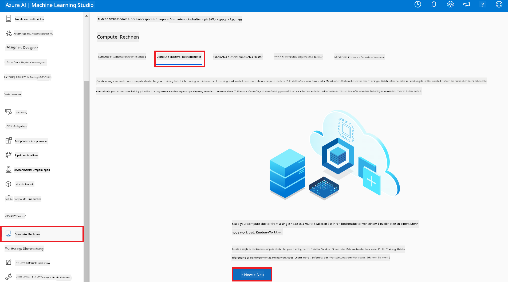

1. Führen Sie die folgenden Aufgaben aus:

    - Wählen Sie die gewünschte **Region** aus.
    - Setzen Sie die **Virtuelle Maschinen-Tier** auf **Dedicated**.
    - Setzen Sie den **Virtuellen Maschinentyp** auf **GPU**.
    - Setzen Sie den **Filter für virtuelle Maschinen-Größe** auf **Alle Optionen anzeigen**.
    - Wählen Sie die **Virtuelle Maschinen-Größe** auf **Standard_NC24ads_A100_v4**.

    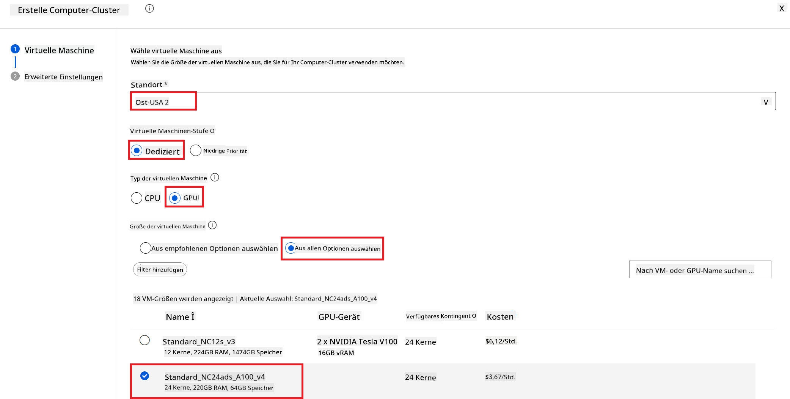

1. Wählen Sie **Weiter**.

1. Führen Sie die folgenden Aufgaben aus:

    - Geben Sie einen **Compute-Namen** ein. Dieser muss eindeutig sein.
    - Setzen Sie die **Minimale Anzahl von Knoten** auf **0**.
    - Setzen Sie die **Maximale Anzahl von Knoten** auf **1**.
    - Setzen Sie die **Leerlaufzeit vor Skalierung nach unten** auf **120**.

    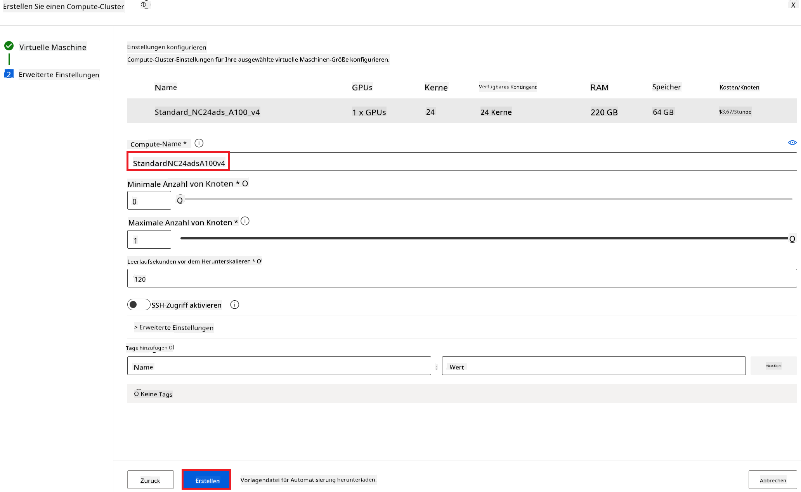

1. Wählen Sie **Erstellen**.

#### Phi-3-Modell feinabstimmen

1. Besuchen Sie [Azure ML Studio](https://ml.azure.com/home?wt.mc_id=studentamb_279723).

1. Wählen Sie den Azure Machine Learning-Arbeitsbereich aus, den Sie erstellt haben.

    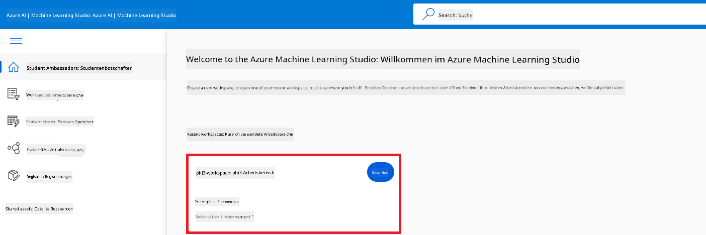

1. Führen Sie die folgenden Aufgaben aus:

    - Wählen Sie **Modellkatalog** aus der linken Seitenleiste.
    - Geben Sie *phi-3-mini-4k* in die **Suchleiste** ein und wählen Sie **Phi-3-mini-4k-instruct** aus den angezeigten Optionen.

    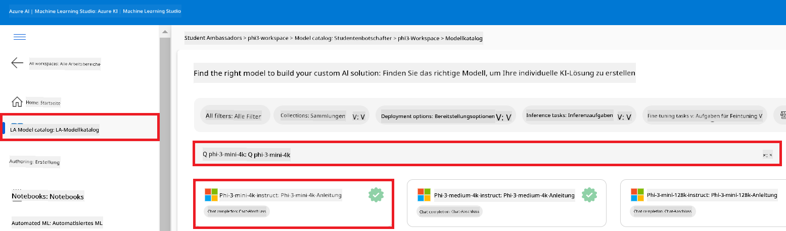

1. Wählen Sie **Fine-tune** aus dem Navigationsmenü.

    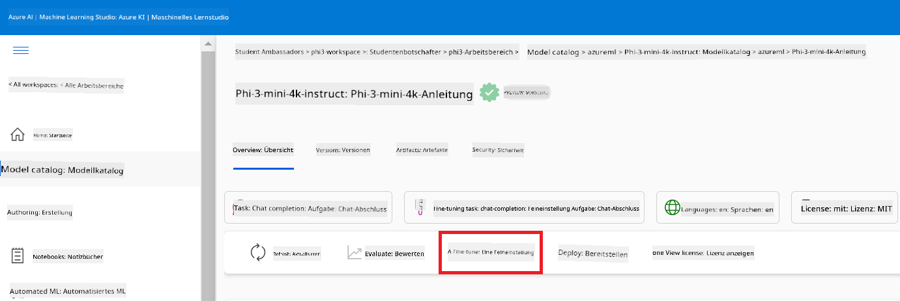

1. Führen Sie die folgenden Aufgaben aus:

    - Setzen Sie **Aufgabentyp auswählen** auf **Chat completion**.
    - Wählen Sie **+ Daten auswählen**, um **Trainingsdaten** hochzuladen.
    - Setzen Sie den Typ für den Upload von Validierungsdaten auf **Andere Validierungsdaten bereitstellen**.
    - Wählen Sie **+ Daten auswählen**, um **Validierungsdaten** hochzuladen.

    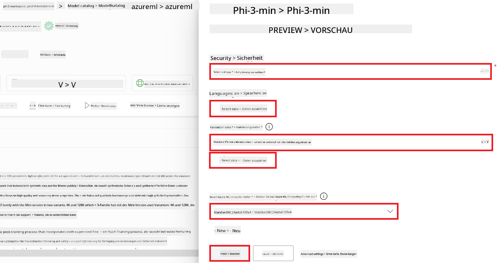

    > [!TIP]
    >
    > Sie können **Erweiterte Einstellungen** auswählen, um Konfigurationen wie **learning_rate** und **lr_scheduler_type** anzupassen, um den Feinabstimmungsprozess optimal auf Ihre spezifischen Anforderungen abzustimmen.

1. Wählen Sie **Fertigstellen**.

1. In dieser Übung haben Sie das Phi-3-Modell erfolgreich mit Azure Machine Learning feinabgestimmt. Bitte beachten Sie, dass der Feinabstimmungsprozess eine beträchtliche Zeit in Anspruch nehmen kann. Nach dem Start des Feinabstimmungs-Jobs müssen Sie warten, bis er abgeschlossen ist. Sie können den Status des Jobs im Reiter **Jobs** in Ihrem Azure Machine Learning-Arbeitsbereich überwachen. In der nächsten Serie werden Sie das feinabgestimmte Modell bereitstellen und mit Prompt Flow integrieren.

    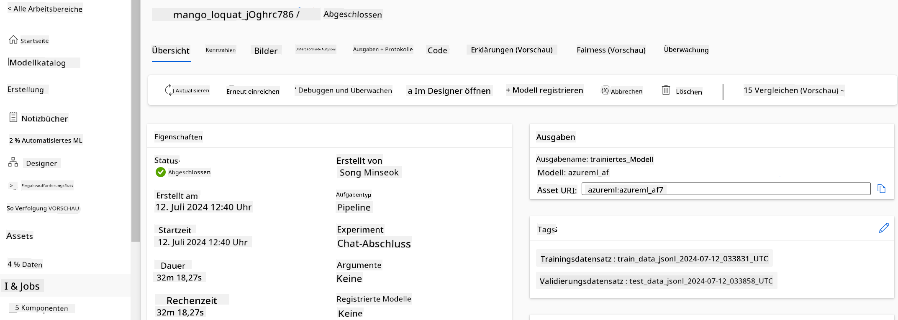

### Feinabgestimmtes Phi-3-Modell bereitstellen

Um das feinabgestimmte Phi-3-Modell mit Prompt Flow zu integrieren, müssen Sie das Modell bereitstellen, um es für Echtzeit-Inferenzen zugänglich zu machen. Dieser Prozess umfasst das Registrieren des Modells, das Erstellen eines Online-Endpunkts und das Bereitstellen des Modells.

In dieser Übung werden Sie:

- Das feinabgestimmte Modell im Azure Machine Learning-Arbeitsbereich registrieren.
- Einen Online-Endpunkt erstellen.
- Das registrierte feinabgestimmte Phi-3-Modell bereitstellen.

#### Feinabgestimmtes Modell registrieren

1. Besuchen Sie [Azure ML Studio](https://ml.azure.com/home?wt.mc_id=studentamb_279723).

1. Wählen Sie den Azure Machine Learning-Arbeitsbereich aus, den Sie erstellt haben.

    

1. Wählen Sie **Modelle** aus der linken Seitenleiste.
1. Wählen Sie **+ Registrieren**.
1. Wählen Sie **Aus einem Job-Output**.

    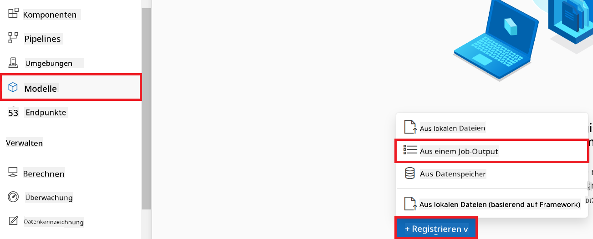

1. Wählen Sie den erstellten Job aus.

    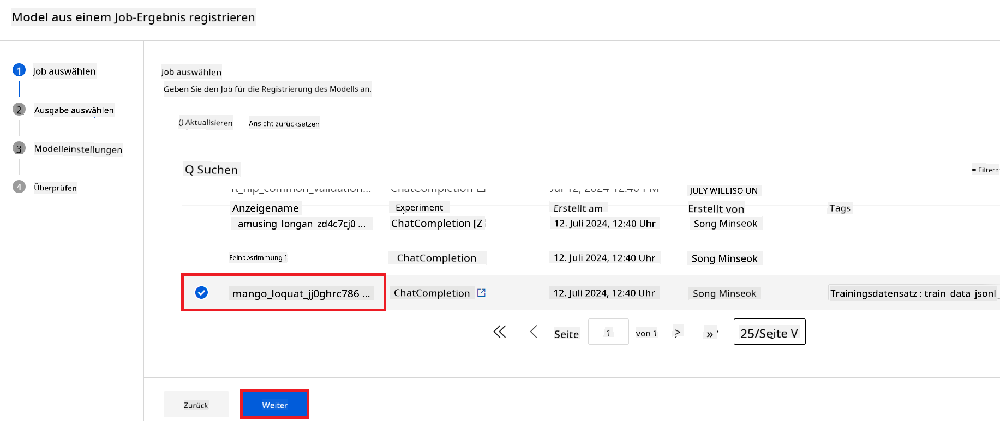

1. Wählen Sie **Weiter**.

1. Setzen Sie **Modelltyp** auf **MLflow**.

1. Stellen Sie sicher, dass **Job-Output** ausgewählt ist; dies sollte automatisch ausgewählt sein.

    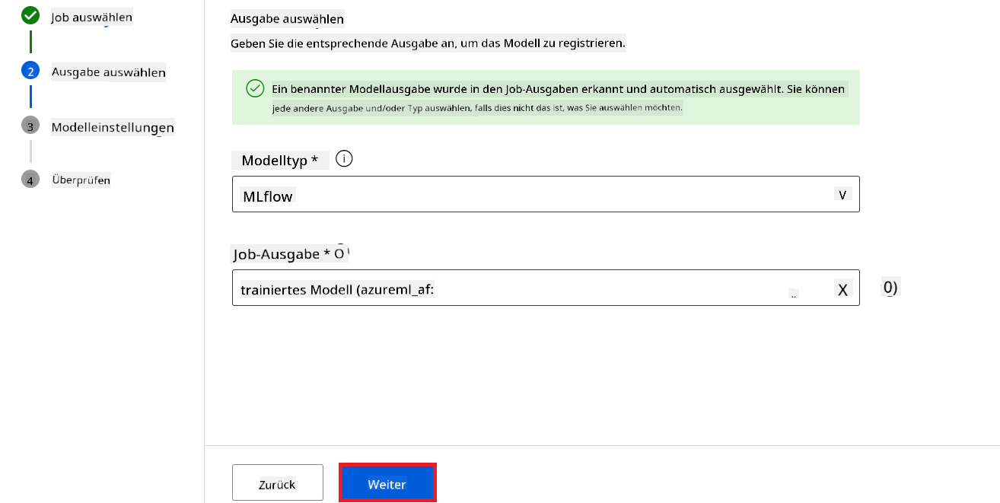

2. Wählen Sie **Weiter**.

3. Wählen Sie **Registrieren**.

    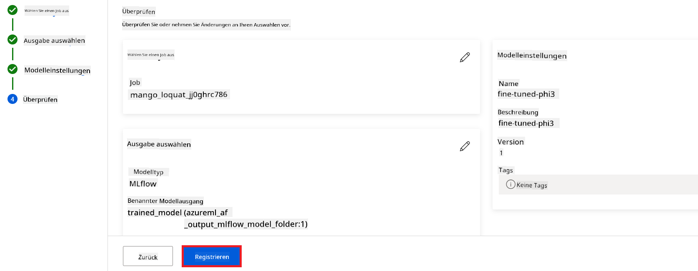

4. Sie können Ihr registriertes Modell anzeigen, indem Sie im linken Menü zu **Modelle** navigieren.

    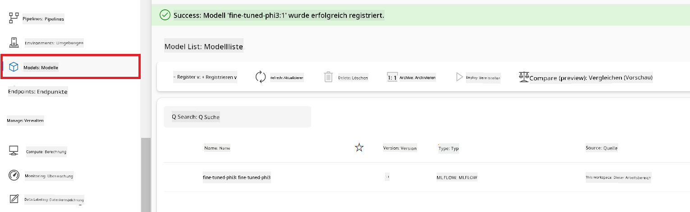

#### Feinabgestimmtes Modell bereitstellen

1. Navigieren Sie zu dem Azure Machine Learning-Arbeitsbereich, den Sie erstellt haben.

1. Wählen Sie **Endpunkte** aus der linken Seitenleiste.

1. Wählen Sie **Echtzeit-Endpunkte** aus dem Navigationsmenü.

    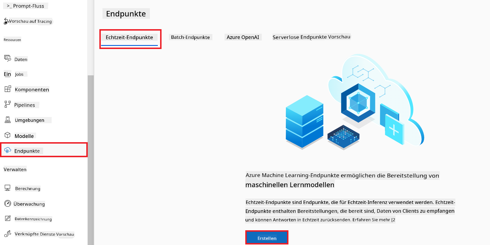

1. Wählen Sie **Erstellen**.

1. Wählen Sie das registrierte Modell aus, das Sie erstellt haben.

    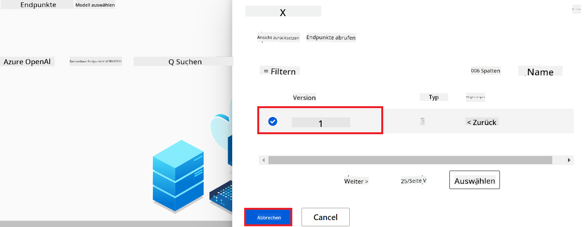

1. Wählen Sie **Auswählen**.

1. Führen Sie die folgenden Aufgaben aus:

    - Setzen Sie die **Virtuelle Maschine** auf *Standard_NC6s_v3*.
    - Wählen Sie die gewünschte **Instanzanzahl** aus. Zum Beispiel *1*.
    - Setzen Sie den **Endpunkt** auf **Neu**, um einen neuen Endpunkt zu erstellen.
    - Geben Sie einen **Endpunktnamen** ein. Dieser muss eindeutig sein.
    - Geben Sie einen **Bereitstellungsnamen** ein. Dieser muss eindeutig sein.

    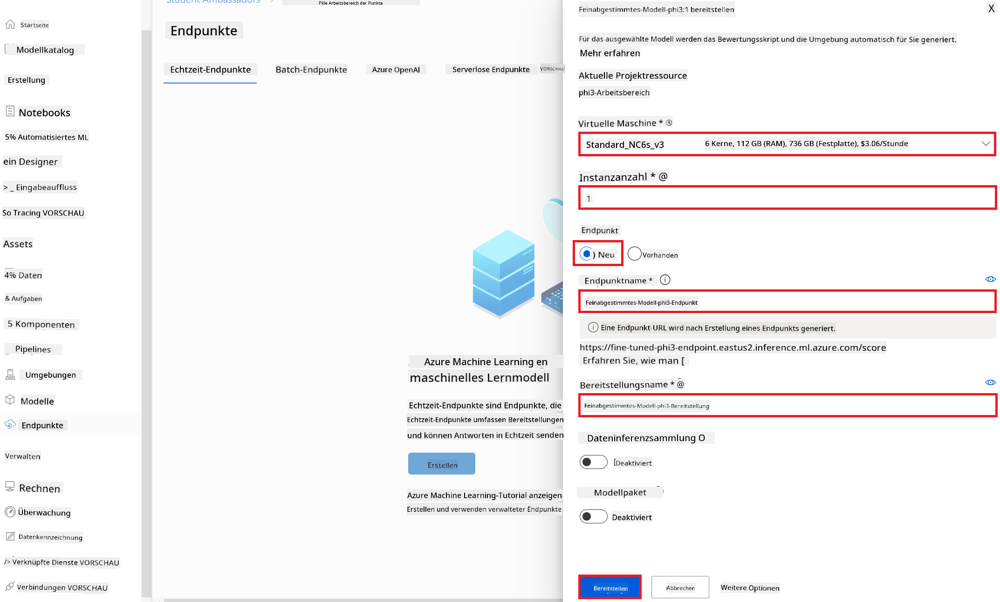

1. Wählen Sie **Bereitstellen**.

> [!WARNING]
> Um zusätzliche Kosten für Ihr Konto zu vermeiden, stellen Sie sicher, dass Sie den erstellten Endpunkt im Azure Machine Learning-Arbeitsbereich löschen.
>

#### Bereitstellungsstatus im Azure Machine Learning-Arbeitsbereich überprüfen

1. Navigieren Sie zu dem Azure Machine Learning-Arbeitsbereich, den Sie erstellt haben.

1. Wählen Sie **Endpunkte** aus der linken Seitenleiste.

1. Wählen Sie den Endpunkt aus, den Sie erstellt haben.

    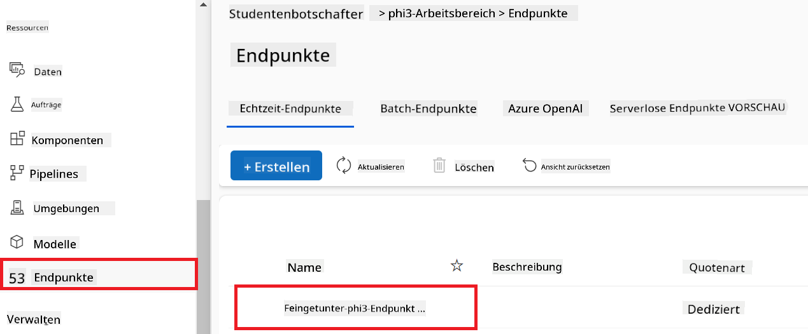

1. Auf dieser Seite können Sie die Endpunkte während des Bereitstellungsprozesses verwalten.

> [!NOTE]
> Sobald die Bereitstellung abgeschlossen ist, stellen Sie sicher, dass **Live-Traffic** auf **100%** gesetzt ist. Wenn dies nicht der Fall ist, wählen Sie **Traffic aktualisieren**, um die Traffic-Einstellungen anzupassen. Beachten Sie, dass Sie das Modell nicht testen können, wenn der Traffic auf 0% gesetzt ist.
>
> 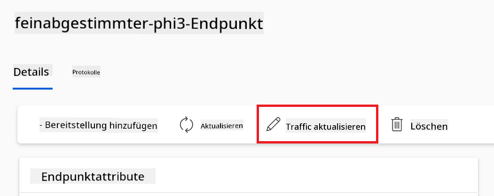
>

## Szenario 3: Integration mit Prompt Flow und Chatten mit Ihrem benutzerdefinierten Modell in Azure AI Foundry

### Das benutzerdefinierte Phi-3-Modell mit Prompt Flow integrieren

Nach der erfolgreichen Bereitstellung Ihres feinabgestimmten Modells können Sie es jetzt mit Prompt Flow integrieren, um Ihr Modell in Echtzeitanwendungen zu verwenden. Dies ermöglicht eine Vielzahl von interaktiven Aufgaben mit Ihrem benutzerdefinierten Phi-3-Modell.

In dieser Übung werden Sie:

- Einen Azure AI Foundry Hub erstellen.
- Ein Azure AI Foundry Projekt erstellen.
- Prompt Flow erstellen.
- Eine benutzerdefinierte Verbindung für das feinabgestimmte Phi-3-Modell hinzufügen.
- Prompt Flow einrichten, um mit Ihrem benutzerdefinierten Phi-3-Modell zu chatten.

> [!NOTE]
> Sie können auch mit Prompt Flow über Azure ML Studio integrieren. Der gleiche Integrationsprozess kann auf Azure ML Studio angewendet werden.

#### Azure AI Foundry Hub erstellen

Bevor Sie ein Projekt erstellen, müssen Sie einen Hub erstellen. Ein Hub fungiert wie eine Ressourcengruppe und ermöglicht es Ihnen, mehrere Projekte innerhalb von Azure AI Foundry zu organisieren und zu verwalten.

1. Besuchen Sie [Azure AI Foundry](https://ai.azure.com/?WT.mc_id=aiml-137032-kinfeylo).

1. Wählen Sie **Alle Hubs** aus der linken Seitenleiste.

1. Wählen Sie **+ Neuer Hub** aus dem Navigationsmenü.

    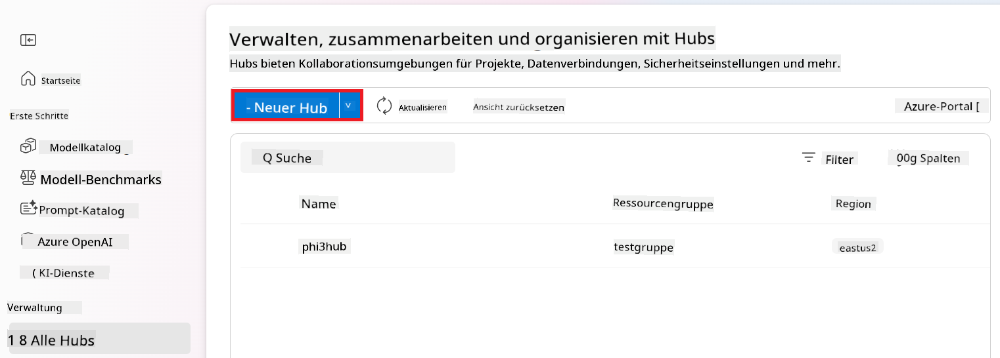

1. Führen Sie die folgenden Aufgaben aus:

    - Geben Sie einen **Hub-Namen** ein. Dieser muss eindeutig sein.
    - Wählen Sie Ihr Azure **Abonnement** aus.
    - Wählen Sie die **Ressourcengruppe**, die Sie verwenden möchten (erstellen Sie eine neue, falls erforderlich).
    - Wählen Sie den **Standort**, den Sie verwenden möchten.
    - Wählen Sie **Azure AI Services verbinden** aus (erstellen Sie eine neue, falls erforderlich).
    - Setzen Sie **Azure AI Search verbinden** auf **Verbindung überspringen**.

    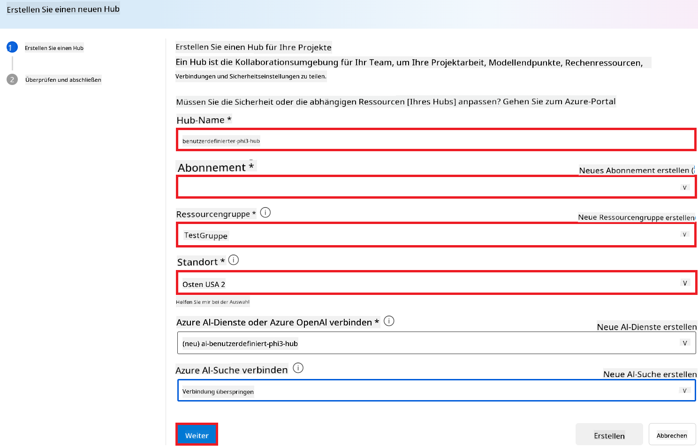

1. Wählen Sie **Weiter**.

#### Azure AI Foundry Projekt erstellen

1. Wählen Sie in dem erstellten Hub **Alle Projekte** aus der linken Seitenleiste.

1. Wählen Sie **+ Neues Projekt** aus dem Navigationsmenü.

    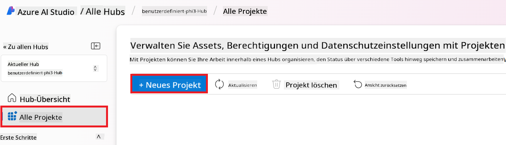

1. Geben Sie einen **Projektnamen** ein. Dieser muss eindeutig sein.

    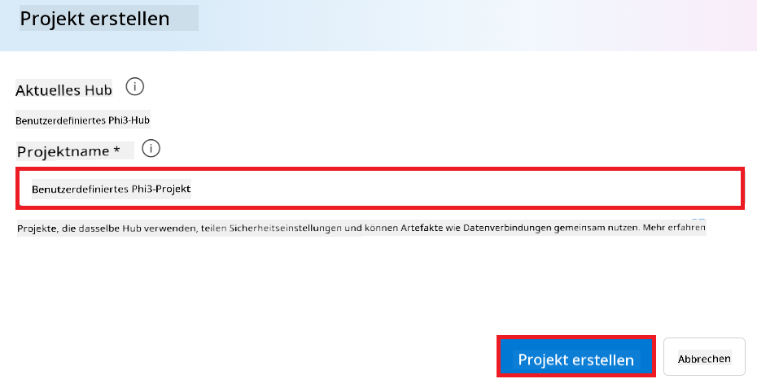

1. Wählen Sie **Projekt erstellen**.

#### Benutzerdefinierte Verbindung für das feinabgestimmte Phi-3-Modell hinzufügen

Um Ihr benutzerdefiniertes Phi-3-Modell mit Prompt Flow zu integrieren, müssen Sie den Endpunkt und den Schlüssel des Modells in einer benutzerdefinierten Verbindung speichern. Diese Einrichtung gewährleistet den Zugriff auf Ihr benutzerdefiniertes Phi-3-Modell in Prompt Flow.

#### API-Schlüssel und Endpunkt-URI des feinabgestimmten Phi-3-Modells festlegen

1. Besuchen Sie [Azure ML Studio](https://ml.azure.com/home?WT.mc_id=aiml-137032-kinfeylo).

1. Navigieren Sie zu dem Azure Machine Learning-Arbeitsbereich, den Sie erstellt haben.

1. Wählen Sie **Endpunkte** aus der linken Seitenleiste.

    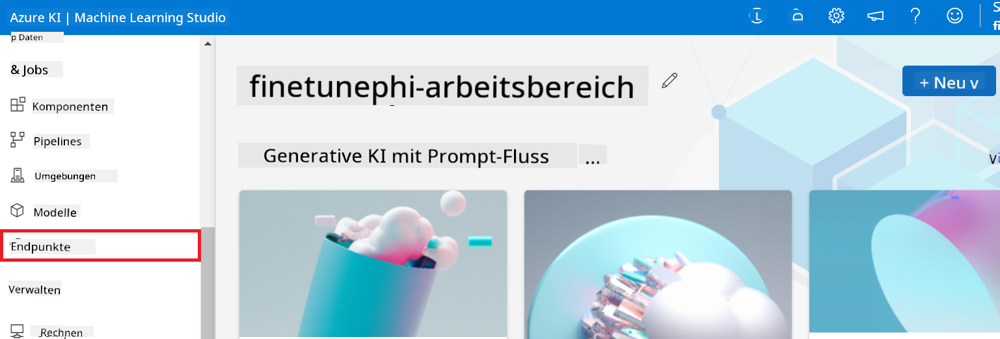

1. Wählen Sie den Endpunkt aus, den Sie erstellt haben.

    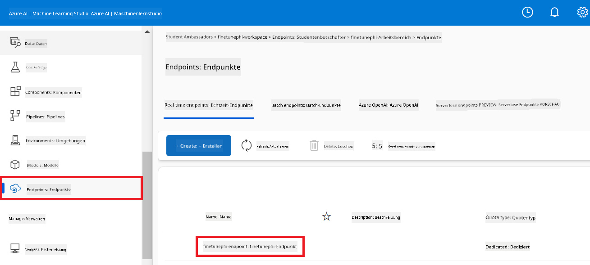

1. Wählen Sie **Verbrauchen** aus dem Navigationsmenü.

1. Kopieren Sie Ihren **REST-Endpunkt** und Ihren **Primärschlüssel**.
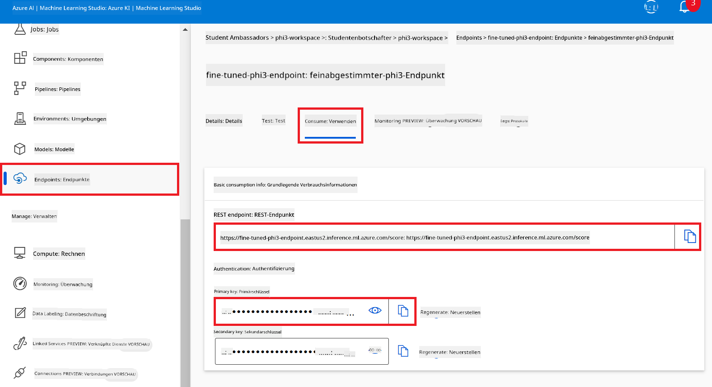

#### Benutzerdefinierte Verbindung hinzufügen

1. Besuchen Sie [Azure AI Foundry](https://ai.azure.com/?WT.mc_id=aiml-137032-kinfeylo).

1. Navigieren Sie zu dem Azure AI Foundry-Projekt, das Sie erstellt haben.

1. Wählen Sie im erstellten Projekt **Einstellungen** aus der linken Seitenleiste.

1. Wählen Sie **+ Neue Verbindung**.

    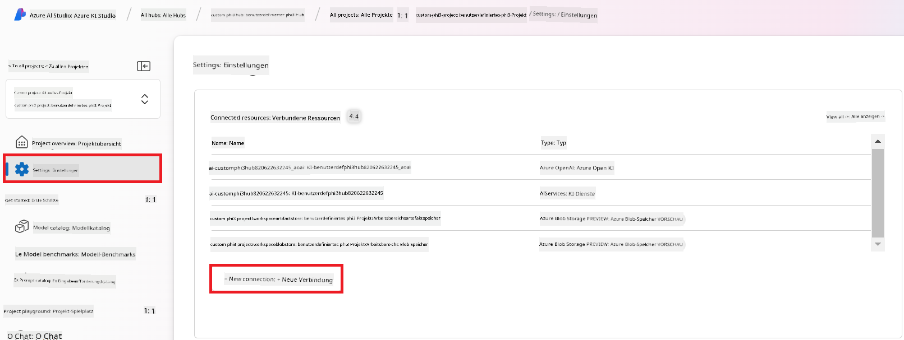

1. Wählen Sie **Benutzerdefinierte Schlüssel** aus dem Navigationsmenü.

    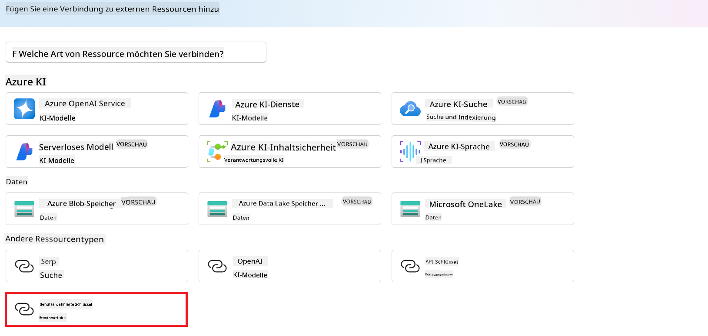

1. Führen Sie die folgenden Schritte aus:

    - Wählen Sie **+ Schlüssel-Wert-Paare hinzufügen**.
    - Geben Sie als Schlüsselname **endpoint** ein und fügen Sie den Endpunkt, den Sie aus Azure ML Studio kopiert haben, in das Wertfeld ein.
    - Wählen Sie erneut **+ Schlüssel-Wert-Paare hinzufügen**.
    - Geben Sie als Schlüsselname **key** ein und fügen Sie den Schlüssel, den Sie aus Azure ML Studio kopiert haben, in das Wertfeld ein.
    - Nachdem Sie die Schlüssel hinzugefügt haben, wählen Sie **ist geheim**, um den Schlüssel vor der Offenlegung zu schützen.

    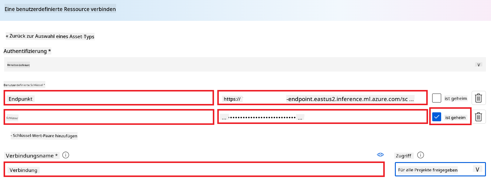

1. Wählen Sie **Verbindung hinzufügen**.

#### Prompt flow erstellen

Sie haben eine benutzerdefinierte Verbindung in Azure AI Foundry hinzugefügt. Jetzt erstellen wir einen Prompt flow mit den folgenden Schritten. Anschließend verbinden Sie diesen Prompt flow mit der benutzerdefinierten Verbindung, damit Sie das feinabgestimmte Modell im Prompt flow verwenden können.

1. Navigieren Sie zu dem Azure AI Foundry-Projekt, das Sie erstellt haben.

1. Wählen Sie **Prompt flow** aus der linken Seitenleiste.

1. Wählen Sie **+ Erstellen** aus dem Navigationsmenü.

    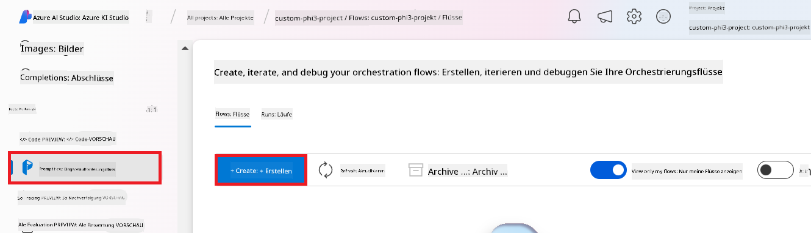

1. Wählen Sie **Chat flow** aus dem Navigationsmenü.

    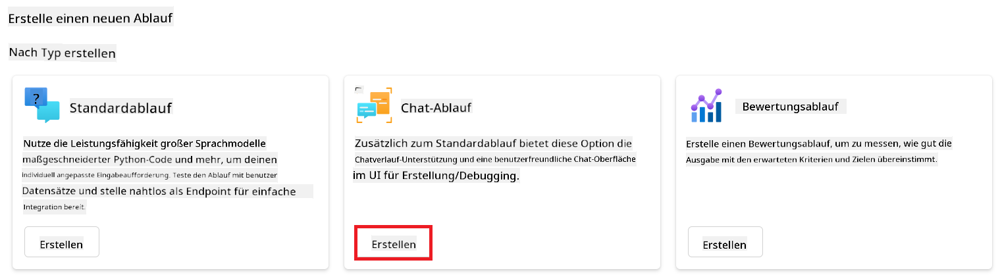

1. Geben Sie **Ordnername** ein.

    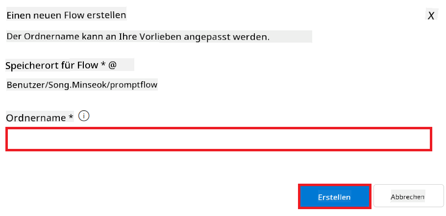

2. Wählen Sie **Erstellen**.

#### Prompt flow für Chat mit Ihrem benutzerdefinierten Phi-3-Modell einrichten

Sie müssen das feinabgestimmte Phi-3-Modell in einen Prompt flow integrieren. Der vorhandene Prompt flow ist jedoch nicht für diesen Zweck geeignet. Daher müssen Sie den Prompt flow neu gestalten, um die Integration des benutzerdefinierten Modells zu ermöglichen.

1. Führen Sie im Prompt flow die folgenden Schritte aus, um den vorhandenen Flow neu zu gestalten:

    - Wählen Sie **Raw-Dateimodus**.
    - Löschen Sie den gesamten vorhandenen Code in der Datei *flow.dag.yml*.
    - Fügen Sie den folgenden Code in die Datei *flow.dag.yml* ein.

        ```yml
        inputs:
          input_data:
            type: string
            default: "Who founded Microsoft?"

        outputs:
          answer:
            type: string
            reference: ${integrate_with_promptflow.output}

        nodes:
        - name: integrate_with_promptflow
          type: python
          source:
            type: code
            path: integrate_with_promptflow.py
          inputs:
            input_data: ${inputs.input_data}
        ```

    - Wählen Sie **Speichern**.

    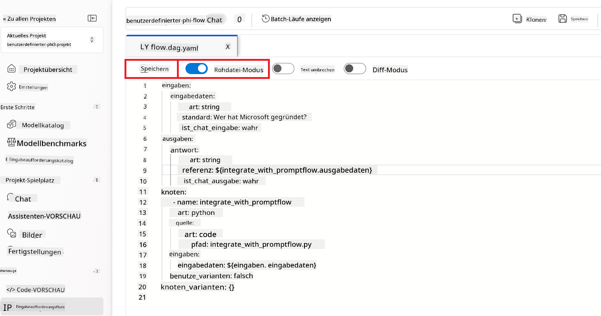

1. Fügen Sie den folgenden Code in die Datei *integrate_with_promptflow.py* ein, um das benutzerdefinierte Phi-3-Modell im Prompt flow zu verwenden.

    ```python
    import logging
    import requests
    from promptflow import tool
    from promptflow.connections import CustomConnection

    # Logging setup
    logging.basicConfig(
        format="%(asctime)s - %(levelname)s - %(name)s - %(message)s",
        datefmt="%Y-%m-%d %H:%M:%S",
        level=logging.DEBUG
    )
    logger = logging.getLogger(__name__)

    def query_phi3_model(input_data: str, connection: CustomConnection) -> str:
        """
        Send a request to the Phi-3 model endpoint with the given input data using Custom Connection.
        """

        # "connection" is the name of the Custom Connection, "endpoint", "key" are the keys in the Custom Connection
        endpoint_url = connection.endpoint
        api_key = connection.key

        headers = {
            "Content-Type": "application/json",
            "Authorization": f"Bearer {api_key}"
        }
        data = {
            "input_data": {
                "input_string": [
                    {"role": "user", "content": input_data}
                ],
                "parameters": {
                    "temperature": 0.7,
                    "max_new_tokens": 128
                }
            }
        }
        try:
            response = requests.post(endpoint_url, json=data, headers=headers)
            response.raise_for_status()
            
            # Log the full JSON response
            logger.debug(f"Full JSON response: {response.json()}")

            result = response.json()["output"]
            logger.info("Successfully received response from Azure ML Endpoint.")
            return result
        except requests.exceptions.RequestException as e:
            logger.error(f"Error querying Azure ML Endpoint: {e}")
            raise

    @tool
    def my_python_tool(input_data: str, connection: CustomConnection) -> str:
        """
        Tool function to process input data and query the Phi-3 model.
        """
        return query_phi3_model(input_data, connection)

    ```

    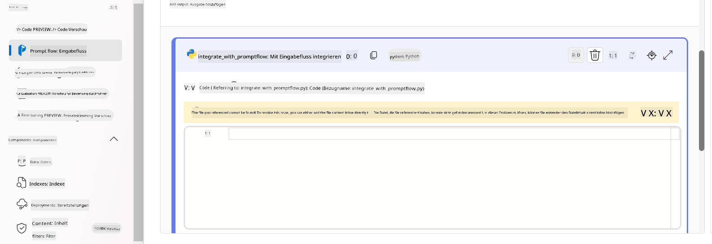

> [!NOTE]
> Weitere detaillierte Informationen zur Verwendung von Prompt flow in Azure AI Foundry finden Sie unter [Prompt flow in Azure AI Foundry](https://learn.microsoft.com/azure/ai-studio/how-to/prompt-flow).

1. Wählen Sie **Chat-Eingabe**, **Chat-Ausgabe**, um den Chat mit Ihrem Modell zu aktivieren.

    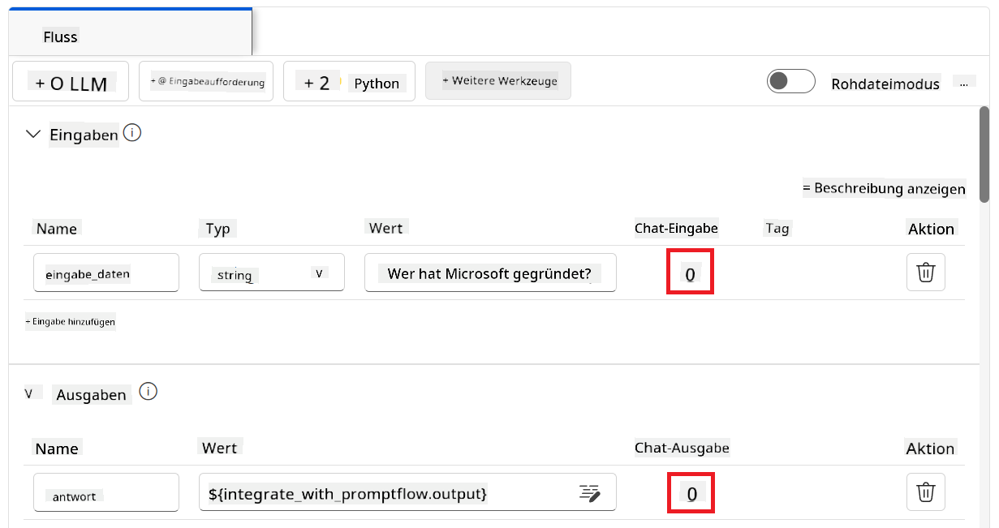

1. Jetzt sind Sie bereit, mit Ihrem benutzerdefinierten Phi-3-Modell zu chatten. Im nächsten Abschnitt erfahren Sie, wie Sie Prompt flow starten und es verwenden, um mit Ihrem feinabgestimmten Phi-3-Modell zu chatten.

> [!NOTE]
>
> Der neu gestaltete Flow sollte wie das folgende Bild aussehen:
>
> 
>

### Chat mit Ihrem benutzerdefinierten Phi-3-Modell

Nachdem Sie Ihr benutzerdefiniertes Phi-3-Modell feinabgestimmt und in Prompt flow integriert haben, können Sie jetzt mit ihm interagieren. Diese Übung führt Sie durch den Prozess der Einrichtung und des Starts eines Chats mit Ihrem Modell mithilfe von Prompt flow. Durch die folgenden Schritte können Sie die Fähigkeiten Ihres feinabgestimmten Phi-3-Modells vollständig für verschiedene Aufgaben und Gespräche nutzen.

- Chatten Sie mit Ihrem benutzerdefinierten Phi-3-Modell mithilfe von Prompt flow.

#### Prompt flow starten

1. Wählen Sie **Compute-Sitzungen starten**, um Prompt flow zu starten.

    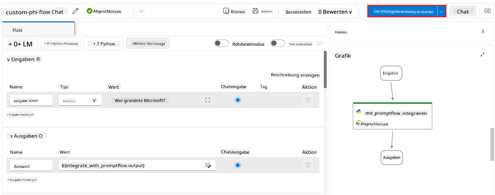

1. Wählen Sie **Eingabe validieren und analysieren**, um die Parameter zu erneuern.

    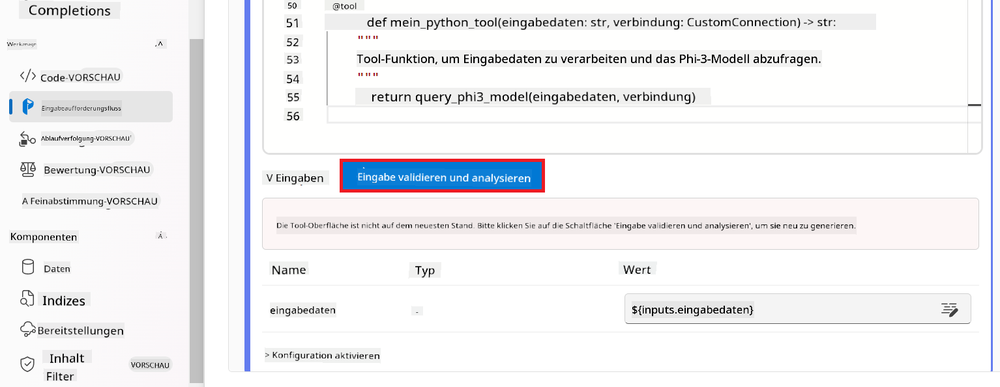

1. Wählen Sie den **Wert** der **Verbindung** zu der benutzerdefinierten Verbindung, die Sie erstellt haben. Zum Beispiel *connection*.

    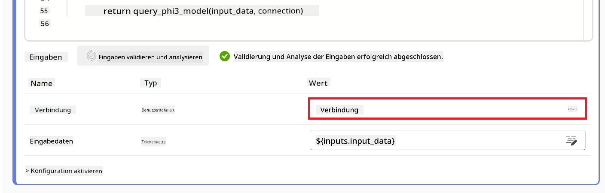

#### Chat mit Ihrem benutzerdefinierten Modell

1. Wählen Sie **Chat**.

    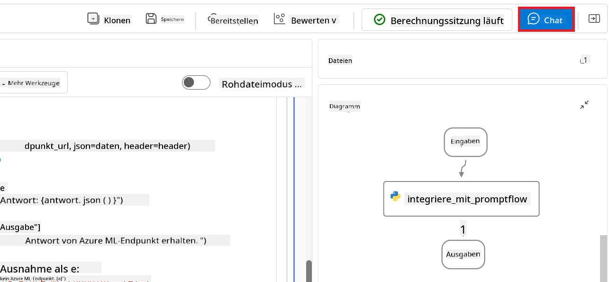

1. Hier ist ein Beispiel für die Ergebnisse: Jetzt können Sie mit Ihrem benutzerdefinierten Phi-3-Modell chatten. Es wird empfohlen, Fragen basierend auf den Daten zu stellen, die für das Fein-Tuning verwendet wurden.

    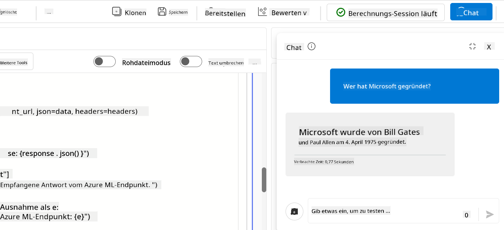

**Haftungsausschluss**:  
Dieses Dokument wurde mit dem KI-Übersetzungsdienst [Co-op Translator](https://github.com/Azure/co-op-translator) übersetzt. Obwohl wir uns um Genauigkeit bemühen, beachten Sie bitte, dass automatisierte Übersetzungen Fehler oder Ungenauigkeiten enthalten können. Das Originaldokument in seiner ursprünglichen Sprache sollte als maßgebliche Quelle betrachtet werden. Für kritische Informationen wird eine professionelle menschliche Übersetzung empfohlen. Wir haften nicht für Missverständnisse oder Fehlinterpretationen, die durch die Nutzung dieser Übersetzung entstehen.