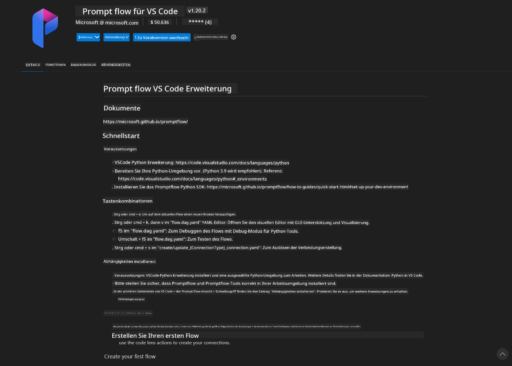
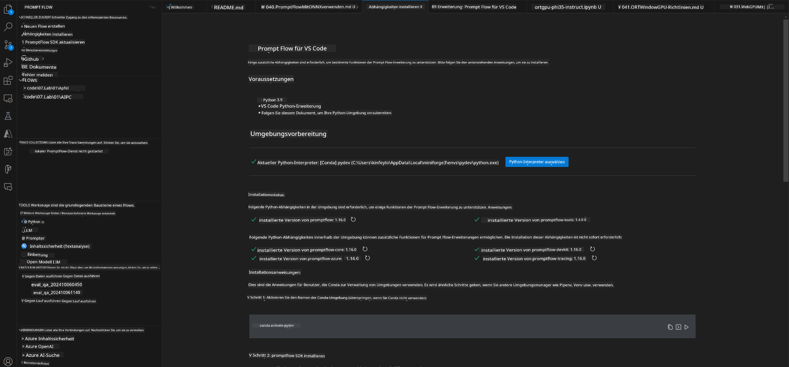
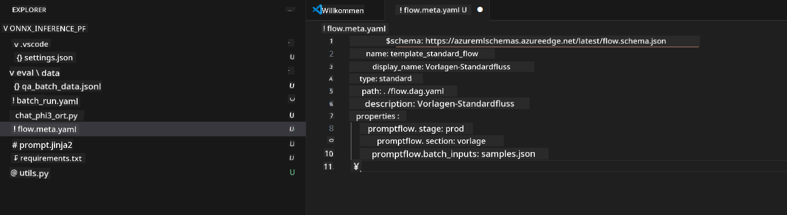
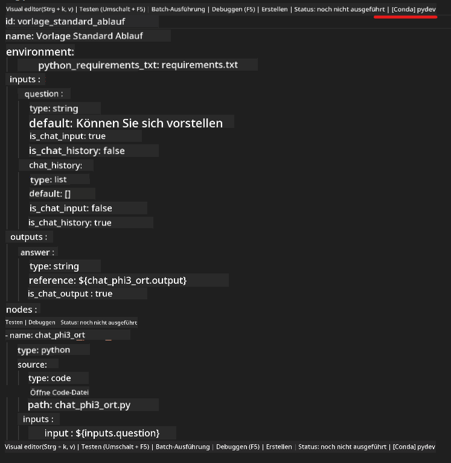
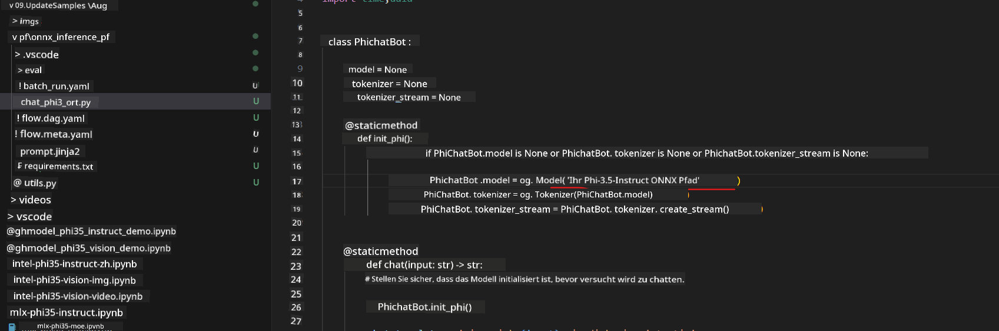
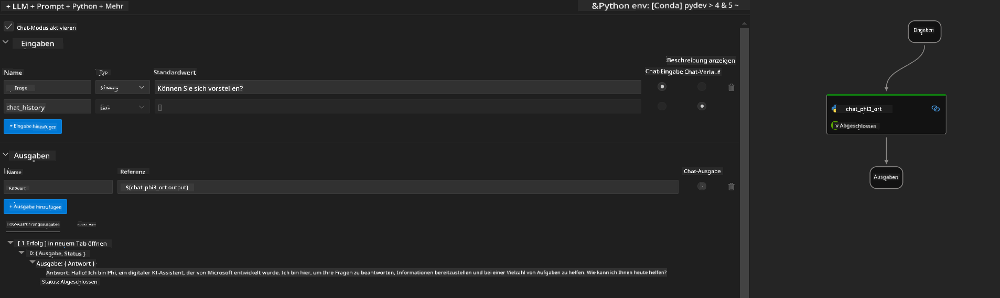
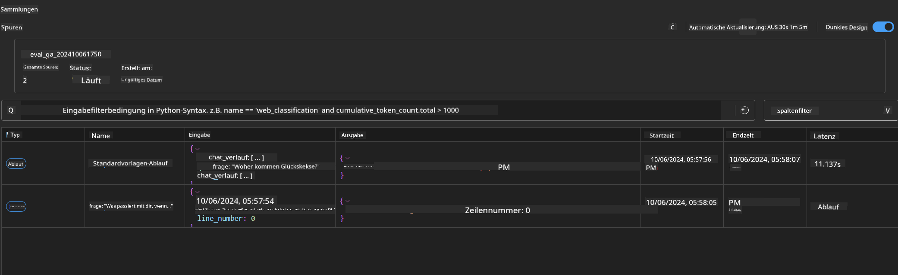

<!--
CO_OP_TRANSLATOR_METADATA:
{
  "original_hash": "92e7dac1e5af0dd7c94170fdaf6860fe",
  "translation_date": "2025-03-27T11:11:16+00:00",
  "source_file": "md\\02.Application\\01.TextAndChat\\Phi3\\UsingPromptFlowWithONNX.md",
  "language_code": "de"
}
-->
# Verwendung der Windows-GPU zur Erstellung einer PromptFlow-Lösung mit Phi-3.5-Instruct ONNX

Das folgende Dokument ist ein Beispiel dafür, wie man PromptFlow mit ONNX (Open Neural Network Exchange) zur Entwicklung von KI-Anwendungen auf Basis von Phi-3-Modellen nutzen kann.

PromptFlow ist eine Sammlung von Entwicklungstools, die den gesamten Entwicklungszyklus von KI-Anwendungen, die auf großen Sprachmodellen (LLM) basieren, von der Ideenfindung und Prototypenerstellung bis hin zu Tests und Evaluierung vereinfachen soll.

Durch die Integration von PromptFlow mit ONNX können Entwickler:

- **Modellleistung optimieren**: Nutzen Sie ONNX für effizientes Modell-Inferencing und Deployment.
- **Entwicklung vereinfachen**: Verwenden Sie PromptFlow, um Workflows zu verwalten und wiederkehrende Aufgaben zu automatisieren.
- **Zusammenarbeit verbessern**: Fördern Sie eine bessere Zusammenarbeit im Team durch eine einheitliche Entwicklungsumgebung.

**PromptFlow** ist eine Sammlung von Entwicklungstools, die den gesamten Entwicklungszyklus von LLM-basierten KI-Anwendungen von der Ideenfindung über Prototyping, Tests, Evaluierung bis hin zur Produktionsbereitstellung und Überwachung optimiert. Es erleichtert das Prompt Engineering erheblich und ermöglicht die Entwicklung von LLM-Anwendungen in Produktionsqualität.

PromptFlow kann mit OpenAI, Azure OpenAI Service und anpassbaren Modellen (Huggingface, lokale LLM/SLM) verbunden werden. Unser Ziel ist es, das quantisierte ONNX-Modell von Phi-3.5 in lokalen Anwendungen bereitzustellen. PromptFlow kann uns dabei helfen, unsere Geschäftsplanung besser zu gestalten und lokale Lösungen auf Basis von Phi-3.5 zu entwickeln. In diesem Beispiel kombinieren wir die ONNX Runtime GenAI-Bibliothek, um die PromptFlow-Lösung auf einer Windows-GPU umzusetzen.

## **Installation**

### **ONNX Runtime GenAI für Windows GPU**

Lesen Sie diese Anleitung, um die ONNX Runtime GenAI für Windows GPU einzurichten: [hier klicken](./ORTWindowGPUGuideline.md)

### **Einrichtung von PromptFlow in VSCode**

1. Installieren Sie die PromptFlow VS Code-Erweiterung.



2. Nachdem Sie die PromptFlow VS Code-Erweiterung installiert haben, klicken Sie auf die Erweiterung und wählen Sie **Installation dependencies**. Folgen Sie dieser Anleitung, um das PromptFlow SDK in Ihrer Umgebung zu installieren.



3. Laden Sie den [Beispielcode](../../../../../../code/09.UpdateSamples/Aug/pf/onnx_inference_pf) herunter und öffnen Sie ihn mit VS Code.



4. Öffnen Sie **flow.dag.yaml**, um Ihre Python-Umgebung auszuwählen.



   Öffnen Sie **chat_phi3_ort.py**, um den Speicherort Ihres Phi-3.5-Instruct ONNX-Modells zu ändern.



5. Führen Sie Ihren PromptFlow aus, um ihn zu testen.

Öffnen Sie **flow.dag.yaml** und klicken Sie auf den visuellen Editor.


Klicken Sie darauf und führen Sie ihn aus, um ihn zu testen.



1. Sie können Batch-Dateien im Terminal ausführen, um weitere Ergebnisse zu überprüfen.

```bash

pf run create --file batch_run.yaml --stream --name 'Your eval qa name'    

```

Sie können die Ergebnisse in Ihrem Standardbrowser überprüfen.



**Haftungsausschluss**:  
Dieses Dokument wurde mithilfe des KI-Übersetzungsdienstes [Co-op Translator](https://github.com/Azure/co-op-translator) übersetzt. Obwohl wir uns um Genauigkeit bemühen, beachten Sie bitte, dass automatisierte Übersetzungen Fehler oder Ungenauigkeiten enthalten können. Das Originaldokument in seiner Ausgangssprache sollte als maßgebliche Quelle betrachtet werden. Für kritische Informationen wird eine professionelle menschliche Übersetzung empfohlen. Wir übernehmen keine Haftung für Missverständnisse oder Fehlinterpretationen, die durch die Nutzung dieser Übersetzung entstehen.