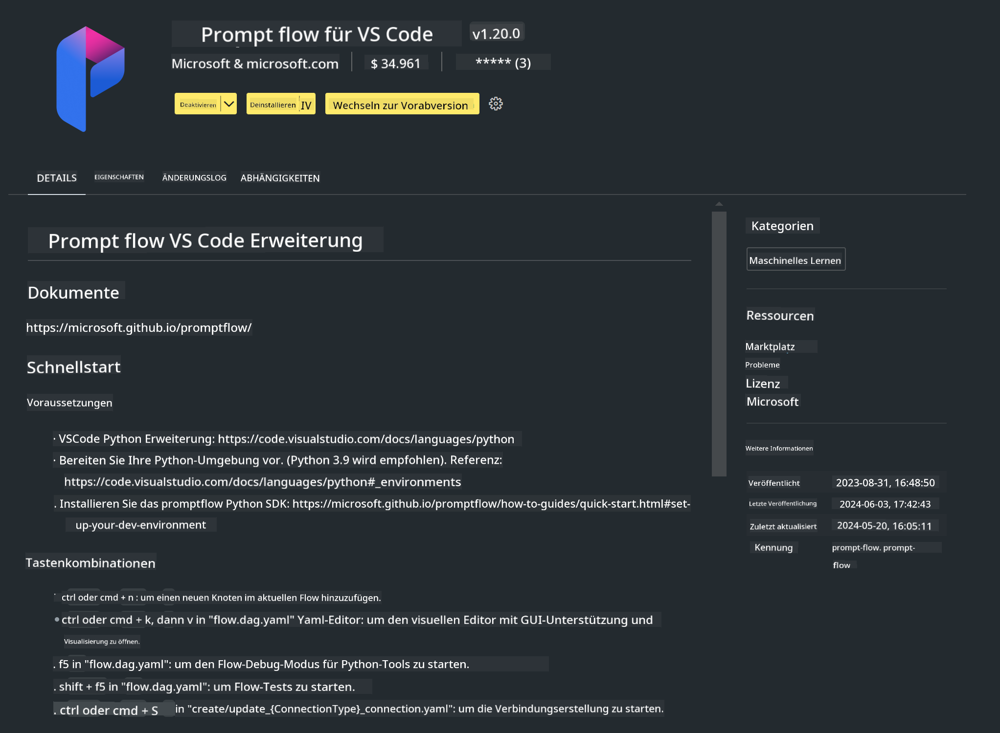

<!--
CO_OP_TRANSLATOR_METADATA:
{
  "original_hash": "a4ef39027902e82f2c33d568d2a2259a",
  "translation_date": "2025-03-27T11:48:09+00:00",
  "source_file": "md\\02.Application\\02.Code\\Phi3\\VSCodeExt\\HOL\\AIPC\\01.Installations.md",
  "language_code": "de"
}
-->
# **Lab 0 - Installation**

Wenn wir das Lab betreten, müssen wir die entsprechende Umgebung konfigurieren:

### **1. Python 3.11+**

Es wird empfohlen, miniforge zu verwenden, um deine Python-Umgebung zu konfigurieren.

Um miniforge zu konfigurieren, besuche bitte [https://github.com/conda-forge/miniforge](https://github.com/conda-forge/miniforge).

Nach der Konfiguration von miniforge führe den folgenden Befehl in PowerShell aus:

```bash

conda create -n pyenv python==3.11.8 -y

conda activate pyenv

```

### **2. Prompt flow SDK installieren**

In Lab 1 verwenden wir Prompt flow, daher musst du das Prompt flow SDK einrichten.

```bash

pip install promptflow --upgrade

```

Du kannst das Prompt flow SDK mit diesem Befehl überprüfen:

```bash

pf --version

```

### **3. Visual Studio Code Prompt flow Erweiterung installieren**



### **4. Intel NPU-Beschleunigungsbibliothek**

Die neuen Prozessoren von Intel unterstützen NPU. Wenn du NPU verwenden möchtest, um LLMs / SLMs lokal auszuführen, kannst du die ***Intel NPU-Beschleunigungsbibliothek*** verwenden. Wenn du mehr erfahren möchtest, lies [https://github.com/microsoft/PhiCookBook/blob/main/md/01.Introduction/03/AIPC_Inference.md](https://github.com/microsoft/PhiCookBook/blob/main/md/01.Introduction/03/AIPC_Inference.md).

Installiere die Intel NPU-Beschleunigungsbibliothek in Bash:

```bash

pip install intel-npu-acceleration-library

```

***Hinweis***: Bitte beachte, dass diese Bibliothek ***transformers 4.40.2*** unterstützt. Überprüfe die Version.

### **5. Weitere Python-Bibliotheken**

Erstelle eine Datei namens requirements.txt und füge diesen Inhalt hinzu:

```txt

notebook
numpy 
scipy 
scikit-learn 
matplotlib 
pandas 
pillow 
graphviz

```

### **6. NVM installieren**

Installiere nvm in PowerShell:

```bash

winget install -e --id CoreyButler.NVMforWindows

```

Installiere Node.js Version 18.20:

```bash

nvm install 18.20.0

nvm use 18.20.0

```

### **7. Entwicklungsunterstützung für Visual Studio Code installieren**

```bash

npm install --global yo generator-code

```

Herzlichen Glückwunsch! Du hast das SDK erfolgreich konfiguriert. Fahre nun mit den praktischen Schritten fort.

**Haftungsausschluss**:  
Dieses Dokument wurde mithilfe des KI-Übersetzungsdienstes [Co-op Translator](https://github.com/Azure/co-op-translator) übersetzt. Obwohl wir uns um Genauigkeit bemühen, weisen wir darauf hin, dass automatisierte Übersetzungen Fehler oder Ungenauigkeiten enthalten können. Das Originaldokument in seiner ursprünglichen Sprache sollte als maßgebliche Quelle betrachtet werden. Für kritische Informationen wird eine professionelle menschliche Übersetzung empfohlen. Wir übernehmen keine Haftung für Missverständnisse oder Fehlinterpretationen, die durch die Nutzung dieser Übersetzung entstehen könnten.